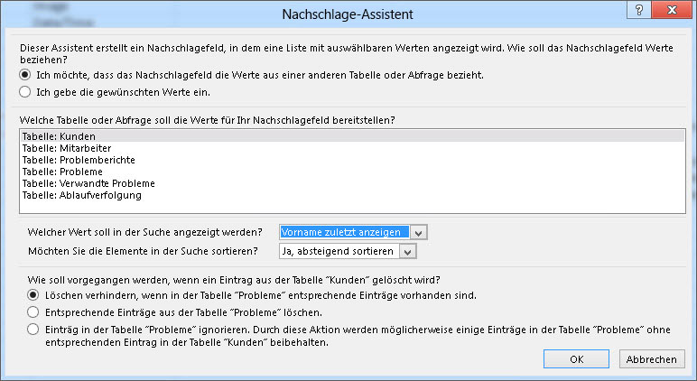
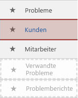
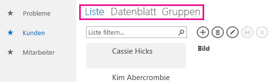
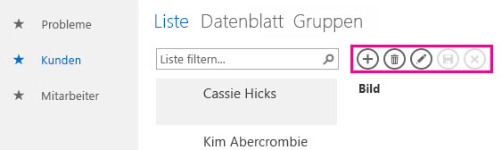
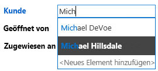
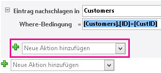
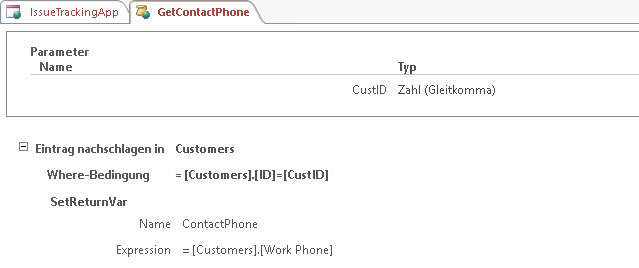
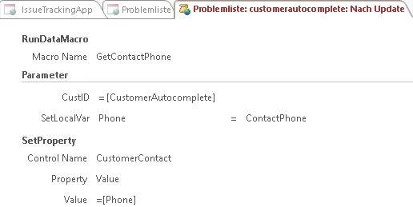
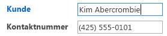

# Erstellen und Anpassen einer Web-App in Access

> [!IMPORTANT]
> Das Erstellen und Verwenden von Access-Web-Apps in SharePoint wird von Microsoft nicht mehr empfohlen. Alternativ sollten Sie die Verwendung von [Microsoft PowerApps](https://powerapps.microsoft.com/en-us/) für das Erstellen von Business Solutions ohne Code für das Web und für mobile Geräte in Betracht ziehen. 
  
Access 2013 umfasst ein neues Anwendungsmodell, das Experten das schnelle Erstellen webbasierter Anwendungen ermöglicht. In Access sind eine Reihe an Vorlagen enthalten, die Sie für den schnellen Einstieg beim Erstellen Ihrer Anwendung verwenden können.

## Voraussetzungen für das Erstellen einer App mit Access 2013

Um die Schritte in diesem Beispiel auszuführen, benötigen Sie Folgendes:
  
- Access
    
- Eine SharePoint-Entwicklungsumgebung
    
Weitere Informationen über das Einrichten Ihrer SharePoint-Entwicklungsumgebung finden Sie unter [Einrichten einer allgemeinen Entwicklungsumgebung für SharePoint](https://docs.microsoft.com/sharepoint/dev/general-development/set-up-a-general-development-environment-for-sharepoint). 
  
Weitere Informationen über das Abrufen von Access und SharePoint finden Sie unter [Downloads](https://msdn.microsoft.com/office/apps/fp123627).

## Erstellen der App

Angenommen, Sie möchten eine Access-App erstellen, die Probleme für Ihr Unternehmen verfolgt. Bevor Sie mit dem Erstellen der Tabellen und Ansicht von Grund auf beginnen, sollten Sie nach einer Schemavorlage suchen, die Ihre Anforderungen erfüllt.
  
### So erstellen Sie die Problemverfolgungs-App

1. Öffnen Sie Access, und wählen Sie **Benutzerdefinierte Web App** aus.
    
2. Geben Sie einen Namen und den Webspeicherort für Ihre App ein. Sie können auch einen Speicherort aus der Liste **Speicherorte** und **Erstellen** auswählen.
    
3. Geben Sie **Probleme** in das Feld **Was möchten Sie verfolgen?** ein, und drücken Sie dann die EINGABETASTE. 
    
   Eine Liste der Vorlagen, die für die Problemverfolgung möglicherweise nützlich sind, wird in Abbildung 1 dargestellt.
    
   **Abbildung 1. Vorlagen für die Problemverfolgung**

   
  
4. Wählen Sie **Probleme** aus.
    
Access erstellt einen Satz an Tabellen und Ansichten.
  
## Untersuchen der App

Damit Sie verstehen, ob das Schema und die Ansichten Ihre Anforderungen erfüllen, sollten Sie sie prüfen.
  
Die durch Auswahl des Schemas für Probleme erstellten Tabellen werden im Kachelbereich angezeigt. Die Tabellen „Probleme“, „Kunde“ und „Mitarbeiter“ bilden den Schwerpunkt der App. In der Tabelle „Probleme“ sind Informationen über jedes Problem gespeichert. Jedes Problem wird durch einen Mitarbeiter geöffnet und auf Veranlassung eines Kunden einem Mitarbeiter zugewiesen. Die Tabellen „Verwandte Probleme“ und „Problemberichte“ spielen eine unterstützende Rolle in der App. Die Tabelle „Verwandte Probleme“ ermöglicht Ihnen, ein Problem mit einem anderen zu verknüpfen. Die Tabelle „Problemberichte“ speichert mehrere Kommentare für ein einzelnes Problem.
  
In einer Access-Desktop-PC-Datenbank (.accdb) werden die Beziehungen zwischen Tabellen im Fenster **Beziehungen** verwaltet. Access 2013-Apps verwalten Beziehungen durch die Verwendung von Feldern, die auf den Datentyp **Nachschlagen** festgelegt sind. Im Folgenden überprüfen wir die Beziehungen für die Tabelle „Probleme", indem wir mit der rechten Maustaste auf die Kachel **Probleme** klicken und **Tabelle bearbeiten** auswählen.
  
Das Feld **Kunde** steht im Zusammenhang mit der Tabelle **Kunden**. Wählen Sie zum Überprüfen der Beziehung das Feld **Kunde** und dann die Option zum Ändern der Nachschlagefunktion**** aus. Der**** Nachschlage-Assistent wird analog zur Darstellung in Abbildung 2 angezeigt. 
  
**Abbildung 2. Der die Beziehung zur Tabelle „Kunden“ anzeigende Nachschlage-Assistent**

  
Das Dialogfeld „Nachschlage-Assistent" zeigt, dass das Feld **Kunde** mit der Tabelle **Kunden** verknüpft ist und dass **Anzeigename Vorname Nachname** von der Tabelle **Kunden** zurückgegeben wird. 
  
Die Felder **Geöffnet von**, **Zugewiesen an** und **Geändert von** stehen mit der Tabelle **Mitarbeiter** im Zusammenhang. Verschiedene andere Felder sind auch auf den Datentyp **Nachschlagen** festgelegt. In diesen Fällen wird der Datentyp „Nachschlagen" zum Angeben bestimmter, im Feld zulässiger Werte verwendet. 
  
Schließen Sie die Tabelle **Probleme**, und überprüfen Sie den Kachelbereich. Die oberen drei Kacheln für die Tabellen **Probleme**, **Kunden** und **Mitarbeiter** werden analog zur Darstellung in Abbildung 3 anders dargestellt als die unteren zwei Kacheln für die Tabellen **Verwandte Probleme** und **Problemberichte**. 
  
**Abbildung 3. Kachelbereich für das Schema „Probleme“**

  
Die Tabellen **Verwandte Probleme** und **Problemberichte** sind abgeblendet, da sie dem Benutzer im Webbrowser nicht angezeigt werden sollen. 
  
Wir verwenden die App nun zum Verfolgen einiger Probleme. Klicken Sie dafür auf **App starten** zum Öffnen der App in Ihrem Webbrowser. 
  
Die App öffnet die Ansicht **Problemliste** der Tabelle „Probleme". Vor dem Hinzufügen eines Problems empfiehlt es sich, einige Kunden und Mitarbeiter hinzuzufügen. Klicken Sie auf die Kachel **Kunden** zum Hinzufügen von Kunden. 
  
Verwenden Sie die Ansichtsauswahl zum Auswählen einer der drei verfügbaren Ansichten für die Tabelle **Kunden**, die analog zur Darstellung in Abbildung 4 als **Liste**, **Datenblatt** und **Gruppen** bezeichnet werden. 
  
**Abbildung 4. Ansichtsauswahl**

  
Durch das Auswählen von **Liste** wird die Ansicht **Kundenliste** aktiviert, die eine Ansicht vom Typ „Detailinformationen" ist. „Detailinformationen" ist eine der durch Access automatisch generierten Ansichten, wenn Sie eine Tabelle erstellen. Das Hauptmerkmal einer Ansicht vom Typ „Detailinformationen" ist der Listenbereich, der im linken Bereich der Ansicht angezeigt wird. Der Listenbereich wird zum Filtern und Navigieren der in der Ansicht enthaltenen Datensätze verwendet. Für das Implementieren einer durchsuchbaren Liste in einer Access-Desktop-PC-Datenbank müsste benutzerdefinierter Code geschrieben werden. 
  
Wenn Sie **Datenblatt** auswählen, wird die Ansicht **Kundendatenblatt** angezeigt. Das Datenblatt ist die andere Ansicht, die Access automatisch generiert, wenn Sie eine Tabelle erstellen. In Datenblattansichten können Sie Daten ähnlich wie bei einer Kalkulationstabelle eingeben, sortieren und filtern. 
  
Durch das Auswählen von „Gruppen“ wird eine Ansicht vom Typ „Zusammenfassung“ geöffnet. Ansichten vom Typ „Zusammenfassung“ können zum Gruppieren von Datensätzen auf Grundlage eines Felds und zum optionalen Berechnen einer Summe oder eines Mittelwerts verwendet werden.
  
Verwenden Sie beim Hinzufügen von Kunden die Aktionsleiste zum Hinzufügen, Bearbeiten, Speichern, Löschen von Datensätzen und zum Abbrechen von Bearbeitungen. Bei der Aktionsleiste handelt es sich um eine anpassbare Symbolleiste, die analog zur Darstellung in Abbildung 5 in jeder Ansicht oben angezeigt wird.
  
**Abbildung 5. Aktionsleiste**

  
Sobald Sie einige Kunden und Mitarbeiter hinzugefügt haben, öffnen Sie die Ansicht „Problemliste", und fügen Sie ein Problem hinzu. Wenn Sie den Namen eines Kunden in das Feld „Kunde" eingeben, wird analog zur Darstellung in Abbildung 6 mindestens ein Kundenname angezeigt.
  
**Abbildung 6. AutoVervollständigen-Steuerelement**

  
Das Feld „Kunde" ist ein AutoVervollständigen-Steuerelement. Das AutoVervollständigen-Steuerelement zeigt eine Liste von Datensätzen an, die mit dem, was Sie in das Feld eingeben, übereinstimmen. Dadurch wird die Genauigkeit der Dateneingabe sichergestellt.
  
## Anpassen der App

Da Sie die App nun begutachtet haben, stellen Sie fest, dass die Ansicht „Problemliste" keine Kontaktinformationen für den Kunden enthält. Im Folgenden passen wir die App an, um der Tabelle „Probleme" die geschäftliche Telefonnummer des Kunden hinzuzufügen, während das Problem erstellt wird.
  
### So fügen Sie der Tabelle „Probleme“ ein Feld hinzu

1. Öffnen Sie die App in Access.
    
2. Wählen Sie die Kachel **Probleme**, das Symbol **Einstellungen/Aktion** und dann **Tabelle bearbeiten** aus.
    
3. Geben Sie **Telefonnummer** in die erste leere Zelle in der Spalte **Feldname** ein. 
    
4. Wählen Sie **Kurzer Text** in der Spalte **Datentyp** aus. 
    
5. Wählen Sie **Speichern** aus.
    
6. Schließen Sie die Tabelle „Probleme“.
    
Da nun ein Feld zum Speichern der Telefonnummer vorhanden ist, erstellen wir nun ein Datenmakro zum Nachschlagen der Kontaktinformationen.
  
### So erstellen Sie das Datenmakro zum Nachschlagen von Kontaktinformationen

1. Wählen Sie in der Gruppe **Erstellen** die Option **Erweitert** und dann **Datenmakro** aus.
    
2. Wählen Sie **Parameter erstellen** aus.
    
3. Geben Sie **CustID** in das Feld **Name** ein. Wählen Sie im Dropdownmenü **Typ** die Option **Zahl (Gleitkomma)** aus.
    
4. Wählen Sie **LookupRecord** im Dropdownmenü **Neue Aktion hinzufügen** aus. 
    
5. Wählen Sie **Kunden** im Dropdownmenü **Datensatz nachschlagen in** aus. 
    
6. Geben Sie **[Customers].[ID]=[CustID]** in das Feld **Bedingung** ein. 
    
7. Wählen Sie **SetReturnVar** im Dropdownmenü **Neue Aktion hinzufügen** aus. 
    
    > [!NOTE]
    > Es werden zwei Dropdownmenüs vom Typ **Neue Aktion hinzufügen** im Block **LookupRecord** und ein weiteres außerhalb des Blocks **LookupRecord** angezeigt. Sie sollten analog zur Darstellung in Abbildung 7 das Dropdownmenü **Neue Aktion hinzufügen** im Block **LookupRecord** verwenden. 
  
   **Abbildung 7. Dropdown „Neue Aktion hinzufügen“**

   
  
8. Geben Sie **ContactPhone** in das Feld **Name** ein. 
    
9. Geben Sie **[Customers].[Work Phone]** in das Feld **Ausdruck** ein. 
    
10. Wählen Sie **Speichern** aus. Geben Sie **GetContactPhone** in das Feld **Makroname** ein, und wählen Sie dann **OK** aus.
    
    Das Makro sollte dem Makro in Abbildung 8 gleichen.
    
    **Abbildung 8. GetContactPhone-Datenmakro**

    
  
11. Schließen Sie die Entwurfsansicht für das Makro.
    
Nun können wir dem Formular „Problemliste" das Feld **Telefonnummer** hinzufügen. 
  
### So fügen Sie das Feld „Telefonnummer“ zum Formular „Problemliste“ hinzu

1. Wählen Sie die Tabelle **Probleme** aus. Dadurch wird das Formular „Problemliste" ausgewählt. 
    
2. Wählen Sie in der Ansichtsauswahl **Liste**, das Symbol **Einstellungen/Aktion** und anschließend **Bearbeiten** aus.
    
3. Ziehen Sie das Feld **Telefonnummer** aus dem Bereich **Feldliste** zur Position auf dem Formular, wo die Telefonnummer angezeigt werden soll. 
    
4. Wählen Sie das Textfeld **Telefonnummer** aus, und klicken Sie dann auf **Daten**. 
    
5. Geben Sie **CustomerContact** in das Feld **Steuerelementname** ein, und schließen Sie dann das Popup **Daten**. 
    
6. Wählen Sie **Speichern** aus.
    
Nun sollten wir ein Benutzeroberflächenmakro schreiben, welches das Feld **Telefon (geschäftlich)** aus der Tabelle **Kunden** in das Feld **Telefonnummer** der Tabelle **Probleme** kopiert. Das Ereignis **Nach Aktualisierung** des Steuerelements **CustomerAutocomplete** ist ein geeigneter Ort für das Makro. 
  
### So erstellen Sie das AfterUpdate-Makro

1. Wählen Sie das Steuerelement **CustomerAutocomplete**, die Schaltfläche **Aktionen** und dann **Nach Aktualisierung** aus. 
    
    In der Entwurfsansicht für das Makro wird ein leeres Makro geöffnet.
    
2. Wählen Sie **RunDataMacro** im Dropdownmenü **Neue Aktion hinzufügen** aus. 
    
3. Wählen Sie **GetContactPhone** im Dropdownmenü **Makroname** aus. 
    
4. Geben Sie **[CustomerAutocomplete]** in das Feld **CustID** ein. 
    
5. Geben Sie **Telefon** in das Feld **SetLocalVar** ein. 
    
    Wenn Sie das zuvor erstellte GetContactPhone-Datenmakro auswählen, hat Access den Parameternamen und Rückgabewert für das Makro automatisch ausgefüllt.
    
    Die Telefonnummer für den Kunden wird in einer Variablen namens „Phone“ gespeichert.
    
6. Wählen Sie **SetProperty** im Dropdownmenü **Neue Aktion hinzufügen** aus. 
    
7. Geben Sie **CustomerContact** in das Feld **Steuerelementname** ein. 
    
8. Wählen Sie **Wert** im Dropdownmenü **Eigenschaft** aus. 
    
9. Geben Sie **=[Phone]** in das Feld **Wert** ein. 
    
10. Wählen Sie **Speichern** aus.
    
    Das Makro sollte dem Makro in Abbildung 9 gleichen.
    
    **Abbildung 9. AfterUpdate-Makro**

    
  
11. Schließen Sie die Entwurfsansicht für das Makro.
    
12. Schließen Sie die Ansicht „Problemliste“. Wählen Sie **Ja** aus, wenn Sie dazu aufgefordert werden, Ihre Änderungen zu speichern. 
    
Jetzt können Sie die Anpassung formulieren. Klicken Sie auf **App starten**, um die App in Ihrem Webbrowser zu öffnen, und fügen Sie dann ein neues Problem ein. Das Feld **Telefonnummer** wird automatisch aktualisiert, nachdem der Kundenname analog zur Darstellung in Abbildung 10 eingegeben wurde. 
  
**Abbildung 10. Mit Telefonnummer aktualisierte Ansicht vom Typ „Probleme“**

  
## Schlussbemerkung

Die Verwendung einer der in enthaltenen Schemavorlagen ist eine gute Einstiegsmöglichkeit für das Erstellen einer Access-Web-App. Die automatisch für Sie erstellten Ansichten verfügen über eine erweiterte Funktionalität, für die das Implementieren von benutzerdefiniertem Code in einer Access-Desktop-PC-Datenbank erforderlich ist. 
  
## Siehe auch

- [Neuigkeiten für Access 2013-Entwickler](https://msdn.microsoft.com/library/df778f51-d65e-4c30-b618-65003ceb39b3%28Office.15%29.aspx) 
- [Benutzerdefinierte Web-App-Referenz für Access](access-custom-web-app-reference.md)
  

