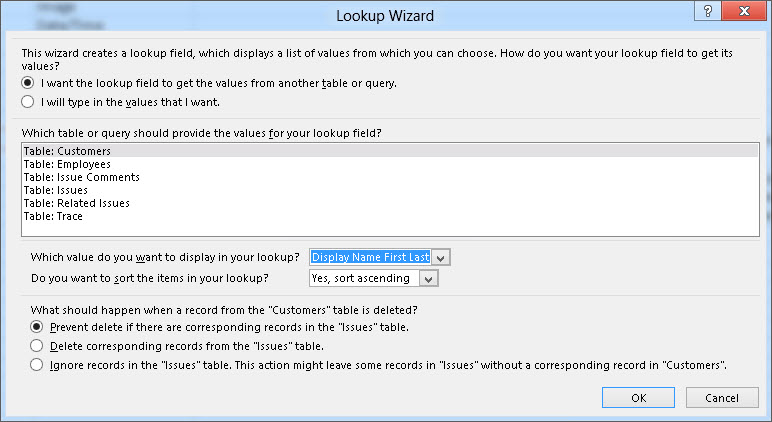
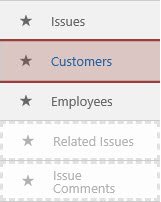
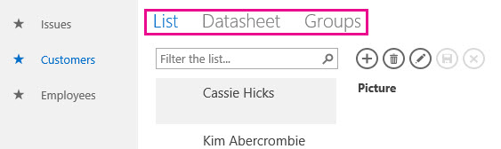
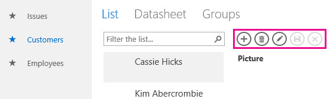
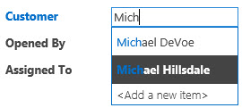
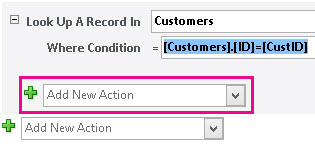
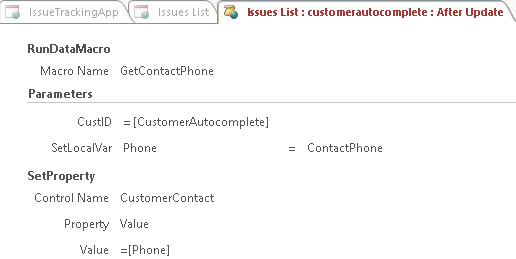
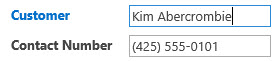

# Erstellen und Anpassen einer Web-app in AccessCreate and customize a web app in Access

> [!IMPORTANT]
> [!WICHTIG] Das Erstellen und Verwenden von Access-Web-Apps in SharePoint wird von Microsoft nicht mehr empfohlen. Alternativ sollten Sie die Verwendung von [Microsoft PowerApps](https://powerapps.microsoft.com/en-us/) für das Erstellen von Business Solutions ohne Code für das Web und für mobile Geräte in Betracht ziehen.Microsoft no longer recommends creating and using Access web apps in SharePoint. As an alternative, consider using [Microsoft PowerApps](https://powerapps.microsoft.com/en-us/) to build no-code business solutions for the web and mobile devices. 
  
Access 2013 umfasst ein neues Anwendungsmodell, das Experten das schnelle Erstellen webbasierter Anwendungen ermöglicht. In Access sind eine Reihe an Vorlagen enthalten, die Sie für den schnellen Einstieg beim Erstellen Ihrer Anwendung verwenden können.Access 2013 features a new application model that enables subject matter experts to quickly create web-based applications. Included with Access are a set of templates that you can use to jump start creating your application.

## Voraussetzungen für das Erstellen einer App mit Access 2013Prerequisites for building an app with Access 2013

Um die Schritte in diesem Beispiel auszuführen, benötigen Sie Folgendes:To follow the steps in this example, you need the following:
  
- AccessAccess
    
- Eine SharePoint-EntwicklungsumgebungA SharePoint development environment
    
Weitere Informationen zum Einrichten Ihrer SharePoint-Entwicklungsumgebung finden Sie unter [Einrichten einer Umgebung allgemeine Entwicklung für SharePoint](https://docs.microsoft.com/en-us/sharepoint/dev/general-development/set-up-a-general-development-environment-for-sharepoint).For more information about setting up your SharePoint development environment, see [Set up a general development environment for SharePoint](https://docs.microsoft.com/en-us/sharepoint/dev/general-development/set-up-a-general-development-environment-for-sharepoint). 
  
Weitere Informationen über das Abrufen von Access und SharePoint finden Sie unter [Downloads](http://msdn.microsoft.com/en-US/office/apps/fp123627).For more information about obtaining Access and SharePoint, see [Downloads](http://msdn.microsoft.com/en-US/office/apps/fp123627).

## Erstellen der AppCreate the app

Angenommen, Sie möchten eine Access-App erstellen, die Probleme für Ihr Unternehmen verfolgt. Bevor Sie mit dem Erstellen der Tabellen und Ansicht von Grund auf beginnen, sollten Sie nach einer Schemavorlage suchen, die Ihre Anforderungen erfüllt.Suppose you want to create an Access app that tracks issues for your business. Before you start creating the tables and view from scratch, you should search for a schema template that meets your needs.
  
### So erstellen Sie die Problemverfolgungs-AppTo create the issue tracking app

1. Öffnen Sie Access, und wählen Sie **Benutzerdefinierte Web App** aus.Open Access and choose **Custom web app**.
    
2. Geben Sie einen Namen und den Webspeicherort für Ihre App ein. Sie können auch einen Speicherort aus der Liste **Speicherorte** und **Erstellen** auswählen.Enter a name and the web location for your app. You can also choose a location from the **Locations** list and choose **Create**.
    
3. Geben Sie **Probleme** in das Feld **Was möchten Sie verfolgen?** ein, und drücken Sie dann die EINGABETASTE.Type **Issues** into the **What would you like to track?** box and then press ENTER. 
    
   Eine Liste der Vorlagen, die für die Problemverfolgung möglicherweise nützlich sind, wird in Abbildung 1 dargestellt.A list of templates that might be useful for tracking issues is displayed in Figure 1.
    
   **Abbildung 1. Vorlagen für die Problemverfolgung****Figure 1. Templates that match the search for issues**

   ![Vorlagen, die die Suche nach Problemen übereinstimmen] (media/odc_Access15_CreateAndCustomizeWebApp_Figure01.JPG "Vorlagen, die die Suche nach Problemen übereinstimmen")
  
4. Wählen Sie **Probleme** aus.Choose **Issues**.
    
Access erstellt einen Satz an Tabellen und Ansichten.Access creates a set of tables and views.
  
## Untersuchen der AppExplore the app

Damit Sie verstehen, ob das Schema und die Ansichten Ihre Anforderungen erfüllen, sollten Sie sie prüfen.To understand whether the schema and views meet your needs, you should examine them.
  
Die durch Auswahl des Schemas für Probleme erstellten Tabellen werden im Kachelbereich angezeigt. Die Tabellen „Probleme", „Kunde" und „Mitarbeiter" bilden den Schwerpunkt der App. In der Tabelle „Probleme" sind Informationen über jedes Problem gespeichert. Jedes Problem wird durch einen Mitarbeiter geöffnet und auf Veranlassung eines Kunden einem Mitarbeiter zugewiesen. Die Tabellen „Verwandte Probleme" und „Problemberichte" spielen eine unterstützende Rolle in der App. Die Tabelle „Verwandte Probleme" ermöglicht Ihnen, ein Problem mit einem anderen zu verknüpfen. Die Tabelle „Problemberichte" speichert mehrere Kommentare für ein einzelnes Problem.The tables created by selecting the Issues schema are displayed in the Tile Pane. The Issues, Customer, and Employees tables are the main focus of the app. The Issues table stores information about each issue. Each issue is opened by and assigned to an employee on behalf of a customer. The Related Issues and Issue Comments tables play a supporting role in the app. The Related Issues table enables you to link one issue to another. The Issue Comments table stores multiple comments for a single issue.
  
In einer Access-Desktop-PC-Datenbank (.accdb) werden die Beziehungen zwischen Tabellen im Fenster **Beziehungen** verwaltet. Access 2013-Apps verwalten Beziehungen durch die Verwendung von Feldern, die auf den Datentyp **Nachschlagen** festgelegt sind. Im Folgenden überprüfen wir die Beziehungen für die Tabelle „Probleme", indem wir mit der rechten Maustaste auf die Kachel **Probleme** klicken und **Tabelle bearbeiten** auswählen.In an Access desktop (.accdb) database, the relationships between tables are managed in the **Relationships** window. Access 2013 apps manage relationships by using fields set to the **Lookup** data type. Let's examine the relationships for the Issues table by right-clicking the **Issues** tile and selecting **Edit Table**.
  
Das Feld **Kunde** bezieht sich auf der **Customers** -Tabelle.The **Customer** field is related to the **Customers** table. Um die Beziehung zu untersuchen, wählen Sie das Feld **Kunde** aus, und wählen Sie dann **Lookups ändern**.To examine the relationship, select the **Customer** field and then select **Modify Lookups**. Der **Nachschlage-Assistent** wird angezeigt, wie in Abbildung 2 dargestellt.The **Lookup Wizard** is displayed, as shown in Figure 2. 
  
**Abbildung 2. Der die Beziehung zur Tabelle „Kunden" anzeigende Nachschlage-Assistent****Figure 2. Lookup Wizard displaying the relationship to the Customers table**

![Suchassistent mit Anzeige der Beziehung] (media/odc_Access15_CreateAndCustomizeWebApp_Figure02.jpg "Suchassistent mit Anzeige der Beziehung")
  
Das Dialogfeld „Nachschlage-Assistent" zeigt, dass das Feld **Kunde** mit der Tabelle **Kunden** verknüpft ist und dass **Anzeigename Vorname Nachname** von der Tabelle **Kunden** zurückgegeben wird.The Lookup Wizard dialog box shows that the **Customer** field is linked to the **Customers** table and to return the **Display Name First Last** field from the **Customers** table. 
  
Die Felder **Geöffnet von**, **Zugewiesen an** und **Geändert von** stehen mit der Tabelle **Mitarbeiter** im Zusammenhang. Verschiedene andere Felder sind auch auf den Datentyp **Nachschlagen** festgelegt. In diesen Fällen wird der Datentyp „Nachschlagen" zum Angeben bestimmter, im Feld zulässiger Werte verwendet.The **Opened By**, **Assigned To**, and **Changed By** fields are related to the **Employees** table. Several other fields are also set to the **Lookup** data type. In these cases, the Lookup data type is used to specify the specific values to allow for in the field. 
  
Schließen Sie die Tabelle **Probleme**, und überprüfen Sie den Kachelbereich. Die oberen drei Kacheln für die Tabellen **Probleme**, **Kunden** und **Mitarbeiter** werden analog zur Darstellung in Abbildung 3 anders dargestellt als die unteren zwei Kacheln für die Tabellen **Verwandte Probleme** und **Problemberichte**.Close the **Issues** table and examine the Tile Pane. The top three tiles, for the **Issues**, **Customers**, and **Employees** tables, are displayed differently than the bottom two tiles for the **Related Issues** and **Issue Comments** table, as shown in Figure 3. 
  
**Abbildung 3. Kachelbereich für das Schema „Probleme"****Figure 3. Tile Pane for the Issues schema**

![Kachelbereich für das problemschema] (media/odc_Access15_CreateAndCustomizeWebApp_Figure03.jpg "Kachelbereich für das problemschema")
  
Die Tabellen **Verwandte Probleme** und **Problemberichte** sind abgeblendet, da sie dem Benutzer im Webbrowser nicht angezeigt werden sollen.The **Related Issues** and **Issue Comments** tables are dimmed because they are to be hidden from the user in the web browser. 
  
Wir verwenden die App nun zum Verfolgen einiger Probleme. Klicken Sie dafür auf **App starten** zum Öffnen der App in Ihrem Webbrowser.Let's use the app to track some issues. To do this, click **Launch App** to open the app in your web browser. 
  
Die App öffnet die Ansicht **Problemliste** der Tabelle „Probleme". Vor dem Hinzufügen eines Problems empfiehlt es sich, einige Kunden und Mitarbeiter hinzuzufügen. Klicken Sie auf die Kachel **Kunden** zum Hinzufügen von Kunden.The app opens the **Issues List** view of the Issues table. Before adding an issue, it would be a good idea to add some customers and employees. Click the **Customers** tile to start adding customers. 
  
Verwenden Sie die Ansichtsauswahl zum Auswählen einer der drei verfügbaren Ansichten für die Tabelle **Kunden**, die analog zur Darstellung in Abbildung 4 als **Liste**, **Datenblatt** und **Gruppen** bezeichnet werden.Use the View Selector to choose one of three views available for the **Customers** table, labeled **List**, **Datasheet**, and **Groups** as shown in Figure 4. 
  
**Abbildung 4. Ansichtsauswahl****Figure 4. View Selector**

![Ansichtsauswahl] (media/odc_Access15_CreateAndCustomizeWebApp_Figure04.jpg "Ansichtsauswahl")
  
Durch das Auswählen von **Liste** wird die Ansicht **Kundenliste** aktiviert, die eine Ansicht vom Typ „Detailinformationen" ist. „Detailinformationen" ist eine der durch Access automatisch generierten Ansichten, wenn Sie eine Tabelle erstellen. Das Hauptmerkmal einer Ansicht vom Typ „Detailinformationen" ist der Listenbereich, der im linken Bereich der Ansicht angezeigt wird. Der Listenbereich wird zum Filtern und Navigieren der in der Ansicht enthaltenen Datensätze verwendet. Für das Implementieren einer durchsuchbaren Liste in einer Access-Desktop-PC-Datenbank müsste benutzerdefinierter Code geschrieben werden.Choosing **List** activates the **Customers List** view, which is a List Details view. List Details is one of the views Access automatically generates when you create a table. The main feature that distinguishes a List Details view is the list pane that appears on the left side of the view. The list pane is used to filter and navigate the records contained in the view. In an Access desktop database, implementing a searchable list view would require writing custom code. 
  
**Datenblatt** auswählen, wird die **Kunden** Datenblattansicht geöffnet.Choosing **Datasheet** opens the **Customers Datasheet** view. Datenblatt ist die andere Art der Ansicht, die Access automatisch generiert, wenn Sie eine Tabelle erstellen.Datasheet is the other kind of view Access automatically generates when you create a table. Datenblattansichten sind hilfreich für Personen, die es leichter zu geben, Sortieren und Filtern von Daten in einer Kalkulationstabelle-ähnlichen Weise.Datasheet views are useful for those who find it easier to enter, sort, and filter data in a spreadsheet-like manner. 
  
Durch das Auswählen von „Gruppen" wird eine Ansicht vom Typ „Zusammenfassung" geöffnet. Ansichten vom Typ „Zusammenfassung" können zum Gruppieren von Datensätzen auf Grundlage eines Felds und zum optionalen Berechnen einer Summe oder eines Mittelwerts verwendet werden.Choosing Groups opens a Summary view. Summary views can be used to group records based on a field and optionally calculate a sum or average.
  
Verwenden Sie beim Hinzufügen von Kunden die Aktionsleiste zum Hinzufügen, Bearbeiten, Speichern, Löschen von Datensätzen und zum Abbrechen von Bearbeitungen. Bei der Aktionsleiste handelt es sich um eine anpassbare Symbolleiste, die analog zur Darstellung in Abbildung 5 in jeder Ansicht oben angezeigt wird.As you're adding customers, use the Action Bar to add records, edit records, save records, delete records, and cancel edits. The Action Bar is a customizable toolbar that appears at the top of each view, as shown in Figure 5.
  
**Abbildung 5. Aktionsleiste****Figure 5. Action Bar**

![Aktionsleiste] (media/odc_Access15_CreateAndCustomizeWebApp_Figure05.jpg "Aktionsleiste")
  
Sobald Sie einige Kunden und Mitarbeiter hinzugefügt haben, öffnen Sie die Ansicht „Problemliste", und fügen Sie ein Problem hinzu. Wenn Sie den Namen eines Kunden in das Feld „Kunde" eingeben, wird analog zur Darstellung in Abbildung 6 mindestens ein Kundenname angezeigt.Once you've added some customers and employees open the Issues List view and start adding an issue. As you type the name of a customer into the into the Customer box, one or more of the customer names will appear, as shown in Figure 6.
  
**Abbildung 6. AutoVervollständigen-Steuerelement****Figure 6. AutoComplete control**

![Steuerelement ' AutoVervollständigen '] (media/odc_Access15_CreateAndCustomizeWebApp_Figure06.jpg "Steuerelement ' AutoVervollständigen '")
  
Das Feld „Kunde" ist ein AutoVervollständigen-Steuerelement. Das AutoVervollständigen-Steuerelement zeigt eine Liste von Datensätzen an, die mit dem, was Sie in das Feld eingeben, übereinstimmen. Dadurch wird die Genauigkeit der Dateneingabe sichergestellt.The Customer box is an AutoComplete control. The AutoComplete control displays a list of records that match what you're typing into the box. This helps ensure the accuracy of data entry.
  
## Anpassen der AppCustomize the app

Da Sie die App nun begutachtet haben, stellen Sie fest, dass die Ansicht „Problemliste" keine Kontaktinformationen für den Kunden enthält. Im Folgenden passen wir die App an, um der Tabelle „Probleme" die geschäftliche Telefonnummer des Kunden hinzuzufügen, während das Problem erstellt wird.Now that you've taken a tour of the app, you notice that the Issues List view doesn't contain contact information for the customer. Let's customize the app to add the customer's work phone to the Issues table as the issue is being created.
  
### So fügen Sie der Tabelle „Probleme" ein Feld hinzuTo add a field to the Issues table

1. Öffnen Sie die App in Access.Open the app in Access.
    
2. Wählen Sie die Kachel **Probleme**, das Symbol **Einstellungen/Aktion** und dann **Tabelle bearbeiten** aus.Choose the **Issues** tile, choose the **Settings/Action** icon, and then choose **Edit Table**.
    
3. Geben Sie **Telefonnummer** in die erste leere Zelle in der Spalte **Feldname** ein.Enter **Contact Number** in the first blank cell in the **Field Name** column. 
    
4. Wählen Sie **Kurzer Text** in der Spalte **Datentyp** aus.Choose **Short Text** in the **Data Type** column. 
    
5. Wählen Sie **Speichern** aus.Choose **Save**.
    
6. Schließen Sie die Tabelle „Probleme".Close the Issues table.
    
Da nun ein Feld zum Speichern der Telefonnummer vorhanden ist, erstellen wir nun ein Datenmakro zum Nachschlagen der Kontaktinformationen.Now that we have field in which to store the phone number, let's create a data macro to look up the contact information.
  
### So erstellen Sie das Datenmakro zum Nachschlagen von KontaktinformationenTo create the data macro to look up contact information

1. Wählen Sie in der Gruppe **Erstellen** die Option **Erweitert** und dann **Datenmakro** aus.In the **Create** group, choose **Advanced**, and then choose **Data Macro**.
    
2. Wählen Sie **Parameter erstellen** aus.Choose **Create Parameter**.
    
3. Geben Sie **CustID** in das Feld **Name** ein. Wählen Sie im Dropdownmenü **Typ** die Option **Zahl (Gleitkomma)** aus.In the **Name** box, enter **CustID**. In the **Type** dropdown, choose **Number (Floating Decimal).**
    
4. Wählen Sie **LookupRecord** im Dropdownmenü **Neue Aktion hinzufügen** aus.From the **Add New Action** dropdown, choose **LookupRecord**. 
    
5. Wählen Sie **Kunden** im Dropdownmenü **Datensatz nachschlagen in** aus.In the **Look Up A Record In** dropdown, choose **Customers**. 
    
6. Geben Sie **[Customers].[ID]=[CustID]** in das Feld **Bedingung** ein.In the **Where Condition** box, enter **[Customers].[ID]=[CustID]**. 
    
7. Wählen Sie **SetReturnVar** im Dropdownmenü **Neue Aktion hinzufügen** aus.Choose **SetReturnVar** from the **Add New Action** dropdown. 
    
    > [!NOTE]
    > [!HINWEIS] Es werden zwei Dropdownmenüs vom Typ **Neue Aktion hinzufügen** im Block **LookupRecord** und ein weiteres außerhalb des Blocks **LookupRecord** angezeigt. Sie sollten analog zur Darstellung in Abbildung 7 das Dropdownmenü **Neue Aktion hinzufügen** im Block **LookupRecord** verwenden.You'll see two **Add New Action** dropdowns, one within the **LookupRecord** block, and another outside the **LookupRecord** block. You should choose the **Add New Action** dropdown within the **LookupRecord** block, as shown in Figure 7. 
  
   **Abbildung 7. Dropdownmenü „Neue Aktion hinzufügen"****Figure 7. Add New Action dropdown**

   ![Dropdownmenü neue Aktion hinzufügen] (media/odc_Access15_CreateAndCustomizeWebApp_Figure07.jpg "Dropdownmenü neue Aktion hinzufügen")
  
8. Geben Sie **ContactPhone** in das Feld **Name** ein.In the **Name** box, enter **ContactPhone**. 
    
9. Geben Sie **[Customers].[Work Phone]** in das Feld **Ausdruck** ein.In the **Expression** box, enter **[Customers].[Work Phone]**. 
    
10. Wählen Sie **Speichern** aus. Geben Sie **GetContactPhone** in das Feld **Makroname** ein, und wählen Sie dann **OK** aus.Choose **Save**. Enter **GetContactPhone** in the **Macro Name** box and then choose **OK**.
    
    Das Makro sollte dem Makro in Abbildung 8 gleichen.The macro should resemble the macro shown in Figure 8.
    
    **Abbildung 8. GetContactPhone-Datenmakro****Figure 8. GetContactPhone data macro**

    ![GetContactPhone-Datenmakro] (media/odc_Access15_CreateAndCustomizeWebApp_Figure08.jpg "GetContactPhone-Datenmakro")
  
11. Schließen Sie die Entwurfsansicht für das Makro.Close macro Design View.
    
Nun können wir dem Formular „Problemliste" das Feld **Telefonnummer** hinzufügen.Now we're ready to add the **Contact Number** field to the Issues List form. 
  
### So fügen Sie das Feld „Telefonnummer" zum Formular „Problemliste" hinzuTo add the Contact Number field to the Issues List form

1. Wählen Sie die Tabelle **Probleme** aus. Dadurch wird das Formular „Problemliste" ausgewählt.Choose the **Issues** table. This chooses the Issues list form. 
    
2. Wählen Sie in der Ansichtsauswahl **Liste**, das Symbol **Einstellungen/Aktion** und anschließend **Bearbeiten** aus.In the View selector, choose **List**, choose the **Settings/Action** icon, and then choose **Edit**.
    
3. Ziehen Sie das Feld **Telefonnummer** aus dem Bereich **Feldliste** zur Position auf dem Formular, wo die Telefonnummer angezeigt werden soll.Drag the **Contact Number** field form the **Field List** pane to the location on the form where you want the contact number to be displayed. 
    
4. Wählen Sie das Textfeld **Telefonnummer** aus, und klicken Sie dann auf **Daten**.Choose the **Contact Number** text box, and then click **Data**. 
    
5. Geben Sie **CustomerContact** in das Feld **Steuerelementname** ein, und schließen Sie dann das Popup **Daten**.In the **Control Name** box, enter **CustomerContact** and then close the **Data** popup. 
    
6. Wählen Sie **Speichern** aus.Choose **Save**.
    
Nun sollten wir ein Benutzeroberflächenmakro schreiben, welches das Feld **Telefon (geschäftlich)** aus der Tabelle **Kunden** in das Feld **Telefonnummer** der Tabelle **Probleme** kopiert. Das Ereignis **Nach Aktualisierung** des Steuerelements **CustomerAutocomplete** ist ein geeigneter Ort für das Makro.Now we should write a user interface (UI) macro that copies the **Work Phone** field from the **Customers** table into the **Contact Phone** field of the **Issues** table. The **After Update** event of the **CustomerAutocomplete** control is a good location for the macro. 
  
### So erstellen Sie das AfterUpdate-MakroTo create the AfterUpdate macro

1. Wählen Sie das Steuerelement **CustomerAutocomplete**, die Schaltfläche **Aktionen** und dann **Nach Aktualisierung** aus.Choose the **CustomerAutocomplete** control, choose the **Actions** button, and then choose **After Update**. 
    
    In der Entwurfsansicht für das Makro wird ein leeres Makro geöffnet.A blank macro is opened in macro Design View.
    
2. Wählen Sie **RunDataMacro** im Dropdownmenü **Neue Aktion hinzufügen** aus.From the **Add New Action** dropdown, choose **RunDataMacro**. 
    
3. Wählen Sie **GetContactPhone** im Dropdownmenü **Makroname** aus.In the **Macro Name** dropdown, choose **GetContactPhone**. 
    
4. Geben Sie **[CustomerAutocomplete]** in das Feld **CustID** ein.In the **CustID** box, enter **[CustomerAutocomplete]**. 
    
5. Geben Sie **Telefon** in das Feld **SetLocalVar** ein.In the **SetLocalVar** box, enter **Phone**. 
    
    Wenn Sie das zuvor erstellte GetContactPhone-Datenmakro auswählen, hat Access den Parameternamen und Rückgabewert für das Makro automatisch ausgefüllt.When you chose the GetContactPhone data macro that was created earlier, Access automatically filled in the parameter name and return variable for the macro.
    
    Die Telefonnummer für den Kunden wird in einer Variablen namens „Phone" gespeichert.The phone number for the customer is stored in a variable named Phone.
    
6. Wählen Sie **SetProperty** im Dropdownmenü **Neue Aktion hinzufügen** aus.From the **Add New Action** dropdown, choose **SetProperty**. 
    
7. Geben Sie **CustomerContact** in das Feld **Steuerelementname** ein.In the **Control Name** box, enter **CustomerContact**. 
    
8. Wählen Sie **Wert** im Dropdownmenü **Eigenschaft** aus.In the **Property** dropdown, choose **Value**. 
    
9. Geben Sie **=[Phone]** in das Feld **Wert** ein.In the **Value** box, enter **=[Phone]**. 
    
10. Wählen Sie **Speichern** aus.Choose **Save**.
    
    Das Makro sollte dem Makro in Abbildung 9 gleichen.The macro should resemble the macro shown in Figure 9.
    
    **Abbildung 9. Makro nach Aktualisierung****Figure 9. After Update macro**

    ![Nach dem Update-Makro] (media/odc_Access15_CreateAndCustomizeWebApp_Figure09.jpg "Nach dem Update-Makro")
  
11. Schließen Sie die Entwurfsansicht für das Makro.Close macro Design View.
    
12. Schließen Sie die Ansicht „Problemliste". Wählen Sie **Ja** aus, wenn Sie dazu aufgefordert werden, Ihre Änderungen zu speichern.Close the Issues List view. Choose **Yes** when you are prompted to save your changes. 
    
Nun können wir die Anpassung mit Text versehen.Now we're ready to text the customization. Klicken Sie auf **App starten** zum Öffnen der App in Ihrem Webbrowser, und fügen Sie dann ein neues Problem hinzu.Click **Launch App** to open the app in your web browser and then add a new issue. **Telefonnummer** im Feld Updates automatisch nach Eingabe der Name des Kunden wie in Abbildung 10 dargestellt.The **Contact Number** box updates automatically after the customer name is entered,  as shown in Figure 10. 
  
**Abbildung 10. Mit Telefonnummer aktualisierte Ansicht vom Typ „Probleme"****Figure 10. Issues view updated with phone number**

![Ansicht ' Probleme ' mit Telefonnummer aktualisiert] (media/odc_Access15_CreateAndCustomizeWebApp_Figure10.jpg "Ansicht ' Probleme ' mit Telefonnummer aktualisiert")
  
## SchlussbemerkungConclusion

Die Verwendung einer der in enthaltenen Schemavorlagen ist eine gute Einstiegsmöglichkeit für das Erstellen einer Access-Web-App. Die automatisch für Sie erstellten Ansichten verfügen über eine erweiterte Funktionalität, für die das Implementieren von benutzerdefiniertem Code in einer Access-Desktop-PC-Datenbank erforderlich ist.Using one of the schema templates included with is a good way to jump start the creation of an Access web app. The views that are automatically created for you contain advanced functionally that requires custom code to implement in a Access desktop database. 
  
## Siehe auchSee also

- [Neuigkeiten in Access für EntwicklerWhat's new for Access 2013 developers](http://msdn.microsoft.com/library/df778f51-d65e-4c30-b618-65003ceb39b3%28Office.15%29.aspx) 
- [Benutzerdefinierte Web-App-Referenz für AccessAccess custom web app reference](access-custom-web-app-reference.md)
  

