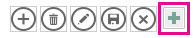

# <a name="filter-a-view-by-using-a-macro-in-an-access-app"></a>Filtern einer Ansicht mithilfe eines Makros in einer Access-App

Informationen zum Filtern einer Ansicht in einer Access-App mithilfe der Makroaktion „ErneutAbfragenDatensätze“ und eines Datenmakros.
  
> [!IMPORTANT]
> Das Erstellen und Verwenden von Access-Web-Apps in SharePoint wird von Microsoft nicht mehr empfohlen. Alternativ sollten Sie die Verwendung von [Microsoft PowerApps](https://powerapps.microsoft.com/de-DE/) für das Erstellen von Business Solutions ohne Code für das Web und für mobile Geräte in Betracht ziehen. 

Mit der Standardlistenansicht in einer Access-App können Sie Probleme mit den in den Feldern enthaltenen Werten filtern. Möglicherweise gibt es Situationen, in denen Sie eine Ansicht basierend auf einer Reihe von Bedingungen anstelle anhand der Zuordnung eines Werts filtern möchten. Hierfür müssen Sie ein Makro erstellen. In diesem Artikel wird gezeigt, wie Sie ein Makro zum Filtern einer Ansicht erstellen, um Aufgaben anzueigen, die überfällig oder in den nächsten 7 Tagen fällig sind.
  
## <a name="prerequisites-for-building-an-app-with-access"></a>Voraussetzungen für das Erstellen einer App mit Access
<a name="Access2013FilterViewByUsingMacro_Prerequisites"> </a>

Zum Ausführen der Schritte in diesem Beispiel benötigen Sie Folgendes:
  
- Access 2013
- Eine SharePoint 2013-Entwicklungsumgebung
    
> [!NOTE]
> Weitere Informationen über das Einrichten Ihrer SharePoint-Entwicklungsumgebung finden Sie unter [Einrichten einer allgemeinen Entwicklungsumgebung für SharePoint 2013](https://msdn.microsoft.com/library/08e4e4e1-d960-43fa-85df-f3c279ed6927%28Office.15%29.aspx). Weitere Informationen über das Abrufen von Access 2013 und SharePoint 2013 finden Sie unter [Downloads](https://msdn.microsoft.com/office/apps/fp123627). 
  
## <a name="create-the-app"></a>Erstellen der App
<a name="Access2013FilterViewByUsingMacro_CreateApp"> </a>

Angenommen, Sie möchten eine Access-App erstellen, die Aufgaben für Ihr Unternehmen verfolgt. Bevor Sie mit dem Erstellen der Tabellen und Ansicht beginnen, sollten Sie nach einer Schemavorlage suchen.
  
### <a name="to-create-the-task-tracking-app"></a>So erstellen Sie die Aufgabenverfolgungs-App

1. Öffnen Sie Access und wählen Sie **Benutzerdefinierte Web App** aus.
    
2. Geben Sie einen Namen und den Webspeicherort für Ihre App ein. Sie können auch einen Speicherort aus der Liste **Speicherorte** und **Erstellen** auswählen.
    
3. Geben Sie **Aufgaben** in das Feld **Suchen** ein und drücken Sie dann die EINGABETASTE. 
    
    Eine Liste der Vorlagen, die für die Aufgabenverfolgung möglicherweise nützlich sind, ist in Abbildung 1 dargestellt.
    
   **Abbildung 1: Vorlagen für die Aufgabenverfolgung**

   
  
4. Wählen Sie **Aufgaben** aus.
    
Access erstellt einen Satz an Tabellen und Ansichten.
  
Geben Sie einige Beispielaufgaben und Mitarbeiter in Ihre App ein. Wählen Sie hierzu **App starten** aus, um die App in Ihrem Webbrowser zu öffnen. Geben Sie für jede Aufgabe einen Wert in das Feld **Fälligkeitsdatum** ein. Kehren Sie zu Access zurück, wenn Sie fertig sind. 
  
## <a name="plan-the-customizations"></a>Planen der Anpassungen
<a name="Access2013FilterViewByUsingMacro_PlanCustomizations"> </a>

Sie haben jetzt eine App mit mehreren Aufgaben. In der Standardansicht können Sie mithilfe von Elementen, die in den in der Ansicht angezeigten Feldern gespeichert sind, nach beliebigen Aufgaben suchen, z. B. nach Probleme mit hoher Priorität oder Problemen in Verarbeitung. Angenommen, Sie möchten Ihre Arbeit priorisieren, indem Sie aktive Probleme anzeigen, die in der kommenden Woche fällig sind. Dafür sollten Sie ein Benutzeroberflächenmakro erstellen.
  
Der Benutzeroberflächen-Makrobefehl, mit dem Sie die Ansicht filtern können, ist [RequeryRecords-Makroaktion (Access benutzerdefinierte Web app)](requeryrecords-macro-action-access-custom-web-app.md). Die Makroaktion **ErneutAbfragenDatensätze** filtert die Ansicht basierend auf dem Argument  *,*  , das in der Form einer SQL WHERE-Klausel angegeben wird. Um die Ansicht zu filtern, müssen Sie verschiedene Fakten in einem bestimmten Format zum Filtern der Ansicht angeben. 
  
Die folgenden Fakten sind relevant:
  
- Die zu vergleichenden Felder
    
- Wie auf das heutige Datum verwiesen wird
    
- Wie auf einen bestimmten Tag in Bezug auf das heutige Datum verwiesen wird
    
- Wie Sie festlegen, welche Aufgaben ausgeführt werden
    
Das Feld **Fälligkeitsdatum** enthält Informationen darüber, wann eine Aufgabe fällig ist. Das Feld **Status** stellt Statusinformationen zu den einzelnen Aufgaben bereit. Wenn Sie in einem Makro auf ein Feld verweisen möchten, verwenden Sie das Format **[*Tabellenname*].[*Feldname*]**. Verwenden Sie **[Aufgaben].[Fälligkeitsdatum]**, um auf das Feld **Fälligkeitsdatum** zu verweisen, und **[Aufgaben].[Status]**, um auf das Feld **Status** zu verweisen. 
  
Die Funktion [Today-Funktion (Access benutzerdefinierte Web app)](today-function-access-custom-web-app.md) gibt des heutigen Datums zurück. Die Funktion [DateAdd-Funktion (Benutzerdefinierte Access Web-App)](dateadd-function-access-custom-web-app.md) kann verwendet werden, um ein Datum zu berechnen, die eine bestimmte Anzahl von Tagen nach einem angegebenen Datum liegt. 
  
Das Feld **Status** enthält mehrere Werte. Der Wert **Abgeschlossen** weist darauf hin, dass die Aufgabe nicht mehr aktiv ist. 
  
Diese Fakten können in der folgenden SQL WHERE-Klausel kombiniert werden.
  
```sql
[Tasks].[Due Date]<DateAdd(Day,7,Today()) AND [Tasks].[Status]<>"Completed"
```

Diese SQL WHERE-Klausel wird im Makro zum Filtern der Ansicht verwendet, um die aktiven Probleme anzuzeigen, die in den nächsten 7 Tagen fällig oder überfällig sind.
  
Zum Ausführen des Benutzeroberflächenmakros muss dieses an ein Element oder ein Ereignis angefügt werden, das in der Ansicht auftritt. Die **Aktionsleiste** ist eine bequeme Möglichkeit, einen benutzerdefinierten Befehl zur Ansicht hinzuzufügen. Die **Aktionsleiste** ist eine anpassbare Symbolleiste, die am oberen Rand jeder Ansicht angezeigt wird. In der Standardeinstellung enthält die **Aktionsleiste** Schaltflächen zum Hinzufügen, Bearbeiten, Speichern, Löschen und Abbrechen von Bearbeitungen. Sie können Schaltflächen hinzufügen, die benutzerdefinierte Aktionen ausführen, beispielsweise das Filtern der Ansicht. 
  
Wenn die Ansicht Datensätze enthält, die den angegebenen Kriterien entsprechen, filtert **ErneutAbfragenDatensätze** die Ansicht. Wenn die Ansicht jedoch keine Datensätze enthält, die den Kriterien entsprechen, wird ein neuer leerer Datensatz angezeigt. Wenn Sie nicht möchten, dass ein leerer Datensatz angezeigt wird, wenn in der nächsten Woche keine Aufgaben fällig sind, müssen Sie eine Methode finden, mit der die Aufgaben vor der Aufrufen der Makroaktion **ErneutAbfragenDatensätze** überprüft werden. Dafür erstellen Sie ein Datenmakro zur Überprüfung auf Einträge, die den Kriterien entsprechen. 
  
Das Benutzeroberflächenmakro ruft das Datenmakro auf, das dann versucht, eine Aufgabe zu finden, die in der nächsten Woche fällig ist. Wenn das Makro die Aufgabe findet, passen Sie die App an.
  
## <a name="customize-the-app"></a>Anpassen der App
<a name="Access2013FilterViewByUsingMacro_CustomizeApp"> </a>

Nachdem Sie die Anpassungen jetzt ermittelt haben, implementieren Sie sie. Das Makro sollte zuerst erstellt werden. Einige Datenmakros sind direkt Tabellen zugeordnet. Dieses Datenmakro ist jedoch ein eigenständiges Datenmakro.
  
### <a name="to-create-the-data-macro"></a>So erstellen Sie das Datenmakro

1. Öffnen Sie die App in Access.
    
2. Wählen Sie in der Gruppe **Erstellen** die Option **Erweitert** und dann **Datenmakro** aus.
    
    In der Entwurfsansicht für das Makro wird ein leeres Datenmakro geöffnet.
    
3. Wählen Sie im Listenfeld **Neue Aktion hinzufügen** die Option **NachschlagenDatensatz** aus.
    
4. Wählen Sie im **Datensatz nachschlagen in** die Option **Aufgaben** aus.
    
5. Geben Sie in das Feld **Bedingung** **[Aufgaben].[Fälligkeitsdatum]\<DatAdd(Tag,7,Heute()) UND [Aufgaben].[Status]\<\>"Abgeschlossen"** ein. 
    
6. Wählen Sie im Listenfeld **Neue Aktion hinzufügen** die Option **FestlegenRückgabevariable** aus. 
    
    > [!NOTE]
    > Es werden zwei Listenfelder vom Typ **Neue Aktion hinzufügen** im Block **NachschlagenDatensatz** und ein weiteres außerhalb des Blocks **NachschlagenDatensatz** angezeigt. Sie sollten analog zur Darstellung in Abbildung 1 das Listenfeld **Neue Aktion hinzufügen** im Block **NachschlagenDatensatz** verwenden. 
  
   **Abbildung 1: Listenfeld „Neue Aktion hinzufügen“**

   
  
7. Geben Sie in das Feld **Name** den Wert **GefundeneAufgabe** ein. 
    
8. Geben Sie in das Feld **Ausdruck** **Ja** ein. 
    
9. Wählen Sie **Speichern** aus. Geben Sie **BaldFälligeAufgaben** in das Feld **Makroname** ein, und wählen Sie dann **OK** aus.
    
    Das Makro sollte dem Makro in Abbildung 2 gleichen.
    
   **Abbildung 2. BaldFälligeAufgaben-Datenmakro**

   
  
10. Schließen Sie die Entwurfsansicht für das Makro.
    
Jetzt können wir der Aktionsleiste eine benutzerdefinierte Schaltfläche hinzufügen.
  
### <a name="to-add-a-custom-button-to-the-action-bar"></a>So fügen Sie eine benutzerdefinierte Schaltfläche zur Aktionsleiste hinzu

1. Wählen Sie die Tabelle **Aufgaben** aus. Damit wird das Formular „Aufgabenliste" ausgewählt. 
    
2. Wählen Sie in der Ansichtsauswahl **Liste**, das Symbol **Einstellungen/Aktion** und anschließend **Bearbeiten** aus.
    
    Die Ansicht wird in der Entwurfsansicht geöffnet.
    
3. Jetzt können wir der Aktionsleiste eine benutzerdefinierte Schaltfläche hinzufügen. Wählen Sie hierzu **Benutzerdefinierte Aktion hinzufügen** aus, wie in Abbildung 3 dargestellt. 
    
   **Abbildung 3: Schaltfläche „Benutzerdefinierte Aktion hinzufügen“**

   
  
    Die neue Aktion wird als Schaltfläche mit einem Sternsymbol angezeigt, wie in Abbildung 4 dargestellt.
    
   **Abbildung 4. Neue Aktionsleistenschaltfläche**

   
  
4. Wählen Sie die benutzerdefinierte Aktionsleistenschaltfläche aus, und wählen Sie dann das Symbol **Daten** aus. 
    
    Das Dialogfeld **Daten** wird geöffnet. 
    
5. Geben Sie in das Feld **Steuerelementname** **AufgabenFiltern** ein. 
    
6. Geben Sie im Feld **QuickInfo** **Überfällige oder in der nächsten Woche fällige Aufgaben anzeigen** ein. 
    
Jetzt können wir das Benutzeroberflächenmakro erstellen, das die Ansicht filtert.
  
### <a name="to-create-the-ui-macro-to-filter-the-view"></a>So erstellen Sie das Benutzeroberflächenmakro zum Filtern der Ansicht

1. Wählen Sie im Dialogfeld **Daten** die Option **Beim Klicken** aus, wie in Abbildung 5 dargestellt. 
    
   **Abbildung 5: Dialogfeld „Daten“**

   
  
    In der Entwurfsansicht für das Makro wird ein leeres Benutzeroberflächenmakro geöffnet.
    
2. Wählen Sie im Listenfeld **Neue Aktion hinzufügen** die Option **AusführenDatenmakro** aus. 
    
3. Geben Sie im Feld für den Makronamen **BaldFälligeAufgaben** ein. 
    
    Geben Sie **FilternDatensätze** in das Feld **FestlegenLokaleVar** ein. 
    
    Die Aktion **AusführenDatenmakro** ruft das zuvor erstellte Datenmakro **BaldFälligeAufgaben** auf und speichert das Ergebnis in einer Variable namens **FilternDatensätze**. 
    
4. Wählen Sie im Listenfeld **Neue Aktion hinzufügen** die Option **Wenn** aus. 
    
5. Geben Sie in das Feld **Wenn** **[FilternDatensätze]="Ja"** ein. 
    
6. Wählen Sie im Listenfeld **Neue Aktion hinzufügen** die Option **ErneutAbfragenDatensätze** aus. 
    
    > [!NOTE]
    > Es werden zwei Listenfelder vom Typ **Neue Aktion hinzufügen** angezeigt, eins im Block **Wenn** und ein weiteres außerhalb des Blocks **Wenn**. Sie sollten analog zur Darstellung in Abbildung 6 das Listenfeld **Neue Aktion hinzufügen** im Block **Wenn** verwenden. 
  
   **Abbildung 6: Listenfeld „Neue Aktion hinzufügen“**

   
  
7. Geben Sie in das Feld **Wo** den Wert **[Aufgaben].[Fälligkeitsdatum]\<DatAdd(Tag,7,Heute()) UND [Aufgaben].[Status]\<\>”Abgeschlossen”** ein. 
    
8. Geben Sie in das Feld **Sortiert nach** **[Fälligkeitsdatum]** ein. 
    
9. Wählen Sie den Link **Sonst hinzufügen** aus, der rechts neben dem Feld **Neue Aktion hinzufügen** angezeigt wird, wie in Abbildung 7 dargestellt. 
    
   **Abbildung 7. Link „Sonst hinzufügen“**

   
  
    Eine Sonst-Klausel wird dem Wenn-Block hinzugefügt.
    
10. Wählen Sie im Listenfeld **Neue Aktion hinzufügen** die Option **Meldungsfeld** aus. 
    
11. Geben Sie im Feld **Meldung** **Keine Aufgaben sind überfällig oder in den nächsten 7 Tagen fällig!**. 
    
12. Wählen Sie **Speichern** aus.
    
    Das Makro sollte dem Makro in Abbildung 8 gleichen.
    
    **Abbildung 8: Benutzeroberflächenmakro zum Filtern der Ansicht**

    
  
13. Schließen Sie die Entwurfsansicht für das Makro.
    
An diesem Punkt haben wir das Benutzeroberflächenmakro erstellt, das die Aufgabenlistenansicht so filtert, dass nur die dringenden Aufgaben angezeigt werden. Aber natürlich möchten wir die Ansicht nicht in einem gefilterten Zustand belassen, ohne eine Methode zum Entfernen des Filters zur Verfügung zu stellen. Fügen Sie dafür eine weitere Aktionsleistenschaltfläche und ein Benutzeroberflächenmakro hinzu.
  
### <a name="to-add-an-action-bar-button-to-remove-the-filter"></a>So fügen Sie eine Aktionsleistenschaltfläche zum Entfernen des Filters hinzu

1. Wählen Sie **Benutzerdefinierte Aktion hinzufügen** aus.
    
    Die neue Aktion wird als Schaltfläche mit einem Sternsymbol angezeigt.
    
2. Wählen Sie die benutzerdefinierte Aktionsleistenschaltfläche aus, und wählen Sie dann das Symbol **Daten** aus. 
    
    Das Dialogfeld **Daten** wird geöffnet. 
    
3. Geben Sie in das Feld **Steuerelementname** **EntfernenFilter** ein. 
    
4. Geben Sie in das Feld **QuickInfo** **Alle der Ansicht zugewiesene Filter entfernen** ein. 
    
Jetzt können wir das Benutzeroberflächenmakro erstellen, das den Filter aus der Ansicht entfert.
  
### <a name="to-create-the-ui-macro-to-remove-the-filter-from-the-view"></a>So erstellen Sie das Benutzeroberflächenmakro zum Entfernen des Filters aus der Ansicht

1. Wählen Sie im Dialogfeld **Daten** die Option **Beim Klicken** aus.
    
    In der Entwurfsansicht für das Makro wird ein leeres Benutzeroberflächenmakro geöffnet.
    
2. Wählen Sie im Listenfeld **Neue Aktion hinzufügen** die Option **ErneutAbfragenDatensätze** aus. 
    
    Diesmal lassen wir die Fehler **Wo** und **Sortiert nach** leer. Dann wird die Aktion **ErneutAbfragenDatensätze** ohne Parameter aufgerufen, und alle Filter werden aus der Ansicht entfernt. 
    
3. Wählen Sie **Speichern** aus.
    
4. Schließen Sie die Entwurfsansicht für das Makro.
    
5. Schließen Sie die Ansicht „Aufgabenliste". Wählen Sie **Ja** aus, wenn Sie dazu aufgefordert werden, Ihre Änderungen zu speichern. 
    
Jetzt können wir die Anpassung ansehen. Wählen Sie **App starten** aus, um die App in Ihrem Webbrowser zu öffnen, und wählen Sie dann die benutzerdefinierte Aktionsleistenschaltfläche „FilternAufgaben" aus. Alle überfälligen oder in den nächsten 7 Tagen fälligen Aufgaben werden angezeigt. Eine Meldung wird angezeigt, wenn die App keine dringenden Aufgaben enthält. 
  
## <a name="conclusion"></a>Schlussbemerkung

Sie können die Makroaktion **ErneutAbfragenDatensätze** in einem Benutzeroberflächenmakro verwenden, um die Ansicht anhand der von Ihnen ausgewählten Kriterien zu filtern. Je nach gewünschtem Verhalten sollten Sie möglicherweise ein Datenmakro erstellen, um zu überprüfen, ob ein Datensatz den Kriterien entspricht, bevor Sie die Makroaktion **ErneutAbfragenDatensätze** verwenden. 
  
## <a name="see-also"></a>Siehe auch

- [Neuigkeiten für Access 2013-Entwickler](https://msdn.microsoft.com/library/df778f51-d65e-4c30-b618-65003ceb39b3%28Office.15%29.aspx)
    

