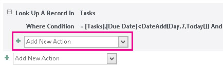
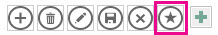
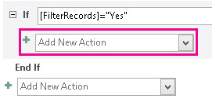

# <a name="filter-a-view-by-using-a-macro-in-an-access-app"></a><span data-ttu-id="53c2a-103">Filtern einer Ansicht mit einem Makro in einer Access-app</span><span class="sxs-lookup"><span data-stu-id="53c2a-103">Filter a view by using a macro in an Access app</span></span>

<span data-ttu-id="53c2a-104">Informationen zum Filtern einer Ansicht in einer Access-App mithilfe der Makroaktion „ErneutAbfragenDatensätze" und eines Datenmakros</span><span class="sxs-lookup"><span data-stu-id="53c2a-104">Learn how to filter a view in an Access app by using the RequeryRecords macro action and a data macro.</span></span>
  
> [!IMPORTANT]
> <span data-ttu-id="53c2a-p101">Das Erstellen und Verwenden von Access-Web-Apps in SharePoint wird von Microsoft nicht mehr empfohlen. Alternativ sollten Sie die Verwendung von [Microsoft PowerApps](https://powerapps.microsoft.com/de-de/) für das Erstellen von Business Solutions ohne Code für das Web und für mobile Geräte in Betracht ziehen.</span><span class="sxs-lookup"><span data-stu-id="53c2a-p101">Microsoft no longer recommends creating and using Access web apps in SharePoint. As an alternative, consider using [Microsoft PowerApps](https://powerapps.microsoft.com/de-de/) to build no-code business solutions for the web and mobile devices.</span></span> 

<span data-ttu-id="53c2a-p102">Mit der Standardlistenansicht in einer Access-App können Sie Probleme mit den in den Feldern enthaltenen Werten filtern. Möglicherweise gibt es Situationen, in denen Sie eine Ansicht basierend auf einer Reihe von Bedingungen anstelle anhand der Zuordnung eines Werts filtern möchten. Hierfür müssen Sie ein Makro erstellen. In diesem Artikel wird gezeigt, wie Sie ein Makro zum Filtern einer Ansicht erstellen, um Aufgaben anzueigen, die überfällig oder in den nächsten 7 Tagen fällig sind.</span><span class="sxs-lookup"><span data-stu-id="53c2a-p102">The default list view in an Access app enables you to filter the issues on values that are contained in the fields. There may be instances where you'd like to filter a view based on a set of conditions instead of by matching a value. To do that you must create a macro. This article shows you how to create a macro that filter a view to display tasks that are past due or due in the next 7 days.</span></span>
  
## <a name="prerequisites-for-building-an-app-with-access"></a><span data-ttu-id="53c2a-111">Voraussetzungen für das Erstellen einer App mit Access</span><span class="sxs-lookup"><span data-stu-id="53c2a-111">Prerequisites for building an app with Access</span></span>
<span data-ttu-id="53c2a-112"><a name="Access2013FilterViewByUsingMacro_Prerequisites"> </a></span><span class="sxs-lookup"><span data-stu-id="53c2a-112"></span></span>

<span data-ttu-id="53c2a-113">Zum Ausführen der Schritte in diesem Beispiel benötigen Sie Folgendes:</span><span class="sxs-lookup"><span data-stu-id="53c2a-113">To follow the steps in this example, you need:</span></span>
  
- <span data-ttu-id="53c2a-114">Access 2013</span><span class="sxs-lookup"><span data-stu-id="53c2a-114">Access 2013</span></span>
- <span data-ttu-id="53c2a-115">Eine SharePoint 2013-Entwicklungsumgebung</span><span class="sxs-lookup"><span data-stu-id="53c2a-115">A SharePoint 2013 development environment</span></span>
    
> [!NOTE]
> <span data-ttu-id="53c2a-p103"> Weitere Informationen über das Einrichten Ihrer SharePoint-Entwicklungsumgebung finden Sie unter [Einrichten einer allgemeinen Entwicklungsumgebung für SharePoint 2013](http://msdn.microsoft.com/library/08e4e4e1-d960-43fa-85df-f3c279ed6927%28Office.15%29.aspx). >  Weitere Informationen über das Abrufen von Access 2013 und SharePoint 2013 finden Sie unter [Downloads](http://msdn.microsoft.com/de-de/office/apps/fp123627).</span><span class="sxs-lookup"><span data-stu-id="53c2a-p103">For more information about setting up your SharePoint development environment, see [Set up a general development environment for SharePoint 2013](http://msdn.microsoft.com/library/08e4e4e1-d960-43fa-85df-f3c279ed6927%28Office.15%29.aspx). >  For more information about obtaining Access 2013 and SharePoint 2013, see [Downloads](http://msdn.microsoft.com/de-de/office/apps/fp123627).</span></span> 
  
## <a name="create-the-app"></a><span data-ttu-id="53c2a-118">Erstellen der App</span><span class="sxs-lookup"><span data-stu-id="53c2a-118">Create the app</span></span>
<span data-ttu-id="53c2a-119"><a name="Access2013FilterViewByUsingMacro_CreateApp"> </a></span><span class="sxs-lookup"><span data-stu-id="53c2a-119"></span></span>

<span data-ttu-id="53c2a-p104">Angenommen, Sie möchten eine Access-App erstellen, die Aufgaben für Ihr Unternehmen verfolgt. Bevor Sie mit dem Erstellen der Tabellen und Ansicht beginnen, sollten Sie nach einer Schemavorlage suchen.</span><span class="sxs-lookup"><span data-stu-id="53c2a-p104">Suppose you want to create an Access app that tracks tasks for your business. Before you start creating the tables and view, you should search for a schema template.</span></span>
  
### <a name="to-create-the-task-tracking-app"></a><span data-ttu-id="53c2a-122">So erstellen Sie die Aufgabenverfolgungs-App</span><span class="sxs-lookup"><span data-stu-id="53c2a-122">To create the task tracking app</span></span>

1. <span data-ttu-id="53c2a-123">Öffnen Sie Access und wählen Sie **Benutzerdefinierte Web App** aus.</span><span class="sxs-lookup"><span data-stu-id="53c2a-123">Open Access and choose **Custom web app**.</span></span>
    
2. <span data-ttu-id="53c2a-p105">Geben Sie einen Namen und den Webspeicherort für Ihre App ein. Sie können auch einen Speicherort aus der Liste **Speicherorte** und **Erstellen** auswählen.</span><span class="sxs-lookup"><span data-stu-id="53c2a-p105">Enter a name and the web location for your app. You can also choose a location from the **Locations** list and choose **Create**.</span></span>
    
3. <span data-ttu-id="53c2a-126">Geben Sie **Aufgaben** in das Feld **Suchen** ein und drücken Sie dann die EINGABETASTE.</span><span class="sxs-lookup"><span data-stu-id="53c2a-126">Type **tasks** into the **Search** box and then press ENTER.</span></span> 
    
    <span data-ttu-id="53c2a-127">Eine Liste der Vorlagen, die für die Aufgabenverfolgung möglicherweise nützlich sind, ist in Abbildung 1 dargestellt.</span><span class="sxs-lookup"><span data-stu-id="53c2a-127">A list of templates that might be useful for tracking tasks is displayed in Figure 1.</span></span>
    
   <span data-ttu-id="53c2a-128">**Abbildung 1: Vorlagen für die Aufgabenverfolgung**</span><span class="sxs-lookup"><span data-stu-id="53c2a-128">**Figure 1. Templates that match the search for tasks**</span></span>

   <span data-ttu-id="53c2a-129">![Vorlagen, die die Suche nach Problemen übereinstimmen] (media/odc_Access15_CreateAndCustomizeWebApp_Figure01.JPG "Vorlagen, die die Suche nach Problemen übereinstimmen")</span><span class="sxs-lookup"><span data-stu-id="53c2a-129"></span></span>
  
4. <span data-ttu-id="53c2a-130">Wählen Sie **Aufgaben** aus.</span><span class="sxs-lookup"><span data-stu-id="53c2a-130">Choose **Tasks**.</span></span>
    
<span data-ttu-id="53c2a-131">Access erstellt einen Satz an Tabellen und Ansichten.</span><span class="sxs-lookup"><span data-stu-id="53c2a-131">Access creates a set of tables and views.</span></span>
  
<span data-ttu-id="53c2a-p106">Geben Sie einige Beispielaufgaben und Mitarbeiter in Ihre App ein. Wählen Sie hierzu **App starten** aus, um die App in Ihrem Webbrowser zu öffnen. Geben Sie für jede Aufgabe einen Wert in das Feld **Fälligkeitsdatum** ein. Kehren Sie zu Access zurück, wenn Sie fertig sind.</span><span class="sxs-lookup"><span data-stu-id="53c2a-p106">Enter several sample tasks and employees in your app. To do this, choose **Launch App** to open the app in your web browser. Enter a value in the **Due Date** field for each task. Return to Access when you're done.</span></span> 
  
## <a name="plan-the-customizations"></a><span data-ttu-id="53c2a-136">Planen der Anpassungen</span><span class="sxs-lookup"><span data-stu-id="53c2a-136">Plan the customizations</span></span>
<span data-ttu-id="53c2a-137"><a name="Access2013FilterViewByUsingMacro_PlanCustomizations"> </a></span><span class="sxs-lookup"><span data-stu-id="53c2a-137"></span></span>

<span data-ttu-id="53c2a-p107">Sie haben jetzt eine App mit mehreren Aufgaben. In der Standardansicht können Sie mithilfe von Elementen, die in den in der Ansicht angezeigten Feldern gespeichert sind, nach beliebigen Aufgaben suchen, z. B. nach Probleme mit hoher Priorität oder Problemen in Verarbeitung. Angenommen, Sie möchten Ihre Arbeit priorisieren, indem Sie aktive Probleme anzeigen, die in der kommenden Woche fällig sind. Dafür sollten Sie ein Benutzeroberflächenmakro erstellen.</span><span class="sxs-lookup"><span data-stu-id="53c2a-p107">You now have an app that contains several tasks. The default view enables you to search for any tasks using items that are stored in the fields displayed in the view. For example, you can search for high-priority issues or issues in progress. Suppose you want to prioritize your work by displaying active issues that are due in the coming week. To do this, you should create a user interface (UI) macro.</span></span>
  
<span data-ttu-id="53c2a-p108">Der Benutzeroberflächen-Makrobefehl, mit dem Sie die Ansicht filtern können, ist [RequeryRecords-Makroaktion (Access benutzerdefinierte Web app)](requeryrecords-macro-action-access-custom-web-app.md). Die Makroaktion **ErneutAbfragenDatensätze** filtert die Ansicht basierend auf dem Argument  *,*  , das in der Form einer SQL WHERE-Klausel angegeben wird. Um die Ansicht zu filtern, müssen Sie verschiedene Fakten in einem bestimmten Format zum Filtern der Ansicht angeben.</span><span class="sxs-lookup"><span data-stu-id="53c2a-p108">The UI macro command that you can use to filter the view is the [RequeryRecords Macro Action (Access custom web app)](requeryrecords-macro-action-access-custom-web-app.md). The **RequeryRecords** macro action filters the view based on the  *Where*  argument, which is provided in the form of a SQL WHERE clause. To filter the view, you must supply several facts in a specific format to filter the view.</span></span> 
  
<span data-ttu-id="53c2a-146">Die folgenden Fakten sind relevant:</span><span class="sxs-lookup"><span data-stu-id="53c2a-146">The relevant facts are:</span></span>
  
- <span data-ttu-id="53c2a-147">Die zu vergleichenden Felder</span><span class="sxs-lookup"><span data-stu-id="53c2a-147">The field or fields to compare</span></span>
    
- <span data-ttu-id="53c2a-148">Wie auf das heutige Datum verwiesen wird</span><span class="sxs-lookup"><span data-stu-id="53c2a-148">How to refer to today's date</span></span>
    
- <span data-ttu-id="53c2a-149">Wie auf einen bestimmten Tag in Bezug auf das heutige Datum verwiesen wird</span><span class="sxs-lookup"><span data-stu-id="53c2a-149">How to refer to a particular day relative to today's date</span></span>
    
- <span data-ttu-id="53c2a-150">Wie Sie festlegen, welche Aufgaben ausgeführt werden</span><span class="sxs-lookup"><span data-stu-id="53c2a-150">How to determine which on tasks are in progress</span></span>
    
<span data-ttu-id="53c2a-151">Das Feld **Fälligkeitsdatum** enthält Informationen darüber, wann eine Aufgabe fällig ist.</span><span class="sxs-lookup"><span data-stu-id="53c2a-151">The **Due Date** field provides information about when a task is due.</span></span> <span data-ttu-id="53c2a-152">Das Feld **Status** stellt Statusinformationen zu den einzelnen Aufgaben bereit.</span><span class="sxs-lookup"><span data-stu-id="53c2a-152">The **Status** field provides status information about each task.</span></span> <span data-ttu-id="53c2a-153">Wenn Sie auf ein Feld in einem Makro verweisen möchten, verwenden Sie das Format **[*TableName*]. [ *FieldName*]**.</span><span class="sxs-lookup"><span data-stu-id="53c2a-153">To refer to a field in a macro, use the format **[*TableName*].[*FieldName*]**.</span></span> <span data-ttu-id="53c2a-154">Verwendung **[Aufgaben]. [ Due Date]** verweisen auf das Feld **Fälligkeitsdatum** und **[Aufgaben]. [ Status]** verweisen auf das Feld **Status** .</span><span class="sxs-lookup"><span data-stu-id="53c2a-154">Use **[Tasks].[Due Date]** to refer to the **Due Date** field and **[Tasks].[Status]** to refer to the **Status** field.</span></span> 
  
<span data-ttu-id="53c2a-p110">Die Funktion [Today-Funktion (Access benutzerdefinierte Web app)](today-function-access-custom-web-app.md) gibt des heutigen Datums zurück. Die Funktion [DateAdd-Funktion (Benutzerdefinierte Access Web-App)](dateadd-function-access-custom-web-app.md) kann verwendet werden, um ein Datum zu berechnen, die eine bestimmte Anzahl von Tagen nach einem angegebenen Datum liegt.</span><span class="sxs-lookup"><span data-stu-id="53c2a-p110">The [Today Function (Access custom web app)](today-function-access-custom-web-app.md) function returns today's date. The [DateAdd Function (Access custom web app)](dateadd-function-access-custom-web-app.md) function can be used to calculate a date that's a certain number of days after a specified date.</span></span> 
  
<span data-ttu-id="53c2a-p111">Das Feld **Status** enthält mehrere Werte. Der Wert **Abgeschlossen** weist darauf hin, dass die Aufgabe nicht mehr aktiv ist.</span><span class="sxs-lookup"><span data-stu-id="53c2a-p111">The **Status** field contains several possible values. A value of **Completed** indicates that the task is no longer active.</span></span> 
  
<span data-ttu-id="53c2a-159">Diese Fakten können in der folgenden SQL WHERE-Klausel kombiniert werden.</span><span class="sxs-lookup"><span data-stu-id="53c2a-159">These facts can be combined into the following SQL WHERE clause.</span></span>
  
```sql
[Tasks].[Due Date]<DateAdd(Day,7,Today()) AND [Tasks].[Status]<>"Completed"
```

<span data-ttu-id="53c2a-160">Diese SQL WHERE-Klausel wird im Makro zum Filtern der Ansicht verwendet, um die aktiven Probleme anzuzeigen, die in den nächsten 7 Tagen fällig oder überfällig sind.</span><span class="sxs-lookup"><span data-stu-id="53c2a-160">This SQL WHERE clause is used in the macro to filter the view to display active issues that are due in the next 7 days or are past due.</span></span>
  
<span data-ttu-id="53c2a-p112">Zum Ausführen des Benutzeroberflächenmakros muss dieses an ein Element oder ein Ereignis angefügt werden, das in der Ansicht auftritt. Die **Aktionsleiste** ist eine bequeme Möglichkeit, einen benutzerdefinierten Befehl zur Ansicht hinzuzufügen. Die **Aktionsleiste** ist eine anpassbare Symbolleiste, die am oberen Rand jeder Ansicht angezeigt wird. In der Standardeinstellung enthält die **Aktionsleiste** Schaltflächen zum Hinzufügen, Bearbeiten, Speichern, Löschen und Abbrechen von Bearbeitungen. Sie können Schaltflächen hinzufügen, die benutzerdefinierte Aktionen ausführen, beispielsweise das Filtern der Ansicht.</span><span class="sxs-lookup"><span data-stu-id="53c2a-p112">To run the UI macro, it must be attached to an item or an event that occurs in the view. The **Action Bar** is a convenient place to add a custom command to the view. The **Action Bar** is a customizable toolbar that appears at the top of each view. By default, the **Action Bar** contains buttons to add, edit, save, delete, and cancel edits. You can add buttons that perform custom actions, such as filtering the view.</span></span> 
  
<span data-ttu-id="53c2a-p113">Wenn die Ansicht Datensätze enthält, die den angegebenen Kriterien entsprechen, filtert **ErneutAbfragenDatensätze** die Ansicht. Wenn die Ansicht jedoch keine Datensätze enthält, die den Kriterien entsprechen, wird ein neuer leerer Datensatz angezeigt. Wenn Sie nicht möchten, dass ein leerer Datensatz angezeigt wird, wenn in der nächsten Woche keine Aufgaben fällig sind, müssen Sie eine Methode finden, mit der die Aufgaben vor der Aufrufen der Makroaktion **ErneutAbfragenDatensätze** überprüft werden. Dafür erstellen Sie ein Datenmakro zur Überprüfung auf Einträge, die den Kriterien entsprechen.</span><span class="sxs-lookup"><span data-stu-id="53c2a-p113">If the view contains records that meet the specified criteria, then **RequeryRecords** filters the view. However, if the view doesn't contain any records that meet the criteria, than a new, blank record is displayed. If you don't want a blank record to be displayed if no tasks are due in the next week, then you must find a method to check the tasks before you call the **RequeryRecords** macro action. To do this, create a data macro to check for records that meet the criteria.</span></span> 
  
<span data-ttu-id="53c2a-p114">Das Benutzeroberflächenmakro ruft das Datenmakro auf, das dann versucht, eine Aufgabe zu finden, die in der nächsten Woche fällig ist. Wenn das Makro die Aufgabe findet, passen Sie die App an.</span><span class="sxs-lookup"><span data-stu-id="53c2a-p114">The UI macro will call the data macro, which will try to find a task that's due in the next week. If the data macro finds the task then customize the app.</span></span>
  
## <a name="customize-the-app"></a><span data-ttu-id="53c2a-172">Anpassen der App</span><span class="sxs-lookup"><span data-stu-id="53c2a-172">Customize the app</span></span>
<span data-ttu-id="53c2a-173"><a name="Access2013FilterViewByUsingMacro_CustomizeApp"> </a></span><span class="sxs-lookup"><span data-stu-id="53c2a-173"></span></span>

<span data-ttu-id="53c2a-p115">Nachdem Sie die Anpassungen jetzt ermittelt haben, implementieren Sie sie. Das Makro sollte zuerst erstellt werden. Einige Datenmakros sind direkt Tabellen zugeordnet. Dieses Datenmakro ist jedoch ein eigenständiges Datenmakro.</span><span class="sxs-lookup"><span data-stu-id="53c2a-p115">Now that you've determined the customizations, implement them. The data macro should be created first. Some data macros are attached directly to tables. However, this data macro is a stand-alone data macro.</span></span>
  
### <a name="to-create-the-data-macro"></a><span data-ttu-id="53c2a-178">So erstellen Sie das Datenmakro</span><span class="sxs-lookup"><span data-stu-id="53c2a-178">To create the data macro</span></span>

1. <span data-ttu-id="53c2a-179">Öffnen Sie die App in Access.</span><span class="sxs-lookup"><span data-stu-id="53c2a-179">Open the app in Access.</span></span>
    
2. <span data-ttu-id="53c2a-180">Wählen Sie in der Gruppe **Erstellen** die Option **Erweitert** und dann **Datenmakro** aus.</span><span class="sxs-lookup"><span data-stu-id="53c2a-180">In the **Create** group, choose **Advanced**, and then choose **Data Macro**.</span></span>
    
    <span data-ttu-id="53c2a-181">In der Entwurfsansicht für das Makro wird ein leeres Datenmakro geöffnet.</span><span class="sxs-lookup"><span data-stu-id="53c2a-181">A blank data macro is opened in macro Design View.</span></span>
    
3. <span data-ttu-id="53c2a-182">Wählen Sie im Listenfeld **Neue Aktion hinzufügen** die Option **NachschlagenDatensatz** aus.</span><span class="sxs-lookup"><span data-stu-id="53c2a-182">From the **Add New Action** list box, choose **LookupRecord**.</span></span>
    
4. <span data-ttu-id="53c2a-183">Wählen Sie im **Datensatz nachschlagen in** die Option **Aufgaben** aus.</span><span class="sxs-lookup"><span data-stu-id="53c2a-183">In the **Look Up A Record In** list box, choose **Tasks**.</span></span>
    
5. <span data-ttu-id="53c2a-184">Geben Sie in das Feld **Bedingung** **[Aufgaben].[Fälligkeitsdatum]\<DatAdd(Tag,7,Heute()) UND [Aufgaben].[Status]\<\>"Abgeschlossen"** ein.</span><span class="sxs-lookup"><span data-stu-id="53c2a-184">In the **Where Condition** box, enter **[Tasks].[Due Date]\<DateAdd(Day,7,Today()) AND [Tasks].[Status]\<\>"Completed"**.</span></span> 
    
6. <span data-ttu-id="53c2a-185">Wählen Sie im Listenfeld **Neue Aktion hinzufügen** die Option **FestlegenRückgabevariable** aus.</span><span class="sxs-lookup"><span data-stu-id="53c2a-185">Choose **SetReturnVar** from the **Add New Action** list box.</span></span> 
    
    > [!NOTE]
    > <span data-ttu-id="53c2a-p116">Es werden zwei Listenfelder vom Typ **Neue Aktion hinzufügen** im Block **NachschlagenDatensatz** und ein weiteres außerhalb des Blocks **NachschlagenDatensatz** angezeigt. Sie sollten analog zur Darstellung in Abbildung 1 das Listenfeld **Neue Aktion hinzufügen** im Block **NachschlagenDatensatz** verwenden.</span><span class="sxs-lookup"><span data-stu-id="53c2a-p116">You'll see two **Add New Action** list boxes, one within the **LookupRecord** block, and another outside the **LookupRecord** block. You should choose the **Add New Action** list box within the **LookupRecord** block, as shown in Figure 1.</span></span> 
  
   <span data-ttu-id="53c2a-188">**Abbildung 1: Listenfeld „Neue Aktion hinzufügen"**</span><span class="sxs-lookup"><span data-stu-id="53c2a-188">**Figure 1. Add New Action list box**</span></span>

   <span data-ttu-id="53c2a-189">![Dropdownmenü neue Aktion hinzufügen] (media/odc_Access2013_FilterFormByUsingMacro_Figure01.jpg "Dropdownmenü neue Aktion hinzufügen")</span><span class="sxs-lookup"><span data-stu-id="53c2a-189"></span></span>
  
7. <span data-ttu-id="53c2a-190">Geben Sie in das Feld **Name** **GefundeneAufgabe** ein.</span><span class="sxs-lookup"><span data-stu-id="53c2a-190">In the **Name** box, enter **TaskFound**.</span></span> 
    
8. <span data-ttu-id="53c2a-191">Geben Sie in das Feld **Ausdruck** **Ja** ein.</span><span class="sxs-lookup"><span data-stu-id="53c2a-191">In the **Expression** box, enter **"Yes"**.</span></span> 
    
9. <span data-ttu-id="53c2a-p117">Wählen Sie **Speichern** aus. Geben Sie **BaldFälligeAufgaben** in das Feld **Makroname** ein, und wählen Sie dann **OK** aus.</span><span class="sxs-lookup"><span data-stu-id="53c2a-p117">Choose **Save**. Enter **TasksDueSoon** in the **Macro Name** box and then choose **OK**.</span></span>
    
    <span data-ttu-id="53c2a-194">Das Makro sollte dem Makro in Abbildung 2 gleichen.</span><span class="sxs-lookup"><span data-stu-id="53c2a-194">The macro should resemble the macro shown in Figure 2.</span></span>
    
   <span data-ttu-id="53c2a-195">**Abbildung 2. BaldFälligeAufgaben-Datenmakro**</span><span class="sxs-lookup"><span data-stu-id="53c2a-195">**Figure 2. TasksDueSoon data macro**</span></span>

   <span data-ttu-id="53c2a-196">![Datenmakro "tasksduesoon"] (media/odc_Access2013_FilterFormByUsingMacro_Figure02.jpg "Datenmakro \"tasksduesoon\"")</span><span class="sxs-lookup"><span data-stu-id="53c2a-196"></span></span>
  
10. <span data-ttu-id="53c2a-197">Schließen Sie die Entwurfsansicht für das Makro.</span><span class="sxs-lookup"><span data-stu-id="53c2a-197">Close macro Design View.</span></span>
    
<span data-ttu-id="53c2a-198">Jetzt können wir der Aktionsleiste eine benutzerdefinierte Schaltfläche hinzufügen.</span><span class="sxs-lookup"><span data-stu-id="53c2a-198">Now, we're ready to add a custom button to the Action Bar.</span></span>
  
### <a name="to-add-a-custom-button-to-the-action-bar"></a><span data-ttu-id="53c2a-199">So fügen Sie eine benutzerdefinierte Schaltfläche zur Aktionsleiste hinzu</span><span class="sxs-lookup"><span data-stu-id="53c2a-199">To add a custom button to the Action Bar</span></span>

1. <span data-ttu-id="53c2a-p118">Wählen Sie die Tabelle **Aufgaben** aus. Damit wird das Formular „Aufgabenliste" ausgewählt.</span><span class="sxs-lookup"><span data-stu-id="53c2a-p118">Choose the **Tasks** table. This chooses the Tasks List form.</span></span> 
    
2. <span data-ttu-id="53c2a-202">Wählen Sie in der Ansichtsauswahl **Liste**, das Symbol **Einstellungen/Aktion** und anschließend **Bearbeiten** aus.</span><span class="sxs-lookup"><span data-stu-id="53c2a-202">In the View selector, choose **List**, choose the **Settings/Action** icon, and then choose **Edit**.</span></span>
    
    <span data-ttu-id="53c2a-203">Die Ansicht wird in der Entwurfsansicht geöffnet.</span><span class="sxs-lookup"><span data-stu-id="53c2a-203">The view is opened in Design View.</span></span>
    
3. <span data-ttu-id="53c2a-p119">Jetzt können wir der Aktionsleiste eine benutzerdefinierte Schaltfläche hinzufügen. Wählen Sie hierzu **Benutzerdefinierte Aktion hinzufügen** aus, wie in Abbildung 3 dargestellt.</span><span class="sxs-lookup"><span data-stu-id="53c2a-p119">Now, we're ready to add a custom button to the Action Bar. To do this, choose **Add custom action** as shown in Figure 3.</span></span> 
    
   <span data-ttu-id="53c2a-206">**Abbildung 3: Hinzufügen einer Schaltfläche für eine benutzerdefinierte Aktion**</span><span class="sxs-lookup"><span data-stu-id="53c2a-206">**Figure 3. Add custom action button**</span></span>

   <span data-ttu-id="53c2a-207">![Schaltfläche benutzerdefinierte Aktion hinzufügen] (media/odc_Access2013_FilterFormByUsingMacro_Figure03.jpg "Schaltfläche benutzerdefinierte Aktion hinzufügen")</span><span class="sxs-lookup"><span data-stu-id="53c2a-207"></span></span>
  
    <span data-ttu-id="53c2a-208">Die neue Aktion wird als Schaltfläche mit einem Sternsymbol angezeigt, wie in Abbildung 4 dargestellt.</span><span class="sxs-lookup"><span data-stu-id="53c2a-208">The new action is displayed as a button with a star icon as shown in Figure 4.</span></span>
    
   <span data-ttu-id="53c2a-209">**Abbildung 4. Neue Aktionsleistenschaltfläche**</span><span class="sxs-lookup"><span data-stu-id="53c2a-209">**Figure 4. New Action Bar button**</span></span>

   <span data-ttu-id="53c2a-210">![Neue aktionsleistenschaltfläche] (media/odc_Access2013_FilterFormByUsingMacro_Figure04.jpg "Neue aktionsleistenschaltfläche")</span><span class="sxs-lookup"><span data-stu-id="53c2a-210"></span></span>
  
4. <span data-ttu-id="53c2a-211">Wählen Sie die benutzerdefinierte Aktionsleistenschaltfläche aus, und wählen Sie dann das Symbol **Daten** aus.</span><span class="sxs-lookup"><span data-stu-id="53c2a-211">Choose the custom Action Bar Button, and then choose the **Data** icon.</span></span> 
    
    <span data-ttu-id="53c2a-212">Das Dialogfeld **Daten** wird geöffnet.</span><span class="sxs-lookup"><span data-stu-id="53c2a-212">The **Data** dialog box appears.</span></span> 
    
5. <span data-ttu-id="53c2a-213">Geben Sie in das Feld **Steuerelementname** **AufgabenFiltern** ein.</span><span class="sxs-lookup"><span data-stu-id="53c2a-213">In the **Control Name** box, enter **FilterTasks**.</span></span> 
    
6. <span data-ttu-id="53c2a-214">Geben Sie im Feld **QuickInfo** **Überfällige oder in der nächsten Woche fällige Aufgaben anzeigen** ein.</span><span class="sxs-lookup"><span data-stu-id="53c2a-214">In the **Tooltip** box, enter **Display tasks past due or due in the next week**.</span></span> 
    
<span data-ttu-id="53c2a-215">Jetzt können wir das Benutzeroberflächenmakro erstellen, das die Ansicht filtert.</span><span class="sxs-lookup"><span data-stu-id="53c2a-215">Now, we're ready to create the UI macro that will filter the view.</span></span>
  
### <a name="to-create-the-ui-macro-to-filter-the-view"></a><span data-ttu-id="53c2a-216">So erstellen Sie das Benutzeroberflächenmakro zum Filtern der Ansicht</span><span class="sxs-lookup"><span data-stu-id="53c2a-216">To create the UI macro to filter the view</span></span>

1. <span data-ttu-id="53c2a-217">Wählen Sie im Dialogfeld **Daten** die Option **Beim Klicken** aus, wie in Abbildung 5 dargestellt.</span><span class="sxs-lookup"><span data-stu-id="53c2a-217">In the **Data** dialog box, choose **On Click** as shown in Figure 5.</span></span> 
    
   <span data-ttu-id="53c2a-218">**Abbildung 5: Dialogfeld „Daten"**</span><span class="sxs-lookup"><span data-stu-id="53c2a-218">**Figure 5. Data dialog box**</span></span>

   <span data-ttu-id="53c2a-219">![Im Dialogfeld Daten] (media/odc_Access2013_FilterFormByUsingMacro_Figure05.jpg "Im Dialogfeld Daten")</span><span class="sxs-lookup"><span data-stu-id="53c2a-219"></span></span>
  
    <span data-ttu-id="53c2a-220">In der Entwurfsansicht für das Makro wird ein leeres Benutzeroberflächenmakro geöffnet.</span><span class="sxs-lookup"><span data-stu-id="53c2a-220">A blank UI macro is opened in macro Design View.</span></span>
    
2. <span data-ttu-id="53c2a-221">Wählen Sie im Listenfeld **Neue Aktion hinzufügen** die Option **AusführenDatenmakro** aus.</span><span class="sxs-lookup"><span data-stu-id="53c2a-221">From the **Add New Action** list box, choose **RunDataMacro**.</span></span> 
    
3. <span data-ttu-id="53c2a-222">Geben Sie im Feld für den Makronamen **BaldFälligeAufgaben** ein.</span><span class="sxs-lookup"><span data-stu-id="53c2a-222">In the Macro Name box, enter **TasksDueSoon**.</span></span> 
    
    <span data-ttu-id="53c2a-223">Geben Sie **FilternDatensätze** in das Feld **FestlegenLokaleVar** ein.</span><span class="sxs-lookup"><span data-stu-id="53c2a-223">In the **SetLocalVar** box, enter **FilterRecords**.</span></span> 
    
    <span data-ttu-id="53c2a-224">Die Aktion **AusführenDatenmakro** ruft das zuvor erstellte Datenmakro **BaldFälligeAufgaben** auf und speichert das Ergebnis in einer Variable namens **FilternDatensätze**.</span><span class="sxs-lookup"><span data-stu-id="53c2a-224">The **RunDataMacro** action calls the **TasksDueSoon** data macro we created earlier and stores its result in a variable named **FilterRecords**.</span></span> 
    
4. <span data-ttu-id="53c2a-225">Wählen Sie im Listenfeld **Neue Aktion hinzufügen** die Option **Wenn** aus.</span><span class="sxs-lookup"><span data-stu-id="53c2a-225">From the **Add New Action** list box, choose **If**.</span></span> 
    
5. <span data-ttu-id="53c2a-226">Geben Sie in das Feld **Wenn** **[FilternDatensätze]="Ja"** ein.</span><span class="sxs-lookup"><span data-stu-id="53c2a-226">In the **If** box, enter **[FilterRecords]="Yes"**.</span></span> 
    
6. <span data-ttu-id="53c2a-227">Wählen Sie im Listenfeld **Neue Aktion hinzufügen** die Option **ErneutAbfragenDatensätze** aus.</span><span class="sxs-lookup"><span data-stu-id="53c2a-227">From the **Add New Action** list box, choose **RequeryRecords**.</span></span> 
    
    > [!NOTE]
    > <span data-ttu-id="53c2a-p120">Es werden zwei Listenfelder vom Typ **Neue Aktion hinzufügen** angezeigt, eins im Block **Wenn** und ein weiteres außerhalb des Blocks **Wenn**. Sie sollten analog zur Darstellung in Abbildung 6 das Listenfeld **Neue Aktion hinzufügen** im Block **Wenn** verwenden.</span><span class="sxs-lookup"><span data-stu-id="53c2a-p120">You'll see two **Add New Action** list boxes, one within the **If** block, and another outside the **If** block. You should choose the **Add New Action** list box within the **If** block, as shown in Figure 6.</span></span> 
  
   <span data-ttu-id="53c2a-230">**Abbildung 6: Listenfeld „Neue Aktion hinzufügen"**</span><span class="sxs-lookup"><span data-stu-id="53c2a-230">**Figure 6. Add New Action list box**</span></span>

   <span data-ttu-id="53c2a-231">![Dropdownmenü neue Aktion hinzufügen] (media/odc_Access2013_FilterFormByUsingMacro_Figure06.jpg "Dropdownmenü neue Aktion hinzufügen")</span><span class="sxs-lookup"><span data-stu-id="53c2a-231"></span></span>
  
7. <span data-ttu-id="53c2a-232">Geben Sie in das Feld **Wo** **[Aufgaben].[Fälligkeitsdatum]\<DatAdd(Tag,7,Heute()) UND [Aufgaben].[Status]\<\>"Abgeschlossen"** ein.</span><span class="sxs-lookup"><span data-stu-id="53c2a-232">In the **Where** box, enter **[Tasks].[Due Date]\<DateAdd(Day,7,Today()) AND [Tasks].[Status]\<\>"Completed"**.</span></span> 
    
8. <span data-ttu-id="53c2a-233">Geben Sie in das Feld **Sortiert nach** **[Fälligkeitsdatum]** ein.</span><span class="sxs-lookup"><span data-stu-id="53c2a-233">In the **Order By** box, enter **[Due Date]**.</span></span> 
    
9. <span data-ttu-id="53c2a-234">Wählen Sie den Link **Sonst hinzufügen** aus, der rechts neben dem Feld **Neue Aktion hinzufügen** angezeigt wird, wie in Abbildung 7 dargestellt.</span><span class="sxs-lookup"><span data-stu-id="53c2a-234">Choose the **Add Else** link that appears to the right side of the **Add New Action** box as shown in Figure 7.</span></span> 
    
   <span data-ttu-id="53c2a-235">**Abbildung 7. Link „Sonst hinzufügen"**</span><span class="sxs-lookup"><span data-stu-id="53c2a-235">**Figure 7. Add Else link**</span></span>

   <span data-ttu-id="53c2a-236">![Hinzufügen von anderen link] (media/odc_Access2013_FilterFormByUsingMacro_Figure07.jpg "Hinzufügen von anderen link")</span><span class="sxs-lookup"><span data-stu-id="53c2a-236"></span></span>
  
    <span data-ttu-id="53c2a-237">Eine Else-Klausel wird dem Wenn-Block hinzugefügt.</span><span class="sxs-lookup"><span data-stu-id="53c2a-237">An Else clause is added to the If block.</span></span>
    
10. <span data-ttu-id="53c2a-238">Wählen Sie im Listenfeld **Neue Aktion hinzufügen** die Option **Meldungsfeld** aus.</span><span class="sxs-lookup"><span data-stu-id="53c2a-238">From the **Add New Action** list box, choose **MessageBox**.</span></span> 
    
11. <span data-ttu-id="53c2a-239">Geben Sie im Feld **Meldung** **Keine Aufgaben sind überfällig oder in den nächsten 7 Tagen fällig!**.</span><span class="sxs-lookup"><span data-stu-id="53c2a-239">In the **Message** box, enter **No tasks are overdue or due in the next 7 days!**.</span></span> 
    
12. <span data-ttu-id="53c2a-240">Wählen Sie **Speichern** aus.</span><span class="sxs-lookup"><span data-stu-id="53c2a-240">Choose **Save**.</span></span>
    
    <span data-ttu-id="53c2a-241">Das Makro sollte dem Makro in Abbildung 8 gleichen.</span><span class="sxs-lookup"><span data-stu-id="53c2a-241">The macro should resemble the macro shown in Figure 8.</span></span>
    
    <span data-ttu-id="53c2a-242">**Abbildung 8: Benutzeroberflächenmakro zum Filtern der Ansicht**</span><span class="sxs-lookup"><span data-stu-id="53c2a-242">**Figure 8. UI macro to filter the view**</span></span>

    <span data-ttu-id="53c2a-243">![UI-Makro zum Filtern der Ansicht] (media/odc_Access2013_FilterFormByUsingMacro_Figure08.jpg "UI-Makro zum Filtern der Ansicht")</span><span class="sxs-lookup"><span data-stu-id="53c2a-243"></span></span>
  
13. <span data-ttu-id="53c2a-244">Schließen Sie die Entwurfsansicht für das Makro.</span><span class="sxs-lookup"><span data-stu-id="53c2a-244">Close macro Design View.</span></span>
    
<span data-ttu-id="53c2a-p121">An diesem Punkt haben wir das Benutzeroberflächenmakro erstellt, das die Aufgabenlistenansicht so filtert, dass nur die dringenden Aufgaben angezeigt werden. Aber natürlich möchten wir die Ansicht nicht in einem gefilterten Zustand belassen, ohne eine Methode zum Entfernen des Filters zur Verfügung zu stellen. Fügen Sie dafür eine weitere Aktionsleistenschaltfläche und ein Benutzeroberflächenmakro hinzu.</span><span class="sxs-lookup"><span data-stu-id="53c2a-p121">At this point, we've created the UI macro that filters the Tasks List view to display the urgent tasks. It wouldn't be polite to leave the view in a filtered state without providing a method to remove the filter. To do this, add another Action Bar button and UI Macro.</span></span>
  
### <a name="to-add-an-action-bar-button-to-remove-the-filter"></a><span data-ttu-id="53c2a-248">So fügen Sie eine Aktionsleistenschaltfläche zum Entfernen des Filters hinzu</span><span class="sxs-lookup"><span data-stu-id="53c2a-248">To add an Action Bar Button to remove the filter</span></span>

1. <span data-ttu-id="53c2a-249">Wählen Sie **Benutzerdefinierte Aktion hinzufügen** aus.</span><span class="sxs-lookup"><span data-stu-id="53c2a-249">Choose **Add custom action**.</span></span>
    
    <span data-ttu-id="53c2a-250">Die neue Aktion wird als Schaltfläche mit einem Sternsymbol angezeigt.</span><span class="sxs-lookup"><span data-stu-id="53c2a-250">The new action is displayed as a button with a star icon</span></span>
    
2. <span data-ttu-id="53c2a-251">Wählen Sie die benutzerdefinierte Aktionsleistenschaltfläche aus, und wählen Sie dann das Symbol **Daten** aus.</span><span class="sxs-lookup"><span data-stu-id="53c2a-251">Choose the custom Action Bar button, and then choose the **Data** icon.</span></span> 
    
    <span data-ttu-id="53c2a-252">Das Dialogfeld **Daten** wird geöffnet.</span><span class="sxs-lookup"><span data-stu-id="53c2a-252">The **Data** dialog box appears.</span></span> 
    
3. <span data-ttu-id="53c2a-253">Geben Sie in das Feld **Steuerelementname** **EntfernenFilter** ein.</span><span class="sxs-lookup"><span data-stu-id="53c2a-253">In the **Control Name** box, enter **RemoveFilter**.</span></span> 
    
4. <span data-ttu-id="53c2a-254">Geben Sie in das Feld **QuickInfo** **Alle der Ansicht zugewiesene Filter entfernen** ein.</span><span class="sxs-lookup"><span data-stu-id="53c2a-254">In the **Tooltip** box, enter **Remove all filter applied to the view**.</span></span> 
    
<span data-ttu-id="53c2a-255">Jetzt können wir das Benutzeroberflächenmakro erstellen, das den Filter aus der Ansicht entfert.</span><span class="sxs-lookup"><span data-stu-id="53c2a-255">Now, we're ready to create the UI macro that will remove the filter form the view.</span></span>
  
### <a name="to-create-the-ui-macro-to-remove-the-filter-from-the-view"></a><span data-ttu-id="53c2a-256">So erstellen Sie das Benutzeroberflächenmakro zum Entfernen des Filters aus der Ansicht</span><span class="sxs-lookup"><span data-stu-id="53c2a-256">To create the UI macro to remove the filter from the view</span></span>

1. <span data-ttu-id="53c2a-257">Wählen Sie im Dialogfeld **Daten** die Option **Beim Klicken** aus.</span><span class="sxs-lookup"><span data-stu-id="53c2a-257">In the **Data** dialog box, choose **On Click**.</span></span>
    
    <span data-ttu-id="53c2a-258">In der Entwurfsansicht für das Makro wird ein leeres Benutzeroberflächenmakro geöffnet.</span><span class="sxs-lookup"><span data-stu-id="53c2a-258">A blank UI macro is opened in macro Design View.</span></span>
    
2. <span data-ttu-id="53c2a-259">Wählen Sie im Listenfeld **Neue Aktion hinzufügen** die Option **ErneutAbfragenDatensätze** aus.</span><span class="sxs-lookup"><span data-stu-id="53c2a-259">From the **Add New Action** list box, choose **RequeryRecords**.</span></span> 
    
    <span data-ttu-id="53c2a-p122">Diesmal lassen wir die Fehler **Wo** und **Sortiert nach** leer. Dann wird die Aktion **ErneutAbfragenDatensätze** ohne Parameter aufgerufen, und alle Filter werden aus der Ansicht entfernt.</span><span class="sxs-lookup"><span data-stu-id="53c2a-p122">This time, we'll leave the **Where** and **Order By** boxes empty. Then the **RequeryRecords** action is called without any parameters, all filters are removed from the view.</span></span> 
    
3. <span data-ttu-id="53c2a-262">Wählen Sie **Speichern** aus.</span><span class="sxs-lookup"><span data-stu-id="53c2a-262">Choose **Save**.</span></span>
    
4. <span data-ttu-id="53c2a-263">Schließen Sie die Entwurfsansicht für das Makro.</span><span class="sxs-lookup"><span data-stu-id="53c2a-263">Close macro Design View.</span></span>
    
5. <span data-ttu-id="53c2a-p123">Schließen Sie die Ansicht „Aufgabenliste". Wählen Sie **Ja** aus, wenn Sie dazu aufgefordert werden, Ihre Änderungen zu speichern.</span><span class="sxs-lookup"><span data-stu-id="53c2a-p123">Close the Tasks List view. Choose **Yes** when you are prompted to save your changes.</span></span> 
    
<span data-ttu-id="53c2a-p124">Jetzt können wir die Anpassung ansehen. Wählen Sie **App starten** aus, um die App in Ihrem Webbrowser zu öffnen, und wählen Sie dann die benutzerdefinierte Aktionsleistenschaltfläche „FilternAufgaben" aus. Alle überfälligen oder in den nächsten 7 Tagen fälligen Aufgaben werden angezeigt. Eine Meldung wird angezeigt, wenn die App keine dringenden Aufgaben enthält.</span><span class="sxs-lookup"><span data-stu-id="53c2a-p124">Now, we're ready to text the customization. Choose **Launch App** to open the app in your web browser and then choose the custom FilterTasks Action Bar button. Any tasks past due or due in the next 7 days are displayed. A message is displayed if the app contains no urgent tasks.</span></span> 
  
## <a name="conclusion"></a><span data-ttu-id="53c2a-270">Conclusion</span><span class="sxs-lookup"><span data-stu-id="53c2a-270">Conclusion</span></span>

<span data-ttu-id="53c2a-p125">Sie können die Makroaktion **ErneutAbfragenDatensätze** in einem Benutzeroberflächenmakro verwenden, um die Ansicht anhand der von Ihnen ausgewählten Kriterien zu filtern. Je nach gewünschtem Verhalten sollten Sie möglicherweise ein Datenmakro erstellen, um zu überprüfen, ob ein Datensatz den Kriterien entspricht, bevor Sie die Makroaktion **ErneutAbfragenDatensätze** verwenden.</span><span class="sxs-lookup"><span data-stu-id="53c2a-p125">You can use the **RequeryRecords** macro action in a UI macro to filter the view based on the criteria that you choose. Depending on the behavior that you want, you may want to create a data macro to verify that a record meets the criteria before you use the **RequeryRecords** macro action.</span></span> 
  
## <a name="see-also"></a><span data-ttu-id="53c2a-273">Siehe auch</span><span class="sxs-lookup"><span data-stu-id="53c2a-273">See also</span></span>

- [<span data-ttu-id="53c2a-274">Neuigkeiten in Access für Entwickler</span><span class="sxs-lookup"><span data-stu-id="53c2a-274">What's new for Access 2013 developers</span></span>](http://msdn.microsoft.com/library/df778f51-d65e-4c30-b618-65003ceb39b3%28Office.15%29.aspx)
    

