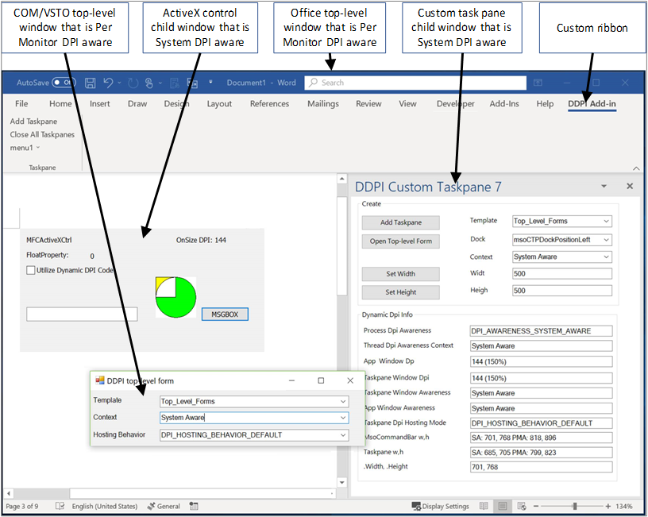

# <a name="handle-high-dpi-and-dpi-scaling-in-your-office-solution"></a><span data-ttu-id="3a411-103">Verarbeiten hoher DPI-Werte und der DPI-Skalierung in Ihrer Office-Lösung</span><span class="sxs-lookup"><span data-stu-id="3a411-103">Handle high DPI and DPI scaling in your Office solution</span></span>

<span data-ttu-id="3a411-104">Viele Computer und Anzeigekonfigurationen unterstützen jetzt hohe DPI-Auflösungen (Punkte pro Zoll) und können mehrere Monitore mit unterschiedlichen Größen und Pixeldichten verbinden.</span><span class="sxs-lookup"><span data-stu-id="3a411-104">Many computer and display configurations now support high DPI (dots-per-inch) resolutions, and can connect multiple monitors with different sizes and pixel densities.</span></span> <span data-ttu-id="3a411-105">Hierfür müssen Anwendungen angepasst werden, wenn der Benutzer die App auf einen Monitor mit einer anderen DPI-Auflösung verschiebt oder die Zoomebene ändert.</span><span class="sxs-lookup"><span data-stu-id="3a411-105">This requires applications to adjust when the user moves the app to a monitor with a different DPI, or changes the zoom level.</span></span> <span data-ttu-id="3a411-106">Anwendungen, die keine DPI-Skalierung unterstützen, werden auf Monitoren mit niedriger DPI-Auflösung möglicherweise korrekt angezeigt, sehen auf einem Monitor mit hoher DPI-Auflösung jedoch vielleicht verzerrt oder unscharf aus.</span><span class="sxs-lookup"><span data-stu-id="3a411-106">Applications that don’t support DPI scaling might look fine on low DPI monitors, but will look stretched and blurry when shown on a high DPI monitor.</span></span> 

<span data-ttu-id="3a411-107">Office 2016-Anwendungen, z. B. Word und Excel, wurden so aktualisiert, dass sie auf Änderungen des Skalierungsfaktors reagieren können.</span><span class="sxs-lookup"><span data-stu-id="3a411-107">Office 2016 applications, such as Word and Excel, have been updated to respond to changes in scale factor.</span></span> <span data-ttu-id="3a411-108">Ihre Office-Lösung muss jedoch auch auf Änderungen reagieren, damit sie korrekt dargestellt wird, wenn sich der DPI-Wert ändert.</span><span class="sxs-lookup"><span data-stu-id="3a411-108">However, your Office solution must also respond to changes to draw correctly when the DPI changes.</span></span> <span data-ttu-id="3a411-109">Dieser Artikel beschreibt, wie Office dynamische DPI-Werte unterstützt, und welche Schritte Sie unternehmen können, um die beste Anzeige für Ihre Office-Erweiterbarkeitslösung zur Verarbeitung der DPI-Skalierung sicherzustellen.</span><span class="sxs-lookup"><span data-stu-id="3a411-109">This article describes how Office supports dynamic DPI, and what steps you can take to ensure the best viewing experience for your Office extensibility solution to handle DPI scaling.</span></span> 

## <a name="dpi-scaling-symptoms-in-your-solution"></a><span data-ttu-id="3a411-110">DPI-Skalierungssymptome in Ihrer Lösung</span><span class="sxs-lookup"><span data-stu-id="3a411-110">DPI scaling symptoms in your solution</span></span>

<span data-ttu-id="3a411-111">Windows wendet die DPI-Skalierung an, wenn eine Anwendung von einem Display zu einem anderen Display mit einem anderen DPI-Wert verschoben wird.</span><span class="sxs-lookup"><span data-stu-id="3a411-111">Windows applies DPI scaling when an application is moved from one display to another display with a different DPI.</span></span> <span data-ttu-id="3a411-112">Dies geschieht in Szenarien, wenn zum Beispiel eine Anwendung auf einen anderen Monitor gezogen wird oder Ihr Laptop angedockt wird.</span><span class="sxs-lookup"><span data-stu-id="3a411-112">This happens in scenarios such as dragging an application to a different monitor or docking your laptop.</span></span> <span data-ttu-id="3a411-113">Wenn Ihre Office-Lösung von der DPI-Skalierung beeinträchtigt wird, werden Sie eines oder mehrere der folgenden Symptome feststellen:</span><span class="sxs-lookup"><span data-stu-id="3a411-113">If your Office solution is adversely affected by DPI scaling, you will see one or more of the following symptoms:</span></span>

- <span data-ttu-id="3a411-114">Die Fenster werden an der falschen Position dargestellt oder haben eine falsche Größe.</span><span class="sxs-lookup"><span data-stu-id="3a411-114">The windows draw in the wrong location or have incorrect sizing.</span></span>
- <span data-ttu-id="3a411-115">Elemente wie Schaltflächen und Beschriftungen werden an der falschen Stelle im Fenster der Lösung angezeigt.</span><span class="sxs-lookup"><span data-stu-id="3a411-115">Elements such as buttons and labels appear in the wrong location in your solution’s window.</span></span>
- <span data-ttu-id="3a411-116">Schriftarten und Bilder werden zu klein, zu groß oder an der falschen Stelle angezeigt.</span><span class="sxs-lookup"><span data-stu-id="3a411-116">Fonts and images appear too small, too large or in the wrong location.</span></span>

<span data-ttu-id="3a411-117">Die folgenden Typen von Office-Lösungen können betroffen von der DPI-Skalierung beeinträchtigt werden:</span><span class="sxs-lookup"><span data-stu-id="3a411-117">The following types of Office solutions can be affected by DPI scaling:</span></span>

- <span data-ttu-id="3a411-118">VSTO-Add-Ins</span><span class="sxs-lookup"><span data-stu-id="3a411-118">VSTO Add-ins</span></span>
- <span data-ttu-id="3a411-119">Benutzerdefinierte Aufgabenbereiche</span><span class="sxs-lookup"><span data-stu-id="3a411-119">Custom task panes</span></span>
- <span data-ttu-id="3a411-120">COM-Add-Ins</span><span class="sxs-lookup"><span data-stu-id="3a411-120">COM Add-ins</span></span>
- <span data-ttu-id="3a411-121">ActiveX-Steuerelemente</span><span class="sxs-lookup"><span data-stu-id="3a411-121">ActiveX controls</span></span>
- <span data-ttu-id="3a411-122">Menübanderweiterungen</span><span class="sxs-lookup"><span data-stu-id="3a411-122">Ribbon extensions</span></span>
- <span data-ttu-id="3a411-123">OLE-Server</span><span class="sxs-lookup"><span data-stu-id="3a411-123">Ole servers</span></span>
- <span data-ttu-id="3a411-124">Office-Web-Add-Ins</span><span class="sxs-lookup"><span data-stu-id="3a411-124">Office web add-ins</span></span>

## <a name="windows-dpi-awareness-modes"></a><span data-ttu-id="3a411-125">Modi für den DPI-Grad in Windows</span><span class="sxs-lookup"><span data-stu-id="3a411-125">Windows DPI awareness modes</span></span>

<span data-ttu-id="3a411-126">In diesem Artikel werden wir uns mit den verschiedenen Modi für den DPI-Grad befassen, die Windows unterstützt.</span><span class="sxs-lookup"><span data-stu-id="3a411-126">Throughout this article we’ll refer to the DPI awareness modes that Windows supports.</span></span> <span data-ttu-id="3a411-127">Jeder Modus für den DPI-Grad unterstützt unterschiedliche Funktionen, wie in der folgenden Tabelle beschrieben.</span><span class="sxs-lookup"><span data-stu-id="3a411-127">Each DPI awareness mode supports different capabilities, as described in the following table.</span></span> <span data-ttu-id="3a411-128">Dies ist eine vereinfachte Beschreibung der Modi, um zu veranschaulichen, wie Office-Lösungen diese unterstützen.</span><span class="sxs-lookup"><span data-stu-id="3a411-128">This is a simplified description of the modes to explain how Office solutions support them.</span></span> <span data-ttu-id="3a411-129">Weitere Informationen zu den Modi für den DPI-Grad finden Sie unter [Entwicklung von Desktopanwendungen mit hohen DPI-Werten unter Windows](https://docs.microsoft.com/windows/desktop/hidpi/high-dpi-desktop-application-development-on-windows).</span><span class="sxs-lookup"><span data-stu-id="3a411-129">For more information about the DPI awareness modes, see [High DPI Desktop Application Development on Windows](https://docs.microsoft.com/windows/desktop/hidpi/high-dpi-desktop-application-development-on-windows).</span></span>

|<span data-ttu-id="3a411-130">Modus</span><span class="sxs-lookup"><span data-stu-id="3a411-130">Mode</span></span>  |<span data-ttu-id="3a411-131">Beschreibung</span><span class="sxs-lookup"><span data-stu-id="3a411-131">Description</span></span>  |<span data-ttu-id="3a411-132">Wenn der DPI-Wert geändert wird</span><span class="sxs-lookup"><span data-stu-id="3a411-132">When DPI changes</span></span>  |
|---------|---------|---------|
|<span data-ttu-id="3a411-133">Nicht DPI-fähig</span><span class="sxs-lookup"><span data-stu-id="3a411-133">DPI unaware</span></span> |  <span data-ttu-id="3a411-134">Die Anwendung wird immer so gerendert, als befände sie sich auf einem Bildschirm mit einem DPI-Wert von 96.</span><span class="sxs-lookup"><span data-stu-id="3a411-134">Application always renders as if it is on a display with a DPI value of 96.</span></span> |  <span data-ttu-id="3a411-135">Die Anwendung wird auf primären und sekundären Monitoren Bitmap-gestreckt.</span><span class="sxs-lookup"><span data-stu-id="3a411-135">Application is bitmap stretched to expected size on primary and secondary displays.</span></span>    |
|<span data-ttu-id="3a411-136">Kompatibel mit systemspezifischen DPI-Werten</span><span class="sxs-lookup"><span data-stu-id="3a411-136">System DPI aware</span></span> |  <span data-ttu-id="3a411-137">Die Anwendung ermittelt den DPI-Wert des primären angeschlossenen Monitors bei der Windows-Anmeldung, kann aber nicht auf DPI-Änderungen reagieren.</span><span class="sxs-lookup"><span data-stu-id="3a411-137">Application detects the DPI of the primary connected monitor at Windows login but cannot respond to DPI changes.</span></span> <span data-ttu-id="3a411-138">Weitere Informationen finden Sie im Abschnitt [Konfigurieren von Windows to Fix blural apps](#configure-windows-to-fix-blurry-apps) in diesem Artikel.</span><span class="sxs-lookup"><span data-stu-id="3a411-138">For more information, see the [Configure Windows to fix blurry apps](#configure-windows-to-fix-blurry-apps) section in this article.</span></span>  | <span data-ttu-id="3a411-139">Die Anwendung wird Bitmap-gestreckt, wenn sie auf eine neue Anzeige mit einem anderen DPI-Wert verschoben wird.</span><span class="sxs-lookup"><span data-stu-id="3a411-139">Application is bitmap stretched when moved to a new display with a different DPI.</span></span>    |
|<span data-ttu-id="3a411-140">Mit monitorspezifischen DPI-Werten kompatibel</span><span class="sxs-lookup"><span data-stu-id="3a411-140">Per Monitor DPI aware</span></span> |  <span data-ttu-id="3a411-141">Die Anwendung kann sich selbst ordnungsgemäß erneut darstellen, wenn sich der DPI-Wert ändert.</span><span class="sxs-lookup"><span data-stu-id="3a411-141">Application is capable of redrawing itself correctly when the DPI changes.</span></span>  |   <span data-ttu-id="3a411-142">Windows sendet DPI-Benachrichtigungen an die Fenster auf der obersten Ebene in der Anwendung, damit diese erneut dargestellt werden kann, wenn sich der DPI-Wert ändert.</span><span class="sxs-lookup"><span data-stu-id="3a411-142">Windows will send DPI notifications to top-level windows in the application so that it can redraw when the DPI changes.</span></span>     |
|<span data-ttu-id="3a411-143">Pro Monitor v2</span><span class="sxs-lookup"><span data-stu-id="3a411-143">Per Monitor v2</span></span> |  <span data-ttu-id="3a411-144">Die Anwendung kann sich selbst ordnungsgemäß erneut darstellen, wenn sich der DPI-Wert ändert.</span><span class="sxs-lookup"><span data-stu-id="3a411-144">Application is capable of redrawing itself correctly when the DPI changes.</span></span>  |   <span data-ttu-id="3a411-145">Windows sendet DPI-Benachrichtigungen an die Fenster auf der obersten Ebene und auch an die untergeordneten Fenster, damit die Anwendung erneut dargestellt werden kann, wenn sich der DPI-Wert ändert.</span><span class="sxs-lookup"><span data-stu-id="3a411-145">Windows will send DPI notifications to both top-level and child windows so that the application can redraw when the DPI changes.</span></span> |

## <a name="how-office-supports-dpi-scaling"></a><span data-ttu-id="3a411-146">So unterstützt Office die DPI-Skalierung</span><span class="sxs-lookup"><span data-stu-id="3a411-146">How Office supports DPI scaling</span></span>

<span data-ttu-id="3a411-147">Der wichtigste Faktor bei der Ermittlung, wie die Office-Lösung die DPI-Skalierung verarbeiten kann, besteht darin, ob es sich bei der Lösung um ein Fenster auf oberster Ebene oder um ein untergeordnetes Fenster handelt.</span><span class="sxs-lookup"><span data-stu-id="3a411-147">The most significant factor in determining how your Office solution can handle DPI scaling is whether your solution is a top-level window, or a child window.</span></span> <span data-ttu-id="3a411-148">Die folgende Abbildung zeigt einige Beispiele für Office-Lösungen, die als Fenster auf oberster Ebene oder untergeordnete Fenster ausgeführt werden, und welche Modi für den DPI-Grad diese im Windows April 2018 Update (1803) oder höher verwenden.</span><span class="sxs-lookup"><span data-stu-id="3a411-148">The following picture shows a few examples of Office solutions running as top-level or child windows, and which DPI awareness mode they will use on Windows April 2018 Update (1803) and later.</span></span>



<span data-ttu-id="3a411-152">In dieser Abbildung gilt Folgendes:</span><span class="sxs-lookup"><span data-stu-id="3a411-152">In this image:</span></span>
- <span data-ttu-id="3a411-153">Das COM-/VSTO-Fenster der obersten Ebene ist „Mit monitorspezifischen DPI-Werten kompatibel“.</span><span class="sxs-lookup"><span data-stu-id="3a411-153">The COM/VSTO top-level window is Per Monitor DPI aware.</span></span>
- <span data-ttu-id="3a411-154">Das untergeordnete Fenster des ActiveX-Steuerelements ist „Kompatibel mit systemspezifischen DPI-Werten“.</span><span class="sxs-lookup"><span data-stu-id="3a411-154">The ActiveX control child window is System DPI aware.</span></span>
- <span data-ttu-id="3a411-155">Das Office-Fenster der obersten Ebene ist „Mit monitorspezifischen DPI-Werten kompatibel“.</span><span class="sxs-lookup"><span data-stu-id="3a411-155">The Office top-level window is Per Monitor DPI aware.</span></span>
- <span data-ttu-id="3a411-156">Das untergeordnete Fenster des benutzerdefinierten Aufgabenbereichs ist „Kompatibel mit systemspezifischen DPI-Werten“.</span><span class="sxs-lookup"><span data-stu-id="3a411-156">The custom task pane child window is System DPI aware.</span></span>

## <a name="managing-thread-dpi-context"></a><span data-ttu-id="3a411-157">Verwalten des Thread-DPI-Kontexts</span><span class="sxs-lookup"><span data-stu-id="3a411-157">Managing thread DPI context</span></span>

<span data-ttu-id="3a411-158">Wenn die Host-Office-App gestartet wird, wird ihr Hauptthread im Kontext „Mit monitorspezifischen DPI-Werten kompatibel“ ausgeführt.</span><span class="sxs-lookup"><span data-stu-id="3a411-158">When the host Office app starts, its main thread runs in Per Monitor DPI aware context.</span></span> <span data-ttu-id="3a411-159">Wenn Ihr Lösungscode Threads erstellt oder Aufrufe von Office empfängt, müssen Sie den Thread-DPI-Kontext verwalten.</span><span class="sxs-lookup"><span data-stu-id="3a411-159">When your solution code creates threads, or receives calls from Office, you need to manage the thread DPI context.</span></span>

### <a name="creating-new-threads-with-the-correct-dpi-context"></a><span data-ttu-id="3a411-160">Erstellung von neuen Threads mit dem korrekten DPI-Kontext</span><span class="sxs-lookup"><span data-stu-id="3a411-160">Creating new threads with the correct DPI context</span></span>

<span data-ttu-id="3a411-161">Wenn Ihre Lösung zusätzliche Threads erstellt, erzwingt Office für die Threads den Kontext „Mit monitorspezifischen DPI-Werten kompatibel“.</span><span class="sxs-lookup"><span data-stu-id="3a411-161">If your solution creates additional threads, Office will force the threads into Per Monitor DPI aware context.</span></span> <span data-ttu-id="3a411-162">Wenn Ihr Code einen anderen Kontext erwartet, müssen Sie die [SetThreadDpiAwarenessContext](https://docs.microsoft.com/windows/desktop/api/winuser/nf-winuser-setthreaddpiawarenesscontext)-Funktion verwenden, um den erwarteten Thread-DPI-Grad festzulegen.</span><span class="sxs-lookup"><span data-stu-id="3a411-162">If your code expects a different context, you need to use the [SetThreadDpiAwarenessContext](https://docs.microsoft.com/windows/desktop/api/winuser/nf-winuser-setthreaddpiawarenesscontext) function to set the expected thread DPI awareness.</span></span> 

### <a name="build-a-context-block-for-incoming-thread-calls"></a><span data-ttu-id="3a411-163">Erstellen eines Kontextblocks für eingehende Threadanrufe</span><span class="sxs-lookup"><span data-stu-id="3a411-163">Build a context block for incoming thread calls</span></span>


<span data-ttu-id="3a411-165">Ihre Lösung interagiert mit ihrer Office-Host-App, es gibt also eingehende Anrufe für Ihre Lösung von Office, z. B. Ereignisrückrufe.</span><span class="sxs-lookup"><span data-stu-id="3a411-165">Your solution will interact with its host Office app, so you will have incoming calls to your solution from Office such as event callbacks.</span></span> <span data-ttu-id="3a411-166">Wenn Office Ihre Lösung aufruft, weist es einen Kontextblock auf, der für den Threadkontext den Kontext „Kompatibel mit systemspezifischen DPI-Werten“ erzwingt.</span><span class="sxs-lookup"><span data-stu-id="3a411-166">When Office calls your solution, it has a context block that forces the thread context to be in System DPI Aware context.</span></span> <span data-ttu-id="3a411-167">Sie müssen den Threadkontext so ändern, dass er dem DPI-Grad Ihres Fensters entspricht.</span><span class="sxs-lookup"><span data-stu-id="3a411-167">You must change the thread context to match the DPI awareness of your window.</span></span> <span data-ttu-id="3a411-168">Sie können einen ähnlichen Kontextblock implementieren, um den Threadkontext für eingehende Anrufe umzuschalten.</span><span class="sxs-lookup"><span data-stu-id="3a411-168">You can implement a similar context block to switch the thread context on incoming calls.</span></span> <span data-ttu-id="3a411-169">Verwenden Sie die [SetThreadDpiAwarenessContext](https://docs.microsoft.com/windows/desktop/api/winuser/nf-winuser-setthreaddpiawarenesscontext)-Funktion, um den Kontext an den Fensterkontext anzupassen.</span><span class="sxs-lookup"><span data-stu-id="3a411-169">Use the [SetThreadDpiAwarenessContext](https://docs.microsoft.com/windows/desktop/api/winuser/nf-winuser-setthreaddpiawarenesscontext) function to change the context to match your window context.</span></span> 

> [!NOTE]
> <span data-ttu-id="3a411-170">Der Kontextblock sollte den ursprünglichen DPI-Threadkontext wiederherstellen, bevor andere Komponenten außerhalb Ihres Lösungscodes aufgerufen werden.</span><span class="sxs-lookup"><span data-stu-id="3a411-170">Your context block should restore the original DPI thread context before calling other components outside of your solution code.</span></span>

#### <a name="managed-code-context-block"></a><span data-ttu-id="3a411-171">Kontextblock von verwaltetem Code</span><span class="sxs-lookup"><span data-stu-id="3a411-171">Managed code context block</span></span>

<span data-ttu-id="3a411-172">Im folgenden Beispielcode wird gezeigt, wie Sie Ihren eigenen Kontext Block erstellen.</span><span class="sxs-lookup"><span data-stu-id="3a411-172">The following example code shows how to construct your own context block.</span></span>

```csharp
public struct DPI_AWARENESS_CONTEXT
        {
            private IntPtr value;

            private DPI_AWARENESS_CONTEXT(IntPtr value)
            {
                this.value = value;
            }

            public static implicit operator DPI_AWARENESS_CONTEXT(IntPtr value)
            {
                return new DPI_AWARENESS_CONTEXT(value);
            }

            public static implicit operator IntPtr(DPI_AWARENESS_CONTEXT context)
            {
                return context.value;
            }

            public static bool operator ==(IntPtr context1, DPI_AWARENESS_CONTEXT context2)
            {
                return AreDpiAwarenessContextsEqual(context1, context2);
            }

            public static bool operator !=(IntPtr context1, DPI_AWARENESS_CONTEXT context2)
            {
                return !AreDpiAwarenessContextsEqual(context1, context2);
            }

            public override bool Equals(object obj)
            {
                return base.Equals(obj);
            }

            public override int GetHashCode()
            {
                return base.GetHashCode();
            }
        }

        private static DPI_AWARENESS_CONTEXT DPI_AWARENESS_CONTEXT_HANDLE = IntPtr.Zero;

        public static readonly DPI_AWARENESS_CONTEXT DPI_AWARENESS_CONTEXT_INVALID = IntPtr.Zero;
        public static readonly DPI_AWARENESS_CONTEXT DPI_AWARENESS_CONTEXT_UNAWARE = new IntPtr(-1);
        public static readonly DPI_AWARENESS_CONTEXT DPI_AWARENESS_CONTEXT_SYSTEM_AWARE = new IntPtr(-2);
        public static readonly DPI_AWARENESS_CONTEXT DPI_AWARENESS_CONTEXT_PER_MONITOR_AWARE = new IntPtr(-3);
        public static readonly DPI_AWARENESS_CONTEXT DPI_AWARENESS_CONTEXT_PER_MONITOR_AWARE_V2 = new IntPtr(-4);

        public static DPI_AWARENESS_CONTEXT[] DpiAwarenessContexts =
        {
            DPI_AWARENESS_CONTEXT_UNAWARE,
            DPI_AWARENESS_CONTEXT_SYSTEM_AWARE,
            DPI_AWARENESS_CONTEXT_PER_MONITOR_AWARE,
            DPI_AWARENESS_CONTEXT_PER_MONITOR_AWARE_V2
        };

class DPIContextBlock : IDisposable
    {
        private DPI_AWARENESS_CONTEXT resetContext;
        private bool disposed = false;

        public DPIContextBlock(DPI_AWARENESS_CONTEXT contextSwitchTo)
        {
            resetContext = SetThreadDpiAwarenessContext(contextSwitchTo);
         }

        public void Dispose()
        {
            Dispose(true);
            GC.SuppressFinalize(this);
        }

        protected virtual void Dispose(bool disposing)
        {
            if (!disposed)
            {
                if (disposing)
                {
                    SetThreadDpiAwarenessContext(resetContext);
                }
            }
            disposed = true;
        }
    }
```

#### <a name="native-code-context-block"></a><span data-ttu-id="3a411-173">Kontextblock von systemeigenem Code</span><span class="sxs-lookup"><span data-stu-id="3a411-173">Native code context block</span></span>

```cpp
#include <winuser.h>
/* DpiAwarenessContextBlock can be used to simplify setting and resetting the DPI_AWARENESS_CONTEXT of
the current thread.  When the object is constructed, the DPI_AWARENESS_CONTEXT is set, and when the object is
destructed, the DPI awareness context is reverted to the previous awareness context at construct time.

This object allows us to write code such as:

// Thread state is currently DPI_AWARENESS_SYSTEM_AWARE
if (condition)
{
DpiAwarenessContextBlock perMonitorAware(DPI_AWARENESS_PER_MONITOR_AWARE);
... // Create a top-level hwnd with the current thread state, DPI_AWARENESS_PER_MONITOR_AWARE
}
// Thread state automatically returns to DPI_AWARENESS_SYSTEM_AWARE

*/
class DpiAwarenessContextBlock
{
public:
      DpiAwarenessContextBlock(DPI_AWARENESS_CONTEXT dpiContext) noexcept;
      ~DpiAwarenessContextBlock();

      // Copy and move are not to be used with these context objects
      DpiAwarenessContextBlock(const DpiAwarenessContextBlock&) = delete;
      DpiAwarenessContextBlock(DpiAwarenessContextBlock&&) = delete;

private:
      DPI_AWARENESS_CONTEXT m_contextReversalType;
      bool m_doContextSwitch;
};

inline DpiAwarenessContextBlock::DpiAwarenessContextBlock(DPI_AWARENESS_CONTEXT dpiContext) noexcept
{
      m_contextReversalType = SetThreadDpiAwarenessContext(dpiContext);
}

inline DpiAwarenessContextBlock::~DpiAwarenessContextBlock()
{
      SetThreadDpiAwarenessContext(m_contextReversalType);
}
```

<h2 id="top-level-window-management"><span data-ttu-id="3a411-174">Verwaltung des Fensters auf oberster Ebene</span><span class="sxs-lookup"><span data-stu-id="3a411-174">Top-level window management</span></span></h2>

<span data-ttu-id="3a411-175">Beim Starten von Office-Anwendungen wird ein Aufruf von [SetThreadDpiAwarenessContext](https://docs.microsoft.com/windows/desktop/api/winuser/nf-winuser-setthreaddpiawarenesscontext) als DPI_AWARENESS_CONTEXT_PER_MONITOR_AWARE vorgenommen.</span><span class="sxs-lookup"><span data-stu-id="3a411-175">When Office applications start, a call is made to [SetThreadDpiAwarenessContext](https://docs.microsoft.com/windows/desktop/api/winuser/nf-winuser-setthreaddpiawarenesscontext) as DPI_AWARENESS_CONTEXT_PER_MONITOR_AWARE.</span></span> <span data-ttu-id="3a411-176">In diesem Kontext werden DPI-Änderungen an den HWND eines beliebigen Fensters auf oberster Ebene gesendet, das als „Mit monitorspezifischen DPI-Werten kompatibel“ ausgeführt wird.</span><span class="sxs-lookup"><span data-stu-id="3a411-176">In this context, DPI changes are sent to the HWND of any top-level windows in the process that are running as Per Monitor DPI aware.</span></span> <span data-ttu-id="3a411-177">Fenster der obersten Ebene sind das Office-Anwendungsfenster sowie alle zusätzlichen Fenster auf oberster Ebene, die von Ihrer Lösung erstellt werden.</span><span class="sxs-lookup"><span data-stu-id="3a411-177">Top-level windows are the Office application window, and any additional top-level windows created by your solution.</span></span> <span data-ttu-id="3a411-178">Wenn eine Office-Anwendung zu einer neuen Anzeige verschoben wird, wird diese benachrichtigt, damit sie sich dynamisch skalieren und korrekt in der DPI der neuen Anzeige darstellen kann.</span><span class="sxs-lookup"><span data-stu-id="3a411-178">When an Office application is moved to a new display, it gets notified so that it can dynamically scale and draw correctly in the DPI of the new display.</span></span> <span data-ttu-id="3a411-179">Die Office-Lösung kann Fenster der obersten Ebene erstellen, die sich in einem beliebigen Modus für den DPI-Grad befinden.</span><span class="sxs-lookup"><span data-stu-id="3a411-179">Your Office solution can create top-level windows that are in any DPI awareness mode.</span></span> <span data-ttu-id="3a411-180">Die Fenster auf oberster Ebene können auch auf DPI-Änderungen reagieren, indem sie Windows-Nachrichten auf die Änderungen abhören.</span><span class="sxs-lookup"><span data-stu-id="3a411-180">Your top-level windows can also respond to DPI changes by listening to Windows messages for the changes.</span></span>

<span data-ttu-id="3a411-181">Wenn Sie untergeordnete Fenster erstellen, die Ihrem Fenster auf oberster Ebene übergeordnet sind, können Sie diese auch auf einen beliebigen Modus für den DPI-Grad festlegen.</span><span class="sxs-lookup"><span data-stu-id="3a411-181">If you create child windows that are parented to your top-level window, you can also set them to any DPI awareness mode.</span></span> <span data-ttu-id="3a411-182">Wenn Sie jedoch den Modus „Mit monitorspezifischen DPI-Werten kompatibel“ verwenden, erhalten die untergeordneten Fenster keine DPI-Änderungsbenachrichtigungen.</span><span class="sxs-lookup"><span data-stu-id="3a411-182">However, if you use Per Monitor DPI aware mode, your child windows will not receive DPI change notifications.</span></span>  <span data-ttu-id="3a411-183">Weitere Informationen zu Modi für den DPI-Grad in Windows finden Sie unter [Entwicklung von Desktopanwendungen mit hohen DPI-Werten unter Windows](https://docs.microsoft.com/windows/desktop/hidpi/high-dpi-desktop-application-development-on-windows).</span><span class="sxs-lookup"><span data-stu-id="3a411-183">For more information about Windows DPI awareness modes, see [High DPI Desktop Application Development on Windows](https://docs.microsoft.com/windows/desktop/hidpi/high-dpi-desktop-application-development-on-windows).</span></span>

## <a name="child-window-management"></a><span data-ttu-id="3a411-184">Verwaltung von untergeordneten Fenstern</span><span class="sxs-lookup"><span data-stu-id="3a411-184">Child window management</span></span>

<span data-ttu-id="3a411-185">Wenn Sie mit ActiveX-Steuerelementen und benutzerdefinierten Aufgabenbereichen arbeiten, erstellt Office das untergeordnete Fenster für Ihre Lösung.</span><span class="sxs-lookup"><span data-stu-id="3a411-185">When working with ActiveX controls and custom task panes, Office creates the child window for your solution.</span></span> <span data-ttu-id="3a411-186">Sie können weitere untergeordnete Fenster erstellen, Sie müssen aber den DPI-Grad des übergeordneten Fensters beachten.</span><span class="sxs-lookup"><span data-stu-id="3a411-186">You can create additional child windows, but you have to be aware of the parent window DPI awareness.</span></span> <span data-ttu-id="3a411-187">Office wird im Modus „Mit monitorspezifischen DPI-Werten kompatibel“ ausgeführt, was bedeutet, dass alle untergeordneten Elemente in Ihrer Lösung keine DPI-Änderungsbenachrichtigungen erhalten.</span><span class="sxs-lookup"><span data-stu-id="3a411-187">Office runs in Per Monitor DPI awareness mode, which means any child windows in your solution will not get DPI change notifications.</span></span> <span data-ttu-id="3a411-188">Nur der Modus „Pro Monitor v2“ unterstützt das Senden von DPI-Änderungen an untergeordnete Fenster (Office unterstützt „Pro Monitor v2“ nicht).</span><span class="sxs-lookup"><span data-stu-id="3a411-188">Only Per Monitor v2 mode supports sending DPI changes to child windows (Office does not support Per Monitor v2).</span></span> <span data-ttu-id="3a411-189">Für ActiveX-Steuerelemente gibt es jedoch eine Lösung.</span><span class="sxs-lookup"><span data-stu-id="3a411-189">However, for ActiveX controls, there is a workaround.</span></span> <span data-ttu-id="3a411-190">Weitere Informationen hierzu finden Sie im Abschnitt [ActiveX-Steuerelemente](#activex-controls) weiter unten in diesem Artikel.</span><span class="sxs-lookup"><span data-stu-id="3a411-190">For more information, see the [ActiveX controls](#activex-controls) section later in this article.</span></span>

> [!NOTE]
> <span data-ttu-id="3a411-191">Wenn das untergeordnete Fenster ein Fenster auf oberster Ebene erstellt, können Sie einen beliebigen Modus für den DPI-Grad für das neue Fenster auf oberster Ebene verwenden.</span><span class="sxs-lookup"><span data-stu-id="3a411-191">If your child window creates a top-level window, you can use any DPI awareness mode for the new top-level window.</span></span> <span data-ttu-id="3a411-192">Weitere Informationen zum Verwalten von Fenstern der obersten Ebene finden Sie im Abschnitt [Verwaltung des Fensters auf oberster Ebene](#top-level-window-management) in diesem Artikel.</span><span class="sxs-lookup"><span data-stu-id="3a411-192">For more information about managing top-level windows, see the [Top-level window management](#top-level-window-management) section in this article.</span></span>

<span data-ttu-id="3a411-193">Sie werden sehen, dass zwei unterschiedliche DPI-Modi auf das untergeordnete Fenster angewendet werden, je nachdem, welche Version von Windows 10 Office ausgeführt wird.</span><span class="sxs-lookup"><span data-stu-id="3a411-193">You will see two different DPI modes applied to your child window, depending on which version of Windows 10 Office is running on.</span></span>

### <a name="office-dpi-behavior-on-windows-fall-creators-update-1709"></a><span data-ttu-id="3a411-194">Office-DPI-Verhalten im Windows Fall Creators Update (1709)</span><span class="sxs-lookup"><span data-stu-id="3a411-194">Office DPI behavior on Windows Fall Creators Update (1709)</span></span>

<span data-ttu-id="3a411-195">Da Office-Apps den Modus „Mit monitorspezifischen DPI-Werten kompatibel“ verwenden, werden die untergeordneten Fenster Ihrer Lösung ebenfalls im Modus „Mit monitorspezifischen DPI-Werten kompatibel“ erstellt.</span><span class="sxs-lookup"><span data-stu-id="3a411-195">Because Office apps use Per Monitor awareness mode, your solution’s child windows will also be created in Per Monitor DPI awareness mode.</span></span> <span data-ttu-id="3a411-196">Dies bedeutet, dass Windows davon ausgeht, dass Ihre Lösung beim Zeichnen in einer neuen DPI-Auflösung aktualisiert wird.</span><span class="sxs-lookup"><span data-stu-id="3a411-196">This means Windows expects your solution to update when drawing in a new DPI.</span></span>  <span data-ttu-id="3a411-197">Da Ihr Fenster keine DPI-Änderungsbenachrichtigungen erhalten kann, ist die Benutzeroberfläche Ihrer Lösung möglicherweise nicht korrekt.</span><span class="sxs-lookup"><span data-stu-id="3a411-197">Because your window cannot get DPI change notifications, your solution’s UI might be incorrect.</span></span> 


### <a name="office-dpi-behavior-on-windows-april-2018-update-1803"></a><span data-ttu-id="3a411-199">Office-DPI-Verhalten im Windows April 2018 Update (1803)</span><span class="sxs-lookup"><span data-stu-id="3a411-199">Office DPI behavior on Windows April 2018 Update (1803)</span></span>

<span data-ttu-id="3a411-200">Beim Windows April 2018 (1803) Update und höher verwendet das Office-DPI-Hostingverhalten für einige Szenarien eine DPI-Skalierung im gemischten Modus.</span><span class="sxs-lookup"><span data-stu-id="3a411-200">With Windows April 2018 (1803) update and later, The Office DPI hosting behavior uses mixed-mode DPI scaling for some scenarios.</span></span> <span data-ttu-id="3a411-201">Auf diese Weise können Fenster im Modus „Kompatibel mit systemspezifischen DPI-Werten“ Office-Fenstern übergeordnet werden, die auf den Modus „Mit monitorspezifischen DPI-Werten kompatibel“ festgelegt sind.</span><span class="sxs-lookup"><span data-stu-id="3a411-201">This allows System DPI Aware windows to be parented to Office windows set to Per Monitor DPI aware.</span></span> <span data-ttu-id="3a411-202">So kann eine verbesserte Kompatibilität sichergestellt werden, wenn sich der DPI-Wert ändert, wenn die Fenster Bitmap-gestreckt werden.</span><span class="sxs-lookup"><span data-stu-id="3a411-202">This helps to ensure improved compatibility when the DPI changes when the windows are bitmap stretched.</span></span> <span data-ttu-id="3a411-203">Die Fenster können nach der Bitmap-Streckung noch unscharf sein.</span><span class="sxs-lookup"><span data-stu-id="3a411-203">The windows might still be blurry from the bitmap stretching.</span></span>


<span data-ttu-id="3a411-205">Wenn Sie neue untergeordnete Fenster erstellen, stellen Sie sicher, dass diese dem DPI-Grad ihres übergeordneten Fensters entsprechen.</span><span class="sxs-lookup"><span data-stu-id="3a411-205">When you create new child windows, be sure they match the DPI awareness of their parent window.</span></span> <span data-ttu-id="3a411-206">Sie können die [GetWindowdpiAwarenessContext](https://docs.microsoft.com/windows/desktop/api/winuser/nf-winuser-getwindowdpiawarenesscontext)-Funktion verwenden, um den DPI-Grad des übergeordneten Fensters abzurufen.</span><span class="sxs-lookup"><span data-stu-id="3a411-206">You can use the [GetWindowdpiAwarenessContext](https://docs.microsoft.com/windows/desktop/api/winuser/nf-winuser-getwindowdpiawarenesscontext) function to get the DPI awareness of the parent window.</span></span> <span data-ttu-id="3a411-207">Weitere Informationen zur Konsistenz des DPI-Grads finden Sie im Abschnitt „Erzwungenes Zurücksetzen des prozessweiten DPI-Grads unter [Entwicklung von Desktopanwendungen mit hohen DPI-Werten unter Windows](https://docs.microsoft.com/windows/desktop/hidpi/high-dpi-desktop-application-development-on-windows#related-topics).</span><span class="sxs-lookup"><span data-stu-id="3a411-207">For more information about DPI awareness consistency, see the “Forced reset of process-wide DPI awareness” section in [High DPI Desktop Application Development on Windows](https://docs.microsoft.com/windows/desktop/hidpi/high-dpi-desktop-application-development-on-windows#related-topics).</span></span>

> [!NOTE]
> <span data-ttu-id="3a411-208">Sie können sich nicht auf den Prozess-DPI-Grad verlassen, da dieser möglicherweise [PROCESS_SYSTEM_DPI_AWARE](https://docs.microsoft.com/windows/desktop/api/shellscalingapi/ne-shellscalingapi-process_dpi_awareness) zurückgibt, auch dann, wenn der Kontext des DPI-Grads des Anwendungshauptthreads [DPI_AWARENESS_CONTEXT_PER_MONITOR_AWARE](https://docs.microsoft.com/windows/desktop/hidpi/dpi-awareness-context) lautet.</span><span class="sxs-lookup"><span data-stu-id="3a411-208">You can’t rely on the Process DPI Awareness as it might return [PROCESS_SYSTEM_DPI_AWARE](https://docs.microsoft.com/windows/desktop/api/shellscalingapi/ne-shellscalingapi-process_dpi_awareness) even when the application main thread DPI awareness context is [DPI_AWARENESS_CONTEXT_PER_MONITOR_AWARE](https://docs.microsoft.com/windows/desktop/hidpi/dpi-awareness-context).</span></span> <span data-ttu-id="3a411-209">Verwenden Sie die [GetThreadDpiAwarenessContext](https://docs.microsoft.com/windows/desktop/api/winuser/nf-winuser-getthreaddpiawarenesscontext)-Funktion, um den Kontext des Thread-DPI-Grads zu erhalten.</span><span class="sxs-lookup"><span data-stu-id="3a411-209">Use the [GetThreadDpiAwarenessContext](https://docs.microsoft.com/windows/desktop/api/winuser/nf-winuser-getthreaddpiawarenesscontext) function to get the thread DPI awareness context.</span></span>

## <a name="office-and-windows-dpi-compatibility-settings"></a><span data-ttu-id="3a411-210">Einstellungen für Office- und Windows-DPI-Kompatibilität</span><span class="sxs-lookup"><span data-stu-id="3a411-210">Office and Windows DPI compatibility settings</span></span>

<span data-ttu-id="3a411-211">Wenn Benutzer auf Add-Ins oder Lösungen stoßen, die nicht korrekt gerendert werden, können einige Kompatibilitätseinstellungen das Problem lösen.</span><span class="sxs-lookup"><span data-stu-id="3a411-211">When users encounter add-ins or solutions that are not rendering correctly, some compatibility settings can help correct the problem.</span></span>

<h3 id="office-compatibility"><span data-ttu-id="3a411-212">Konfigurieren von Office zur Optimierung für Kompatibilität</span><span class="sxs-lookup"><span data-stu-id="3a411-212">Configure Office to optimize for compatibility</span></span></h3>

<span data-ttu-id="3a411-213">Office bietet eine Einstellung zur Optimierung für Kompatibilität beim Verschieben in unterschiedliche DPI-Skalierungen auf unterschiedlichen Bildschirmen.</span><span class="sxs-lookup"><span data-stu-id="3a411-213">Office has a setting to optimize for compatibility when moving to different DPI scales on different screens.</span></span> <span data-ttu-id="3a411-214">Der Kompatibilitätsmodus deaktiviert die DPI-Skalierung, sodass alles in Office beim Verschieben in eine Anzeige mit unterschiedlicher DPI-Skalierung Bitmap-gestreckt wird.</span><span class="sxs-lookup"><span data-stu-id="3a411-214">The compatibility mode disables DPI scaling so that everything in Office is bitmap stretched when moved to a display using different DPI scaling.</span></span> 

<span data-ttu-id="3a411-215">Der Kompatibilitätsmodus erzwingt, dass Office im Modus „Kompatibel mit systemspezifischen DPI-Werten“ ausgeführt wird.</span><span class="sxs-lookup"><span data-stu-id="3a411-215">The compatibility mode forces Office to run in System DPI aware mode.</span></span> <span data-ttu-id="3a411-216">Dies bewirkt, dass Anwendungsfenster Bitmap-gestreckt werden, sodass diese möglicherweise unscharf aussehen.</span><span class="sxs-lookup"><span data-stu-id="3a411-216">This causes application windows to bitmap stretch and can have a side effect of a blurry appearance.</span></span> <span data-ttu-id="3a411-217">Die Office-Lösung kann diese Einstellung nicht steuern, da sie vom Benutzer ausgewählt wird.</span><span class="sxs-lookup"><span data-stu-id="3a411-217">Your Office solution cannot control this setting because the user chooses it.</span></span> <span data-ttu-id="3a411-218">Durch Verwenden des Anzeigekompatibilitätsmodus können die meisten Darstellungsprobleme gelöst werden.</span><span class="sxs-lookup"><span data-stu-id="3a411-218">Using the display compatibility mode solves most drawing problems.</span></span> <span data-ttu-id="3a411-219">Weitere Informationen finden Sie unter [Office-Support für HD-Anzeigen](https://support.office.com/en-us/article/office-support-for-high-definition-displays-6720ca0e-be59-41f6-b629-1369f549279d).</span><span class="sxs-lookup"><span data-stu-id="3a411-219">For more information, see [Office support for high definition displays](https://support.office.com/en-us/article/office-support-for-high-definition-displays-6720ca0e-be59-41f6-b629-1369f549279d).</span></span> 

### <a name="configure-windows-to-fix-blurry-apps"></a><span data-ttu-id="3a411-220">Konfigurieren von Windows zur Behebung unscharfer Apps</span><span class="sxs-lookup"><span data-stu-id="3a411-220">Configure Windows to fix blurry apps</span></span>

<span data-ttu-id="3a411-221">Windows 10 (Version 1803) und höher umfasst eine Einstellung zur Korrektur von Apps derart, dass sie nicht unscharf sind.</span><span class="sxs-lookup"><span data-stu-id="3a411-221">Windows 10 (Version 1803) and later has a setting to fix apps so they’re not blurry.</span></span> <span data-ttu-id="3a411-222">Dies ist eine weitere Einstellung, die Sie versuchen können, wenn die Lösung nicht korrekt gerendert wird.</span><span class="sxs-lookup"><span data-stu-id="3a411-222">This is another setting to try if your solution is not rendering correctly.</span></span> <span data-ttu-id="3a411-223">Die Office-Lösung kann diese Einstellung nicht steuern, da sie vom Benutzer ausgewählt wird.</span><span class="sxs-lookup"><span data-stu-id="3a411-223">Your Office solution cannot control this setting because the user chooses it.</span></span> <span data-ttu-id="3a411-224">Weitere Informationen finden Sie unter [Korrigieren von Apps, die in Windows 10 unscharf angezeigt werden](https://support.microsoft.com/en-us/help/4091364/windows-10-fix-blurry-apps).</span><span class="sxs-lookup"><span data-stu-id="3a411-224">For more information, see [Fix apps that appear blurry in Windows 10](https://support.microsoft.com/en-us/help/4091364/windows-10-fix-blurry-apps).</span></span>

## <a name="how-to-support-dpi-scaling-in-your-solution"></a><span data-ttu-id="3a411-225">Unterstützung der DPI-Skalierung in Ihrer Lösung</span><span class="sxs-lookup"><span data-stu-id="3a411-225">How to support DPI scaling in your solution</span></span>

<span data-ttu-id="3a411-226">Einige Lösungen können DPI-Änderungen empfangen und darauf reagieren.</span><span class="sxs-lookup"><span data-stu-id="3a411-226">Some solutions can receive and respond to DPI changes.</span></span> <span data-ttu-id="3a411-227">Einige bietet eine Problemumgehung, wenn sie keine Benachrichtigungen empfangen können.</span><span class="sxs-lookup"><span data-stu-id="3a411-227">Some have a workaround if they cannot receive notifications.</span></span> <span data-ttu-id="3a411-228">In der folgenden Tabelle sind die Details für jeden Lösungstyp aufgeführt.</span><span class="sxs-lookup"><span data-stu-id="3a411-228">The following table lists the details for each solution type.</span></span>

<table>
    <thead>
        <tr>
            <th><span data-ttu-id="3a411-229">Lösungstyp</span><span class="sxs-lookup"><span data-stu-id="3a411-229">Solution Type</span></span></th>
            <th><span data-ttu-id="3a411-230">Fenstertyp</span><span class="sxs-lookup"><span data-stu-id="3a411-230">Window type</span></span></th>
            <th><span data-ttu-id="3a411-231">Kann auf die DPI-Skalierung reagieren</span><span class="sxs-lookup"><span data-stu-id="3a411-231">Can respond to DPI scaling</span></span></th>
            <th><span data-ttu-id="3a411-232">Weitere Details</span><span class="sxs-lookup"><span data-stu-id="3a411-232">More details</span></span></th>
        </tr>
    </thead>
<tbody>
    <tr>
        <td rowspan="2"><span data-ttu-id="3a411-233"><a href="#vsto-add-ins">VSTO-Add-Ins</a></span><span class="sxs-lookup"><span data-stu-id="3a411-233"><a href="#vsto-add-ins">VSTO Add-in</a></span></span></td>
        <td><span data-ttu-id="3a411-234">Oberstes Element und Nachfolgerelemente</span><span class="sxs-lookup"><span data-stu-id="3a411-234">Top and its descendants</span></span></td>
        <td><span data-ttu-id="3a411-235">Ja</span><span class="sxs-lookup"><span data-stu-id="3a411-235">Yes</span></span></td>
        <td><span data-ttu-id="3a411-236">Siehe <a href="#vsto-add-ins">Hilfestellung zu VSTO-Add-Ins</a>.</span><span class="sxs-lookup"><span data-stu-id="3a411-236">See <a href="#vsto-add-ins">VSTO add-in guidance</a>.</span></span></td>
    </tr>
<tr>
        <td><span data-ttu-id="3a411-237">Untergeordnetes Element für Office-Fenster</span><span class="sxs-lookup"><span data-stu-id="3a411-237">Child parented to Office window</span></span></td>
        <td><span data-ttu-id="3a411-238">Nein</span><span class="sxs-lookup"><span data-stu-id="3a411-238">No</span></span></td>
        <td><span data-ttu-id="3a411-239">Siehe <a href="#office-compatibility">Konfigurieren von Office zur Optimierung für Kompatibilität</a>.</span><span class="sxs-lookup"><span data-stu-id="3a411-239">See <a href="#office-compatibility">Configure Office to optimize for compatibility</a>.</span></span></td>
</tr>
    <tr>
        <td rowspan="2"><span data-ttu-id="3a411-240"><a href="#custom-task-panes">Benutzerdefinierter Aufgabenbereich</a></span><span class="sxs-lookup"><span data-stu-id="3a411-240"><a href="#custom-task-panes">Custom task pane</a></span></span></td>
        <td><span data-ttu-id="3a411-241">Oberstes Element und Nachfolgerelemente</span><span class="sxs-lookup"><span data-stu-id="3a411-241">Top and its descendants</span></span></td>
        <td><span data-ttu-id="3a411-242">Ja</span><span class="sxs-lookup"><span data-stu-id="3a411-242">Yes</span></span></td>
        <td><span data-ttu-id="3a411-243">Siehe <a href="#top-level-window-management">Hilfestellung für Fenster auf oberster Ebene</a>.</span><span class="sxs-lookup"><span data-stu-id="3a411-243">See <a href="#top-level-window-management">top-level window guidance</a>.</span></span></td>
    </tr>
<tr>
        <td><span data-ttu-id="3a411-244">Untergeordnetes Element für Office-Fenster</span><span class="sxs-lookup"><span data-stu-id="3a411-244">Child parented to Office window</span></span></td>
        <td><span data-ttu-id="3a411-245">Nein</span><span class="sxs-lookup"><span data-stu-id="3a411-245">No</span></span></td>
        <td><span data-ttu-id="3a411-246">Siehe <a href="#office-compatibility">Konfigurieren von Office zur Optimierung für Kompatibilität</a>.</span><span class="sxs-lookup"><span data-stu-id="3a411-246">See <a href="#office-compatibility">Configure Office to optimize for compatibility</a>.</span></span></td>
</tr>
    <tr>
        <td rowspan="2"><span data-ttu-id="3a411-247"><a href="#com-add-ins">COM-Add-In</a></span><span class="sxs-lookup"><span data-stu-id="3a411-247"><a href="#com-add-ins">COM Add-in</a></span></span></td>
        <td><span data-ttu-id="3a411-248">Oberstes Element und Nachfolgerelemente</span><span class="sxs-lookup"><span data-stu-id="3a411-248">Top and its descendants</span></span></td>
        <td><span data-ttu-id="3a411-249">Ja</span><span class="sxs-lookup"><span data-stu-id="3a411-249">Yes</span></span></td>
        <td><span data-ttu-id="3a411-250">Siehe <a href="#com-add-ins">Hilfestellung zu COM-Add-Ins</a>.</span><span class="sxs-lookup"><span data-stu-id="3a411-250">See <a href="#com-add-ins">COM Add-in guidance</a>.</span></span></td>
    </tr>
<tr>
        <td><span data-ttu-id="3a411-251">Untergeordnetes Element für Office-Fenster</span><span class="sxs-lookup"><span data-stu-id="3a411-251">Child parented to Office window</span></span></td>
        <td><span data-ttu-id="3a411-252">Nein</span><span class="sxs-lookup"><span data-stu-id="3a411-252">No</span></span></td>
        <td><span data-ttu-id="3a411-253">Siehe <a href="#office-compatibility">Konfigurieren von Office zur Optimierung für Kompatibilität</a>.</span><span class="sxs-lookup"><span data-stu-id="3a411-253">See <a href="#office-compatibility">Configure Office to optimize for compatibility</a>.</span></span></td>
</tr>
    <tr>
        <td rowspan="2"><span data-ttu-id="3a411-254"><a href="#activex-controls">ActiveX-Steuerelement</a></span><span class="sxs-lookup"><span data-stu-id="3a411-254"><a href="#activex-controls">ActiveX control</a></span></span></td>
        <td><span data-ttu-id="3a411-255">Oberstes Element und Nachfolgerelemente</span><span class="sxs-lookup"><span data-stu-id="3a411-255">Top and its descendants</span></span></td>
        <td><span data-ttu-id="3a411-256">Ja</span><span class="sxs-lookup"><span data-stu-id="3a411-256">Yes</span></span></td>
        <td><span data-ttu-id="3a411-257">Siehe <a href="#activex-controls">Hilfestellung zu ActiveX-Steuerelement</a>.</span><span class="sxs-lookup"><span data-stu-id="3a411-257">See <a href="#activex-controls">ActiveX control guidance</a>.</span></span></td>
    </tr>
    <tr>
        <td><span data-ttu-id="3a411-258">Untergeordnetes Element für Office-Fenster</span><span class="sxs-lookup"><span data-stu-id="3a411-258">Child parented to Office window</span></span></td>
        <td><span data-ttu-id="3a411-259">Ja</span><span class="sxs-lookup"><span data-stu-id="3a411-259">Yes</span></span></td>
    </tr>
    <tr>
        <td><span data-ttu-id="3a411-260"><a href="#web-add-ins">Web-Add-In</a></span><span class="sxs-lookup"><span data-stu-id="3a411-260"><a href="#web-add-ins">Web Add-in</a></span></span></td>
        <td><span data-ttu-id="3a411-261">–</span><span class="sxs-lookup"><span data-stu-id="3a411-261">NA</span></span></td>
        <td><span data-ttu-id="3a411-262">Ja</span><span class="sxs-lookup"><span data-stu-id="3a411-262">Yes</span></span></td>
        <td><span data-ttu-id="3a411-263">Siehe <a href="#web-add-ins">Hilfestellung zu Office-Web-Add-In</a>.</span><span class="sxs-lookup"><span data-stu-id="3a411-263">See <a href="#web-add-ins">Office web add-in guidance</a>.</span></span></td>
    </tr>
    <tr>
        <td><span data-ttu-id="3a411-264"><a href="#ribbon-extensibility">Menübanderweiterung</a></span><span class="sxs-lookup"><span data-stu-id="3a411-264"><a href="#ribbon-extensibility">Ribbon extension</a></span></span></td>
        <td><span data-ttu-id="3a411-265">–</span><span class="sxs-lookup"><span data-stu-id="3a411-265">NA</span></span></td>
        <td><span data-ttu-id="3a411-266">–</span><span class="sxs-lookup"><span data-stu-id="3a411-266">NA</span></span></td>
        <td><span data-ttu-id="3a411-267">Siehe <a href="#ribbon-extensibility">Hilfestellung zur Menübanderweiterung</a>.</span><span class="sxs-lookup"><span data-stu-id="3a411-267">See <a href="#ribbon-extensibility">Ribbon extension guidance</a>.</span></span></td>
    </tr>
    <tr>
        <td><span data-ttu-id="3a411-268"><a href="#ole">OLE-Server oder -Client</a></span><span class="sxs-lookup"><span data-stu-id="3a411-268"><a href="#ole">OLE server or client</a></span></span></td>
        <td><span data-ttu-id="3a411-269">–</span><span class="sxs-lookup"><span data-stu-id="3a411-269">NA</span></span></td>
        <td><span data-ttu-id="3a411-270">–</span><span class="sxs-lookup"><span data-stu-id="3a411-270">NA</span></span></td>
        <td><span data-ttu-id="3a411-271">Siehe <a href="#ole">Hilfestellung zur OLE-Server/-Client</a>.</span><span class="sxs-lookup"><span data-stu-id="3a411-271">See <a href="#ole">OLE server/client guidance</a>.</span></span></td>
    </tr>
</tbody>
</table>

<h3 id="vsto-add-ins"><span data-ttu-id="3a411-272">VSTO-Add-In</span><span class="sxs-lookup"><span data-stu-id="3a411-272">VSTO add-in</span></span></h3>

<span data-ttu-id="3a411-273">Wenn Ihr VSTO-Add-In untergeordnete Fenster erstellt, die beliebigen Office-Fenstern übergeordnet sind, stellen Sie sicher, dass diese dem DPI-Grad des übergeordneten Fensters entsprechen.</span><span class="sxs-lookup"><span data-stu-id="3a411-273">If your VSTO add-in creates child windows that are parented to any Office windows, be sure they match the DPI awareness of their parent window.</span></span> <span data-ttu-id="3a411-274">Sie können die [GetWindowdpiAwarenessContext](https://docs.microsoft.com/windows/desktop/api/winuser/nf-winuser-getwindowdpiawarenesscontext)-Funktion verwenden, um den DPI-Grad des übergeordneten Fensters abzurufen.</span><span class="sxs-lookup"><span data-stu-id="3a411-274">You can use the [GetWindowdpiAwarenessContext](https://docs.microsoft.com/windows/desktop/api/winuser/nf-winuser-getwindowdpiawarenesscontext) function to get the DPI awareness of the parent window.</span></span> <span data-ttu-id="3a411-275">Ihre untergeordneten Fenstern empfangen keine DPI-Änderungsbenachrichtigungen.</span><span class="sxs-lookup"><span data-stu-id="3a411-275">Your child windows will not get any DPI change notifications.</span></span> <span data-ttu-id="3a411-276">Wenn Ihre Lösung nicht richtig gerendert wird, müssen Benutzer für Office den Kompatibilitätsmodus festlegen.</span><span class="sxs-lookup"><span data-stu-id="3a411-276">If your solution is not rendering correctly, users will need to put Office into compatibility mode.</span></span>

<span data-ttu-id="3a411-277">Für alle Fenster der obersten Ebene, die Ihr VSTO-Add-In erstellt, können Sie einen beliebigen Modus für den DPI-Grad festlegen.</span><span class="sxs-lookup"><span data-stu-id="3a411-277">For any top-level windows your VSTO add-in creates, you can set them to any DPI awareness mode.</span></span> <span data-ttu-id="3a411-278">Im folgenden Beispielcode wird gezeigt, wie der gewünschte DPI-Grad eingerichtet und wie auf DPI-Änderungen reagiert wird.</span><span class="sxs-lookup"><span data-stu-id="3a411-278">The following sample code shows how to set up the desired DPI awareness, and how to respond to DPI changes.</span></span> <span data-ttu-id="3a411-279">Außerdem müssen Sie „app.config“, wie im Artikel [Unterstützung hoher DPI-Werte in Windows Forms](https://docs.microsoft.com/dotnet/framework/winforms/high-dpi-support-in-windows-forms) beschrieben, anpassen.</span><span class="sxs-lookup"><span data-stu-id="3a411-279">You will also need to adjust your app.config, as described in the [High DPI support in Windows Forms](https://docs.microsoft.com/dotnet/framework/winforms/high-dpi-support-in-windows-forms) article.</span></span> 

```csharp
using System;
using System.Diagnostics;
using System.Drawing;
using System.Runtime.InteropServices;
using System.Windows.Forms;

namespace SharedModule
{
    // DpiAwareWindowsForm
    // For any top level winform you create, derive from the DpiWindowsForm class
    // if you are creating Windows Forms with the Dpi Awareness Context set to 
    // DPI_AWARENESS_CONTEXT_PER_MONITOR_AWARE or DPI_AWARENESS_CONTEXT_PER_MONITOR_AWARE_V2
    //
    // For example, if you Window form class is defined as:
    //    public partial class TopLevelWinForm : Form
    //
    // update to:
    //    public partial class TopLevelWinForm : DpiAwareWindowsForm
    //
    // When showing the form, call SetThreadDpiAwarenessContext() or use a context block to
    // to set the desired Dpi Awareness Context.
    //
    // For example, here is code to show a Windows Form using a context block as Per Monitor Aware v2.
    //
    //    DPIContextBlock context = new DPIContextBlock(DPI_AWARENESS_CONTEXT_PER_MONITOR_AWARE_V2);
    //    TopLevelWinForm frm = new TopLevelWinForm();
    //    frm.Show();
    //
    public partial class DpiAwareWindowsForm : Form
    {
        private SizeF m_newDpi = SizeF.Empty;
        private SizeF m_oldDpi = SizeF.Empty;

        public DpiAwareWindowsForm()
        {
            this.HandleCreated += new EventHandler((sender, args) =>
            {
                m_oldDpi = m_newDpi = DPIHelper.GetDpiForWindowSizeF(this.Handle);
            });
        }

        public void OnDpiChangedEvent(RECT newRect)
        {
            this.SuspendLayout();

            // Resize form
            this.Width = newRect.Width;
            this.Height = newRect.Height;

            // Resize controls and set font sizes
            ScaleAllChildControls(this.Controls, m_oldDpi.Width, m_newDpi.Width);
            this.ResumeLayout(true);
        }

        // Additional changes may be needed for controls that set Anchor or Dock properties 
        private void ScaleAllChildControls(Control.ControlCollection controls, float oldDpi, float newDpi)
        {
            float scaleFactorChange = newDpi / oldDpi;

            foreach (Control control in controls)
            {
                control.Top = (int)(control.Top * scaleFactorChange);
                control.Left = (int)(control.Left * scaleFactorChange);
                control.Width = (int)(control.Width * scaleFactorChange);
                control.Height = (int)(control.Height * scaleFactorChange);
                control.Font = ScaleFont(control.Font, oldDpi, newDpi);
            }
        }

        private Font ScaleFont(Font font, float oldDpi, float newDpi)
        {
            float fontSizePx = 0.0f;
            float fontSizePt = 0.0f;

            fontSizePx = font.SizeInPoints / 72 * oldDpi;
            fontSizePt = fontSizePx * (newDpi / oldDpi) * 72 / oldDpi;

            return new Font(font.Name, fontSizePt, font.Style, GraphicsUnit.Point);
        }

        protected override void WndProc(ref Message m)
        {
            switch ((DPIHelper.WinMessages)m.Msg)
            {
                case DPIHelper.WinMessages.WM_DPICHANGED:
                    // Marshal the value in the lParam into a Rect.
                    RECT newDisplayRect = (RECT)Marshal.PtrToStructure(m.LParam, typeof(RECT));

                    // Remember current DPI and calculate current from WParam.
                    // Both X and Y are the same on Windows for Dpi.
                    m_oldDpi = m_newDpi;

                    m_newDpi.Width = (float)(m.WParam.ToInt32() >> 16);
                    m_newDpi.Height = (float)(m.WParam.ToInt32() & 0x0000FFFF);

                    // DPI should be the same for both width and height on Windows devices.
                    Debug.Assert(m_newDpi.Height == m_newDpi.Width);

                    if (m_oldDpi.Width != m_newDpi.Width)
                    {
                        OnDpiChangedEvent(newDisplayRect);
                    }
                    base.DefWndProc(ref m);
                    break;
                default:
                    base.WndProc(ref m);
                    break;
            }
        }
    }
}
```

<h3 id="custom-task-panes"><span data-ttu-id="3a411-280">Benutzerdefinierte Aufgabenbereiche</span><span class="sxs-lookup"><span data-stu-id="3a411-280">Custom task panes</span></span></h3>

<span data-ttu-id="3a411-281">Ein benutzerdefinierter Aufgabenbereich wird als untergeordnetes Fenster von Office erstellt.</span><span class="sxs-lookup"><span data-stu-id="3a411-281">A custom task pane is created as a child window by Office.</span></span> <span data-ttu-id="3a411-282">Wenn dieser im Windows Fall Creators Update (1709) ausgeführt wird, wird der benutzerdefinierte Aufgabenbereich mit demselben Modus für den DPI-Grad wie Office ausgeführt.</span><span class="sxs-lookup"><span data-stu-id="3a411-282">When running on Windows Fall Creators Update (1709), your custom task pane will run using the same DPI awareness mode as Office.</span></span> <span data-ttu-id="3a411-283">Wenn dieser im Windows April 2018 Update (1803) und höher ausgeführt wird, wird der benutzerdefinierte Aufgabenbereich mit demselben Modus für den DPI-Grad wie das System ausgeführt.</span><span class="sxs-lookup"><span data-stu-id="3a411-283">When running on Windows April 2018 Update (1803) and later, your custom task pane will run using System DPI awareness mode.</span></span> 

<span data-ttu-id="3a411-284">Da benutzerdefinierte Aufgabenbereiche untergeordnete Fenster sind, können sie keine DPI-Benachrichtigungen erhalten.</span><span class="sxs-lookup"><span data-stu-id="3a411-284">Because custom task panes are child windows, they cannot receive DPI notifications.</span></span> <span data-ttu-id="3a411-285">Wenn sie nicht ordnungsgemäß dargestellt werden, muss der Benutzer den [Office-DPI-Kompatibilitätsmodus](https://support.office.com/en-us/article/office-support-for-high-definition-displays-6720ca0e-be59-41f6-b629-1369f549279d) verwenden.</span><span class="sxs-lookup"><span data-stu-id="3a411-285">If they are drawing incorrectly, the user will need to use [Office DPI compatibility mode](https://support.office.com/en-us/article/office-support-for-high-definition-displays-6720ca0e-be59-41f6-b629-1369f549279d).</span></span>
<span data-ttu-id="3a411-286">Wenn der benutzerdefinierte Aufgabenbereich Fenster der obersten Ebene erstellt, können diese Fenster in einem beliebigen Modus für den DPI-Grad ausgeführt werden und DPI-Änderungsbenachrichtigungen empfangen.</span><span class="sxs-lookup"><span data-stu-id="3a411-286">If your custom task pane creates top-level windows, those windows can run in any DPI awareness mode and receive DPI change notifications.</span></span> <span data-ttu-id="3a411-287">Weitere Informationen finden Sie im Abschnitt [Verwaltung des Fensters auf oberster Ebene](#top-level-window-management) in diesem Artikel.</span><span class="sxs-lookup"><span data-stu-id="3a411-287">For more information, see the [Top-level window management](#top-level-window-management) section in this article.</span></span>

<h3 id="com-add-ins"><span data-ttu-id="3a411-288">COM-Add-Ins</span><span class="sxs-lookup"><span data-stu-id="3a411-288">COM add-ins</span></span></h3>

<span data-ttu-id="3a411-289">COM-Add-Ins, die Fenster auf oberster Ebene erstellen, können DPI-Benachrichtigungen erhalten.</span><span class="sxs-lookup"><span data-stu-id="3a411-289">COM add-ins that create top-level windows can receive DPI notifications.</span></span> <span data-ttu-id="3a411-290">Sie sollten einen [Kontextblock](#build-a-context-block-for-incoming-thread-calls) erstellen, um den Thread auf den für das Fenster gewünschten DPI-Grad festzulegen; erstellen Sie dann das Fenster.</span><span class="sxs-lookup"><span data-stu-id="3a411-290">You should create a [context block](#build-a-context-block-for-incoming-thread-calls) to set the thread to the DPI awareness that you want for your window, then create your window.</span></span> <span data-ttu-id="3a411-291">Das korrekte Verarbeiten der DPI-Benachrichtigungen ist nicht ganz einfach, lesen Sie deshalb unbedingt die Informationen unter [Entwicklung von Desktopanwendungen mit hohen DPI-Werten unter Windows](https://docs.microsoft.com/windows/desktop/hidpi/high-dpi-desktop-application-development-on-windows#related-topics), um weitere Informationen zu erhalten.</span><span class="sxs-lookup"><span data-stu-id="3a411-291">There’s a lot to handling the DPI notifications correctly, so be sure to read [High DPI Desktop Application Development on Windows](https://docs.microsoft.com/windows/desktop/hidpi/high-dpi-desktop-application-development-on-windows#related-topics) for more details.</span></span>

<span data-ttu-id="3a411-292">Die [WM_DPICHANGED](https://docs.microsoft.com/windows/desktop/hidpi/wm-dpichanged)-Meldung wird gesendet, wenn sich der DPI-Wert für ein Fenster geändert hat.</span><span class="sxs-lookup"><span data-stu-id="3a411-292">The [WM_DPICHANGED](https://docs.microsoft.com/windows/desktop/hidpi/wm-dpichanged) message is sent when the DPI for a window has changed.</span></span>  <span data-ttu-id="3a411-293">Diese Meldung wird in nicht verwaltetem Code von der [Windows-Prozedur](https://docs.microsoft.com/windows/desktop/winmsg/using-window-procedures) für den HWND verarbeitet.</span><span class="sxs-lookup"><span data-stu-id="3a411-293">In unmanaged code, this message is handled by the [Window Procedure](https://docs.microsoft.com/windows/desktop/winmsg/using-window-procedures) for the HWND.</span></span>  <span data-ttu-id="3a411-294">Ein Beispiel für Handlercode für eine DPI-Änderung finden Sie im Artikel WM_DPICHANGED.</span><span class="sxs-lookup"><span data-stu-id="3a411-294">Sample DPI change handler code can be found in the WM_DPICHANGED article.</span></span> 

<span data-ttu-id="3a411-295">COM-Add-Ins, die untergeordnete Fenster anzeigen, die einem Fenster in Office übergeordnet sind, können keine DPI-Benachrichtigungen empfangen.</span><span class="sxs-lookup"><span data-stu-id="3a411-295">COM add-ins that show child windows that are parented to a window in Office cannot receive DPI notifications.</span></span> <span data-ttu-id="3a411-296">Wenn sie nicht ordnungsgemäß dargestellt werden, muss der Benutzer den [Office-DPI-Kompatibilitätsmodus](https://support.office.com/article/office-support-for-high-definition-displays-6720ca0e-be59-41f6-b629-1369f549279d) verwenden.</span><span class="sxs-lookup"><span data-stu-id="3a411-296">If they are drawing incorrectly, the user will need to use [Office DPI compatibility mode](https://support.office.com/article/office-support-for-high-definition-displays-6720ca0e-be59-41f6-b629-1369f549279d).</span></span>

<h3 id="activex-controls"><span data-ttu-id="3a411-297">ActiveX-Steuerelemente</span><span class="sxs-lookup"><span data-stu-id="3a411-297">ActiveX controls</span></span></h3>

<span data-ttu-id="3a411-298">Wie die DPI-Skalierung in ActiveX-Steuerelementen unterstützt wird, hängt davon ab, ob das Steuerelement Fenster aufweist oder nicht.</span><span class="sxs-lookup"><span data-stu-id="3a411-298">How to support DPI scaling in ActiveX controls depends on whether the control is windowed or windowless.</span></span>

#### <a name="windowed-activex-controls"></a><span data-ttu-id="3a411-299">ActiveX-Steuerelemente mit Fenstern</span><span class="sxs-lookup"><span data-stu-id="3a411-299">Windowed ActiveX controls</span></span>

<span data-ttu-id="3a411-300">ActiveX-Steuerelemente mit Fenstern erhalten jedes Mal, wenn die Größe des Steuerelements geändert wird, eine WM_SIZE-Meldung.</span><span class="sxs-lookup"><span data-stu-id="3a411-300">Windowed ActiveX controls receive a WM_SIZE message each time the control is resized.</span></span>  <span data-ttu-id="3a411-301">Wenn dieses Ereignis ausgelöst wird, kann der Ereignishandlercode die [GetDpiForWindow](https://docs.microsoft.com/windows/desktop/api/winuser/nf-winuser-getdpiforwindow)-Funktion mit dem HWND des Steuerelements aufrufen, um den DPI-Wert abzurufen und die Unterschiede des Skalierungsfaktors zu berechnen und diese bei Bedarf anzupassen.</span><span class="sxs-lookup"><span data-stu-id="3a411-301">When this event is triggered, the event handler code can call the [GetDpiForWindow](https://docs.microsoft.com/windows/desktop/api/winuser/nf-winuser-getdpiforwindow) function using the HWND of the control to get the DPI, calculate the scale factor differences, and adjust as needed.</span></span> 

<span data-ttu-id="3a411-302">Im folgenden Beispiel wird ein MFC-basiertes ActiveX-Steuerelement so aktiviert, dass es auf das **OnSize**-Ereignis reagieren kann.</span><span class="sxs-lookup"><span data-stu-id="3a411-302">The following example enables an MFC-based ActiveX control to respond to the **OnSize** event.</span></span> 

```cpp
void ChangeWindowFontDPI(HWND hWnd, UINT dpi) 
{ 
LOGFONT fontInfo1 = { 0 }; 
// Calculate the font height based on the DPI. 
fontInfo1.lfHeight = -MulDiv(DESIRED_HEIGHT, dpi, 72); 
fontInfo1.lfQuality = CLEARTYPE_QUALITY; 
wcscpy_s(fontInfo1.lfFaceName, DESIRED_FONT_NAME); 
 
::SendMessage(hWnd, WM_SETFONT, (WPARAM)::CreateFontIndirectW(&fontInfo1), TRUE); 
} 
 
BOOL CALLBACK CMainDialog::EnumChildProc(HWND hWnd, LPARAM lParam) 
{ 
CMainDialog* _this = (CMainDialog*) lParam; 
if (_this != nullptr) 
{ 
// Calculate the scale factor difference between the old and new DPI changes. 
double scale = (((double) _this->m_newDPI) /  
   (((double) _this->m_currentDPI) / 100.0)) / 100; 
 
RECT rect = {}; 
::GetWindowRect(hWnd, &rect); 
 
POINT pt = { rect.left, rect.top }; 
::ScreenToClient(::GetParent(hWnd), &pt); 
 
// Adjust the window based on the scale changes. 
::MoveWindow(hWnd, 
pt.x * scale, 
pt.y * scale, 
(rect.right - rect.left) * scale, 
(rect.bottom - rect.top) * scale, 
TRUE); 
 
ChangeWindowFontDPI(hWnd, _this->m_newDPI); 
return TRUE; 
} 
return FALSE; 
} 
 
void CMainDialog::OnSize(UINT nType, int cx, int cy) 
{ 
CDialog::OnSize(nType, cx, cy); 
 
// Get the new DPI and enumerate the child windows that will use that value. 
m_currentDPI = ::GetDpiForWindow(this->GetSafeHwnd()); 
::EnumChildWindows(this->GetSafeHwnd(), EnumChildProc, (LPARAM)this); 
} 
```

#### <a name="windowless-activex-controls"></a><span data-ttu-id="3a411-303">ActiveX-Steuerelemente in Windows</span><span class="sxs-lookup"><span data-stu-id="3a411-303">Windowless ActiveX controls</span></span>

<span data-ttu-id="3a411-304">ActiveX-Steuerelemente in Windows müssen nicht unbedingt einen HWND aufweisen.</span><span class="sxs-lookup"><span data-stu-id="3a411-304">Windowless ActiveX controls are not guaranteed have an HWND.</span></span>  <span data-ttu-id="3a411-305">Wenn ein ActiveX-Steuerelement in einen Zeichenbereich eingefügt wird, liegt es im Entwurfsmodus vor.</span><span class="sxs-lookup"><span data-stu-id="3a411-305">When an ActiveX control is inserted onto a document canvas, it is put into design mode.</span></span>  <span data-ttu-id="3a411-306">In Office-Anwendungen gibt der Hostingcontainer 0 für den Aufruf von hDC->GetWindow() im ::OnDraw-Ereignis zurück, wenn sich das Steuerelement im Entwurfsmodus befindet.</span><span class="sxs-lookup"><span data-stu-id="3a411-306">In Office applications, the hosting container will return 0 for the call to hDC->GetWindow() in the ::OnDraw event when the control is in design mode.</span></span>  <span data-ttu-id="3a411-307">In diesem Fall kann kein zuverlässiger DPI-Wert abgerufen werden.</span><span class="sxs-lookup"><span data-stu-id="3a411-307">A reliable DPI cannot be retrieved in this case.</span></span> 

<span data-ttu-id="3a411-308">Wenn sich das Steuerelement aber im Laufzeitmodus befindet, gibt Office den HWND an der Stelle zurück, an der das Steuerelement gezeichnet werden soll.</span><span class="sxs-lookup"><span data-stu-id="3a411-308">However, when the control is in runtime mode, Office will return the HWND where the control is to be drawn.</span></span>  <span data-ttu-id="3a411-309">In diesem Fall kann der Entwickler des Steuerelements [GetDpiForWindow](https://docs.microsoft.com/windows/desktop/api/winuser/nf-winuser-getdpiforwindow) aufrufen und den aktuellen DPI-Wert sowie die Skalierungsschriftarten, Steuerelemente usw. abrufen.</span><span class="sxs-lookup"><span data-stu-id="3a411-309">In this case, the control developer can call [GetDpiForWindow](https://docs.microsoft.com/windows/desktop/api/winuser/nf-winuser-getdpiforwindow) and get the current DPI and scale fonts, controls, and so on.</span></span> 

<h3 id="ribbon-extensibility"><span data-ttu-id="3a411-310">Menübanderweiterbarkeit</span><span class="sxs-lookup"><span data-stu-id="3a411-310">Custom ribbon extensibility</span></span></h3>

<span data-ttu-id="3a411-311">Alle Rückrufe von Office für benutzerdefinierte Menübandsteuerelemente weisen den DPI-Thread-Grad „Kompatibel mit systemspezifischen DPI-Werten“ auf.</span><span class="sxs-lookup"><span data-stu-id="3a411-311">Any callbacks from Office for custom ribbon controls will be in a DPI thread awareness of System DPI aware.</span></span>  <span data-ttu-id="3a411-312">Wenn Ihre Lösung einen anderen DPI-Thread-Grad erwartet, sollten Sie einen Kontextblock implementieren, um den Thread-Grad wie erwartet festzulegen.</span><span class="sxs-lookup"><span data-stu-id="3a411-312">If your solution is expecting a different DPI thread awareness, you should implement a context block to set the thread awareness as expected.</span></span> <span data-ttu-id="3a411-313">Weitere Informationen finden Sie unter [Erstellen eines Kontextblocks](#build-a-context-block-for-incoming-thread-calls).</span><span class="sxs-lookup"><span data-stu-id="3a411-313">For more information, see [Build a context block](#build-a-context-block-for-incoming-thread-calls).</span></span>

<h3 id="ole"><span data-ttu-id="3a411-314">OLE-Clients und -Server</span><span class="sxs-lookup"><span data-stu-id="3a411-314">OLE clients and servers</span></span></h3>

<span data-ttu-id="3a411-315">Wenn ein OLE-Server in einem OLE-Clientcontainer gehostet wird, können Sie derzeit keine aktuellen oder unterstützten DPI-Informationen bereitstellen.</span><span class="sxs-lookup"><span data-stu-id="3a411-315">When an OLE server is hosted within an OLE client container, you currently can’t provide current or supported DPI information.</span></span> <span data-ttu-id="3a411-316">Dies kann Probleme verursachen, da einige Kombinationen von gemischten Modi mit übergeordneten und untergeordneten Fenstern von der aktuellen Windows-Architektur nicht unterstützt werden.</span><span class="sxs-lookup"><span data-stu-id="3a411-316">This can cause problems because some combinations of parent to child window mixed modes are not supported by the current Windows architecture.</span></span> <span data-ttu-id="3a411-317">Wenn Word oder Excel feststellen, dass es mehrere Monitore mit unterschiedlichen DPI-Skalierungen gibt, wird keine direkte Aktivierung unterstützt.</span><span class="sxs-lookup"><span data-stu-id="3a411-317">If Word or Excel detect that there are multiple monitors with different DPI scales, they will not support in-place activation.</span></span> <span data-ttu-id="3a411-318">Der OLE-Server wird indirekt aktiviert.</span><span class="sxs-lookup"><span data-stu-id="3a411-318">Your OLE server will activate out-of-place.</span></span> <span data-ttu-id="3a411-319">Wenn Probleme mit OLE-Serverinteraktionen auftreten, muss der Benutzer den [Office-DPI-Kompatibilitätsmodus](https://support.office.com/article/office-support-for-high-definition-displays-6720ca0e-be59-41f6-b629-1369f549279d) verwenden.</span><span class="sxs-lookup"><span data-stu-id="3a411-319">If you are experiencing issues with OLE server interactions, the user will need to use [Office DPI compatibility mode](https://support.office.com/article/office-support-for-high-definition-displays-6720ca0e-be59-41f6-b629-1369f549279d).</span></span>

<h3 id="web-add-ins"><span data-ttu-id="3a411-320">Office-Web-Add-Ins</span><span class="sxs-lookup"><span data-stu-id="3a411-320">Office Web Add-ins</span></span></h3>

<span data-ttu-id="3a411-321">Office-Add-Ins, die mit der JavaScript-API für Office erstellt wurden, werden innerhalb eines Browsersteuerelements ausgeführt.</span><span class="sxs-lookup"><span data-stu-id="3a411-321">Office Add-ins built using the Office JavaScript API run inside a browser control.</span></span> <span data-ttu-id="3a411-322">Sie können die DPI-Skalierung mit denselben Techniken wie beim Entwurf anderer Web-Apps verarbeiten.</span><span class="sxs-lookup"><span data-stu-id="3a411-322">You can handle DPI scaling using the same techniques used in any web app design.</span></span> <span data-ttu-id="3a411-323">Es gibt viele Onlineressourcen, die beim Entwerfen einer Webseite für Bildschirme mit hohen Auflösungen behilflich sind.</span><span class="sxs-lookup"><span data-stu-id="3a411-323">Many online resources are available to help design a web page for high resolution screens.</span></span>

## <a name="verify-that-your-solution-supports-dpi-scaling"></a><span data-ttu-id="3a411-324">Überprüfen, dass Ihre Lösung die DPI-Skalierung unterstützt</span><span class="sxs-lookup"><span data-stu-id="3a411-324">Verify that your solution supports DPI scaling</span></span>

<span data-ttu-id="3a411-325">Nachdem Sie Ihre Anwendung so aktualisiert haben, dass sie die DPI-Skalierung unterstützt, sollten Sie Ihre Änderungen in einer gemischten DPI-Umgebung überprüfen.</span><span class="sxs-lookup"><span data-stu-id="3a411-325">After you have updated your application to support DPI scaling, you should validate your changes in a mixed-DPI environment.</span></span> <span data-ttu-id="3a411-326">Überprüfen Sie, ob der Benutzeroberflächencode ordnungsgemäß auf DPI Änderungen reagiert, wenn die Fenster Ihrer Lösung von einem Bildschirm auf einen anderen verschoben werden, der andere DPI-Werte aufweist.</span><span class="sxs-lookup"><span data-stu-id="3a411-326">Validate that your UI code responds properly to DPI changes when your solution’s windows are moved from one display to another that has different DPI values.</span></span> <span data-ttu-id="3a411-327">Weitere Informationen zu Techniken für das Testen der DPI-Skalierung finden Sie unter [Entwicklung von Desktopanwendungen mit hohen DPI-Werten unter Windows](https://docs.microsoft.com/windows/desktop/hidpi/high-dpi-desktop-application-development-on-windows#related-topics).</span><span class="sxs-lookup"><span data-stu-id="3a411-327">For more information about DPI scaling testing techniques, see [High DPI Desktop Application Development on Windows](https://docs.microsoft.com/windows/desktop/hidpi/high-dpi-desktop-application-development-on-windows#related-topics).</span></span>

<span data-ttu-id="3a411-328">Vielleicht finden Sie auch diese zusätzlichen Methoden hilfreich:</span><span class="sxs-lookup"><span data-stu-id="3a411-328">You might also find these additional techniques helpful:</span></span>

- <span data-ttu-id="3a411-329">Bei einem Laptop können Sie den primären Monitor auf einen externen Monitor festlegen und das Docking des Laptops dann aufheben.</span><span class="sxs-lookup"><span data-stu-id="3a411-329">With a laptop, you can set the primary monitor to an external monitor, then undock the laptop.</span></span> <span data-ttu-id="3a411-330">Dadurch wird erzwungen, dass der primäre Monitor in die Laptopanzeige wechselt.</span><span class="sxs-lookup"><span data-stu-id="3a411-330">This will force the primary monitor to change to the laptop display.</span></span>
- <span data-ttu-id="3a411-331">Verwenden Sie das Open-Source-Tool [WinSpy++](https://github.com/BissetJ/winspy/releases) zum Debuggen.</span><span class="sxs-lookup"><span data-stu-id="3a411-331">Use the open source [WinSpy++ tool](https://github.com/BissetJ/winspy/releases) to help debug.</span></span> <span data-ttu-id="3a411-332">Sie können das Tool verwenden, um die Einstellung des DPI-Grads eines beliebigen Fensters anzuzeigen.</span><span class="sxs-lookup"><span data-stu-id="3a411-332">You can use it to see the DPI awareness setting of any window.</span></span>
- <span data-ttu-id="3a411-333">Sie können Remotedesktop verwenden, um mehrere Monitore auf einem Remotecomputer zu testen, indem Sie auf der Registerkarte „Anzeige“ die Option „Alle Monitore für Remotesitzung verwenden“ verwenden, wie im folgenden Screenshot dargestellt.</span><span class="sxs-lookup"><span data-stu-id="3a411-333">You can use remote desktop to test multiple monitors on a remote computer by selecting Use all my monitors for the remote session on the Display tab, as shown in the following screenshot.</span></span>


## <a name="see-also"></a><span data-ttu-id="3a411-335">Siehe auch</span><span class="sxs-lookup"><span data-stu-id="3a411-335">See also</span></span>

### <a name="articles"></a><span data-ttu-id="3a411-336">Artikel</span><span class="sxs-lookup"><span data-stu-id="3a411-336">Articles</span></span>

- <span data-ttu-id="3a411-337">Die [Entwicklung einer dpi-fähigEN WPF-Anwendung pro Monitor](https://docs.microsoft.com/windows/desktop/hidpi/declaring-managed-apps-dpi-aware) bietet eine allgemeine Übersicht und eine Anleitung zum Schreiben von Win32-Desktopanwendungen.</span><span class="sxs-lookup"><span data-stu-id="3a411-337">[Developing a Per-Monitor DPI-Aware WPF Application](https://docs.microsoft.com/windows/desktop/hidpi/declaring-managed-apps-dpi-aware) provides a general overview and guide for writing Win32 desktop applications.</span></span> <span data-ttu-id="3a411-338">Viele der in diesem Artikel beschriebenen Techniken gelten auch für Office-Erweiterbarkeitslösungen.</span><span class="sxs-lookup"><span data-stu-id="3a411-338">Many of the same techniques described in this article will apply to Office extensibility solutions.</span></span>
- <span data-ttu-id="3a411-339">
  [DPI-Skalierung im gemischten Modus und mit DPI-Werten kompatible APIs](https://docs.microsoft.com/windows/desktop/hidpi/high-dpi-improvements-for-desktop-applications) enthält eine Liste von APIs im Zusammenhang mit DPI.</span><span class="sxs-lookup"><span data-stu-id="3a411-339">[Mixed-Mode DPI Scaling and DPI-aware APIs](https://docs.microsoft.com/windows/desktop/hidpi/high-dpi-improvements-for-desktop-applications) has a list of APIs related to DPI.</span></span>
- <span data-ttu-id="3a411-340">[Entwicklerleitfaden – DPI pro Monitor – WPF-Vorschau](https://github.com/Microsoft/WPF-Samples/blob/master/PerMonitorDPI/Developer%20Guide%20-%20Per%20Monitor%20DPI%20-%20WPF%20Preview.docx) behandelt den WPF-App-Entwicklungsleitfaden zum Erstellen von WPF-Apps, die mit DPI-Werten kompatibel sind.</span><span class="sxs-lookup"><span data-stu-id="3a411-340">[Developer Guide - Per Monitor DPI - WPF Preview](https://github.com/Microsoft/WPF-Samples/blob/master/PerMonitorDPI/Developer%20Guide%20-%20Per%20Monitor%20DPI%20-%20WPF%20Preview.docx) covers the WPF app development guide for building DPI-aware WPF apps.</span></span>
- <span data-ttu-id="3a411-341">[Office-Unterstützung für HD-Displays](https://support.office.com/article/Office-support-for-high-definition-displays-6720ca0e-be59-41f6-b629-1369f549279d) bietet Informationen darüber, wie ein Benutzer Office für eine Optimierung für Kompatibilität festlegen kann, wenn Ihre Office-Lösung nicht korrekt unterstützt wird, wenn sich der DPI-Wert ändert.</span><span class="sxs-lookup"><span data-stu-id="3a411-341">[Office support for high definition displays](https://support.office.com/article/Office-support-for-high-definition-displays-6720ca0e-be59-41f6-b629-1369f549279d) provides information about how a user can set Office to optimize for compatibility if your Office solution is not supported properly when the DPI changes.</span></span>
- <span data-ttu-id="3a411-342">[Anzeigen von Skalierungsänderungen für das Windows 10 Anniversary Update](https://blogs.technet.microsoft.com/askcore/2016/08/16/display-scaling-changes-for-the-windows-10-anniversary-update/) ist ein Blogbeitrag, in dem Änderungen behandelt werden, die mit dem Windows 10 Anniversary Update eingeführt wurden.</span><span class="sxs-lookup"><span data-stu-id="3a411-342">[Display Scaling changes for the Windows 10 Anniversary Update](https://blogs.technet.microsoft.com/askcore/2016/08/16/display-scaling-changes-for-the-windows-10-anniversary-update/) is a blog post that covers changes introduce with the Windows 10 Anniversary update.</span></span> 
- <span data-ttu-id="3a411-343">[DPI_AWARENESS_CONTEXT-Handle](https://docs.microsoft.com/windows/desktop/hidpi/dpi-awareness-context) liefert Programmierdetails zu den DPI_AWARENESS_CONTEXT-Werten und -Definitionen.</span><span class="sxs-lookup"><span data-stu-id="3a411-343">[DPI_AWARENESS_CONTEXT handle](https://docs.microsoft.com/windows/desktop/hidpi/dpi-awareness-context) has programming details on the DPI_AWARENESS_CONTEXT values and definitions.</span></span>
- <span data-ttu-id="3a411-344">[Entwicklung von Desktopanwendungen mit hohen DPI-Werten unter Windows](https://docs.microsoft.com/windows/desktop/hidpi/high-dpi-desktop-application-development-on-windows#testing-your-changes) umfasst Informationen zum Testen im Abschnitt „Testen Ihrer Änderungen“.</span><span class="sxs-lookup"><span data-stu-id="3a411-344">[High DPI Desktop Application Development on Windows](https://docs.microsoft.com/windows/desktop/hidpi/high-dpi-desktop-application-development-on-windows#testing-your-changes) includes information about testing in the Testing Your Changes section.</span></span>

### <a name="code-samples"></a><span data-ttu-id="3a411-345">Codebeispiele</span><span class="sxs-lookup"><span data-stu-id="3a411-345">Code samples</span></span>

- [<span data-ttu-id="3a411-346">Beispiel für den DPI-Grad pro Fenster</span><span class="sxs-lookup"><span data-stu-id="3a411-346">Per-window DPI Awareness sample</span></span>](https://github.com/Microsoft/Windows-classic-samples/tree/master/Samples/DPIAwarenessPerWindow)
- [<span data-ttu-id="3a411-347">Beispiel für dynamische DPI-Werte</span><span class="sxs-lookup"><span data-stu-id="3a411-347">Dynamic DPI sample</span></span>](https://github.com/Microsoft/Windows-classic-samples/tree/master/Samples/DynamicDPI)
- [<span data-ttu-id="3a411-348">WPF-Beispiel pro Monitor</span><span class="sxs-lookup"><span data-stu-id="3a411-348">Per-Monitor Aware WPF sample</span></span>](https://github.com/Microsoft/Windows-classic-samples/tree/master/Samples/PerMonitorDPIAware)
