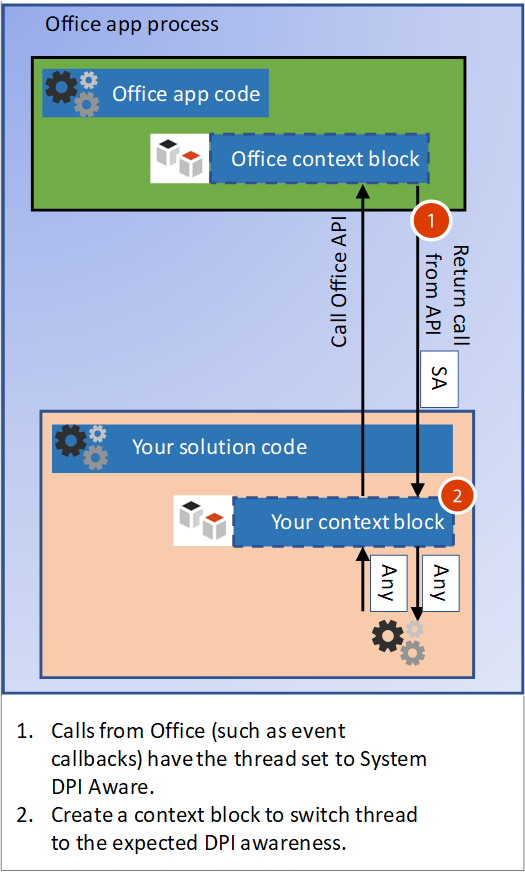
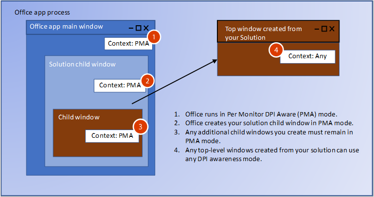
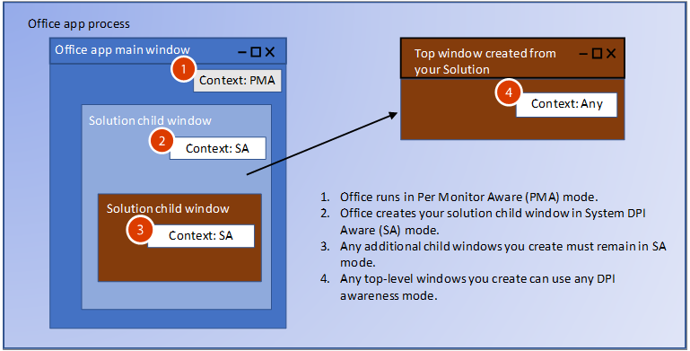

# <a name="handle-high-dpi-and-dpi-scaling-in-your-office-solution"></a>Verarbeiten hoher DPI-Werte und der DPI-Skalierung in Ihrer Office-Lösung

Viele Computer und Anzeigekonfigurationen unterstützen jetzt hohe DPI-Auflösungen (Punkte pro Zoll) und können mehrere Monitore mit unterschiedlichen Größen und Pixeldichten verbinden. Hierfür müssen Anwendungen angepasst werden, wenn der Benutzer die App auf einen Monitor mit einer anderen DPI-Auflösung verschiebt oder die Zoomebene ändert. Anwendungen, die keine DPI-Skalierung unterstützen, werden auf Monitoren mit niedriger DPI-Auflösung möglicherweise korrekt angezeigt, sehen auf einem Monitor mit hoher DPI-Auflösung jedoch vielleicht verzerrt oder unscharf aus. 

Office 2016-Anwendungen, z. B. Word und Excel, wurden so aktualisiert, dass sie auf Änderungen des Skalierungsfaktors reagieren können. Ihre Office-Lösung muss jedoch auch auf Änderungen reagieren, damit sie korrekt dargestellt wird, wenn sich der DPI-Wert ändert. Dieser Artikel beschreibt, wie Office dynamische DPI-Werte unterstützt, und welche Schritte Sie unternehmen können, um die beste Anzeige für Ihre Office-Erweiterbarkeitslösung zur Verarbeitung der DPI-Skalierung sicherzustellen. 

## <a name="dpi-scaling-symptoms-in-your-solution"></a>DPI-Skalierungssymptome in Ihrer Lösung

Windows wendet die DPI-Skalierung an, wenn eine Anwendung von einem Display zu einem anderen Display mit einem anderen DPI-Wert verschoben wird. Dies geschieht in Szenarien, wenn zum Beispiel eine Anwendung auf einen anderen Monitor gezogen wird oder Ihr Laptop angedockt wird. Wenn Ihre Office-Lösung von der DPI-Skalierung beeinträchtigt wird, werden Sie eines oder mehrere der folgenden Symptome feststellen:

- Die Fenster werden an der falschen Position dargestellt oder haben eine falsche Größe.
- Elemente wie Schaltflächen und Beschriftungen werden an der falschen Stelle im Fenster der Lösung angezeigt.
- Schriftarten und Bilder werden zu klein, zu groß oder an der falschen Stelle angezeigt.

Die folgenden Typen von Office-Lösungen können betroffen von der DPI-Skalierung beeinträchtigt werden:

- VSTO-Add-Ins
- Benutzerdefinierte Aufgabenbereiche
- COM-Add-Ins
- ActiveX-Steuerelemente
- Menübanderweiterungen
- OLE-Server
- Office-Web-Add-Ins

## <a name="windows-dpi-awareness-modes"></a>Modi für den DPI-Grad in Windows

In diesem Artikel werden wir uns mit den verschiedenen Modi für den DPI-Grad befassen, die Windows unterstützt. Jeder Modus für den DPI-Grad unterstützt unterschiedliche Funktionen, wie in der folgenden Tabelle beschrieben. Dies ist eine vereinfachte Beschreibung der Modi, um zu veranschaulichen, wie Office-Lösungen diese unterstützen. Weitere Informationen zu den Modi für den DPI-Grad finden Sie unter [Entwicklung von Desktopanwendungen mit hohen DPI-Werten unter Windows](https://docs.microsoft.com/en-us/windows/desktop/hidpi/high-dpi-desktop-application-development-on-windows).

|Modus  |Beschreibung  |Wenn der DPI-Wert geändert wird  |
|---------|---------|---------|
|Nicht DPI-fähig     |    Die Anwendung wird immer so gerendert, als befände sie sich auf einem Bildschirm mit einem DPI-Wert von 96.     |    Die Anwendung wird auf primären und sekundären Monitoren Bitmap-gestreckt.    |
|Kompatibel mit systemspezifischen DPI-Werten     |   Die Anwendung ermittelt den DPI-Wert des primären angeschlossenen Monitors bei der Windows-Anmeldung, kann aber nicht auf DPI-Änderungen reagieren. Weitere Informationen finden Sie im Abschnitt [Konfigurieren von Windows zur Behebung unscharfer Apps](#Configure-Windows-to-fix-blurry-apps) in diesem Artikel.      |     Die Anwendung wird Bitmap-gestreckt, wenn sie auf eine neue Anzeige mit einem anderen DPI-Wert verschoben wird.    |
|Mit monitorspezifischen DPI-Werten kompatibel     |    Die Anwendung kann sich selbst ordnungsgemäß erneut darstellen, wenn sich der DPI-Wert ändert.     |    Windows sendet DPI-Benachrichtigungen an die Fenster auf der obersten Ebene in der Anwendung, damit diese erneut dargestellt werden kann, wenn sich der DPI-Wert ändert.     |
|Pro Monitor v2     |   Die Anwendung kann sich selbst ordnungsgemäß erneut darstellen, wenn sich der DPI-Wert ändert.      |        Windows sendet DPI-Benachrichtigungen an die Fenster auf der obersten Ebene und auch an die untergeordneten Fenster, damit die Anwendung erneut dargestellt werden kann, wenn sich der DPI-Wert ändert. |

## <a name="how-office-supports-dpi-scaling"></a>So unterstützt Office die DPI-Skalierung

Der wichtigste Faktor bei der Ermittlung, wie die Office-Lösung die DPI-Skalierung verarbeiten kann, besteht darin, ob es sich bei der Lösung um ein Fenster auf oberster Ebene oder um ein untergeordnetes Fenster handelt. Die folgende Abbildung zeigt einige Beispiele für Office-Lösungen, die als Fenster auf oberster Ebene oder untergeordnete Fenster ausgeführt werden, und welche Modi für den DPI-Grad diese im Windows April 2018 Update (1803) oder höher verwenden.


In dieser Abbildung gilt Folgendes:
- Das COM-/VSTO-Fenster der obersten Ebene ist „Mit monitorspezifischen DPI-Werten kompatibel“.
- Das untergeordnete Fenster des ActiveX-Steuerelements ist „Kompatibel mit systemspezifischen DPI-Werten“.
- Das Office-Fenster der obersten Ebene ist „Mit monitorspezifischen DPI-Werten kompatibel“.
- Das untergeordnete Fenster des benutzerdefinierten Aufgabenbereichs ist „Kompatibel mit systemspezifischen DPI-Werten“.

## <a name="managing-thread-dpi-context"></a>Verwalten des Thread-DPI-Kontexts

Wenn die Host-Office-App gestartet wird, wird ihr Hauptthread im Kontext „Mit monitorspezifischen DPI-Werten kompatibel“ ausgeführt. Wenn Ihr Lösungscode Threads erstellt oder Aufrufe von Office empfängt, müssen Sie den Thread-DPI-Kontext verwalten.

### <a name="creating-new-threads-with-the-correct-dpi-context"></a>Erstellung von neuen Threads mit dem korrekten DPI-Kontext

Wenn Ihre Lösung zusätzliche Threads erstellt, erzwingt Office für die Threads den Kontext „Mit monitorspezifischen DPI-Werten kompatibel“. Wenn Ihr Code einen anderen Kontext erwartet, müssen Sie die [SetThreadDpiAwarenessContext](https://docs.microsoft.com/en-us/windows/desktop/api/winuser/nf-winuser-setthreaddpiawarenesscontext)-Funktion verwenden, um den erwarteten Thread-DPI-Grad festzulegen. 

### <a name="build-a-context-block-for-incoming-thread-calls"></a>Erstellen eines Kontextblocks für eingehende Threadanrufe



Ihre Lösung interagiert mit ihrer Office-Host-App, es gibt also eingehende Anrufe für Ihre Lösung von Office, z. B. Ereignisrückrufe. Wenn Office Ihre Lösung aufruft, weist es einen Kontextblock auf, der für den Threadkontext den Kontext „Kompatibel mit systemspezifischen DPI-Werten“ erzwingt. Sie müssen den Threadkontext so ändern, dass er dem DPI-Grad Ihres Fensters entspricht. Sie können einen ähnlichen Kontextblock implementieren, um den Threadkontext für eingehende Anrufe umzuschalten. Verwenden Sie die [SetThreadDpiAwarenessContext](https://docs.microsoft.com/en-us/windows/desktop/api/winuser/nf-winuser-setthreaddpiawarenesscontext)-Funktion, um den Kontext an den Fensterkontext anzupassen. 

> [!NOTE]
> Der Kontextblock sollte den ursprünglichen DPI-Threadkontext wiederherstellen, bevor andere Komponenten außerhalb Ihres Lösungscodes aufgerufen werden.

#### <a name="managed-code-context-block"></a>Kontextblock von verwaltetem Code

Im folgenden Beispielcode wird gezeigt, wie Sie Ihren eigenen Kontext Block erstellen.

```csharp
public struct DPI_AWARENESS_CONTEXT
        {
            private IntPtr value;

            private DPI_AWARENESS_CONTEXT(IntPtr value)
            {
                this.value = value;
            }
            public static implicit operator DPI_AWARENESS_CONTEXT(IntPtr value)
            {
                return new DPI_AWARENESS_CONTEXT(value);
            }

            public static implicit operator IntPtr(DPI_AWARENESS_CONTEXT context)
            {
                return context.value;
            }

            public static DPI_AWARENESS_CONTEXT operator -(DPI_AWARENESS_CONTEXT context, long value)
            {
                return (IntPtr)(context.value.ToInt64() - value);
            }
            public static DPI_AWARENESS_CONTEXT operator -(DPI_AWARENESS_CONTEXT context, int value)
            {
                return (IntPtr)(context.value.ToInt32() - value);
            }

            public static bool operator ==(DPI_AWARENESS_CONTEXT context1, DPI_AWARENESS_CONTEXT context2)
            {
                return context1.value == context2;
            }
            public static bool operator !=(DPI_AWARENESS_CONTEXT context1, DPI_AWARENESS_CONTEXT context2)
            {
                return context1.value != context2;
            }

            public static bool operator ==(IntPtr context1, DPI_AWARENESS_CONTEXT context2)
            {
                return AreDpiAwarenessContextsEqual(context1, context2);
            }
            public static bool operator !=(IntPtr context1, DPI_AWARENESS_CONTEXT context2)
            {
                return !AreDpiAwarenessContextsEqual(context1, context2);
            }

            public override bool Equals(object obj)
            {
                return base.Equals(obj);
            }

            public override int GetHashCode()
            {
                return base.GetHashCode();
            }

            public override string ToString()
            {
                if (this.value == DPI_AWARENESS_CONTEXT_UNAWARE)
                {
                    return "Unaware";
                }
                if (this.value == DPI_AWARENESS_CONTEXT_SYSTEM_AWARE)
                {
                    return "System Aware";
                }
                if (this.value == DPI_AWARENESS_CONTEXT_PER_MONITOR_AWARE)
                {
                    return "Per Monitor Aware";
                }
                if (this.value == DPI_AWARENESS_CONTEXT_PER_MONITOR_AWARE_V2)
                {
                    return "Per Monitor Aware V2";
                }
                return "Unknown";
            }
        }

        private static DPI_AWARENESS_CONTEXT DPI_AWARENESS_CONTEXT_HANDLE = IntPtr.Zero;

        public static readonly DPI_AWARENESS_CONTEXT DPI_AWARENESS_CONTEXT_INVALID = IntPtr.Zero;
        public static readonly DPI_AWARENESS_CONTEXT DPI_AWARENESS_CONTEXT_UNAWARE = DPI_AWARENESS_CONTEXT_HANDLE - 1;
        public static readonly DPI_AWARENESS_CONTEXT DPI_AWARENESS_CONTEXT_SYSTEM_AWARE = DPI_AWARENESS_CONTEXT_HANDLE - 2;
        public static readonly DPI_AWARENESS_CONTEXT DPI_AWARENESS_CONTEXT_PER_MONITOR_AWARE = DPI_AWARENESS_CONTEXT_HANDLE - 3;
        public static readonly DPI_AWARENESS_CONTEXT DPI_AWARENESS_CONTEXT_PER_MONITOR_AWARE_V2 = DPI_AWARENESS_CONTEXT_HANDLE - 4;

        public static DPI_AWARENESS_CONTEXT[] DpiAwarenessContexts =
        {
            DPI_AWARENESS_CONTEXT_UNAWARE,
            DPI_AWARENESS_CONTEXT_SYSTEM_AWARE,
            DPI_AWARENESS_CONTEXT_PER_MONITOR_AWARE,
            DPI_AWARENESS_CONTEXT_PER_MONITOR_AWARE_V2
        };

class DPIContextBlock : IDisposable
    {
        private DPI_AWARENESS_CONTEXT resetContext;
        private bool disposed = false;

        public DPIContextBlock(DPI_AWARENESS_CONTEXT contextSwitchTo)
        {
            resetContext = SetThreadDpiAwarenessContext(contextSwitchTo);
         }

        public void Dispose()
        {
            Dispose(true);
            GC.SuppressFinalize(this);
        }

        protected virtual void Dispose(bool disposing)
        {
            if (!disposed)
            {
                if (disposing)
                {
                    SetThreadDpiAwarenessContext(resetContext);
                }
            }
            disposed = true;
        }
    }
```

#### <a name="native-code-context-block"></a>Kontextblock von systemeigenem Code

```cpp
#include <winuser.h>
/* DpiAwarenessContextBlock can be used to simplify setting and resetting the DPI_AWARENESS_CONTEXT of
the current thread.  When the object is constructed, the DPI_AWARENESS_CONTEXT is set, and when the object is
destructed, the DPI awareness context is reverted to the previous awareness context at construct time.

This object allows us to write code such as:

// Thread state is currently DPI_AWARENESS_SYSTEM_AWARE
if (condition)
{
DpiAwarenessContextBlock perMonitorAware(DPI_AWARENESS_PER_MONITOR_AWARE);
... // Create a top-level hwnd with the current thread state, DPI_AWARENESS_PER_MONITOR_AWARE
}
// Thread state automatically returns to DPI_AWARENESS_SYSTEM_AWARE

*/
class DpiAwarenessContextBlock
{
public:
      DpiAwarenessContextBlock(DPI_AWARENESS_CONTEXT dpiContext) noexcept;
      ~DpiAwarenessContextBlock();

      // Copy and move are not to be used with these context objects
      DpiAwarenessContextBlock(const DpiAwarenessContextBlock&) = delete;
      DpiAwarenessContextBlock(DpiAwarenessContextBlock&&) = delete;

private:
      DPI_AWARENESS_CONTEXT m_contextReversalType;
      bool m_doContextSwitch;
};

inline DpiAwarenessContextBlock::DpiAwarenessContextBlock(DPI_AWARENESS_CONTEXT dpiContext) noexcept
{
      m_contextReversalType = SetThreadDpiAwarenessContext(dpiContext);
}

inline DpiAwarenessContextBlock::~DpiAwarenessContextBlock()
{
      SetThreadDpiAwarenessContext(m_contextReversalType);
}
```
<h2 id="top-level-window-management">Verwaltung des Fensters auf oberster Ebene</h2>

Beim Starten von Office-Anwendungen wird ein Aufruf von [SetThreadDpiAwarenessContext](https://docs.microsoft.com/en-us/windows/desktop/api/winuser/nf-winuser-setthreaddpiawarenesscontext) als DPI_AWARENESS_CONTEXT_PER_MONITOR_AWARE vorgenommen. In diesem Kontext werden DPI-Änderungen an den HWND eines beliebigen Fensters auf oberster Ebene gesendet, das als „Mit monitorspezifischen DPI-Werten kompatibel“ ausgeführt wird. Fenster der obersten Ebene sind das Office-Anwendungsfenster sowie alle zusätzlichen Fenster auf oberster Ebene, die von Ihrer Lösung erstellt werden. Wenn eine Office-Anwendung zu einer neuen Anzeige verschoben wird, wird diese benachrichtigt, damit sie sich dynamisch skalieren und korrekt in der DPI der neuen Anzeige darstellen kann. Die Office-Lösung kann Fenster der obersten Ebene erstellen, die sich in einem beliebigen Modus für den DPI-Grad befinden. Die Fenster auf oberster Ebene können auch auf DPI-Änderungen reagieren, indem sie Windows-Nachrichten auf die Änderungen abhören.

Wenn Sie untergeordnete Fenster erstellen, die Ihrem Fenster auf oberster Ebene übergeordnet sind, können Sie diese auch auf einen beliebigen Modus für den DPI-Grad festlegen. Wenn Sie jedoch den Modus „Mit monitorspezifischen DPI-Werten kompatibel“ verwenden, erhalten die untergeordneten Fenster keine DPI-Änderungsbenachrichtigungen.  Weitere Informationen zu Modi für den DPI-Grad in Windows finden Sie unter [Entwicklung von Desktopanwendungen mit hohen DPI-Werten unter Windows](https://docs.microsoft.com/en-us/windows/desktop/hidpi/high-dpi-desktop-application-development-on-windows).

## <a name="child-window-management"></a>Verwaltung von untergeordneten Fenstern

Wenn Sie mit ActiveX-Steuerelementen und benutzerdefinierten Aufgabenbereichen arbeiten, erstellt Office das untergeordnete Fenster für Ihre Lösung. Sie können weitere untergeordnete Fenster erstellen, Sie müssen aber den DPI-Grad des übergeordneten Fensters beachten. Office wird im Modus „Mit monitorspezifischen DPI-Werten kompatibel“ ausgeführt, was bedeutet, dass alle untergeordneten Elemente in Ihrer Lösung keine DPI-Änderungsbenachrichtigungen erhalten. Nur der Modus „Pro Monitor v2“ unterstützt das Senden von DPI-Änderungen an untergeordnete Fenster (Office unterstützt „Pro Monitor v2“ nicht). Für ActiveX-Steuerelemente gibt es jedoch eine Lösung. Weitere Informationen hierzu finden Sie im Abschnitt [ActiveX-Steuerelemente](#activex-controls) weiter unten in diesem Artikel.

> [!NOTE]
> Wenn das untergeordnete Fenster ein Fenster auf oberster Ebene erstellt, können Sie einen beliebigen Modus für den DPI-Grad für das neue Fenster auf oberster Ebene verwenden. Weitere Informationen zum Verwalten von Fenstern der obersten Ebene finden Sie im Abschnitt [Verwaltung des Fensters auf oberster Ebene](#top-level-window-management) in diesem Artikel.

Sie werden sehen, dass zwei unterschiedliche DPI-Modi auf das untergeordnete Fenster angewendet werden, je nachdem, welche Version von Windows 10 Office ausgeführt wird.

### <a name="office-dpi-behavior-on-windows-fall-creators-update-1709"></a>Office-DPI-Verhalten im Windows Fall Creators Update (1709)

Da Office-Apps den Modus „Mit monitorspezifischen DPI-Werten kompatibel“ verwenden, werden die untergeordneten Fenster Ihrer Lösung ebenfalls im Modus „Mit monitorspezifischen DPI-Werten kompatibel“ erstellt. Dies bedeutet, dass Windows davon ausgeht, dass Ihre Lösung beim Zeichnen in einer neuen DPI-Auflösung aktualisiert wird.  Da Ihr Fenster keine DPI-Änderungsbenachrichtigungen erhalten kann, ist die Benutzeroberfläche Ihrer Lösung möglicherweise nicht korrekt. 



### <a name="office-dpi-behavior-on-windows-april-2018-update-1803"></a>Office-DPI-Verhalten im Windows April 2018 Update (1803)

Beim Windows April 2018 (1803) Update und höher verwendet das Office-DPI-Hostingverhalten für einige Szenarien eine DPI-Skalierung im gemischten Modus. Auf diese Weise können Fenster im Modus „Kompatibel mit systemspezifischen DPI-Werten“ Office-Fenstern übergeordnet werden, die auf den Modus „Mit monitorspezifischen DPI-Werten kompatibel“ festgelegt sind. So kann eine verbesserte Kompatibilität sichergestellt werden, wenn sich der DPI-Wert ändert, wenn die Fenster Bitmap-gestreckt werden. Die Fenster können nach der Bitmap-Streckung noch unscharf sein.



Wenn Sie neue untergeordnete Fenster erstellen, stellen Sie sicher, dass diese dem DPI-Grad ihres übergeordneten Fensters entsprechen. Sie können die [GetWindowdpiAwarenessContext](https://docs.microsoft.com/en-us/windows/desktop/api/winuser/nf-winuser-getwindowdpiawarenesscontext)-Funktion verwenden, um den DPI-Grad des übergeordneten Fensters abzurufen. Weitere Informationen zur Konsistenz des DPI-Grads finden Sie im Abschnitt „Erzwungenes Zurücksetzen des prozessweiten DPI-Grads unter [Entwicklung von Desktopanwendungen mit hohen DPI-Werten unter Windows](https://docs.microsoft.com/en-us/windows/desktop/hidpi/high-dpi-desktop-application-development-on-windows#related-topics).

> [!NOTE]
> Sie können sich nicht auf den Prozess-DPI-Grad verlassen, da dieser möglicherweise [PROCESS_SYSTEM_DPI_AWARE](https://msdn.microsoft.com/en-us/library/windows/desktop/dn280512(v=vs.85).aspx) zurückgibt, auch dann, wenn der Kontext des DPI-Grads des Anwendungshauptthreads [DPI_AWARENESS_CONTEXT_PER_MONITOR_AWARE](https://docs.microsoft.com/en-us/windows/desktop/hidpi/dpi-awareness-context) lautet. Verwenden Sie die [GetThreadDpiAwarenessContext](https://docs.microsoft.com/en-us/windows/desktop/api/winuser/nf-winuser-getthreaddpiawarenesscontext)-Funktion, um den Kontext des Thread-DPI-Grads zu erhalten.

## <a name="office-and-windows-dpi-compatibility-settings"></a>Einstellungen für Office- und Windows-DPI-Kompatibilität

Wenn Benutzer auf Add-Ins oder Lösungen stoßen, die nicht korrekt gerendert werden, können einige Kompatibilitätseinstellungen das Problem lösen.

<h3 id="office-compatibility">Konfigurieren von Office zur Optimierung für Kompatibilität</h3>

Office bietet eine Einstellung zur Optimierung für Kompatibilität beim Verschieben in unterschiedliche DPI-Skalierungen auf unterschiedlichen Bildschirmen. Der Kompatibilitätsmodus deaktiviert die DPI-Skalierung, sodass alles in Office beim Verschieben in eine Anzeige mit unterschiedlicher DPI-Skalierung Bitmap-gestreckt wird. 

Der Kompatibilitätsmodus erzwingt, dass Office im Modus „Kompatibel mit systemspezifischen DPI-Werten“ ausgeführt wird. Dies bewirkt, dass Anwendungsfenster Bitmap-gestreckt werden, sodass diese möglicherweise unscharf aussehen. Die Office-Lösung kann diese Einstellung nicht steuern, da sie vom Benutzer ausgewählt wird. Durch Verwenden des Anzeigekompatibilitätsmodus können die meisten Darstellungsprobleme gelöst werden. Weitere Informationen finden Sie unter [Office-Support für HD-Anzeigen](https://support.office.com/en-us/article/office-support-for-high-definition-displays-6720ca0e-be59-41f6-b629-1369f549279d). 

### <a name="configure-windows-to-fix-blurry-apps"></a>Konfigurieren von Windows zur Behebung unscharfer Apps

Windows 10 (Version 1803) und höher umfasst eine Einstellung zur Korrektur von Apps derart, dass sie nicht unscharf sind. Dies ist eine weitere Einstellung, die Sie versuchen können, wenn die Lösung nicht korrekt gerendert wird. Die Office-Lösung kann diese Einstellung nicht steuern, da sie vom Benutzer ausgewählt wird. Weitere Informationen finden Sie unter [Korrigieren von Apps, die in Windows 10 unscharf angezeigt werden](https://support.microsoft.com/en-us/help/4091364/windows-10-fix-blurry-apps).

## <a name="how-to-support-dpi-scaling-in-your-solution"></a>Unterstützung der DPI-Skalierung in Ihrer Lösung

Einige Lösungen können DPI-Änderungen empfangen und darauf reagieren. Einige bietet eine Problemumgehung, wenn sie keine Benachrichtigungen empfangen können. In der folgenden Tabelle sind die Details für jeden Lösungstyp aufgeführt.

<table>
    <thead>
        <tr>
            <th>Lösungstyp</th>
            <th>Fenstertyp</th>
            <th>Kann auf die DPI-Skalierung reagieren</th>
            <th>Weitere Details</th>
        </tr>
    </thead>
<tbody>
    <tr>
        <td rowspan="2"><a href="#vsto-add-ins">VSTO-Add-Ins</a></td>
        <td>Oberstes Element und Nachfolgerelemente</td>
        <td>Ja</td>
        <td>Siehe <a href="#vsto-add-ins">Hilfestellung zu VSTO-Add-Ins</a>.</td>
    </tr>
<tr>
        <td>Untergeordnetes Element für Office-Fenster</td>
        <td>Nein</td>
        <td>Siehe <a href="#office-compatibility">Konfigurieren von Office zur Optimierung für Kompatibilität</a>.</td>
</tr>
    <tr>
        <td rowspan="2"><a href="#custom-task-panes">Benutzerdefinierter Aufgabenbereich</a></td>
        <td>Oberstes Element und Nachfolgerelemente</td>
        <td>Ja</td>
        <td>Siehe <a href="#top-level-window-management">Hilfestellung für Fenster auf oberster Ebene</a>.</td>
    </tr>
<tr>
        <td>Untergeordnetes Element für Office-Fenster</td>
        <td>Nein</td>
        <td>Siehe <a href="#office-compatibility">Konfigurieren von Office zur Optimierung für Kompatibilität</a>.</td>
</tr>
    <tr>
        <td rowspan="2"><a href="#com-add-ins">COM-Add-In</a></td>
        <td>Oberstes Element und Nachfolgerelemente</td>
        <td>Ja</td>
        <td>Siehe <a href="#com-add-ins">Hilfestellung zu COM-Add-Ins</a>.</td>
    </tr>
<tr>
        <td>Untergeordnetes Element für Office-Fenster</td>
        <td>Nein</td>
        <td>Siehe <a href="#office-compatibility">Konfigurieren von Office zur Optimierung für Kompatibilität</a>.</td>
</tr>
    <tr>
        <td rowspan="2"><a href="#activex-controls">ActiveX-Steuerelement</a></td>
        <td>Oberstes Element und Nachfolgerelemente</td>
        <td>Ja</td>
        <td>Siehe <a href="#activex-controls">Hilfestellung zu ActiveX-Steuerelement</a>.</td>
    </tr>
    <tr>
        <td>Untergeordnetes Element für Office-Fenster</td>
        <td>Ja</td>
    </tr>
    <tr>
        <td><a href="#web-add-ins">Web-Add-In</a></td>
        <td>–</td>
        <td>Ja</td>
        <td>Siehe <a href="#web-add-ins">Hilfestellung zu Office-Web-Add-In</a>.</td>
    </tr>
    <tr>
        <td><a href="#ribbon-extensibility">Menübanderweiterung</a></td>
        <td>–</td>
        <td>–</td>
        <td>Siehe <a href="#ribbon-extensibility">Hilfestellung zur Menübanderweiterung</a>.</td>
    </tr>
    <tr>
        <td><a href="#ole">OLE-Server oder -Client</a></td>
        <td>–</td>
        <td>–</td>
        <td>Siehe <a href="#ole">Hilfestellung zur OLE-Server/-Client</a>.</td>
    </tr>
</tbody>
</table>

<h3 id="vsto-add-ins">VSTO-Add-In</h3>

Wenn Ihr VSTO-Add-In untergeordnete Fenster erstellt, die beliebigen Office-Fenstern übergeordnet sind, stellen Sie sicher, dass diese dem DPI-Grad des übergeordneten Fensters entsprechen. Sie können die [GetWindowdpiAwarenessContext](https://docs.microsoft.com/en-us/windows/desktop/api/winuser/nf-winuser-getwindowdpiawarenesscontext)-Funktion verwenden, um den DPI-Grad des übergeordneten Fensters abzurufen. Ihre untergeordneten Fenstern empfangen keine DPI-Änderungsbenachrichtigungen. Wenn Ihre Lösung nicht richtig gerendert wird, müssen Benutzer für Office den Kompatibilitätsmodus festlegen.

Für alle Fenster der obersten Ebene, die Ihr VSTO-Add-In erstellt, können Sie einen beliebigen Modus für den DPI-Grad festlegen. Im folgenden Beispielcode wird gezeigt, wie der gewünschte DPI-Grad eingerichtet und wie auf DPI-Änderungen reagiert wird. Außerdem müssen Sie „app.config“, wie im Artikel [Unterstützung hoher DPI-Werte in Windows Forms](https://docs.microsoft.com/en-us/dotnet/framework/winforms/high-dpi-support-in-windows-forms) beschrieben, anpassen. 

```csharp
using System;
using System.Diagnostics;
using System.Drawing;
using System.Runtime.InteropServices;
using System.Windows.Forms;

namespace SharedModule
{
    // DpiAwareWindowsForm
    // For any top level winform you create, derive from the DpiWindowsForm class
    // if you are creating Windows Forms with the Dpi Awareness Context set to 
    // DPI_AWARENESS_CONTEXT_PER_MONITOR_AWARE or DPI_AWARENESS_CONTEXT_PER_MONITOR_AWARE_V2
    //
    // For example, if you Window form class is defined as:
    //    public partial class TopLevelWinForm : Form
    //
    // update to:
    //    public partial class TopLevelWinForm : DpiAwareWindowsForm
    //
    // When showing the form, call SetThreadDpiAwarenessContext() or use a context block to
    // to set the desired Dpi Awareness Context.
    //
    // For example, here is code to show a Windows Form using a context block as Per Monitor Aware v2.
    //
    //    DPIContextBlock context = new DPIContextBlock(DPI_AWARENESS_CONTEXT_PER_MONITOR_AWARE_V2);
    //    TopLevelWinForm frm = new TopLevelWinForm();
    //    frm.Show();
    //
    public partial class DpiAwareWindowsForm : Form
    {
        private SizeF m_newDpi = SizeF.Empty;
        private SizeF m_oldDpi = SizeF.Empty;

        public DpiAwareWindowsForm()
        {
            this.HandleCreated += new EventHandler((sender, args) =>
            {
                m_oldDpi = m_newDpi = DPIHelper.GetDpiForWindowSizeF(this.Handle);
            });
        }

        public void OnDpiChangedEvent(RECT newRect)
        {
            this.SuspendLayout();

            // Resize form
            this.Width = newRect.Width;
            this.Height = newRect.Height;

            // Resize controls and set font sizes
            ScaleAllChildControls(this.Controls, m_oldDpi.Width, m_newDpi.Width);
            this.ResumeLayout(true);
        }

        // Additional changes may be needed for controls that set Anchor or Dock properties 
        private void ScaleAllChildControls(Control.ControlCollection controls, float oldDpi, float newDpi)
        {
            float scaleFactorChange = newDpi / oldDpi;

            foreach (Control control in controls)
            {
                control.Top = (int)(control.Top * scaleFactorChange);
                control.Left = (int)(control.Left * scaleFactorChange);
                control.Width = (int)(control.Width * scaleFactorChange);
                control.Height = (int)(control.Height * scaleFactorChange);
                control.Font = ScaleFont(control.Font, oldDpi, newDpi);
            }
        }

        private Font ScaleFont(Font font, float oldDpi, float newDpi)
        {
            float fontSizePx = 0.0f;
            float fontSizePt = 0.0f;

            fontSizePx = font.SizeInPoints / 72 * oldDpi;
            fontSizePt = fontSizePx * (newDpi / oldDpi) * 72 / oldDpi;

            return new Font(font.Name, fontSizePt, font.Style, GraphicsUnit.Point);
        }

        protected override void WndProc(ref Message m)
        {
            switch ((DPIHelper.WinMessages)m.Msg)
            {
                case DPIHelper.WinMessages.WM_DPICHANGED:
                    // Marshal the value in the lParam into a Rect.
                    RECT newDisplayRect = (RECT)Marshal.PtrToStructure(m.LParam, typeof(RECT));

                    // Remember current DPI and calculate current from WParam.
                    // Both X and Y are the same on Windows for Dpi.
                    m_oldDpi = m_newDpi;

                    m_newDpi.Width = (float)(m.WParam.ToInt32() >> 16);
                    m_newDpi.Height = (float)(m.WParam.ToInt32() & 0x0000FFFF);

                    // DPI should be the same for both width and height on Windows devices.
                    Debug.Assert(m_newDpi.Height == m_newDpi.Width);

                    if (m_oldDpi.Width != m_newDpi.Width)
                    {
                        OnDpiChangedEvent(newDisplayRect);
                    }
                    base.DefWndProc(ref m);
                    break;
                default:
                    base.WndProc(ref m);
                    break;
            }
        }
    }
}
```

<h3 id="custom-task-panes">Benutzerdefinierte Aufgabenbereiche</h3>

Ein benutzerdefinierter Aufgabenbereich wird als untergeordnetes Fenster von Office erstellt. Wenn dieser im Windows Fall Creators Update (1709) ausgeführt wird, wird der benutzerdefinierte Aufgabenbereich mit demselben Modus für den DPI-Grad wie Office ausgeführt. Wenn dieser im Windows April 2018 Update (1803) und höher ausgeführt wird, wird der benutzerdefinierte Aufgabenbereich mit demselben Modus für den DPI-Grad wie das System ausgeführt. 

Da benutzerdefinierte Aufgabenbereiche untergeordnete Fenster sind, können sie keine DPI-Benachrichtigungen erhalten. Wenn sie nicht ordnungsgemäß dargestellt werden, muss der Benutzer den [Office-DPI-Kompatibilitätsmodus](https://support.office.com/en-us/article/office-support-for-high-definition-displays-6720ca0e-be59-41f6-b629-1369f549279d) verwenden.
Wenn der benutzerdefinierte Aufgabenbereich Fenster der obersten Ebene erstellt, können diese Fenster in einem beliebigen Modus für den DPI-Grad ausgeführt werden und DPI-Änderungsbenachrichtigungen empfangen. Weitere Informationen finden Sie im Abschnitt [Verwaltung des Fensters auf oberster Ebene](#Top-level-window-management) in diesem Artikel.

<h3 id="com-add-ins">COM-Add-Ins</h3>

COM-Add-Ins, die Fenster auf oberster Ebene erstellen, können DPI-Benachrichtigungen erhalten. Sie sollten einen [Kontextblock](#Build-a-context-block-for-incoming-thread-calls) erstellen, um den Thread auf den für das Fenster gewünschten DPI-Grad festzulegen; erstellen Sie dann das Fenster. Das korrekte Verarbeiten der DPI-Benachrichtigungen ist nicht ganz einfach, lesen Sie deshalb unbedingt die Informationen unter [Entwicklung von Desktopanwendungen mit hohen DPI-Werten unter Windows](https://docs.microsoft.com/en-us/windows/desktop/hidpi/high-dpi-desktop-application-development-on-windows#related-topics), um weitere Informationen zu erhalten.

Die [WM_DPICHANGED](https://msdn.microsoft.com/en-us/library/windows/desktop/dn312083(v=vs.85).aspx)-Meldung wird gesendet, wenn sich der DPI-Wert für ein Fenster geändert hat.  Diese Meldung wird in nicht verwaltetem Code von der [Windows-Prozedur](https://msdn.microsoft.com/en-us/library/windows/desktop/ms633570(v=vs.85).aspx) für den HWND verarbeitet.  Ein Beispiel für Handlercode für eine DPI-Änderung finden Sie im Artikel [WM_DPICHANGED](https://msdn.microsoft.com/en-us/library/windows/desktop/dn312083(v=vs.85).aspx). 

COM-Add-Ins, die untergeordnete Fenster anzeigen, die einem Fenster in Office übergeordnet sind, können keine DPI-Benachrichtigungen empfangen. Wenn sie nicht ordnungsgemäß dargestellt werden, muss der Benutzer den [Office-DPI-Kompatibilitätsmodus](https://support.office.com/en-us/article/office-support-for-high-definition-displays-6720ca0e-be59-41f6-b629-1369f549279d) verwenden.

<h3 id="activex-controls">ActiveX-Steuerelemente</h3>

Wie die DPI-Skalierung in ActiveX-Steuerelementen unterstützt wird, hängt davon ab, ob das Steuerelement Fenster aufweist oder nicht.

#### <a name="windowed-activex-controls"></a>ActiveX-Steuerelemente mit Fenstern

ActiveX-Steuerelemente mit Fenstern erhalten jedes Mal, wenn die Größe des Steuerelements geändert wird, eine WM_SIZE-Meldung.  Wenn dieses Ereignis ausgelöst wird, kann der Ereignishandlercode die [GetDpiForWindow](https://docs.microsoft.com/en-us/windows/desktop/api/winuser/nf-winuser-getdpiforwindow)-Funktion mit dem HWND des Steuerelements aufrufen, um den DPI-Wert abzurufen und die Unterschiede des Skalierungsfaktors zu berechnen und diese bei Bedarf anzupassen. 

Im folgenden Beispiel wird ein MFC-basiertes ActiveX-Steuerelement so aktiviert, dass es auf das **OnSize**-Ereignis reagieren kann. 

```cpp
void ChangeWindowFontDPI(HWND hWnd, UINT dpi) 
{ 
LOGFONT fontInfo1 = { 0 }; 
// Calculate the font height based on the DPI. 
fontInfo1.lfHeight = -MulDiv(DESIRED_HEIGHT, dpi, 72); 
fontInfo1.lfQuality = CLEARTYPE_QUALITY; 
wcscpy_s(fontInfo1.lfFaceName, DESIRED_FONT_NAME); 
 
::SendMessage(hWnd, WM_SETFONT, (WPARAM)::CreateFontIndirectW(&fontInfo1), TRUE); 
} 
 
BOOL CALLBACK CMainDialog::EnumChildProc(HWND hWnd, LPARAM lParam) 
{ 
CMainDialog* _this = (CMainDialog*) lParam; 
if (_this != nullptr) 
{ 
// Calculate the scale factor difference between the old and new DPI changes. 
double scale = (((double) _this->m_newDPI) /  
   (((double) _this->m_currentDPI) / 100.0)) / 100; 
 
RECT rect = {}; 
::GetWindowRect(hWnd, &rect); 
 
POINT pt = { rect.left, rect.top }; 
::ScreenToClient(::GetParent(hWnd), &pt); 
 
// Adjust the window based on the scale changes. 
::MoveWindow(hWnd, 
pt.x * scale, 
pt.y * scale, 
(rect.right - rect.left) * scale, 
(rect.bottom - rect.top) * scale, 
TRUE); 
 
ChangeWindowFontDPI(hWnd, _this->m_newDPI); 
return TRUE; 
} 
return FALSE; 
} 
 
void CMainDialog::OnSize(UINT nType, int cx, int cy) 
{ 
CDialog::OnSize(nType, cx, cy); 
 
// Get the new DPI and enumerate the child windows that will use that value. 
m_currentDPI = ::GetDpiForWindow(this->GetSafeHwnd()); 
::EnumChildWindows(this->GetSafeHwnd(), EnumChildProc, (LPARAM)this); 
} 
```

#### <a name="windowless-activex-controls"></a>ActiveX-Steuerelemente in Windows

ActiveX-Steuerelemente in Windows müssen nicht unbedingt einen HWND aufweisen.  Wenn ein ActiveX-Steuerelement in einen Zeichenbereich eingefügt wird, liegt es im Entwurfsmodus vor.  In Office-Anwendungen gibt der Hostingcontainer 0 für den Aufruf von hDC->GetWindow() im ::OnDraw-Ereignis zurück, wenn sich das Steuerelement im Entwurfsmodus befindet.  In diesem Fall kann kein zuverlässiger DPI-Wert abgerufen werden. 

Wenn sich das Steuerelement aber im Laufzeitmodus befindet, gibt Office den HWND an der Stelle zurück, an der das Steuerelement gezeichnet werden soll.  In diesem Fall kann der Entwickler des Steuerelements [GetDpiForWindow](https://docs.microsoft.com/en-us/windows/desktop/api/winuser/nf-winuser-getdpiforwindow) aufrufen und den aktuellen DPI-Wert sowie die Skalierungsschriftarten, Steuerelemente usw. abrufen. 

<h3 id="ribbon-extensibility">Menübanderweiterbarkeit</h3>

Alle Rückrufe von Office für benutzerdefinierte Menübandsteuerelemente weisen den DPI-Thread-Grad „Kompatibel mit systemspezifischen DPI-Werten“ auf.  Wenn Ihre Lösung einen anderen DPI-Thread-Grad erwartet, sollten Sie einen Kontextblock implementieren, um den Thread-Grad wie erwartet festzulegen. Weitere Informationen finden Sie unter [Erstellen eines Kontextblocks](#Build-a-context-block-for-incoming-thread-calls).

<h3 id="ole">OLE-Clients und -Server</h3>

Wenn ein OLE-Server in einem OLE-Clientcontainer gehostet wird, können Sie derzeit keine aktuellen oder unterstützten DPI-Informationen bereitstellen. Dies kann Probleme verursachen, da einige Kombinationen von gemischten Modi mit übergeordneten und untergeordneten Fenstern von der aktuellen Windows-Architektur nicht unterstützt werden. Wenn Word oder Excel feststellen, dass es mehrere Monitore mit unterschiedlichen DPI-Skalierungen gibt, wird keine direkte Aktivierung unterstützt. Der OLE-Server wird indirekt aktiviert. Wenn Probleme mit OLE-Serverinteraktionen auftreten, muss der Benutzer den [Office-DPI-Kompatibilitätsmodus](https://support.office.com/en-us/article/office-support-for-high-definition-displays-6720ca0e-be59-41f6-b629-1369f549279d) verwenden.

<h3 id="web-add-ins">Office-Web-Add-Ins</h3>

Office-Add-Ins, die mit der JavaScript-API für Office erstellt wurden, werden innerhalb eines Browsersteuerelements ausgeführt. Sie können die DPI-Skalierung mit denselben Techniken wie beim Entwurf anderer Web-Apps verarbeiten. Es gibt viele Onlineressourcen, die beim Entwerfen einer Webseite für Bildschirme mit hohen Auflösungen behilflich sind.

## <a name="verify-that-your-solution-supports-dpi-scaling"></a>Überprüfen, dass Ihre Lösung die DPI-Skalierung unterstützt

Nachdem Sie Ihre Anwendung so aktualisiert haben, dass sie die DPI-Skalierung unterstützt, sollten Sie Ihre Änderungen in einer gemischten DPI-Umgebung überprüfen. Überprüfen Sie, ob der Benutzeroberflächencode ordnungsgemäß auf DPI Änderungen reagiert, wenn die Fenster Ihrer Lösung von einem Bildschirm auf einen anderen verschoben werden, der andere DPI-Werte aufweist. Weitere Informationen zu Techniken für das Testen der DPI-Skalierung finden Sie unter [Entwicklung von Desktopanwendungen mit hohen DPI-Werten unter Windows](https://docs.microsoft.com/en-us/windows/desktop/hidpi/high-dpi-desktop-application-development-on-windows#related-topics).

Vielleicht finden Sie auch diese zusätzlichen Methoden hilfreich:

- Bei einem Laptop können Sie den primären Monitor auf einen externen Monitor festlegen und das Docking des Laptops dann aufheben. Dadurch wird erzwungen, dass der primäre Monitor in die Laptopanzeige wechselt.
- Verwenden Sie das Open-Source-Tool [WinSpy++](https://github.com/BissetJ/winspy/releases) zum Debuggen. Sie können das Tool verwenden, um die Einstellung des DPI-Grads eines beliebigen Fensters anzuzeigen.
- Sie können Remotedesktop verwenden, um mehrere Monitore auf einem Remotecomputer zu testen, indem Sie auf der Registerkarte „Anzeige“ die Option „Alle Monitore für Remotesitzung verwenden“ verwenden, wie im folgenden Screenshot dargestellt.


## <a name="see-also"></a>Siehe auch

### <a name="articles"></a>Artikel

- 
  [Schreiben von Desktop- und Win32-Anwendungen mit DPI-Grad](https://msdn.microsoft.com/en-us/library/windows/desktop/dn469266(v=vs.85).aspx) bietet eine allgemeine Übersicht und einen Leitfaden zum Schreiben von Win32-Desktopanwendungen. Viele der in diesem Artikel beschriebenen Techniken gelten auch für Office-Erweiterbarkeitslösungen.
- 
  [DPI-Skalierung im gemischten Modus und mit DPI-Werten kompatible APIs](https://msdn.microsoft.com/en-us/library/windows/desktop/mt744321(v=vs.85).aspx) enthält eine Liste von APIs im Zusammenhang mit DPI.
- [Entwicklerleitfaden – DPI pro Monitor – WPF-Vorschau](https://github.com/Microsoft/WPF-Samples/blob/master/PerMonitorDPI/Developer%20Guide%20-%20Per%20Monitor%20DPI%20-%20WPF%20Preview.docx) behandelt den WPF-App-Entwicklungsleitfaden zum Erstellen von WPF-Apps, die mit DPI-Werten kompatibel sind.
- [Office-Unterstützung für HD-Displays](https://support.office.com/en-us/article/Office-support-for-high-definition-displays-6720ca0e-be59-41f6-b629-1369f549279d) bietet Informationen darüber, wie ein Benutzer Office für eine Optimierung für Kompatibilität festlegen kann, wenn Ihre Office-Lösung nicht korrekt unterstützt wird, wenn sich der DPI-Wert ändert.
- [Anzeigen von Skalierungsänderungen für das Windows 10 Anniversary Update](https://blogs.technet.microsoft.com/askcore/2016/08/16/display-scaling-changes-for-the-windows-10-anniversary-update/) ist ein Blogbeitrag, in dem Änderungen behandelt werden, die mit dem Windows 10 Anniversary Update eingeführt wurden. 
- [DPI_AWARENESS_CONTEXT-Handle](https://docs.microsoft.com/en-us/windows/desktop/hidpi/dpi-awareness-context) liefert Programmierdetails zu den DPI_AWARENESS_CONTEXT-Werten und -Definitionen.
- [Entwicklung von Desktopanwendungen mit hohen DPI-Werten unter Windows](https://docs.microsoft.com/en-us/windows/desktop/hidpi/high-dpi-desktop-application-development-on-windows#testing-your-changes) umfasst Informationen zum Testen im Abschnitt „Testen Ihrer Änderungen“.

### <a name="code-samples"></a>Codebeispiele

- [Beispiel für den DPI-Grad pro Fenster](https://github.com/Microsoft/Windows-classic-samples/tree/master/Samples/DPIAwarenessPerWindow)
- [Beispiel für dynamische DPI-Werte](https://github.com/Microsoft/Windows-classic-samples/tree/master/Samples/DynamicDPI)
- [WPF-Beispiel pro Monitor](https://github.com/Microsoft/Windows-classic-samples/tree/master/Samples/PerMonitorDPIAware)
