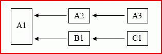

# Multithread-Neuberechnung in Excel

**Gilt für**: Excel 2013 | Office 2013 | Visual Studio 
  
Microsoft Office Excel 2007 war die erste Version von Excel, in der die Multithread-Neuberechnung (MTR) für Arbeitsblätter verwendet wurde. Sie können Excel für die Verwendung von bis zu 1.024 gleichzeitigen Threads bei der Neuberechnung konfigurieren, unabhängig von der Anzahl von Prozessoren oder Prozessorkernen auf dem Computer. 
  
> [!NOTE]
> Da mit jedem Thread ein Betriebssystemmehraufwand verbunden ist, sollten Sie Excel nicht für die Verwendung von mehr Threads als erforderlich konfigurieren. 
  
Wenn der Computer über mehrere Prozessoren oder Prozessorkerne verfügt, übernimmt das Betriebssystem die Verantwortung für die effizienteste Zuweisung von Threads zu den Prozessoren.
  
## Übersicht über die Excel-MTR

Excel versucht, die Teile der Berechnungskette zu identifizieren, die in verschiedenen Threads gleichzeitig neu berechnet werden können. Die folgende sehr einfache Struktur (bei der x ? y bedeutet, dass y nur von x abhängt) zeigt ein Beispiel dafür.
  
**Abbildung 1. Gleichzeitiges Berechnen in verschiedenen Threads**

  
Nachdem A1 berechnet ist, können A2 und dann A3 in einem Thread berechnet werden, während B1 und dann C1 in einem anderen Thread berechnet werden, vorausgesetzt, dass alle Zellen threadsicher sind. 
  
> [!NOTE]
> Der Begriff threadsichere Zelle bedeutet, dass eine Zelle nur threadsichere Funktionen enthält. Was und was nicht threadsicher ist, wird ausführlich [Was von Excel als threadsicher betrachtet wird und was nicht](#xl2007xllsdk_threadsafe) erläutert. 
  
Die meisten praktischen Arbeitsmappen enthalten viel komplexere Abhängigkeitsstrukturen als dieses Beispiel. Darüber hinaus ist die Neuberechnungszeit einer Zelle erst bekannt, wenn eine Berechnung abgeschlossen ist und kann je nach Argumenten der Funktion stark variieren. Für optimale Ergebnisse versucht Excel, die Berechnungsreihenfolge für jede Berechnung zu optimieren, bis keine weitere Optimierung möglich ist.
  
Excel verwendet einen einzelnen Hauptthread, um Folgendes auszuführen:
  
- Integrierte Befehle
    
- XLL-Befehle
    
- XLL-Add-In-Manager-Benutzeroberflächenfunktionen (**xlAutoOpen**-Funktion usw.) 
    
- Benutzerdefinierte Befehle von Microsoft Visual Basic for Applications (VBA) (oft als Makros bezeichnet)
    
- Benutzerdefinierte VBA-Funktionen
    
- Integrierte threadunsichere Arbeitsblattfunktionen (eine Liste finden Sie im nächstem Abschnitt)
    
- Benutzerdefinierte XLM-Makroarbeitsblattbefehle und -funktionen
    
- COM-Add-In-Befehle und -Funktionen
    
- Funktionen und Operatoren in Ausdrücken für bedingte Formatierung
    
- Funktionen und Operatoren in definierten Namensdefinitionen, die in Arbeitsblattformeln verwendet werden
    
- Die erzwungene Auswertung eines Ausdrucks im Feld für die Formelbearbeitung mithilfe der **F9** -TASTE 
    
Alle Arbeitsblattformeln, unabhängig davon, ob die Funktionen threadsicher sind oder nicht, werden im Hauptthread ausgewertet, es sei denn, Excel ist für die Verwendung von mehr als einem Thread konfiguriert. Wenn der Benutzer angibt, dass mehrere Threads verwendet werden sollen, werden die zusätzlichen Threads für threadsichere Zellen verwendet. Beachten Sie, dass der Hauptthread möglicherweise weiterhin für threadsichere Zellen verwendet wird, wenn dies aus Sicht des Lastenausgleichs sinnvoll ist.
  
Es lohnt sich, erneut zu erwähnen, dass Excel nicht mehr als einen Befehl gleichzeitig ausführt, daher müssen Sie nicht dieselben Vorsichtsmaßnahmen wie beim Schreiben von threadsicheren Funktionen anwenden, z. B. die Verwendung von threadlokalem Speicher und kritischen Bereichen.
  
## Was von Excel als threadsicher betrachtet wird und was nicht

Excel betrachtet nur Folgendes als threadsicher:
  
- Alle unären und binären Operatoren in Excel
    
- Nahezu alle integrierten Arbeitsblattfunktionen beginnend in Excel 2007 (siehe Ausnahmenliste)
    
- XLL-Add-In-Funktionen, die ausdrücklich als threadsicher registriert wurden
    
Die folgenden integrierten Arbeitsblattfunktionen sind nicht threadsicher:
  
- **PHONETIC**
    
- **CELL**, wenn das Argument „format“ oder „address“ verwendet wird 
    
- **INDIRECT**
    
- **GETPIVOTDATA**
    
- **CUBEMEMBER**
    
- **CUBEVALUE**
    
- **CUBEMEMBERPROPERTY**
    
- **CUBESET**
    
- **CUBERANKEDMEMBER**
    
- **CUBEKPIMEMBER**
    
- **CUBESETCOUNT**
    
- **ADDRESS**, wobei der fünfte Parameter (sheet_name) vorgegeben ist 
    
- Jede Datenbankfunktion (**DSUM**, **DAVERAGE** usw.), die auf eine PivotTable verweist
    
- **ERROR.TYPE**
    
- **HYPERLINK**
    
Die folgenden Funktionen werden ausdrücklich als unsicher betrachtet:
  
- Benutzerdefinierte VBA-Funktionen
    
- Benutzerdefinierte COM-Add-In-Funktionen
    
- Benutzerdefinierte XLM-Makroarbeitsblattfunktionen
    
- XLL-Add-In-Funktionen, die nicht ausdrücklich als threadsicher registriert sind
    
Die Auswirkung ist, dass die folgenden Vorgänge und Funktionen nicht threadsicher sind und ein Fehler auftritt, wenn sie von einer XLL-Funktion aufgerufen werden, die als threadsicher registriert ist:
  
- Aufrufe an XLM-Informationsfunktionen, z. B. **xlfGetCell** (**GET.CELL**)
    
- Aufrufe an **xlfSetName** (**SET.NAME**) zum Definieren oder Löschen von XLL-internen Namen
    
- Aufrufe an threadunsichere benutzerdefinierten Funktionen über **xlUDF**
    
- Aufrufe an die Funktion [xlfEvaluate](xlfevaluate.md) für Ausdrücke, die threadunsichere Funktionen oder definierte Namen enthalten, deren Definitionen threadunsichere Funktionen enthalten 
    
- Aufrufe an die Funktion [xlAbort](xlabort.md) zum Löschen einer Unterbrechungsbedingung 
    
- Aufrufe an die Funktion [xlCoerce](xlcoerce.md) zum Abrufen des Werts eines nicht berechneten Zellenbezugs 
    
> [!NOTE]
> XLL-Arbeitsblattfunktionen dürfen keine C-API-Befehle wie **xlcSave** aufrufen, unabhängig davon, ob diese als threadsicher registriert wurden oder nicht. 
  
Angesichts der Tatsache, dass XLL-Funktionen, die als threadsicher deklariert sind, weder XLM-Informationsfunktionen aufrufen noch auf nicht berechnete Zellen verweisen können, lässt Excel nicht zu, dass XLL-Funktionen, die als Makroarbeitsblattentsprechungen registriert sind, auch als threadsicher registriert werden können. Daher führt der Versuch, den Wert eines nicht berechneten Zellenbezugs mithilfe von **xlCoerce** zu einem **xlretUncalced**-Fehler. Das Aufrufen einer XLM-Informationsfunktion führt zu einem **xlretFailed**-Fehler. Die anderen zuvor aufgeführten Funktionen führen zu einem in der Excel-C-API eingeführten Fehlercode: **xlretNotThreadSafe**. 
  
Die reinen C-API-Rückruffunktionen sind alle threadsicher:
  
- **xlCoerce** (außer wenn dennoch ein Fehler bei der Koersion nicht berechneter Zellenbezüge auftritt) 
    
- **xlFree**
    
- **xlStack**
    
- **xlSheetId**
    
- **xlSheetNm**
    
- **xlAbort** (außer bei Verwendung zum Löschen einer Unterbrechungsbedingung) 
    
- **xlGetInst**
    
- **xlGetHwnd**
    
- **xlGetBinaryName**
    
- **xlDefineBinaryName**
    
Die einzige Ausnahme ist die Funktion **xlSet**, die in jedem Fall eine Befehlsentsprechung ist und daher von keiner Arbeitsblattfunktion aufgerufen werden kann. 
  
Eine XLL-Arbeitsblattfunktion kann bei Excel als threadsicher registriert werden. Dadurch wird Excel angewiesen, dass die Funktion sicher und gleichzeitig in mehreren Threads aufgerufen werden kann, Sie müssen jedoch sicherstellen, dass dies wirklich der Fall ist. Excel wird möglicherweise destabilisiert, wenn eine als threadsicher registrierte Funktion sich dann unsicher verhält.
  
## Registrieren von XLL-Funktionen als treadsicher

Folgende Regeln muss ein Entwickler beim Schreiben threadsicherer Funktionen beachten:
  
- Rufen Sie Ressourcen nicht in anderen DLLs auf, die möglicherweise nicht threadsicher sind.
    
- Führen Sie keine threadunsicheren Aufrufe über die C-API oder COM durch.
    
- Schützen Sie Ressourcen, die gleichzeitig von mehreren Threads werden können, mithilfe von kritischen Bereichen.
    
- Verwenden Sie threadlokalen Speicher als threadspezifischen Speicher, und ersetzen Sie statische Variablen in Funktionen durch threadlokale Variablen.
    
Excel legt eine weitere Einschränkung auf: Threadsichere Funktionen können nicht als Makrovorlagenentsprechungen registriert werden und deshalb weder XLM-Informationsfunktionen aufrufen noch die Werte nicht neu berechneter Zellen abrufen.
  
## Speicherkonflikt

Multithread-Systeme müssen zwei wichtige Probleme berücksichtigen:
  
- Wie Speicher geschützt werden kann, aus dem von mehr als einem Thread gelesen bzw. an den von mehr als einem Thread geschrieben wird
    
- Wie die Erstellung von und der Zugriff auf Speicher erfolgen soll, der dem ausführenden Thread zugeordnet und deshalb für diesen privat ist
    
Das Windows-Betriebssystem und das Windows Software Development Kit (SDK) bieten Tools für beide Fälle: kritische Bereiche und die threadlokale Speicher-API (TLS-API). Weitere Informationen finden Sie unter [Speicherverwaltung in Excel](memory-management-in-excel.md).
  
Das erste Problem kann beispielsweise auftreten, wenn zwei Tabellenfunktionen (oder zwei gleichzeitig ausgeführte Instanzen derselben Funktion) auf eine globale Variable in einem DLL-Projekt zugreifen oder diese ändern müssen. Denken Sie daran, dass eine solche globale Variable möglicherweise in einer global zugänglichen Instanz eines Klassenobjekts verborgen ist.
  
Das zweite Problem kann z. B. auftreten, wenn eine Tabellenfunktion eine statische Variable oder ein Objekt innerhalb des Funktionsrumpfcodes deklariert. Der C/C++-Compiler erstellt nur eine einzelne Kopie, die von allen Threads verwendet wird. Das bedeutet, dass eine Instanz der Funktion den Wert ändern könnte, während eine andere in einem anderen Thread möglicherweise davon ausgeht, dass der Wert dem entspricht, was sie zuvor festgelegt hat.
  
## Beispielanwendungen von MTR

Alle XXLs, die Tabellenfunktionen exportieren, können die Multithread-Neuberechnung (MTR) in Excel nutzen, vorausgesetzt, dass diese Funktionen keine threadunsicheren Aktionen durchführen müssen. Damit kann Excel Arbeitsmappen, die von diesen abhängen, so schnell wie möglich neu berechnen, was unabhängig von der Anwendung wünschenswert ist.
  
MTR hat insbesondere eine enorme Auswirkung auf die Neuberechnungszeit für Arbeitsmappen, die benutzerdefinierte Funktionen (User-Defined Functions, UDFs) aufrufen, die wiederum selbst externe Prozesse aufrufen, um das gewünschte Ergebnis abzurufen. Denken Sie insbesondere an eine UDF, die einen Remoteserver aufruft, der viele Anforderungen gleichzeitig verarbeiten kann, und eine Arbeitsmappe, die viele Aufrufe an diese Funktion enthält. Wenn eine Singlethread-Neuberechnung der Arbeitsmappe erfolgt, muss jeder Aufruf an die UDF, und damit an den Remoteserver, abgeschlossen werden, bevor der nächste erfolgen kann. Damit wird die Fähigkeit des Servers aufgehoben, viele Aufrufe auf einmal zu verarbeiten. Bei einer Multithread-Neuberechnung der Arbeitsmappe kann Excel mehrere Aufrufe gleichzeitig oder in schneller Folge durchführen.
  
Wenn Excel für die Verwendung derselben Anzahl von Threads wie der Server konfiguriert ist – nennen wir es N – und die Topologie der Abhängigkeitsstruktur der Arbeitsmappe es zulässt, könnte die gesamte Neuberechnungszeit auf nahezu 1/N der Singlethread-Berechnungszeit verringert werden. Das trifft möglicherweise sogar zu, wenn der Clientcomputer (auf dem die Arbeitsmappe ausgeführt wird) nur einen Prozessor enthält, insbesondere, wenn die Zeit für den Aufruf an den Server relativ kurz im Vergleich zu der Zeit ist, den Server zum Verarbeiten des Aufrufs benötigt. 
  
Für jeden zusätzlichen Thread gibt es einen Betriebssystemmehraufwand. Damit ist für eine bestimmte Arbeitsmappe sowie einen bestimmten Server und Clientcomputer möglicherweise ein gewisses Experimentieren erforderlich, um die optimale Anzahl von Threads zu finden, die Excel verwenden sollte. 
  
Betrachten Sie beispielsweise einen Computer mit einem einzigen Prozessor, auf dem Excel und eine Arbeitsmappe mit 1.000 Zellen ausgeführt werden. Es erfolgt ein Aufruf an eine UDF, die wiederum einen oder mehrere Remoteserver aufruft. Nehmen wir an, dass die 1.000 Zellen nicht voneinander abhängig sind, sodass Excel nicht darauf warten muss, dass ein Aufruf abgeschlossen ist, bevor der nächste Aufruf erfolgen kann. (Eine gewisse Lockierung dieser Einschränkung ist ohne Auswirkung auf das Beispiel möglich.) Wenn die Server 100 Anforderungen gleichzeitig verarbeiten können und Excel für die Verwendung von 100 Threads konfiguriert ist, kann die Ausführungszeit auf nur 1/100 der Zeit reduziert werden, wenn nur ein einziger Thread verwendet wird. Die Mehraufwand, der damit verbunden ist, dass Excel Aufrufe zu jedem Thread zuordnet, und die Tatsache, dass das Betriebssystem 100 Threads verwaltet, bedeuten, dass die Reduzierung in der Praxis nicht ganz so groß ausfällt. Hier wird außerdem ausdrücklick angenommen, dass der Server gut skaliert ist und sich die Aufforderung, 100 Aufgaben gleichzeitig zu verarbeiten, nicht signifikant auf die Abschlusszeiten einzelner Aufgaben auswirkt.
  
Eine praktische Anwendung, in der dieses Verfahren einen wichtigen Vorteil haben kann, sind die Monte-Carlo-Methode und andere zahlenintensive Aufgaben, die in kleinere Unteraufgaben aufgeteilt werden können, die an Server vergeben werden können.
  
## Überlegungen zu Excel Services

Excel Services unterstützt das Laden, Berechnen und Rendern von Excel-Tabellen auf einem Server. Benutzer können dann über Standardbrowsertools auf die Tabellen zugreifen und mit diesen interagieren.
  
Excel Services-UDFs werden mithilfe von verwaltetem Microsoft .NET Framework-Code erstellt und über eine .NET-Assembly zur Verfügung gestellt. XLLs werden von Excel Services nicht unterstützt. Eine Server-UDF-Ressource mit verwaltetem Code kann eine XLL aufrufen, um auf ihre Funktionalität zuzugreifen, sodass der Benutzer mit einer auf dem Server geladenen Arbeitsmappe dieselben Funktionen hat wie mit einer auf dem Client geladenen Arbeitsmappe.
  
Um die Funktionen einer XLL auf diese Weise verfügbar zu machen, müssen sie von einer .NET-Assembly umschlossen werden, die Argumente und Rückgabewerte von den systemeigenen Datentypen in die verwalteten .NET Framework-Datentypen konvertiert und die XLL-Funktionen aufruft. Der .NET-Wrapper würde jeweils eine Server-UDF für jede XLL-Funktion exportieren, auf die zugegriffen wird. Eine weitere Voraussetzung ist, dass XLL-Funktionen, die auf diese Weise aufgerufen werden, threadsicher sein müssen. Da die XLL-Funktionen nicht auf dieselbe der Weise wie beim Excel-Client registriert sind, können der Server und der .NET-Wrapper nicht erzwingen, dass sie threadsicher sind. Es liegt in der Verantwortung des XLL-Entwicklers, dies sicherzustellen.
  
## Siehe auch

- [Excel-Neuberechnung](excel-recalculation.md)  
- [Speicherverwaltung in Excel](memory-management-in-excel.md) 
- [Zugriff auf XLL-Code in Excel](accessing-xll-code-in-excel.md)  
- [Konzepte der Excel-Programmierung](excel-programming-concepts.md)  
- [Excel XLL SDK – API-Funktionsreferenz](excel-xll-sdk-api-function-reference.md)

