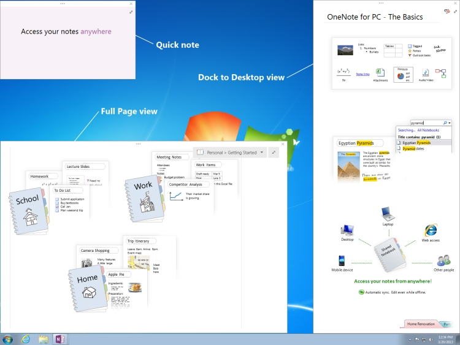

# <a name="window-interfaces-onenote"></a><span data-ttu-id="d1783-104">Fenster-Schnittstellen (OneNote 2013)</span><span class="sxs-lookup"><span data-stu-id="d1783-104">Window interfaces (OneNote)</span></span>

<span data-ttu-id="d1783-p102">Die Schnittstellen **Window** und **Windows** sind OneNote 2013-API-Objekte, die Benutzern die Arbeit mit OneNote-Fenster ermöglicht. Diese Objekte ermöglichen Benutzern bestimmte Fenstereigenschaften zu durchlaufen, den Satz von OneNote-Fenster.</span><span class="sxs-lookup"><span data-stu-id="d1783-p102">The **Window** and **Windows** interfaces are OneNote 2013 API objects that enables users to work with OneNote windows. These objects allow users to enumerate through the set of OneNote windows and modify certain window properties.</span></span> 
  
## <a name="onenote-window-views"></a><span data-ttu-id="d1783-107">OneNote-Fensteransichten</span><span class="sxs-lookup"><span data-stu-id="d1783-107">OneNote window views</span></span>

<span data-ttu-id="d1783-108">Die folgende Liste enthält die vier Ansichtsmodi, die Sie für OneNote-Fenster verwenden können:</span><span class="sxs-lookup"><span data-stu-id="d1783-108">The following list shows the four view modes that you can use for OneNote windows:</span></span> 
  
- <span data-ttu-id="d1783-109">Normalansicht - zeigt das standardmäßige OneNote-Fenster in der Navigationsbereiche Notizbuch und Seite sichtbar sind.</span><span class="sxs-lookup"><span data-stu-id="d1783-109">Normal view—Displays the default OneNote window in which the Notebook and Page navigation panes are visible.</span></span>
    
- <span data-ttu-id="d1783-110">Vollständiger Seitenansicht - Zeigt eine minimale Benutzeroberfläche (UI) anzeigen, in dem die Panes-Notizbuch und die Seite nicht angezeigt werden.</span><span class="sxs-lookup"><span data-stu-id="d1783-110">Full Page view—Displays a minimal user-interface (UI) view in which the Notebook and Page panes are not displayed.</span></span>
    
- <span data-ttu-id="d1783-p103">Kurznotiz - zeigt ein kleines Fenster, das Benutzern erlaubt, kurze Notizen machen. Sie würden in der Regel Kurznotizen zugreifen, über das OneNote-Symbol im Windows-Infobereich, aber Sie können sie auch zugreifen, über die Registerkarte **Ansicht** in OneNote.</span><span class="sxs-lookup"><span data-stu-id="d1783-p103">Quick note—Displays a small window that allows users to take short notes. You would usually access quick notes through the OneNote icon in the Windows notification area, but you can also access them through the **View** tab in OneNote.</span></span> 
    
- <span data-ttu-id="d1783-p104">Andocken auf Desktop - ein OneNote-Fenster, das Sie andocken können auf jeder Seite des Desktops (vergleichbar mit der Taskleiste) angezeigt. Diese Ansicht reduziert die Größe des Desktops, um das Fenster passt. Sie können nur ein Fenster andocken, können Sie jederzeit und das Fenster ist immer sichtbar, ohne den Desktop blockieren.</span><span class="sxs-lookup"><span data-stu-id="d1783-p104">Dock to Desktop—Displays a OneNote window that you can dock to any side of the desktop (similar to the taskbar). This view reduces the size of the desktop to fit the window. You can dock only one window at any time, and the window is always visible without blocking the desktop.</span></span> 
    
<span data-ttu-id="d1783-116">Die folgende Abbildung zeigt, welche die Ganzseitenansicht, Andocken Desktop-Ansicht und Kurznotizen auf dem Desktop wie folgt aussehen.</span><span class="sxs-lookup"><span data-stu-id="d1783-116">The following figure shows what the Full Page view, Dock to Desktop view, and quick notes look like on your desktop.</span></span>
  
<span data-ttu-id="d1783-117">**OneNote-Ansichten**</span><span class="sxs-lookup"><span data-stu-id="d1783-117">**OneNote views**</span></span>

<span data-ttu-id="d1783-118">![OneNote-Fensteransichten] (media/ON15Con_views.jpg "OneNote-Fensteransichten")</span><span class="sxs-lookup"><span data-stu-id="d1783-118"></span></span>
  
## <a name="interfaces"></a><span data-ttu-id="d1783-119">Schnittstellen</span><span class="sxs-lookup"><span data-stu-id="d1783-119">Interfaces</span></span>

<span data-ttu-id="d1783-120">In diesem Abschnitt werden die Schnittstellen und Member, die Sie zum programmgesteuerten Ändern der OneNote-Fenster verwenden können.</span><span class="sxs-lookup"><span data-stu-id="d1783-120">This section lists the interfaces and members that you can use to modify OneNote windows programmatically.</span></span>
  
### <a name="windows-interface"></a><span data-ttu-id="d1783-121">Windows-Benutzeroberfläche</span><span class="sxs-lookup"><span data-stu-id="d1783-121">Windows interface</span></span>

<span data-ttu-id="d1783-p105">Die **Windows** -Schnittstelle ermöglicht es dem Benutzer, die den Satz von geöffnete OneNote-Fenster zuzugreifen. Es ist eine Eigenschaft der OneNote- **Application** -Klasse über **Application.Windows**zugegriffen. Dies gibt den aufgelisteten Satz von OneNote-Fenster zurück.</span><span class="sxs-lookup"><span data-stu-id="d1783-p105">The **Windows** interface allows the user to access the set of opened OneNote windows. It is a property of the OneNote **Application** class, accessed through **Application.Windows**. This returns the enumerated set of OneNote windows.</span></span> 
  
<span data-ttu-id="d1783-125">**Eigenschaften**</span><span class="sxs-lookup"><span data-stu-id="d1783-125">**Properties**</span></span>

|<span data-ttu-id="d1783-126">**Name**</span><span class="sxs-lookup"><span data-stu-id="d1783-126">**Name**</span></span>|<span data-ttu-id="d1783-127">**Typ**</span><span class="sxs-lookup"><span data-stu-id="d1783-127">**Type**</span></span>|<span data-ttu-id="d1783-128">**Description**</span><span class="sxs-lookup"><span data-stu-id="d1783-128">**Description**</span></span>|
|:-----|:-----|:-----|
|<span data-ttu-id="d1783-129">**Count**</span><span class="sxs-lookup"><span data-stu-id="d1783-129">**Count**</span></span> <br/> |<span data-ttu-id="d1783-130">ulong</span><span class="sxs-lookup"><span data-stu-id="d1783-130">ulong</span></span>  <br/> |<span data-ttu-id="d1783-131">Ruft die Anzahl der **Window** -Objekte in der Gruppe **Windows**.</span><span class="sxs-lookup"><span data-stu-id="d1783-131">Gets the number of **Window** objects in the **Windows** set.</span></span>  <br/> |
|<span data-ttu-id="d1783-132">**CurrentWindow**</span><span class="sxs-lookup"><span data-stu-id="d1783-132">**CurrentWindow**</span></span> <br/> |<span data-ttu-id="d1783-133">**Window**</span><span class="sxs-lookup"><span data-stu-id="d1783-133">**Window**</span></span> <br/> |<span data-ttu-id="d1783-134">Ruft das **Window** -Objekt des aktiven Fensters OneNote.</span><span class="sxs-lookup"><span data-stu-id="d1783-134">Gets the **Window** object of the active OneNote window.</span></span>  <br/> |
|<span data-ttu-id="d1783-135">**Items**</span><span class="sxs-lookup"><span data-stu-id="d1783-135">**Items**</span></span> <br/> |<span data-ttu-id="d1783-136">**Window**</span><span class="sxs-lookup"><span data-stu-id="d1783-136">**Window**</span></span> <br/> |<span data-ttu-id="d1783-p106">Gibt das Objekt **Window**, das entspricht dem Index-Wert übergeben. Diese Eigenschaft kann nicht direkt zugegriffen werden. Verwenden Sie **Windows [(uint) index]**, um ein **Window** -Objekt zurückzugeben.  </span><span class="sxs-lookup"><span data-stu-id="d1783-p106">Returns the **Window** object that corresponds to the index value passed. This property cannot be accessed directly. To return a **Window** object, use **Windows [(uint) index]**.  </span></span><br/> |
   
### <a name="window-interface"></a><span data-ttu-id="d1783-140">Fenster-Schnittstelle</span><span class="sxs-lookup"><span data-stu-id="d1783-140">Window interface</span></span>

<span data-ttu-id="d1783-p107">Die **Window** -Schnittstelle ermöglicht es dem Benutzer Zugriff auf bestimmte Eigenschaften der einzelnen Fenster. Jedes Fenster OneNote kann durch Auflisten der **Windows** -Eigenschaft der **Application** -Klasse zugegriffen werden.</span><span class="sxs-lookup"><span data-stu-id="d1783-p107">The **Window** interface allows the user to access certain properties of each window. Each OneNote window can be accessed by enumerating through the **Windows** property of the **Application** class.</span></span> 
  
<span data-ttu-id="d1783-143">**Eigenschaften**</span><span class="sxs-lookup"><span data-stu-id="d1783-143">**Properties**</span></span>

|<span data-ttu-id="d1783-144">**Name**</span><span class="sxs-lookup"><span data-stu-id="d1783-144">**Name**</span></span>|<span data-ttu-id="d1783-145">**Typ**</span><span class="sxs-lookup"><span data-stu-id="d1783-145">**Type**</span></span>|<span data-ttu-id="d1783-146">**Description**</span><span class="sxs-lookup"><span data-stu-id="d1783-146">**Description**</span></span>|
|:-----|:-----|:-----|
|<span data-ttu-id="d1783-147">**Active**</span><span class="sxs-lookup"><span data-stu-id="d1783-147">**Active**</span></span> <br/> |<span data-ttu-id="d1783-148">bool</span><span class="sxs-lookup"><span data-stu-id="d1783-148">bool</span></span>  <br/> |<span data-ttu-id="d1783-149">Dient zum Abrufen oder Festlegen eines Werts, das angibt, ob das Fenster das aktive Fenster OneNote.</span><span class="sxs-lookup"><span data-stu-id="d1783-149">Gets or sets a value that indicates whether the window is the active OneNote window.</span></span>  <br/> |
|<span data-ttu-id="d1783-150">**Application**</span><span class="sxs-lookup"><span data-stu-id="d1783-150">**Application**</span></span> <br/> |<span data-ttu-id="d1783-151">**Application**</span><span class="sxs-lookup"><span data-stu-id="d1783-151">**Application**</span></span> <br/> |<span data-ttu-id="d1783-152">Ruft das OneNote **Application** -Objekt, das dem Fenster zugeordnet ist.</span><span class="sxs-lookup"><span data-stu-id="d1783-152">Gets the OneNote **Application** object that is associated with the window.</span></span>  <br/> |
|<span data-ttu-id="d1783-153">**CurrentPageId**</span><span class="sxs-lookup"><span data-stu-id="d1783-153">**CurrentPageId**</span></span> <br/> |<span data-ttu-id="d1783-154">string</span><span class="sxs-lookup"><span data-stu-id="d1783-154">string</span></span>  <br/> |<span data-ttu-id="d1783-155">Ruft die Objekt-ID der aktiven OneNote-Seite des Fensters ab.</span><span class="sxs-lookup"><span data-stu-id="d1783-155">Gets the object ID of the active OneNote page of the window.</span></span>  <br/> |
|<span data-ttu-id="d1783-156">**CurrentSectionId**</span><span class="sxs-lookup"><span data-stu-id="d1783-156">**CurrentSectionId**</span></span> <br/> |<span data-ttu-id="d1783-157">string</span><span class="sxs-lookup"><span data-stu-id="d1783-157">string</span></span>  <br/> |<span data-ttu-id="d1783-158">Ruft die Objekt-ID des aktiven OneNote-Abschnitt des Fensters ab.</span><span class="sxs-lookup"><span data-stu-id="d1783-158">Gets the object ID of the active OneNote section of the window.</span></span>  <br/> |
|<span data-ttu-id="d1783-159">**CurrentSectionGroupId**</span><span class="sxs-lookup"><span data-stu-id="d1783-159">**CurrentSectionGroupId**</span></span> <br/> |<span data-ttu-id="d1783-160">string</span><span class="sxs-lookup"><span data-stu-id="d1783-160">string</span></span>  <br/> |<span data-ttu-id="d1783-161">Ruft die Objekt-ID der aktiven OneNote im Abschnittsgruppe des Fensters ab.</span><span class="sxs-lookup"><span data-stu-id="d1783-161">Gets the object ID of the active OneNote section group of the window.</span></span>  <br/> |
|<span data-ttu-id="d1783-162">**CurrentNotebookId**</span><span class="sxs-lookup"><span data-stu-id="d1783-162">**CurrentNotebookId**</span></span> <br/> |<span data-ttu-id="d1783-163">string</span><span class="sxs-lookup"><span data-stu-id="d1783-163">string</span></span>  <br/> |<span data-ttu-id="d1783-164">Ruft die Objekt-ID der aktiven OneNote-Notizbuch des Fensters ab.</span><span class="sxs-lookup"><span data-stu-id="d1783-164">Gets the object ID of the active OneNote notebook of the window.</span></span>  <br/> |
|<span data-ttu-id="d1783-165">**DockedLocation**</span><span class="sxs-lookup"><span data-stu-id="d1783-165">**DockedLocation**</span></span> <br/> |<span data-ttu-id="d1783-166">**DockedLocation**</span><span class="sxs-lookup"><span data-stu-id="d1783-166">**DockedLocation**</span></span> <br/> |<span data-ttu-id="d1783-167">Dient zum Abrufen oder Festlegen des angedockten Speicherorts des OneNote-Fensters.</span><span class="sxs-lookup"><span data-stu-id="d1783-167">Gets or sets the docked location of the OneNote window.</span></span>  <br/> |
|<span data-ttu-id="d1783-168">**FullPageView**</span><span class="sxs-lookup"><span data-stu-id="d1783-168">**FullPageView**</span></span> <br/> |<span data-ttu-id="d1783-169">bool</span><span class="sxs-lookup"><span data-stu-id="d1783-169">bool</span></span>  <br/> |<span data-ttu-id="d1783-170">Dient zum Abrufen oder Festlegen eines Werts, das angibt, ob das Fenster Ganzseitenansicht (minimaler Benutzeroberfläche anzeigen).</span><span class="sxs-lookup"><span data-stu-id="d1783-170">Gets or sets a value that indicates whether the window is in Full Page view (minimal UI view).</span></span>  <br/> |
|<span data-ttu-id="d1783-171">**SideNote**</span><span class="sxs-lookup"><span data-stu-id="d1783-171">**SideNote**</span></span> <br/> |<span data-ttu-id="d1783-172">bool</span><span class="sxs-lookup"><span data-stu-id="d1783-172">bool</span></span>  <br/> |<span data-ttu-id="d1783-173">Dient zum Abrufen oder Festlegen eines Werts, das angibt, ob das Fenster ein Kurznotiz Fenster ist.</span><span class="sxs-lookup"><span data-stu-id="d1783-173">Gets or sets a value that indicates whether the window is a quick note window.</span></span>  <br/> |
|<span data-ttu-id="d1783-174">**WindowHandle**</span><span class="sxs-lookup"><span data-stu-id="d1783-174">**WindowHandle**</span></span> <br/> |<span data-ttu-id="d1783-175">ulong</span><span class="sxs-lookup"><span data-stu-id="d1783-175">ulong</span></span>  <br/> |<span data-ttu-id="d1783-176">Ruft die ID Handle des OneNote-Fensters.</span><span class="sxs-lookup"><span data-stu-id="d1783-176">Gets the handle ID of the OneNote window.</span></span>  <br/> |
   
<span data-ttu-id="d1783-177">**Methoden**</span><span class="sxs-lookup"><span data-stu-id="d1783-177">**Methods**</span></span>
  
<span data-ttu-id="d1783-178">Die folgenden Methoden der **Window** -Schnittstelle können Sie angegebenen Objekten in OneNote-Fensters oder zum angegebenen URLs navigieren.</span><span class="sxs-lookup"><span data-stu-id="d1783-178">You can use the following methods of the **Window** interface to navigate to specified objects in the OneNote window or to specified URLs.</span></span> 
  
<span data-ttu-id="d1783-179">**NavigateTo**</span><span class="sxs-lookup"><span data-stu-id="d1783-179">**NavigateTo**</span></span>

|||
|:-----|:-----|
|<span data-ttu-id="d1783-180">**Beschreibung**</span><span class="sxs-lookup"><span data-stu-id="d1783-180">**Description**</span></span> <br/> |<span data-ttu-id="d1783-p108">Navigiert zu dem angegebenen Objekt in der OneNote-Fenster. Beispielsweise können Sie die Abschnitte, Seiten und Gliederung Schemaelemente in Seiten navigieren.</span><span class="sxs-lookup"><span data-stu-id="d1783-p108">Navigates to the specified object in the OneNote window. For example, you can navigate to sections, pages, and outline elements within pages.</span></span>  <br/> |
|<span data-ttu-id="d1783-183">**Syntax**</span><span class="sxs-lookup"><span data-stu-id="d1783-183">**Syntax**</span></span> <br/> | <span data-ttu-id="d1783-184">`HRESULT NavigateTo(`           ` [in]BSTR bstrHierarchyObjectID, `           ` [in]BSTR bstrObjectID); `</span><span class="sxs-lookup"><span data-stu-id="d1783-184"></span></span> <br/> |
|<span data-ttu-id="d1783-185">**Parameter**</span><span class="sxs-lookup"><span data-stu-id="d1783-185">**Parameters**</span></span> <br/> | <span data-ttu-id="d1783-p109">_bstrHierarchyObjectID_- der Hierarchie OneNote-ID des Objekts, zu dem navigiert werden soll. Die Objekt-ID kann eine OneNote-Notizbuch, Abschnitt, Abschnittsgruppe oder Seite verweisen. </span><span class="sxs-lookup"><span data-stu-id="d1783-p109">_bstrHierarchyObjectID_—The hierarchy OneNote ID of the object you want to navigate to. The object ID can reference a OneNote notebook, section, section group, or page.  </span></span><br/>  <span data-ttu-id="d1783-p110">_bstrObjectID_- die OneNote-ID des Objekts innerhalb einer OneNote-Seite zu navigieren. Dieser Parameter wird festgelegt, wenn der Benutzer nicht auf ein bestimmtes Objekt auf einer Seite navigieren möchten, auf Null. </span><span class="sxs-lookup"><span data-stu-id="d1783-p110">_bstrObjectID_—The OneNote ID of the specific object to navigate to within a OneNote page. If the user does not want to navigate to a specific object on a page, this parameter is set to null.  </span></span><br/> |
   
<span data-ttu-id="d1783-190">**NavigateToUrl**</span><span class="sxs-lookup"><span data-stu-id="d1783-190">**NavigateToUrl**</span></span>

|||
|:-----|:-----|
|<span data-ttu-id="d1783-191">**Beschreibung**</span><span class="sxs-lookup"><span data-stu-id="d1783-191">**Description**</span></span> <br/> |<span data-ttu-id="d1783-192">Wenn einen Link OneNote übergeben (Onenote: / /), wird das OneNote-Fenster auf den entsprechenden Speicherort in OneNote geöffnet.</span><span class="sxs-lookup"><span data-stu-id="d1783-192">If passed a OneNote link (onenote://), opens the OneNote window to the corresponding location in OneNote.</span></span> <span data-ttu-id="d1783-193">Wenn der Link eine externe Verknüpfung, wie https:// oder file:///, ist wird jedoch ein Sicherheitsdialogfeld angezeigt.</span><span class="sxs-lookup"><span data-stu-id="d1783-193">However, if the link is an external link, such as https:// or file://, a security dialog box will appear.</span></span> <span data-ttu-id="d1783-194">Bei Kündigung OneNote versucht, um den Link zu öffnen, und ein HResult.hrObjectDoesNotExist-Fehler zurückgegeben.</span><span class="sxs-lookup"><span data-stu-id="d1783-194">Upon dismissal, OneNote attempts to open up the link and an HResult.hrObjectDoesNotExist error is returned.</span></span>  <br/> |
|<span data-ttu-id="d1783-195">**Syntax**</span><span class="sxs-lookup"><span data-stu-id="d1783-195">**Syntax**</span></span> <br/> | <span data-ttu-id="d1783-196">`HRESULT NavigateToUrl (`           ` [in]BSTR bstrUrl); `</span><span class="sxs-lookup"><span data-stu-id="d1783-196"></span></span> <br/> |
|<span data-ttu-id="d1783-197">**Parameter**</span><span class="sxs-lookup"><span data-stu-id="d1783-197">**Parameters**</span></span> <br/> | <span data-ttu-id="d1783-198">_bstrUrl_- die URL zu navigieren.</span><span class="sxs-lookup"><span data-stu-id="d1783-198">_bstrUrl_—The URL to navigate to.</span></span>  <br/> |
   
<span data-ttu-id="d1783-199">**SetDockedLocation**</span><span class="sxs-lookup"><span data-stu-id="d1783-199">**SetDockedLocation**</span></span>

|||
|:-----|:-----|
|<span data-ttu-id="d1783-200">**Beschreibung**</span><span class="sxs-lookup"><span data-stu-id="d1783-200">**Description**</span></span> <br/> |<span data-ttu-id="d1783-201">Das Fenster von **dockLocation** und den Monitor am **ptMonitor**angegebene Position angedockt.</span><span class="sxs-lookup"><span data-stu-id="d1783-201">Docks the window to the location specified by **dockLocation** and the monitor at **ptMonitor**.</span></span>  <br/> |
|<span data-ttu-id="d1783-202">**Syntax**</span><span class="sxs-lookup"><span data-stu-id="d1783-202">**Syntax**</span></span> <br/> | <span data-ttu-id="d1783-203">`HRESULT SetDockedLocation`(           `[in] DockLocation dockLocation,`           `[in] POINT ptMonitor);`</span><span class="sxs-lookup"><span data-stu-id="d1783-203"></span></span> <br/> |
|<span data-ttu-id="d1783-204">**Parameter**</span><span class="sxs-lookup"><span data-stu-id="d1783-204">**Parameters**</span></span> <br/> | <span data-ttu-id="d1783-205">_dockLocation_ - gibt die angedockte Position eines Fensters OneNote 2013.</span><span class="sxs-lookup"><span data-stu-id="d1783-205">_dockLocation_ - Indicates the docked location of a OneNote 2013 window.</span></span>  <br/>  <span data-ttu-id="d1783-206">_ptMonitor_ - (Optional) gibt an, dass in x-und y-Koordinaten, die das Fenster Überwachen verankert werden sollte.</span><span class="sxs-lookup"><span data-stu-id="d1783-206">_ptMonitor_ - (Optional) Indicates in x,y co-ordinates which monitor the window should be docked to.</span></span>  <br/> |
   
## <a name="example"></a><span data-ttu-id="d1783-207">Beispiel</span><span class="sxs-lookup"><span data-stu-id="d1783-207">Example</span></span>

<span data-ttu-id="d1783-p112">Der folgende Code durchläuft die OneNote-Fenster, ein angedocktes Fenster zu erhalten. Wenn kein angedocktes Fenster vorhanden ist, wird im Beispiel wird das aktive Fenster angedockt. Wenn kein aktives Fenster vorhanden ist, erstellt der Code ein neues angedocktes Fenster.</span><span class="sxs-lookup"><span data-stu-id="d1783-p112">The following code iterates through the OneNote windows to find a docked window. If no docked window exists, the example docks the active window. If no active window exists, the code creates a new docked window.</span></span>
  
```cs
using System;
using System.Diagnostics;
using Microsoft.Office.Interop.OneNote;
namespace SampleWND
{
    class DockOneNoteWindow
    {
        static void Main(string[] args)
        {
            Microsoft.Office.Interop.OneNote.Application app = new Microsoft.Office.Interop.OneNote.Application();
            // Search through all OneNote windows for a docked window and activate it.
            bool foundDockedWND = false;
            for (int i = 0; i < app.Windows.Count; i++)
            {
                if (app.Windows[(uint) i].DockedLocation != DockLocation.dlNone)
                {
                    foundDockedWND = true;
                    app.Windows[(uint) i].Active = true;
                }
            }
            
            // If no docked window exists, dock the active window.
            if (!foundDockedWND && (app.Windows.Count > 0))
                app.Windows.CurrentWindow.DockedLocation = DockLocation.dlDefault;
            // If no active window exists, create a new docked window.
            if (app.Windows.Count < 1)
            {
                Process oneProc = new Process();
                oneProc.StartInfo.FileName = "onenote.exe";
                oneProc.StartInfo.Arguments = "/docked";
                oneProc.Start();
            }
        }
    }
}

```

## <a name="see-also"></a><span data-ttu-id="d1783-211">Siehe auch</span><span class="sxs-lookup"><span data-stu-id="d1783-211">See also</span></span>

- [<span data-ttu-id="d1783-212">OneNote-Entwicklerreferenz</span><span class="sxs-lookup"><span data-stu-id="d1783-212">OneNote developer reference</span></span>](onenote-developer-reference.md)

