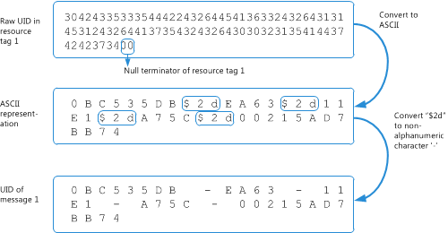

# Analysieren den Nachrichten-Downloadverlauf für ein POP3-KontoParsing the message download history for a POP3 account

In diesem Thema wird die Struktur des POP3-BLOBs, die den Nachricht Downloadverlauf von POP3-Konto zur Kennzeichnung der Nachrichten, die auf dieses Konto gelöscht oder heruntergeladen wurden darstellt.This topic describes the structure of the POP3 BLOB that represents the message download history of a POP3 account, to identify the messages that have been downloaded or deleted on that account.

## Warum Analysieren des Nachrichtenverlaufs herunterladen?Why parse the message download history?

Der Anbieter Post Office Protocol (POP) für Outlook ermöglicht Benutzern abgerufen, und Laden Sie neue e-Mail-Nachrichten auf ihrem lokalen Gerät, und anschließend lassen oder löschen diese e-Mail-Nachrichten auf dem e-Mail-Server.The Post Office Protocol (POP) provider for Outlook allows users to retrieve and download new email messages on their local device, and subsequently to leave or delete these email messages on the mail server. E-Mail-Client für neue Nachrichten herunterladen überprüft, verfügt zu identifizieren, und Laden Sie nur die neuen Nachrichten für Posteingang.When the mail client checks for new messages to download, it has to be able to identify and download only the new messages for that Inbox. E-Mail-Client wird mithilfe der ersten den Befehl UIDL (eindeutige ID auflisten) eine Zuordnung der einzelnen Nachrichten abrufen, die jemals an Posteingang auf einen eindeutigen Bezeichner (UID) übermittelt wurde.The mail client does this by first using the UIDL (Unique ID Listing) command to obtain a map of each message that has ever been delivered to that Inbox to a unique identifier (UID). Der Client ruft auch den Nachrichten-Downloadverlauf für Nachrichten, die heruntergeladen oder für den Posteingang auf den Client gelöscht wurden.The client also gets the message download history for messages that have been downloaded or deleted for the Inbox on that client. Mit der Meldung UID-Karte und Downloadverlauf, Identifizieren des Clients kann dann diese Nachrichten, die nicht vorhanden sind von den Verlauf als neue und somit, heruntergeladen werden soll.Using the message UID map and download history, the client can then identify those messages that are absent from the history as new and, hence, should be downloaded.
  
Um die Nachrichten Downloadverlauf für ein Posteingang zu erhalten:To get the messages download history for an Inbox:
  
- Führen Sie die Schritte in [die Nachricht suchen Downloadverlauf für ein POP3-Konto](locating-the-message-download-history-for-a-pop3-account.md) , die Eigenschaft [PidTagAttachDataBinary](http://msdn.microsoft.com/library/3b0a8b28-863e-4b96-a4c0-fdb8f40555b9%28Office.15%29.aspx) zu erhalten, die ein binary large Object (BLOB) enthält, die für ein POP3-Konto des Nachrichtenverlaufs darstellt.Follow the steps in [Locating the message download history for a POP3 account](locating-the-message-download-history-for-a-pop3-account.md) to find the [PidTagAttachDataBinary](http://msdn.microsoft.com/library/3b0a8b28-863e-4b96-a4c0-fdb8f40555b9%28Office.15%29.aspx) property, which contains a binary large object (BLOB) that represents the message history for a POP3 account. 
    
- Lesen Sie dieses Thema, das beschreibt der Struktur des BLOB, und zeigt ein Beispiel für BLOB zur Identifikation von Nachrichten, die heruntergeladen oder für den Posteingang von POP3-Konto gelöscht wurden.Read this topic, which describes the structure of the BLOB, and shows an example BLOB to identify messages that have been downloaded or deleted for the Inbox of the POP3 account.

## POP BLOB-StrukturPOP BLOB structure

Die POP-BLOB-Struktur beginnt wie in Tabelle 1 beschrieben mit zwei Feldern, **Version** und **Count**, gefolgt von einem **Count** Anzahl von Resource-Tags, von die jedes Null endende ist.The POP BLOB structure, as described in Table 1, begins with two fields, **Version** and **Count**, followed by a **Count** number of resource tags, each of which is null-terminated. 
  
**In Tabelle 1. Struktur des BLOBs, die Meldung darstellt, Downloadverlauf von POP3-Konto****Table 1. Structure of the BLOB that represents the message download history of a POP3 account**

|**Feld in BLOB****Field in BLOB**|**Size****Size**|**Beschreibung****Description**|
|:-----|:-----|:-----|
|**Version****Version**   |2 Bytes2 bytes    |Muss 3 (**PBLOB_VERSION_NUM**).Must be 3 (**PBLOB_VERSION_NUM**).    |
|**Count****Count**   |2 Bytes2 bytes    |Die Nummer der Ressource in dieses BLOB-tags.The number of resource tags in this BLOB.    |
|Resource-tagResource tag    |VariableVariable    |0 oder mehr Null endende UTF-8-Zeichenfolgen, die die Ressource Tags codiert.0 or more null-terminated UTF-8 strings that encode the resource tags. Die Anzahl der Zeichenfolgen mit Null endende muss **Count**übereinstimmen.The number of null-terminated strings must match **Count**.    |
   
Jede Ressource-Tag gibt den Vorgang, der die UID der Nachricht codiert und auf einigen Datum-/ Uhrzeit-Metadaten, die über den Vorgang, eine Nachricht angewendet wird.Each resource tag specifies the operation that is applied to a message, some date-time metadata about the operation, and encodes the UID of the message. Das Format einer Ressource Tag Zeichenfolge wie folgt aufgeschlüsselt und wird in Tabelle 2 ausführlich erläutert.The format of a resource tag string is broken down as follows, and is further explained in Table 2. 
  
`Ocyyyymmddhhmmssuuu...`
  
**In Tabelle 2. Struktur eines Resource-Tags****Table 2. Structure of a resource tag**

|**Feld in einem Tag Ressource****Field in a resource tag**|**Size****Size**|**Beschreibung****Description**|
|:-----|:-----|:-----|
| `O`   |1 Zeichen1 character    |Die Operation, die für die e-Mail-Nachricht durchgeführt werden.The operation performed on the email message. Der Wert muss "+" und "-", oder "&amp;", die eine erfolgreiche Get, löschen oder Get-und-Löschvorgang jeweils angibt.The value must be "+", "-", or "&amp;", which indicates a successful get, delete, or get-and-delete operation, respectively.    |
| `c`   |1 Zeichen1 character    |Der Teil der Inhalt der Nachricht beteiligt sind.The part of the message content involved in the operation. Der Wert muss "", "h" oder "b", die den Inhalt des none gibt an, Kopf- oder Body, jeweils.The value must be " ", "h", or "b", which indicates the content of none, header, or body, respectively.    |
| `yyyy`   |4 Zeichen4 characters    |Die vierstellige Jahresangabe des Vorgangs.The four-digit year of the operation.    |
| `MM`   |2 Zeichen2 characters    |Der zweistelligen Monat des Vorgangs.The two-digit month of the operation.    |
| `dd`   |2 Zeichen2 characters    |Die zweistellige Angabe des Tags des Vorgangs.The two-digit day of the operation.    |
| `hh`   |2 Zeichen2 characters    |Die zweistellige Stunde des Vorgangs.The two-digit hour of the operation.    |
| `mm`   |2 Zeichen2 characters    |Die Minutenangabe des Vorgangs.The two-digit minute of the operation.    |
| `ss`   |2 Zeichen2 characters    |Die zweite zweistellige Angabe des Vorgangs.The two-digit second of the operation.    |
| `uuu…`   |Variabler LängeVariable length    |Die codierte UID einer Nachricht.The encoded UID of a message.    |

## BeispielExample

Abbildung 1 zeigt ein Beispiel für ein BLOB, den Nachricht Downloadverlauf für ein POP-Konto darstellt.Figure 1 shows an example of a BLOB that represents the message download history of a POP account. 
  
**Abbildung 1. Beispiel BLOB-Struktur für die Nachricht Downloadverlauf von POP3-Konto****Figure 1. Example BLOB structure for the message download history of a POP3 account**

  
Basierend auf der Struktur, die in Tabelle 1 und Tabelle 2 beschrieben, stellt diese BLOB den Downloadverlauf 23 e-Mail-Nachrichten.Based on the structure described in Table 1 and Table 2, this BLOB represents the download history of 23 email messages.
  
Zum Analysieren der rohen-UID in jeder Ressource Tag, beachten Sie, dass die UID diese Codierung erfolgt: Zeichen in einer UID sind größtenteils alphanumerischen Zeichen, und jedes nicht alphanumerische Zeichen vor dem ASCII-Zeichen "$" (0 x 24).To parse the raw UID in each resource tag, be aware that the UID follows this encoding: characters in a UID are mostly alphanumeric characters, and each non-alphanumeric character is preceded by the ASCII character "$" (0x24). Damit die ASCII 2d darstellen, die nicht alphanumerische Zeichen $ Zeichen "-".So the ASCII characters $2d represent the non-alphanumeric character "-". Abbildung 2 zeigt ein Beispiel für die zunächst auf die Darstellung von ASCII-Konvertieren der rohen-UID in Ressource Tag 1, und klicken Sie dann konvertieren von einem nicht alphanumerische Zeichen vorangestellt "$", um die tatsächliche UID zu erstellen:Figure 2 shows an example of first converting the raw UID in resource tag 1 to the ASCII representation, then converting any non-alphanumeric character preceded by "$" to produce the actual UID:
  
`0BC535DB-EA63-11E1-A75C-00215AD7BB74`
  
**Abbildung 2. Konvertieren der rohen-UID in einem Tag Ressource in die tatsächliche Nachrichten-UID****Figure 2. Converting the raw UID in a resource tag to the actual message UID**

  
Interpretieren der Ressource in dieses BLOB-Tag 1: die Nachricht mit der UID `0BC535DB-EA63-11E1-A75C-00215AD7BB74` erfolgreich 6 September 2012 unter 13:11:38 abgerufen wurde.To interpret resource tag 1 in this BLOB: the message with the UID  `0BC535DB-EA63-11E1-A75C-00215AD7BB74` was successfully retrieved on September 6, 2012, at 13:11:38. 
  
Sie können auf ähnliche Weise die verbleibenden 22 Ressource Tags für dieses BLOB analysieren.You can similarly parse the remaining 22 resource tags for that BLOB.
  
## Siehe auchSee also

- [Verwalten von Nachricht downloads für POP3-KontenManaging message downloads for POP3 accounts](managing-message-downloads-for-pop3-accounts.md)    
- [Suchen den Nachrichten-Downloadverlauf für ein POP3-KontoLocating the message download history for a POP3 account](locating-the-message-download-history-for-a-pop3-account.md)    
- [Analysieren des POP3 UIDL-VerlaufsParsing the POP3 UIDL History](http://blogs.msdn.com/b/stephen_griffin/archive/2012/12/04/parsing-the-pop3-uidl-history.aspx)
    

