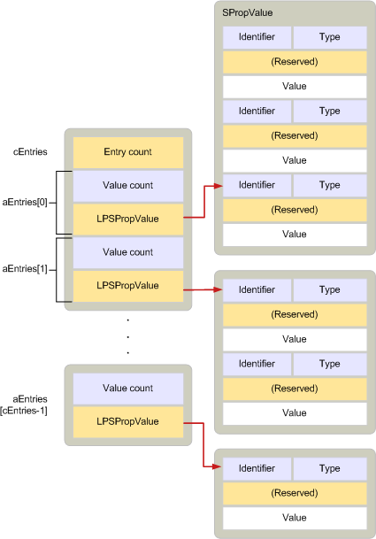

# <a name="adrlist"></a><span data-ttu-id="158b0-103">ADRLIST</span><span class="sxs-lookup"><span data-stu-id="158b0-103">ADRLIST</span></span>

<span data-ttu-id="158b0-104">**Gilt für**: Outlook 2013 | Outlook 2016</span><span class="sxs-lookup"><span data-stu-id="158b0-104">**Applies to**: Outlook 2013 | Outlook 2016</span></span> 
  
<span data-ttu-id="158b0-105">Beschreibt null oder mehr Eigenschaften, die zu einem oder mehreren Empfängern gehören.</span><span class="sxs-lookup"><span data-stu-id="158b0-105">Describes zero or more properties that belong to one or more recipients.</span></span> 
  
|||
|:-----|:-----|
|<span data-ttu-id="158b0-106">Headerdatei</span><span class="sxs-lookup"><span data-stu-id="158b0-106">Header file:</span></span>  <br/> |<span data-ttu-id="158b0-107">Mapidefs.h</span><span class="sxs-lookup"><span data-stu-id="158b0-107">Mapidefs.h</span></span>  <br/> |
|<span data-ttu-id="158b0-108">Verwandte Makros:</span><span class="sxs-lookup"><span data-stu-id="158b0-108">Related macros:</span></span>  <br/> |<span data-ttu-id="158b0-109">[CbADRLIST](cbadrlist.md), [CbNewADRLIST](cbnewadrlist.md), [CbNewADRLIST](cbnewadrlist.md)</span><span class="sxs-lookup"><span data-stu-id="158b0-109">[CbADRLIST](cbadrlist.md), [CbNewADRLIST](cbnewadrlist.md), [CbNewADRLIST](cbnewadrlist.md)</span></span> <br/> |
   
```cpp
typedef struct _ADRLIST
{
  ULONG cEntries;
  ADRENTRY aEntries[MAPI_DIM];
} ADRLIST, FAR *LPADRLIST;

```

## <a name="members"></a><span data-ttu-id="158b0-110">Elemente</span><span class="sxs-lookup"><span data-stu-id="158b0-110">Members</span></span>

<span data-ttu-id="158b0-111">**cEntries**</span><span class="sxs-lookup"><span data-stu-id="158b0-111">**cEntries**</span></span>
  
> <span data-ttu-id="158b0-112">Anzahl der Einträge im vom **aEntries-Element angegebenen** Array.</span><span class="sxs-lookup"><span data-stu-id="158b0-112">Count of entries in the array specified by the **aEntries** member.</span></span> 
    
<span data-ttu-id="158b0-113">**aEntries**</span><span class="sxs-lookup"><span data-stu-id="158b0-113">**aEntries**</span></span>
  
> <span data-ttu-id="158b0-114">Array von [ADRENTRY-Strukturen,](adrentry.md) eine Struktur für jeden Empfänger.</span><span class="sxs-lookup"><span data-stu-id="158b0-114">Array of [ADRENTRY](adrentry.md) structures, one structure for each recipient.</span></span> 
    
## <a name="remarks"></a><span data-ttu-id="158b0-115">Hinweise</span><span class="sxs-lookup"><span data-stu-id="158b0-115">Remarks</span></span>

<span data-ttu-id="158b0-116">Eine **ADRLIST-Struktur** enthält eine oder mehrere **ADRENTRY-Strukturen,** die jeweils die Eigenschaften eines Empfängers beschreiben.</span><span class="sxs-lookup"><span data-stu-id="158b0-116">An **ADRLIST** structure contains one or more **ADRENTRY** structures, each describing the properties of a recipient.</span></span> <span data-ttu-id="158b0-117">Ein Empfänger kann nicht aufgelöst werden.</span><span class="sxs-lookup"><span data-stu-id="158b0-117">A recipient can be unresolved.</span></span> <span data-ttu-id="158b0-118">Dies bedeutet, dass ihm ein Eintragsbezeichner im Array der Eigenschaftswerte fehlt.</span><span class="sxs-lookup"><span data-stu-id="158b0-118">This means that it is lacking an entry identifier in its array of property values.</span></span> <span data-ttu-id="158b0-119">Ein aufgelöster Empfänger bedeutet, dass die **PR \_ ENTRYID** ([PidTagEntryId](pidtagentryid-canonical-property.md)) -Eigenschaft enthalten ist.</span><span class="sxs-lookup"><span data-stu-id="158b0-119">A resolved recipient means that the **PR\_ENTRYID** ([PidTagEntryId](pidtagentryid-canonical-property.md)) property is included.</span></span> <span data-ttu-id="158b0-120">In der Regel verfügen aufgelöste Empfänger auch über eine E-Mail-Adresse PR_EMAIL_ADDRESS **(** [PidTagEmailAddress](pidtagemailaddress-canonical-property.md)) -Eigenschaft.</span><span class="sxs-lookup"><span data-stu-id="158b0-120">Typically, resolved recipients also have an email address the **PR_EMAIL_ADDRESS** ([PidTagEmailAddress](pidtagemailaddress-canonical-property.md)) property.</span></span> <span data-ttu-id="158b0-121">Die E-Mail-Adresse ist jedoch nicht erforderlich.</span><span class="sxs-lookup"><span data-stu-id="158b0-121">However, the email address is not required.</span></span> <span data-ttu-id="158b0-122">**ADRLIST-Strukturen** werden z. B. verwendet, um die Empfängerliste für eine ausgehende Nachricht und die MAPI zu beschreiben, um die Einträge im Adressbuch anzuzeigen.</span><span class="sxs-lookup"><span data-stu-id="158b0-122">**ADRLIST** structures are used, for example, to describe the recipient list for an outgoing message and by MAPI to display the entries in the address book.</span></span> 
  
<span data-ttu-id="158b0-123">**ADRLIST-Strukturen** ähneln [SRowSet-Strukturen,](srowset.md) die zum Darstellen von Zeilen in Tabellen verwendet werden.</span><span class="sxs-lookup"><span data-stu-id="158b0-123">**ADRLIST** structures resemble [SRowSet](srowset.md) structures the structures used for representing rows in tables.</span></span> <span data-ttu-id="158b0-124">Tatsächlich sind diese beiden Strukturen so konzipiert, dass sie austauschbar verwendet werden können.</span><span class="sxs-lookup"><span data-stu-id="158b0-124">In fact, these two structures are designed so that they can be used interchangeably.</span></span> <span data-ttu-id="158b0-125">Beide enthalten ein Array von Strukturen, die eine Gruppe von Eigenschaften beschreiben, und eine Anzahl der Werte im Array.</span><span class="sxs-lookup"><span data-stu-id="158b0-125">Both contain an array of structures describing a group of properties and a count of the values in the array.</span></span> <span data-ttu-id="158b0-126">Während das Array in der **ADRLIST-Struktur** [ADRENTRY-Strukturen](adrentry.md) enthält, enthält das Array in der **SRowSet-Struktur** [SRow-Strukturen.](srow.md)</span><span class="sxs-lookup"><span data-stu-id="158b0-126">Whereas in the **ADRLIST** structure, the array contains [ADRENTRY](adrentry.md) structures, in the **SRowSet** structure the array contains [SRow](srow.md) structures.</span></span> <span data-ttu-id="158b0-127">**ADRENTRY-Strukturen** und **SRow-Strukturen** sind im Layout identisch.</span><span class="sxs-lookup"><span data-stu-id="158b0-127">**ADRENTRY** structures and **SRow** structures are identical in layout.</span></span> <span data-ttu-id="158b0-128">Da **ADRLIST-** und **SRowSet-Strukturen** dieselben Zuweisungsregeln befolgen, kann eine **SRowSet-Struktur,** die aus dem Inhaltsverzeichnis eines Adressbuchcontainers abgerufen wird, in eine **ADRLIST-Struktur** umstrukturiert und wie gewohnt verwendet werden.</span><span class="sxs-lookup"><span data-stu-id="158b0-128">Because **ADRLIST** and **SRowSet** structures follow the same allocation rules, an **SRowSet** structure that is retrieved from the contents table of an address book container can be cast to an **ADRLIST** structure and used as is.</span></span> 
  
<span data-ttu-id="158b0-129">Die folgende Abbildung zeigt das Layout einer **ADRLIST-Struktur.**</span><span class="sxs-lookup"><span data-stu-id="158b0-129">The following illustration shows the layout of an **ADRLIST** structure.</span></span> 
  
<span data-ttu-id="158b0-130">**ADRLIST-Komponenten**</span><span class="sxs-lookup"><span data-stu-id="158b0-130">**ADRLIST components**</span></span>
  
<span data-ttu-id="158b0-131"></span><span class="sxs-lookup"><span data-stu-id="158b0-131"></span></span>
  
<span data-ttu-id="158b0-132">Die **TEILE ADRENTRY** und [SPropValue](spropvalue.md) in einer **ADRLIST-Struktur** müssen unabhängig von den anderen Teilen zugewiesen und frei werden.</span><span class="sxs-lookup"><span data-stu-id="158b0-132">The **ADRENTRY** and [SPropValue](spropvalue.md) portions in an **ADRLIST** structure must be allocated and freed independently of the other parts.</span></span> <span data-ttu-id="158b0-133">Das heißt, jede **SPropValue-Struktur** muss einzeln zugewiesen werden, nachdem der Arbeitsspeicher für die **ADRENTRY-Struktur** zugewiesen und frei wird, bevor die **ADRENTRY-Struktur** frei wird.</span><span class="sxs-lookup"><span data-stu-id="158b0-133">That is, each **SPropValue** structure must be allocated individually after memory for the **ADRENTRY** structure has been allocated and freed before the **ADRENTRY** structure is freed.</span></span> <span data-ttu-id="158b0-134">Diese Unabhängigkeit beim Behandeln des Arbeitsspeichers ermöglicht es Empfängern und einzelnen Empfängereigenschaften, frei aus der Adressliste hinzugefügt oder gelöscht zu werden.</span><span class="sxs-lookup"><span data-stu-id="158b0-134">This independence in handling memory allows recipients and individual recipient properties to be freely added or deleted from the address list.</span></span> 
  
<span data-ttu-id="158b0-135">Die [Funktionen MAPIAllocateBuffer](mapiallocatebuffer.md) und [MAPIFreeBuffer](mapifreebuffer.md) müssen verwendet werden, um die **ADRLIST-Struktur** und alle ihre Teile zuzuordnen und frei zu geben.</span><span class="sxs-lookup"><span data-stu-id="158b0-135">The [MAPIAllocateBuffer](mapiallocatebuffer.md) and [MAPIFreeBuffer](mapifreebuffer.md) functions must be used to allocate and free the **ADRLIST** structure and all its parts.</span></span> 
  
<span data-ttu-id="158b0-136">Wenn eine Empfängerliste zu groß ist, um in den Arbeitsspeicher zu passen, können Clients die [IMessage::ModifyRecipients-Methode](imessage-modifyrecipients.md) aufrufen, um mit einer Teilmenge der Liste zu arbeiten.</span><span class="sxs-lookup"><span data-stu-id="158b0-136">If a recipient list is too large to fit in memory, clients can call the [IMessage::ModifyRecipients](imessage-modifyrecipients.md) method to work with a subset of the list.</span></span> <span data-ttu-id="158b0-137">Clients sollten in dieser Situation nicht die allgemeinen Dialogfelder des Adressbuchs verwenden.</span><span class="sxs-lookup"><span data-stu-id="158b0-137">Clients should not use the address book common dialog boxes in this situation.</span></span> 
  
<span data-ttu-id="158b0-138">Weitere Informationen zum Zuordnen von Arbeitsspeicher für **ADRENTRY-Strukturen** finden Sie unter [Managing Memory for ADRLIST and SRowSet Structures](managing-memory-for-adrlist-and-srowset-structures.md).</span><span class="sxs-lookup"><span data-stu-id="158b0-138">For more information about how to allocate memory for **ADRENTRY** structures, see [Managing Memory for ADRLIST and SRowSet Structures](managing-memory-for-adrlist-and-srowset-structures.md).</span></span> 
  
## <a name="see-also"></a><span data-ttu-id="158b0-139">Siehe auch</span><span class="sxs-lookup"><span data-stu-id="158b0-139">See also</span></span>

- [<span data-ttu-id="158b0-140">ADRENTRY</span><span class="sxs-lookup"><span data-stu-id="158b0-140">ADRENTRY</span></span>](adrentry.md)  
- [<span data-ttu-id="158b0-141">CbNewADRLIST</span><span class="sxs-lookup"><span data-stu-id="158b0-141">CbNewADRLIST</span></span>](cbnewadrlist.md) 
- [<span data-ttu-id="158b0-142">IMessage::ModifyRecipients</span><span class="sxs-lookup"><span data-stu-id="158b0-142">IMessage::ModifyRecipients</span></span>](imessage-modifyrecipients.md) 
- [<span data-ttu-id="158b0-143">SRowSet</span><span class="sxs-lookup"><span data-stu-id="158b0-143">SRowSet</span></span>](srowset.md)
- [<span data-ttu-id="158b0-144">MAPI-Strukturen</span><span class="sxs-lookup"><span data-stu-id="158b0-144">MAPI Structures</span></span>](mapi-structures.md)

