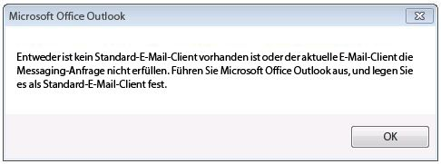
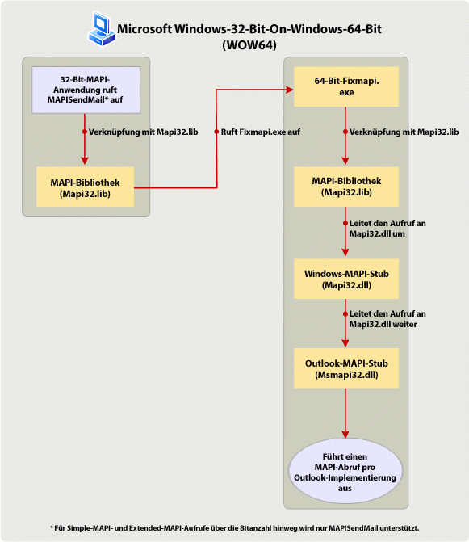

# Erstellen von MAPI-Anwendungen für 32- und 64-Bit-PlattformenBuilding MAPI applications on 32-bit and 64-bit platforms

**Gilt für**: Outlook 2013 | Outlook 2016**Applies to**: Outlook 2013 | Outlook 2016 
  
In diesem Thema werden die Aktionen beschrieben, die MAPI-Entwickler zum Ändern und Neuerstellen von 32-Bit-MAPI-Anwendungen für die Ausführung auf 64-Bit-Plattformen und von 64-Bit-Anwendungen für die Ausführung auf 32-Bit-Plattformen durchführen müssen. In diesem Thema stellt die 64-Bit-Plattform ein Computer mit der 64-Bit-Version von Microsoft Outlook und Windows dar, und die 32-Bit-Plattform ein Computer mit der 32-Bit-Version von Outlook und der 32-Bit- oder 64-Bit-Version von Windows dar.This topic describes the actions that MAPI developers should take to change and rebuild 32-bit MAPI applications to run on a 64-bit platform, and 64-bit applications to run on a 32-bit platform. In this topic, a 64-bit platform is a computer installed with 64-bit Microsoft Outlook and 64-bit Windows, and a 32-bit platform is a computer installed with a 32-bit Outlook and 32-bit or 64-bit Windows. 
  
## Betriebssystem- und Office-Unterstützung für 64-Bit-Versionen von OutlookOperating system and Office support for 64-bit Outlook

> [!NOTE]
> Der Begriff Bitanzahl bezieht sich auf die Unterscheidung zwischen 32-Bit- und 64-Bit-Prozessorarchitekturen und der zugehörigen Kompatibilität von Anwendungen. In diesem Thema wird Bitanzahl zum Angeben der Version von Windows, Microsoft Office, Outlook, oder einer MAPI-Anwendung, die entsprechend den Anforderungen einer 32-Bit- oder 64-Bit Prozessorarchitektur eines Computers und möglicherweise anderer Programme, die auf diesem Computer ausgeführt werden, entwickelt wurde.The term bitness refers to the distinction between 32-bit and 64-bit processor architectures and the associated compatibility of applications. In this topic, bitness is used to qualify the version of Windows, Microsoft Office, Outlook, or a MAPI application built to suit a 32-bit or 64-bit processor architecture of a computer, and possibly other applications that run on that computer. 
  
Beginnend mit Microsoft Office 2010 steht Outlook als 32-Bit- und 64-Bit-Anwendung zur Verfügung. Die Bitanzahl von Outlook auf einem bestimmten Computer hängt von der Bitanzahl des Windows-Betriebssystems (x86 oder x64) sowie, falls Office auf dem Computer installiert ist, von der Bitanzahl von Microsoft Office ab. Nachstehend finden Sie einige der Faktoren, von denen es abhängt, ob Sie eine 32-Bit- oder 64-Bit-Version von Outlook installieren können:Starting in Microsoft Office 2010, Outlook is available as a 32-bit and a 64-bit application. On the same computer, the bitness of Outlook depends on the bitness of the Windows operating system (x86 or x64), and of Microsoft Office, if Office is already installed on that computer. The following are some of the factors that determine the feasibility of installing a 32-bit or a 64-bit version of Outlook:
  
- 32-Bit-Versionen von Office (und 32-Bit-Versionen von Outlook) können unter einer 32-Bit- oder 64-Bit-Version des Windows-Betriebssystems installiert werden. 64-Bit-Versionen von Office (und 64-Bit-Versionen von Outlook) können nur unter einem 64-Bit-Betriebssystem installiert werden.32-bit Office (and 32-bit Outlook) can be installed on a 32-bit or 64-bit version of the Windows operating system. 64-bit Office (and 64-bit Outlook) can be installed only on a 64-bit operating system.
    
- Die Standardinstallation von Office unter einer 64-Bit-Version des Windows-Betriebssystems ist eine 32-Bit-Version von Office.The default installation of Office on a 64-bit version of the Windows operating system is 32-bit Office.
    
- Die Bitanzahl einer installierten Version von Outlook entspricht immer der Bitanzahl von Office, wenn Office auf dem gleichen Computer installiert ist. Mit anderen Worten, eine 32-Bit-Version von Outlook kann nicht auf einem Computer installiert werden, auf dem bereits 64-Bit-Versionen anderer Office-Anwendungen (beispielsweise eine 64-Bit-Version von Microsoft Word oder von Microsoft Excel) installiert sind. Analog kann eine 64-Bit-Version von Outlook nicht auf einem Computer installiert werden, auf dem bereits 32-Bit-Versionen anderer Office-Anwendungen installiert sind.The bitness of an installed version of Outlook is always the same as the bitness of Office, if Office is installed on the same computer. In other words, a 32-bit version of Outlook cannot be installed on the same computer that already has 64-bit versions of other Office applications installed, such as 64-bit Microsoft Word or 64-bit Microsoft Excel. Similarly, a 64-bit version of Outlook cannot be installed on the same computer that already has 32-bit versions of other Office applications installed.
    
## Vorbereiten von MAPI-Anwendungen für 32- und 64-Bit-PlattformenPreparing MAPI applications for 32-bit and 64-bit platforms

Zu den MAPI-Anwendungen geh�ren eigenst�ndige Anwendungen wie beispielsweise Microsoft�Communicator und MFCMAPI sowie Dienstanbieter wie beispielsweise Adressbuch-, Speicher- und Transportanbieter. Damit MAPI-Methoden und -Funktionsaufrufe in einer MAPI-Anwendung verwendet werden k�nnen (mit Ausnahme der einfachen MAPI-Funktion MAPISendMail), muss die Bitanzahl der MAPI-Anwendung der Bitanzahl des MAPI-Subsystems auf dem Computer entsprechen, auf dem die Anwendung ausgef�hrt werden soll. Die Bitanzahl des MAPI-Subsystems wiederum wird durch die Bitanzahl der installierten Version von Outlook bestimmt und muss dieser immer entsprechen. In der folgenden Tabelle werden die erforderlichen Aktionen zur Vorbereitung von MAPI-Anwendungen f�r die Ausf�hrung auf Zielcomputern mit Office- und Windows-Versionen mit unterschiedlicher Bitanzahl aufgef�hrt.MAPI applications include standalone applications such as Microsoft Communicator and MFCMAPI, and service providers such as address book, store, and transport providers. For MAPI method and function calls to work in a MAPI application (with the exception of one Simple MAPI function, MAPISendMail), the bitness of the MAPI application must be the same as the bitness of the MAPI subsystem on the computer that the application is targeted to run on. The bitness of the MAPI subsystem, in turn, is determined by and always the same as the bitness of the installed version of Outlook. The following table summarizes the necessary actions to prepare MAPI applications to run on targeted computers configured with Office and Windows of various bitness.
  
|Bitanzahl der MAPI-AnwendungBitness of MAPI application|Bitanzahl der Outlook-Version auf dem ZielcomputerBitness of Outlook on targeted computer|Bitanzahl der Windows-Version auf dem ZielcomputerBitness of Windows on targeted computer|Erforderlichen Aktion, damit die Anwendung auf dem Zielcomputer ausgeführt werden kannNecessary action to enable application to run on targeted computer|
|:-----|:-----|:-----|:-----|
|32-Bit32-bit    |32-Bit32-bit    |32-Bit- oder 64-bit32-bit or 64-bit    |Es sind keine weiteren Aktionen erforderlich.No specific action is necessary.    |
|32-Bit32-bit    |64-Bit64-bit    |64-Bit64-bit    |Erstellen Sie die Anwendung als 64-Bit-Anwendung neu. Andernfalls tritt beim Ausführen aller MAPI-Methoden und -Funktionsaufrufen (mit Ausnahme von **MAPISendMail**) ein Fehler auf.  Rebuild the application as a 64-bit application. Otherwise, all MAPI method and function calls (except for **MAPISendMail**) will fail.    |
|64-Bit64-bit    |64-Bit64-bit    |64-Bit64-bit    |Es sind keine weiteren Aktionen erforderlich.No specific action is necessary.    |
|64-Bit64-bit    |32-Bit32-bit    |32-Bit- oder 64-bit32-bit or 64-bit    |Erstellen Sie die Anwendung als 32-Bit-Anwendung neu. Andernfalls tritt beim Ausführen aller MAPI-Methoden- und -Funktionsaufrufe (mit Ausnahme von **MAPISendMail**) ein Fehler auf.Rebuild the application as a 32-bit application. Otherwise, all MAPI method and function calls (except for **MAPISendMail**) will fail.    |
   
In den folgenden Abschnitten werden die einzelnen Szenarien genauer erläutert.The following sections further explain each scenario. Weitere Informationen zu Verweisen auf und Aufrufen von MAPI-Funktionen in Szenarien, für die eine Neuerstellung der MAPI-Anwendung erforderlich ist, finden Sie unter [Verweisen auf MAPI-Funktionen](how-to-link-to-mapi-functions.md).For scenarios that require rebuilding the MAPI application, see [Link to MAPI Functions](how-to-link-to-mapi-functions.md) for additional information regarding linking to and calling MAPI functions. 
  
### 32-Bit-MAPI-Anwendung und 32-Bit-Version von Outlook32-bit MAPI application and 32-bit Outlook

MAPI-Anwendungen, die für ein 32-Bit-MAPI-Subsystem kompiliert wurden, das in 32-Bit-Versionen von Outlook, einschließlich der Versionen vor Microsoft Outlook 2013 verfügbar ist, werden weiterhin auf Computern mit der 32-Bit-Version von Outlook und einer 32-Bit- oder 64-Bit-Version von Windows unterstützt. Anwendungsentwickler müssen keine weiteren Aktionen durchführen.MAPI applications compiled for a 32-bit MAPI subsystem that is available in 32-bit versions of Outlook, including those versions prior to Microsoft Outlook 2013, continue to be supported on computers installed with 32-bit Outlook and a 32-bit or 64-bit Windows operating system. There is no specific action necessary for the application developers.
  
### 32-Bit-MAPI-Anwendung und 64-Bit-Version von Outlook32-bit MAPI application and 64-bit Outlook

32-Bit-MAPI-Anwendungen werden nicht auf einem Computer mit der 64-Bit-Version von Outlook und der 64-Bit-Version von Windows unterstützt. Anwendungsentwickler müssen die Anwendung als 64-Bit-Anwendung für die 64-Bit-Plattform neu erstellen. Grund dafür ist, dass eine 32-Bit-Anwendung die 64-Bit-Datei „Msmapi32.dll“ nicht laden kann Es gibt eine kleine Anzahl von API-Änderungen, die Anwendungsentwickler vornehmen müssen, damit Ihr Code erfolgreich in einer 64-Bit-Umgebung ausgeführt werden kann. Diese Änderungen wurden an den MAPI-Headerdateien vorgenommen, damit 64-Bit-Plattformen unterstützt werden. Sie können diese Headerdateien unter [Outlook 2010: MAPI-Headerdateien](https://www.microsoft.com/downloads/details.aspx?FamilyID=f8d01fc8-f7b5-4228-baa3-817488a66db1) herunterladen. Entwickler können denselben Satz von MAPI-Headerdateien zum Erstellen von 32-Bit- und 64-Bit-MAPI-Anwendungen verwenden.32-bit MAPI applications are not supported to run on a computer installed with 64-bit Outlook and 64-bit Windows. The application developer must update and rebuild the application as a 64-bit application for the 64-bit platform. This is because a 32-bit application cannot load a 64-bit Msmapi32.dll file. There are a small number of API changes that application developers must incorporate to build their code successfully for a 64-bit environment. MAPI header files have been updated with these changes to support the 64-bit platform. You can download these header files at [Outlook 2010: MAPI Header Files](https://www.microsoft.com/downloads/details.aspx?FamilyID=f8d01fc8-f7b5-4228-baa3-817488a66db1). Developers can use this same set of MAPI header files to build both 32-bit and 64-bit MAPI applications.
  
### 64-Bit-MAPI-Anwendung und 64-Bit-Version von Outlook64-bit MAPI application and 64-bit Outlook

64-Bit-MAPI-Anwendungen werden auf Computern mit der 64-Bit-Version von Outlook und der 64-Bit-Version von Windows unterstützt. Anwendungsentwickler müssen keine weiteren Aktionen durchführen.64-bit MAPI applications are supported on computers installed with 64-bit Outlook and 64-bit Windows. There is no specific action necessary for the application developers.
  
### 64-Bit-MAPI-Anwendung und 32-Bit-Version von Outlook64-bit MAPI application and 32-bit Outlook

64-Bit-MAPI-Anwendungen werden nicht auf einem Computer mit der 32-Bit-Version von Outlook und der 32-Bit- oder 64-Bit-Version von Windows unterstützt. Anwendungsentwickler müssen die Anwendung als 32-Bit-Anwendung für die Verwendung mit der 32-Bit-Version von Outlook neu erstellen. Verwenden Sie die aktualisierten MAPI-Headerdateien, die unter [Outlook 2010: MAPI-Headerdateien](https://www.microsoft.com/downloads/details.aspx?FamilyID=f8d01fc8-f7b5-4228-baa3-817488a66db1) heruntergeladen werden können. Entwickler können denselben Satz von MAPI-Headerdateien zum Erstellen von 32-Bit- und 64-Bit-MAPI-Anwendungen verwenden.64-bit MAPI applications are not supported to run on a computer installed with 32-bit Outlook and 32-bit or 64-bit Windows. The application developer must update and rebuild the application as a 32-bit application to work with 32-bit Outlook. Use the updated MAPI header files, which you can download at [Outlook 2010: MAPI Header Files](https://www.microsoft.com/downloads/details.aspx?FamilyID=f8d01fc8-f7b5-4228-baa3-817488a66db1). Developers can use this same set of MAPI header files to build both 32-bit and 64-bit MAPI applications.
  
### Ausnahme: MAPISendMailException: MAPISendMail

Eine 32-Bit-MAPI-Anwendung darf in der Regel nicht auf einer 64-Bit-Plattform (64-Bit-Version von Outlook unter 64-Bit-Version von Windows) ausgef�hrt werden, ohne dass sie zun�chst als 64-Bit-Anwendung neu erstellt wird, und eine 64-Bit-MAPI-Anwendung darf nicht auf einem Computer mit der 32-Bit-Version von Outlook und der 32-Bit- oder 64-Bit-Version von Windows ausgef�hrt werden, ohne dass sie zun�chst als 32-Bit-Anwendung neu erstellt wird. In Abbildung�1 wird eine Warnmeldung dargestellt, die angezeigt wird. wenn eines dieser Szenarien auftritt.In general, a 32-bit MAPI application must not run on a 64-bit platform (64-bit Outlook on 64-bit Windows) without first being rebuilt as a 64-bit application, and a 64-bit MAPI application must not run on a computer installed with 32-bit Outlook and 32-bit or 64-bit Windows without first being rebuilt as a 32-bit application. Figure 1 shows an alert dialog box that would be displayed if either of these scenarios occurs.
  
**Abbildung 1. Fehlermeldung für die meisten bitanzahlübergreifenden MAPI-Aufrufe.****Figure 1. Error message for most cross-bitness MAPI calls.**

  
Ein Funktionsaufruf zwischen allen Simple MAPI- und MAPI-Elementen, **MAPISendMail**, wird jedoch erfolgreich in einem WOW64-Szenario (Windows-32-bit-on-Windows-64-bit) oder WOW32-Szenario (Windows-64-bit-on-Windows-32-bit) erfolgreich ausgef�hrt und gibt nicht die oben dargestellte Warnmeldung zur�ck.However, one function call among all Simple MAPI and MAPI elements, **MAPISendMail**, would succeed in a Windows-32-bit-on-Windows-64-bit (WOW64) or Windows-64-bit-on-Windows-32-bit (WOW32) scenario and would not result in the above alert. Dieses WOW64-Szenario gilt nur für Windows 7.This WOW64 scenario only applies to Windows 7. 

In Abbildung�2 wird ein WOW64-Szenario dargestellt, in dem eine 32-Bit-MAPI-Anwendung **MAPISendMail** auf einem Computer mit der 64-Bit-Version von Windows 7 aufruft.Figure 2 shows a WOW64 scenario in which a 32-bit MAPI application calls **MAPISendMail** on a computer installed with 64-bit Windows 7. In diesem Szenario führt die MAPI-Bibliothek einen COM-Aufruf durch, um eine 64-Bit-Fixmapi-Anwendung zu starten.In this scenario, the MAPI library makes a COM call to launch a 64-bit Fixmapi application. Die Fixmapi-Anwendung verweist implizit auf die MAPI-Bibliothek, die den Funktionsaufruf an den Windows-MAPI-Stub weiterleitet, wodurch wiederum der Aufruf an den Outlook-MAPI-Stub weitergeleitet wird und so der **MAPISendMail**Funktionsaufruf erfolgreich ausgeführt werden kann.The Fixmapi application implicitly links to the MAPI library, which routes the function call to the Windows MAPI stub, which in turn forwards the call to the Outlook MAPI stub, enabling the **MAPISendMail** function call to succeed. 
  
**Abbildung 2. Verarbeiten von MAPISendMail in einem WOW64-Szenario.****Figure 2. Processing MAPISendMail in a WOW64 scenario.**

  
## Siehe auchSee also

- [Verweisen auf MAPI-FunktionenLink to MAPI Functions](how-to-link-to-mapi-functions.md)

