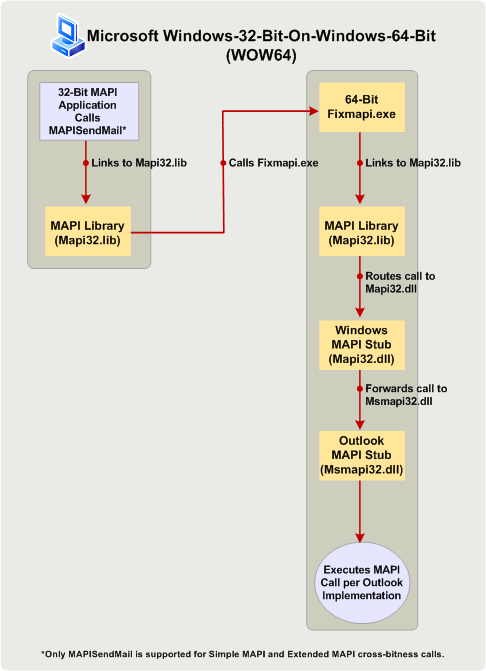

# Erstellen von MAPI-Anwendungen für 32- und 64-Bit-Plattformen

**Gilt für**: Outlook 2013 | Outlook 2016 
  
In diesem Thema werden die Aktionen beschrieben, die MAPI-Entwickler zum Ändern und Neuerstellen von 32-Bit-MAPI-Anwendungen für die Ausführung auf 64-Bit-Plattformen und von 64-Bit-Anwendungen für die Ausführung auf 32-Bit-Plattformen durchführen müssen. In diesem Thema stellt die 64-Bit-Plattform ein Computer mit der 64-Bit-Version von Microsoft Outlook und Windows dar, und die 32-Bit-Plattform ein Computer mit der 32-Bit-Version von Outlook und der 32-Bit- oder 64-Bit-Version von Windows dar. 
  
## Betriebssystem- und Office-Unterstützung für 64-Bit-Versionen von Outlook

> [!NOTE]
> Der Begriff Bitanzahl bezieht sich auf die Unterscheidung zwischen 32-Bit- und 64-Bit-Prozessorarchitekturen und der zugehörigen Kompatibilität von Anwendungen. In diesem Thema wird Bitanzahl zum Angeben der Version von Windows, Microsoft Office, Outlook, oder einer MAPI-Anwendung, die entsprechend den Anforderungen einer 32-Bit- oder 64-Bit Prozessorarchitektur eines Computers und möglicherweise anderer Programme, die auf diesem Computer ausgeführt werden, entwickelt wurde. 
  
Beginnend mit Microsoft Office 2010 steht Outlook als 32-Bit- und 64-Bit-Anwendung zur Verfügung. Die Bitanzahl von Outlook auf einem bestimmten Computer hängt von der Bitanzahl des Windows-Betriebssystems (x86 oder x64) sowie, falls Office auf dem Computer installiert ist, von der Bitanzahl von Microsoft Office ab. Nachstehend finden Sie einige der Faktoren, von denen es abhängt, ob Sie eine 32-Bit- oder 64-Bit-Version von Outlook installieren können:
  
- 32-Bit-Versionen von Office (und 32-Bit-Versionen von Outlook) können unter einer 32-Bit- oder 64-Bit-Version des Windows-Betriebssystems installiert werden. 64-Bit-Versionen von Office (und 64-Bit-Versionen von Outlook) können nur unter einem 64-Bit-Betriebssystem installiert werden.
    
- Die Standardinstallation von Office unter einer 64-Bit-Version des Windows-Betriebssystems ist eine 32-Bit-Version von Office.
    
- Die Bitanzahl einer installierten Version von Outlook entspricht immer der Bitanzahl von Office, wenn Office auf dem gleichen Computer installiert ist. Mit anderen Worten, eine 32-Bit-Version von Outlook kann nicht auf einem Computer installiert werden, auf dem bereits 64-Bit-Versionen anderer Office-Anwendungen (beispielsweise eine 64-Bit-Version von Microsoft Word oder von Microsoft Excel) installiert sind. Analog kann eine 64-Bit-Version von Outlook nicht auf einem Computer installiert werden, auf dem bereits 32-Bit-Versionen anderer Office-Anwendungen installiert sind.
    
## Vorbereiten von MAPI-Anwendungen für 32- und 64-Bit-Plattformen

Zu den MAPI-Anwendungen geh�ren eigenst�ndige Anwendungen wie beispielsweise Microsoft�Communicator und MFCMAPI sowie Dienstanbieter wie beispielsweise Adressbuch-, Speicher- und Transportanbieter. Damit MAPI-Methoden und -Funktionsaufrufe in einer MAPI-Anwendung verwendet werden k�nnen (mit Ausnahme der einfachen MAPI-Funktion MAPISendMail), muss die Bitanzahl der MAPI-Anwendung der Bitanzahl des MAPI-Subsystems auf dem Computer entsprechen, auf dem die Anwendung ausgef�hrt werden soll. Die Bitanzahl des MAPI-Subsystems wiederum wird durch die Bitanzahl der installierten Version von Outlook bestimmt und muss dieser immer entsprechen. In der folgenden Tabelle werden die erforderlichen Aktionen zur Vorbereitung von MAPI-Anwendungen f�r die Ausf�hrung auf Zielcomputern mit Office- und Windows-Versionen mit unterschiedlicher Bitanzahl aufgef�hrt.
  
|Bitanzahl der MAPI-Anwendung|Bitanzahl der Outlook-Version auf dem Zielcomputer|Bitanzahl der Windows-Version auf dem Zielcomputer|Erforderlichen Aktion, damit die Anwendung auf dem Zielcomputer ausgeführt werden kann|
|:-----|:-----|:-----|:-----|
|32-Bit    |32-Bit    |32-Bit- oder 64-bit    |Es sind keine weiteren Aktionen erforderlich.    |
|32-Bit    |64-Bit    |64-Bit    |Erstellen Sie die Anwendung als 64-Bit-Anwendung neu. Andernfalls tritt beim Ausführen aller MAPI-Methoden und -Funktionsaufrufen (mit Ausnahme von **MAPISendMail**) ein Fehler auf.    |
|64-Bit    |64-Bit    |64-Bit    |Es sind keine weiteren Aktionen erforderlich.    |
|64-Bit    |32-Bit    |32-Bit- oder 64-bit    |Erstellen Sie die Anwendung als 32-Bit-Anwendung neu. Andernfalls tritt beim Ausführen aller MAPI-Methoden- und -Funktionsaufrufe (mit Ausnahme von **MAPISendMail**) ein Fehler auf.  |
   
In den folgenden Abschnitten werden die einzelnen Szenarien genauer erläutert. Weitere Informationen zu Verweisen auf und Aufrufen von MAPI-Funktionen in Szenarien, für die eine Neuerstellung der MAPI-Anwendung erforderlich ist, finden Sie unter [Verweisen auf MAPI-Funktionen](how-to-link-to-mapi-functions.md). 
  
### 32-Bit-MAPI-Anwendung und 32-Bit-Version von Outlook

MAPI-Anwendungen, die für ein 32-Bit-MAPI-Subsystem kompiliert wurden, das in 32-Bit-Versionen von Outlook, einschließlich der Versionen vor Microsoft Outlook 2013 verfügbar ist, werden weiterhin auf Computern mit der 32-Bit-Version von Outlook und einer 32-Bit- oder 64-Bit-Version von Windows unterstützt. Anwendungsentwickler müssen keine weiteren Aktionen durchführen.
  
### 32-Bit-MAPI-Anwendung und 64-Bit-Version von Outlook

32-Bit-MAPI-Anwendungen werden nicht auf einem Computer mit der 64-Bit-Version von Outlook und der 64-Bit-Version von Windows unterstützt. Anwendungsentwickler müssen die Anwendung als 64-Bit-Anwendung für die 64-Bit-Plattform neu erstellen. Grund dafür ist, dass eine 32-Bit-Anwendung die 64-Bit-Datei „Msmapi32.dll“ nicht laden kann Es gibt eine kleine Anzahl von API-Änderungen, die Anwendungsentwickler vornehmen müssen, damit Ihr Code erfolgreich in einer 64-Bit-Umgebung ausgeführt werden kann. Diese Änderungen wurden an den MAPI-Headerdateien vorgenommen, damit 64-Bit-Plattformen unterstützt werden. Sie können diese Headerdateien unter [Outlook 2010: MAPI-Headerdateien](http://www.microsoft.com/downloads/details.aspx?FamilyID=f8d01fc8-f7b5-4228-baa3-817488a66db1) herunterladen. Entwickler können denselben Satz von MAPI-Headerdateien zum Erstellen von 32-Bit- und 64-Bit-MAPI-Anwendungen verwenden.
  
### 64-Bit-MAPI-Anwendung und 64-Bit-Version von Outlook

64-Bit-MAPI-Anwendungen werden auf Computern mit der 64-Bit-Version von Outlook und der 64-Bit-Version von Windows unterstützt. Anwendungsentwickler müssen keine weiteren Aktionen durchführen.
  
### 64-Bit-MAPI-Anwendung und 32-Bit-Version von Outlook

64-Bit-MAPI-Anwendungen werden nicht auf einem Computer mit der 32-Bit-Version von Outlook und der 32-Bit- oder 64-Bit-Version von Windows unterstützt. Anwendungsentwickler müssen die Anwendung als 32-Bit-Anwendung für die Verwendung mit der 32-Bit-Version von Outlook neu erstellen. Verwenden Sie die aktualisierten MAPI-Headerdateien, die unter [Outlook 2010: MAPI-Headerdateien](http://www.microsoft.com/downloads/details.aspx?FamilyID=f8d01fc8-f7b5-4228-baa3-817488a66db1) heruntergeladen werden können. Entwickler können denselben Satz von MAPI-Headerdateien zum Erstellen von 32-Bit- und 64-Bit-MAPI-Anwendungen verwenden.
  
### Ausnahme: MAPISendMail

Eine 32-Bit-MAPI-Anwendung darf in der Regel nicht auf einer 64-Bit-Plattform (64-Bit-Version von Outlook unter 64-Bit-Version von Windows) ausgef�hrt werden, ohne dass sie zun�chst als 64-Bit-Anwendung neu erstellt wird, und eine 64-Bit-MAPI-Anwendung darf nicht auf einem Computer mit der 32-Bit-Version von Outlook und der 32-Bit- oder 64-Bit-Version von Windows ausgef�hrt werden, ohne dass sie zun�chst als 32-Bit-Anwendung neu erstellt wird. In Abbildung�1 wird eine Warnmeldung dargestellt, die angezeigt wird. wenn eines dieser Szenarien auftritt.
  
**Abbildung 1. Fehlermeldung für die meisten bitanzahlübergreifenden MAPI-Aufrufe.**

  
Ein Funktionsaufruf zwischen allen Simple MAPI- und MAPI-Elementen, **MAPISendMail**, wird jedoch erfolgreich in einem WOW64-Szenario (Windows-32-bit-on-Windows-64-bit) oder WOW32-Szenario (Windows-64-bit-on-Windows-32-bit) erfolgreich ausgef�hrt und gibt nicht die oben dargestellte Warnmeldung zur�ck. Dieses WOW64-Szenario gilt nur für Windows 7. 

In Abbildung�2 wird ein WOW64-Szenario dargestellt, in dem eine 32-Bit-MAPI-Anwendung **MAPISendMail** auf einem Computer mit der 64-Bit-Version von Windows 7 aufruft. In diesem Szenario führt die MAPI-Bibliothek einen COM-Aufruf durch, um eine 64-Bit-Fixmapi-Anwendung zu starten. Die Fixmapi-Anwendung verweist implizit auf die MAPI-Bibliothek, die den Funktionsaufruf an den Windows-MAPI-Stub weiterleitet, wodurch wiederum der Aufruf an den Outlook-MAPI-Stub weitergeleitet wird und so der **MAPISendMail**Funktionsaufruf erfolgreich ausgeführt werden kann. 
  
**Abbildung 2. Verarbeiten von MAPISendMail in einem WOW64-Szenario.**

  
## Siehe auch

- [Verweisen auf MAPI-Funktionen](how-to-link-to-mapi-functions.md)

