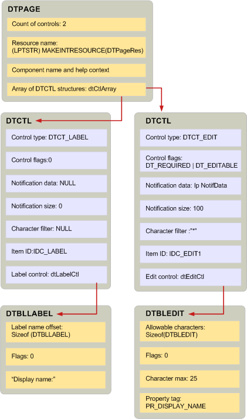

# Erstellen von Anzeigetabellen und verwandten Strukturen
  
**Gilt für**: Outlook 2013 | Outlook 2016 
  
Das Erstellen einer Anzeigetabelle ähnelt dem Schreiben eines Programms mit einer Skriptsprache. Sie können eine Anzeigetabelle erstellen, indem Sie [BuildDisplayTable](builddisplaytable.md) aufrufen oder benutzerdefinierten Code schreiben, um die Zeilen und Spalten der Tabelle zu füllen. Im Allgemeinen sollten Sie die **BuildDisplayTable-Technik** verwenden, da sie einfacher ist. 
  
Bevor Sie **BuildDisplayTable** aufrufen können, um MAPI zum Erstellen einer Anzeigetabelle aufforderen zu können, müssen Sie eine Hierarchie von Strukturen erstellen. Die Struktur auf oberster Ebene, [DTPAGE,](dtpage.md)beschreibt eine einzelne Eigenschaftenseite mit Registerkarten. In jeder **DTPAGE-Struktur** ist eine [DTCTL-Struktur,](dtctl.md) die ein einzelnes Steuerelement beschreibt, z. B. ein Bearbeitungsfeld oder eine Optionsschaltfläche. Jede **DTCTL-Struktur** enthält eine Struktur, die für den Typ des Steuerelements spezifisch ist. Wenn die **DTCTL-Struktur** beispielsweise ein Bearbeitungsfeldsteuerelement beschreibt, enthält es eine **DTBLEDIT-Struktur.** Die **DTCTL-Struktur** für eine Optionsschaltfläche enthält eine **DTBLRADIOBUTTON-Struktur.** 
  
Diese Strukturen beziehen sich direkt auf **BuildDisplayTable**; sie haben keine Bedeutung außerhalb des Kontexts dieser Funktion. Wenn Sie **BuildDisplayTable aufrufen,** übergeben Sie mindestens eine **DTPAGE-Struktur** als Eingabeparameter. Die **DTPAGE-Strukturen** enthalten ein Array von **DTCTL-Strukturen** und eine Anzahl der **DTCTL-Strukturen** im Array. Es gibt eine Struktur für jedes Steuerelement, das im Dialogfeld angezeigt werden soll. **DTPAGE-Strukturen** verfügen auch über eine Zeichenzeichenfolge, die den Namen einer entsprechenden Hilfedatei und dialogfeldressource darstellt. 
  
Jede **DTCTL-Struktur** in einer **DTPAGE-Struktur** enthält die folgenden Daten, die zum Festlegen von Eigenschaften für das Steuerelement verwendet werden: 
  
- Der Steuerelementtyp zum Festlegen **PR_CONTROL_TYPE** ([PidTagControlType](pidtagcontroltype-canonical-property.md)).
    
- Steuerelementflags zum Festlegen **PR_CONTROL_FLAGS** ([PidTagControlFlags](pidtagcontrolflags-canonical-property.md)).
    
- Benachrichtigungsdaten zum Festlegen **PR_CONTROL_ID** ([PidTagControlId](pidtagcontrolid-canonical-property.md)).
    
- Die Steuerelementstruktur zum Festlegen **PR_CONTROL_STRUCTURE** ([PidTagControlStructure](pidtagcontrolstructure-canonical-property.md)).
    
**DTCTL-Strukturen** enthalten auch eine Ressourcen-ID und für Bearbeitungs- und Kombinationsfeldsteuerelemente einen Zeichenfilter. 
  
Das Element der Steuerelementstruktur einer **DTCTL-Struktur** beschreibt die Daten, die für den Typ des Steuerelements eindeutig sind. MAPI definiert eine andere Struktur für jeden Steuerelementtyp. Die Daten eines Bearbeitungssteuerelements werden beispielsweise durch eine **DTBLEDIT-Struktur** dargestellt. Die Daten eines Listenfelds werden durch eine **DTBLLBX-Struktur** dargestellt. 
  
Die Beziehung zwischen den drei Typen von Anzeigetabelle strukturen wird in der folgenden Abbildung dargestellt. Das in dieser Anzeigetabelle beschriebene Dialogfeld verfügt über zwei Steuerelemente: eine Bezeichnung und ein Bearbeitungssteuerelement. Die **DTBLLBX-Struktur** verfügt ebenso wie mehrere Steuerelementstrukturen über ein Element für den Beschriftungsversatz, das beschreibt, wo die Zeichenzeichenfolge für die Bezeichnung beginnt. Zeichenfolgen für Beschriftungszeichen werden in der Regel direkt nach der Struktur im Arbeitsspeicher platziert. 
  
**Anzeigetabellenstrukturen**
  

  
## Siehe auch

- [Implementierung von Anzeigetabellen](display-table-implementation.md)

