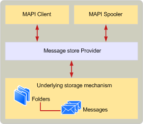

# Entwickeln von einem Anbieter MAPI-NachrichtDeveloping a MAPI message store provider
  
**Betrifft**: Outlook**Applies to**: Outlook 
  
Wie andere MAPI-Dienstanbieter sind Nachrichtenspeicher Dynamic Link Libraries (DLLs), die die Dienste eines zugrunde liegende Speichermechanismus MAPI-Clientanwendungen und die MAPI-Warteschlange darstellen.Like other MAPI service providers, message stores are dynamic-link libraries (DLLs) that present the services of an underlying storage mechanism to MAPI client applications and the MAPI spooler. Der Nachricht-Speicher-Anbieter bietet den zugrunde liegende Speichermechanismus als hierarchisch strukturierter Satz von Ordnern und Nachrichten, die MAPI-Clients und die MAPI-Warteschlange verwenden können.The message store provider presents the underlying storage mechanism as a hierarchical set of folders and messages that MAPI clients and the MAPI spooler can use.
  
Die folgende Abbildung zeigt die grundlegende Architektur des Nachrichtenspeichers MAPI.The following illustration shows the basic MAPI message store architecture.
  
**Architektur des Nachrichtenspeichers****Message store architecture**
  
![Architektur des Nachrichtenspeichers] (media/storearc.gif "Architektur des Nachrichtenspeichers")
  
Sie können eine Nachricht Speicheranbieter mithilfe von irgendeiner zugrunde liegende Speichermechanismus aus, die Sie implementieren.You can implement a message store provider by using any sort of underlying storage mechanism you like. Sie müssen jedoch Leistungsbedenken berücksichtigen.However, you need to be aware of performance concerns. Darüber hinaus muss der zugrunde liegende Speichermechanismus als eine hierarchische Auflistung von MAPI-Objekten dargestellt werden.In addition, the underlying storage mechanism must be presented as a hierarchical collection of MAPI objects. Diese Anforderungen bedeuten, dass Nachrichtenspeicher in der Regel mit einem vorhandenen Datenbankprodukt unterstützt, die hierarchische Speicherung von Objekten in der Datenbank sowie, eine Programmierschnittstelle oder eindeutig definierter Dateistruktur implementiert werden.These requirements mean that message stores are typically implemented by using an existing database product that supports hierarchical storage of objects in the database and that has a programming interface or well-defined file structure. Microsoft Office Access, SQL und Oracle-Datenbanken können beispielsweise als der zugrunde liegende Speichermechanismus verwendet werden.For example, Microsoft Office Access, SQL, and Oracle databases can be used as the underlying storage mechanism. Einige Datenbankprodukte haben Featuregruppen, mit die leichter MAPI-Funktionen zu implementieren, damit Ihrer Wahl des Datenbankprodukts durch die Features, die Ihre Nachricht Speicheranbieter zur Unterstützung von muss beeinträchtigt werden kann.Some database products have feature sets that make it easier to implement MAPI features, so your choice of database product may be affected by the features that your message store provider needs to support.
  
Verwenden eine vorhandene Datenbank als die zugrunde liegende Speicher Mechanismus speichert, an denen Sie arbeiten, da es in der Regel leichter vorhanden Datenbankobjekte MAPI-Clients als MAPI-Objekten ist als zu implementieren einen eigenen Mechanismus hierarchisches Speicher.Using an existing database as the underlying storage mechanism saves you work because it is usually easier to present database objects to MAPI clients as MAPI objects than to implement your own hierarchical storage mechanism. Auf diese Weise können Sie MAPI-Vorgänge auf einer höheren Ebene als, wenn Sie einen eigenen Mechanismus hierarchisches Speicher implementieren zu behandeln.Doing this enables you to treat MAPI operations at a higher level than if you implement your own hierarchical storage mechanism. Suchen einer Nachricht mit einer bestimmten Betreffzeile wird beispielsweise recht einfach wenigen erstellen und Senden von einer Abfrage für die gewünschte Datenbank, anstatt implementieren komplexe Routinen, um hierarchische Speichermechanismus zu suchen.For example, searching for a message with a particular subject line becomes a fairly simple matter of constructing and submitting an appropriate database query, rather than implementing complex routines to search your hierarchical storage mechanism.
  
Nachricht-Anbieter kommunizieren mit MAPI-Clients und die MAPI-Warteschlange zum Ausführen von Vorgängen für Ordner und Objekte.Message store providers communicate with MAPI clients and the MAPI spooler to perform operations on folders and objects. Der Nachricht Speicheranbieter übersetzt diese Vorgänge in die zugrunde liegende Speicher Mechanismus Vorgänge auf niedriger Ebene.The message store provider translates those operations into lower level operations on the underlying storage mechanism. Die MAPI-Warteschlange kommuniziert normalerweise mit der Nachricht Informationsdienst beim Senden und Empfangen von Nachrichten.The MAPI spooler typically communicates with the message store provider while sending and receiving messages. MAPI-Clients kommunizieren normalerweise mit der Nachricht-Anbieter die Ordnerhierarchie bearbeiten und zu lesen, bearbeiten, löschen und Senden von Nachrichten.MAPI clients typically communicate with message store providers to manipulate the folder hierarchy and to read, edit, delete, and send messages.
  
Die MAPI-Warteschlange und die MAPI-Clients kommunizieren mit dem Anbieter Nachricht anmelden, um neue Nachrichten zu erstellen.Both the MAPI spooler and MAPI clients communicate with the message store provider to create new messages. Clientanwendungen dazu beim Verfassen einer Nachricht.Client applications do this when users compose a message. Die MAPI-Warteschlange führt dies, wenn sie eine eingehende Nachricht empfängt.The MAPI spooler does this when it receives an incoming message. In beiden Fällen wird die neue Nachricht in der Regel im Ordner Posteingang des Nachrichtenspeichers, erstellt, sofern vorhanden.In either case, the new message is usually created in the Inbox folder of the message store, if there is one.
  
Nachricht Anbieter stellen Sie bei der umfassenden Verwendung von MAPI-Tabellen, Ordnern, Nachrichten und Eigenschaften.Message store providers make heavy use of MAPI tables, folders, messages, and properties. Die Implementierungsdetails für diese Objekte werden in [MAPI-Tabellen](mapi-tables.md), [MAPI-Ordner](mapi-folders.md), [MAPI-Nachrichten](mapi-messages.md)und [MAPI-Eigenschaften im Überblick](mapi-property-overview.md)dokumentiert.The implementation details for those objects are documented in [MAPI Tables](mapi-tables.md), [MAPI Folders](mapi-folders.md), [MAPI Messages](mapi-messages.md), and [MAPI Property Overview](mapi-property-overview.md). Sie sollten sich mit diesem Material vertraut machen bevor Sie versuchen, einen Anbieter für die Nachricht anmelden zu implementieren.You should familiarize yourself with that material before attempting to implement a message store provider.
  
Es gibt zwei wichtige Arten von Anbietern Nachricht: diejenigen, die als Standard für einen Benutzer fungieren können e-Mail-Speicher und die nicht.There are two important types of message store providers: those that can act as a user's default message store and those that cannot. Ein Standardnachrichtenspeicher ist eine der in der sich Client-Anwendungen und die MAPI-Warteschlange alle messaging Aufgaben wie das Empfangen von Nachrichten oder Erstellen von Ordnern ausführen können.A default message store is one in which client applications and the MAPI spooler can perform any messaging task, such as receiving messages or creating folders. Nachricht Store Standardanbieter muss als die für alle Anbieter für Nachricht Store erforderlichen Mindestanzahl Weitere Features unterstützen.A default message store provider must support several more features than the minimum number required for all message store providers.
  
## Siehe auchSee also

- [MAPI-KonzepteMAPI concepts](mapi-concepts.md)

