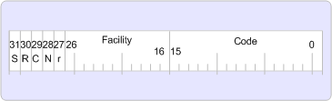

# Fehlerbehandlung in MAPIError handling in MAPI

**Betrifft**: Outlook**Applies to**: Outlook 
  
Erfolg, Warnung und Fehler-Werte werden unter Verwendung einer 32-Bit-Version bekannte dementsprechend Handle oder HRESULT zurückgegeben.Success, warning, and error values are returned using a 32-bit number known as a result handle, or HRESULT. Ein HRESULT ist nicht wirklich ein Handle auf einen anderen Wert. Es wird lediglich eine 32-Bit-Wert mit mehrere Felder in den Wert codiert.An HRESULT is really not a handle to anything; it is merely a 32-bit value with several fields encoded in the value. Ein NULL-Ergebnis zeigt Erfolg und ein ungleich NULL Ergebnis Fehler.A zero result indicates success and a nonzero result indicates failure.
  
MAPI auf 32-Bit-Plattformen funktioniert nur mit HRESULT-Werte.MAPI on 32-bit platforms works solely with HRESULT values.
  
Die folgende Abbildung zeigt das HRESULT-Format für 32-Bit-Plattformen.The following illustration shows the HRESULT format for 32-bit platforms.
  
**HRESULT-format****HRESULT format**
  
![HRESULT-format] (media/amapi_49.gif "HRESULT-format")
  
Das hohe Bit in der HRESULT gibt an, ob der Rückgabewert Erfolg oder Fehler darstellt.The high order bit in the HRESULT indicates whether the return value represents success or failure. Wenn der Wert Erfolg gibt 0 (null) festgelegt, an.If set to zero, the value indicates success. Wenn auf 1 festgelegt, es einen Fehler angibt.If set to 1, it indicates failure.
  
Die R, C, N und R Bits sind in der HRESULT reserviert.The R, C, N, and r bits are reserved in the HRESULT.
  
Das Feld Facility in beiden Versionen gibt den Bereich der Verantwortung für den Fehler.The facility field in both versions indicates the area of responsibility for the error. Es gibt verschiedene Funktionen, aber die Mehrheit der MAPI-Fehler verwenden FACILITY_ITF Benutzeroberflächenfehler darstellen.There are several facilities, but the vast majority of MAPI errors use FACILITY_ITF to represent interface errors. Werden die am häufigsten verwendeten Funktionen, die derzeit verwendet werden: FACILITY_NULL, FACILITY_ITF, FACILITY_DISPATCH, FACILITY_RPC und FACILITY_STORAGE.The most common facilities that are currently used are: FACILITY_NULL, FACILITY_ITF, FACILITY_DISPATCH, FACILITY_RPC, and FACILITY_STORAGE. Wenn neue Funktionen erforderlich sind, weist Microsoft sie, da sie eindeutig sein müssen.If new facilities are necessary, Microsoft allocates them because they need to be unique. In der folgenden Tabelle werden die verschiedenen Facility Felder beschrieben.The following table describes the various facility fields.
  
|EinrichtungFacility|BeschreibungDescription|
|:-----|:-----|
|FACILITY_NULLFACILITY_NULL    |Für umfassend anwendbaren allgemeine Statuscodes wie S_OK oder E_OUTOF_MEMORY; der Wert ist NULL.For broadly applicable common status codes such as S_OK or E_OUTOF_MEMORY; the value is zero.    |
|FACILITY_ITFFACILITY_ITF    |Für die meisten Statuscodes von Schnittstellenmethoden zurückgegeben; der Wert wird von der Benutzeroberfläche definiert.For most status codes returned from interface methods; the value is defined by the interface. D. h., möglicherweise zwei HRESULT-Werte mit genau die gleiche 32-Bit-Wert zurückgegeben von zwei verschiedenen Schnittstellen verschiedene Bedeutungen haben.That is, two HRESULT values with exactly the same 32-bit value returned from two different interfaces might have different meanings.    |
|FACILITY_DISPATCHFACILITY_DISPATCH    |Für späte Bindung [IDispatch](http://msdn.microsoft.com/de-de/library/ms221608.aspx) -Schnittstelle Fehler.For late binding [IDispatch](http://msdn.microsoft.com/de-de/library/ms221608.aspx) interface errors.    |
|FACILITY_RPCFACILITY_RPC    |Für Statuscodes von Remoteprozeduraufrufe zurückgegeben.For status codes returned from remote procedure calls.    |
|FACILITY_STORAGEFACILITY_STORAGE    |Für Statuscodes [IStorage](http://msdn.microsoft.com/de-de/library/aa380015%28VS.85%29.aspx) oder [IStream](http://msdn.microsoft.com/de-de/library/aa380034%28VS.85%29.aspx) Aufrufe von Methoden für strukturierte Speicher zurückgegeben.For status codes returned from [IStorage](http://msdn.microsoft.com/de-de/library/aa380015%28VS.85%29.aspx) or [IStream](http://msdn.microsoft.com/de-de/library/aa380034%28VS.85%29.aspx) method calls relating to structured storage. Statuscodes Code (unteren 16 Bit) Werte im Bereich von Windows-Fehlercodes (d. h., kleiner als 256) haben dieselbe Bedeutung wie die entsprechende Windows-Fehler.Status codes with code (lower 16 bits) values in the range of Windows error codes (that is, less than 256) have the same meaning as the corresponding Windows errors.    |
   
Das Feld ist eine eindeutige Zahl, die zum Darstellen der Fehlermeldung oder einer Warnung zugewiesen ist.The code field is a unique number that is assigned to represent the error or warning.
  

