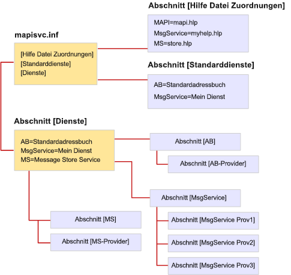

# Dateiformat von MapiSvc.infFile format of MapiSvc.inf

**Gilt für**: Outlook 2013 | Outlook 2016**Applies to**: Outlook 2013 | Outlook 2016 
  
Die Datei "MapiSvc.inf" fungiert als zentrale Datenbank für die MAPI-Nachrichtendienst-Konfigurationsinformation.The MapiSvc.inf file acts as the central database for MAPI message service configuration information. MapiSvc.inf enthält Informationen zu jedem Nachrichtendienst auf der Arbeitsstation, Informationen zu den Dienstanbietern, die zu dem jeweiligen Nachrichtendienst gehören, und Informationen zum MAPI-Subsystem.MapiSvc.inf contains information about each of the message services installed on the workstation, information about the service providers that belong to each message service, and information about the MAPI subsystem. MapiSvc.inf ist die primäre Informationsquelle für Profile.MapiSvc.inf is the primary source of information for profiles. D. h., wenn ein neues Profil erstellt oder ein vorhandenes geändert wird, werden die relevanten Informationen für jeden Nachrichtendienst oder Dienstanbieter aus MapiSvc.inf kopiert.That is, when a new profile is being built or an existing one modified, relevant information for each message service or service provider is copied from MapiSvc.inf. 
  
MapiSvc.inf wird in verknüpfte hierarchische Abschnitte unterteilt:MapiSvc.inf is divided into linked hierarchical sections:
  
1. Ein Abschnitt, der Informationen zu allen Profilen enthält.Section containing information that applies to all profiles. Dieser Abschnitt besteht aus drei Teilen:This section has three parts:
    
   - Der **[Services]**-Abschnitt bietet Links zu den jeweiligen nachfolgenden Nachrichtendienst-Abschnitten.**[Services]** section, providing links to each of the subsequent message service sections. 
    
   - Der **[Help File Mappings]**-Abschnitt enthält Informationen zu .HLP-Dateien, die von Nachrichtendiensten bereitgestellt werden.**[Help File Mappings]** section, containing information about .HLP files provided by message services. 
    
   - Im **[Default Services]**-Abschnitt sind Nachrichtendienste aufgeführt, die eine Standardinstallation bilden.**[Default Services]** section, listing message services that make up a default installation. 
    
2. Ein Abschnitt, der Informationen zu einzelnen Nachrichtendiensten enthält.Section containing information that applies to individual message services. Die Einträge in diesen Abschnitten enthalten Links zu nachfolgenden Dienstanbieter-Abschnitten.Entries in these sections provide links to subsequent service provider sections.
    
3. Ein Abschnitt, der Informationen zu einzelnen Nachrichtenanbietern eines Nachrichtendienstes enthält.Section containing information that applies to individual service providers in a message service.
    
Die folgende Abbildung zeigt den Aufbau einer typischen MapiSvc.inf-Datei.The following illustration shows the organization of a typical MapiSvc.inf file. Es gibt drei Nachrichtendienste: AB, MsgService und MS.There are three message services: AB, MsgService, and MS. Der Name auf der rechten Seite des Gleichheitszeichens für jeden Nachrichtendienst ist der Anzeigename des Dienstes.The name on the right hand side of the equal sign for each message service is the service's display name. Jeder Nachrichtendienst besitzt einen eigenen Abschnitt an einer anderen Stelle in der Datei, der mit einem oder mehreren Dienstanbieter-Abschnitten verknüpft ist.Each message service has its own section elsewhere in the file that is linked to one or more service provider sections. Es gibt einen Dienstanbieter-Abschnitt für jeden Dienstanbieter, der dem Nachrichtendienst angehört.There is one service provider section for every service provider that belongs to the message service. Die Nachrichtendienste AB und MS sind Einzelanbieterdienste, während drei Dienstanbieter zum MsgService gehören.The AB and MS message services are single provider services whereas three service providers belong to the MsgService service.
  
**Organisation der Datei "MapiSvc.inf"****MapiSvc.inf file organization**
  

  
MAPI bietet eine strukturierte Version der MapiSvc.inf-Datei, die die Einträge für das MAPI-Teilsystem enthält.MAPI provides a skeletal version of the MapiSvc.inf file that contains the entries for the MAPI subsystem. Jeder Nachrichtendienstimplementierer fügt Einträge hinzu, die sowohl für den Dienst als auch die Dienstanbieter, die dem Dienst angehören, maßgeblich sind.Each message service implementer adds entries that are appropriate both for their service and the service providers that belong to their service. Einige Einträge sind erforderlich, während andere optional sind.Some of the entries are required while others are optional. MAPI erfordert z. B., dass Sie den Namen und Pfad jedes Dienstanbieters in Ihrem Nachrichtendienst angeben.For example, MAPI requires that you specify the name and path of each of the service providers in your message service. Ohne diese Informationen können sie nicht geladen werden.Without this information, they cannot be loaded.
  
Sie können erforderliche und optionale Informationen im Abschnitt für Ihren Nachrichtendienst und/oder in den Dienstanbieter-Abschnitten hinzufügen.You can add required and optional information in either the section for your message service and/or to the service provider sections. Wo Sie die Informationen zur Beschreibung Ihres Nachrichtendienstes ablegen, hängt von der Anzahl der Dienstanbieter im Dienst ab.Where you put the information describing your message service depends on the number of service providers in the service. Da diese Informationen für jeden Dienstanbieter im Dienst gelten, müssen Sie für alle Anbieter zugänglich sein.Because this information applies to each service provider in the service, you must make it accessible to all providers. Speichern Sie sie im Nachrichtendienst-Abschnitt, der bevorzugten Option oder in allen Dienstanbieter-Abschnitten.Store it either in the message service section, the preferred option, or in all of the service provider sections. Speichern Sie Informationen einmal, um unnötige Replikation zu vermeiden und zu verhindern, dass mehrere Kopien synchronisiert werden müssen.Store information once to avoid unnecessary replication and the need to keep multiple copies synchronized.
  
Wenn Ihr Nachrichtendienst ein Einzelanbieterdienst ist, speichern Sie alle Informationen für den Nachrichtendienst im Abschnitt für den Dienstanbieter und nicht im Abschnitt für den Dienst.If your message service is a single provider service, store all of the message service information in the section for the service provider rather than in the section for the service. Der Zugriff auf den Dienstanbieter-Abschnitt erfolgt schneller und direkter als der Zugriff auf den Nachrichtendienst-Abschnitt.Accessing the service provider section is faster and more direct than accessing the message service section. 
  
Speichern Sie nur öffentliche Konfigurationsdaten in der MapiSvc.inf-Datei.Store only public configuration data in the MapiSvc.inf file. Informationen, die privat sind oder zusätzlichen Schutz erfordern, wie z. B. Kennwörter oder andere Anmeldeinformationen, sollten in dieser Datei nicht enthalten sein.Information that is private or requires extra protection, such as passwords or other credentials, should not be included in this file. Speichern Sie entweder gar keine Informationen dieser Art oder bewahren Sie sie im Profil als sichere Eigenschaften auf.Instead, opt either not to store information of this type at all or keep it in the profile as secure properties. Sichere Eigenschaften verfügen über integrierte Schutzfunktionen wie Verschlüsselung.Secure properties have built-in protection features such as encryption.
  
## ReferenzReference

Weitere Informationen zum Beheben von Fehlern, wenn MAPI eine Anbieter-DLL blockiert, finden Sie unter [So erlauben Sie MAPI, nicht registrierte Anbieter-DLLs zu laden](https://support.microsoft.com/topic/how-to-allow-mapi-to-load-unregistered-provider-dlls-18d9a1cd-d3d7-fa10-473e-5dfd62d38b0d).For more information about how to troubleshoot errors if MAPI blocks a Provider DLL, see [How to allow MAPI to load unregistered Provider DLLs](https://support.microsoft.com/topic/how-to-allow-mapi-to-load-unregistered-provider-dlls-18d9a1cd-d3d7-fa10-473e-5dfd62d38b0d).

