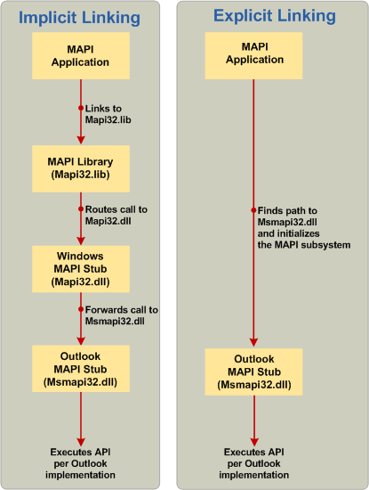

# <a name="link-to-mapi-functions"></a>Verweisen auf MAPI-Funktionen

**Gilt für**: Outlook 2013 | Outlook 2016 
  
Es gibt drei Methoden der Verknüpfung: implizite Verknüpfung, explizite Verknüpfung und ein neues Hybridmodell mithilfe der MAPI-Stubbibliothek.
  
## <a name="implicit-linking"></a>Implizite Verknüpfung

In der Vergangenheit war beim Aufrufen von MAPI-Funktionen in einer Messaginganwendung immer eine Verknüpfung mit der Mapi32.lib-Bibliothek erforderlich. Dazu gehört das Weiterleiten von MAPI-Aufrufen an die Windows MAPI-Stubbibliothek Mapi32.dll, die die Aufrufe zur Laufzeit an die standardmäßige MAPI-Clientimplementierungen weitergeleitet hat. Dieser Aufrufprozess wird als implizite Verknüpfung bezeichnet. Die linke Seite der folgenden Abbildung zeigt ein Beispiel für die implizite Verknüpfung, die in einem MAPI-Funktionsaufrufprozess verwendet wird. Der Prozess wird von einer MAPI-Anwendung initiiert und umfasst die MAPI-Bibliothek (Mapi32.lib) und den Windows MAPI-Stub (Mapi32.dll) und wird durch die Outlook MAPI-Clientimplementierung des MAPI-Stubs (Msmapi32.dll) abgeschlossen.
  
**Vergleich der impliziten und expliziten Verknüpfung.**


  
## <a name="explicit-linking"></a>Explizite Verknüpfung

Da der Standardmäßige MAPI-Client die Installation bei Bedarf mit dem Windows Installer (MSI) unterstützt, können Sie Messaginganwendungen direkt auf dem Outlook MAPI-Stub entwickeln, anstatt die MAPI-Bibliothek und Windows MAPI-Stub zu verwenden. Die rechte Seite der vorherigen Abbildung zeigt ein Beispiel für einen MAPI-Funktionsaufrufprozess, beginnend mit einer MAPI-Anwendung, die nach dem Pfad und dem DLL-Namen für den Outlook MAPI-Stub sucht (Schritt 2 im folgenden Abschnitt), und das Ausführen von Funktionsaufrufen im Outlook MAPI-Stub (Schritt 3 im folgenden Abschnitt). Das folgende Verfahren zeigt, wie MAPI-Funktionen mithilfe der expliziten Verknüpfung aufgerufen werden. 
  
> [!NOTE]
> Diese Informationen zur expliziten Verknüpfung sind möglicherweise überflüssig für Ihre Anforderungen mit der Einführung der MAPIStubLibrary.lib, die im folgenden Abschnitt erläutert wird. Wie das implizite Modell verwaltet die neue Bibliothek alles und implementiert die explizite Verknüpfungslogik, die die MAPI Outlook direkt lädt. 
  
Weitere Informationen zum expliziten Verknüpfen finden Sie unter "Explizit verknüpfen".
  
### <a name="to-call-mapi-api-elements-without-the-mapi-library-and-the-windows-mapi-stub"></a>So rufen Sie MAPI-API-Elemente ohne die MAPI-Bibliothek und den Windows MAPI-Stub auf

1. Erstellen Sie in der Programmdatei eine globale Liste von Funktionszeigern für jedes MAPI-API-Element, das Sie verwenden. 
    
   Das folgende Beispiel zeigt diesen Schritt.
    
   ```cpp
    //Global MAPI function pointers
    LPMAPIINITIALIZE pfnMAPIInitialize = NULL;
    LPMAPIUNINITIALIZE pfnMAPIUninitialize = NULL;
   ```

2. Erstellen Sie eine Funktion, die MAPI-Funktionen initialisiert, um eine Verknüpfung mit der MAPI-DLL des Standardmäßigen MAPI-Clients herzustellen (z. B. Msmapi32.dll von Microsoft Outlook). Führen Sie in dieser Funktion die folgenden Aktionen aus: 
    
    1. Laden Sie mapi32.dll aus dem entsprechenden Systemverzeichnis. 
        
       |||
       |:-----|:-----|
       |x64 oder x86 nativ  <br/> |**%windir%\system32\mapi32.dll** <br/> |
       |x86 im WoW-Modus  <br/> |**%windir%\syswow64\mapi32.dll** <br/> |
    
    2. Rufen Sie die [FGetComponentPath-Funktion auf,](fgetcomponentpath.md) um den Pfad und dll-Namen abzurufen, der das MAPI-Subsystem implementiert. Weitere Informationen finden Sie unter [Auswählen einer bestimmten Version der MAPI, die geladen werden soll.](how-to-choose-a-specific-version-of-mapi-to-load.md)
        
    3. Laden Sie die DLL, indem Sie die LoadLibrary-Funktion aufrufen. 
        
    4. Initialisieren Sie das MAPI-Funktionszeigerarray, indem Sie die GetProcAddress-Funktion aufrufen. 
        
    Das folgende Beispiel zeigt die vorherigen Schritte:
        
   ```cpp
    void InitializeMapiFunctions()
    {
    {
        // Get the DLL path and name of the actual MAPI implementation.
        FGetComponentPath(g_szMapiComponentGUID, NULL, szMAPIDLL, MAX_PATH);
        // Load the DLL.
        hMod = LoadLibrary(szMAPIDLL);
        // Initialize MAPI functions.
        pfnMAPIInitialize = GetProcAddress(hMod, "MAPIInitialize");
        pfnMAPIUninitialize = GetProcAddress(hMod, "MAPIUninitialize");
    }
   ```

3. Rufen Sie schließlich die Funktion auf, die Sie in Schritt 2 in Ihrer Messaging-Anwendung erstellt haben, bevor Sie Aufrufe an MAPI-API-Elemente vornehmen. 
    
   > [!CAUTION]
   > Sie müssen die Initialisierung des MAPI-Subsystems aufheben, bevor Sie die Anwendung schließen. 
  
   Das folgende Beispiel zeigt diesen Schritt: 
    
   ```cpp
    int main()
    {
        HRESULT hr;
        InitializeMapiFunctions();
        // Initialize the MAPI subsystem.
        hr = (*pfnMAPIInitialize)(NULL);
        if (hr!= S_OK)
        {
            // Handle the error case.
        }
        // Here is where you make calls to other MAPI interfaces.
        // Uninitialize the MAPI subsystem.
        (*pfnMAPIUninitialize)();
    return (0);
    }
   ```

## <a name="mapistublibrarylib"></a>MAPIStubLibrary.lib

Die Einführung von Microsoft Outlook 2010 und 64-Bit-MAPI, die sich jetzt auf die Microsoft Outlook 2013 erstreckt, erfordert mehr als die herkömmliche 32-Bit-API für die vollständige Implementierung. Ein neues Projekt, die MAPI-Stubbibliothek, das auf der CodePlex-Website veröffentlicht wird, bietet einen Drop-In-Ersatz für Mapi32.lib, der das Erstellen von 32-Bit- und 64-Bit-MAPI-Anwendungen unterstützt. MAPIStubLibrary.lib entfällt die Notwendigkeit einer expliziten Verknüpfung mit MAPI, und nachdem Sie sie erstellt haben, können Sie Mapi32.lib aus Ihren Linkereinstellungen entfernen und durch MAPIStubLibrary.lib ersetzen. Es sollten keine weiteren Änderungen am Code erforderlich sein. Es entfällt auch die Notwendigkeit, **LoadLibrary-,** **GetProcAddress-** und **FreeLibrary-Code** zu schreiben, um neuere Exporte zu verarbeiten, die in dieser Bibliotheksdatei enthalten sind, aber nicht in Mapi32.lib, was erforderlich wäre, wenn Sie explizite Verknüpfung verwenden. 
  
Einige der neuen Funktionen, die aus dieser Bibliothek verknüpft sind und in Mapi32.lib nicht verfügbar sind, umfassen Folgendes:
  
- [GetDefCachedMode](getdefcachedmode.md)    
- [HrGetGALFromEmsmdbUID](hrgetgalfromemsmdbuid.md)   
- [HrOpenOfflineObj](hropenofflineobj.md)    
- [MAPICrashRecovery](mapicrashrecovery.md)   
- [OpenStreamOnFileW](openstreamonfilew.md)    
- [WrapCompressedRTFStreamEx](wrapcompressedrtfstreamex.md)
    
Eine alternative Methode zum Einbinden der MAPI-Stubbibliothek besteht darin, die Quelldateien MapiStubLibrary.cpp und StubUtils.cpp direkt in Ihr Projekt zu kopieren und alle Verknüpfungen mit Mapi32.lib und code, der explizit mit MAPI verknüpft ist, zu entfernen.
  
Informationen zum Erstellen und Integrieren der MAPI-Stubbibliothek sowie Fragen zu dieser Bibliothek, z. B. wann und warum sie verwendet werden sollen, finden Sie in der [MAPI-Stub-Bibliothek](https://mapistublibrary.codeplex.com/documentation) auf der CodePlex-Website. 
  
## <a name="see-also"></a>Siehe auch

- [Übersicht über die MAPI-Programmierung](mapi-programming-overview.md)
- [Installieren des MAPI-Subsystems](installing-the-mapi-subsystem.md)
- [Installieren von MAPI-Headerdateien](how-to-install-mapi-header-files.md)
- [Auswählen einer bestimmten Version der zu ladenden MAPI](how-to-choose-a-specific-version-of-mapi-to-load.md)
- [Bestimmen der zu verwendenden Verknüpfungsmethode](https://msdn.microsoft.com/library/253b8k2c.aspx)
- [Verknüpfen einer ausführbaren Datei mit einer DLL](https://msdn.microsoft.com/library/9yd93633.aspx)
- [Einrichten der MSI-Schlüssel für Ihre MAPI-DLL](https://msdn.microsoft.com/library/ee909494%28v=VS.85%29.aspx)

