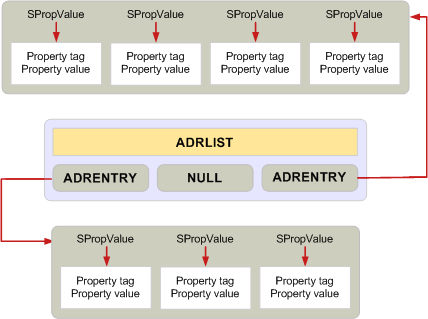

# Verwalten des Arbeitsspeichers für ADRLIST- und SRowSet-Strukturen"Managing memory for ADRLIST and SRowSet structures"

**Gilt für**: Outlook 2013 | Outlook 2016**Applies to**: Outlook 2013 | Outlook 2016 
  
Die Anforderung, bei einem einzelnen **MAPIAllocateBuffer-Aufruf** nach Möglichkeit allen Arbeitsspeicher für einen Puffer zuzuordnen, gilt nicht, wenn die Adressliste oder **ADRLIST** und zeilensatz- oder **SRowSet**-Strukturen verwendet werden.The requirement to allocate all memory for a buffer whenever possible with a single **MAPIAllocateBuffer** call does not apply when using the address list, or **ADRLIST**, and row set, or **SRowSet**, structures. 
  
Diese beiden Strukturen sind Ausnahmen von den Standardregeln für die Zuweisung und Freigabe von Arbeitsspeicher.These two structures are exceptions to the standard rules for allocating and releasing memory. Sie enthalten mehrere Ebenen von Strukturen und sollen das Hinzufügen oder Entfernen einzelner Elemente ermöglichen.They contain multiple levels of structures and are designed to enable individual members to be added or removed. Daher muss jede Eigenschaft eine separate Zuordnung sein.Therefore, each property must be a separate allocation. 

Wenn die meisten Strukturen mit einem Aufruf von **MAPIFreeBuffer** frei werden, muss jeder einzelne Eintrag in einer **ADRLIST-** oder **SRowSet-Struktur** mit einem eigenen Aufruf von **MAPIFreeBuffer** oder einem einzelnen Aufruf von **FreeProws** oder **FreePadrlist** frei werden.Where most structures are freed with one call to **MAPIFreeBuffer**, each individual entry in an **ADRLIST** or **SRowSet** structure must be freed with its own call to **MAPIFreeBuffer** or a single call to either **FreeProws** or **FreePadrlist**. Weitere Informationen finden Sie unter [MAPIFreeBuffer](mapifreebuffer.md), [ADRLIST](adrlist.md)und [SRowSet](srowset.md).For more information, see [MAPIFreeBuffer](mapifreebuffer.md), [ADRLIST](adrlist.md), and [SRowSet](srowset.md). 

**FreeProws** und **FreePadrlist** sind Funktionen, die von MAPI bereitgestellt werden, um das Freispeichern dieser Datenstrukturen zu vereinfachen.**FreeProws** and **FreePadrlist** are functions provided by MAPI for simplifying the freeing of these data structures. Weitere Informationen finden Sie unter [FreeProws](freeprows.md) und [FreePadrlist](freepadrlist.md).For more information, see [FreeProws](freeprows.md) and [FreePadrlist](freepadrlist.md). **FreePadrlist** gibt den Arbeitsspeicher für die **ADRLIST-Struktur** sowie den zugeordneten Arbeitsspeicher für die Strukturmitglieder frei. **FreeProws** führt dasselbe für die **SRowSet-Struktur** aus.**FreePadrlist** frees the memory for the **ADRLIST** structure plus all associated memory for the structure members; **FreeProws** does the same for the **SRowSet** structure. 
  
Das folgende Diagramm zeigt das Layout einer **ADRLIST-Datenstruktur,** die die erforderlichen separaten Speicherzuweisungen angibt.The following diagram shows the layout of an **ADRLIST** data structure, indicating the separate memory allocations required. In den grauen Feldern wird der Speicher angezeigt, der mit einem Aufruf zugewiesen und freigegeben werden kann.The gray boxes show memory that can be allocated and released with one call. 
  
**ADRLIST-Speicherzuweisung****ADRLIST memory allocation**
  

  
## Siehe auchSee also

- [Verwalten von Arbeitsspeicher in MAPIManaging Memory in MAPI](managing-memory-in-mapi.md)

