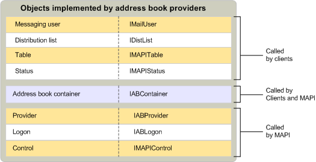

# MAPI-Address Book Anbieter-ObjektenMAPI address book provider objects
  
**Betrifft**: Outlook**Applies to**: Outlook 
  
Zusätzlich zu den standardmäßigen Provider und Logon-Objekten Implementieren von adressbuchanbietern implementierte Address Book Containern, Verteilerlisten, messaging Benutzer, Tabellen, Status-Objekten und Steuerelementen.In addition to the standard provider and logon objects, address book providers implement address book containers, distribution lists, messaging users, tables, status objects, and controls.
  
Die folgende Abbildung zeigt diese Objekte, die entsprechenden Schnittstellen und die MAPI-Komponenten, die sie verwenden.The following illustration shows these objects, their corresponding interfaces, and the MAPI components that use them.
  
![Objekte, die von adressbuchanbietern implementierte] (media/amapi_64.gif "Objekte, die von adressbuchanbietern implementierte")
  
## Siehe auchSee also

- [MAPI-DienstanbieterobjektenMAPI Service Provider Objects](mapi-service-provider-objects.md)

