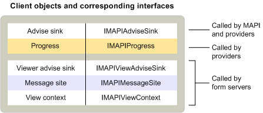

# MAPI-ClientobjekteMAPI client objects
  
**Gilt für**: Outlook 2013 | Outlook 2016**Applies to**: Outlook 2013 | Outlook 2016 
  
Standard-Messaging-Clientanwendungen implementieren nur ein Objekt – eine Ratensenke.Standard messaging client applications implement only one object — an advise sink. Ratgebersenken erben von der [IMAPIAdviseSink : IUnknown-Schnittstelle](imapiadvisesinkiunknown.md) und werden von MAPI und Dienstanbietern für ereignisbenachrichtigungen verwendet.Advise sinks inherit from the [IMAPIAdviseSink : IUnknown](imapiadvisesinkiunknown.md) interface and are used by MAPI and service providers for event notification. Einige Clients implementieren auch Statusobjekte, um die Anzeige von Statusdialogfeldern zu unterstützen.Some clients also implement progress objects to support the display of progress dialog boxes. 
  
Komplexere Clients, die benutzerdefinierte Formulare unterstützen, implementieren ein weiteres Advise Sink-Objekt und einige andere Objekte, z. B. das Nachrichtenwebsiteobjekt, das von der [IMAPIMessageSite : IUnknown-Schnittstelle](imapimessagesiteiunknown.md) erbt, und das Ansichtskontextobjekt, das von der [IMAPIViewContext : IUnknown-Schnittstelle](imapiviewcontextiunknown.md) erbt.More complex clients that support custom forms implement another advise sink object and a few other objects, such as the message site object that inherits from the [IMAPIMessageSite : IUnknown](imapimessagesiteiunknown.md) interface and the view context object that inherits from the [IMAPIViewContext : IUnknown](imapiviewcontextiunknown.md) interface. Das zusätzliche Advise Sink-Objekt erbt von der [IMAPIViewAdviseSink : IUnknown-Schnittstelle.](imapiviewadvisesinkiunknown.md)The additional advise sink object inherits from the [IMAPIViewAdviseSink : IUnknown](imapiviewadvisesinkiunknown.md) interface. 
  
In der folgenden Tabelle sind die MAPI-Objekte zusammengefasst, die von Standardnachrichtenclients und von Clients implementiert werden, die die Anzeige benutzerdefinierter Formulare unterstützen.The following table summarizes the MAPI objects implemented by standard messaging clients and by clients that support the viewing of custom forms.
  
|**Clientobjekt****Client object**|**Beschreibung****Description**|
|:-----|:-----|
|RatensenkeAdvise sink    |Stellt eine Rückruffunktion für Ereignisse im Nachrichtenspeicher, adressbuch oder in der Sitzung zur Verfügung.Provides a callback function for events that occur in the message store, address book, or the session.    |
|NachrichtenwebsiteMessage site    |Behandelt die Bearbeitung von Formularobjekten.Handles the manipulation of form objects.    |
|StatusProgress    |Zeigt ein Dialogfeld an, um den Fortschritt eines Vorgangs anzuzeigen.Displays a dialog box to show the progress of an operation.    |
|Anzeigen der RatensenkeView advise sink    |Stellt Rückruffunktionen für Ereignisse in einem Formular zur Verfügung.Provides callback functions for events that occur in a form.    |
|Kontext anzeigenView context    |Unterstützt Befehle zum Drucken und Speichern von Formularen und zum Navigieren zwischen Formularen.Supports commands for printing and saving forms and for navigating between forms.    |
   
Die folgende Abbildung zeigt die Beziehung zwischen diesen verschiedenen Clientobjekten, den Schnittstellen, von denen sie erben, und den MAPI-Komponenten, die sie verwenden.The following illustration shows the relationship between these different client objects, the interfaces from which they inherit, and the MAPI components that use them. 
  

  
Clients verwenden viel mehr Objekte als sie implementieren.Clients use many more objects than they implement. Alle Clients verwenden ein Sitzungsobjekt, um Zugriff auf eine Vielzahl von Dienstanbieterobjekten und -objekten zu erhalten, die MAPI implementiert.All clients use a session object to gain access to a wide variety of service provider objects and objects that MAPI implements. Clients interagieren mit Dienstanbietern entweder indirekt, über die Sitzung, das Adressbuch oder die von MAPI zur Verfügung stellenen Statusobjekte oder direkt über eine Vielzahl von Objekten, die von bestimmten Dienstanbietern implementiert werden.Clients interact with service providers either indirectly, through the session, the address book, or the status objects that MAPI supplies, or directly through a variety of objects that particular service providers implement. Zum direkten Kontakt mit Adressbuchanbietern verwenden Clients Adressbuchcontainer, Messagingbenutzer und Verteilerlisten.To make direct contact with address book providers, clients use address book containers, messaging users, and distribution lists. Um direkt auf einen Nachrichtenspeicheranbieter zu zugreifen, verwenden Clients das Nachrichtenspeicherobjekt, Ordner, Nachrichten und Anlagen.To access a message store provider directly, clients use the message store object, folders, messages, and attachments. Wenn Dienstanbieter ein Statusobjekt unterstützen, können Clients das Statusobjekt verwenden, um den Status des Dienstanbieters zu überwachen.When service providers support a status object, clients can use the status object to monitor the service provider's state.
  
Clients, die die Dienstanbieter- und Nachrichtendienstkonfiguration unterstützen, verwenden drei Objekte, die MAPI implementiert: das Nachrichtendienstverwaltungsobjekt, das Profilverwaltungsobjekt und das Anbieterverwaltungsobjekt.Clients that support service provider and message service configuration use three objects that MAPI implements: the message service administration object, profile administration object, and provider administration object. Clients, die benutzerdefinierte Formulare anzeigen, verwenden mehrere Formularobjekte, die von einem Formularbibliotheksanbieter oder einem Formularserver implementiert werden.Clients that display custom forms use several form objects that a form library provider or a form server implements.
  
## Siehe auchSee also

- [IMAPIMessageSite : IUnknownIMAPIMessageSite : IUnknown](imapimessagesiteiunknown.md) 
- [IMAPIViewContext : IUnknownIMAPIViewContext : IUnknown](imapiviewcontextiunknown.md)  
- [IMAPIViewAdviseSink : IUnknownIMAPIViewAdviseSink : IUnknown](imapiviewadvisesinkiunknown.md)
- [Übersicht über das MAPI-Objekt und die SchnittstelleMAPI Object and Interface Overview](mapi-object-and-interface-overview.md)

