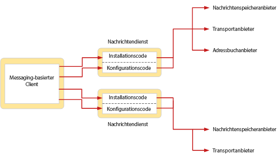

# Übersicht über den MAPI-Nachrichtendienst
  
**Gilt für**: Outlook 2013 | Outlook 2016 
  
Ein Nachrichtendienst definiert eine Gruppe von verwandten Dienstanbietern, in der Regel Dienstanbieter, die mit dem gleichen Messagingsystem arbeiten. Während Dienstanbieter die Kommunikation zwischen Messagingsystemen und dem MAPI-Subsystem ausführen, stellen Nachrichtendienste die Schnittstelle zwischen dem Benutzer und Dienstanbietern dar, die ein gemeinsames Messagingsystem verwenden.  
  
Nachrichtendienste dienen dazu, die Installation und Konfiguration der Dienstanbieter für Benutzer zu vereinfachen. Benutzer installieren oder konfigurieren Dienstanbieter nie direkt. Der Nachrichtendienst übernimmt die vollständige Installation und Konfiguration der einzelnen Dienstanbieter, die zu dem Dienst gehören. Aufgrund dieses Features müssen Benutzer nicht mit bestimmten Konfigurationsanforderungen der Dienstanbieter vertraut sein. 
  
Die folgende Abbildung zeigt die Beziehung zwischen einer messagingbasierten Clientanwendung und zwei Nachrichtendiensten.
  
**Installation und Konfiguration eines Nachrichtendiensts**
  

  
Der Benutzer ruft den Installationscode der einzelnen Nachrichtendienste auf, um den Dienst und die zugehörigen Dienstanbieter zu einem Profil hinzuzufügen. In einem der in der Abbildung dargestellten Nachrichtendienste gibt es drei Dienstanbieter, im anderen Nachrichtendienst zwei Dienstanbieter. Zu einem späteren Zeitpunkt nach der Installation, in der Regel bei der Anmeldung, werden die Dienstanbieter in den jeweiligen Nachrichtendiensten konfiguriert. Der Konfigurationscode in jedem Nachrichtendienst behandelt die Konfiguration der Anbieter in dem Dienst.
  
Bei der Installation eines Nachrichtendiensts kopiert dessen Installationsprogramm die notwendigen Dateien aus der Installationsquelle auf die lokale Festplatte des Benutzers und aktualisiert eine Konfigurationsdatei namens „Mapisvc.inf“. Die Datei „Mapisvc.inf“ enthält Konfigurationseinstellungen für alle Nachrichtendienste und Dienstanbieter, die auf dem Computer installiert werden können. Sie ist in hierarchischen Abschnitten mit Links zwischen den einzelnen Abschnitten auf jeder Ebene strukturiert. Der Abschnitt auf der obersten Ebene enthält Informationen, die für das MAPI-Subsystem relevant sind, z. B. eine Liste aller verfügbaren Nachrichtendienste, und zur Installation der Onlinehilfe. Die nächste Ebene enthält Abschnitte für jeden Nachrichtendienst, mit Informationen wie dem Namen der DLL-Datei des Nachrichtendiensts und dem Namen der Einstiegspunktfunktion der Konfiguration. Die dritte Ebene enthält Abschnitte mit Konfigurationsdaten für jeden Dienstanbieter im Nachrichtendienst. 
  
Für die Behandlung der Konfiguration implementiert ein Nachrichtendienst eine Einstiegspunktfunktion, die mit einem von MAPI definierten Prototyp kompatibel ist, und ein Dialogfeld im Registerkartenformat, das als Eigenschaftenblatt bezeichnet wird. MAPI ruft die Einstiegspunktfunktion auf, um Clientanfragen zu bedienen, die sich auf die Profilverwaltung und die Verwaltung von Dienstanbietern im Nachrichtendienst beziehen. Eigenschaftenblätter dienen zum Anzeigen und Ändern von Konfigurationseigenschaften von Nachrichtendiensten und Dienstanbietern. 
  
## Siehe auch

- [MAPI-Features und -Architektur](mapi-features-and-architecture.md)

