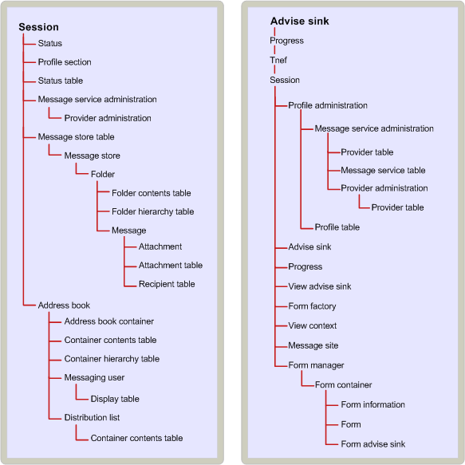

# HIERARCHIE DER MAPI-Objekteinschluss
  
**Gilt für**: Outlook 2013 | Outlook 2016 
  
Die Aufnahmebeziehung zwischen Objekten gibt die Abhängigkeiten an, die einige Objekte für den Zugriff auf andere Objekte haben. Bei einer Clientanwendung ermöglicht der Zugriff auf bestimmte Objekte den Zugriff auf andere Objekte. In einigen Fällen folgt die Aufnahmebeziehung zwischen Objekten, die von einem Dienstanbieter implementiert werden, einer logischen Hierarchie. In anderen Fällen ist dies beliebig. 
  
Ein Client muss Zugriff auf ein MAPI-Sitzungsobjekt erhalten, bevor er viele andere Objekte verwenden kann (z. B. Dienstanbieter und das MAPI-Adressbuch).
  
Das Nachrichtenspeicher-Containment basiert auf der hierarchischen Beziehung zwischen Objekten im Nachrichtenspeicher: dem Nachrichtenspeicherobjekt selbst, Ordnern, Nachrichten und Anlagen. Logischerweise sind Anlagen in Nachrichten, Nachrichten in Ordnern und Ordnern im Nachrichtenspeicher enthalten. Die Aufnahmebeziehung entspricht dieser logischen Hierarchie. Um z. B. Zugriff auf eine Nachricht zu erhalten, muss ein Client zuerst auf den Ordner zugreifen, in dem die Nachricht enthalten ist. Profile und Statusobjekte sind Beispiele für eine willkürlichere Aufnahmebeziehung. Beide Objekte sind über die Sitzung verfügbar. 
  
Bei einigen Objekten bieten Container den einzigen Zugriff. Anlagen und Empfänger sind Beispiele für Objekte, die vollständig von ihren Containern abhängig sind. Der einzige Zugriff auf eine Anlage oder einen Empfänger erfolgt über die Nachricht, zu der sie gehört. Andere Objekte haben alternative Zugriffspfade. Diesen Objekten werden binäre Bezeichner, die als Eintragsbezeichner bezeichnet werden, von den Dienstanbietern zugewiesen, die sie erstellen. Eintragsbezeichner können verwendet werden, um direkt auf ihre Objekte zuzugreifen, sodass Clients die Aufnahmestruktur umgehen können. 
  
Die folgende Abbildung zeigt die MAPI-Aufnahmehierarchie. Die Sitzung befindet sich oben in der Struktur, da ein Client über die Sitzung Zugriff auf alle anderen Objekte erhält. Die nächste Ebene umfasst die Nachrichtenspeichertabelle, ein Tabellenobjekt, das Eigenschaften für alle Nachrichtenspeicheranbieter in der aktuellen Sitzung auflistet, und das Adressbuch, um Zugriff auf alle Adressbuchanbieter zu gewähren. Die Tabelle und das Adressbuch des Nachrichtenspeichers werden verwendet, um auf die objekte zuzugreifen, die von bestimmten Dienstanbietern implementiert werden, die als Nächstes in der Einschlussreihenfolge angezeigt werden.
  
**MAPI-Einschlusshierarchie**
  

  
## Siehe auch

- [Übersicht über MAPI-Objekt und -Schnittstelle](mapi-object-and-interface-overview.md)

