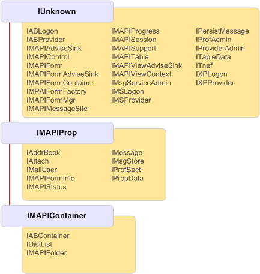

# MAPI-ObjektvererbungshierarchieMAPI object inheritance hierarchy

**Betrifft**: Outlook**Applies to**: Outlook 
  
Alle von MAPI-Objekten implementiert Schnittstellen erben letztlich von [IUnknown](http://msdn.microsoft.com/library/33f1d79a-33fc-4ce5-a372-e08bda378332%28Office.15%29.aspx), die OLE-Schnittstelle, mit dem Objekte kommunizieren kann.All interfaces implemented by MAPI objects ultimately inherit from [IUnknown](http://msdn.microsoft.com/library/33f1d79a-33fc-4ce5-a372-e08bda378332%28Office.15%29.aspx), the OLE interface that enables objects to communicate. Die meisten Schnittstellen erben direkt von **IUnknown**, aber einige von einer von zwei anderen Basiskalender Schnittstellen erbt: [IMAPIProp: IUnknown](imapipropiunknown.md) oder [IMAPIContainer: IMAPIProp](imapicontainerimapiprop.md).Most interfaces directly inherit from **IUnknown**, but some inherit from one of two other base interfaces: [IMAPIProp : IUnknown](imapipropiunknown.md) or [IMAPIContainer : IMAPIProp](imapicontainerimapiprop.md). Die folgende Abbildung zeigt die vollständige Vererbungshierarchie in MAPI.The following illustration shows the complete inheritance hierarchy in MAPI.
  
**MAPI-Vererbungshierarchie****MAPI inheritance hierarchy**
  
![MAPI-Vererbungshierarchie] (media/amapi_06.gif "MAPI-Vererbungshierarchie")
  
## Siehe auchSee also

- [IMAPIProp: IUnknownIMAPIProp : IUnknown](imapipropiunknown.md) 
- [IMAPIContainer: IMAPIPropIMAPIContainer : IMAPIProp](imapicontainerimapiprop.md)
- [MAPI-Objekt und Übersicht über die BenutzeroberflächeMAPI Object and Interface Overview](mapi-object-and-interface-overview.md)

