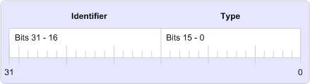

# MAPI-EigenschaftentagsMAPI property tags
  
**Betrifft**: Outlook**Applies to**: Outlook 
  
Ein Eigenschaftentag ist eine 32-Bit-Zahl mit dem eindeutigen Bezeichner für eine in Bits 16 bis 31 und einen Eigenschaftentyp in Bits 0 bis 15, wie in der folgenden Abbildung dargestellt.A property tag is a 32-bit number that contains a unique property identifier in bits 16 through 31 and a property type in bits 0 through 15 as shown in the following illustration. 
  
**Eigenschaftentags****Property tag elements**
  
![Eigenschaftentags] (media/amapi_10.gif "Eigenschaftentags")
  
Eigenschaftentags dienen zum Identifizieren der MAPI-Eigenschaften und hat jede Eigenschaft, unabhängig davon, ob die Eigenschaft durch MAPI, einen Client oder einem Dienstanbieter definiert ist.Property tags are used to identify MAPI properties and every property must have one, regardless of whether the property is defined by MAPI, a client, or a service provider. MAPI definiert eine Reihe von Konstanten für Tag-Eigenschaft für seine Eigenschaften in der Headerdatei Mapitags.h. Diese Eigenschaften werden als "MAPI-definierte Eigenschaften" bezeichnet.MAPI defines a set of property tag constants for its properties in the Mapitags.h header file; these properties are referred to as the "MAPI-defined properties". 
  
Konstanten für die Tag-Eigenschaft der Namenskonvention für Konsistenz und Bedienung.The property tag constants follow a naming convention for consistency and ease of use. Es gibt zwei Webparts auf den Namen der einzelnen Eigenschafts-Tag: ein Präfix PR_ und eine oder mehrere Zeichenfolgen, die die Inhalte der Eigenschaft beschreiben.There are two parts to the name of each property tag: a PR_ prefix and one or more character strings that describe the contents of the property. Mehrere Zeichenfolgen werden durch Unterstriche getrennt.Multiple character strings are separated by underscores. Beispielsweise ist das Eigenschafts-Tag für den Adresstyp der Empfänger einer Nachricht **PR\_ADDRTYPE** ([PidTagOrgAddrtype](http://msdn.microsoft.com/library/d40b5707-e4d5-4746-88d4-8616a3789789%28Office.15%29.aspx)) und die Eintrags-ID für den Ordner festgelegt, von der eine Kopie aller ausgehenden Nachrichten erhalten ist **PR_IPM_SENTMAIL_ ENTRYID** ([PidTagIpmSentMailEntryId](pidtagipmsentmailentryid-canonical-property.md)).For example, the property tag for the address type of a message recipient is **PR\_ADDRTYPE** ([PidTagOrgAddrtype](http://msdn.microsoft.com/library/d40b5707-e4d5-4746-88d4-8616a3789789%28Office.15%29.aspx)) and the entry identifier for the folder designated to receive a copy of every outbound message is **PR_IPM_SENTMAIL_ENTRYID** ([PidTagIpmSentMailEntryId](pidtagipmsentmailentryid-canonical-property.md)).
  
Einige Makros stehen zum Eigenschaftentags zwischen diesen [PROP_TYPE](prop_type.md), [eigensch_id](prop_id.md)und [PROP_TAG](prop_tag.md)entwickelt.A few macros are available to help work with property tags, among them [PROP_TYPE](prop_type.md), [PROP_ID](prop_id.md), and [PROP_TAG](prop_tag.md). **Eigenschaft\_Typ** extrahiert den Eigenschaftentyp aus das Eigenschafts-Tag **Eigenschaft\_ID** extrahiert den Bezeichner.**PROP\_TYPE** extracts the property type from the property tag; **PROP\_ID** extracts the identifier. **PROP_TAG** erstellt ein Eigenschaftentag über einen Eigenschaftentyp und Bezeichner.**PROP_TAG** builds a property tag from a property type and identifier. 
  
## Siehe auchSee also

- [�bersicht �ber die MAPI-EigenschaftMAPI Property Overview](mapi-property-overview.md)

