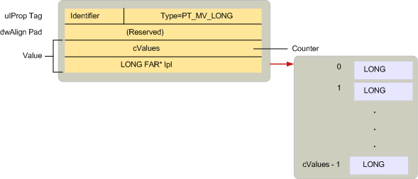

# Übersicht über die MAPI-EigenschaftstypenMAPI property type overview
  
**Gilt für**: Outlook 2013 | Outlook 2016**Applies to**: Outlook 2013 | Outlook 2016 
  
Eigenschaftstypen sind Konstanten, die von MAPI in der MAPIDEFS definiert werden. H-Headerdatei, die den zugrunde liegenden Datentyp eines Eigenschaftswerts angibt.Property types are constants defined by MAPI in the MAPIDEFS.H header file that indicate the underlying data type of a property value. Alle Eigenschaften, unabhängig davon, ob Sie von MAPI, von Clientanwendungen oder von Dienstanbietern definiert werden, verwenden einen dieser Typen.All properties, whether they are defined by MAPI, by client applications, or by service providers, use one of these types. 
  
Eigenschaftstypen Folgen einer ähnlichen Benennungskonvention wie die für Eigenschaftstags.Property types follow a similar naming convention to the one used for property tags. Viele Eigenschaftstypen verfügen über eine Einzel-und eine mehrwertige Version.Many property types have both a single-value and multiple-value version. Einzelne Werte Eigenschaften enthalten einen Wert des Typs, beispielsweise eine einzelne ganze Zahl oder Zeichenfolge.Single valued properties contain one value of its type such as a single integer or character string. Die zur Darstellung einer einzelnen Value-Eigenschaft verwendete Konstante besteht aus zwei Teilen: dem Präfix PT_ und einer Zeichenfolge, die den tatsächlichen Typ beschreibt, beispielsweise LONG oder STRING8.The constant used to represent a single value property has two parts: the prefix PT_ and a string describing the actual type, such as LONG or STRING8. 
  
Mehrwertige Eigenschaften enthalten mehr als einen Wert des Typs.Multiple-value properties contain more than one value of its type. Im Gegensatz zu OLE-Variant-Arrays hat jeder Wert in einer mehrwertigen Eigenschaft denselben Typ.Unlike OLE variant arrays, every value in a multivalued property is of the same type. Die zur Darstellung von mehrwertigen Eigenschaften verwendete Konstante wird erstellt, indem das MV_FLAG-Flag mit der entsprechenden Einzel wertkonstante kombiniert wird, die den Basistyp darstellt.The constant used to represent multivalued properties is created by combining the MV_FLAG flag with the corresponding single value constant representing the base type. Es gibt drei Teile: das Präfix PT_ gefolgt von MV_ gefolgt von einer Zeichenfolge, die den Typ beschreibt.There are three parts: the prefix PT_ followed by MV_ followed by a string that describes the type. Beispielsweise ist der Typ für eine Eigenschaft, die mehrere ganze Zahlen enthält, PT_MV_LONG und für mehrere Zeichenfolgen PT_MV_STRING8.For example, the type for a property containing multiple integers is PT_MV_LONG and for multiple character strings is PT_MV_STRING8.
  
Die folgende Abbildung zeigt die Struktur einer [SPropValue](spropvalue.md) -Struktur zur Beschreibung einer mehrwertigen Ganzzahl, einer Eigenschaft vom Typ PT_MV_LONG.The following illustration shows the structure of an [SPropValue](spropvalue.md) structure to describe a multiple-value integer, a property of type PT_MV_LONG. Der **Wert** Member wird erweitert, um die Anzahl der ganzzahligen Werte in der Eigenschaft und einen Zeiger auf ein Array dieser Werte einzuschließen.The **Value** member is expanded to include a count of the number of integer values in the property and a pointer to an array of those values. 
  
**Eigenschaften mit mehreren Werten****Multiple-value properties**
  
![Mehr] wertige Eigenschaften (media/amapi_12.gif "Mehr") wertige Eigenschaften
  
Obwohl die Unterstützung für Eigenschaften mit mehreren Werten optional ist, empfiehlt MAPI, dass Clients und Dienstanbieter beide Arten von Eigenschaften unterstützen, da dadurch eine bessere Interaktion zwischen MAPI-kompatiblen Komponenten ermöglicht wird.Although support for multiple-value properties is optional, MAPI recommends that clients and service providers support both types of properties because doing so enables greater interaction between MAPI-compliant components.
  
In der folgenden Abbildung sind alle verschiedenen Eigenschaftentyp Konstanten aufgeführt, die zeigen, wo Sie in einer **SPropValue** -Struktur gespeichert sind.The following illustration lists all of the different property type constants, showing where they are stored in an **SPropValue** structure. Die Größe des **value** -Elements hängt vom jeweiligen Typ ab.The size of the **Value** member is dependent on the particular type. Beachten Sie, dass nicht alle einwertigen Typen mehrwertige äquivalente aufweisen.Notice that not all of the single-value types have multiple-value equivalents. 
  
**Eigenschaftstypenkonstanten****Property type constants**
  
![Eigenschaftentyp Konstanten] (media/amapi_11.gif "Eigenschaftentyp Konstanten")
  
Clients und Dienstanbieter, die mit einer Eigenschaft arbeiten, müssen zwei Schritte ausführen:Clients and service providers working with a property need to follow two steps:
  
1. Bestimmen Sie, ob die Eigenschaft verfügbar oder nicht verfügbar ist.Determine if the property is available or unavailable.
    
2. Wenn verfügbar, rufen Sie den Wert der Eigenschaft ab.If available, retrieve the property's value.
    
Manchmal muss ein Client oder Dienstanbieter nur überprüfen, ob eine Eigenschaft vorhanden ist; Manchmal ist es erforderlich, einen bestimmten Wert zu überprüfen.Sometimes a client or service provider need only check for the existence of a property; other times it is necessary to check for a specific value. Transportanbieter haben beispielsweise drei verschiedene Vorgehensweisen für die Verarbeitung **der\_PR-SEND_RICH_INFO** ([pidtagsendrichinfo (](pidtagsendrichinfo-canonical-property.md))-Eigenschaft, einen booleschen Wert, der angibt, ob eine Nachricht mit formatierter Text.For example, transport providers have three different courses of action for processing the **PR\_SEND_RICH_INFO** ([PidTagSendRichInfo](pidtagsendrichinfo-canonical-property.md)) property, a Boolean value that indicates whether or not a message should be transmitted with formatted text. Wenn **PR\_SEND_RICH_INFO** auf true festgelegt ist, übermittelt der Transportanbieter den formatierten Text.If **PR\_SEND_RICH_INFO** is set to TRUE, the transport provider transmits the formatted text. Wenn Sie auf FALSE festgelegt ist, wird der formatierte Text vor der Übertragung verworfen.If it is set to FALSE, the formatted text is discarded before transmission. Wenn **PR_SEND_RICH_INFO** nicht verfügbar ist, folgt der Transportanbieter seiner standardmäßigen Vorgehensweise, was auch immer für den jeweiligen Anbieter gilt.If **PR_SEND_RICH_INFO** is unavailable, the transport provider follows its default course of action, whatever that is for the particular provider. 
  
MAPI definiert einen speziellen Eigenschaftentyp, PT_UNSPECIFIED, der von einem Client oder Dienstanbieter zum Abrufen einer Eigenschaft verwendet werden kann, wenn der Eigenschaftentyp unbekannt ist. Um eine Eigenschaft ohne Vorkenntnisse des Typs abzurufen, Ruft ein Client oder Dienstanbieter die [IMAPIProp::](imapiprop-getprops.md) GetProps-Methode eines Objekts auf und übergibt ein Eigenschaftentag, das aus dem Bezeichner der Eigenschaft und dem PT_UNSPECIFIED-Eigenschaftentyp besteht.MAPI defines a special property type, PT_UNSPECIFIED, that a client or service provider can use to retrieve a property when the property type is unknown.To retrieve a property without advance knowledge of its type, a client or service provider calls an object's [IMAPIProp::GetProps](imapiprop-getprops.md) method and passes a property tag made up of the property's identifier and the PT_UNSPECIFIED property type. \*\*\*\* GetProps gibt eine [SPropValue](spropvalue.md) -Struktur für die Eigenschaft zurück, die PT_UNSPECIFIED durch den entsprechenden Typ ersetzt.**GetProps** returns an [SPropValue](spropvalue.md) structure for the property, replacing PT_UNSPECIFIED with the appropriate type. Dienstanbieter, \*\*\*\* die GetProps implementieren, sind zur Unterstützung von PT_UNSPECIFIED erforderlich.Service providers implementing **GetProps** are required to support PT_UNSPECIFIED. 
  
Einige MAPI-Objekte unterstützen Eigenschaften, die selbst Objekte sind.Some MAPI objects support properties that are themselves objects. Objekteigenschaften haben den Typ PT_OBJECT.Object properties have the type PT_OBJECT. Statt **IMAPIProp::** GetProps für den Zugriff auf diese Eigenschaften zu verwenden, werden Clients und Dienstanbieter in der Regel entweder die [IMAPIProp:: OpenProperty](imapiprop-openproperty.md) -Methode, die die entsprechende Schnittstelle für Access oder eine Methode für das Objekt angibt. unterstützen der Eigenschaft.Instead of using **IMAPIProp::GetProps** to access these properties, clients and service providers typically user either the [IMAPIProp::OpenProperty](imapiprop-openproperty.md) method, specifying the appropriate interface for access, or a method on the object supporting the property. 
  
Da der Zugriff auf den Wert einer Objekteigenschaft die Verwendung einer der Schnittstellen für das Objekt \*\*\*\* beinhaltet, ist GetProps unangemessen.Because accessing the value of an object property involves using one of the interfaces for the object, **GetProps** is inappropriate. Mit \*\*\*\* GetProps greift der Aufrufer über eine **SPropValue** -Struktur auf den Wert einer Eigenschaft zu.With **GetProps**, the caller accesses a property's value through an **SPropValue** structure. Mit **IMAPIProp:: OpenProperty**ruft der Aufrufer einen Zeiger auf eine Schnittstelle ab, die auf das Objekt zugreifen kann.With **IMAPIProp::OpenProperty**, the caller retrieves a pointer to an interface that can access the object. **OpenProperty** kann immer verwendet werden, um eine Objekteigenschaft abzurufen.**OpenProperty** can always be used to retrieve an object property. Die andere Option, die eine Methode für das Objekt aufruft, ist bei jeder Objekteigenschaft nicht verfügbar.The other option, calling a method on the object, is not available with every object property. 
  
Jeder Ordner unterstützt beispielsweise zwei Tabellen, eine Hierarchietabelle und eine Inhaltstabelle.For example, every folder supports two tables, a hierarchy table and a contents table. Diese Tabellen sind Eigenschaften des Ordners; Ihre Eigenschaftstags sind **PR_CONTAINER_HIERARCHY** ([Pidtagcontainerhierarchy (](pidtagcontainerhierarchy-canonical-property.md)) und **PR_CONTAINER_CONTENTS** ([pidtagcontainercontents (](pidtagcontainercontents-canonical-property.md)).These tables are properties of the folder; their property tags are **PR_CONTAINER_HIERARCHY** ([PidTagContainerHierarchy](pidtagcontainerhierarchy-canonical-property.md)) and **PR_CONTAINER_CONTENTS** ([PidTagContainerContents](pidtagcontainercontents-canonical-property.md)). Tabellen sind Objekte, die die **IMAPITable** -Schnittstelle für den Zugriff erfordern.Tables are objects that require the **IMAPITable** interface for access. Ein Client kann die [IMAPIContainer:: GetHierarchy](imapicontainer-gethierarchytable.md) -Methode des Ordners aufrufen, um auf die Hierarchietabelle zuzugreifen, die [IMAPIContainer::](imapicontainer-getcontentstable.md) getcontentable-Methode des Ordners für den Zugriff auf die Inhaltstabelle oder die [IMAPIProp:: OpenProperty des Ordners. ](imapiprop-openproperty.md)Methode für den Zugriff auf eine Tabelle.A client can call the folder's [IMAPIContainer::GetHierarchyTable](imapicontainer-gethierarchytable.md) method to access the hierarchy table, the folder's [IMAPIContainer::GetContentsTable](imapicontainer-getcontentstable.md) method to access the contents table, or the folder's [IMAPIProp::OpenProperty](imapiprop-openproperty.md) method to access either table. Um **OpenProperty**aufzurufen, übergibt ein Client das Property-Tag für die Eigenschaft als ersten Parameter und einen Schnittstellenbezeichner für die Schnittstelle, die für Access als zweiten Parameter verwendet werden soll.To call **OpenProperty**, a client passes the property tag for the property as the first parameter and an interface identifier for the interface to be used for access as the second parameter. Diese Parameter sind **PR_CONTAINER_HIERARCHY** oder **PR_CONTAINER_CONTENTS** und **IID_IMAPITable**.These parameters would be **PR_CONTAINER_HIERARCHY** or **PR_CONTAINER_CONTENTS** and **IID_IMAPITable**.
  
Eine vollständige Liste der Eigenschaftentypen mit einem oder mehreren Werten finden Sie unter [Property Types](property-types.md).For a complete list of the single-value and multiple-value property types, see [Property Types](property-types.md). 
  
## Siehe auchSee also

- [Übersicht über die MAPI-EigenschaftMAPI Property Overview](mapi-property-overview.md)

