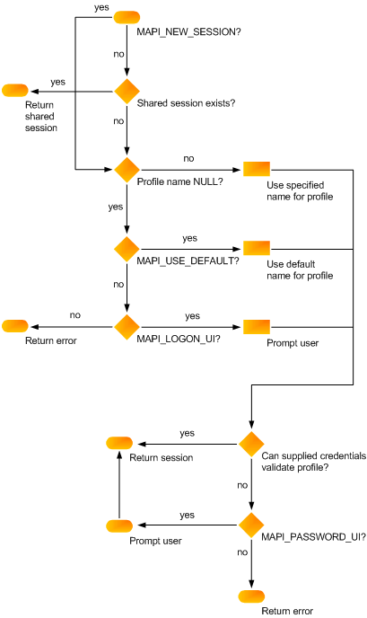

# MAPI-SitzungenMAPI sessions

**Gilt für**: Outlook 2013 | Outlook 2016**Applies to**: Outlook 2013 | Outlook 2016 
  
Bevor der Clientanwendung aus eine zugrunde liegenden messaging-System aufrufen kann, m�ssen sie eine Sitzung oder bei einer Verbindung mit der MAPI-Subsystems einrichten.Before the client application can call an underlying messaging system, it must establish a session, or connection, with the MAPI subsystem.
  
Sessions are initiated when a user logs on, a process that accesses a valid profile and validates the messaging system and the message service credentials. Then, the process ensures that all of the profile's message services are correctly configured. The client interface you use determines the logon call. MAPI clients call the [MAPILogonEx](mapilogonex.md) function.Sessions are initiated when a user logs on, a process that accesses a valid profile and validates the messaging system and the message service credentials. Then, the process ensures that all of the profile's message services are correctly configured. The client interface you use determines the logon call. MAPI clients call the [MAPILogonEx](mapilogonex.md) function. 
  
Die Nachrichtendienst Konfiguration ist einer der wichtigsten Teile des Anmeldevorgangs.Message service configuration is one of the most important parts of the logon process. Das Profil ist die erste Quelle für Konfigurationsinformationen.The profile is the initial source for configuration information. Wenn Informationen für einen bestimmten Nachrichtendienst fehlen, versucht der Anmeldeprozess, den Benutzer aufzufordern, ihn bereitzustellen.If information for a particular message service is missing, the logon process tries to prompt the user to supply it. Dies ist aus zwei Gründen nicht immer erfolgreich: Erstens erfordert die Bestätigung des Benutzers, dass ein Dialogfeld angezeigt wird.This is not always successful for two reasons: First, prompting the user requires the display of a dialog box. Clients können die Anzeige einer Benutzeroberfläche nicht zulassen, indem Sie eine Kennzeichnung an den Anmelde Anruf übergeben.It is possible for clients to disallow the display of a user interface by passing a flag into the logon call. Zweitens könnte der Benutzer das Dialogfeld abbrechen, bevor die benötigten Informationen hinzugefügt werden können.Second, the user could cancel the dialog box before the needed information can be added.
  
Wenn ein Anmeldevorgang einmal fehlschlägt, wird der Benutzer über den Fehler informiert und hat die Möglichkeit, den Fehler zu wiederholen oder zu korrigieren.When a logon process fails one time, the user is informed of the failure and given the chance to retry or correct the error condition. Erneut wird eine Benutzeroberfläche angezeigt, wenn der Client dies zulässt, und der Benutzer wird aufgefordert, alle fehlenden Daten einzugeben.Once again, a user interface will be displayed, if the client allows it, and the user will be prompted to enter whatever data is missing. Wenn dieser zweite Versuch nicht erfolgreich ist, deaktiviert MAPI alle Dienstanbieter im Nachrichtendienst für die Dauer der Sitzung.If this second try is unsuccessful, MAPI disables all service providers in the message service for the duration of the session. Der gesamte Nachrichtendienst ist tatsächlich deaktiviert.In effect, the whole message service is disabled. Dies führt dazu, dass keiner der Dienstanbieter im Nachrichtendienst funktionieren kann.This means that none of the service providers in the message service can work. Der Grund dafür ist, dass bei einem Ausfall eines Anbieters bei der Anmeldung die anderen Anbieter in der Regel auch fehlschlagen.This is done because if one provider fails logon, the other providers usually also fail. Der Anmeldeprozess kann aufgrund eines ungültigen Pfads für eine erforderliche Ressource, einer inkompatiblen MAPI-Version, eines nicht verfügbaren Messaging Servers oder einer Datenbeschädigung fehlschlagen.The logon process can fail due to an invalid path for a necessary resource, an incompatible version of MAPI, an unavailable messaging server, or data corruption. 
  
Clients können einen von zwei Sitzungstypen angeben, die im Anmelde Anruf festgelegt werden sollen: eine einzelne Sitzung oder eine freigegebene Sitzung.Clients can specify one of two types of sessions to be established in the logon call: an individual session or a shared session. Einzelne Sitzungen sind private Verbindungen; zwischen einer Clientanwendung und der verwendeten Sitzung besteht eine 1:1-Beziehung.Individual sessions are private connections; there is a one-to-one relationship between a client application and the session it is using. Clientanwendungen, die eine Sitzung gemeinsam nutzen, können daher auch ein Profil verwenden.As a consequence, client applications that share a session also share a profile. FreigeGebene Sitzungen werden einmalig eingerichtet, können jedoch von anderen Clientanwendungen verwendet werden, die Sie verwenden müssen.Shared sessions are established once but can be used by other client applications that need to use them. Das Profil und die Anmeldeinformationen werden nur bei der erstmaligen Anmeldung angegeben.The profile and credentials are specified only with the initial logon. 
  
Clients können sich mehrmals als derselbe Benutzer oder mehrere Benutzer anmelden.Clients can log on multiple times as the same user or as multiple users. Dies wird durch MAPI nicht verhindert.MAPI does not prevent this. Einige Dienstanbieter sind jedoch möglicherweise nicht so flexibel, und der Fehlerwert MAPI_E_SESSION_LIMIT wird bei nachfolgenden Anmeldeversuchen zurückgegeben.Some service providers, however, might not be as flexible, returning the error value MAPI_E_SESSION_LIMIT on subsequent logon attempts. Dienstanbieter mit zugrunde liegenden Hardwareeinschränkungen können zum Erzwingen eines Sitzungslimits erforderlich sein.Service providers with underlying hardware limitations can be required to enforce a session limit.
  
Die Funktionsaufrufe zum Einrichten einer Sitzung haben eine Auflistung von Flags und Parametern, die Steuern, wie die Sitzung erstellt wird.The function calls for establishing a session have a collection of flags and parameters that control how the session is created. Der Client gibt einen optionalen Profilnamen und ein Fensterhandle an, das als übergeordnetes Fenster für alle angezeigten Dialogfelder fungiert.The client specifies an optional profile name and a window handle that acts as the parent window for any dialog boxes that are displayed. Zu den Flags gehört MAPI_NEW_SESSION, das eine neue, einzelne Sitzung (anstelle einer freigegebenen Sitzung) und das MAPI_LOGON_UI-Benutzeroberflächen Kennzeichen anfordert.The flags include MAPI_NEW_SESSION, which requests that a new, individual session (rather than a shared session) be established, and the MAPI_LOGON_UI user interface flag. Das Benutzeroberflächen Kennzeichen ist so festgelegt, dass ein Anmeldedialogfeld angefordert wird.The user interface flag is set to request a logon dialog box.
  
In der folgenden Abbildung wird gezeigt, wie diese verschiedenen Parameter und Flags eine MAPI-Sitzung herstellen.The following illustration shows how these various parameters and flags establish a MAPI session.
  
**Flussdiagramm für MAPI-Sitzung****MAPI session flowchart**
  
![MAPI-Sitzungs Flussdiagramm] (media/amapi_47.gif "MAPI-Sitzungs Flussdiagramm")
  
Informationen zur Behandlung von Sitzungen innerhalb einer Clientanwendung finden Sie unter [MAPI-Sitzungs Verarbeitung](mapi-session-handling.md)For information about handling sessions from within a client application, see [MAPI Session Handling](mapi-session-handling.md)
  
## Siehe auchSee also

- [MAPILogonExMAPILogonEx](mapilogonex.md)  
- [IMAPISession : IUnknownIMAPISession : IUnknown](imapisessioniunknown.md)
- [MAPI-Sitzungs VerarbeitungMAPI Session Handling](mapi-session-handling.md)  
- [�bersicht �ber die MAPI-ProgrammierungMAPI Programming Overview](mapi-programming-overview.md)

