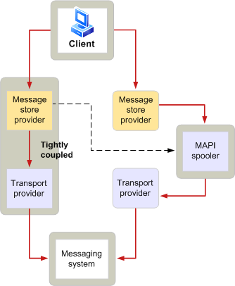

# MAPI-Spooler-Übersicht
  
**Gilt für**: Outlook 2013 | Outlook 2016 
  
DER MAPI-Spooler ist eine Funktion des Microsoft Office Outlook, der für das Senden von Nachrichten an und den Empfang von Nachrichten von einem Messagingsystem zuständig ist. Der MAPI-Spooler spielt eine wichtige Rolle bei der Nachrichtenbestätigung und -zustellung. Wenn ein Messagingsystem nicht verfügbar ist, speichert der MAPI-Spooler die Nachrichten und gibt sie zu einem späteren Zeitpunkt automatisch weiter. Diese Möglichkeit, Daten bei Bedarf zu speichern oder zu senden, wird als Speicher und Weiterleitung bezeichnet. Dies ist ein entscheidendes Feature in Umgebungen, in denen Remoteverbindungen häufig verwendet werden und der Netzwerkdatenverkehr hoch ist. DER MAPI-Spooler wird als Hintergrundthread innerhalb Outlook.
  
Der MAPI-Spooler hat zusätzliche Verantwortlichkeiten im Zusammenhang mit der Nachrichtenverteilung. Diese zusätzlichen Aufgaben umfassen Folgendes:
  
- Nachverfolgen der Empfängertypen, die von bestimmten Transportanbietern verarbeitet werden.
    
- Informieren einer Clientanwendung, wenn eine neue Nachricht zugestellt wurde.
    
- Aufrufen der Nachrichtenvorverarbeitung und nach der Verarbeitung.
    
- Generieren von Berichten, die angeben, dass die Nachrichtenzustellung erfolgt ist.
    
- Beibehalten des Status für verarbeitete Empfänger.
    
Die folgende Abbildung zeigt auf einer hohen Ebene, wie eine Nachricht von einem Client zum Messagingsystem fließt.
  
**Flussdiagramm für ausgehende Nachrichten**
  

  
Der Benutzer einer Clientanwendung sendet eine Nachricht an einen oder mehrere Empfänger. Der Nachrichtenspeicheranbieter initiiert den Sendevorgang und formatiert die Nachricht mit zusätzlichen Informationen, die für die Übertragung erforderlich sind.
  
Der MAPI-Spooler empfängt die Zu verarbeitende Nachricht, wenn eine der folgenden Bedingungen auftritt:
  
- Der Nachrichtenspeicheranbieter ist nicht eng mit einem Transportanbieter gekoppelt.
    
- Die Nachricht erfordert eine Vorverarbeitung.
    
- Der Nachrichtenspeicher und der Transportanbieter sind eng gekoppelt, können jedoch nicht alle Empfänger behandeln, an die die Nachricht adressiert wird.
    
Wenn der MAPI-Spooler die Nachricht empfängt, führt er alle erforderlichen Vorverarbeitungen durch und übermittelt die Nachricht an den entsprechenden Transportanbieter. Der Transportanbieter gibt die Nachricht an sein Messagingsystem weiter, das sie an den beabsichtigten Empfänger sendet.
  
Bei eingehenden Nachrichten wird der Fluss umgekehrt. Der Transportanbieter empfängt eine Nachricht von seinem Messagingsystem und benachrichtigt den MAPI-Spooler. Spooler führt alle erforderlichen Nachverarbeitungen durch und informiert den Nachrichtenspeicheranbieter, dass eine neue Nachricht eingetroffen ist. Diese Benachrichtigung bewirkt, dass der Client seine Nachrichtenanzeige aktualisiert, sodass der Benutzer die neue Nachricht lesen kann.
  
## Siehe auch

- [MAPI-Features und -Architektur](mapi-features-and-architecture.md)

