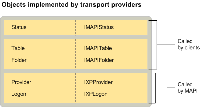

# MAPI-Transport-Anbieter-ObjekteMAPI transport provider objects
  
**Betrifft**: Outlook 2013 | Outlook 2016**Applies to**: Outlook 2013 | Outlook 2016 
  
Zusätzlich zu den standardmäßigen Provider und Logon-Objekten, die von allen Dienstanbietern implementiert werden Transportanbieter erforderlich, um einem Statusobjekt implementiert werden.In addition to the standard provider and logon objects implemented by all service providers, transport providers are required to implement a status object. Implementieren ein Statusobjekt ist für die anderen Anbieter Diensttypen optional.For the other service provider types, implementing a status object is optional. Muss allerdings MAPI für Transportanbieter.However, MAPI requires it for transport providers. Transportanbieter, die das Herunterladen von Nachrichtenkopfzeilen von einem Remoteserver unterstützen, implementieren auch einen Ordner und eine Tabelle.Transport providers that support the downloading of message headers from a remote server also implement a folder and a table. 
  
Die folgende Abbildung zeigt alle Objekte, die Transportanbieter mit ihren entsprechenden Schnittstellen implementieren können.The following illustration shows each of the objects that transport providers can implement with their corresponding interfaces. Die Abbildung wird angegeben, ob MAPI oder ein Client das Objekt-Benutzer ist.The illustration also indicates whether MAPI or a client is the object's user.
  
![Objekte, mit denen Transportanbieter implementiert] (media/amapi_66.gif "Objekte, mit denen Transportanbieter implementiert")
  
## Siehe auchSee also

- [MAPI-DienstanbieterobjektenMAPI Service Provider Objects](mapi-service-provider-objects.md)

