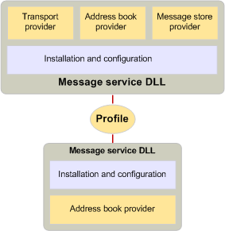

# Nachrichtendienste und ProfileMessage services and profiles
  
**Gilt für**: Outlook 2013 | Outlook 2016**Applies to**: Outlook 2013 | Outlook 2016 
  
Einige Benutzer benötigen die Dienste mehrerer Messagingsysteme, die jeweils einen oder mehrere Dienstanbieter aufweisen.Some users require the services of several messaging systems, each with one or more service providers. Da es umständlich ist, jeden dieser Dienstanbieter einzeln zu installieren und zu konfigurieren, und da ein Messaging Server in der Regel eine Gruppe verwandter Anbieter benötigt, um alle Funktionen verfügbar zu machen, enthält MAPI das Konzept eines Nachrichtendiensts.Because it is cumbersome to install and configure each of these service providers individually, and because a messaging server usually requires a group of related providers to expose all its functionality, MAPI includes the concept of a message service. Nachrichtendienste helfen Benutzern bei der Installation und Konfiguration Ihrer Dienstanbieter.Message services help users install and configure their service providers.
  
Zum Erstellen eines Nachrichtendiensts schreibt ein Entwickler ein Entry Point-Programm für den Nachrichtendienst, um die Konfiguration der einzelnen Anbieter im Dienst und ein Setupprogramm für Folgendes zu übernehmen:To create a message service, a developer writes a message-service entry point program to handle the configuration of each provider in the service and a setup program to do the following:
  
- Installieren Sie jeden Anbieter im Dienst.Install each provider in the service.
    
- Erstellen Sie Registrierungs-und Initialisierungsdatei Einträge.Create registry and initialization file entries.
    
- Erstellen Sie Einträge in der MAPI-Konfigurationsdatei MAPISVC. inf.Create entries in the MAPI configuration file, Mapisvc.inf.
    
Die Datei MAPISVC. inf enthält Informationen zur Konfiguration aller Nachrichtendienste und Dienstanbieter, die auf dem Computer installiert sind.The Mapisvc.inf file contains information that relates to the configuration of all message services and service providers installed on the computer. Sie ist in hierarchischen Abschnitten gegliedert, wobei jede Ebene mit der nächsten verknüpft ist.It is organized in hierarchical sections, with each level linked to the next. Oben befinden sich drei Abschnitte, die Folgendes enthalten:At the top are three sections that contain the following: 
  
- Eine Liste der Hilfedateien des Nachrichtendiensts.A list of message service Help files.
    
- Eine Liste der wichtigsten oder standardmäßigen Nachrichtendienste.A list of the most important, or default, message services.
    
- Eine Liste aller Dienste auf dem Computer.A list of all the services on the computer.
    
Die nächste Ebene enthält Abschnitte für jeden Nachrichtendienst, und die letzte Ebene enthält Abschnitte für jeden Dienstanbieter in einem Dienst.The next level contains sections for each message service, and the last level contains sections for each service provider in a service. MAPI erfordert, dass Entwickler von Dienstanbietern und Nachrichtendiensten bestimmte Einträge zu MAPISVC. inf hinzufügen; Entwickler können weitere Einträge nach eigenem Ermessen hinzufügen.MAPI requires that developers of service providers and message services add certain entries to Mapisvc.inf; developers can add other entries at their own discretion. Die meisten Informationen in MAPISVC. inf enden in einem oder mehreren Profilen, einer Sammlung von Konfigurationsinformationen für die bevorzugten Nachrichtendienste eines Benutzers.Most of the information in Mapisvc.inf ends up in one or more profiles, a collection of configuration information for a user's preferred set of message services. Da ein Computer mehrere Benutzer haben kann und ein einzelner Benutzer über mehrere Einstellungssätze verfügen kann, können viele Profile auf einem Computer vorhanden sein.Because a computer can have multiple users and a single user can have multiple sets of preferences, many profiles can exist on a computer. Jedes Profil beschreibt einen anderen Satz von Nachrichtendiensten.Each profile describes a different set of message services. Durch die Verwendung mehrerer Profile kann ein Benutzer beispielsweise zu Hause mit einem Satz von Nachrichtendiensten und im Büro mit einem anderen Satz arbeiten.Having multiple profiles enables a user to work, for example, at home with one set of message services and at the office with a different set.
  
Profile werden bei der Installation oder Anmeldezeit des Nachrichtendiensts von einer Clientanwendung erstellt, die Konfigurationsunterstützung bereitstellt.Profiles are created at message service installation or logon time by a client application that provides configuration support. MAPI bietet zwei solcher Clientanwendungen: ein Element der Systemsteuerung und den Profil-Assistenten.MAPI provides two such client applications: a Control Panel item and the Profile Wizard. Bei dem Element der Systemsteuerung handelt es sich um eine vollständige Konfigurationsanwendung, mit der Benutzerprofile erstellen, löschen, bearbeiten und kopieren sowie Änderungen an den Einträgen in einem Profil vornehmen können.The Control Panel item is a full-service configuration application with which users can create, delete, edit, and copy profiles, as well as make modifications to the entries in a profile. Der Profil-Assistent ist eine einfache Anwendung, die das Hinzufügen eines Nachrichtendiensts zu einem Profil so einfach wie möglich macht.The Profile Wizard is a simple application designed to make adding a message service to a profile as easy as possible. Der Profil-Assistent besteht aus einer Reihe von Dialogfeldern, die als Eigenschaftenseiten bezeichnet werden und den Benutzer bei der Installation und Konfiguration eines Diensts auffordern.The Profile Wizard consists of a series of dialog boxes, called property pages, that prompt the user through the process of installing and configuring a service. Der Benutzer wird nur für Werte für die kritischsten Einstellungen aufgefordert; alle anderen Einstellungen erben die Standardwerte.The user is prompted only for values for the most critical settings; all other settings inherit default values. Nachdem das Profil erstellt wurde, dürfen Benutzer keine Änderungen vornehmen.Once the profile has been created, users are not allowed to make changes. 
  
Während das Element der Systemsteuerung immer über die Systemsteuerung aufgerufen wird, gibt es eine Reihe von Szenarien, die dazu führen können, dass der Profil-Assistent aufgerufen wird.Whereas the Control Panel item is always invoked through the Control Panel, there are a variety of scenarios that can cause the Profile Wizard to be called. Client Anwendungen können den Profil-Assistenten aufrufen, um ein Standardprofil zum Zeitpunkt der Anmeldung zu erstellen, wenn noch keine erstellt wurde.Client applications can call the Profile Wizard to create a default profile at logon time when one has not yet been created. Anstatt Code erneut zu implementieren, um ein Profil hinzuzufügen, kann das Element der Systemsteuerung oder eine andere Clientanwendung die Funktionen verwenden, die sich bereits im Profil-Assistenten befinden.Rather than reimplementing code to add a profile, the Control Panel item or another client application can rely on the functionality already in the Profile Wizard. Ein Nachrichtendienst kann in seiner Einstiegspunktfunktion den Profil-Assistenten aufrufen, wenn der Dienst dem Standardprofil hinzugefügt werden muss.A message service, in its entry point function, can call the Profile Wizard when the service needs to be added to the default profile. Nachrichtendienste, die den Profil-Assistenten verwenden, müssen eine zusätzliche Einstiegspunktfunktion und eine Windows-Standarddialogfelder-Prozedur schreiben.Message services that use the Profile Wizard must write an extra entry point function and a standard Windows dialog box procedure. Der Profil-Assistent ruft die Einstiegspunktfunktion auf, um das Konfigurationsdialogfeld des Diensts abzurufen, während die Dialogfeldprozedur die Nachrichten verarbeitet, die bei Verwendung dieses Dialogfelds generiert werden.The Profile Wizard calls the entry point function to retrieve the service's configuration dialog box while the dialog box procedure handles the messages that are generated when this dialog box is in use. 
  
Profile werden ähnlich wie die Datei "Mapisvc. inf" organisiert.Profiles are organized in a similar way to the Mapisvc.inf file. Profile haben verknüpfte hierarchische Abschnitte; Dienstanbieter eigene Abschnitte in der untersten Ebene, Nachrichtendienste eigene Abschnitte in der mittleren Ebene und MAPI besitzt Abschnitte auf höchster Ebene.Profiles have linked hierarchical sections; service providers own sections in the lowest level, message services own sections in the middle level, and MAPI owns sections in the highest level. Jeder Abschnitt wird mit einem eindeutigen Bezeichner identifiziert, der als [MAPIUID](mapiuid.md)bezeichnet wird.Each section is identified with a unique identifier known as a [MAPIUID](mapiuid.md). Die MAPI-Abschnitte enthalten interne Informationen zu MAPI, wie die Bezeichner aller Profile des Nachrichtendienst Profils und Links zu den einzelnen Abschnitten.The MAPI sections contain information internal to MAPI, such as the identifiers of all of the message service profile sections and links to each of the other sections. Jeder Nachrichtendienst Abschnitt speichert Links zu seinen Anbieter Abschnitten, und jeder Anbieterabschnitt speichert einen Link zu seinem Dienst Abschnitt.Each message service section stores links to its provider sections, and each provider section stores a link to its service section. 
  
Die folgende Abbildung zeigt die Inhalte von zwei typischen Profilen.The following illustration shows the contents of two typical profiles. Sam hat zwei Profile auf seinem Computer, eine für die private Nutzung und eine für die Office-Verwendung.Sam has two profiles on his computer, one for home use and one for office use. Das Startprofil enthält drei Nachrichtendienste.The home profile contains three message services. Message Service X ist ein einzelner Anbieterdienst für die Adressbuchverwaltung.Message Service X is a single provider service for address book management. Nachrichtendienste Y und Z verfügen über drei Anbieter: einen Adressbuchanbieter, einen Nachrichtenspeicher Anbieter und einen Transportanbieter.Message Services Y and Z have three providers — an address book provider, a message store provider, and a transport provider. Sams Arbeitsprofil enthält zwei verschiedene Nachrichtendienste, von denen jeder einen Adressbuchanbieter, einen Nachrichtenspeicher Anbieter und einen Transportanbieter besitzt.Sam's Work Profile contains two different message services, each of which has an address book provider, a message store provider, and a transport provider. 
  
**Profilbeispiel****Profile example**
  
![Profil Beispiel] (media/amapi_56.gif "Profil Beispiel")
  
Die folgende Abbildung zeigt ein Profil mit zwei Nachrichtendiensten.The following illustration shows a profile that includes two message services. Der Code für die Installation und Konfiguration der Dienstanbieter, die zum Nachrichtendienst gehören, befindet sich in derselben DLL wie der Code für die Anbieter.The code for installing and configuring the service providers that belong to the message service resides in the same DLL as the code for the providers. Dieser Code liest Informationen aus dem Profil bei der Anmeldung, um die Dienstanbieter zu konfigurieren, und fordert den Benutzer auf, wenn möglich und erforderlich, fehlende Informationen zu erhalten.This code reads information from the profile at logon time to configure the service providers, and it prompts the user, if possible and necessary, for missing information. Anforderungen von einem Client zum Anzeigen oder Ändern von Konfigurationseinstellungen für einen der Anbieter werden ebenfalls durch diesen gemeinsamen Code behandelt.Requests from a client to view or change configuration settings for any of the providers are also handled by this common code.
  
**Installieren und Konfigurieren von Serviceanbietern****Installing and configuring service providers**
  
![Installieren und Konfigurieren von Dienstanbietern] (media/amapi_55.gif "Installieren und Konfigurieren von Dienstanbietern")
  
## Siehe auchSee also

- [MAPIUIDMAPIUID](mapiuid.md)
- [Übersicht über die MAPI-ProgrammierungMAPI Programming Overview](mapi-programming-overview.md)

