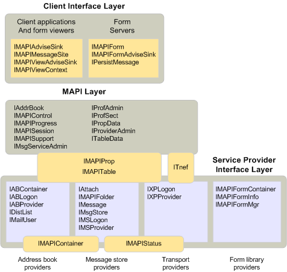

# Objekte und die MAPI-ArchitekturObjects and the MAPI architecture

**Gilt für**: Outlook 2013 | Outlook 2016**Applies to**: Outlook 2013 | Outlook 2016 
  
Alle Objekte, die MAPI definiert, fallen in eine oder mehrere Ebenen in der MAPI-Architektur.All of the objects that MAPI defines fall into one or more layers in the MAPI architecture. Die Ebene der Clientschnittstelle enthält alle Objekte, die von einer Clientanwendung, einem Formular Betrachter oder einem Formularserver implementiert werden können.The client interface layer contains all the objects that a client application, form viewer, or form server can implement. Die Ebene der Dienstanbieter Oberfläche enthält die Objekte, die ein Dienstanbieter eines beliebigen Typs implementieren kann.The service provider interface layer contains the objects that a service provider of any type can implement. Dieser Layer umfasst Objekte, die durch Adressbücher, Nachrichtenspeicher, Transportanbieter und Formularbibliotheken implementiert werden.This layer includes objects implemented by address books, message stores, transport providers, and form libraries. Die Ebene, die das MAPI-Subsystem darstellt, wird zwischen den Layern der Client-und der Dienstanbieter Oberfläche positioniert.The layer that represents the MAPI subsystem is positioned between the client and service provider interface layers. Die MAPI-Schicht enthält alle Objekte, die MAPI für die zu verwendenden Clients oder Dienstanbieter implementiert.The MAPI layer contains all of the objects that MAPI implements for clients or service providers to use. 
  
Die folgende Abbildung zeigt, wo jedes MAPI-Objekt in die MAPI-Architektur passt.The following illustration shows where each of the MAPI objects fits into the MAPI architecture. Die Objekte werden mit den Namen ihrer abgeleiteten Schnittstellen dargestellt.The objects are represented with the names of their derived interfaces. Ein Advise-Senke-Objekt wird beispielsweise als [IMAPIAdviseSink: IUnknown](imapiadvisesinkiunknown.md), die Schnittstelle angezeigt, die von [IUnknown](https://msdn.microsoft.com/library/33f1d79a-33fc-4ce5-a372-e08bda378332%28Office.15%29.aspx) abgeleitet ist und die jedes Advise-Senke-Objekt implementiert.For example, an advise sink object is shown as [IMAPIAdviseSink : IUnknown](imapiadvisesinkiunknown.md), the interface that derives from [IUnknown](https://msdn.microsoft.com/library/33f1d79a-33fc-4ce5-a372-e08bda378332%28Office.15%29.aspx) and that every advise sink object implements. Die Schnittstellen, die Layer überbrücken, werden entweder von mehreren Komponenten verwendet oder implementiert.The interfaces that bridge layers are either used or implemented by multiple components. Obwohl die MAPI-Schicht angezeigt wird, um die Client-und Anbieter Ebenen zu trennen, was bedeutet, dass die gesamte Kommunikation über MAPI fließen muss, ist dies nicht der Fall.Although the MAPI layer appears to separate the client and provider layers, implying that all communication must flow through MAPI, this is not the case. Clients können und tun direkt an Dienstanbieter Objekte kommunizieren.Clients can and do communicate directly to service provider objects. 
  
**Objektschichten in MAPI****Object layers in MAPI**
  
![Objektebenen in MAPI] (media/amapi_38.gif "Objektebenen in MAPI")
  
## Siehe auchSee also

- [IMAPIAdviseSink : IUnknownIMAPIAdviseSink : IUnknown](imapiadvisesinkiunknown.md)
- [Übersicht über MAPI-Objekte und-SchnittstellenMAPI Object and Interface Overview](mapi-object-and-interface-overview.md)

