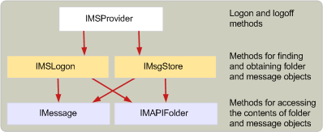

# Struktur der Nachricht-AnbieterStructure of message store providers
  
**Betrifft**: Outlook**Applies to**: Outlook 
  
Anbieter eine Nachricht bei der Ausführung im Arbeitsspeicher, ist eine [IMSProvider: IUnknown](imsprovideriunknown.md) Schnittstelle.A message store provider, when it is running in memory, is an [IMSProvider : IUnknown](imsprovideriunknown.md) interface. Die **IMSProvider** -Schnittstelle ermöglicht Client-Anwendungen und die MAPI-Warteschlange an und von der Nachrichtenspeicher anmelden.The **IMSProvider** interface allows client applications and the MAPI spooler to log on to and off of the message store. Die, die Clientanwendungen und die MAPI-Warteschlange verwenden, Zugriff auf Ordner und Nachrichten im Nachrichtenspeicher sind [IMSLogon](imslogoniunknown.md) und [IMsgStore](imsgstoreimapiprop.md) Schnittstellen.The interfaces that client applications and the MAPI spooler use to access folders and messages in the message store are [IMSLogon](imslogoniunknown.md) and [IMsgStore](imsgstoreimapiprop.md) interfaces. Diese Schnittstellen werden normalerweise erstellt, wenn der Nachrichtenspeicher zuerst angemeldet ist, obwohl der Einstiegspunkt [MSProviderInit](msproviderinit.md) der Nachricht speichern DLL konnte auch erstellen sie.These interfaces are typically created when the message store is first logged on to, although the [MSProviderInit](msproviderinit.md) entry point of the message store DLL could also create them. 
  
Da die **IMSLogon** und **IMsgStore** Schnittstellen einige Methoden gemeinsam nutzen, kann es einfacher sein ein Klassenobjekt erstellen, die beide Schnittstellen erbt.Because the **IMSLogon** and **IMsgStore** interfaces share some methods, it may be easier to create one class object that inherits from both of these interfaces. Sie können diese Schnittstellen in separaten Objekten implementieren, und Schreiben Hilfsfunktionen interne zur DLL, mit die die freigegebenen Methoden implementiert, die dann von den Methoden in den Schnittstellen **IMSLogon** und **IMsgStore** aufgerufen werden können.You can also implement these interfaces in separate objects, and write helper functions internal to your DLL that implement the shared methods that can then be called from the methods in the **IMSLogon** and **IMsgStore** interfaces. 
  
Die folgende Abbildung zeigt einen allgemeinen Überblick über die Objekthierarchie innerhalb eines Nachrichtenspeichers ausgeführt wird.The following illustration shows a high-level outline of the object hierarchy within a running message store.
  
**Objekthierarchie des Nachrichtenspeichers****Message store object hierarchy**
  
![Objekthierarchie des Nachrichtenspeichers] (media/storeobj.gif "Objekthierarchie des Nachrichtenspeichers")
  
## Siehe auchSee also

- [Entwickeln eines Providers MAPI-NachrichtenspeicherDeveloping a MAPI Message Store Provider](developing-a-mapi-message-store-provider.md)

