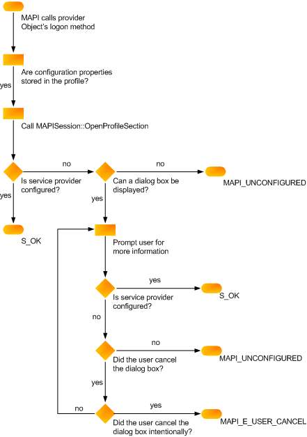

# Überprüfen der Dienstanbieterkonfiguration
  
**Gilt für**: Outlook 2013 | Outlook 2016 
  
Ihre Anmeldemethode ([IABProvider::Logon](iabprovider-logon.md), [IMSProvider::Logon](imsprovider-logon.md)oder [IXPProvider::TransportLogon](ixpprovider-transportlogon.md)) muss die Konfiguration Ihres Anbieters überprüfen. Dies umfasst die Überprüfung, ob alle für den vollständigen Vorgang erforderlichen Eigenschaften richtig festgelegt sind. Jeder Anbieter erfordert eine andere Anzahl von Eigenschaften. die Konfiguration hängt von Ihrem Anbieter und dem Grad der Benutzerinteraktion ab, die Sie zulassen. Einige Dienstanbieter behalten alle erforderlichen Eigenschaften im Profil. 

Andere Dienstanbieter behalten einen Teilsatz von Eigenschaften im Profil bei und fordern den Benutzer auf, fehlende Werte einzufordern. Andere Anbieter speichern jedoch keine Eigenschaften im Profil und verlassen sich dabei darauf, dass der Benutzer alle für die Konfiguration erforderlichen Informationen zur Verfügung stellt.
  
### So rufen Sie im Profil gespeicherte Eigenschaften ab
  
1. Rufen Sie [IMAPISupport::OpenProfileSection](imapisupport-openprofilesection.md)auf, und übergeben Sie die [MAPIUID](mapiuid.md) Ihres Anbieters als Eingabeparameter. 
    
2. Rufen Sie die [IMAPIProp::GetProps-](imapiprop-getprops.md) oder [IMAPIPropProp::GetPropList-Methoden](imapiprop-getproplist.md) des Profilabschnitts auf, um einzelne Eigenschaften oder eine Eigenschaftenliste abzurufen. 
    
### So legen Sie Eigenschaften aus Benutzerinformationen fest
  
Zeigen Sie ein Eigenschaftenblatt an, wenn die MAPI kein Kennzeichen festgelegt hat, das die Anzeige verbietet. Die folgenden Flags deuten darauf hin, dass eine Benutzeroberfläche nicht angezeigt werden kann.
  
|**Wert**|**Dienstleister**|
|:-----|:-----|
|AB_NO_DIALOG    |Adressbuchanbieter    |
|LOGON_NO_DIALOG    |Transportanbieter    |
|MDB_NO_DIALOG    |Nachrichtenspeicheranbieter    |
   
Wenn Ihr Anbieter nicht alle Konfigurationseigenschaften im Profil speichert, was eine Benutzerinteraktion erfordert, und MAPI eines der Dialogfeldunterdrückungsflags an Ihre Anmeldemethode übergibt, geben Sie MAPI_E_UNCONFIGURED zurück. Geben Sie diesen Fehler auch zurück, wenn das Dialogfeldunterdrückungs-Flag nicht festgelegt ist, der Benutzer jedoch nicht alle erforderlichen Informationen bereitstellt.
  
Wenn ihr Dienstanbieter seine Anmeldemethode mit MAPI_E_UNCONFIGURED nicht erfolgreich ausführt, ruft MAPI die Einstiegspunktfunktion erneut auf. Wenn die Informationen beim zweiten Aufruf nicht gefunden werden können, wird die Sitzung möglicherweise beendet, je nachdem, wie wichtig Ihr Dienstanbieter ist. 
  
Die folgende Abbildung zeigt die Logik, die für die Konfiguration in der Anmeldemethode des Dienstanbieters erforderlich ist. 
  
**Flussdiagramm für Konfigurationsüberprüfung**
  

  
## Siehe auch

- [Implementieren der Dienstanbieteranmeldung](implementing-service-provider-logon.md)

