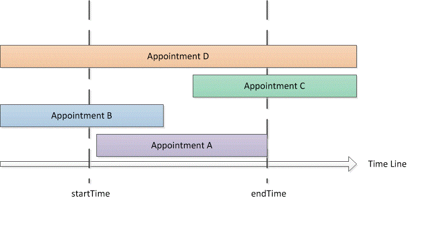

# <a name="search-and-obtain-appointments-in-a-time-range"></a>Suchen und Abrufen von Terminen in einem Zeitbereich

Dieses Beispiel gibt im standardmäßigen Microsoft Outlook-Kalender Termine in einem bestimmten Zeitraum zurück.

## <a name="example"></a>Beispiel

Dieses Codebeispiel enthält zwei Methoden: DemoAppointmentsInRange und GetAppointmentsInRange. DemoAppointmentsInRange ruft den Standardkalender für das derzeit angemeldete Outlook-Profil ab, legt einen Datumsbereich von fünf Tagen ab 12:00 Uhr am heutigen Tag fest, ruft GetAppointmentsInRange auf, um Termine abzurufen, die in diesen Bereich fallen, und zeigt den Betreff und die Startzeit der einzelnen zurückgegebenen Termine an.

GetAppointmentsInRange akzeptiert einen Outlook-Ordner und die **DateTime**-Werte für die Start- und Endzeit als Eingabeparameter. Diese Methode verwendet die [Restrict(String)](https://msdn.microsoft.com/library/bb612531\(v=office.15\))-Methode und einen Zeichenfolgenfilter im Jet-Format, der Termine zurückgibt, die innerhalb des angegebenen Zeitraums beginnen und enden. Unter der Annahme, dass \[Start\] und \[End\] die Start- und Endzeiten eines Termins und startTime und endTime die Start- und Endzeiten des angegebenen Zeitraums sind, richtet GetAppointmentsInRange einen Filter ein, der nach Terminen mit `[Start]>=startTime` und `[End]<=endTime` sucht. Im folgenden Code ist der Jet-Filter in C\# dargestellt.

```csharp
string filter = "[Start] >= '"
    + startTime.ToString("g")
    + "' AND [End] <= '"
    + endTime.ToString("g") + "'";
```

Vor dem Aufrufen der **Items.Restrict**-Methode zur Suche von Terminen werden von GetAppointmentsInRange zwei weitere Vorgänge ausgeführt, um Terminserien einzuschließen, die in dem angegebenen Zeitraum auftreten:

- Legt die [IncludeRecurrences](https://msdn.microsoft.com/library/bb646522\(v=office.15\))-Eigenschaft der [Items](https://msdn.microsoft.com/library/bb645287\(v=office.15\))-Auflistung fest.

- Sortiert die Terminelemente in dem angegebenen Kalenderordner anhand der [Start](https://msdn.microsoft.com/library/bb647263\(v=office.15\))-Eigenschaft.

Wenn Sie auch an Terminen interessiert sind, die teilweise oder komplett mit dem angegebenen Zeitraum überlappen, können Sie alternativ einen anderen Filter angeben, um weitere Typen von Terminen zurückzugeben (wie in Abbildung 1 dargestellt):

- Termine, die innerhalb des angegebenen Zeitraums beginnen und enden (z. B. Termin A):<br/><br/>`[Start]>=startTime and [End]<=endTime`

- Termine, die vor dem angegebenen Zeitraum beginnen, aber innerhalb des Zeitraums enden (z. B. Termin B):<br/><br/>`[Start]<startTime and [End]<=endTime`

- Termine, die innerhalb des angegebenen Zeitraums beginnen, aber nach dem Zeitraum enden (z. B. Termin C):<br/><br/>`[Start]>=startTime and [End]>endTime`

- Termine, die vor dem angegebenen Zeitraum beginnen und nach dem Zeitraum enden (z. B. Termin D):<br/><br/>`[Start]<startTime and [End]>endTime`

**Abbildung 1. Arten von Terminen, die innerhalb eines Zeitraums auftreten oder sich mit diesem Zeitraum überschneiden**


 

In einem beliebigen Zeitraum `startTime<=endTime` würde ein Filter mit `[Start]<=endTime` und `[End]>=startTime` die vorherigen Typen von Terminen in diesem Zeitraum erfassen.

In C\# können Sie den Jet-Filter wie folgt ausdrücken.

```csharp
string filter = "[Start] <= '&quot;
    + endTime.ToString(&quot;g")
    + "' AND [End] >= '"
    + startTime.ToString("g") + "'";
```

Im folgenden Code ist das vollständige Beispiel dargestellt. Wenn Sie Visual Studio verwenden, um dieses Codebeispiel zu testen, müssen Sie der Microsoft Outlook 15.0-Objektbibliothekkomponente zuerst einen Verweis hinzufügen und die Outlook-Variable angeben, wenn Sie den **Microsoft.Office.Interop.Outlook**-Namespace importieren. Die Anweisung **Imports** oder **using** darf im Codebeispiel nicht direkt vor den Funktionen stehen, sondern muss vor der öffentlichen Class-Deklaration hinzugefügt werden. Die folgenden Codezeilen zeigen, wie Sie den Import und die Zuweisung in Visual Basic und C\# vornehmen.

```vb
Imports Outlook = Microsoft.Office.Interop.Outlook
```


```csharp
using Outlook = Microsoft.Office.Interop.Outlook;
```


```csharp
private void DemoAppointmentsInRange()
{
    Outlook.Folder calFolder =
        Application.Session.GetDefaultFolder(
        Outlook.OlDefaultFolders.olFolderCalendar)
        as Outlook.Folder;
    DateTime start = DateTime.Now;
    DateTime end = start.AddDays(5);
    Outlook.Items rangeAppts = GetAppointmentsInRange(calFolder, start, end);
    if (rangeAppts != null)
    {
        foreach (Outlook.AppointmentItem appt in rangeAppts)
        {
            Debug.WriteLine("Subject: " + appt.Subject 
                + " Start: " + appt.Start.ToString("g"));
        }
    }
}

/// <summary>
/// Get recurring appointments in date range.
/// </summary>
/// <param name="folder"></param>
/// <param name="startTime"></param>
/// <param name="endTime"></param>
/// <returns>Outlook.Items</returns>
private Outlook.Items GetAppointmentsInRange(
    Outlook.Folder folder, DateTime startTime, DateTime endTime)
{
    string filter = "[Start] >= '"
        + startTime.ToString("g")
        + "' AND [End] <= '"
        + endTime.ToString("g") + "'";
    Debug.WriteLine(filter);
    try
    {
        Outlook.Items calItems = folder.Items;
        calItems.IncludeRecurrences = true;
        calItems.Sort("[Start]", Type.Missing);
        Outlook.Items restrictItems = calItems.Restrict(filter);
        if (restrictItems.Count > 0)
        {
            return restrictItems;
        }
        else
        {
            return null;
        }
    }
    catch { return null; }
}
```

## <a name="see-also"></a>Siehe auch

- [Suchen und Filtern](search-and-filter.md)

