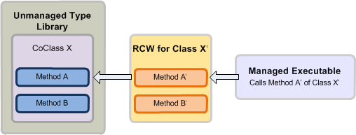

# Einführung in die Interoperabilität zwischen COM und .NETIntroduction to interoperability between COM and .NET

Das Component Object Model (COM) und die .NET-Entwicklung verfügen über erhebliche Unterschiede in Bezug auf Typsysteme und Mechanismen für die Lebensdauerverwaltung für Objekte, die Schnittstellenerstellung und die Schnittstellenvererbung.The Component Object Model (COM) and .NET development have vastly different type systems and mechanisms for object lifetime management, interface creation, and interface inheritance. 

Ein **Variant**-Typ in COM ist beispielsweise ein **System.Object**-Datentyp in .NET Framework.For example, a **Variant** type in COM is a **System.Object** data type in the .NET Framework. Um ein Objekt zu erstellen, ruft ein COM-Client [CoCreateInstance](https://docs.microsoft.com/windows/desktop/api/combaseapi/nf-combaseapi-cocreateinstance) auf, während ein verwalteter Client Schlüsselwörter wie „new“ oder „New“ verwendet, die in eine verwaltete Programmiersprache integriert sind.To create an object, a COM client calls [CoCreateInstance](https://docs.microsoft.com/windows/desktop/api/combaseapi/nf-combaseapi-cocreateinstance), whereas a managed client can use keywords such as new or New that are built in to a managed programming language. 

Während COM die klassische Vererbung nicht unterstützt, und ein COM-Client einen internen Referenzzähler von [IUnknown](https://docs.microsoft.com/windows/desktop/api/unknwn/nn-unknwn-iunknown) verwendet, um eine Co-Klasse freizugeben, beruht ein verwalteter Client auf der zur Laufzeit durchgeführten Garbage Collection von .NET Framework, um ein Objekt freizugeben.While COM does not support classical inheritance and a COM client manages an internal reference count provided by [IUnknown](https://docs.microsoft.com/windows/desktop/api/unknwn/nn-unknwn-iunknown) to free a coclass, a managed client relies on the common language runtime (CLR) garbage collector provided by the .NET Framework to free an object. 

Diese Unterschiede zwischen der COM- und .NET-Entwicklung müssen durch einen Mechanismus aufgelöst werden, wenn Sie einen verwalteten Client auf einem COM-Objektmodell entwickeln.Given such differences between COM and .NET development, developing a managed client on a COM object model requires a mechanism that resolves these differences. Der Runtime Callable Wrapper (RCW) ist ein solcher Mechanismus, der eine transparente Kommunikation zwischen COM und dem verwalteten Programmierungsmodell ermöglicht.The Runtime Callable Wrapper (RCW) is a mechanism that promotes transparent communication between COM and the managed programming model.

In diesem Artikel finden Sie eine allgemeine Beschreibung dazu, wie mit RCW die Kommunikation zwischen COM und dem verwaltete Programmiermodell vereinfacht wird.This topic gives a high-level description of how the RCW facilitates communication between COM and the managed programming model. Obwohl in diesem Thema Visual Studio verwendet wird, um den RCW-Mechanismus zu veranschaulichen, können Sie auch eine Interopassembly außerhalb von Visual Studio zum Entwickeln eines verwalteten Clients verwenden.Note that even though this topic uses Visual Studio to illustrate the RCW mechanism, you can use an interop assembly outside of Visual Studio to develop a managed client.

## Gewährleisten von Interoperabilität: die Interopassembly und RCWFacilitating interoperability: the Interop Assembly and RCW

### KompilierzeitCompile time

Eine Interopassembly definiert verwaltete Schnittstellen, die einer COM-basierten Typbibliothek zugeordnet sind und mit denen ein verwalteter Client kommunizieren kann.An interop assembly defines managed interfaces that map to a COM-based type library and that a managed client can interact with. Um eine Interopassembly in Visual Studio zu verwenden, müssen Sie zunächst einen Verweis auf die entsprechende COM-Komponente hinzufügen.To use an interop assembly in Visual Studio, first add a reference to the corresponding COM component. Visual Studio generiert automatisch eine lokale Kopie der Interopassembly.Visual Studio will automatically generate a local copy of the interop assembly. Die Interopassembly enthält einen Namespace, unter dem eine entsprechende verwaltete Schnittstelle der einzelnen COM-Objekte im COM-Objektmodell vorliegt.The interop assembly contains one namespace, under which there is a managed equivalent interface of each COM object in the COM object model. 

Abbildung 1 zeigt einen verwalteten Client, der eine COM-Typbibliothek verwenden möchte, die die Co-Klasse X definiert. Der verwaltete Client ruft die Klasse X auf, die der entsprechenden verwalteten Schnittstelle für die Co-Klasse X entspricht, die in der Interopassembly definiert ist.Figure 1 illustrates a managed client that wants to use a COM type library that defines coclass X. The managed client calls class X, which is the managed equivalent interface for coclass X, as defined in the interop assembly. Zum Zeitpunkt der Kompilierung wird das verwaltete Projekt mit Informationen über die Klasse X von der Interopassembly kompiliert.At compile time, the managed project is compiled with information about class X from the interop assembly.

**Abbildung 1: Eine verwaltete Anwendung, kompiliert mit einer Interopassembly, die mit einer nicht verwalteten Typbibliothek zusammenarbeitet****Figure 1. A managed application compiled with an interop assembly that interoperates with an unmanaged type library**

  
Solange Sie eine Referenz zu einer Typbibliothek festlegen, generiert Visual Studio eine Kopie der Interopassembly für diese Typbibliothek. Es kann eine große Anzahl an Interopassemblys für einen COM-Typ geben. Dagegen gibt es nur eine primäre Interopassembly (PIA) für eine Typbibliothek; und zwar genau die Interopassembly, die von der Typbibliothek herausgegeben wird. Im Unterschied zu anderen Interopassemblys wir die PIA nicht jedes mal neu generiert, wenn eine Referenz in Visual Studio hinzugefügt wird. Stattdessen installieren Sie die PIA in den globalen Assemblycache (GAC) nur einmal pro Computer. Wenn Sie eine Referenz zur Typbibliothek hinzufügen, lädt Visual Studio die PIA automatisch.In general, as long as you set a reference to a type library, Visual Studio generates a copy of an interop assembly for that type library. Any number of interop assemblies can exist to describe the same COM type. However, a type library can have only one Primary Interop Assembly (PIA), which is the interop assembly published by the type library. Unlike other interop assemblies, the PIA is not generated every time you add a reference in Visual Studio. Instead, you install the PIA to the global assembly cache (GAC) just once on a computer. When you add a reference to the type library, Visual Studio automatically loads the PIA.

Um eine verwaltete Lösung für Outlook zu programmieren, sollten Sie die Outlook-PIA verwenden.To program a managed solution for Outlook, you should use the Outlook PIA. Um Informationen aus der Outlook-PIA in ein verwaltetes Add-In einzubinden, installieren Sie zuerst die Outlook-PIA im GAC.To incorporate information from the Outlook PIA into a managed add-in, first you must install the Outlook PIA in the GAC. Wenn Sie Visual Studio zum Erstellen eines verwalteten Projekts verwenden, lädt Visual Studio die PIA, nachdem Sie eine Referenz zur Outlook-Typbibliothek hinzugefügt haben.If you are using Visual Studio to create the managed project, after adding a reference to the Outlook type library, Visual Studio loads the PIA. Im Objektbrowser unter dem Namespace Microsoft.Office.Interop.Outlook finden Sie verwaltete Schnittstellen mit Namen, die den Objekten im Outlook-Objektmodell entsprechen.In the object browser, under the namespace Microsoft.Office.Interop.Outlook, you can see managed interfaces that have names corresponding to objects in the Outlook object model. Beispielsweise entspricht die Account-Schnittstelle dem **Account**-Objekt im Outlook-Objektmodell.For example, the Account interface corresponds to the **Account** object in the Outlook object model. Beim Kompilieren des verwalteten Projekts werden diese Informationen in die ausführbare Datei integriert.When you compile the managed project, this information is incorporated in your executable.

### LaufzeitRun time

Zur Laufzeit erstellt die CRL von .NET Framework mit den Informationen der Interopassembly einen RCW für jede Co-Klasse, mit der der verwaltete Client interagiert. Beachten Sie, dass nur ein RCW für jede Co-Klasse erstellt wird, unabhängig davon, wie viele Schnittstellen der Client aus der Co-Klasse abgerufen hat. Der RCW ist ein .NET-Klassentyp, der um die COM-Co-Klasse angeordnet wird. Der RCW verfolgt die Co-Klasseninstanzen und ordnet ihnen Referenzen zu, wenn der Client den RCW nicht mehr benötigt. Daher muss ein .NET-Client die Lebensdauer eines Objekts nicht in der Weise verwalten, wie es ein unverwalteter Client unter COM tun müsste.At run time, with the information provided by an interop assembly, the .NET Framework CLR creates an RCW for each coclass the managed client interacts with. Note that the runtime creates only one RCW for each coclass, regardless of how many interfaces the client has obtained from the coclass. The RCW is a .NET Framework class type that wraps around the COM coclass. The RCW keeps track of the instances of the coclass and releases references to them only when the client no longer needs the RCW. This way, a managed client does not have to manage the lifetime of an object the way an unmanaged client would under COM.

Abbildung 2 zeigt einen RCW, der einen API-Aufruf eines verwalteten Clients zur Laufzeit unterbricht und mithilfe der Informationen der Interopassembly den Aufruf der entsprechenden API in der COM-Co-Klasse zuordnet. Das folgende Verfahren beschreibt, wie das geschieht:Figure 2 illustrates an RCW intercepting an API call from a managed client at run time, and using information from the interop assembly, transparently mapping the call to the corresponding API in the COM coclass. The following process describes how this happens:

1.  Der verwaltete Client ruft Methode A' von Klasse X' auf, wie in der Interopassembly für eine COM-Typbibliothek definiert wurde.The managed client calls method A' of class X' as defined in the interop assembly for a COM type library.

2.  Falls noch kein RCW für Klasse X' vorhanden ist, verwendet die .NET Framework-Laufzeit Informationen der Interopassembly und erstellt einen RCW für Klasse X'.If an RCW does not yet exist for class X', the .NET Framework runtime uses information from the interop assembly and creates an RCW for class X'.

3.  Der RCW unterbricht den Aufruf von Methode A', übersetzt die Argumente in entsprechende COM-Typen und ruft Methode A der Co-Klasse X auf wie in der COM-Typbibliothek definiert.The RCW intercepts the call to method A', translates the arguments into corresponding COM types, and invokes method A of coclass X as defined in the COM type library.

**Abbildung 2. RCW unterbricht Aufruf von einer verwalteten ausführbaren Datei und ordnet ihn einer Co-Klasse einer nicht verwalteten Typbibliothek zu****Figure 2. An RCW intercepts a call from a managed executable and maps it to a coclass in an unmanaged type library**

  

## Siehe auchSee also

- [Gründe für die Verwendung der Outlook-PIAWhy use the Outlook PIA](why-use-the-outlook-pia.md)
- [Installieren der Outlook-PIA und Verweisen auf dieseInstalling and referencing the Outlook PIA](installing-and-referencing-the-outlook-pia.md)

