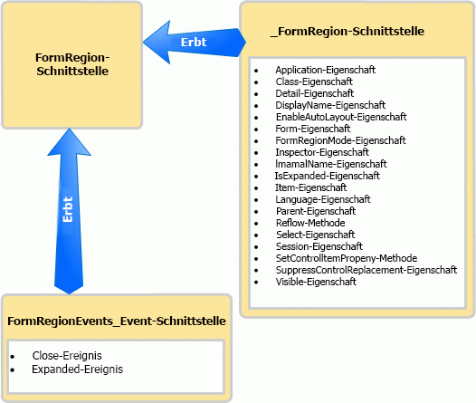

# <a name="methods-and-properties-in-the-outlook-pia"></a>Methoden und Eigenschaften in der Outlook-PIA

In diesem Thema wird beschrieben, wie mithilfe der Outlook Primary Interop Assembly (PIA) auf Methoden und Eigenschaften eines Objekts in verwaltetem Code zugegriffen wird.

## <a name="where-helper-objects-come-from"></a>Ursprung von Hilfsobjekten

Zum Erstellen der Outlook PIA verwendet Outlook den Typbibliothekimporter (Type Library Importer, TLBIMP) von .NET Framework, um Typdefinitionen in der COM-Typbibliothek in entsprechende Definitionen in einer Common Language Runtime-Assembly (CLR) zu konvertieren. In COM stellt ein Objekt eine Co-Klasse dar, die Folgendes umfasst:

- Die primäre Schnittstelle (z. B. die [\_FormRegion](https://msdn.microsoft.com/library/bb645761\(v=office.15\))-Schnittstelle).

- Die Ereignisschnittstelle (z. B. die [FormRegionEvents](https://msdn.microsoft.com/library/bb611940\(v=office.15\))-Schnittstelle).

TLBIMP importiert die primäre Schnittstelle und die Ereignisschnittstelle für jedes Objekt und erstellt eine Reihe von Schnittstellen, Delegaten und Klassen, zu denen die folgenden gehören:

- Die .NET-Ereignisschnittstelle (z. B. die [FormRegionEvents\_Event](https://msdn.microsoft.com/library/bb647619\(v=office.15\))-Schnittstelle).

- Die .NET-Klasse (z. B. die [FormRegionClass](https://msdn.microsoft.com/library/bb624204\(v=office.15\))-Klasse).

- Die .NET-Schnittstelle (z. B. die [FormRegion](https://msdn.microsoft.com/library/bb652633\(v=office.15\))-Schnittstelle).

## <a name="what-the-helper-objects-are-for"></a>Zweck der Hilfsobjekte

Bei weiterer Verwendung des **FormRegion**-Objekts als Beispiel prüft die folgende Liste, was die einzelnen Schnittstellen und zuvor aufgeführten Klassen enthalten.

- Die \_FormRegion-Schnittstelle definiert alle Methoden und Eigenschaften von FormRegion. In der Regel wird diese Schnittstelle nicht im Code verwendet, mit Ausnahme einer nachfolgend besprochenen Bedingung.

- Die **FormRegionEvents**-Schnittstelle definiert Methoden, die Ereignissen von FormRegion zugeordnet sind. Verwenden Sie diese Schnittstelle nicht im Code.

- TLBIMP verarbeitet die **FormRegionEvents**-Schnittstelle weiter, um die **FormRegionEvents**\_Event-Schnittstelle zu erstellen, die alle Ereignisse von FormRegion definiert. In der Regel wird diese Schnittstelle nicht im Code verwendet, mit Ausnahme einer nachfolgend besprochenen Bedingung.

- Die FormRegionClass-Klasse definiert alle Methoden-, Eigenschaften- und Ereignismember von FormRegion. Dieser Klasse wird die FormRegion-Schnittstelle im Hintergrund zugeordnet, sodass Sie Code schreiben können, um eine Instanz der FormRegion-Schnittstelle zu erstellen. Sie verwenden die Schnittstelle jedoch nicht direkt in Code.

- Die FormRegion-Schnittstelle erbt die \__FormRegion-Schnittstelle und die **FormRegionEvents**\_-Schnittstelle. Abbildung 1 zeigt die Vererbungsbeziehung.
    
  **Abbildung 1. Die FormRegion-Schnittstelle erbt Methoden und Eigenschaften von der \_FormRegion-Schnittstelle und Ereignisse von der FormRegionEvents\_Event-Schnittstelle**

  
    
  In der Regel ist FormRegion die einzige Schnittstelle, die Sie in verwaltetem Code verwenden, um auf das Objekt und die Methoden-, Eigenschaften- und Ereignismember des **FormRegion**-Objekts zuzugreifen.

Unter Verwendung des **Application**-Objekts als weiteres Beispiel greifen Sie auf das **Application**-Objekt, Methoden, Eigenschaften und Ereignisse über die [Application](https://msdn.microsoft.com/library/bb646615\(v=office.15\)) -Schnittstelle zu. Es gibt jedoch drei Ausnahmen, bei denen Sie eine andere Schnittstelle verwenden müssen oder abhängig von der Sprache verwenden möchten:

- Wenn Sie auf eine Methode zugreifen, die denselben Namen wie ein Ereignis aufweist, ist es ratsam, zur primären Schnittstelle zu wechseln, um die Methode aufzurufen. Das **Application**-Objekt verfügt beispielsweise über eine [Quit](https://msdn.microsoft.com/library/bb646614\(v=office.15\))-Methode und ein [Quit](https://msdn.microsoft.com/library/bb622595\(v=office.15\))-Ereignis. In Visual Basic .NET können Sie über die Anwendungsschnittstelle auf die Quit-Methode zugreifen. In C\# können Sie eine Compilerwarnung vermeiden, indem Sie für die Quit-Methode zur primären Schnittstelle wechseln, wie im folgenden Codebeispiel dargestellt:
    
   ```csharp
      void DemoApp()
      {
          Outlook.Application myApp = new Outlook.Application();
          // Other application code here
          ((Outlook._Application)myApp).Quit();
      }
   ```

- Wenn Sie auf ein Ereignis zugreifen, das denselben Namen wie eine Methode dieses Objekts aufweist, müssen Sie zur entsprechenden Ereignisschnittstelle wechseln, um das Ereignis aufzurufen. Ähnlich zum vorherigen Beispiel müssen Sie zum Aufrufen des Quit-Ereignisses zur [ApplicationEvents\_11\_Event](https://msdn.microsoft.com/library/bb622725\(v=office.15\))-Schnittstelle wechseln.

- Wenn Sie eine frühere Version eines Ereignisses aufrufen, das anschließend in einer späteren Version von Outlook erweitert wurde, müssen Sie die Version des Ereignisses in der früheren Schnittstelle aufrufen. Wenn Sie beispielsweise statt der neuesten Version die Version des Quit-Ereignisses für das **Application**-Objekt aufrufen möchten, die für Outlook 2002 implementiert wurde, rufen Sie das [Quit](https://msdn.microsoft.com/library/bb609660\(v=office.15\))-Ereignis auf, das in der [ApplicationEvents\_10\_Event](https://msdn.microsoft.com/library/bb610098\(v=office.15\))-Schnittstelle definiert ist, statt des Quit-Ereignisses, das in der ApplicationEvents\_11\_Event-Schnittstelle definiert ist.

## <a name="see-also"></a>Siehe auch

- [Zuordnen der Outlook-PIA zum Objektmodell](relating-the-outlook-pia-with-the-object-model.md)
- [Objekte in der Outlook-PIA](objects-in-the-outlook-pia.md)
- [Ereignisse in der Outlook-PIA](events-in-the-outlook-pia.md)

