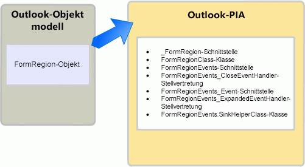

# <a name="objects-in-the-outlook-pia"></a>Objekte in der Outlook-PIA

Wenn Sie die primäre Interopassembly (PIA) für Outlook in einem Objektkatalog durchsuchen, stellen Sie möglicherweise fest, dass viele Schnittstellen und Klassen auf ähnliche Objekte im Outlook-Objektmodell verweisen. Einige Objekte des Objektmodells verfügen über eine 1:1-Zuordnung zu Schnittstellen in der primären Interopassembly. 

**AddressEntry** ist zum Beispiel der [AddressEntry](https://msdn.microsoft.com/library/bb609728\(v=office.15\))-Schnittstelle und das **AddressList**-Objekt der [AddressList](https://msdn.microsoft.com/library/bb623538\(v=office.15\))-Schnittstelle in der PIA zugeordnet. 

Die meisten anderen Objekte haben jedoch eine 1:n-Zuordnung in der PIA. Diese 1:n-Zuordnung gilt für bestimmte Objekte, die vor Microsoft Office Outlook 2007 vorhanden waren, und alle Objekte, die seit Outlook 2007 hinzugefügt wurden. Dieses Thema beinhaltet die typischen einem COM-Objekt zugeordneten .NET-Schnittstellen, Klassen und Delegate und beschreibt den Zugriff auf ein Objekt in der Outlook-PIA. Außerdem werden einige Ausnahmen in der Outlook-PIA beschrieben, bei denen die Objekte im COM-basierten Objektmodell ausgeblendet werden oder veraltet sind.

## <a name="helper-objects"></a>Hilfsobjekte

In diesem Abschnitt werden die typischen Hilfsklassen für ein Objekt in der Outlook-PIA beschrieben, wobei das **FormRegion**-Objekt als Beispiel dient. Das **FormRegion**-Objekt wurde dem Objektmodell in Outlook 2007 hinzugefügt. Zu dem **FormRegion**-Objekt in der PIA gehören die in Abbildung 1 dargestellten Schnittstellen, Klassen und Delegaten.

**Abbildung 1. Das FormRegion-Objekt im Outlook-Objektmodell und in der Outlook-PIA**



Die [FormRegion](https://msdn.microsoft.com/library/bb652633\(v=office.15\))-Schnittstelle ist die Schnittstelle, die Sie am häufigsten für den Zugriff auf das **FormRegion**-Objekt und die zugehörige Methode, Eigenschaft und die Ereinigsmember verwenden. Sie sollten die **FormRegion**-.NET-Schnittstelle jedoch nicht als ein genaues Spiegelbild des **FormRegion**-COM-Objekts ansehen. Wenn Sie den Objektkatalog in Visual Studio ansehen, sehen Sie, dass die **FormRegion**-Schnittstelle von einer anderen Schnittstelle erbt, nämlich der [\_FormRegion](https://msdn.microsoft.com/library/bb645761\(v=office.15\))-Schnittstelle. Tatsächlich ist die **FormRegion**-Schnittstelle nur eine der Schnittstellen und Klassen, die durch die Erstellung der auf der COM-Typbibliothek basierenden Outlook-PIA entstehen.

Zum Erstellen der Outlook-PIA werden in Outlook mit dem Type Library Importer-Tool (Tlbimp.exe) in .NET Framework Typdefinitionen in der COM-Typbibliothek in gleichwertige Definitionen in einer Common Language Runtime-Assembly konvertiert. In COM ist das FormRegion-Objekt eigentlich eine Co-Klasse, die aus den folgenden zwei Schnittstellen besteht, die die Schnittstellen definieren, die vom FormRegion-Objekt implementiert werden:

- Die primäre Schnittstelle **\_FormRegion**

- Die Ereignisschnittstelle [FormRegionEvents](https://msdn.microsoft.com/library/bb611940\(v=office.15\))

Von Tlbimp.exe werden **\_FormRegion** und **FormRegionEvents** direkt aus der Typbibliothek importiert.

Darüber hinaus wird von Tlbimp.exe eine .NET-Schnittstelle mit dem gleichen Namen wie das entsprechende COM-Objekt erstellt sowie eine .NET-Klasse, deren Name den Namen des Objekts und danach "Class" enthält. Im Falle des FormRegion-Objekts erstellt Tlbimp.exe Folgendes:

- Die .NET-Schnittstelle **FormRegion**

- Die .NET-Klasse [FormRegionClass](https://msdn.microsoft.com/library/bb624204\(v=office.15\))

Von den in diesem Thema genannten .NET-Schnittstellen und .NET-Klassen verwenden Sie stets die von Tlbimp.exe erstellte .NET-Schnittstelle, um auf ein Objekt zuzugreifen. Für den Zugriff auf ein FormRegion-Objekt in Visual Basic verwenden Sie z. B. immer die FormRegion-Schnittstelle, wie im folgenden Codebeispiel veranschaulicht:

```vb
Imports Outlook = Microsoft.Office.Interop.Outlook
Sub DemoFormRegion(ByVal Region As Outlook.FormRegion)
    Dim MyFormRegion As Outlook.FormRegion = Region
    ' Additional method code here
End Sub
```

<br/>

```csharp
using Outlook = Microsoft.Office.Interop.Outlook; 
void DemoFormRegion(Outlook.FormRegion region) 
{
    Outlook.FormRegion myFormRegion = region; 
    // Additional method code here
}
```

Informationen über den Zweck der primären Schnittstelle und .NET-Klasse, die TLBIMP importiert bzw. erstellt, finden Sie unter [Methoden und Eigenschaften in der Outlook-PIA](methods-and-properties-in-the-outlook-pia.md). Informationen über den Zweck der ereignisbezogenen Schnittstellen, Delegate und Senkenhilfsklassen finden Sie unter [Ereignisse in der Outlook-PIA](events-in-the-outlook-pia.md).

## <a name="deprecated-objects"></a>Veraltete Objekte

In der Typbibliothek veraltete Objekte werden in der Outlook-PIA zur Verfügung gestellt. Beispielsweise sind das **\_DDocSiteControl**-Objekt und das **\_DRecipientControl**-Objekt in der Typbibliothek verborgen, in der PIA werden sie jedoch verfügbar gemacht.

Ein weiteres Beispiel für ein veraltetes Objekt ist das **MAPIFolder**-Objekt. Seit Outlook 2007 hat das **Folder**-Objekt das **MAPIFolder**-Objekt im Objektmodell ersetzt. In vorhandenen Lösungen sollten Verweise auf **MAPIFolder** durch **Folder** ersetzt werden, und in allen Lösungen, die für Outlook 2007 und höhere Versionen neu sind, sollte nur das **Folder**-Objekt verwendet werden. Für nicht verwaltete Lösungen wird im Objektbrowser des Visual Basic-Editors das **MAPIFolder**-Objekt nicht mehr aufgelistet, auch nicht als verborgenes Objekt. 

Für verwaltete Lösungen gilt: Die Outlook-PIA macht zwar eine [Folder](https://msdn.microsoft.com/library/bb645774\(v=office.15\)) -Schnittstelle verfügbar, über die Sie auf das **Folder**-Objekt und seine Member zugreifen können, aber sie macht auch [MAPIFolder](https://msdn.microsoft.com/library/bb624369\(v=office.15\)) als eine Schnittstelle verfügbar, die die Member des **Folder**-Objekts definiert.

## <a name="see-also"></a>Siehe auch

- [Zuordnen der Outlook-PIA zum Objektmodell](relating-the-outlook-pia-with-the-object-model.md)


