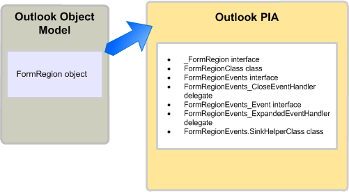

# <a name="objects-in-the-outlook-pia"></a><span data-ttu-id="a2fc8-102">Objekte in der Outlook-PIA</span><span class="sxs-lookup"><span data-stu-id="a2fc8-102">Objects in the Outlook PIA</span></span>

<span data-ttu-id="a2fc8-103">Wenn Sie die primäre Interopassembly (PIA) für Outlook in einem Objektkatalog durchsuchen, stellen Sie möglicherweise fest, dass viele Schnittstellen und Klassen auf ähnliche Objekte im Outlook-Objektmodell verweisen.</span><span class="sxs-lookup"><span data-stu-id="a2fc8-103">When browsing the Outlook Primary Interop Assembly (PIA) in an object browser, you may notice that many interfaces and classes have names referencing familiar objects in the Outlook object model.</span></span> <span data-ttu-id="a2fc8-104">Einige Objekte des Objektmodells verfügen über eine 1:1-Zuordnung zu Schnittstellen in der primären Interopassembly.</span><span class="sxs-lookup"><span data-stu-id="a2fc8-104">Some objects in the object model have a one-to-one mapping to interfaces in the PIA.</span></span> 

<span data-ttu-id="a2fc8-105">**AddressEntry** ist zum Beispiel der [AddressEntry](https://msdn.microsoft.com/library/bb609728\(v=office.15\))-Schnittstelle und das **AddressList**-Objekt der [AddressList](https://msdn.microsoft.com/library/bb623538\(v=office.15\))-Schnittstelle in der PIA zugeordnet.</span><span class="sxs-lookup"><span data-stu-id="a2fc8-105">For example, the **AddressEntry** is mapped to the [AddressEntry](https://msdn.microsoft.com/library/bb609728\(v=office.15\)) interface and the **AddressList** object is mapped to the [AddressList](https://msdn.microsoft.com/library/bb623538\(v=office.15\)) interface in the PIA.</span></span> 

<span data-ttu-id="a2fc8-106">Die meisten anderen Objekte haben jedoch eine 1:n-Zuordnung in der PIA.</span><span class="sxs-lookup"><span data-stu-id="a2fc8-106">However, most other objects have a one-to-many mapping in the PIA.</span></span> <span data-ttu-id="a2fc8-107">Diese 1:n-Zuordnung gilt für bestimmte Objekte, die vor Microsoft Office Outlook 2007 vorhanden waren, und alle Objekte, die seit Outlook 2007 hinzugefügt wurden.</span><span class="sxs-lookup"><span data-stu-id="a2fc8-107">This one-to-many mapping applies to some objects that existed before Microsoft Office Outlook 2007, and all objects added since Outlook 2007.</span></span> <span data-ttu-id="a2fc8-108">Dieses Thema beinhaltet die typischen einem COM-Objekt zugeordneten .NET-Schnittstellen, Klassen und Delegate und beschreibt den Zugriff auf ein Objekt in der Outlook-PIA.</span><span class="sxs-lookup"><span data-stu-id="a2fc8-108">Describes the typical .NET interfaces, classes, and delegates that are mapped to a COM object, and describes how to access an object in the PIA.</span></span> <span data-ttu-id="a2fc8-109">Außerdem werden einige Ausnahmen in der Outlook-PIA beschrieben, bei denen die Objekte im COM-basierten Objektmodell ausgeblendet werden oder veraltet sind.</span><span class="sxs-lookup"><span data-stu-id="a2fc8-109">It also describes a few exceptions in the Outlook PIA where the objects are hidden or deprecated in the COM-based object model.</span></span>

## <a name="helper-objects"></a><span data-ttu-id="a2fc8-110">Hilfsobjekte</span><span class="sxs-lookup"><span data-stu-id="a2fc8-110">Helper Objects</span></span>

<span data-ttu-id="a2fc8-p103">In diesem Abschnitt werden die typischen Hilfsklassen für ein Objekt in der Outlook-PIA beschrieben, wobei das **FormRegion**-Objekt als Beispiel dient. Das **FormRegion**-Objekt wurde dem Objektmodell in Outlook 2007 hinzugefügt. Zu dem **FormRegion**-Objekt in der PIA gehören die in Abbildung 1 dargestellten Schnittstellen, Klassen und Delegaten.</span><span class="sxs-lookup"><span data-stu-id="a2fc8-p103">This section illustrates the typical helper classes for an object in the Outlook PIA by using the **FormRegion** object as an example. The **FormRegion** object was added to the object model in Outlook 2007. Related to the **FormRegion** object in the PIA are the interfaces, classes, and delegates, illustrated in Figure 1.</span></span>

<span data-ttu-id="a2fc8-114">**Abbildung 1. Das FormRegion-Objekt im Outlook-Objektmodell und in der Outlook-PIA**</span><span class="sxs-lookup"><span data-stu-id="a2fc8-114">**Figure 1. The FormRegion object represented in the Outlook object model and in the Outlook PIA**</span></span>



<span data-ttu-id="a2fc8-116">Die [FormRegion](https://msdn.microsoft.com/library/bb652633\(v=office.15\))-Schnittstelle ist die Schnittstelle, die Sie am häufigsten für den Zugriff auf das **FormRegion**-Objekt und die zugehörige Methode, Eigenschaft und die Ereinigsmember verwenden.</span><span class="sxs-lookup"><span data-stu-id="a2fc8-116">The one interface that you most often use to access the **FormRegion** object and its method, property, and event members is the [FormRegion](https://msdn.microsoft.com/library/bb652633\(v=office.15\)) interface.</span></span> <span data-ttu-id="a2fc8-117">Sie sollten die **FormRegion**-.NET-Schnittstelle jedoch nicht als ein genaues Spiegelbild des **FormRegion**-COM-Objekts ansehen. Wenn Sie den Objektkatalog in Visual Studio ansehen, sehen Sie, dass die **FormRegion**-Schnittstelle von einer anderen Schnittstelle erbt, nämlich der [\_FormRegion](https://msdn.microsoft.com/library/bb645761\(v=office.15\))-Schnittstelle.</span><span class="sxs-lookup"><span data-stu-id="a2fc8-117">The one interface that you most often use to access the FormRegion object and its method, property, and event members is the FormRegion interface. However, you should not consider the FormRegion.NET interface as an exact mirror image of the FormRegion COM object; if you look at the Object Browser in Visual Studio, you will find that the FormRegion interface inherits from another interface, the _FormRegion interface. In fact, the FormRegion interface is just one of the few interfaces and classes that result from creating the Outlook PIA based on the COM type library.</span></span> <span data-ttu-id="a2fc8-118">Tatsächlich ist die **FormRegion**-Schnittstelle nur eine der Schnittstellen und Klassen, die durch die Erstellung der auf der COM-Typbibliothek basierenden Outlook-PIA entstehen.</span><span class="sxs-lookup"><span data-stu-id="a2fc8-118">In fact, the **FormRegion** interface is just one of the few interfaces and classes that result from creating the Outlook PIA based on the COM type library.</span></span>

<span data-ttu-id="a2fc8-p105">Zum Erstellen der Outlook-PIA werden in Outlook mit dem Type Library Importer-Tool (Tlbimp.exe) in .NET Framework Typdefinitionen in der COM-Typbibliothek in gleichwertige Definitionen in einer Common Language Runtime-Assembly konvertiert. In COM ist das FormRegion-Objekt eigentlich eine Co-Klasse, die aus den folgenden zwei Schnittstellen besteht, die die Schnittstellen definieren, die vom FormRegion-Objekt implementiert werden:</span><span class="sxs-lookup"><span data-stu-id="a2fc8-p105">To create the Outlook PIA, Outlook uses the Type Library Importer (TLBIMP) in the .NET Framework to convert type definitions in the COM type library into equivalent definitions in a Common Language Runtime assembly. In COM, the **FormRegion** object is actually a coclass that consists of the following two interfaces defining the interfaces that the **FormRegion** object implements:</span></span>

- <span data-ttu-id="a2fc8-121">Die primäre Schnittstelle **\_FormRegion**</span><span class="sxs-lookup"><span data-stu-id="a2fc8-121">The primary interface _FormRegion</span></span>

- <span data-ttu-id="a2fc8-122">Die Ereignisschnittstelle [FormRegionEvents](https://msdn.microsoft.com/library/bb611940\(v=office.15\))</span><span class="sxs-lookup"><span data-stu-id="a2fc8-122">The event interface [FormRegionEvents](https://msdn.microsoft.com/library/bb611940\(v=office.15\))</span></span>

<span data-ttu-id="a2fc8-123">Von Tlbimp.exe werden **\_FormRegion** und **FormRegionEvents** direkt aus der Typbibliothek importiert.</span><span class="sxs-lookup"><span data-stu-id="a2fc8-123">TLBIMP directly imports _FormRegion and FormRegionEvents from the type library.</span></span>

<span data-ttu-id="a2fc8-p106">Darüber hinaus wird von Tlbimp.exe eine .NET-Schnittstelle mit dem gleichen Namen wie das entsprechende COM-Objekt erstellt sowie eine .NET-Klasse, deren Name den Namen des Objekts und danach "Class" enthält. Im Falle des FormRegion-Objekts erstellt Tlbimp.exe Folgendes:</span><span class="sxs-lookup"><span data-stu-id="a2fc8-p106">Other than importing the primary interface and event interface, TLBIMP creates a .NET interface that has the same name as the COM object, and a .NET class that uses the name of the object and appends it with "Class". In the case of the **FormRegion** object, TLBIMP creates the following:</span></span>

- <span data-ttu-id="a2fc8-126">Die .NET-Schnittstelle **FormRegion**</span><span class="sxs-lookup"><span data-stu-id="a2fc8-126">The .NET interface **FormRegion**</span></span>

- <span data-ttu-id="a2fc8-127">Die .NET-Klasse [FormRegionClass](https://msdn.microsoft.com/library/bb624204\(v=office.15\))</span><span class="sxs-lookup"><span data-stu-id="a2fc8-127">The .NET class [FormRegionClass](https://msdn.microsoft.com/library/bb624204\(v=office.15\))</span></span>

<span data-ttu-id="a2fc8-p107">Von den in diesem Thema genannten .NET-Schnittstellen und .NET-Klassen verwenden Sie stets die von Tlbimp.exe erstellte .NET-Schnittstelle, um auf ein Objekt zuzugreifen. Für den Zugriff auf ein FormRegion-Objekt in Visual Basic verwenden Sie z. B. immer die FormRegion-Schnittstelle, wie im folgenden Codebeispiel veranschaulicht:</span><span class="sxs-lookup"><span data-stu-id="a2fc8-p107">Of the .NET interfaces and .NET class mentioned in this topic, you always use the .NET interface that TLBIMP creates to access an object. For example, to access a **FormRegion** object in VB, you always use the **FormRegion** interface, as in the following code example:</span></span>

```vb
Imports Outlook = Microsoft.Office.Interop.Outlook
Sub DemoFormRegion(ByVal Region As Outlook.FormRegion)
    Dim MyFormRegion As Outlook.FormRegion = Region
    ' Additional method code here
End Sub
```

<br/>

```csharp
using Outlook = Microsoft.Office.Interop.Outlook; 
void DemoFormRegion(Outlook.FormRegion region) 
{
    Outlook.FormRegion myFormRegion = region; 
    // Additional method code here
}
```

<span data-ttu-id="a2fc8-130">Informationen über den Zweck der primären Schnittstelle und .NET-Klasse, die TLBIMP importiert bzw. erstellt, finden Sie unter [Methoden und Eigenschaften in der Outlook-PIA](methods-and-properties-in-the-outlook-pia.md).</span><span class="sxs-lookup"><span data-stu-id="a2fc8-130">For information about the purpose of the primary interface and the .NET class that TLBIMP imports and creates respectively, see [Methods and Properties in the Outlook PIA](methods-and-properties-in-the-outlook-pia.md). For information about the purpose of the event-related interfaces, delegates, and sink helper classes, see Events in the Outlook PIA.</span></span> <span data-ttu-id="a2fc8-131">Informationen über den Zweck der ereignisbezogenen Schnittstellen, Delegate und Senkenhilfsklassen finden Sie unter [Ereignisse in der Outlook-PIA](events-in-the-outlook-pia.md).</span><span class="sxs-lookup"><span data-stu-id="a2fc8-131">For information about the purpose of the primary interface and the .NET class that TLBIMP imports and creates respectively, see Methods and Properties in the Outlook PIA. For information about the purpose of the event-related interfaces, delegates, and sink helper classes, see [Events in the Outlook PIA](events-in-the-outlook-pia.md).</span></span>

## <a name="deprecated-objects"></a><span data-ttu-id="a2fc8-132">Veraltete Objekte</span><span class="sxs-lookup"><span data-stu-id="a2fc8-132">Deprecated Objects</span></span>

<span data-ttu-id="a2fc8-133">In der Typbibliothek veraltete Objekte werden in der Outlook-PIA zur Verfügung gestellt.</span><span class="sxs-lookup"><span data-stu-id="a2fc8-133">Objects deprecated in the type library are exposed in the Outlook PIA.</span></span> <span data-ttu-id="a2fc8-134">Beispielsweise sind das **\_DDocSiteControl**-Objekt und das **\_DRecipientControl**-Objekt in der Typbibliothek verborgen, in der PIA werden sie jedoch verfügbar gemacht.</span><span class="sxs-lookup"><span data-stu-id="a2fc8-134">For example, the _DDocSiteControl and _DRecipientControl objects are hidden in the type library but are exposed in the PIA.</span></span>

<span data-ttu-id="a2fc8-135">Ein weiteres Beispiel für ein veraltetes Objekt ist das **MAPIFolder**-Objekt.</span><span class="sxs-lookup"><span data-stu-id="a2fc8-135">Another example of a deprecated object is the **MAPIFolder** object.</span></span> <span data-ttu-id="a2fc8-136">Seit Outlook 2007 hat das **Folder**-Objekt das **MAPIFolder**-Objekt im Objektmodell ersetzt.</span><span class="sxs-lookup"><span data-stu-id="a2fc8-136">Starting in Outlook 2007, the **Folder** object has replaced the **MAPIFolder** object in the object model.</span></span> <span data-ttu-id="a2fc8-137">In vorhandenen Lösungen sollten Verweise auf **MAPIFolder** durch **Folder** ersetzt werden, und in allen Lösungen, die für Outlook 2007 und höhere Versionen neu sind, sollte nur das **Folder**-Objekt verwendet werden.</span><span class="sxs-lookup"><span data-stu-id="a2fc8-137">Existing solutions should replace references to **MAPIFolder** by **Folder**, and all solutions new for Outlook 2007 and after should use only the **Folder** object.</span></span> <span data-ttu-id="a2fc8-138">Für nicht verwaltete Lösungen wird im Objektbrowser des Visual Basic-Editors das **MAPIFolder**-Objekt nicht mehr aufgelistet, auch nicht als verborgenes Objekt.</span><span class="sxs-lookup"><span data-stu-id="a2fc8-138">For unmanaged solutions, the Object Browser of the Visual Basic Editor no longer lists the **MAPIFolder** object, not even as a hidden object.</span></span> 

<span data-ttu-id="a2fc8-139">Für verwaltete Lösungen gilt: Die Outlook-PIA macht zwar eine [Folder](https://msdn.microsoft.com/library/bb645774\(v=office.15\)) -Schnittstelle verfügbar, über die Sie auf das **Folder**-Objekt und seine Member zugreifen können, aber sie macht auch [MAPIFolder](https://msdn.microsoft.com/library/bb624369\(v=office.15\)) als eine Schnittstelle verfügbar, die die Member des **Folder**-Objekts definiert.</span><span class="sxs-lookup"><span data-stu-id="a2fc8-139">For managed solutions, even though the Outlook PIA exposes a [Folder](https://msdn.microsoft.com/library/bb645774\(v=office.15\)) interface through which you access the **Folder** object and its members, the Outlook PIA also exposes [MAPIFolder](https://msdn.microsoft.com/library/bb624369\(v=office.15\)) as an interface that defines the members of the **Folder** object.</span></span>

## <a name="see-also"></a><span data-ttu-id="a2fc8-140">Siehe auch</span><span class="sxs-lookup"><span data-stu-id="a2fc8-140">See also</span></span>

- [<span data-ttu-id="a2fc8-141">Zuordnen der Outlook-PIA zum Objektmodell</span><span class="sxs-lookup"><span data-stu-id="a2fc8-141">Relating the Outlook PIA with the Object Model</span></span>](relating-the-outlook-pia-with-the-object-model.md)


