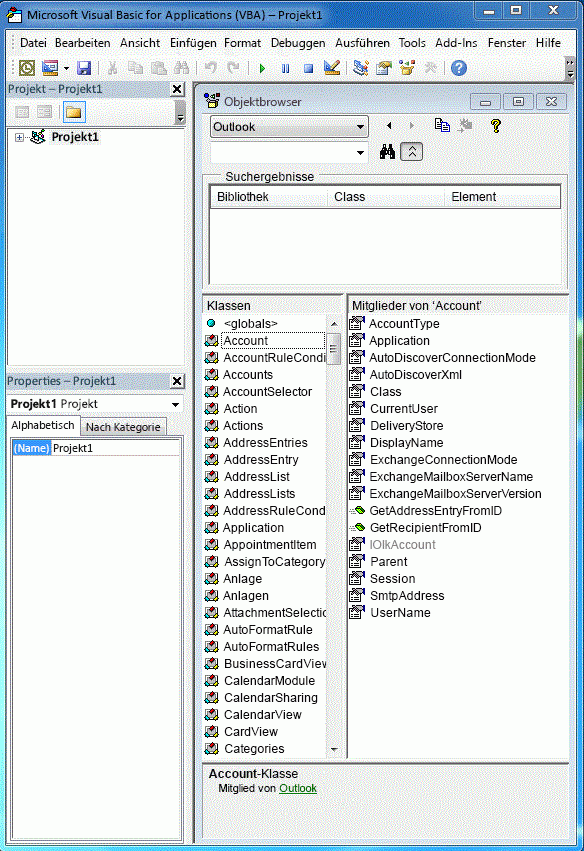

# Zuordnen der Outlook-PIA zum Objektmodell

Die primäre Interopassembly (Primary Interop Assembly, PIA) von Outlook ist eine offiziell von Outlook veröffentlichte Interopassembly, die eine verwaltete Schnittstelle für die Interaktion von verwalteten Add-Ins mit dem COM-basierten Outlook-Objektmodell definiert. In [Einführung in die Interoperabilität zwischen COM und .NET](introduction-to-interoperability-between-com-and-net.md) wird beschrieben, wie eine Interopassembly technisch die Programmierung eines verwalteten Clients mit einer COM-basierten Typbibliothek unterstützt. In diesem Thema lesen Sie, wie Objekte und Member im COM-basierten Outlook-Objektmodell den entsprechenden verwalteten Schnittstellen und Klassen in der PIA zugeordnet sind.

## Hilfsobjekte

Wenn Sie die Objekte der Outlook-Typbibliothek, die, wie in Abbildung 1 dargestellt, im Objektkatalog des Visual Basic-Editors aufgeführt sind, mit den Objekten der PIA vergleichen, die im Objektkatalog von Visual Studio aufgeführt sind (wie in Abbildung 2 dargestellt), werden Sie erstaunt sein, wie viele zusätzliche Hilfsobjekte in der PIA vorhanden sind. Sie werden feststellen, dass einige Objekte, z. B. das **Action**-Objekt, einer Schnittstelle zugeordnet ist, und zwar der [Action](https://msdn.microsoft.com/library/bb646971\(v=office.15\))-Schnittstelle, dass aber andere Objekte, z. B. das **Account**-Objekt nicht unbedingt genau einer entsprechenden Schnittstelle in der PIA zugeordnet sind.

**Abbildung 1. Objektkatalog mit Objekten in der COM-basierten Outlook-Typbibliothek**

**Abbildung 2. Objektkatalog mit Objekten in Outlook**

Viele von diesen Schnittstellen haben Namen, die mit einem Unterstrich ("\_") beginnen, auf den ein Objektname folgt. Beispielsweise ist das **Account**-Objekt im Visual Studio-Objektbrowser einer öffentlichen Schnittstelle \_Account und einer öffentlichen Klasse Account zugeordnet. Tatsächlich ist das **Account**-Objekt zwei Schnittstellen und einer Klasse in der PIA zugeordnet, auch wenn dies im Visual Studio-Objektbrowser nicht explizit angezeigt wird: einer [\_Account](https://msdn.microsoft.com/library/bb609471\(v=office.15\))-Schnittstelle, einer [Account](https://msdn.microsoft.com/library/bb645103\(v=office.15\))-Co-Klasse und einer [AccountClass](https://msdn.microsoft.com/library/bb645768\(v=office.15\))-Klasse. 

Weitere Informationen zu diesen Schnittstellen, Co-Klassen und Klassen, woher sie stammen und wie Objekte von der Typbibliothek auf die PIA abgebildet werden, finden Sie unter [Objekte in der Outlook-PIA](objects-in-the-outlook-pia.md).

## Separate Ereignisschnittstellen

Wenn Sie einmal Objekte betrachten, die Ereignisse enthalten, so stellen Sie fest, dass Ereignisse in der PIA nicht mit anderen Methoden- und Eigenschaftsmembern dieses Objekts zusammen gruppiert sind, sondern getrennt, sodass sie eigene Schnittstellen, Ereignishandler und Klassen bilden. 

Weitere Informationen dazu, wie Methoden und Eigenschaften von der Typbibliothek auf die PIA abgebildet werden, finden Sie unter [Methoden und Eigenschaften in der Outlook-PIA](methods-and-properties-in-the-outlook-pia.md). Weitere Informationen zu Ereignisschnittstellen, Stellvertretungen und Klassen finden Sie unter [Ereignisse in der Outlook-PIA](events-in-the-outlook-pia.md).

## Verborgene und veraltete Objekte

Die PIA enthält auch Objekte, Member und Enumerationen, die veraltet sind und optional als ausgeblendet im COM-Objektmodells gekennzeichnet wurden. Die meisten dieser Objekte, Member und Enumerationen werden in der PIA verfügbar gemacht. Allerdings werden sie nur für die Vollständigkeit der PIA verfügbar gemacht. Sie sind nicht mehr zur Verwendung durch Lösungsentwickler vorgesehen und sind daher minimal dokumentiert. Es gibt ein paar Ausnahmen, z. B. das **\_DocSiteControl**- und das **\_RecipientControl**-Objekt, die in der Typbibliothek ausgeblendet sind, aber in der PIA-Referenz als Objekte der ersten Klasse verfügbar gemacht werden. 

Weitere Informationen zum **\_DocSiteControl**-Objekt finden Sie unter [\_DDocSiteControl](https://msdn.microsoft.com/library/bb609520\(v=office.15\)). Weitere Informationen zum **\_RecipientControl**-Objekt finden Sie unter [\_DRecipientControl](https://msdn.microsoft.com/library/bb609501\(v=office.15\)).

