# Auswählen einer API oder Technologie für die Entwicklung von Lösungen für Outlook

In diesem Artikel werden die APIs und Technologien beschrieben, mit denen Sie Outlook 2013 und Outlook 2016 erweitern können, und Sie erhalten Entscheidungshilfen bei der Auswahl der geeigneten API oder Technologie für Ihr Szenario.
  
Microsoft unterstützt mehrere API‘s und Technologien, die Outlook erweitern: 
  
- Ab Office 2013 eröffnet die Apps für Office-Plattform Möglichkeiten der Erweiterung von Outlook-Funktionen über Outlook-Clients auf dem Desktop, dem Tablet-PC und dem Smartphone hinweg. Die Plattform umfasst eine JavaScript-API für Office und ein Schema für App-Manifeste.
    
- Das Objektmodell, die entsprechende primäre Interop-Assembly (PIA) für Office und die Messaging-API (MAPI) sind die in Outlook-Lösungen gängigsten APIs.
    
- In einigen Szenarien wird die MAPI durch Hilfs-APIs ergänzt.
    
- Die OSC-Anbietererweiterung (Outlook Social Connector, Outlook Connector für soziale Netzwerke) und die Wetterleistenerweiterung dienen spezifischen Szenarien der entsprechenden Nischenmärkte.
    
In diesem Artikel werden die Auswahlkriterien für die Office-Add-Ins-Plattform, das Objektmodell, die PIA und die MAPI erläutert. Beachten Sie, dass Office-Add-Ins die JavaScript-API für Office verwenden und nicht das Objektmodell aufrufen und umgekehrt. Lösungen, in denen die anderen APIs verwendet werden, können eine oder mehrere APIs verwenden. Beispielsweise können in einem in C++ geschriebenen COM-Add-In das Objektmodell, die MAPI und Hilfs-APIs gleichzeitig genutzt werden.
  
Die Informationen in diesem Artikel sind dann besonders nützlich für Sie, wenn Sie mit Outlook auf der Benutzerebene vertraut sind und über allgemeine Kenntnisse in der Softwareentwicklung verfügen. Sie benötigen jedoch kein Detailwissen über die Features, die von diesen APIs oder Technologien unterstützt werden. Dieser Artikel hilft Ihnen, folgende Fragen zu beantworten:
  
- Welche weiteren Kriterien sollten Sie bei der Auswahl einer API berücksichtigen, wenn Sie nur eine Vorstellung vom Zweck der zu entwickelnden Lösung, dem Zielmarkt und den verfügbaren Ressourcen haben?
    
- Warum sollten Sie Office-Add-Ins in Betracht ziehen, und wann würden Sie Apps und keine Add-Ins erstellen?
    
- Inwiefern beeinflusst es die Auswahl einer API, wenn die Lösung mit früheren Versionen von Outlook, einschließlich Outlook 2003, ausgeführt werden muss?
    
- Welche API wäre am besten geeignet, wenn die Lösung Outlook-Ordner durchlaufen muss, die Tausende von Elementen enthalten, und Sie in der Lage sein müssen, diese Elemente zu ändern?
    
- Ist das Outlook-Objektmodell die beste Wahl, wenn Ihre Lösung die Outlook-Geschäftslogik umfassend nutzt und mit anderen Office-Anwendungen interagiert?
    
- Was können Sie mithilfe des Objektmodells und der MAPI in Outlook erweitern?
    
- Wenn Sie entweder das Objektmodell oder MAPI verwenden können, um die Aufgabe zu erzielen, wie können Sie entscheiden, welche der API Sie verwenden sollen?

## Objektive Bewertungskriterien

In diesem Abschnitt werden Kriterien beschrieben, anhand derer Sie die Office-Add-Ins-Plattform, das Objektmodell, die PIA und die MAPI miteinander vergleichen können, um herauszufinden, welche Methode Ihre Anforderungen am besten erfüllt. Dabei können die verschiedenen Kriterien je nach Projekt und verfügbaren Ressourcen mehr oder weniger ins Gewicht fallen.
  
In den Tabellen in diesem Abschnitt werden Bewertungskriterien beschrieben, die sich wie folgt kategorisieren lassen:
  
- Funktionale Kriterien: Es wird beschrieben, was Sie mit der Technologie tun können und was nicht.
    
- Entwicklungsbezogene Kriterien: Hier werden die Entwicklungstools oder Informationen erklärt, die Sie benötigen, um die Technologie verwenden zu können.
    
- Sicherheitsbezogene Kriterien: Hier werden Sicherheitsaspekte und Informationen in Bezug auf Berechtigungen im Zusammenhang mit der Technologie erläutert.
    
- Bereitstellungsspezifische Kriterien: Die empfohlenen Bereitstellungs- und Verteilungsmethoden für die Technologie werden beschrieben.

### Objektive Bewertungskriterien für die Apps für die Office-Plattform

Ab Office 2013 können Entwickler die Office-Add-Ins-Plattform verwenden, um Webdienste und Inhalte in den Kontext von Rich-Office- und Webclients zu erweitern. Eine Office-Add-In ist eine Webseite, die mit gängigen Webtechnologien entwickelt wurde, in einer Office-Clientanwendung (wie Outlook) gehostet wird und lokal oder in der Cloud ausgeführt werden kann. Von den wenigen Typen von Office-Add-Ins wird der Typ, der Outlook unterstützt, als Mail-App bezeichnet. Das Objektmodell, die PIA und die MAPI werden zwar häufig zur Automatisierung von Outlook auf Anwendungsebene verwendet, doch Sie können die JavaScript-API für Office verwenden, um mit den Inhalten und Eigenschaften einer E-Mail-Nachricht, einer Besprechungsanfrage oder eines Termins auf Elementebene zu interagieren. Sie können Mail-Apps im Office Store oder einem internen Exchange-Katalog veröffentlichen. 
  
Endbenutzer und Administratoren können Mail-Apps in einem Exchange-Postfach installieren und im Rich-Outlook-Client sowie in Outlook Web App verwenden. Als Entwickler haben Sie die Wahl, Ihre Mail-App nur auf dem Desktop oder auch auf dem Tablet-PC oder dem Smartphone verfügbar zu machen. In Abbildung 1 ist ein Beispiel für eine YouTube-Mail-App dargestellt, die in [Beispiel: Erstellen einer Mail-App in Outlook zum Wiedergeben von YouTube-Videos](https://code.msdn.microsoft.com/office/Mail-apps-for-Outlook-01c9248f) ausführlich beschrieben wird. Mithilfe der YouTube-Mail-App können Endbenutzer eine URL für ein YouTube-Video auswählen und das Video in Outlook oder Outlook Web App, auf dem Desktop oder auf dem Tablet-PC anzeigen.
  
**Abbildung 1: YouTube-Mail-App ist für die ausgewählte Nachricht aktiv, die eine URL zu einem Video auf YouTube.com enthält**

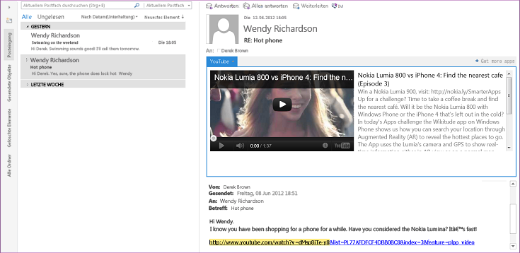
  
Sobald ein Benutzer eine Mail-App installiert hat, kann die App in der App-Leiste verwendet werden, wenn der aktuelle Inhalt die von der App festgelegten Aktivierungsbedingungen erfüllt. Eine Mail-App erlaubt Ihnen, Regeln zum aktuell ausgewählten Element anzugeben, die eine Mail-App nur dann aktivieren, wenn bestimmte Regeln erfüllt sind. So ist die YouTube-Mail-App, mit der Sie ein YouTube-Video in Outlook wiedergeben können, nur dann relevant, wenn das ausgewählte Outlook-Element eine URL zu einem Video auf YouTube.com enthält. In diesem Fall würden Sie angeben, dass die App nur dann aktiv sein soll, wenn die ausgewählte Nachricht eine solche URL enthält.
  
Die folgenden Tabellen enthalten die Bewertungskriterien für die Office-Add-Ins-Plattform.
  
#### Funktionale Kriterien

|**Kriterium**|**Mail-Apps-Unterstützung in Apps für Office-Plattform**|
|:-----|:-----|
|Anwendungsdomäne    |Eine Mail-App kann quasi für jedes unterstützte Nachrichten- oder Terminelement im Exchange-Postfach des Benutzers verwendet werden, das der Benutzer ausgewählt hat und das die Aktivierungsbedingungen erfüllt. Von den Berechtigungen einer Mail-App hängt deren Zugriff auf die Eigenschaften und spezifischen Entitäten (wie eine E-Mail-Adresse oder Telefonnummer) ab, die für dieses Element vorhanden sind. So hat z. B. eine Mail-App, welche die Berechtigung **Lese-/Schreibzugriff für Postfach** anfordert, Lese- und Schreibrechte für alle Eigenschaften eines Elements im Postfach des Benutzers. Darüber hinaus kann sie alle Ordner oder Elemente erstellen und lesen und in diese schreiben, und sie kann ein Element von diesem Postfach aus versenden.    |
|Übergeordnete Objekte    |Die JavaScript-API für Office bietet einige Objekte auf oberster Ebene, die von allen Typen von Office-Add-Ins gemeinsam verwendet werden: [Office](https://msdn.microsoft.com/library/c490b13d-ee52-4291-af5d-f4a5a11d3af0%28Office.15%29.aspx), [Context](https://msdn.microsoft.com/library/662883d5-b86f-4bdc-99f0-9ee9129ed16c%28Office.15%29.aspx) und [AysncResult](https://msdn.microsoft.com/library/540c114f-0398-425c-baf3-7363f2f6bc47%28Office.15%29.aspx). Die nächste Ebene in der API, die sich auf Mail-Apps bezieht und für diese spezifisch ist, umfasst die Objekte [Mailbox](https://msdn.microsoft.com/library/a3880d3b-8a09-4cf9-9274-f2682cb3b769%28Office.15%29.aspx), [Item](https://msdn.microsoft.com/library/ad288df1-3ca2-474c-bea4-c51f46e6fc43%28Office.15%29.aspx) und [UserProfile](https://msdn.microsoft.com/library/6d0a36ec-0d5c-40e3-9f6f-9a7fcf0ac3d8%28Office.15%29.aspx), welche den Abruf von Informationen über den Benutzer und das aktuell im Postfach des Benutzers ausgewählte Element unterstützen. Auf der Datenebene unterstützen die Objekte [CustomProperties](https://msdn.microsoft.com/library/95a69bd6-c4dc-429a-8b27-e2b68f74f3e3%28Office.15%29.aspx) und [RoamingSettings](https://msdn.microsoft.com/library/cf21bb08-7274-4ad6-ae9e-b2c12f92abc9%28Office.15%29.aspx) persistente Eigenschaften, die von der Mail-App für das ausgewählte Element bzw. das Postfach des Benutzers eingerichtet wurden. Objekte auf Elementebene umfassen die Objekte [Appointment](https://msdn.microsoft.com/library/08ebffff-eb52-4e21-9d4e-8f79e426f992%28Office.15%29.aspx) und [Message](https://msdn.microsoft.com/library/909ad9eb-a1bc-4caa-b51e-fd59a02b9569%28Office.15%29.aspx), die von **Item** erben, und das Objekt [MeetingRequest](https://msdn.microsoft.com/library/c658fa3d-1138-4a67-9a4b-c9edd11f8385%28Office.15%29.aspx), das von **Message** erbt. Diese stellen die Typen von Outlook-Elementen dar, die E-Mail-Apps unterstützen: Kalenderelemente von Terminen und Besprechungen und Nachrichtenelemente wie E-Mail-Nachrichten, Besprechungsanfragen, Antworten und Absagen. Außerhalb dieser Ebene in der API befinden sich Eigenschaften auf Elementebene (wie [Appointment.subject](https://msdn.microsoft.com/library/ffa6812c-34b8-4b0a-8f92-22c3580c8379%28Office.15%29.aspx)) sowie Objekte und Eigenschaften, die bestimmte bekannte [Entities](https://msdn.microsoft.com/library/1a06c8d1-dafe-46f4-967e-dd9b1d5b20e9%28Office.15%29.aspx)-Objekte unterstützen (z. B. [Contact](https://msdn.microsoft.com/library/2604b44c-7b79-47f0-ac3e-7d99bc9e6751%28Office.15%29.aspx), [MeetingSuggestion](https://msdn.microsoft.com/library/9726fbff-0f4f-4b70-8deb-effc14607d4e%28Office.15%29.aspx), [PhoneNumber](https://msdn.microsoft.com/library/cc86426a-2730-4774-9067-0611e5c8e9c1%28Office.15%29.aspx) und [TaskSuggestion](https://msdn.microsoft.com/library/16b0c3d6-adf4-4a88-ad09-4bb5565816b1%28Office.15%29.aspx)).    Eine Übersicht über die bei Mail-Apps unterstützten Funktionen finden Sie unter [Übersicht über Architektur und Features von Outlook-Add-Ins](https://msdn.microsoft.com/library/2cd5641b-492b-4431-8388-7fc589163e9c%28Office.15%29.aspx).    |
|Datenzugriffsmodell    |In der JavaScript-API für Office werden die folgenden Funktionen als ein hierarchisch strukturierter Satz von Objekten dargestellt: die Laufzeitumgebung der App, Postfach und Profil des Benutzers und Daten zu einem Element.    |
|Threadmodelle    |Jede Mail-App führt ihren eigenen Prozess getrennt vom Outlook-Prozess aus.    |
|Anwendungsarchitekturen    |In Outlook ist eine Mail-App ein Satz von HTML- und JavaScript-Webseiten, die als separater Prozess in einem Webbrowsersteuerelement gehostet werden, das wiederum in einem App-Laufzeitprozess gehostet wird, der Sicherheit und Leistungsisolation bietet.    |
|Remoteverwendung    |Mail-Apps verwenden die JavaScript-API für Office, um Daten zum aktuellen Benutzer, zum Postfach und zum ausgewählten Element abzurufen, die auf dem entsprechenden Exchange Server gespeichert sind. Sofern Mail-Apps über die entsprechenden Berechtigungen verfügen und die entsprechende Technik für domänenübergreifenden Zugriff verwenden, können Mail-Apps auch Exchange-Webdienste und andere externe Webdienste aufrufen, um ihre Funktionen zu erweitern.    |
|Transaktionen    |Die JavaScript-API für Office unterstützt keine Transaktionen.    |
|Verfügbarkeit    |Die JavaScript-API für Office ist ab Outlook 2013 für Postfächer auf Exchange Server 2013 verfügbar.    |
   
#### Entwicklungsbezogene Kriterien

|**Kriterium**|**Mail-Apps-Unterstützung in Apps für Office-Plattform**|
|:-----|:-----|
|Sprachen und Tools    |Sie können Mail-Apps mit jeder gängigen Webtechnologie, z. B. HTML5, JavaScript, CSS3, XML und REST-APIs, implementieren. Sie können Ihr bevorzugtes Webentwicklungstool verwenden. Alternativ können Sie Napa, Visual Studio 2012 oder eine spätere Version dieser Tools verwenden und so Zeit bei der Entwicklung sparen.    |
|Verwaltete Implementierung    |Sofern in Ihrem Szenario geeignet, können Sie verwaltete .aspx-Seiten verwenden, um für Ihre Mail-Apps serverseitigen Code zu implementieren.    |
|Skriptfähigkeit    |Die JavaScript-API für Office wird direkt in Skripts verwendet.    |
|Test- und Debuggingtools    |Sie können ein beliebiges Webentwicklungstool verwenden. Napa und Visual Studio bieten eine integrierte Entwicklungsumgebung, die das Testen und Debugging von Apps erleichtert. Unter [Problembehandlung für die Aktivierung von Outlook-Add-Ins](https://msdn.microsoft.com/library/da5b56c9-7fd1-4556-8c0e-f489c4c9e9b6%28Office.15%29.aspx) und [Beispiel: Debug-Eigenschaften von Outlook-Elementen](https://code.msdn.microsoft.com/office/Mail-apps-for-Outlook-faca78cd) finden Sie nähere Informationen zur Problembehandlung und zum Debugging bei Mail-Apps.    |
|Verfügbarkeit von Experten    |Entwickler, die erfolgreich Office-Add-Ins entwickeln können, sind relativ leicht zu finden. Die Plattform ist für die Entwicklung sowohl im professionellen als auch im privaten Bereich gedacht.    |
|Verfügbare Informationen    |Informationen zur Entwicklung und Veröffentlichung von Office-Add-Ins finden Sie unter [Erstellen von Apps für Office und SharePoint](https://msdn.microsoft.com/office/apps/fp160950.aspx). Eine spezielle Dokumentation für Mail-Apps finden Sie unter [Outlook-Add-Ins](https://msdn.microsoft.com/library/71e64bc9-e347-4f5d-8948-0a47b5dd93e6%28Office.15%29.aspx).    |
|Lizenzbestimmungen für Entwicklung und Bereitstellung    |Unter [Lizenzieren von Office- und SharePoint-Add-Ins](https://msdn.microsoft.com/library/3e0e8ff6-66d6-44ff-b0c2-59108ebd9181%28Office.15%29.aspx) finden Sie Informationen zum App-Lizenzframework für Office-Add-Ins.    |
   
#### Sicherheitsbezogene Kriterien

|**Kriterium**|**Mail-Apps-Unterstützung in Apps für Office-Plattform**|
|:-----|:-----|
|Berechtigungen zur Entwurfszeit    |Für die Entwicklung von Mail-Apps benötigen Sie keine besonderen Berechtigungen.    |
|Setupberechtigungen    |Endbenutzer und Administratoren können standardmäßig Mail-Apps mit niedriger Vertrauenswürdigkeit installieren, welche die Berechtigung **Eingeschränkt** oder **Element lesen** erfordern, und Administratoren können Mail-Apps mit hoher Vertrauenswürdigkeit installieren, welche die Berechtigung **Lese-/Schreibzugriff für Postfach** erfordern.    |
|Laufzeitberechtigungen    |Mail-Apps fordern eine bestimmte Berechtigungsstufe an, die auf einem dreistufigen Berechtigungsmodell basiert: **Eingeschränkt**, **Element lesen** und **Lese-/Schreibzugriff für Postfach**.    |
|Integrierte Sicherheitsfeatures    | Die Office-Add-Ins-Laufzeit bietet die folgenden Vorteile, um zu verhindern, dass eine App die Umgebung des Benutzers beschädigt:     Isolation des Prozesses, in dem die App ausgeführt wird     Kein Ersetzen der .dll- oder .exe-Datei und keine ActiveX-Komponenten     Apps können problemlos vom Endbenutzer installiert und deinstalliert werden.     Der Administrator und der Endbenutzer können steuern, welche Mail-Apps verfügbar gemacht werden, und ob die angeforderte Berechtigung gewährt wird, bevor eine Mail-App installiert wird.     Bei Rich-Clients wird die Nutzung von Speicherplatz und CPU gesteuert, um Dienstausfälle und bösartige Angriffe zu verhindern.    |
|Features zur Sicherheitsüberwachung    | Bei Mail-Apps werden die folgenden Ressourcen überwacht:     CPU-Kernauslastung     Speicherauslastung     Anzahl der Abstürze     Dauer der Sperrung einer Anwendung     Reaktionszeit für reguläre Ausdrücke     Häufigkeit der Neubewertung regulärer Ausdrücke     Administratoren können Standardeinstellungen, welche die Ressourcenauslastung steuern, überschreiben.    |
   
#### Bereitstellungspezifische Kriterien

|**Kriterium**|**Mail-Apps-Unterstützung in Apps für Office-Plattform**|
|:-----|:-----|
|Anforderungen an die Serverplattform    |Das Postfach des Benutzers, für das eine Mail-App installiert wird, muss sich auf Exchange Server 2013 oder einer höheren Version befinden.    |
|Anforderungen an die Clientplattform    |Damit eine Mail-App auf dem Outlook-Rich-Client ausgeführt wird, müssen Outlook 2013 und Internet Explorer 9 oder eine höhere Version dieser Anwendungen auf dem lokalen Computer installiert sein.    |
|Bereitstellungsmethoden    |Sie können Mail-Apps im Office Store oder einem Exchange-Katalog veröffentlichen, wodurch die App Benutzern auf diesem Exchange Server zur Verfügung gestellt wird. Administratoren oder Benutzer haben dann die Wahl, eine Mail-App vom Office Store oder Exchange-Katalog aus über das Exchange Admin Center (EAC) oder durch Ausführung von Windows PowerShell-Remote-Cmdlets zu installieren. Sie können das EAC über die Backstage-Ansicht von Outlook oder Outlook Web App aufrufen. Sie können sich alternativ auch direkt beim EAC für Ihr Postfach anmelden.    Weitere Informationen hierzu finden Sie unter [Bereitstellen und Installieren von Outlook-Add-Ins zu Testzwecken](https://msdn.microsoft.com/library/d6eea4c4-bb21-4f24-bcba-1eccbb4e12dd%28Office.15%29.aspx).    |
|Hinweise zur Bereitstellung    |Sobald Sie eine Mail-App in Outlook oder Outlook Web App installieren, ist die Mail-App für dieses Postfach auf beiden Outlook-Clients verfügbar.    |

### Objektive Bewertungskriterien für das Objektmodell und die PIA

Auf dem Clientcomputer ausgeführte Lösungen können das Outlook-Objektmodell oder die Outlook-PIA verwenden, um Outlook-Elemente wie Kontakte, Nachrichten, Kalenderelemente, Besprechungsanfragen und Aufgaben programmgesteuert aufzurufen. Anders als die MAPI können das Outlook-Objektmodell und die PIA bei Änderungen der Outlook-Benutzeroberfläche, wie einer Änderung des aktuellen Ordners oder der Anzeige eines Outlook-Inspectors, Ereignisbenachrichtigungen bereitstellen.
  
> [!NOTE]
> Für eine Lösung für den Zugriff auf Daten, die in einem Microsoft Exchange-Postfach oder einer Persönlichen Ordner-Datei (PST) gespeichert sind, muss Outlook auf dem Clientcomputer installiert und konfiguriert sein, auf dem die Anwendung ausgeführt wird. Das Outlook-Objektmodell und die PIA unterstützen die gleichen Funktionen zur Erweiterung von Outlook. Die PIA definiert verwaltete Schnittstellen, die dem COM-basierten Objektmodell zugeordnet sind und mit denen eine verwaltete Lösung interagieren kann. In den restlichen Erläuterungen in diesem Abschnitt beziehen sich die meisten der funktions-, sicherheits- und bereitstellungsbezogenen Kriterien gleichermaßen auf das Objektmodell wie auf die PIA. Weitere Informationen dazu, wie die PIA die Interoperabilität zwischen COM und dem .NET Framework erleichtert, finden Sie unter [Einführung in die Interoperabilität zwischen COM und .NET](https://msdn.microsoft.com/library/6b2d099a-ec6f-4099-aaf6-e61003fe5a32%28Office.15%29.aspx) und [Architektur der Outlook-PIA](https://msdn.microsoft.com/library/89577d14-e6e2-4270-8e72-b0adba378667%28Office.15%29.aspx). 
  
In den folgenden Tabellen sind Bewertungskriterien für das Outlook-Objektmodell und die Outlook-PIA aufgeführt.
  
#### Funktionsbezogene Kriterien

|**Kriterium**|**Outlook-Objektmodell oder PIA**|
|:-----|:-----|
|Anwendungsdomäne    |Add-Ins oder eigenständige Anwendungen, die das Outlook-Objektmodell oder die Outlook-PIA verwenden, verarbeiten normalerweise benutzerspezifische Nachrichten, passen die Outlook-Benutzeroberfläche an oder erstellen benutzerdefinierte Elementtypen für spezialisierte Lösungen wie CRM-Lösungen (Customer Relationship Management), die in Outlook integriert sind. Das Outlook-Objektmodell oder die Outlook-PIA werden manchmal für die Nachrichtenverarbeitung in einem informellen Workflowprozess verwendet. Dies ist häufig dann der Fall, wenn auf dem Microsoft Exchange Server keine Anwendungsentwicklung erlaubt ist. Anders als bei browserbasierten Clients erlaubt ein Betrieb im Cachemodus die Verwendung von Outlook-Lösungen, wenn der Benutzer offline oder vom Unternehmensnetzwerk getrennt ist.    |
|Übergeordnete Objekte    |Das Objekt auf oberster Ebene im Outlook-Objektmodell und der Outlook-PIA ist das [Application](https://msdn.microsoft.com/library/797003e7-ecd1-eccb-eaaf-32d6ddde8348%28Office.15%29.aspx)-Outlook-Objekt. Die Objekte [Explorers](https://msdn.microsoft.com/library/8398532a-1fad-7390-6778-109ac5e6c67c%28Office.15%29.aspx), [Conversation](https://msdn.microsoft.com/library/2705d38a-ebc0-e5a7-208b-ffe1f5446b1b%28Office.15%29.aspx), [Inspectors](https://msdn.microsoft.com/library/b65475d6-a212-fc96-459d-47390dfe5ee5%28Office.15%29.aspx), [Views](https://msdn.microsoft.com/library/5dd7edc2-12a2-f4c2-d158-8053d80e8dc9%28Office.15%29.aspx), [NavigationPane](https://msdn.microsoft.com/library/b6538c72-6115-99fc-c926-e0532a747823%28Office.15%29.aspx), [SolutionsModule](https://msdn.microsoft.com/library/4597765e-a95d-bf07-2ac4-103218ebc696%28Office.15%29.aspx), [FormRegion](https://msdn.microsoft.com/library/3a0b83eb-4076-9cb3-86a9-68f9e44df89f%28Office.15%29.aspx) und verwandte Objekte stellen Elemente der Outlook-Benutzeroberfläche dar. Die Objekte [NameSpace](https://msdn.microsoft.com/library/f0dcaa19-07f5-5d42-a3bf-2e42b7885644%28Office.15%29.aspx), [Stores](https://msdn.microsoft.com/library/8915a8e4-9c22-21d5-c492-051d393ce5f7%28Office.15%29.aspx), [Folders](https://msdn.microsoft.com/library/0c814c3c-74fc-414c-982d-a0097fcb35c2%28Office.15%29.aspx), [Accounts](https://msdn.microsoft.com/library/2510b7d7-5062-8ea3-dda4-b544d2882a2b%28Office.15%29.aspx), [AccountSelector](https://msdn.microsoft.com/library/846f176e-5680-a214-7624-75f3a524c989%28Office.15%29.aspx), [AddressEntries](https://msdn.microsoft.com/library/db91b717-07c6-d1f2-c545-b766ee1f0c6b%28Office.15%29.aspx), [ExchangeUser](https://msdn.microsoft.com/library/6ec117d1-7fdb-aa36-b567-1242f8238df0%28Office.15%29.aspx) und verwandte Objekte unterstützt die Erweiterung von Sitzungen, Profilen, Benutzerkonten, Nachrichtenspeichern und Ordnern in Outlook. Auf der Datenebene stellen eine Reihe von Objekte auf Elementebene, wie [MailItem](https://msdn.microsoft.com/library/14197346-05d2-0250-fa4c-4a6b07daf25f%28Office.15%29.aspx), [AppointmentItem](https://msdn.microsoft.com/library/204a409d-654e-27aa-643a-8344c631b82d%28Office.15%29.aspx), [ContactItem](https://msdn.microsoft.com/library/8e32093c-a678-f1fd-3f35-c2d8994d166f%28Office.15%29.aspx) und [TaskItem](https://msdn.microsoft.com/library/5df8cfa5-5460-a5a1-a130-ba5bca1a0091%28Office.15%29.aspx) die integrierten Outlook-Elementtypen dar. Die Objekte [PropertyAccessor](https://msdn.microsoft.com/library/2fc91e13-703c-3ec9-9066-ffee7144306c%28Office.15%29.aspx), [Table](https://msdn.microsoft.com/library/0affaafd-93fe-227a-acee-e09a86cadc20%28Office.15%29.aspx), [Search](https://msdn.microsoft.com/library/226a5d49-3caf-90dd-725c-265404d1939f%28Office.15%29.aspx), [ItemProperties](https://msdn.microsoft.com/library/34a110ed-6617-72da-1e98-a9773c705b40%28Office.15%29.aspx), [UserDefinedProperties](https://msdn.microsoft.com/library/196e5d4c-22be-02d3-95e0-3ea7594c2e4b%28Office.15%29.aspx), [Attachments](https://msdn.microsoft.com/library/4cc96a5f-a822-8ad5-6f61-e996bee8ba22%28Office.15%29.aspx), [Categories](https://msdn.microsoft.com/library/319efa26-269d-9f2f-c8ec-33082e80a9e2%28Office.15%29.aspx), [Recipients](https://msdn.microsoft.com/library/774f56b7-4de8-9584-60cd-4fbf361f4c85%28Office.15%29.aspx), [RecurrencePattern](https://msdn.microsoft.com/library/36c098f7-59fb-879a-5173-ed0260d13fa4%28Office.15%29.aspx), [Reminders](https://msdn.microsoft.com/library/66b94251-7fe4-886b-7c29-7feac4440dee%28Office.15%29.aspx), [Rules](https://msdn.microsoft.com/library/dd41b4de-bf5f-5532-46c9-394a5d078bec%28Office.15%29.aspx) und verwandte Objekte unterstützen die Anpassung und Bearbeitung von Objekten auf Elementebene.    |
|Datenzugriffsmodell    |Im Outlook-Objektmodell und in der Outlook-PIA werden alle Daten als hierarchisch strukturierter Satz von Objekten und Sammlungen dargestellt.    |
|Threadmodelle    |Alle Aufrufe des Outlook-Objektmodells und der Outlook-PIA werden im Haupt-Vordergrundthread von Outlook ausgeführt. Das einzige vom Outlook-Objektmodell unterstützte Threadmodell ist Single-Thread Apartment (STA). Das Aufrufen des Outlook-Objektmodells oder der Outlook-PIA aus einem Hintergrundthread wird nicht unterstützt und kann Fehler und unerwartete Ergebnisse in einer Lösung verursachen.    |
|Anwendungsarchitekturen    |In COM-Add-Ins und anderen Microsoft Office-Anwendungen wird typischerweise das Outlook-Objektmodell zum Erweitern von Outlook verwendet. Verwaltete Lösungen können die Outlook-PIA und die COM-Interoperabilitätsschicht von Visual Studio und .NET Framework verwenden, um auf das Outlook-Objektmodell zuzugreifen. Visual Studio bietet Vorlagen sowie zusätzliche Klassenbibliotheken und Manifeste, um Anpassungen von Office-Dokumenten und -Anwendungen zu erleichtern. Weitere Informationen zum Entwickeln von verwalteten Add-Ins für Outlook mithilfe von Visual Studio finden Sie unter [Architecture of Application-Level Add-Ins](https://msdn.microsoft.com/library/978f102f-15c6-44e4-84e8-80b161408324.aspx) und [Outlook Solutions](https://msdn.microsoft.com/library/2ae3cd9c-bf31-4efa-8b18-b6b1c34a8d93.aspx). Das Outlook-Objektmodell unterstützt auch VBA-Makros (Visual Basic für Anwendungen) und Windows Scripting Host (WSH), aber keine Windows-Dienstanwendungen.    |
|Remoteverwendung    |Das Outlook-Objektmodell und die Outlook-PIA können nur auf einem Computer genutzt werden, auf dem Outlook installiert ist. Mithilfe des Outlook-Objektmodells kann auf in Exchange gespeicherte Informationen, die in der Outlook-Anwendung zur Verfügung stehen, zugegriffen werden.    |
|Transaktionen    |Das Outlook-Objektmodell und die Outlook-PIA unterstützen keine Transaktionen.    |
|Verfügbarkeit    |Das Outlook-Objektmodell ist derzeit in allen Versionen von Outlook verfügbar. Die PIA steht in Versionen von Outlook ab Outlook 2003 zur Verfügung. Mit jeder neuen Version von Outlook wurden Erweiterungen und Verbesserungen hinzugefügt.    |
   
#### Entwicklungsbezogene Kriterien

|**Kriterium**|**Outlook-Objektmodell oder Outlook-PIA**|
|:-----|:-----|
|Sprachen und Tools    |Sie können auf dem Outlook-Objektmodell basierende Anwendungen sowohl in einer beliebigen COM- oder automatisierungskompatiblen Sprache implementieren, z. B. Visual Basic oder C#, als auch in Nicht-COM-Sprachen, etwa systemeigenes C oder C++. Microsoft Office-Entwicklungstools in Microsoft Visual Studio 2010 sind die bevorzugten Tools für die Entwicklung verwalteter Add-Ins für Outlook 2010 und Outlook 2007. Microsoft Visual Studio 2005-Tools für das Microsoft Office System sind die bevorzugten Tools für Outlook 2003. Sie können auch Office-Entwicklungstools in Visual Studio 2010 verwenden, um Lösungen für 32-Bit- und die 64-Bit-Versionen von Outlook zu erstellen. Wenn Sie eine Lösung in Office-Entwicklungstools in Visual Studio 2010 oder Microsoft Visual Studio-Tools für das Microsoft Office System erstellen, werden durch Angabe der Option **Beliebige CPU** für die Zielplattform verwaltete Lösungen erstellt, die sowohl für 32-Bit- als auch für 64-Bit-Versionen von Outlook 2010 verwendet werden können.    |
|Verwaltete Implementierung    |Dank der Outlook-PIA kann das Outlook-Objektmodell in einer Umgebung mit verwaltetem Code verwendet werden. Diese wird durch ein umfassendes Paket von Klassenbibliotheken und Supporttechnologien unterstützt, mit denen viele der typischen Beschränkungen von VBA- und COM-Add-Ins überwunden werden können. Die PIA ist ein COM-Wrapper, der als Überbrückung zwischen den verwalteten und den COM-Umgebungen fungiert. Weitere Informationen finden Sie [Zweck der Outlook-PIA](https://msdn.microsoft.com/library/5cc9085e-7c97-4698-8cb9-e33e427c02e7%28Office.15%29.aspx).    |
|Skriptfähigkeit    |Das Outlook-Objektmodell kann in Skripts verwendet werden.    |
|Test- und Debuggingtools    |Wenn Sie das Outlook-Objektmodell oder die Outlook-PIA nutzen möchten, benötigen Sie keine besonderen Debuggingtools. Andererseits können Sie Visual Studio verwenden, um eine integrierte Entwicklungsumgebung bereitzustellen, die das Testen und Debuggen von Anwendungen erleichtert.    |
|Verfügbarkeit von Experten    |Entwickler, die erfolgreich Anwendungen mithilfe des Outlook-Objektmodells oder der Outlook-PIA entwickeln können, sind relativ leicht zu finden. Das Outlook-Objektmodell und die Outlook-PIA sind für Add-Ins vorgesehen, die mit gängigen Entwicklungstools wie etwa Visual Studio erstellt werden. Diese Tools bieten Entwurfszeitumgebungen, die den Entwicklungsprozess vereinfachen.    |
|Verfügbare Informationen    |Informationen zum Programmieren mithilfe des Outlook-Objektmodells finden Sie in Ressourcen sowohl von Microsoft als auch von Drittanbietern. Weitere Informationen zum Outlook-Objektmodell finden Sie in der [Outlook 2010-Entwicklerreferenz](https://msdn.microsoft.com/library/75e4ad96-62a2-49d2-bc51-48ceab50634c%28Office.15%29.aspx). Weitere Informationen zur Outlook-PIA finden Sie in der [Referenz zur primären Interopassembly von Outlook 2010](https://msdn.microsoft.com/library/54bdde85-8dc9-4498-a1ac-f72eaf8f0cd3%28Office.15%29.aspx). Beispiele für verwaltete Outlook-Lösungen, die mithilfe von Office-Entwicklungstools in Visual Studio entwickelt wurden, finden Sie unter [Outlook-Lösungen mit Visual Studio](https://msdn.microsoft.com/vsto/dd162450.aspx).    |
|Lizenzbestimmungen für Entwicklung und Bereitstellung    |Lesen Sie in den Lizenzvereinbarungen für Ihr Exchange- und Microsoft Developer Network (MSDN)-Abonnement nach, welche zusätzlichen Lizenzen Sie u. U. für die Verwendung von Outlook und des Outlook-Objektmodells in Ihren Anwendungen benötigen.    |
   
#### Sicherheitsbezogene Kriterien

|**Kriterium**|**Outlook-Objektmodell oder PIA**|
|:-----|:-----|
|Berechtigungen zur Entwurfszeit    |Für die Entwicklung von Anwendungen mithilfe des Outlook-Objektmodells oder der Outlook-PIA benötigen Sie keine besonderen Berechtigungen.    |
|Setupberechtigungen    |Zum Installieren von Anwendungen, in denen das Outlook-Objektmodell oder die Outlook-PIA verwendet wird, benötigen Sie keine besonderen Berechtigungen. Allerdings benötigen Sie die Berechtigungen eines lokalen Administrators, um Office und Outlook zu installieren.    |
|Laufzeitberechtigungen    |Zum Ausführen von Anwendungen, in denen das Outlook-Objektmodell oder die Outlook-PIA verwendet wird, benötigen Sie keine besonderen Berechtigungen.    |
|Integrierte Sicherheitsfeatures    |Das Outlook-Objektmodell und die Outlook-PIA kommunizieren mit Exchange über die MAPI und mit Active Directory über die Active Directory Service Interfaces (ADSI). Anhand des aktuellen Sicherheitskontexts des Benutzers, der die Anwendung ausführt, wird ermittelt, auf welche Ressourcen dieser Code zugreifen kann. Standardmäßig gelten Add-Ins als vertrauenswürdig für den vollständigen Zugriff auf alle Objekte, Eigenschaften und Methoden im Outlook-Objektmodell oder in der PIA. IT-Administratoren können steuern, welche Add-Ins und Objekte auf das Outlook-Objektmodell oder die Outlook-PIA zugreifen können. Das Outlook-Objektmodell und die Outlook-PIA verhindern, dass Code, der außerhalb des Outlook-Prozesses ausgeführt wird, auf sichere Objekte und Methoden zugreifen kann.    |
|Features zur Sicherheitsüberwachung    | Outlook überwacht die folgenden Kennzahlen eines Add-Ins, um zu ermitteln, ob das Add-In deaktiviert werden sollte:     Systemstart     Herunterfahren     Wechseln zwischen Ordnern     Öffnen eines Elements    **Invoke**-Häufigkeit     Administratoren können anhand von Gruppenrichtlinien Benutzereinstellungen überschreiben und steuern, welche Add-Ins auf den Computern der Benutzer ausgeführt werden.     Weitere Informationen finden Sie unter [Leistungskriterien für die Aktivierung von Add-Ins](https://msdn.microsoft.com/library/office/4c6d44d2-238b-42d8-896b-51d513c9e14c#ol15WhatsNew_AddinDisabling).    |
   
#### Bereitstellungsbezogene Kriterien

|**Kriterium**|**Outlook-Objektmodell oder PIA**|
|:-----|:-----|
|Anforderungen an die Serverplattform    |Das Outlook-Objektmodell und die Outlook-PIA sind clientseitige Technologien.    |
|Anforderungen an die Clientplattform    |Für Anwendungen, in denen das Outlook-Objektmodell oder die Outlook-PIA zum Aufrufen von Exchange-Daten verwendet werden, muss Outlook auf dem lokalen Computer installiert sein.    |
|Bereitstellungsmethoden    |Anwendungen, in denen das Outlook-Objektmodell oder die Outlook-PIA verwendet werden, werden mithilfe herkömmlicher Software für die Anwendungsinstallation verteilt.    |
|Hinweise zur Bereitstellung    |Da Outlook nicht auf dem Exchange Server installiert werden soll, können Anwendungen, in denen das Outlook-Objektmodell oder die Outlook-PIA verwendet werden, nicht auf dem Exchange Server ausgeführt werden.    |

### Objektive Bewertungskriterien für die MAPI

Sie können die MAPI verwenden, um Elemente in öffentlichen und privaten Speichern abzurufen und auf die Eigenschaften zuzugreifen, die mit jedem Element gespeichert sind. Alle Versionen von Outlook verwenden die MAPI. Sie können Clients erstellen, welche die MAPI verwenden, ebenso wie MAPI-Server und MAPI-Formularhandler. Die Informationen in diesem Abschnitt beziehen sich nur auf MAPI-Clientanwendungen.
  
> [!NOTE]
> Die MAPI ist ein ausgereifter Mechanismus zum Abrufen von Informationen in Exchange oder in einer Persönlichen Ordner-Datei (PST), und die MAPI bietet einige Funktionen, die in keiner anderen API verfügbar sind. Die MAPI ist jedoch nicht gut geeignet für die Verwendung außerhalb eines Intranets, hält während der MAPI-Sitzung eine offene Verbindung und kann schwer zu erlernen sein. Die MAPI erzwingt keine Outlook-Geschäftslogik, sodass Sie besonders darauf achten müssen, dass Outlook-Geschäftslogik aufrechterhalten wird. 
  
In den folgenden Tabellen sind Bewertungskriterien für die MAPI aufgeführt.
  
#### Funktionsbezogene Kriterien

|**Kriterium**|**MAPI**|
|:-----|:-----|
|Anwendungsdomäne    |Clientanwendungen, in denen die MAPI verwendet wird, greifen auf ein Benutzerpostfach oder auf in Exchange gespeicherte Informationen in einem öffentlichen Ordner sowie auf in Active Directory gespeicherte Benutzerverzeichnisinformationen zu. Clientanwendungen, welche die MAPI verwenden, sind typischerweise E-Mail-Clients wie Outlook und Anwendungen, die eine komplexe E-Mail-Verarbeitung erfordern.    |
|Übergeordnete Objekte    |Alle MAPI-Objekte werden über die [IMAPISession: IUnknown](https://msdn.microsoft.com/library/5650fa2a-6e62-451c-964e-363f7bee2344%28Office.15%29.aspx)-Schnittstelle bezogen. Das Sitzungsobjekt stellt den Clientzugriff auf Objekte für die Verwendung von MAPI-Profilen, Statusinformationen, Nachrichtenspeichertabellen und Adressbüchern sowie die Verwaltung von Nachrichtendienstanbietern bereit. Die Nachrichtenspeichertabellen enthalten Objekte für den Nachrichtenspeicher, Ordner, Nachrichten, Anlagen und Empfänger. Die Adressbuchtabellen enthalten Objekte für Messagingbenutzer und Verteilerlisten.    |
|Datenzugriffsmodell    |In der MAPI werden Nachrichten und Benutzer als hierarchisch strukturierter Satz von Objekten dargestellt.    |
|Threadmodelle    |Hierfür gelten keine besonderen Beschränkungen. Allerdings sollten in Anwendungen, die Free-Threading verwenden, wegen des hohen Aufwands für das Marshalling von Objekten MAPI-Objekte nicht in den Threads gemeinsam verwendet werden. Die MAPI und MAPI-Dienstanbieter verwenden Free-Threading.    |
|Anwendungsarchitekturen    |MAPI-Clientanwendungen sind in der Regel auf Windows Forms basierende Clientanwendungen. Sie können die MAPI jedoch auch zum Schreiben von n-stufigen Anwendungen nutzen.    |
|Remoteverwendung    |Die MAPI kommuniziert über Remoteprozeduraufrufe (Remote Procedure Calls, RPCs) mit dem Exchange Server. Mithilfe von Sperren wird typischerweise verhindert, dass RPCs Internetfirewalls durchqueren.    |
|Transaktionen    |Die MAPI unterstützt keine Transaktionen.    |
|Verfügbarkeit    |Derzeit wird mit allen Versionen von Windows ein MAPI-Stub ausgeliefert. Office installiert bei der Installation von Outlook ein eigenes MAPI-Subsystem. Gegenwärtig sind keine Änderungen an der MAPI zu erwarten.    |
   
#### Entwicklungsbezogene Kriterien

|**Kriterium**|**MAPI**|
|:-----|:-----|
|Sprachen und Tools    |Mithilfe von C oder C++ können Sie direkt auf die MAPI zugreifen. Andere Sprachen, die auf die C/C++-Aufrufkonvention zugreifen können, können unter Umständen auf die MAPI zugreifen. Die Verwendung von verwalteten Sprachen wie etwa Visual Basic oder C# wird nicht unterstützt. Für 32-Bit- und 64-Bit-Versionen von Outlook müssen Sie separate MAPI-Lösungen kompilieren.    |
|Verwaltete Implementierung    |Die MAPI ist eine nicht verwaltete Komponente. Die Verwendung der MAPI wird unter der COM-Interoperabilitätsschicht von Visual Studio und .NET Framework nicht unterstützt. Weitere Informationen zur MAPI-Unterstützung für verwaltete Komponenten finden Sie im Knowledge Base-Artikel [266353: Supportrichtlinien für die Entwicklung von clientseitigen Messaginglösungen](https://go.microsoft.com/fwlink/?LinkId=133254).    |
|Skriptfähigkeit    |Die MAPI kann nicht direkt in Skripts verwendet werden.    |
|Test- und Debuggingtools    |Zum Debuggen von Anwendungen, in denen die MAPI verwendet wird, benötigen Sie keine besonderen Debuggingtools. Allerdings können Sie [MFCMAPI](https://mfcmapi.codeplex.com/) verwenden. MFCMAPI stellt mithilfe der MAPI Zugriff auf MAPI-Speicher über eine grafische Benutzeroberfläche bereit und erleichtert die Analyse von Problemen beim Erweitern von Outlook anhand der MAPI.    |
|Verfügbarkeit von Experten    |Entwickler, die auf das Programmieren mit der MAPI spezialisiert sind, sind u. U. schwer zu finden. Das Erlernen der Technologie kann zudem geraume Zeit in Anspruch nehmen. Neben den Microsoft-Communitys gibt es nur relativ wenige hochwertige Websites von Drittanbietern, die hilfreiche Informationen zur Entwicklung von Lösungen mithilfe der MAPI bieten.    |
|Verfügbare Informationen    |Es sind sowohl Bücher von Microsoft als auch Publikationen von Drittanbietern zum Thema MAPI-Programmierung erhältlich.    |
|Lizenzbestimmungen für Entwicklung und Bereitstellung    |Zum Entwickeln von Anwendungen, in denen die MAPI verwendet wird, sind keine besonderen Lizenzen erforderlich.    |
   
#### Sicherheitsbezogene Kriterien

|**Kriterium**|**MAPI**|
|:-----|:-----|
|Berechtigungen zur Entwurfszeit    |Der Entwickler benötigt Berechtigungen zum Zugriff auf die Daten im Exchange-Speicher. Exchange speichert Benutzer- und Verteilerlisteninformationen in Active Directory. Daher müssen Entwickler, die MAPI-Clientanwendungen erstellen, die auf diese Informationen zugreifen, diese Informationen abrufen und konfigurieren können.    |
|Setupberechtigungen    |Für das Setup von MAPI-basierten Anwendungen muss der Benutzer in der Regel ein lokaler Administrator sein oder über Berechtigungen zum Installieren von Software verfügen.    |
|Laufzeitberechtigungen    |Für das Ausführen einer MAPI-basierten Anwendung benötigt der Benutzer normalerweise nur ausreichende Berechtigungen zum Zugriff auf die Daten in einem Exchange-Speicher oder einer PST-Datei.    |
|Integrierte Sicherheitsfeatures    |MAPI-Profile können auf den meisten Plattformen mit Kennwortschutz versehen werden.    |
   
#### Bereitstellungsbezogene Kriterien

|**Kriterium**|**MAPI**|
|:-----|:-----|
|Anforderungen an die Serverplattform    |Der Exchange-Server, auf dem Benutzerdaten für die Benutzer der MAPI-Clientanwendung gespeichert werden, muss korrekt für den Zugriff durch MAPI-Clients konfiguriert sein.    |
|Anforderungen an die Clientplattform    |Das Installationsprogramm der Clientanwendung sollte mithilfe der Datei "Mapisvc.inf" sicherstellen, dass die richtige MAPI-Version auf dem Computer vorhanden und korrekt konfiguriert ist.    |
|Bereitstellungsmethoden    |Anwendungen, in denen die MAPI verwendet wird, können mithilfe von standardmäßigen Softwareverteilungstechnologien auf Clientcomputern bereitgestellt werden.    |
|Hinweise zur Bereitstellung    |Das Installationsprogramm sollte sicherstellen, dass die korrekte MAPI-Version verfügbar ist.    |

## Entscheidungsfaktoren für Apps für die Office-Plattform

Da Office-Add-Ins Webtechnologien verwenden, sind sie am besten dafür geeignet, eine Verbindung zu in der Cloud oder lokal gehosteten Diensten herzustellen, und die Dienste in den Kontext des Rich-Client und Webclient zu integrieren. Durch die Anforderung geeigneter Berechtigungen erlauben Mail-Apps auch das Lesen, Schreiben und Senden von Elementen in einem Postfach.
  
Im Folgenden sind allgemeine Gründe dafür aufgeführt, warum Mail-Apps für Entwickler die bessere Wahl sind als Add-Ins:
  
- Sie können vorhandenes Know-how im Bereich von Webtechnologien wie HTML, JavaScript und CSS nutzen und von deren Vorteilen profitieren. Für Poweruser und neue Entwickler ist die Anlaufzeit mit XML, HTML und JavaScript erheblich kürzer als mit COM-basierten APIs, einschließlich des Objektmodells und der MAPI.
    
- Sie können ein einfaches Webentwicklungsmodell verwenden, um Ihre Mail-App (einschließlich der Webdienste, die von der App verwendet werden) auf Ihrem Webbrowser zu aktualisieren, ohne dass eine komplizierte Installation auf dem Outlook-Client erforderlich ist. Updates für die Mail-App (mit Ausnahme des App-Manifests) erfordern keine Aktualisierung auf dem Office-Client. Sie können den Code und die Benutzeroberfläche der Mail-App bequem einfach auf dem Webserver aktualisieren. Dies stellt einen erheblichen Vorteil gegenüber den administrativen Aufwand dar, der mit der Aktualisierung von Add-Ins verbunden ist.
    
- Sie können eine gängige Webentwicklungsplattform für Mail-Apps verwenden, die auf dem Outlook-Rich-Client und in der Outlook Web App auf dem Desktop, dem Tablet und dem Smartphone ausgeführt werden können. Add-Ins verwenden dagegen das Objektmodell für den Outlook-Rich-Client und können daher nur auf diesem Rich-Client auf einem Desktop-PC ausgeführt werden.
    
- Sie profitieren davon, dass Sie Apps rasch erstellen und über die Office Store veröffentlichen können.
    
- Das dreistufige Berechtigungsmodell bietet Benutzern und Administratoren mehr Sicherheit und Datenschutz in Mail-Apps als Add-Ins, welche uneingeschränkten Zugriff auf den Inhalt aller Konten im Benutzerprofil haben. Dies fördert wiederum die Nutzung von Apps durch die Benutzer.
    
- Je nach Ihren Szenarien gibt es Features, die nur Mail-Apps aufweisen und die von Add-Ins nicht unterstützt werden:
    
  - Sie können festlegen, dass eine Mail-App nur bei bestimmten Kontexten aktiviert wird (Beispiel: Outlook zeigt die App nur dann in der App-Leiste an, wenn die Nachrichtenklasse des vom Benutzer ausgewählten Termins "IPM.Appointment.Contoso" lautet, oder wenn der Text einer E-Mail eine Paketverfolgungsnummer oder einen Kundenkennzeichner enthält).
    
  - Sie können eine Mail-App aktivieren, wenn die ausgewählte Nachricht einige bekannte Entitäten enthält, wie z. B. Adresse, Kontakt, E-Mail-Adresse, Besprechungsvorschlag oder Aufgabenvorschlag.
    
  - Sie können von den Vorteilen einer Authentifizierung durch Identitätstoken und von Exchange-Webdiensten profitieren.
    
Die folgenden Features werden allerdings nur von Add-Ins bereitgestellt, sodass diese u. U. in manchen Fällen die geeignetere Wahl als Mail-Apps sind:
  
- Sie können Outlook mit Add-Ins auf Anwendungsebene erweitern oder automatisieren, da das Objektmodell und die PIA eine umfassende Integration mit Outlook-Features (wie allen Outlook-Elementtypen, Benutzeroberfläche, Sitzungen und Regeln) bieten. Auf der Elementebene können Add-Ins mit einem Element im Lesen- oder Verfassenmodus interagieren. Mit Mail-Apps können Sie Outlook nicht auf der Anwendungsebene automatisieren, und Sie können die Funktionen von Outlook nur im Kontext des Lesemodus der unterstützten Elemente (Nachrichten und Termine) im Postfach des Benutzers erweitern.
    
- Sie können benutzerdefinierte Geschäftslogik für einen neuen Elementtyp angeben.
    
- Sie können benutzerdefinierte Befehle im Menüband und in der Backstage-Ansicht ändern und hinzufügen.
    
- Sie können benutzerdefinierte Formularseiten oder Formularbereiche anzeigen.
    
- Sie können Ereignisse wie das Senden eines Elements oder das Ändern von Eigenschaften eines Elements ermitteln.
    
- Sie können Add-Ins in Outlook 2013 und auf Exchange Server 2013 sowie in früheren Versionen von Outlook und Exchange verwenden. Mail-Apps hingegen können mit Outlook und Exchange ab Outlook 2013 und Exchange Server 2013 verwendet werden. Frühere Versionen werden nicht unterstützt.
    
Weitere Informationen zu Szenarien, die vom Objektmodell und der PIA unterstützt werden, finden Sie im nächsten Abschnitt, [Argumente für das Objektmodell oder die PIA](#OLSelectAPI_FactorsOM). Einen Vergleich der Office-Add-Ins-Plattform mit anderen Erweiterungstechnologien für Office finden Sie in [Der Hintergrund zu Apps für Office und SharePoint](https://blogs.msdn.com/b/officeapps/archive/2012/07/23/introducing-apps-for-the-new-office-and-sharepoint.aspx).

## Entscheidungsfaktoren für das Objektmodell oder die PIA

### Die wichtigsten Basisszenarien, die vom Outlook-Objektmodell oder von der PIA unterstützt werden

Verwenden Sie im Allgemeinen das Objektmodell oder die PIA, wenn Ihre Lösung die Outlook-Benutzeroberfläche anpasst oder auf der Geschäftslogik von Outlook basiert. Im Folgenden werden die wichtigsten Basisszenarien gezeigt, für die Outlook-Lösungen das Objektmodell oder die PIA verwenden. 
  
- [Anpassen der Outlook-Benutzeroberfläche](#OLSelectAPI_CustomizeTheOutlookInterface)
- [Hinzufügen, entfernen, lesen, schreiben, filtern, suchen oder sortieren von Outlook-Elementen](https://docs.microsoft.com/office/vba/outlook/How-to/Items-Folders-and-Stores/outlook-item-objects)
- [Anpassen von Elementeigenschaften, Feldern und Formularen](#OLSelectAPI_ItemPropFieldsForms)
- [Verarbeiten von Outlook-Ereignissen wie dem Wechseln von Ordnern oder dem Öffnen eines Elements](#OLSelectAPI_Events)
- [Automatisieren von Outlook und Integration mit anderen Office-Anwendungen](#OLSelectAPI_AutomateOutlook)

<!--Images removed because we can't add a link to the images. If someone figures out a way to do this, you can add them back in but they're not really needed; I replaced them with a bulleted list here and after the next paragraph: 

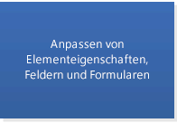
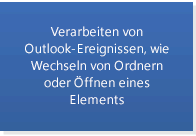
-->

### Szenarien, die vom Outlook-Objektmodell oder PIA seit Outlook 2007 unterstützt werden

Wenn Ihre Outlook-Lösung neben den Grundszenarien eines der in der folgenden Liste gezeigten Szenarien unterstützt und mit Outlook 2007 oder einer späteren Version ausgeführt werden soll, nicht jedoch mit einer früheren Version, können Sie auch das Objektmodell oder die PIA verwenden. In diesem Abschnitt werden die Hauptobjekte oder -mitglieder gezeigt, mit denen Sie im Outlook-Objektmodell die einzelnen Szenarien erweitern können (ausgenommen die [IDTExtensibility2](https://docs.microsoft.com/dotnet/api/extensibility.idtextensibility2?view=visualstudiosdk-2017) -Schnittstelle im Visual Studio-Automatisierungsobjektmodell und die [IRibbonExtensibility](https://docs.microsoft.com/office/vba/api/Office.IRibbonExtensibility)-Schnittstelle im Office-Objektmodell, die Sie in das Outlook-Objektmodell integrieren können). 

- [Anpassen der Outlook-Benutzeroberfläche: Office Fluent-Menüband, Navigationsbereich, Aufgabenbereich](#OLSelectAPI_CustomizeTheOutlookInterface)
- [Anpassen von Formularen als Formularbereiche und Bereitstellen von Formularen mithilfe von Add-Ins](#OLSelectAPI_CustomFormRegions)
- [Festlegen und Abrufen integrierter Eigenschaften auf Elementebene, die nicht im Objektmodell offengelegt werden](#OLSelectAPI_CustomizingProperties)
- [Aufzählen und Anzeigen von zahlreichen Elementen in einem Ordner](#OLSelectAPI_Enumerating)
- [Kennzeichnen von Elementen als Aufgaben](#OLSelectAPI_ItemsFlag)
- [Freigeben von Kalendern, RSS-Feeds und Ordnern](#OLSelectAPI_Sharing)
- [Hinzufügen, Entfernen, Speichern und Abrufen der Blockebene, des Pfads, der Größe und des Typs einer Anlage](#OLSelectAPI_Attachments)
- [Verwalten von Regeln, Zeitzonen und Ansichten](#OLSelectAPI_Misc)
- [Hinzufügen oder Entfernen einer Kategorie zur Hauptkategorienliste für das aktuelle Profil](#OLSelectAPI_Categories)
- [Abrufen detaillierter Informationen zu einem Konto im aktuellen Profil](#OLSelectAPI_PrimaryAccount)
- [Abrufen detaillierter Informationen zu einer Exchange-Verteilerliste oder einem Benutzer als Adresseintrag](#OLSelectAPI_AddressBook)
- [Speichern privater Daten für Lösungen](#OLSelectAPI_StoringData)

<!--More removed images

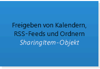
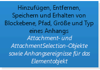

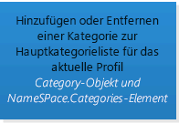

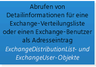

-->

### Szenarien, die vom Outlook-Objektmodell oder PIA seit Outlook 2010 unterstützt werden

Wenn Ihre Outlook-Lösung mit Outlook 2010 und nicht mit früheren Versionen ausgeführt werden soll, können Sie das Objektmodell oder die PIA verwenden, um die im nächsten Abschnitt gezeigten Szenarien zu unterstützen. Dieser Abschnitt gibt die Hauptobjekte oder -mitglieder an, mit denen Sie im Outlook-Objektmodell die einzelnen Szenarien erweitern können (ausgenommen die Schnittstellen [IRibbonControl](https://docs.microsoft.com/office/vba/api/Office.IRibbonControl), [IRibbonExtensibility](https://docs.microsoft.com/office/vba/api/Office.IRibbonExtensibility) und [IRibbonUI](https://docs.microsoft.com/office/vba/api/Office.IRibbonUI) im Office-Objektmodell, die Sie in das Outlook-Objektmodell integrieren können). 
   
- [Anpassen der Outlook 2010-Benutzeroberfläche, wie Office Backstage-Ansicht und Kontextmenüs](#OLSelectAPI_CustomizingUIOutlook2010)
- [Verwalten und Zugreifen auf heterogene Elemente in einer Unterhaltung](#OLSelectAPI_Conversations)
- [Verwalten der Elementeauswahl in einem Explorer oder nach einer Auswahl suchen](#OLSelectAPI_ItemSelection)
- [Verwalten der Anlagenauswahl in einem Inspektor](#OLSelectAPI_AttachmentSelection)
- [Unterstützen mehrerer Exchange-Konten in einem Profil](#OLSelectAPI_MultipleAccounts)
- [Erstellen einer Kontaktkarte für einen Adresseintrag](https://docs.microsoft.com/office/vba/api/Outlook.NameSpace.CreateContactCard)
- [Organisation von lösungsspezifischen Ordnern im Lösungsmodul](#OLSelectAPI_Folders)

<!--more removed images:
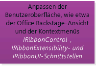
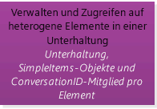
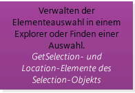
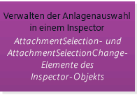

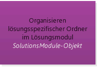
-->

### Szenarien, die vom Outlook-Objektmodell oder PIA seit Outlook 2013 unterstützt werden

Wenn Ihre Outlook-Lösung mit Outlook 2013 und nicht mit früheren Versionen ausgeführt werden soll, können Sie das Objektmodell oder die PIA verwenden, um die im Folgenden gezeigten Szenarien zu unterstützen.

- [Anzeigeansicht für alle Kontakte im aktuellen Ordner](https://docs.microsoft.com/office/vba/api/Outlook.peopleview)
- [Inlineantwort im Lesebereich auswählen](#OLSelectAPI_InlineResponse)
- [Anzeigen des Kontrollkästchens Adresse oder vollständiger Name für Kontakt](#OLSelectAPI_ContactCheckDialogs)
- [Ermittlung von Leseelementeigenschaften ist abgeschlossen](https://docs.microsoft.com/office/vba/outlook/How-to/Items-Folders-and-Stores/outlook-item-objects)

<!--more removed images:
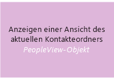

-->

## Entscheidungsfaktoren für MAPI

Grundsätzlich verwenden Sie die MAPI, um auf Daten auf einem MAPI-basierten Server wie etwa dem Microsoft Exchange-Server zuzugreifen und Aufgaben wie die folgenden auszuführen:
  
- Erstellen eines benutzerdefinierten Dienstanbieters, z. B. eines Adressbuch-, Transport- oder Speicheranbieters
    
- Erstellen eines Senkenprozesses
    
- Erstellen oder Bearbeiten eines Profils
    
- Ausführen einer Anwendung als Windows NT-Dienst
    
- Ausführen von Aufgaben in einem Hintergrundthread. Beispielsweise kann durch das Auflisten einer großen Menge von Elementen in einem Ordner und Ändern der Eigenschaften der Elemente in einem Hintergrundthread die Leistung optimiert werden.
    
Weitere Informationen sowie Codebeispiele finden Sie in der [MAPI-Referenz für Outlook](https://msdn.microsoft.com/library/3d980b86-7001-4869-9780-121c6bfc7275%28Office.15%29.aspx) und unter [MFCMAPI](https://mfcmapi.codeplex.com/).
  
Zudem ist Folgendes zu beachten: Wenn Ihre Lösung mit einer früheren Version von Outlook als Outlook 2007 ausgeführt wird und Szenarien wie die folgenden auf Ihre Lösung zutreffen, sollten Sie die MAPI verwenden, um diese Szenarien zu erweitern.
  
- Festlegen und Abrufen integrierter Eigenschaften auf Elementebene, die nicht im Objektmodell offengelegt werden
    
- Verwalten von Konten, Anlagen, Exchange-Verteilerlisten, Exchange-Benutzer oder Speicher
    
- Speichern privater Daten für Lösungen
    
- Verwalten eines Nachrichtenspeichers für ein Konto
    
Seit Outlook 2007 unterstützt das Objektmodell eine Reihe von Features, die in Versionen vor Outlook 2007 nicht vorhanden waren, sodass Entwickler damals auf die MAPI oder andere APIs wie etwa Microsoft-Datenobjekte für die Zusammenarbeit (Collaboration Data Objects, CDO) 1.2.1 und Microsoft Exchange-Clienterweiterungen zurückgreifen mussten. Wenn also eines oder mehrere der Szenarien in der obigen Liste auf Ihre Lösung zutreffen, die Lösung aber mit Outlook 2007 oder Outlook 2010 ausgeführt wird, können und sollten Sie das Outlook-Objektmodell oder die PIA verwenden, um diese Szenarien zu unterstützen. Weitere Informationen zu Erweiterungen in Outlook 2007, mit denen Outlook-Entwicklungstechnologien zusammengeführt werden, finden Sie in [What's New for Developers in Outlook 2007 (Part 1 of 2)](https://msdn.microsoft.com/library/76e3f0b7-ef2b-4e9f-8515-3002d75d7721%28Office.15%29.aspx).

## Argumente für die Hilfs-APIs

Die Outlook-Hilfs-APIs können in manchen Szenarien, in denen das Objektmodell oder die MAPI keine Lösung bieten, mit der Outlook-Geschäftslogik oder der MAPI integriert werden. Verwenden Sie die Outlook-Hilfs-APIs in folgenden Szenarien:
  
- Kontoverwaltung: Verwalten von Kontoinformationen, Bearbeiten von Konten, Senden von Benachrichtigungen bei Kontoänderungen und Schützen von Konten vor unerwünschten E-Mail-Nachrichten (Spam) 
    
- Verschlechterung der Datenqualität: Umschließen eines Objekts mit einem bevorzugten Zeichenformat, anstatt es in seinem nativen Format offenzulegen
    
- Zuweisen einer neuen Basis für Kalender und Zeitzonenunterstützung: Zuweisen einer neuen Basis zu Outlook-Kalendern, um Sommerzeit zu unterstützen
    
- Frei/Gebucht-Status: Bereitstellen von Frei/Gebucht-Informationen in Kalendern
    
- Kontaktbilder: Festlegen der Anzeige des Bilds für einen Kontakt in Outlook
    
- Aktualität von Elementen: Feststellen, ob für ein Outlook-Element noch nicht gespeicherte Änderungen vorliegen
    
- Kategorisieren von Elementen: Kategorisieren eines Outlook-Elements, nachdem dieses gesendet wurde
    
Weitere Informationen zu den Hilfs-APIs finden Sie im Abschnitt [Weitere Ressourcen: Hilfs-APIs](#OLSelectAPI_AdditionalResourcesAuxAPIs). 

## Automatisieren von Outlook mit prozessinternen gegenüber prozessexternen Lösungen

> [!NOTE]
> Die Erläuterungen zur Automatisierung von Outlook in diesem und dem nächsten Abschnitt gehen über den Anwendungsbereich von Office-Add-Ins hinaus. Diese sind darauf ausgelegt, die Funktionen des Office-Clients oder der Office-Webanwendung zu erweitern, jedoch nicht zu automatisieren. 
  
Outlook unterstützt die Automatisierung, indem es Add-Ins verwendet, die im gleichen Vordergrundprozess wie der Outlook-Prozess ausgeführt werden, und eigenständige Lösungen, die in einem eigenen, separaten Prozess außerhalb des Outlook-Prozesses ausgeführt werden. Verwenden Sie für die Interaktion mit Outlook über das Objektmodell, PIA oder MAPI und - was weniger häufig vorkommt - über eine Hilfs-API (wie etwa [HrProcessConvActionForSentItem](auxiliary/hrprocessconvactionforsentitem.md)) grundsätzlich ein Add-In. Verwenden Sie eine prozessexterne Lösung nur, wenn es notwendig ist (z. B. wenn Sie eine MAPI-Clientanwendung schreiben, die mithilfe der Datei "Tzmovelib.dll" Outlook-Kalendern für Kunden eine neue Basis zuweist, oder wenn Sie eine große Menge von Elementen in einem Ordner auflisten und die Eigenschaften der Elemente in einem Hintergrundthread ändern, um die Leistung zu optimieren). 
  
Add-Ins sind die bevorzugte Lösung zum Automatisieren von Outlook, da Outlook nur dem [Application](https://msdn.microsoft.com/library/797003e7-ecd1-eccb-eaaf-32d6ddde8348%28Office.15%29.aspx)-Objekt vertraut, das während des [OnConnection(Object, ext_ConnectMode, Object, Array)](https://msdn.microsoft.com/library/Extensibility.IDTExtensibility2.OnConnection.aspx) -Ereignisses des Add-Ins an das Add-In übergeben wird. Sie können die Anzeige von Sicherheitswarnungen des Object Model Guard verhindern, indem Sie alle Objekte, Eigenschaften und Methoden von diesem **Application**-Objekt ableiten. Wenn das Add-In eine neue Instanz des **Application**-Objekts erstellt, vertraut Outlook diesem Objekt nicht, auch wenn das Add-In in der Liste der vertrauenswürdigen Add-Ins enthalten ist. Von einem solchen **Application**-Objekt abgeleitete Objekte, Eigenschaften und Methoden werden nicht als vertrauenswürdig behandelt, und die gesperrten Eigenschaften und Methoden lösen Sicherheitswarnungen aus. Weitere Informationen zum Outlook Object Model Guard finden Sie unter [Sicherheitsverhalten des Outlook-Objektmodells (engl.)](https://msdn.microsoft.com/library/4aa3b7c7-5f3f-41ce-bbf3-75d8ecbd6d4f%28Office.15%29.aspx).

## Automatisieren von Outlook mit verwalteten gegenüber nicht verwalteten Lösungen

Outlook unterstützt die Automatisierung durch Add-Ins und eigenständige Anwendungen, die in verwalteten oder nicht verwalteten Sprachen programmiert wurden. Die gängigeren verwalteten Sprachen sind C# und Visual Basic. C++- und Delphi-Tools werden bei der nicht verwalteten Entwicklung häufiger eingesetzt. Welches Fachwissen verfügbar ist, ist eine der Überlegungen, die bei der Wahl zwischen verwalteter und nicht verwalteter Entwicklung den Ausschlag geben. 
  
Wenn in Ihrer Lösung nur das Objektmodell verwendet wird, können Sie eine verwaltete Lösung mithilfe der PIA oder der Office-Entwicklungstools in Visual Studio entwickeln. Die Office-Entwicklungstools in Visual Studio bieten Projektvorlagen und visuelle Designer, die das Erstellen von benutzerdefinierten Schnittstellen und das Entwickeln von Office-Lösungen vereinfachen.
  
Andererseits unterstützt Microsoft die Verwendung der MAPI in verwaltetem Code nicht, da die MAPI Jahre vor Microsoft .NET Framework entwickelt wurde und Microsoft keine verwalteten Wrapper für die MAPI bereitstellt. Wenn Sie die MAPI verwenden, müssen Sie eine nicht verwaltete Lösung entwickeln. Weitere Informationen finden Sie unter [Supportrichtlinien für die Entwicklung von clientseitigen Messaginglösungen](https://support.microsoft.com/kb/266353/en-us).

## Nischen-APIs und -Technologien

Der Outlook Connector für soziale Netzwerke (Outlook Social Connector, OSC) und die Wetterleiste unterstützen die Erweiterung sehr spezieller Szenarien in Outlook. 
  
### OSC-Anbietererweiterung

Die OSC-Anbietererweiterung (Outlook Connector für soziale Netzwerke) unterstützt die Entwicklung eines Anbieters für ein soziales Netzwerk, damit Benutzer in Outlook und anderen Office-Clientanwendungen Aktualisierungen von Informationen über Freunde und Aktivitäten in diesem sozialen Netzwerk ansehen können. In Abbildung 6 ist der OSC dargestellt, der im Personenbereich die Aktivitäten einer Person auf sozialen Netzwerkwebsites anzeigt.
  
**Abbildung 6: Der OSC, der im Personenbereich Daten aus sozialen Netzwerken anzeigt**

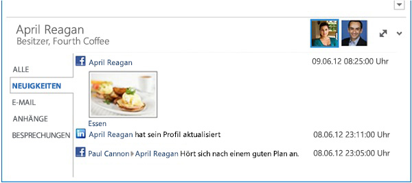
  
Mit dem OSC in Outlook können Benutzer im Personenbereich eine Zusammenstellung der E-Mails, Anlagen und Besprechungsanfragen einer Person in Outlook anzeigen. In einer Organisationsumgebung können Benutzer, die über eine Microsoft SharePoint-Website zusammenarbeiten, Dokumentaktualisierungen und andere Websiteaktivitäten dieser Person auf der SharePoint-Website sehen. Die Erweiterbarkeit über den OSC-Anbieter unterstützt das Entwickeln eines Anbieters für den OSC zum Synchronisieren und Sichtbarmachen von Aktualisierungen in sozialen Netzwerken in Outlook. Gängige OSC-Anbieter (wie Facebook und LinkedIn) werden standardmäßig mit Outlook installiert. Je nachdem, welche OSC-Anbieter ein Outlook-Benutzer installiert hat, kann der Benutzer im Personenbereich Aktualisierungen wie etwa Fotos, Statusinformationen und Aktivitäten in den betreffenden sozialen Netzwerken sehen. 
  
### Erweiterbarkeit der Wetterleiste

Die Wetterleiste erlaubt Entwicklern ab Outlook 2013, für die Wetterleiste den Wetterwebdienst eines Drittanbieters zu integrieren, um für einen vom Benutzer ausgewählten Ort aktuelle Wetterdaten bereitzustellen. Die Wetterleiste in Outlook zeigt aktuelle Wetterdaten und eine Vorhersage für einen geographischen Ort an. Ein Benutzer kann einen oder mehrere Orte auswählen und im Kalendermodul in der Wetterleiste bequem Wetterdaten anzeigen. In Abbildung 7 wird gezeigt, wie die Wetterleiste eine 3-Tage-Wettervorhersage für New York, NY, anzeigt. 
  
**Abbildung 7. Wetterleiste in Outlook**

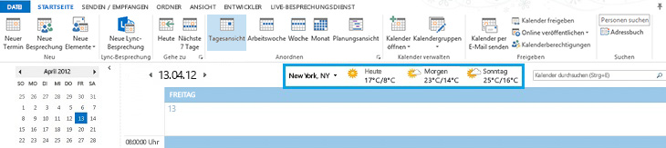
  
Outlook verwendet standardmäßig von MSN Wetter bereitgestellte Wetterdaten. Die Wetterleiste unterstützt Wetterdaten-Webdienste von Drittanbietern, die für die Kommunikation mit Outlook einem definierten Protokoll folgen. Solange der Wetterdatendienst eines Drittanbieters dieses Protokoll unterstützt, können Benutzer diesen Wetterdatendienst auswählen, um Wetterdaten in der Wetterleiste anzuzeigen.
  
Im Abschnitt [Weitere Ressourcen: wichtige Referenzen, Ressourcen und Codebeispiele](#OLSelectAPI_AdditionalResourcesRefCode) finden Sie weitere Informationen zur Verwendung der Erweiterbarkeit des OSC-Anbieters und der Erweiterbarkeit der Wetterleiste. 

## Schlussbemerkung

Um herauszufinden, welche API oder Technologie für Ihre Lösung am besten geeignet ist, müssen Sie zuerst die Ziele der Lösung definieren: 
  
- Die Versionen von Outlook, die Ihre Lösung unterstützen soll
    
- Die wichtigsten Szenarien für Ihre Lösung. Interagiert Ihre Lösung in erster Linie mit den Inhalten und Eigenschaften eines Nachrichten- oder Terminelements? Oder automatisiert Ihre Lösung Outlook auf einer Anwendungsebene? Wenn ja, umfassen diese Szenarien das Auflisten, Filtern oder Ändern von Ordnern, die eine große Menge von Outlook-Elementen enthalten?
    
Prüfen Sie zuerst, ob die Mail-App-Unterstützung in der Office-Add-Ins-Plattform Ihre Anforderungen erfüllt. Ermitteln Sie anhand des Abschnitts "Funktionsbezogene Kriterien" unter [Objektive Bewertungskriterien für die Apps für Office-Plattform](#OLSelectAPI_ObjectiveEvalCritApps), ob Ihre Szenarios von den wichtigsten Objekten und Features unterstützt werden. Prüfen Sie anhand des Abschnitts [Argumente für die Apps für Office-Plattform](#OLSelectAPI_FactorsApps), ob Mail-Apps für Ihre Szenarien besser geeignet sind als Add-Ins. Allgemein gilt: Entwickeln Sie Ihre Lösung als App, wenn möglich, um von der Unterstützung der Plattform über Outlook-Clients und verschiedene Formfaktoren hinweg zu profitieren. 
  
Wenn Ihre Szenarien eine über Nachrichten- und Terminelemente hinausgehende Erweiterung erfordern oder Sie Outlook auf der Anwendungsebene automatisieren müssen, prüfen Sie, ob die Szenarien im Abschnitt [Argumente für das Objektmodell oder die PIA](#OLSelectAPI_FactorsOM) Ihre Anforderungen abdecken. Wenn das Objektmodell (oder die PIA) Ihrer Outlook-Zielversionen Ihre Szenarien unterstützt und Ihre Lösung keine Ordner mit vielen Elementen bearbeitet, sollten Sie Ihre Lösung - in einer verwalteten oder nicht verwalteten Sprache - als ein Add-In implementieren. 
  
Wenn das Objektmodell (oder die PIA) einer vorgesehenen Outlook-Version einige Ihrer Szenarien nicht unterstützt, klären Sie, ob die Szenarien im Abschnitt [Argumente für die MAPI](#OLSelectAPI_FactorsMAPI) oder [Argumente für die Hilfs-APIs](#OLSelectAPI_FactorsAux) Ihre Anforderungen erfüllen. Wenn die MAPI Ihre Anforderungen erfüllt, sollten Sie die Lösung in nicht verwaltetem Code implementieren. Wenn eine Hilfs-API eines Ihrer Szenarien abdeckt, können Sie verwalteten oder nicht verwalteten Code verwenden. 
  
Wenn in Ihrer Lösung die MAPI verwendet wird, müssen Sie sie in nicht verwaltetem Code implementieren, z. B. in C++. Abgesehen davon hängt die Entscheidung, ob zum Erstellen der Lösung verwalteter oder nicht verwalteter Code verwendet werden soll, generell von den verfügbaren Ressourcen und deren Fachwissen ab. Wenn es darum geht, ob die Lösung als Add-In oder als eigenständige Anwendung implementiert werden soll, sollten Sie sich für ein Add-In entscheiden, um das ständige Aufrufen des Outlook Object Model Guard durch den Benutzer zu vermeiden, es sei denn, in Ihrem Szenario müssen Ordner bearbeitet werden, die große Mengen von Elementen enthalten. Im letzteren Fall können Sie durch Implementieren der Lösung als Hintergrundthread die Leistung von Outlook optimieren.
  
Wenn Ihre Szenarien das Anzeigen von Informationen oder Aktualisierungen in sozialen Netzwerken in Outlook umfasst, sollten Sie die OSC-Anbietererweiterung nutzen, um eine COM-sichtbare DLL zu erstellen. Dies können Sie in einer verwalteten oder in einer nicht verwalteten Sprache tun.
  
Wenn Sie sich dafür interessieren, für die Wetterleiste einen Wetterdatendienst eines Drittanbieters zu verwenden, können Sie dem von der Wetterleistenerweiterung definierten Protokoll folgen und die entsprechenden Webdienste bereitstellen. Sie können diese Webdienste in einer verwalteten Sprache erstellen.
  
Nachdem Sie die für Ihre Lösung zu verwendenden APIs oder Technologien ausgewählt haben, können Sie sich im Abschnitt [Weitere Ressourcen: wichtige Referenzen, Ressourcen und Codebeispiele](#OLSelectAPI_AdditionalResourcesRefCode) über zusätzliche Dokumentation und Beispielcode informieren. 

## Siehe auch: Office Add-ins

[Office-Add-Ins-Plattformübersicht](https://msdn.microsoft.com/library/e64de870-ce22-4331-92e7-76d35279bf91%28Office.15%29.aspx) bietet eine gute Einführung in Office-Add-Ins, einschließlich der Architektur und des Entwicklungslebenszyklus. 
  
Schauen Sie unter [Outlook-add-ins](https://msdn.microsoft.com/library/71e64bc9-e347-4f5d-8948-0a47b5dd93e6%28Office.15%29.aspx), um eine detaillierte Übersicht über die Ressourcen zur Entwicklung von e-Mail-apps zu erhalten. 

## Siehe auch: Objektmodell und PIA

In den folgenden Ressourcen finden Sie weitere Informationen zur Verwendung des Objektmodells und der PIA.

### Konten: primäres Exchange-Konto im Profil

- [Account](https://msdn.microsoft.com/library/f624438c-4e45-2822-18b6-bfe8074a33c0%28Office.15%29.aspx)-Objekt 
    
- [NameSpace.Accounts](https://msdn.microsoft.com/library/80e969ea-d2cc-966d-5fe4-68d59951b5c9%28Office.15%29.aspx)-Eigenschaft 

### Konten: mehrere Konten im Profil

- [Account](https://msdn.microsoft.com/library/f624438c-4e45-2822-18b6-bfe8074a33c0%28Office.15%29.aspx)-Objekt 
    
- [Verwenden von mehreren Konten für das gleiche Profil in Outlook](https://msdn.microsoft.com/library/9e06e076-d62a-37c8-4502-709da5a0b104%28Office.15%29.aspx)
    
- [Abrufen von Informationen für mehrere Konten](https://msdn.microsoft.com/library/af587ee2-429a-252f-ecb6-2f058b9a37a8%28Office.15%29.aspx)
    
- [Bearbeiten mehrerer Exchange-Konten in Outlook 2010](https://msdn.microsoft.com/library/b5a80da9-102d-4617-8a06-49ded01a237a%28Office.15%29.aspx)

### Adressbuch und Exchange-Benutzer

- [Anzeigen von Namen aus dem Adressbuch](https://msdn.microsoft.com/library/32e7179c-8133-ee20-ecf6-52c9275f205f%28Office.15%29.aspx)
    
- [Zugriff auf Informationen zu einem Exchange-Benutzer oder zu Verteilerlisten aus dem Adressbuch](https://msdn.microsoft.com/library/077a8666-09c5-e641-0b9b-7d83133d931f%28Office.15%29.aspx)
    
- [Auflisten der Gruppen, zu denen Mein Vorgesetzter gehört](https://msdn.microsoft.com/library/2f0ff92c-e026-4f62-c039-fbda9aaf1546%28Office.15%29.aspx)
    
- [Auflisten des Namens und des Bürostandorts jedes Vorgesetzten, der zu einer Exchange-Verteilerliste gehört ](https://msdn.microsoft.com/library/abc26854-62db-be7f-4025-46acbcb42541%28Office.15%29.aspx)
    
- [AddressEntries](https://msdn.microsoft.com/library/db91b717-07c6-d1f2-c545-b766ee1f0c6b%28Office.15%29.aspx)-Objekt 
    
- [AddressLists](https://msdn.microsoft.com/library/b8c5ce75-3030-0179-45bb-f44fe6628074%28Office.15%29.aspx)-Objekt 
    
- [ExchangeDistributionList](https://msdn.microsoft.com/library/2830dfba-6c0a-a81f-6b98-92ac2aafb59d%28Office.15%29.aspx)-Objekt 
    
- [ExchangeUser](https://msdn.microsoft.com/library/6ec117d1-7fdb-aa36-b567-1242f8238df0%28Office.15%29.aspx)-Objekt 
    
- [SelectNamesDialog](https://msdn.microsoft.com/library/1522736a-3cad-9f1c-4da9-b52a3a01731c%28Office.15%29.aspx)-Objekt 

### Anlagen

- [Anhängen einer Datei an eine E-Mail-Nachricht](https://msdn.microsoft.com/library/1d94629b-e713-92cb-32de-c8910612e861%28Office.15%29.aspx)
    
- 
  [Anlagendateitypen eingeschränkt von Outlook 2010](https://technet.microsoft.com/de-DE/library/cc179163.aspx)
    
- [Attachment](https://msdn.microsoft.com/library/3e11582b-ac90-0948-bc37-506570bb287b%28Office.15%29.aspx)-Objekt 
    
- [AttachmentSelection](https://msdn.microsoft.com/library/398cf106-a904-9048-e627-e47aaadf1105%28Office.15%29.aspx)-Objekt 
    
- **AttachmentAdd**-Ereignis pro Elementobjekt 
    
- **AttachmentRead**-Ereignis pro Elementobjekt 
    
- **AttachmentRemove**-Ereignis pro Elementobjekt 
    
- **BeforeAttachmentAdd**-Ereignis pro Elementobjekt 
    
- **BeforeAttachmentPreview**-Ereignis pro Elementobjekt 
    
- **BeforeAttachmentRead**-Ereignis pro Elementobjekt 
    
- **BeforeAttachmentSave**-Ereignis pro Elementobjekt 
    
- **BeforeAttachmentWrite**-Ereignis pro Elementobjekt 

### Anhänge: Auswahl im Inspector

- [Inspector.AttachmentSelection](https://msdn.microsoft.com/library/19466ce7-def8-4cce-1776-dcea1df9f15d%28Office.15%29.aspx)-Eigenschaft 
    
- [Inspector.AttachmentSelectionChange](https://msdn.microsoft.com/library/1250045d-bcb3-b823-31d5-ec31c64ad59e%28Office.15%29.aspx)-Ereignis 

### Automatisieren von Outlook

- [Anpassen von Outlook mithilfe von COM-Add-Ins](https://msdn.microsoft.com/library/84a4f616-3ace-0139-57d5-f0c070064ab2%28Office.15%29.aspx)
    
- [Erstellen eines C++-Add-Ins für Outlook 2010](https://msdn.microsoft.com/library/70b308e7-d713-4a26-9892-5021f7320674%28Office.15%29.aspx)
    
- [Einführung in die Interoperabilität zwischen COM und .NET](https://msdn.microsoft.com/library/6b2d099a-ec6f-4099-aaf6-e61003fe5a32%28Office.15%29.aspx)
    
- [Gründe für die Verwendung des Outlook-PIA](https://msdn.microsoft.com/library/5cc9085e-7c97-4698-8cb9-e33e427c02e7%28Office.15%29.aspx)
    
- [Bewährte Methoden beim Entwickeln von verwalteten Outlook-Add-Ins](https://msdn.microsoft.com/library/a03246f6-2ca5-4fcb-8e63-a11cfbc8d9a0%28Office.15%29.aspx)
    
- [Abrufen und Anmelden bei einer Instanz von Outlook](https://msdn.microsoft.com/library/ef369364-6500-2759-3ef4-ed4411112e96%28Office.15%29.aspx)
    
- [Automatisieren von Outlook aus einer Visual Basic-Anwendung](https://msdn.microsoft.com/library/623f91af-cd50-1ff0-9519-5a39cbcf5d18%28Office.15%29.aspx)
    
- [Automatisieren von Outlook aus anderen Office-Anwendungen](https://msdn.microsoft.com/library/d3e44f80-df67-2d28-94dc-14d7a8c8c26c%28Office.15%29.aspx)

### Kategorien

- [Kategorisieren von Outlook-Elementen](https://msdn.microsoft.com/library/e8cfb450-b8b0-bee6-fdf0-d0a92bf9af56%28Office.15%29.aspx)
    
- [Category](https://msdn.microsoft.com/library/143ef095-54b0-cbe2-e356-632029061ac2%28Office.15%29.aspx)-Objekt 
    
- [NameSpace.Categories](https://msdn.microsoft.com/library/3963afca-3a7e-38d7-1347-7e1467be3a10%28Office.15%29.aspx)-Eigenschaft 

### Kontakte: Prüfen der Adresse und des vollständigen Namens

- [ContactItem.ShowCheckAddressDialog](https://msdn.microsoft.com/library/773a1a3c-1247-fd48-399a-728766e56570%28Office.15%29.aspx)-Methode 
    
- [ContactItem.ShowCheckFullNameDialog](https://msdn.microsoft.com/library/d42632e3-6f50-cce7-80c6-cf846be1f925%28Office.15%29.aspx)-Methode 

### Unterhaltungen

- [Verwalten von Outlook-Elementen als Unterhaltungen](https://msdn.microsoft.com/library/d91959d7-07b2-7952-8e6d-a39422d355e0%28Office.15%29.aspx)
    
- [Abrufen und Aufzählen von ausgewählten Unterhaltungen](https://msdn.microsoft.com/library/3bba1e98-b2eb-c53d-354a-bdd899b65a59%28Office.15%29.aspx)
    
- [Conversation](https://msdn.microsoft.com/library/2705d38a-ebc0-e5a7-208b-ffe1f5446b1b%28Office.15%29.aspx)-Objekt 
    
- [ConversationHeader](https://msdn.microsoft.com/library/5142d5f7-55c1-4d9d-3a11-d25c8763fcb7%28Office.15%29.aspx)-Objekt 
    
- [SimpleItems](https://msdn.microsoft.com/library/b929ae28-fe5f-607e-37b5-ed6a304d4896%28Office.15%29.aspx)-Objekt 
    
- **ConversationID**-Eigenschaft pro Elementobjekt 

### Veranstaltungen

- [Arbeiten mit Outlook-Ereignissen](https://msdn.microsoft.com/library/514f8f31-8047-2a9f-cbac-d0a23218f49c%28Office.15%29.aspx)
    
- [Implementieren eines Wrappers für Prüfungen und Nachverfolgung von Ereignissen auf Elementebene in jedem Inspektor](https://msdn.microsoft.com/library/8021dd2b-c36c-492b-b281-783e85140ad8%28Office.15%29.aspx)

### Explorer: Inline-Antwort

- [Explorer.ActiveInlineResponse](https://msdn.microsoft.com/library/fc38314d-7cff-44f4-9151-6129f918a721%28Office.15%29.aspx)-Eigenschaft 
    
- [Explorer.ActiveInlineResponseWordEditor](https://msdn.microsoft.com/library/b9058694-ab8f-4962-ab7d-afac1704dd29%28Office.15%29.aspx)-Eigenschaft 
    
- [Explorer.InlineResponse](https://msdn.microsoft.com/library/5dbaddbd-e6cd-4776-b417-c67f51b12812%28Office.15%29.aspx)-Ereignis 

### Elemente: grundlegende Eigenschaften, Felder und Formulare

- [Outlook-Elementobjekte](https://msdn.microsoft.com/library/6ea4babf-facf-4018-ef5a-4a484e55153a%28Office.15%29.aspx)
    
- [ItemProperties](https://msdn.microsoft.com/library/34a110ed-6617-72da-1e98-a9773c705b40%28Office.15%29.aspx)-Objekt 
    
- [UserProperties](https://msdn.microsoft.com/library/20b49c86-d74f-9bda-382c-559af278c148%28Office.15%29.aspx)-Objekt 
    
- [Übersicht über die Standardfelder](https://msdn.microsoft.com/library/f0d903a3-f404-8511-af3d-d4f3e30f0779%28Office.15%29.aspx)
    
- [Outlook-Felder und entsprechende Eigenschaften](https://msdn.microsoft.com/library/acc5d2c5-f579-0a60-5676-3faa63f26c0e%28Office.15%29.aspx)
    
- [Benutzerdefinierte Felder und Data Types (Übersicht)](https://msdn.microsoft.com/library/a85a7bc2-2b85-1782-04a3-0104e0df32aa%28Office.15%29.aspx)
    
- [Anpassen von Formularseiten und Formularbereichen](https://msdn.microsoft.com/library/c8c2d080-66a8-b761-bdc0-527b209e0bd1%28Office.15%29.aspx)

### Elemente: Anpassen von Eigenschaften

- [Eigenschaften (Übersicht)](https://msdn.microsoft.com/library/242c9e89-a0c5-ff89-0d2a-410bd42a3461%28Office.15%29.aspx)
    
- [Efficiently Getting and Setting Custom Properties in a Contact Folder in Outlook 2010](https://msdn.microsoft.com/library/bb49f7a6-ec0a-483a-a27e-e843c6af781b%28Office.15%29.aspx)
    
- [PropertyAccessor](https://msdn.microsoft.com/library/2fc91e13-703c-3ec9-9066-ffee7144306c%28Office.15%29.aspx)Objekt 

### Elemente: Aufzählung, Filterung und Sortierung

- [Speichern von Outlook-Elementen](https://msdn.microsoft.com/library/e4a639a4-10b2-7665-9261-19d6e7707e48%28Office.15%29.aspx)
    
- [In einem Table-Objekt angezeigte Standardeigenschaften](https://msdn.microsoft.com/library/649c64f3-2d1e-23f1-bf13-3368da79e62b%28Office.15%29.aspx)
    
- [Efficiently Filtering Contact Items in a Contact Folder in Outlook 2010](https://msdn.microsoft.com/library/b8dd39e7-d716-4acd-873b-d2b0faaff30d%28Office.15%29.aspx)
    
- [Aufzählen, Suchen und Filtern von Elementen in einem Ordner](https://msdn.microsoft.com/library/d786d292-7a0e-0e1a-e132-affbfde37744%28Office.15%29.aspx)
    
- [Sortieren von Elementen in einem Ordner](https://msdn.microsoft.com/library/bc3651da-cfdb-4301-4034-bb848f371e55%28Office.15%29.aspx)
    
- [Table](https://msdn.microsoft.com/library/0affaafd-93fe-227a-acee-e09a86cadc20%28Office.15%29.aspx)-Objekt 

### Elemente: als Aufgaben kennzeichnen

Siehe hierzu die folgenden aufgabenbezogenen Eigenschaften in einigen Elementobjekten wie etwa dem [MailItem](https://msdn.microsoft.com/library/14197346-05d2-0250-fa4c-4a6b07daf25f%28Office.15%29.aspx)-Objekt: 
  
- [TaskCompleteDate](https://msdn.microsoft.com/library/4bee35d4-1f1e-0b77-2021-84d4916bef8e%28Office.15%29.aspx)-Eigenschaft 
    
- [TaskDueDate](https://msdn.microsoft.com/library/161ed0ed-0e3f-2e4c-7e63-daad4e918dd6%28Office.15%29.aspx)-Eigenschaft 
    
- [TaskStartDate](https://msdn.microsoft.com/library/76b7109f-55fc-b7e2-63dc-bf7804a709f5%28Office.15%29.aspx)-Eigenschaft 
    
- [TaskSubject](https://msdn.microsoft.com/library/f7e4629f-ad47-b455-9fee-b5e537602a34%28Office.15%29.aspx)-Eigenschaft 
    
- [ToDoTaskOrdinal](https://msdn.microsoft.com/library/d1ccb01a-0792-3779-3f94-eb5195a39bb0%28Office.15%29.aspx)-Eigenschaft 

### Elemente: Auswahl im Explorer

- [Selection.GetSelection](https://msdn.microsoft.com/library/c6af6665-d97d-3833-1014-5b43282bafc2%28Office.15%29.aspx)-Methode 
    
- [Selection.Location](https://msdn.microsoft.com/library/8a2db72a-8db0-840e-349e-5d9d22f3affb%28Office.15%29.aspx)-Eigenschaft 

### Sonstiges: Visitenkarten, Regeln und Ansichten

- [Anpassen und Freigeben von Visitenkarten](https://msdn.microsoft.com/library/d29fd962-ea5f-040d-e9af-e8ab70595832%28Office.15%29.aspx)
    
- [Verwalten von Regeln im Outlook-Objektmodell](https://msdn.microsoft.com/library/05ddd643-e9bd-a37d-b680-b8519960a5f6%28Office.15%29.aspx)
    
- [Erstellen einer Regel zum Verschieben bestimmter E-Mails in einen Ordner](https://msdn.microsoft.com/library/e72fa307-8224-c2d2-1318-a18cd8e9f22f%28Office.15%29.aspx)
    
- [Rules](https://msdn.microsoft.com/library/dd41b4de-bf5f-5532-46c9-394a5d078bec%28Office.15%29.aspx)-Objekt 
    
- [RuleActions](https://msdn.microsoft.com/library/82ba76cd-86a4-3372-cb51-2df1d58c8b71%28Office.15%29.aspx)-Objekt 
    
- [RuleConditions](https://msdn.microsoft.com/library/b2af6ebf-f9f8-8106-20a3-1725c3b78174%28Office.15%29.aspx)-Objekt 
    
- [TimeZones](https://msdn.microsoft.com/library/c68f8589-44e9-3c12-45c1-96943fa9bcb7%28Office.15%29.aspx)-Objekt 
    
- [Outlook-Ansichten](https://msdn.microsoft.com/library/cbaa3192-6c27-26c0-ebd6-f6489c2e812e%28Office.15%29.aspx)
    
- [Views](https://msdn.microsoft.com/library/5dd7edc2-12a2-f4c2-d158-8053d80e8dc9%28Office.15%29.aspx)-Objekt 

### Sicherheit

- [Sicherheitsverhalten des Outlook-Objektmodells (engl.)](https://msdn.microsoft.com/library/4aa3b7c7-5f3f-41ce-bbf3-75d8ecbd6d4f%28Office.15%29.aspx)
    
- [Änderungen beim Herunterfahren für Outlook 2010](https://msdn.microsoft.com/library/1b154d46-8d13-4c65-91e3-180b22603d03%28Office.15%29.aspx)
    
- 
  [Durch Outlook 2010 eingeschränkte Anlagendateitypen](https://technet.microsoft.com/de-DE/library/cc179163.aspx)
    
- [Application Shutdown Changes in Outlook 2007 SP2](https://msdn.microsoft.com/library/795a8237-7804-4da4-9d04-2bb663d300d9%28Office.15%29.aspx)
    
- [Code Security Changes in Outlook 2007](https://msdn.microsoft.com/library/26a9fd8f-6277-48ac-a92f-3ff46e1d883a%28Office.15%29.aspx)

### Freigabe

- [Freigeben von Kalendern](https://msdn.microsoft.com/library/03e0b693-5446-ca62-f868-69a583087966%28Office.15%29.aspx)
    
- [Freigeben von Kalendern online, RSS Feeds, Microsoft SharePoint Foundation-Ordner und Exchange-Ordner](https://msdn.microsoft.com/library/e579e026-bd10-37bb-eb3e-5c9f042fa0fa%28Office.15%29.aspx)
    
- [SharingItem](https://msdn.microsoft.com/library/63dd3451-44f3-7cc4-c6e2-7dad5835a7d2%28Office.15%29.aspx)-Objekt 

### Lösungen: lösungsspezifische Ordner

- [Programmieren des Outlook 2010-Lösungsmoduls](https://msdn.microsoft.com/library/5989a3da-2f2a-4abd-87b0-cc0e1560dd59%28Office.15%29.aspx)
    
- [SolutionsModule](https://msdn.microsoft.com/library/4597765e-a95d-bf07-2ac4-103218ebc696%28Office.15%29.aspx)-Objekt 

### Lösungen: Speichern von Daten

- [Speichern von Daten für Lösungen](https://msdn.microsoft.com/library/58e69983-5718-4dde-64fc-858abd80c9e5%28Office.15%29.aspx)
    
- [StorageItem](https://msdn.microsoft.com/library/41776bc3-b838-2755-fd6b-3b5012fb9ae5%28Office.15%29.aspx)-Objekt 

### Benutzeroberfläche: Anpassen von Formularbereichen

- [Anpassen von Formularseiten und Formularbereichen](https://msdn.microsoft.com/library/c8c2d080-66a8-b761-bdc0-527b209e0bd1%28Office.15%29.aspx)
    
- [Formularbereiche](https://msdn.microsoft.com/library/66e80f83-60db-e3b1-47e9-097f855f6512%28Office.15%29.aspx)
    
- [Erstellen eines Formularbereichs](https://msdn.microsoft.com/library/695b95a5-c795-cb4a-8d35-ba12b0007b1f%28Office.15%29.aspx)
    
- [Exemplarische Vorgehensweise: Hinzufügen eines Formularbereichs zu einer vorhandenen Seite in einem Formular](https://msdn.microsoft.com/library/3c988dac-f171-966d-cf9a-17139353d604%28Office.15%29.aspx)
    
- [Building an Outlook 2007 Form Region with a Managed Add-In](https://msdn.microsoft.com/library/cc8503c2-9e17-4718-a757-9f0b7d42f0ee%28Office.15%29.aspx)
    
- [Implementing a Form Region to Display Email Headers in Outlook 2010](https://msdn.microsoft.com/library/243a4e64-d4ea-4cfc-871e-af19d622fb1b%28Office.15%29.aspx)
    
- [FormRegion](https://msdn.microsoft.com/library/3a0b83eb-4076-9cb3-86a9-68f9e44df89f%28Office.15%29.aspx)-Objekt 
    
- [FormRegionStartup](https://msdn.microsoft.com/library/948ea6b7-2962-57e7-618d-fa0977b65651%28Office.15%29.aspx)-Objekt 

### Benutzeroberfläche: Anpassen ab Outlook 2007

- [Übersicht über das Anpassen des Menübands](https://msdn.microsoft.com/library/ee49751d-9eae-357c-5fa9-0b2dd4ff0890%28Office.15%29.aspx)
    
- [Customizing the Ribbon in Outlook 2007](https://msdn.microsoft.com/library/946e97ea-f556-4e84-8fac-01cd9214e170%28Office.15%29.aspx)
    
- [Developing Interfaces in Outlook 2007](https://msdn.microsoft.com/library/e50257a3-98dd-498f-b9ff-dbfb6705a95a%28Office.15%29.aspx)
    
- [Custom Task Panes Overview](https://msdn.microsoft.com/library/9a415109-5333-433e-95c6-3d59ce9c4d02.aspx)
    
- [Erstellen von Benutzeroberflächenlösungen speziell für die Microsoft Office-Versionen 2007 und 2010](https://msdn.microsoft.com/library/98726fb2-5d5c-44be-80c3-cfef926471f9%28Office.15%29.aspx)
    
- [Anpassen des Navigationsbereichs](https://msdn.microsoft.com/library/426c3d1c-13b5-cac5-702d-87dfe71f2478%28Office.15%29.aspx)
    
- [Outlook-Ansichtsteuerelement-Objektmodellreferenz](https://msdn.microsoft.com/library/36fa9303-2135-6fcc-b93c-05eef37af3ec%28Office.15%29.aspx)
    
- [IDTExtensibility2](https://msdn.microsoft.com/library/Extensibility.IDTExtensibility2.aspx) -Schnittstelle 
    
- [IRibbonExtensibility](https://msdn.microsoft.com/library/b27a7576-b6f5-031e-e307-78ef5f8507e0%28Office.15%29.aspx)-Objekt 
    
- [NavigationPane](https://msdn.microsoft.com/library/b6538c72-6115-99fc-c926-e0532a747823%28Office.15%29.aspx)-Objekt 

### Benutzeroberfläche: Anpassen ab Outlook 2010

- [Erweitern der Benutzeroberfläche von Outlook 2010](https://msdn.microsoft.com/library/00b504b0-e897-43b9-8615-44276166823f%28Office.15%29.aspx)
    
- [Erweiterbarkeit der Office Fluent-Benutzeroberfläche für Outlook](https://msdn.microsoft.com/library/8496c52e-1f9d-16ef-2fd8-c1bca1a96816%28Office.15%29.aspx)
    
- [Programmieren des Outlook 2010-Lösungsmoduls](https://msdn.microsoft.com/library/5989a3da-2f2a-4abd-87b0-cc0e1560dd59%28Office.15%29.aspx)
    
- [Customizing the Context Menu of a Contact Card in Outlook 2010](https://msdn.microsoft.com/library/8513c8de-15d7-4396-8ced-f5f56f4cd9b3%28Office.15%29.aspx)
    
- [IRibbonControl](https://msdn.microsoft.com/library/63aef709-e1d3-b1a6-76af-b568ad0e69ae%28Office.15%29.aspx)-Objekt 
    
- [IRibbonExtensibility](https://msdn.microsoft.com/library/b27a7576-b6f5-031e-e307-78ef5f8507e0%28Office.15%29.aspx)-Objekt 
    
- [IRibbonUI](https://msdn.microsoft.com/library/d323aa21-de74-e821-c914-db71ef3b9c5e%28Office.15%29.aspx)-Objekt 

### Benutzeroberfläche: lösungsspezifische Ordner

- [Programmieren des Outlook 2010-Lösungsmoduls](https://msdn.microsoft.com/library/5989a3da-2f2a-4abd-87b0-cc0e1560dd59%28Office.15%29.aspx)
    
- [Adding Solution-Specific Folders to the Solutions Module in Outlook 2010](https://msdn.microsoft.com/library/9709af57-1577-4497-8c9c-3d239353e2ed%28Office.15%29.aspx)
    
- [SolutionsModule](https://msdn.microsoft.com/library/4597765e-a95d-bf07-2ac4-103218ebc696%28Office.15%29.aspx)-Objekt 

## Siehe auch: Hilfs-APIs

In den folgenden Ressourcen finden Sie weitere Informationen zu den Outlook-Hilfs-APIs.
  
### Kontoverwaltung

- [Über die Konto-API](auxiliary/about-the-account-management-api.md)
    
- [Account-Management-API-Referenz](auxiliary/account-management-api-reference.md)
    
- [Anti-Spam-Einstellungen](auxiliary/about-anti-spam-settings.md)
    
### Kategorisieren von Elementen

- [HrProcessConvActionForSentItem](auxiliary/hrprocessconvactionforsentitem.md)
    
### Kontakt-Bilder

- [Geben Sie an, ob das Bild eines Kontakts in Outlook (Outlook-Zusatzreferenz) angezeigt werden soll](https://msdn.microsoft.com/library/office/gg262879.aspx)
    
### Daten-Beeinträchtigung

- [Über der Datenschicht Abbau API](auxiliary/about-the-data-degradation-layer-api.md)
    
- [Daten Verschlechterung Layer-API-Referenz](auxiliary/data-degradation-layer-api-reference.md)
    
### Frei/Gebucht-Status

- [Informationen zur Frei/Gebucht-API](auxiliary/about-the-free-busy-api.md)
    
- [Verwenden von relativer Zeit zum Zugriff auf Frei/Gebucht-Daten](auxiliary/how-to-use-relative-time-to-access-free-busy-data.md)
    
- [Referenz zur Frei/Gebucht-API](auxiliary/free-busy-api-reference.md)
    
### Elements-Währung

- [Bestimmen Sie, ob ein Outlook-Element geändert, aber nicht gespeichert (Outlook 2013 Hilfs-Referenz) wurde](auxiliary/how-to-determine-if-outlook-item-has-been-modified-but-not-saved.md)
    
### Verwalten von Kalendern

- [Zum neuen Basisadressen Kalender programmgesteuert Sommerzeit](auxiliary/about-rebasing-calendars-programmatically-for-daylight-saving-time.md)
    
- [Informationen zum Beibehalten von TZDEFINITION in einem Stream, um eine binäre Eigenschaft zu übernehmen](auxiliary/about-persisting-tzdefinition-to-a-stream-to-commit-to-a-binary-property.md)
    
- [Analysieren eines Streams aus einer binären Eigenschaft zum Lesen der TZDEFINITION-Struktur](auxiliary/how-to-parse-stream-from-binary-property-to-read-tzdefinition-structure.md)
    
- [Analysieren eines Streams aus einer binären Eigenschaft zum Lesen der TZREG-Struktur](auxiliary/how-to-parse-a-stream-from-a-binary-property-to-read-the-tzreg-structure.md)
    
- [Lesen von Zeitzoneneigenschaften aus einem Termin](auxiliary/how-to-read-time-zone-properties-from-an-appointment.md)

## Siehe auch: Primärverweise, Ressourcen und -Codebeispiele

In den folgenden Ressourcen finden Sie weitere Informationen zu den wichtigsten Outlook-Referenzen, -Ressourcen und -Codebeispielen.
  
### Wichtige Referenzen und Ressourcen

- [Office-Add-Ins](https://docs.microsoft.com/office/dev/add-ins/overview/office-add-ins)   
- [Outlook 2013-Entwicklerreferenz](https://msdn.microsoft.com/library/75e4ad96-62a2-49d2-bc51-48ceab50634c%28Office.15%29.aspx)   
- [Referenz zur primären Interopassembly von Outlook 2010](https://msdn.microsoft.com/library/54bdde85-8dc9-4498-a1ac-f72eaf8f0cd3%28Office.15%29.aspx)   
- [MAPI-Referenz für Outlook](https://msdn.microsoft.com/library/3d980b86-7001-4869-9780-121c6bfc7275%28Office.15%29.aspx)   
- [Zusätzliche Referenz für Outlook 2013](auxiliary/welcome-to-the-outlook-auxiliary-reference.md)   
- [Outlook Connector für soziale Netzwerke – Anbieterverweis](social-connector/outlook-social-connector-provider-reference.md)   
- [Erweiterung der Wetterleiste in Outlook](weather/extending-the-weather-bar-in-outlook.md)   
- [Outlook Weather Information XML Schema](weather/outlook-weather-information-xml-schema.md)   
- [Outlook Weather Location XML Schema](weather/outlook-weather-location-xml-schema.md)   
- [Neuerungen bei XML-Schemas für Outlook 2010](https://msdn.microsoft.com/library/52f91e6f-a774-488c-8e55-111ae8f68f8a%28Office.15%29.aspx)   
- [Outlook 2010: XML-Schemareferenz](https://www.microsoft.com/downloads/en/details.aspx?FamilyID=10ca414a-6cff-46a1-a521-e42c25f079d3&amp;displaylang=en)   
- [Entwickeln von Outlook 2010-Lösungen für 32-Bit- und 64-Bit-Systeme](https://msdn.microsoft.com/library/076753e1-6252-4189-843c-7b1be1967176%28Office.15%29.aspx)
    
### Codebeispiele

- [Beispiele für Mail-Apps](https://code.msdn.microsoft.com/officeapps/site/search?f%5B0%5D.Type=Technology&amp;f%5B0%5D.Value=Outlook%202013)   
- Codebeispiele für das Objektmodell: [Gewusst wie... (Outlook 2013-Entwicklerreferenz)](https://msdn.microsoft.com/library/3c33646d-e5c2-3103-b219-487ffe23357f%28Office.15%29.aspx)  
- Codebeispiele für die PIA: [Gewusst wie... (Outlook 2013 PIA-Referenz)](https://msdn.microsoft.com/library/ff647d52-bd32-4945-afa4-5b97d9a0d7dd%28Office.15%29.aspx)  
- [MAPI-Beispiele](https://msdn.microsoft.com/library/641659f2-3c0a-43af-96f1-2521b4b06680%28Office.15%29.aspx)
- Codebeispiele für Hilfs-APIs: [Beispielaufgaben (engl.)](auxiliary/sample-tasks.md)
    

