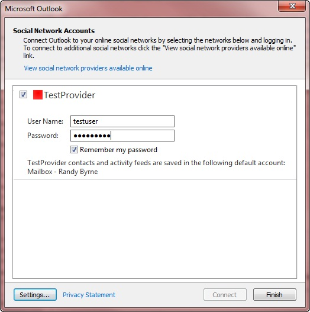

# XML-Elemente für „capabilities“

In den Tabellen in diesem Thema werden untergeordnete Elemente der **Capabilities** -XML beschrieben und nach den Bereichen gruppiert, die Sie unterstützen. Der Standardwert der einzelnen **Capabilities** -Elemente ist **false**. Wenn das Element nicht in den von der [ISocialProvider:: getCapabilities](isocialprovider-getcapabilities.md) -Methode zurückgegebenen **Capabilities-Funktionen** angegeben ist, ist der Wert des Elements gleich **false**.
  
Eine Übersicht über die **Funktionen** von XML finden Sie unter [XML for Capabilities](xml-for-capabilities.md). Ein Beispiel für XML- **Funktionen** finden Sie unter [Capabilities XML example](capabilities-xml-example.md). Eine vollständige Definition des XML-Schemas des Microsoft Outlook Social Connector (OSC)-Anbieters, einschließlich der erforderlichen oder optionalen Elemente, finden Sie unter [Outlook Social Connector Provider XML Schema](outlook-social-connector-provider-xml-schema.md).
  
## Funktionen für die Unterstützung von Freunden

In der folgenden Tabelle sind die Elemente aufgeführt, die für jede Form der Synchronisierung von Freunden oder nicht-Freunden gelten.
  
|**Element**|**Beschreibung**|
|:-----|:-----|
|**doNotFollowPerson**   |Gibt an, ob der Anbieter den Aufruf der [ISocialSession:: UnFollowPerson](isocialsession-unfollowperson.md) -Methode unterstützt.    **followPerson** und **doNotFollowPerson** sind unabhängige Funktionen eines osc-Anbieters. Ein OSC-Anbieter kann die Fähigkeit signalisieren, eine Person als Freund hinzuzufügen (Einstellung von **followPerson** auf **true**) oder eine Person als Freund in einem sozialen Netzwerkkonto entfernen ( **doNotFollowPerson** auf **true**festlegen). Im Allgemeinen bedeutet es nicht, dass Sie folgen können. **followPerson** ist eine Funktion, die nicht als Aktion interpretiert werden muss, um einer bestimmten Person oder jeder Person im Konto für soziale Netzwerke zu folgen. **followPerson** , das **true** ist, impliziert nicht, dass **doNotFollowPerson** auf **false festgelegt**ist.    |
|**followPerson**   |Gibt an, ob der Anbieter den Aufruf der [ISocialSession:: FollowPerson](isocialsession-followperson.md) -Methode unterstützt. OSC überprüft **followPerson** , wenn **cacheFriends** auf **true** festgelegt ist (zwischengespeicherte Synchronisierung von Freunden), **dynamicContactsLookup** ist **true** (bei Bedarf Synchronisierung von Freunden und nicht-Freunden) oder beide **cacheFriends **und **dynamicContactsLookup** sind true (Hybrid Synchronisierung von Freunden und nicht-Freunden). Wenn der Anbieter **followPerson** als **true**festlegt, zeigt der osc im Bereich Personen für Personen, denen der Benutzer folgt, ein Netzwerksignal an und aktiviert den **Befehl \<on\> ** networkName im Menü " **hinzufügen (+)** " im Feld "Personen". Bereich. Wenn der Anbieter **followPerson** als **false**festlegt, wird das Netzwerksignal nicht angezeigt, und der **Befehl \<on\> ** networkName ist ausgeblendet.    |
|**getFriends**   |Gibt an, ob der Anbieter den [ISocialPerson:: GetFriendsAndColleagues](isocialperson-getfriendsandcolleagues.md) -oder [ISocialSession2:: GetPeopleDetails](isocialsession2-getpeopledetails.md) -Methodenaufruf unterstützt. Wenn der Anbieter **getfriends** als **true**festlegt, verwendet der osc den Wert von **cacheFriends** oder **dynamicContactsLookup** , um zu bestimmen, ob das soziale Netzwerk das Speichern von Freunden als Outlook-Kontaktelemente oder im Arbeitsspeicher zulässt. Wenn der Anbieter **getfriends** als **false**festlegt, unterstützt das soziale Netzwerk keine Freunde und die **ISocialPerson:: GetFriendsAndColleagues** und **ISocialSession2:: GetPeopleDetails** -Methoden, und der osc ignoriert die Werte von **cacheFriends** und **dynamicContactsLookup**.    |
   
Die folgenden Elemente gelten nur für die zwischengespeicherte Synchronisierung von Freunden oder Hybrid Synchronisierung von Freunden und nicht-Freunden. Weitere Informationen zum Synchronisieren von Freunden finden Sie unter [Synchronisieren von Freunden und Aktivitäten](synchronizing-friends-and-activities.md).
  
|**Element**|**Beschreibung**|
|:-----|:-----|
|**cacheFriends**   |Gibt an, ob der OSC-Anbieter das Speichern von Freunden als Outlook-Kontaktelemente zulässt. OSC überprüft **cacheFriends** nur, wenn **getfriends** auf **true**festgelegt ist. Wenn der Anbieter **cacheFriends** als **true**festlegt, synchronisiert der osc Freunde durch Zwischenspeichern und erstellt einen netzwerkspezifischen Kontakteordner im Standardspeicher des Benutzers für Friend-Kontakte. Der Name des netzwerkspezifischen Kontakteordners ist der Wert der [ISocialProvider:: SocialNetworkName](isocialprovider-socialnetworkname.md) -Eigenschaft. Wenn der Anbieter **cacheFriends** als **false**festlegt, erstellt der osc keinen netzwerkspezifischen Kontakteordner für Friend-Kontakte zum Speichern von Freunden.    |
|**contactSyncRestartInterval**   |Bestimmt das Wiederholungsintervall in Minuten zwischen versuchen, Freundes Informationen aus dem sozialen Netzwerk zu synchronisieren, wenn ein Synchronisierungsfehler auftritt. OSC verwendet dieses Element nur, wenn der OSC-Anbieter die zwischengespeicherte Synchronisierung oder die Hybrid Synchronisierung von Freunden mit einem sozialen netzwerkspezifischen Kontakteordner unterstützt (**cacheFriends** ist **true**).    Das Standard Wiederholungsintervall beträgt 30 Minuten, es sei denn, der Standardwert `ContactSyncRestartInterval` wird unter `HKEY_CURRENT_USER\Software\Microsoft\Office\Outlook\SocialConnector`überschrieben. Wenn der Anbieter **contactSyncRestartInterval**festlegt, setzt der Anbieterwert das Standard Wiederholungsintervall von 30 Minuten oder den Registrierungsschlüsselwert außer Kraft.    Weitere Informationen zum Synchronisieren von Freunden und nicht-Freunde-Informationen bei Bedarf finden Sie unter [Synchronisieren von Freunden und Aktivitäten](synchronizing-friends-and-activities.md).    |
   
Die folgenden Elemente gelten nur für die bedarfsgesteuerte Synchronisierung oder Hybrid Synchronisierung von Freunden und nicht-Freunden.
  
|**Element**|**Beschreibung**|
|:-----|:-----|
|**dynamicContactsLookup**   |Gibt an, ob der OSC-Anbieter den [ISocialSession2:: GetPeopleDetails](isocialsession2-getpeopledetails.md) -Aufruf zur bedarfsgesteuerten Synchronisierung von Freunden und nicht-Freunden unterstützt.    OSC überprüft **dynamicContactsLookup** nur, wenn **getfriends** auf **true**festgelegt ist. Die Standardeinstellung für **dynamicContactsLookup** ist **false**.    Wenn der OSC-Anbieter **dynamicContactsLookup** als **true** und **getfriends** als **true**angibt, ruft osc **ISocialSession2:: GetPeopleDetails** jedes Mal auf, wenn der Personen Bereich aktualisiert wird. Der Personen Bereich wird aktualisiert, wenn der Benutzer einen anderen Benutzer im Personen Bereich oder ein anderes Element im Outlook-Explorer-Fenster auswählt oder ein Outlook-Inspektor-Fenster öffnet. Bei der dynamischen Kontakte Suche wird sichergestellt, dass der Benutzer immer die neuesten Benutzer Bilder und Profilinformationen im Personen Bereich sieht, erhöht jedoch die Anzahl von Anrufen vom Anbieter zum sozialen Netzwerk.    Wenn der Anbieter **dynamicContactsLookup** als **false**festlegt, ruft der osc **ISocialSession2:: GetPeopleDetails** nicht auf, um den Personen Bereich zu aktualisieren.    |
|**showOnDemandContactsWhenMinimized**   |Gibt an, ob der OSC eine bedarfsgesteuerte Synchronisierung für Freunde und nicht-Freunde durchführen soll, wenn der Personen Bereich minimiert wird.    |
   
## Möglichkeiten zur Unterstützung von Aktivitäten

Das folgende Element gilt für jede Form der Synchronisierung von Aktivitäten, die vom OSC-Anbieter unterstützt werden.
  
|**Element**|**Beschreibung**|
|:-----|:-----|
|**getActivities**   |Gibt an, ob der Anbieter die [ISocialSession2:: GetActivitiesEx](isocialsession2-getactivitiesex.md) -oder [ISocialPerson:: GetActivities](isocialperson-getactivities.md) -Methodenaufrufe unterstützt. Wenn der Anbieter **GetActivities** als **true**festlegt, verwendet osc den Wert von **cacheActivities** oder **dynamicActivitiesLookupEx** , um zu bestimmen, ob der soziale netzwerkSTANDORT das Speichern von Aktivitäten als Outlook-RSS-Elemente oder als Aktivitäten im Arbeitsspeicher. Wenn der Anbieter **GetActivities** als **false**festlegt, unterstützt das soziale Netzwerk keine Aktivitäten und die **ISocialSession2:: GetActivitiesEx** und **ISocialPerson:: GetActivities** -Methoden, und OSC ignoriert die Werte von ** cacheActivities** und **dynamicActivitiesLookupEx**.    |
   
Das folgende Element gilt nur für die zwischengespeicherte Synchronisierung oder Hybrid Synchronisierung von Aktivitäten.
  
|**Element**|**Beschreibung**|
|:-----|:-----|
|**cacheActivities**   |Beginnend mit Outlook Social Connector 2013 ignoriert OSC dieses Element, da Anbieter Aktivitäten nicht mehr synchronisieren können, indem Sie Sie in einem verborgenen Ordner im Speicher des Benutzers Zwischenspeichern.    Wenn der Anbieter Aktivitäten unterstützt, muss der Anbieter die Synchronisierungsaktivitäten bei Bedarf unterstützen. Der Anbieter legt **cacheActivities** als **false** fest und legt **dynamicActivitesLookupEx** als **true**fest. OSC synchronisiert Aktivitäten bei Bedarf und speichert Aktivitäten im Arbeitsspeicher. Der Arbeitsspeichercache für Aktivitäten wird in einem Intervall von 30 Minuten aktualisiert.    |
   
Die folgenden Elemente gelten nur für die bedarfsgesteuerte Synchronisierung oder Hybrid Synchronisierung von Aktivitäten.
  
|**Element**|**Beschreibung**|
|:-----|:-----|
|**dynamicActivitiesLookup**   |Veraltet in OSC 1,1.    Ab OSC 1,1 ruft der OSC nicht mehr [ISocialSession:: GetActivities](isocialsession-getactivities.md) auf und ignoriert den Wert von **dynamicActivitiesLookup**. Zur Unterstützung der Suche nach Anforderungs Aktivitäten legen Sie **cacheActivities** als **false** und GetActivities und **dynamicActivitiesLookupEx** als **true**fest, und der osc ruft **ISocialSession2:: GetActivitiesEx**auf. ****    |
|**dynamicActivitiesLookupEx**   |Gibt an, ob der OSC-Anbieter den **ISocialSession2:: GetActivitiesEx** -Aufruf zur bedarfsgesteuerten Synchronisierung von Aktivitäten unterstützt.    Wenn der OSC-Anbieter die Synchronisierung bei Bedarf unterstützt, werden **GetActivities** und **dynamicActivitiesLookupEx** als **true**und **cacheActivities** als **false**festgelegt. OSC ruft **ISocialSession2:: GetActivitiesEx** jedes Mal, wenn der Personen Bereich aktualisiert wird. Der Bereich Personen wird aktualisiert, wenn der Benutzer das ausgewählte Element im Outlook-Explorer-Fenster ändert oder ein Outlook-Inspektor-Fenster öffnet. Dynamische Aktivitäten Lookup stellt sicher, dass der Benutzer immer die neuesten Aktivitäten im Bereich Personen angezeigt wird, aber die Anzahl der Anrufe vom Anbieter zum sozialen Netzwerk erhöht.    Wenn der Anbieter **dynamicActivitiesLookupEx** als **false**festlegt, ruft der osc **ISocialSession2:: GetActivitiesEx** für Personen, die im Personen Bereich angezeigt werden, nicht auf.    |
|**showOnDemandActivitiesWhenMinimized**   |Gibt an, ob der OSC bei Bedarf eine Synchronisierung für Aktivitäten durchführen soll, wenn der Personen Bereich minimiert wird.    |
   
## Allgemeine Funktionen für die Unterstützung der on-Demand-oder Hybrid Synchronisierung von Freunden, nicht-Freunden und Aktivitäten

|**Element**|**Beschreibung**|
|:-----|:-----|
|**hashFunction**   | Gibt die Hashfunktion an, die vom OSC-Anbieter unterstützt wird. Zum Schutz personenbezogener Informationen von Benutzern, die sich nicht im sozialen Netzwerk oder in der Branchenanwendung des Anbieters befinden, übergibt der OSC Hash-e-Mail-Adressen an **ISocialSession2:: GetPeopleDetails** und **ISocialSession2:: GetActivitiesEx**.     Wenn **dynamicContactsLookup** auf **true** festgelegt ist **oder dynamicActivitiesLookupEx** auf **true**festgelegt ist, muss der Anbieter **HashFunction** auf einen der zulässigen Werte festlegen: **SHA1**, **MD5**oder **CRC32MD5**. Wenn **hashFunction** fehlt oder einen falschen Wert angibt, gibt osc einen Fehler zurück.    **SHA1** ist der Secure Hash-Algorithmus 1 von Internet Engineering Task Force (IETF), definiert von [[RFC3174]](https://www.rfc-editor.org/rfc/rfc3174.txt). Beispielsweise ist `bb81577b567262a21a4df5f6e335c1250acd7b50`der **SHA1** -Hashwert von e-Mail-Adressen Melissa@contoso.com.    **MD5** ist der von [[RFC1321]](https://www.rfc-editor.org/rfc/rfc1321.txt)definierte IETF-MD5-Nachrichtenhashalgorithmus (Internet Engineering Task Force). Der **MD5** -Hashwert von e-Mail-Adressen Melissa@contoso.com ist `c8c39e61ca1662477b39b83d7b0a0615`beispielsweise.    **CRC32MD5** ist eine Kombination aus **CRC32** und **MD5** wie folgt definiert:     Normalisieren Sie die e-Mail-Adresse, indem Sie vorangestellte und nachfolgende Leerräume entfernen und alle Zeichen in Kleinbuchstaben umwandeln.     Berechnen Sie den **CRC32** -Wert für die normalisierte e-Mail-Adresse, und verwenden Sie die dezimale Ganzzahl-Darstellung dieses Werts. Wenn Ihre Implementierung signierte ganze Zahlen zurückgibt, müssen Sie die signierte Ganzzahl in eine ganze Zahl ohne Vorzeichen konvertieren.     Berechnen Sie den **MD5** -Wert für die normalisierte e-Mail-Adresse, und verwenden Sie die Hex-Darstellung dieses Werts (in Kleinbuchstaben für A bis F).     Kombinieren Sie diese beiden Werte mit einem Unterstrich.     Der **CRC32MD5** -Hashwert der e-Mail-Adresse Melissa@contoso.com lautet `2149665315_c8c39e61ca1662477b39b83d7b0a0615`beispielsweise.    |
   
## Funktionen zur Unterstützung der Authentifizierung und Kontokonfiguration

|**Element**|**Beschreibung**|
|:-----|:-----|
|**allowChangesToAutoConfigure**   |Gibt an, ob das soziale Netzwerk dem Benutzer ermöglicht, Einstellungen für die automatische Konfiguration zu ändern, beispielsweise eine andere URL für die Anmeldung bereitzustellen.    |
|**createAccountUrl**   |Wenn der Anbieter **hideHyperlinks** als **false**festlegt, wenn der Benutzer **auf Klicken Sie hier, um ein Konto** im Dialogfeld **Kontokonfiguration** zu erstellen klickt, wird die von **createAccountUrl** angegebene URL im Standardbrowser geöffnet.    |
|**displayUrl**   |Gibt an, ob OSC im Dialogfeld Kontokonfiguration das Textfeld **URL-Adresse** für das soziale Netzwerk anzeigen soll.    |
|**forgotPasswordUrl**   |Wenn der Anbieter **hideHyperlinks** als **false**festlegt, wenn der Benutzer auf **Kennwort vergessen klickt?** im Dialogfeld **Kontokonfiguration** wird die durch **forgotPasswordUrl** angegebene URL im Standardbrowser geöffnet.    |
|**hideHyperlinks**   |Gibt an, ob der OSC **Klicken Sie hier, um ein Konto zu erstellen** und **Ihr Kennwort vergessen?** Hyperlinks im Dialogfeld Kontokonfiguration.    OSC 1,0 ignoriert diese Einstellung, und die Hyperlinks sind immer ausgeblendet. OSC 1,1 beobachtet den Wert dieser Einstellung.    |
|**hideRememberMyPassword**   |Gibt an, ob der OSC das Kontrollkästchen **Kennwort speichern** im Dialogfeld Kontokonfiguration ausblenden soll.    Wenn der Anbieter **hideRememberMyPassword** als **true**festlegt, wird der osc so handeln, als **** ob das Feld Kennwort speichern deaktiviert ist, und das Kennwort wird nicht gespeichert.    Wenn der Anbieter **hideRememberMyPassword** als **false**festlegt, zeigt osc im Dialogfeld Kontokonfiguration das Kontrollkästchen **Kennwort speichern** an.    |
|**supportsAutoConfigure**   |Gibt an, ob OSC die **GetAutoConfiguredSession** -Funktion auf der **ISocialProvider** -Schnittstelle aufrufen soll, um die automatische Konfiguration zu versuchen und sich beim sozialen Netzwerk für den Benutzer anzumelden.    |
|**useLogonCached**   |Gibt an, ob der OSC-Anbieter den Aufruf von [ISocialSession2:: LogonCached](isocialsession2-logoncached.md) unterstützt, um sich mit zwischengespeicherten Anmeldeinformationen anzumelden.    Wenn der Anbieter **useLogonCached** als **true**festlegt, ignoriert osc die Einstellung für **UseLogonWebAuth** , und OSC ruft **ISocialSession2:: LogonCached** für die Authentifizierung auf.    Wenn der Anbieter **dynamicActivitiesLookupEx** als **false**festlegt, ruft der osc **ISocialSession2:: LogonCached** für die Authentifizierung nicht auf.    |
|**useLogonWebAuth**   |Gibt an, ob OSC die formularbasierte Authentifizierung und die [ISocialSession:: LogonWeb](isocialsession-logonweb.md) -Methode verwenden soll. Wenn der Anbieter **useLogonWebAuth** als **false**festlegt, verwendet der osc die Standardauthentifizierung und ruft die [ISocialSession:: Login](isocialsession-logon.md) -Methode auf. Wenn der Anbieter **useLogonWebAuth** als **true**festlegt, verwendet der osc die formularbasierte Authentifizierung und ruft **ISocialSession:: LogonWeb**auf.    |
   
Je nach den vom Anbieter in der **ISocialProvider:: getCapabilities** -Methode zurückgegebenen XML- **Funktionen** wird das Dialogfeld Kontokonfiguration geändert. Abbildung 1 zeigt beispielsweise das Dialogfeld Kontokonfiguration für ein TestProvider-Beispiel. 
  
**Abbildung 1. TestProvider-Beispiel im Dialogfeld "Kontokonfiguration"**

  
## Siehe auch

- [XML für Funktionen](xml-for-capabilities.md)

