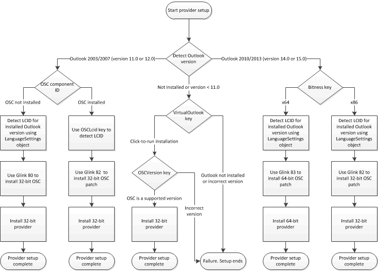

# <a name="installation-checklist"></a><span data-ttu-id="773c0-103">Checkliste für Installation</span><span class="sxs-lookup"><span data-stu-id="773c0-103">Installation checklist</span></span>

<span data-ttu-id="773c0-104">In diesem Thema werden die Voraussetzungen für die erfolgreiche Installation des OSC-Anbieters (Outlook Social Connector) beschrieben, und die Installation überprüft, ob das Installationsprogramm des Anbieters ordnungsgemäß ausgeführt werden sollte.</span><span class="sxs-lookup"><span data-stu-id="773c0-104">This topic describes prerequisites for successfully installing an Outlook Social Connector (OSC) provider, and the installation checks that your provider installer should complete to work correctly.</span></span>
  
## <a name="installation-overview"></a><span data-ttu-id="773c0-105">Übersicht über die Installation</span><span class="sxs-lookup"><span data-stu-id="773c0-105">Installation overview</span></span>

<span data-ttu-id="773c0-106">Benutzer sollten OSC-Anbieter nur dann installieren, wenn eine unterstützende Version von Outlook vorhanden ist und der OSC auf dem Clientcomputer installiert und aktiviert ist.</span><span class="sxs-lookup"><span data-stu-id="773c0-106">Users should install OSC providers only if a supporting version of Outlook is present and the OSC is installed and enabled on the client computer.</span></span> <span data-ttu-id="773c0-107">Unterstützende Versionen von Outlook sind Office Outlook 2003, Office Outlook 2007, Outlook 2010 und Outlook 2013 (auf dem Clientcomputer oder, im Fall von Outlook 2010 und Outlook 2013, von Klick-und-Los auf dem Clientcomputer bereitgestellt).</span><span class="sxs-lookup"><span data-stu-id="773c0-107">Supporting versions of Outlook are Office Outlook 2003, Office Outlook 2007, Outlook 2010 and Outlook 2013 (installed on the client computer or, in the case of Outlook 2010 and Outlook 2013, delivered by Click-to-Run on the client computer).</span></span> <span data-ttu-id="773c0-108">Zur Sicherstellungeiner erfolgreichen Installation sollte Ihr Anbieter Installationsprogramm folgende Schritte ausführen:</span><span class="sxs-lookup"><span data-stu-id="773c0-108">To ensure a successful installation, your provider installer should do the following:</span></span>
  
- <span data-ttu-id="773c0-109">Überprüfen Sie, ob eine unterstützte Version von Outlook vorhanden ist.</span><span class="sxs-lookup"><span data-stu-id="773c0-109">Verify whether a supported version of Outlook is present.</span></span>
    
- <span data-ttu-id="773c0-110">Überprüfen Sie, ob OSC installiert ist.</span><span class="sxs-lookup"><span data-stu-id="773c0-110">Verify whether the OSC is installed.</span></span>
    
> [!NOTE]
> <span data-ttu-id="773c0-111">Klick-und-los ist eine virtuelle Umgebung, in der Outlook 2010 (32-Bit) oder Outlook 2013 (32-Bit) ausgeführt werden kann.</span><span class="sxs-lookup"><span data-stu-id="773c0-111">Click-to-Run is a virtual environment in which Outlook 2010 (32-bit) or Outlook 2013 (32-bit) can run.</span></span> <span data-ttu-id="773c0-112">Überprüfen Sie für Outlook 2013, ob der VirtualOutlook-Schlüssel in HKEY_LOCAL_MACHINE\Software\Microsoft\Office\15.0\Common\InstallRoot\Virtual\VirtualOutlook der Windows-Registrierung vorhanden ist.</span><span class="sxs-lookup"><span data-stu-id="773c0-112">For Outlook 2013, verify if the VirtualOutlook key exists in HKEY_LOCAL_MACHINE\Software\Microsoft\Office\15.0\Common\InstallRoot\Virtual\VirtualOutlook of the Windows registry.</span></span> <span data-ttu-id="773c0-113">Weitere Informationen zum Bereitstellen von Outlook als Klick-und-Los-Produkt auf einem Clientcomputer finden Sie unter [überprüfen, ob Outlook auf einem Computer als Klick-und-Los-Produkt verfügbar ist](https://blogs.msdn.com/b/officedevdocs/archive/2010/03/09/how-to-verify-if-outlook-is-available-on-a-computer-as-a-click-to-run-product.aspx).</span><span class="sxs-lookup"><span data-stu-id="773c0-113">For more information about delivering Outlook as a Click-to-Run product on a client computer, see [How to Verify if Outlook is Available on a Computer as a Click-to-Run Product](https://blogs.msdn.com/b/officedevdocs/archive/2010/03/09/how-to-verify-if-outlook-is-available-on-a-computer-as-a-click-to-run-product.aspx).</span></span> 
  
<span data-ttu-id="773c0-114">Der Benutzer muss jedoch sicherstellen, dass OSC vor der Installation des Anbieters aktiviert ist.</span><span class="sxs-lookup"><span data-stu-id="773c0-114">The user, however, has to ensure that the OSC is enabled before installing the provider.</span></span>
  
<span data-ttu-id="773c0-115">Dritte, einschließlich OSC-Anbieter, können den OSC nicht weiterverteilen.</span><span class="sxs-lookup"><span data-stu-id="773c0-115">Third parties, including OSC providers, cannot redistribute the OSC.</span></span> <span data-ttu-id="773c0-116">Wenn der OSC jedoch nicht installiert ist, kann das Anbieter-Installationsprogramm mithilfe der entsprechenden g-Links den OSC auf dem Clientcomputer installieren.</span><span class="sxs-lookup"><span data-stu-id="773c0-116">However, if the OSC is not installed, the provider installer can use appropriate g-links to install the OSC on the client computer.</span></span> <span data-ttu-id="773c0-117">Ein g-Link ist eine speziell erstellte URL, https://g.live.com auf der ein Benutzer an eine entsprechende Webseite weitergeleitet wird, um den osc herunterzuladen.</span><span class="sxs-lookup"><span data-stu-id="773c0-117">A g-link is a specially constructed URL on https://g.live.com that forwards a user to a corresponding webpage to download the OSC.</span></span> <span data-ttu-id="773c0-118">OSC g-Link ist als https://g.live.com/0CR _LCID_/ -_glink_formatiert, wobei _LCID_ und _glink_ das Gebietsschema, die Version und die Bitanzahl von Outlook auf dem Clientcomputer angeben.</span><span class="sxs-lookup"><span data-stu-id="773c0-118">An OSC g-link is formatted as https://g.live.com/0CR _LCID_/ _Glink_, where  _LCID_ and  _Glink_ specify the locale, version, and bitness of Outlook on the client computer.</span></span> <span data-ttu-id="773c0-119">Jeder g-Link verweist auf eine ausführbare Datei und ist spezifisch für die angegebenen _LCID_ -und _glink_ -Werte.</span><span class="sxs-lookup"><span data-stu-id="773c0-119">Each g-link points to an executable and is specific to the specified  _LCID_ and  _Glink_ values.</span></span> 
  
<span data-ttu-id="773c0-120">Beispielsweise lautet der g-Link zum Installieren der neuesten Version von OSC für Outlook 2003 oder Outlook 2007 für die LCID 1033 (US-Englisch) wie folgt:</span><span class="sxs-lookup"><span data-stu-id="773c0-120">For example, the g-link to install the latest version of the OSC for Outlook 2003 or Outlook 2007 for the LCID 1033 (US English) is as follows:</span></span>
  
https://g.live.com/0CR1033/80
  
<span data-ttu-id="773c0-121">Ausführliche Informationen zu _glink_ -Werten für verschiedene Versionen und Bitanzahl von Outlook sowie zu _LCID_ -Werten für unterstützte gebietsschemas finden Sie unter #7 im Abschnitt [Installationsprüfliste](#olosc_InstallationOverview_InstallationChecklist) unten.</span><span class="sxs-lookup"><span data-stu-id="773c0-121">For details about  _Glink_ values for different versions and bitness of Outlook, and  _LCID_ values for supported locales, see #7 in the section [Installation Checklist](#olosc_InstallationOverview_InstallationChecklist) below.</span></span> 

<span data-ttu-id="773c0-122"><a name="olosc_InstallationOverview_InstallationChecklist"> </a></span><span class="sxs-lookup"><span data-stu-id="773c0-122"></span></span>

## <a name="installation-checklist"></a><span data-ttu-id="773c0-123">Checkliste für Installation</span><span class="sxs-lookup"><span data-stu-id="773c0-123">Installation checklist</span></span>

<span data-ttu-id="773c0-124">Das Anbieter Setuppaket sollte eine Reihe von Installations Überprüfungen durchführen, wie in Abbildung 1 dargestellt, um sicherzustellen, dass der Anbieter erfolgreich installiert wird.</span><span class="sxs-lookup"><span data-stu-id="773c0-124">The provider setup package should perform a series of installation checks, as shown in Figure 1, to ensure that the provider installs successfully.</span></span>
  
<span data-ttu-id="773c0-125">**Abbildung 1. Anbieter Installationslogik**</span><span class="sxs-lookup"><span data-stu-id="773c0-125">**Figure 1. Provider installation logic**</span></span>


  
<span data-ttu-id="773c0-127">Im folgenden Verfahren werden die in Abbildung 1 beschriebenen Installations Überprüfungen beschrieben.</span><span class="sxs-lookup"><span data-stu-id="773c0-127">The following procedure describes the installation checks outlined in Figure 1.</span></span>
  
1. <span data-ttu-id="773c0-128">Ermitteln Sie als Voraussetzung, ob Outlook installiert oder vorhanden ist, und falls installiert oder vorhanden, ob die Version von Outlook den OSC unterstützt.</span><span class="sxs-lookup"><span data-stu-id="773c0-128">As a prerequisite, detect whether Outlook is installed or present, and if installed or present, determine whether the version of Outlook supports the OSC.</span></span> <span data-ttu-id="773c0-129">Weitere Informationen zum Erkennen der installierten Version von Outlook finden Sie unter [Überprüfen der Outlook-Version](https://msdn.microsoft.com/library/672fc380-a29b-4e99-9211-949fd5065723%28Office.15%29.aspx).</span><span class="sxs-lookup"><span data-stu-id="773c0-129">For more information about detecting the installed version of Outlook, see [Check the Version of Outlook](https://msdn.microsoft.com/library/672fc380-a29b-4e99-9211-949fd5065723%28Office.15%29.aspx).</span></span>
    
   - <span data-ttu-id="773c0-130">Wenn die installierte Version von Outlook älter als Outlook 2003 ist, kann die Anbieter Installation nicht abgeschlossen werden.</span><span class="sxs-lookup"><span data-stu-id="773c0-130">If the installed version of Outlook is earlier than Outlook 2003, the provider installation procedure cannot complete.</span></span> <span data-ttu-id="773c0-131">Informieren Sie den Benutzer, bevor Sie mit der Installation des OSC-Anbieters fortfahren, eine unterstützte Version von Outlook und OSC zu erhalten.</span><span class="sxs-lookup"><span data-stu-id="773c0-131">Inform the user to obtain a supported version of Outlook and the OSC before proceeding to install the OSC provider.</span></span>
    
   - <span data-ttu-id="773c0-132">Wenn Outlook nicht installiert ist, fahren Sie mit Schritt 2 fort.</span><span class="sxs-lookup"><span data-stu-id="773c0-132">If Outlook is not installed, proceed to step 2.</span></span>
    
   - <span data-ttu-id="773c0-133">Wenn Outlook 2003 oder Outlook 2007 installiert ist, fahren Sie mit Schritt 3 fort.</span><span class="sxs-lookup"><span data-stu-id="773c0-133">If Outlook 2003 or Outlook 2007 is installed, proceed to step 3.</span></span> 
    
   - <span data-ttu-id="773c0-134">Wenn Sie Outlook 2010 oder Outlook 2013 installiert haben, fahren Sie mit Schritt 4 fort.</span><span class="sxs-lookup"><span data-stu-id="773c0-134">If Outlook 2010 or Outlook 2013 is installed, proceed to step 4.</span></span>
    
2. <span data-ttu-id="773c0-135">**Führen Sie diesen Schritt aus, wenn Outlook auf dem Clientcomputer nicht installiert ist:**</span><span class="sxs-lookup"><span data-stu-id="773c0-135">**Proceed with this step if Outlook is not installed on the client computer:**</span></span>
    
   1. <span data-ttu-id="773c0-136">Überprüfen Sie, ob OSC als Standardkomponente einer Klick-und-Los-Installation von Outlook 2010 oder Outlook 2013 installiert ist.</span><span class="sxs-lookup"><span data-stu-id="773c0-136">Check whether the OSC is installed as a default component of a Click-to-Run installation of Outlook 2010 or Outlook 2013.</span></span> <span data-ttu-id="773c0-137">Untersuchen `VirtualOutlook` Sie den Schlüssel an folgendem Speicherort in der Windows-Registrierung:</span><span class="sxs-lookup"><span data-stu-id="773c0-137">Examine the  `VirtualOutlook` key in the following location in the Windows registry:</span></span> 
      
      - <span data-ttu-id="773c0-138">Für Outlook 2010`HKEY_LOCAL_MACHINE\Software\Microsoft\Office\14.0\Common\InstallRoot\Virtual\VirtualOutlook`</span><span class="sxs-lookup"><span data-stu-id="773c0-138">For Outlook 2010,  `HKEY_LOCAL_MACHINE\Software\Microsoft\Office\14.0\Common\InstallRoot\Virtual\VirtualOutlook`</span></span>
      
      - <span data-ttu-id="773c0-139">Für Outlook Connector für soziale Netzwerke 2013`HKEY_LOCAL_MACHINE\Software\Microsoft\Office\15.0\Common\InstallRoot\Virtual\VirtualOutlook`</span><span class="sxs-lookup"><span data-stu-id="773c0-139">For Outlook Social Connector 2013,  `HKEY_LOCAL_MACHINE\Software\Microsoft\Office\15.0\Common\InstallRoot\Virtual\VirtualOutlook`</span></span>
      
      <span data-ttu-id="773c0-140">Der `VirtualOutlook` Schlüssel ist ein REG_SZ-Wert, der das Gebietsschematag enthält, beispielsweise "en-US" des installierten Produkts.</span><span class="sxs-lookup"><span data-stu-id="773c0-140">The  `VirtualOutlook` key is a REG_SZ value that contains the locale tag, such as "en-us", of the installed product.</span></span> 
      
   2. <span data-ttu-id="773c0-141">Wenn der `VirtualOutlook` Schlüssel nicht vorhanden ist, ist Outlook auf dem Clientcomputer nicht vorhanden, und die Anbieter Installation kann nicht abgeschlossen werden.</span><span class="sxs-lookup"><span data-stu-id="773c0-141">If the  `VirtualOutlook` key does not exist, Outlook is not present on the client computer, and the provider installation procedure cannot complete.</span></span> <span data-ttu-id="773c0-142">Informieren Sie den Benutzer, bevor Sie mit der Installation des OSC-Anbieters fortfahren, eine unterstützte Version von Outlook und OSC zu erhalten.</span><span class="sxs-lookup"><span data-stu-id="773c0-142">Inform the user to obtain a supported version of Outlook and the OSC before proceeding to install the OSC provider.</span></span> 
      
   3. <span data-ttu-id="773c0-143">Wenn der `VirtualOutlook` Schlüssel vorhanden ist, wurde Outlook per Klick-und-Los auf dem Clientcomputer zugestellt.</span><span class="sxs-lookup"><span data-stu-id="773c0-143">If the  `VirtualOutlook` key does exist, Outlook was delivered by Click-to-Run on the client computer.</span></span> <span data-ttu-id="773c0-144">Gehen Sie wie folgt vor, um die installierte Version der OSC-Typbibliothek `OSCVersion` zu überprüfen, indem Sie den Schlüssel an folgendem Speicherort in der Windows-Registrierung untersuchen:</span><span class="sxs-lookup"><span data-stu-id="773c0-144">Proceed to check the installed version of the OSC type library by examining the  `OSCVersion` key in the following location in the Windows registry:</span></span> 
      
      `HKEY_LOCAL_MACHINE\Software\Microsoft\Office\Outlook\SocialConnector\OSCVersion`
      
      <span data-ttu-id="773c0-145">Der Wert von `OSCVersion` ist eine Zeichenfolge, die die Versionsnummer der Typbibliothek Socialprovider. dll angibt (beispielsweise "1,0", "1,1" oder "15").</span><span class="sxs-lookup"><span data-stu-id="773c0-145">The value of  `OSCVersion` is a string that specifies the type library version number of Socialprovider.dll (for example, "1.0", "1.1", or "15").</span></span> 
      
   4. <span data-ttu-id="773c0-146">Wenn `OSCVersion` "1,0", "1,1" oder "15" ist, wird eine entsprechende Version von OSC installiert.</span><span class="sxs-lookup"><span data-stu-id="773c0-146">If  `OSCVersion` is "1.0", "1.1" or "15", an appropriate version of OSC is installed.</span></span> <span data-ttu-id="773c0-147">Fahren Sie mit Schritt 6 fort, um das aktuelle Gebietsschema der Outlook-Benutzeroberfläche für die Installation der neuesten Version des OSC vorzubereiten.</span><span class="sxs-lookup"><span data-stu-id="773c0-147">Proceed to step 6 to find the current Outlook user interface locale to prepare for installing the latest version of the OSC.</span></span> 
      
   5. <span data-ttu-id="773c0-148">`OSCVersion` Andernfalls enthält keinen erwarteten Wert.</span><span class="sxs-lookup"><span data-stu-id="773c0-148">Otherwise,  `OSCVersion` does not contain an expected value.</span></span> <span data-ttu-id="773c0-149">Fahren Sie mit Schritt 6 fort, um das aktuelle Gebietsschema der Outlook-Benutzeroberfläche für die Installation einer geeigneten Version des OSC vorzubereiten.</span><span class="sxs-lookup"><span data-stu-id="773c0-149">Proceed to step 6 to find the current Outlook user interface locale to prepare for installing an appropriate version of the OSC.</span></span> 
    
3. <span data-ttu-id="773c0-150">**Führen Sie diesen Schritt aus, wenn Outlook 2003 oder Outlook 2007 auf dem Clientcomputer installiert ist:**</span><span class="sxs-lookup"><span data-stu-id="773c0-150">**Proceed with this step if Outlook 2003 or Outlook 2007 is installed on the client computer:**</span></span>
    
   1. <span data-ttu-id="773c0-151">Überprüfen Sie, ob der OSC installiert ist, indem Sie eine benutzerdefinierte Installer-Aktion schreiben, um das vorhanden sein der folgenden qualifizierten Komponenten-ID zu testen:</span><span class="sxs-lookup"><span data-stu-id="773c0-151">Verify whether the OSC is installed by writing an installer custom action to test for the existence of the following qualified component ID:</span></span>
      
      `{A3B82DA3-8AD9-4935-AEA8-54B754459483}`
      
      <span data-ttu-id="773c0-152">Die qualifizierte Komponenten-ID ist eine GUID, die eine Methode der Indirection mit einer Ebene bereitstellt, ähnlich wie ein Zeiger.</span><span class="sxs-lookup"><span data-stu-id="773c0-152">The qualified component ID is a GUID that provides a method of single-level indirection, similar to a pointer.</span></span> <span data-ttu-id="773c0-153">Weitere Informationen zu Windows Installer finden Sie unter [Roadmap to Windows Installer Documentation](https://docs.microsoft.com/windows/desktop/msi/roadmap-to-windows-installer-documentation).</span><span class="sxs-lookup"><span data-stu-id="773c0-153">For more information about Windows Installer, see [Roadmap to Windows Installer Documentation](https://docs.microsoft.com/windows/desktop/msi/roadmap-to-windows-installer-documentation).</span></span>
      
   2. <span data-ttu-id="773c0-154">Wenn die angegebene qualifizierte Komponente vorhanden ist, wird eine Version des OSC installiert.</span><span class="sxs-lookup"><span data-stu-id="773c0-154">If the specified qualified component exists, a version of the OSC is installed.</span></span> <span data-ttu-id="773c0-155">Fahren Sie mit Schritt 5 fort, um das aktuelle Gebietsschema der Outlook-Benutzeroberfläche für die Installation der neuesten Version des OSC vorzubereiten.</span><span class="sxs-lookup"><span data-stu-id="773c0-155">Proceed to step 5 to find the current Outlook user interface locale to prepare for installing the latest version of the OSC.</span></span>
      
   3. <span data-ttu-id="773c0-156">Andernfalls ist der OSC nicht installiert.</span><span class="sxs-lookup"><span data-stu-id="773c0-156">Otherwise, the OSC is not installed.</span></span> <span data-ttu-id="773c0-157">Fahren Sie mit Schritt 6 fort, um das aktuelle Gebietsschema der Outlook-Benutzeroberfläche für die Installation einer geeigneten Version des OSC vorzubereiten.</span><span class="sxs-lookup"><span data-stu-id="773c0-157">Proceed to step 6 to find the current Outlook user interface locale to prepare for installing an appropriate version of the OSC.</span></span>
      
4. <span data-ttu-id="773c0-158">**Führen Sie diesen Schritt aus, wenn Outlook 2010 oder Outlook 2013 auf dem Clientcomputer installiert ist:**</span><span class="sxs-lookup"><span data-stu-id="773c0-158">**Proceed with this step if Outlook 2010 or Outlook 2013 is installed on the client computer:**</span></span>
    
   1. <span data-ttu-id="773c0-159">Bestimmen Sie die Bitanzahl der installierten Version von Outlook, indem Sie den `Bitness` Schlüssel an folgendem Speicherort in der Windows-Registrierung untersuchen:</span><span class="sxs-lookup"><span data-stu-id="773c0-159">Determine the bitness of the installed version of Outlook by examining the  `Bitness` key in the following location in the Windows registry:</span></span> 
      
      - <span data-ttu-id="773c0-160">Sehen Sie sich für Outlook 2010`HKEY_LOCAL_MACHINE\SOFTWARE\Microsoft\Office\14.0\Outlook`</span><span class="sxs-lookup"><span data-stu-id="773c0-160">For Outlook 2010, look at  `HKEY_LOCAL_MACHINE\SOFTWARE\Microsoft\Office\14.0\Outlook`</span></span>
      
      - <span data-ttu-id="773c0-161">Sehen Sie sich für Outlook 2013`HKEY_LOCAL_MACHINE\SOFTWARE\Microsoft\Office\15.0\Outlook`</span><span class="sxs-lookup"><span data-stu-id="773c0-161">For Outlook 2013, look at  `HKEY_LOCAL_MACHINE\SOFTWARE\Microsoft\Office\15.0\Outlook`</span></span>
      
      <span data-ttu-id="773c0-162">Der `Bitness` Schlüssel ist "x86" für 32-Bit-Outlook oder "x64" für 64-Bit-Outlook.</span><span class="sxs-lookup"><span data-stu-id="773c0-162">The  `Bitness` key is "x86" for 32-bit Outlook, or "x64" for 64-bit Outlook.</span></span> 
      
   2. <span data-ttu-id="773c0-163">Wenn Ihr Anbieter ein verwalteter Anbieter ist und Sie die Anbieterkomponente kompiliert haben, die die Zielplattform als **beliebige CPU**angibt, fahren Sie mit Schritt 6 fort, um das aktuelle gebietsSchema der Outlook-Benutzeroberfläche für die Installation der neuesten Version des osc vorzubereiten.</span><span class="sxs-lookup"><span data-stu-id="773c0-163">If your provider is a managed provider, and you compiled the provider component specifying the target platform as **Any CPU**, proceed with step 6 to find the current Outlook user interface locale to prepare for installing the latest version of the OSC.</span></span> <span data-ttu-id="773c0-164">Ihr Anbieter kann sowohl 32-Bit-als auch 64-Bit-Versionen des OSC verwenden.</span><span class="sxs-lookup"><span data-stu-id="773c0-164">Your provider will work on both 32-bit and 64-bit versions of the OSC.</span></span>
      
   3. <span data-ttu-id="773c0-165">Wenn es sich bei Ihrem Anbieter um eine systemeigene COM-Komponente handelt, überprüfen Sie die Bitanzahl der installierten Outlook-Version:</span><span class="sxs-lookup"><span data-stu-id="773c0-165">If your provider is a native COM component, examine the bitness of the installed version of Outlook:</span></span>
      
      - <span data-ttu-id="773c0-166">Wenn die installierte Version von Outlook 32-Bit ist, muss Ihr Installationsvorgang einen 32-Bit-Anbieter (in Schritt 8) installieren, nachdem Sie sichergestellt haben, dass ein entsprechender OSC installiert ist.</span><span class="sxs-lookup"><span data-stu-id="773c0-166">If the installed version of Outlook is 32-bit, your installation procedure will have to install a 32-bit provider (in step 8), after ensuring that an appropriate OSC is installed.</span></span>
      
      - <span data-ttu-id="773c0-167">Andernfalls ist die installierte Version von Outlook 64-Bit, und Ihr Installationsvorgang muss einen 64-Bit-Anbieter (in Schritt 8) installieren, nachdem Sie sichergestellt haben, dass ein entsprechender OSC installiert ist.</span><span class="sxs-lookup"><span data-stu-id="773c0-167">Otherwise, the installed version of Outlook is 64-bit, and your installation procedure will have to install a 64-bit provider (in step 8), after ensuring that an appropriate OSC is installed.</span></span> 
      
   4. <span data-ttu-id="773c0-168">Fahren Sie mit Schritt 6 fort, um das aktuelle Gebietsschema der Outlook-Benutzeroberfläche für die Installation einer geeigneten Version des OSC vorzubereiten.</span><span class="sxs-lookup"><span data-stu-id="773c0-168">Proceed with step 6 to find the current Outlook user interface locale to prepare for installing an appropriate version of the OSC.</span></span>
    
5. <span data-ttu-id="773c0-169">Führen Sie **diesen Schritt aus, wenn outlook 2003 oder outlook 2007 installiert ist und der osc auf dem Clientcomputer installiert ist:** Überprüfen Sie das aktuelle Gebietsschema der Outlook-Benutzer `OSCLcid` Oberfläche, indem Sie den Schlüssel an folgendem Speicherort in der Windows-Registrierung untersuchen:</span><span class="sxs-lookup"><span data-stu-id="773c0-169">**Proceed with this step if Outlook 2003 or Outlook 2007 is installed, and the OSC is installed on the client computer:** Check the current Outlook user interface locale by examining the  `OSCLcid` key in the following location in the Windows registry:</span></span> 
    
   `HKEY_LOCAL_MACHINE\Software\Microsoft\Office\Outlook\SocialConnector\OSCLcid`
    
   <span data-ttu-id="773c0-170">Der `OSCLcid` Schlüssel ist ein DWORD-Wert, der das Gebietsschema-Tag (Internet Engineering Task Force, IETF) (definiert durch [[rfc4646]](https://www.ietf.org/rfc/rfc4646.txt) und [[RFC4647]](https://www.ietf.org/rfc/rfc4647.txt)) angibt, das das aktuelle Gebietsschema der Outlook-Benutzeroberfläche darstellt.</span><span class="sxs-lookup"><span data-stu-id="773c0-170">The  `OSCLcid` key is a DWORD value that specifies the Internet Engineering Task Force (IETF) locale tag (defined by [[RFC4646]](https://www.ietf.org/rfc/rfc4646.txt) and [[RFC4647]](https://www.ietf.org/rfc/rfc4647.txt)), that represents the current Outlook user interface locale.</span></span> <span data-ttu-id="773c0-171">Fahren Sie mit Schritt 7 fort, um den neuesten OSC auf dem Clientcomputer zu installieren.</span><span class="sxs-lookup"><span data-stu-id="773c0-171">Proceed with step 7 to install the latest OSC on the client computer.</span></span>
    
6. <span data-ttu-id="773c0-172">**Fahren Sie mit diesem Schritt fort, wenn Outlook 2003 oder Outlook 2007 installiert ist oder Outlook 2010 oder Outlook 2013 vorhanden ist, aber der neueste OSC nicht unbedingt auf dem Clientcomputer installiert ist:**</span><span class="sxs-lookup"><span data-stu-id="773c0-172">**Proceed with this step if Outlook 2003 or Outlook 2007 is installed, or Outlook 2010 or Outlook 2013 is present, but the latest OSC is not necessarily installed on the client computer:**</span></span>
    
   <span data-ttu-id="773c0-173">Verwenden Sie das **LanguageSettings** -Objekt, um die LCID des Gebietsschemas der Outlook-Benutzeroberfläche zu bestimmen.</span><span class="sxs-lookup"><span data-stu-id="773c0-173">Use the **LanguageSettings** object to determine the LCID of the Outlook user interface locale.</span></span> <span data-ttu-id="773c0-174">Der folgende Visual Basic Scripting Edition (VBScript)-Codeausschnitt veranschaulicht, wie die LCID des Outlook-Benutzeroberflächen Gebietsschemas abgerufen wird.</span><span class="sxs-lookup"><span data-stu-id="773c0-174">The following Visual Basic Scripting Edition (VBScript) code snippet demonstrates how to obtain the LCID of the Outlook user interface locale.</span></span> 
    
   ```vb
    Function GetOutlookUI_LCID()
        ' Declare variables.
        Dim msoLanguageIDUI, olApp
        msoLanguageIDUI = 2
        Set olApp = CreateObject("Outlook.Application")
        ' Return Outlook UI LCID.
        GetOutlookUI_LCID = olApp.LanguageSettings.LanguageID(msoLanguageIDUI)
    End Function
   ```

7. <span data-ttu-id="773c0-175">**Fahren Sie mit diesem Schritt fort, wenn das Installationsprogramm die LCID der installierten Version von Outlook hat, aber der neueste OSC nicht unbedingt auf dem Clientcomputer installiert ist:**</span><span class="sxs-lookup"><span data-stu-id="773c0-175">**Proceed with this step if the installer has the LCID of the installed version of Outlook, but the latest OSC is not necessarily installed on the client computer:**</span></span>
    
   <span data-ttu-id="773c0-176">VerKetten Sie einen g-Link in Ihr Installationspaket, um sicherzustellen, dass die neueste Version des OSC auf dem Clientcomputer installiert ist.</span><span class="sxs-lookup"><span data-stu-id="773c0-176">Chain a g-link into your installation package to ensure that the latest version of the OSC is installed on the client computer.</span></span> <span data-ttu-id="773c0-177">Das g-Link-Format lautet wie folgt:</span><span class="sxs-lookup"><span data-stu-id="773c0-177">The g-link format is as follows:</span></span>
    
   <span data-ttu-id="773c0-178">https://g.live.com/0CR_LCID_ /  _Glink_</span><span class="sxs-lookup"><span data-stu-id="773c0-178">https://g.live.com/0CR _LCID_/ _Glink_</span></span>
    
   <span data-ttu-id="773c0-179">In Tabelle 1 finden Sie die unterstützten _LCID_ -Werte und Tabelle 2 für die unterStützten _glink_ -Werte.</span><span class="sxs-lookup"><span data-stu-id="773c0-179">Refer to Table 1 below for the supported  _LCID_ values, and Table 2 for the supported  _Glink_ values.</span></span> <span data-ttu-id="773c0-180">Beispielsweise lautet der g-Link, um die neueste Version des 32-Bit-OSC für 32-Bit Outlook Social Connector 2013 (US-Englisch) zu installieren:</span><span class="sxs-lookup"><span data-stu-id="773c0-180">For example, the g-link to install the latest version of the 32-bit OSC for 32-bit Outlook Social Connector 2013 (US English) is as follows:</span></span> 
    
   https://g.live.com/0CR1033/82
    
8. <span data-ttu-id="773c0-181">Installieren Sie den Anbieter.</span><span class="sxs-lookup"><span data-stu-id="773c0-181">Install the provider.</span></span> <span data-ttu-id="773c0-182">Bei der Anbieter Installation muss der programmgesteuerte Bezeichner (ProgID) am entsprechenden Speicherort der Windows-Registrierung registriert werden.</span><span class="sxs-lookup"><span data-stu-id="773c0-182">The provider installation procedure must register the programmatic identifier (ProgID) in the appropriate Windows registry location.</span></span> <span data-ttu-id="773c0-183">Weitere Informationen finden Sie unter [Registrieren eines Anbieters](registering-a-provider.md).</span><span class="sxs-lookup"><span data-stu-id="773c0-183">For more information, see [Registering a Provider](registering-a-provider.md).</span></span> <span data-ttu-id="773c0-184">Stellen Sie außerdem sicher, dass die Bitanzahl des zu installierenden Anbieters mit dem Bitanzahl der auf dem Clientcomputer vorhandenen Version von Outlook übereinstimmt.</span><span class="sxs-lookup"><span data-stu-id="773c0-184">Also, be sure that the bitness of the provider to be installed is the same as the bitness of the version of Outlook present on the client computer.</span></span> <span data-ttu-id="773c0-185">Installieren Sie beispielsweise einen 32-Bit-Anbieter, wenn 32-Bit Outlook 2013 vorhanden ist, und einen 64-Bit-Anbieter, falls 64-Bit Outlook 2013 installiert ist.</span><span class="sxs-lookup"><span data-stu-id="773c0-185">For example, install a 32-bit provider if 32-bit Outlook 2013 is present, and a 64-bit provider if 64-bit Outlook 2013 is installed.</span></span> <span data-ttu-id="773c0-186">Für Outlook 2003 oder 2007 gilt nur die 32-Bit-Version Ihres Anbieters.</span><span class="sxs-lookup"><span data-stu-id="773c0-186">For Outlook 2003 or 2007, only the 32-bit version of your provider applies.</span></span> 
    
<span data-ttu-id="773c0-187">**Tabelle 1: unterstütztes Gebietsschema und entsprechende LCID-Werte im Hexadezimalformat für OSC**</span><span class="sxs-lookup"><span data-stu-id="773c0-187">**Table 1: Supported locale and corresponding LCID values in hexadecimal for the OSC**</span></span>
  
|<span data-ttu-id="773c0-188">**Gebietsschema**</span><span class="sxs-lookup"><span data-stu-id="773c0-188">**Locale**</span></span>|<span data-ttu-id="773c0-189">**LCID**</span><span class="sxs-lookup"><span data-stu-id="773c0-189">**LCID**</span></span>|
|:-----|:-----|
|<span data-ttu-id="773c0-190">ar-sa</span><span class="sxs-lookup"><span data-stu-id="773c0-190">ar-sa</span></span>  <br/> |<span data-ttu-id="773c0-191">1025</span><span class="sxs-lookup"><span data-stu-id="773c0-191">1025</span></span>  <br/> |
|<span data-ttu-id="773c0-192">bg-bg</span><span class="sxs-lookup"><span data-stu-id="773c0-192">bg-bg</span></span>  <br/> |<span data-ttu-id="773c0-193">1026</span><span class="sxs-lookup"><span data-stu-id="773c0-193">1026</span></span>  <br/> |
|<span data-ttu-id="773c0-194">ca-es</span><span class="sxs-lookup"><span data-stu-id="773c0-194">ca-es</span></span>  <br/> |<span data-ttu-id="773c0-195">1027</span><span class="sxs-lookup"><span data-stu-id="773c0-195">1027</span></span>  <br/> |
|<span data-ttu-id="773c0-196">cs-cz</span><span class="sxs-lookup"><span data-stu-id="773c0-196">cs-cz</span></span>  <br/> |<span data-ttu-id="773c0-197">1029</span><span class="sxs-lookup"><span data-stu-id="773c0-197">1029</span></span>  <br/> |
|<span data-ttu-id="773c0-198">da-dk</span><span class="sxs-lookup"><span data-stu-id="773c0-198">da-dk</span></span>  <br/> |<span data-ttu-id="773c0-199">1030</span><span class="sxs-lookup"><span data-stu-id="773c0-199">1030</span></span>  <br/> |
|<span data-ttu-id="773c0-200">de-de</span><span class="sxs-lookup"><span data-stu-id="773c0-200">de-de</span></span>  <br/> |<span data-ttu-id="773c0-201">1031</span><span class="sxs-lookup"><span data-stu-id="773c0-201">1031</span></span>  <br/> |
|<span data-ttu-id="773c0-202">el-gr</span><span class="sxs-lookup"><span data-stu-id="773c0-202">el-gr</span></span>  <br/> |<span data-ttu-id="773c0-203">1032</span><span class="sxs-lookup"><span data-stu-id="773c0-203">1032</span></span>  <br/> |
|<span data-ttu-id="773c0-204">en-us</span><span class="sxs-lookup"><span data-stu-id="773c0-204">en-us</span></span>  <br/> |<span data-ttu-id="773c0-205">1033</span><span class="sxs-lookup"><span data-stu-id="773c0-205">1033</span></span>  <br/> |
|<span data-ttu-id="773c0-206">es-es</span><span class="sxs-lookup"><span data-stu-id="773c0-206">es-es</span></span>  <br/> |<span data-ttu-id="773c0-207">3082</span><span class="sxs-lookup"><span data-stu-id="773c0-207">3082</span></span>  <br/> |
|<span data-ttu-id="773c0-208">et-ee</span><span class="sxs-lookup"><span data-stu-id="773c0-208">et-ee</span></span>  <br/> |<span data-ttu-id="773c0-209">1061</span><span class="sxs-lookup"><span data-stu-id="773c0-209">1061</span></span>  <br/> |
|<span data-ttu-id="773c0-210">eu-es</span><span class="sxs-lookup"><span data-stu-id="773c0-210">eu-es</span></span>  <br/> |<span data-ttu-id="773c0-211">1069</span><span class="sxs-lookup"><span data-stu-id="773c0-211">1069</span></span>  <br/> |
|<span data-ttu-id="773c0-212">fi-fi</span><span class="sxs-lookup"><span data-stu-id="773c0-212">fi-fi</span></span>  <br/> |<span data-ttu-id="773c0-213">1035</span><span class="sxs-lookup"><span data-stu-id="773c0-213">1035</span></span>  <br/> |
|<span data-ttu-id="773c0-214">fr-fr</span><span class="sxs-lookup"><span data-stu-id="773c0-214">fr-fr</span></span>  <br/> |<span data-ttu-id="773c0-215">1036</span><span class="sxs-lookup"><span data-stu-id="773c0-215">1036</span></span>  <br/> |
|<span data-ttu-id="773c0-216">gl-es</span><span class="sxs-lookup"><span data-stu-id="773c0-216">gl-es</span></span>  <br/> |<span data-ttu-id="773c0-217">1110</span><span class="sxs-lookup"><span data-stu-id="773c0-217">1110</span></span>  <br/> |
|<span data-ttu-id="773c0-218">he-il</span><span class="sxs-lookup"><span data-stu-id="773c0-218">he-il</span></span>  <br/> |<span data-ttu-id="773c0-219">1037</span><span class="sxs-lookup"><span data-stu-id="773c0-219">1037</span></span>  <br/> |
|<span data-ttu-id="773c0-220">hi-in</span><span class="sxs-lookup"><span data-stu-id="773c0-220">hi-in</span></span>  <br/> |<span data-ttu-id="773c0-221">1081</span><span class="sxs-lookup"><span data-stu-id="773c0-221">1081</span></span>  <br/> |
|<span data-ttu-id="773c0-222">hr-hr</span><span class="sxs-lookup"><span data-stu-id="773c0-222">hr-hr</span></span>  <br/> |<span data-ttu-id="773c0-223">1050</span><span class="sxs-lookup"><span data-stu-id="773c0-223">1050</span></span>  <br/> |
|<span data-ttu-id="773c0-224">hu-hu</span><span class="sxs-lookup"><span data-stu-id="773c0-224">hu-hu</span></span>  <br/> |<span data-ttu-id="773c0-225">1038</span><span class="sxs-lookup"><span data-stu-id="773c0-225">1038</span></span>  <br/> |
|<span data-ttu-id="773c0-226">it-it</span><span class="sxs-lookup"><span data-stu-id="773c0-226">it-it</span></span>  <br/> |<span data-ttu-id="773c0-227">1040</span><span class="sxs-lookup"><span data-stu-id="773c0-227">1040</span></span>  <br/> |
|<span data-ttu-id="773c0-228">ja-jp</span><span class="sxs-lookup"><span data-stu-id="773c0-228">ja-jp</span></span>  <br/> |<span data-ttu-id="773c0-229">1041</span><span class="sxs-lookup"><span data-stu-id="773c0-229">1041</span></span>  <br/> |
|<span data-ttu-id="773c0-230">kk-kz</span><span class="sxs-lookup"><span data-stu-id="773c0-230">kk-kz</span></span>  <br/> |<span data-ttu-id="773c0-231">1087</span><span class="sxs-lookup"><span data-stu-id="773c0-231">1087</span></span>  <br/> |
|<span data-ttu-id="773c0-232">ko-kr</span><span class="sxs-lookup"><span data-stu-id="773c0-232">ko-kr</span></span>  <br/> |<span data-ttu-id="773c0-233">1042</span><span class="sxs-lookup"><span data-stu-id="773c0-233">1042</span></span>  <br/> |
|<span data-ttu-id="773c0-234">lt-lt</span><span class="sxs-lookup"><span data-stu-id="773c0-234">lt-lt</span></span>  <br/> |<span data-ttu-id="773c0-235">1063</span><span class="sxs-lookup"><span data-stu-id="773c0-235">1063</span></span>  <br/> |
|<span data-ttu-id="773c0-236">lv-lv</span><span class="sxs-lookup"><span data-stu-id="773c0-236">lv-lv</span></span>  <br/> |<span data-ttu-id="773c0-237">1062</span><span class="sxs-lookup"><span data-stu-id="773c0-237">1062</span></span>  <br/> |
|<span data-ttu-id="773c0-238">nb-no</span><span class="sxs-lookup"><span data-stu-id="773c0-238">nb-no</span></span>  <br/> |<span data-ttu-id="773c0-239">1044</span><span class="sxs-lookup"><span data-stu-id="773c0-239">1044</span></span>  <br/> |
|<span data-ttu-id="773c0-240">nl-nl</span><span class="sxs-lookup"><span data-stu-id="773c0-240">nl-nl</span></span>  <br/> |<span data-ttu-id="773c0-241">1043</span><span class="sxs-lookup"><span data-stu-id="773c0-241">1043</span></span>  <br/> |
|<span data-ttu-id="773c0-242">pl-pl</span><span class="sxs-lookup"><span data-stu-id="773c0-242">pl-pl</span></span>  <br/> |<span data-ttu-id="773c0-243">1045</span><span class="sxs-lookup"><span data-stu-id="773c0-243">1045</span></span>  <br/> |
|<span data-ttu-id="773c0-244">pt-br</span><span class="sxs-lookup"><span data-stu-id="773c0-244">pt-br</span></span>  <br/> |<span data-ttu-id="773c0-245">1046</span><span class="sxs-lookup"><span data-stu-id="773c0-245">1046</span></span>  <br/> |
|<span data-ttu-id="773c0-246">pt-pt</span><span class="sxs-lookup"><span data-stu-id="773c0-246">pt-pt</span></span>  <br/> |<span data-ttu-id="773c0-247">2070</span><span class="sxs-lookup"><span data-stu-id="773c0-247">2070</span></span>  <br/> |
|<span data-ttu-id="773c0-248">ro-ro</span><span class="sxs-lookup"><span data-stu-id="773c0-248">ro-ro</span></span>  <br/> |<span data-ttu-id="773c0-249">1048</span><span class="sxs-lookup"><span data-stu-id="773c0-249">1048</span></span>  <br/> |
|<span data-ttu-id="773c0-250">ru-ru</span><span class="sxs-lookup"><span data-stu-id="773c0-250">ru-ru</span></span>  <br/> |<span data-ttu-id="773c0-251">1049</span><span class="sxs-lookup"><span data-stu-id="773c0-251">1049</span></span>  <br/> |
|<span data-ttu-id="773c0-252">sk-sk</span><span class="sxs-lookup"><span data-stu-id="773c0-252">sk-sk</span></span>  <br/> |<span data-ttu-id="773c0-253">1051</span><span class="sxs-lookup"><span data-stu-id="773c0-253">1051</span></span>  <br/> |
|<span data-ttu-id="773c0-254">sl-si</span><span class="sxs-lookup"><span data-stu-id="773c0-254">sl-si</span></span>  <br/> |<span data-ttu-id="773c0-255">1060</span><span class="sxs-lookup"><span data-stu-id="773c0-255">1060</span></span>  <br/> |
|<span data-ttu-id="773c0-256">SR-Cyrl-CS</span><span class="sxs-lookup"><span data-stu-id="773c0-256">sr-cyrl-cs</span></span>  <br/> |<span data-ttu-id="773c0-257">3098</span><span class="sxs-lookup"><span data-stu-id="773c0-257">3098</span></span>  <br/> |
|<span data-ttu-id="773c0-258">SR-LATN-CS</span><span class="sxs-lookup"><span data-stu-id="773c0-258">sr-latn-cs</span></span>  <br/> |<span data-ttu-id="773c0-259">2074</span><span class="sxs-lookup"><span data-stu-id="773c0-259">2074</span></span>  <br/> |
|<span data-ttu-id="773c0-260">sv-se</span><span class="sxs-lookup"><span data-stu-id="773c0-260">sv-se</span></span>  <br/> |<span data-ttu-id="773c0-261">1053</span><span class="sxs-lookup"><span data-stu-id="773c0-261">1053</span></span>  <br/> |
|<span data-ttu-id="773c0-262">th-th</span><span class="sxs-lookup"><span data-stu-id="773c0-262">th-th</span></span>  <br/> |<span data-ttu-id="773c0-263">1054</span><span class="sxs-lookup"><span data-stu-id="773c0-263">1054</span></span>  <br/> |
|<span data-ttu-id="773c0-264">tr-tr</span><span class="sxs-lookup"><span data-stu-id="773c0-264">tr-tr</span></span>  <br/> |<span data-ttu-id="773c0-265">1055</span><span class="sxs-lookup"><span data-stu-id="773c0-265">1055</span></span>  <br/> |
|<span data-ttu-id="773c0-266">uk-ua</span><span class="sxs-lookup"><span data-stu-id="773c0-266">uk-ua</span></span>  <br/> |<span data-ttu-id="773c0-267">1058</span><span class="sxs-lookup"><span data-stu-id="773c0-267">1058</span></span>  <br/> |
|<span data-ttu-id="773c0-268">zh-cn</span><span class="sxs-lookup"><span data-stu-id="773c0-268">zh-cn</span></span>  <br/> |<span data-ttu-id="773c0-269">2052</span><span class="sxs-lookup"><span data-stu-id="773c0-269">2052</span></span>  <br/> |
|<span data-ttu-id="773c0-270">zh-tw</span><span class="sxs-lookup"><span data-stu-id="773c0-270">zh-tw</span></span>  <br/> |<span data-ttu-id="773c0-271">1028</span><span class="sxs-lookup"><span data-stu-id="773c0-271">1028</span></span>  <br/> |
   
<span data-ttu-id="773c0-272">**Tabelle 2: Unterstützte glink-Werte für OSC**</span><span class="sxs-lookup"><span data-stu-id="773c0-272">**Table 2: Supported Glink values for the OSC**</span></span>
  
|<span data-ttu-id="773c0-273">**Glink-Wert**</span><span class="sxs-lookup"><span data-stu-id="773c0-273">**Glink value**</span></span>|<span data-ttu-id="773c0-274">**Funktion**</span><span class="sxs-lookup"><span data-stu-id="773c0-274">**Function**</span></span>|
|:-----|:-----|
|<span data-ttu-id="773c0-275">80</span><span class="sxs-lookup"><span data-stu-id="773c0-275">80</span></span>  <br/> |<span data-ttu-id="773c0-276">Installiert die neueste Version von OSC für Outlook 2003 oder Outlook 2007.</span><span class="sxs-lookup"><span data-stu-id="773c0-276">Installs the latest version of OSC for Outlook 2003 or Outlook 2007.</span></span>  <br/> |
|<span data-ttu-id="773c0-277">82</span><span class="sxs-lookup"><span data-stu-id="773c0-277">82</span></span>  <br/> |<span data-ttu-id="773c0-278">Installiert den neuesten Patch von 32-Bit OSC für Outlook 2007, Outlook 2010 oder Outlook Social Connector 2013.</span><span class="sxs-lookup"><span data-stu-id="773c0-278">Installs the latest patch of 32-bit OSC for Outlook 2007, Outlook 2010, or Outlook Social Connector 2013.</span></span>  <br/> |
|<span data-ttu-id="773c0-279">83</span><span class="sxs-lookup"><span data-stu-id="773c0-279">83</span></span>  <br/> |<span data-ttu-id="773c0-280">Installiert den neuesten Patch von 64-Bit OSC für Outlook 2010 oder Outlook Social Connector 2013.</span><span class="sxs-lookup"><span data-stu-id="773c0-280">Installs the latest patch of 64-bit OSC for Outlook 2010 or Outlook Social Connector 2013.</span></span>  <br/> |
   
## <a name="see-also"></a><span data-ttu-id="773c0-281">Siehe auch</span><span class="sxs-lookup"><span data-stu-id="773c0-281">See also</span></span>

- [<span data-ttu-id="773c0-282">Registrieren eines Anbieters</span><span class="sxs-lookup"><span data-stu-id="773c0-282">Registering a Provider</span></span>](registering-a-provider.md) 
- [<span data-ttu-id="773c0-283">Schnelle Schritte für die Entwicklung eines Anbieters</span><span class="sxs-lookup"><span data-stu-id="773c0-283">Quick Steps for Learning to Develop a Provider</span></span>](quick-steps-for-learning-to-develop-a-provider.md)
- [<span data-ttu-id="773c0-284">Bereitstellen eines Providers</span><span class="sxs-lookup"><span data-stu-id="773c0-284">Deploying a Provider</span></span>](deploying-a-provider.md)

