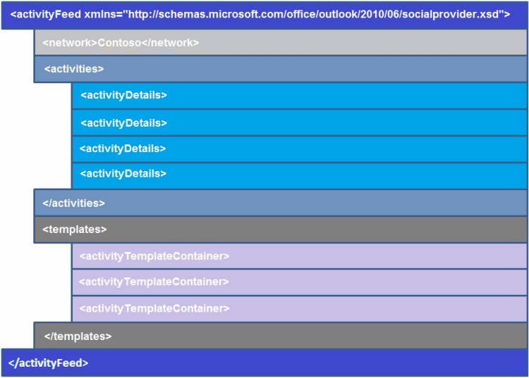

# Übersicht über XML für eine Aktivität Element-feed

Ein Aktivitätsfeed umfasst eine oder mehrere Aktivitäten, die bei einem sozialen Netzwerk. Jedes Aktivitätsfeed wird durch ein **ActivityFeed** -Element dargestellt, und wird durch diese drei Angaben Merkmale auf: 
  
- **Netzwerk**– Name der dem sozialen Netzwerk, von dem die Aktivitäten stammt.
    
- **Aktivitäten**– Container für Aktivitäten auf das angemeldete Konto des Benutzers für das soziale Netzwerk.
    
- **Vorlagen**– Container für Vorlagen, die zum Anzeigen des entsprechenden Aktivitätselements in **Aktivitäten**verwendet werden.
    
Um eine Aktivität Element-feed zu erstellen, müssen Sie das Outlook Social Connector (OSC) Anbieter Erweiterbarkeit XML-Schema entsprechen. Abbildung 1 zeigt, dass die XML-Struktur der Aktivitätsfeeds.
  
**Abbildung 1. XML-Struktur für Aktivitätsfeeds**

  
Für jede Aktivität Element-feed sind die beiden wichtigsten Teile dieses Schemas die **ActivityDetails** und **ActivityTemplateContainer** Elemente: 
  
- Das Element **ActivityDetails** speichert spezifische Informationen für jede Aktivitätsfeed-Element, wie der Name des Besitzers der Aktivität oder die URL für die Bilder hochgeladen. 
    
- Das Element **ActivityTemplateContainer** speichert das Format oder Layout für jede Aktivität feed Element. Es besteht aus Vorlagen, dargestellt durch einzelne **ActivityTemplate** -Elemente, die mehrere Elemente feed wiederverwendet werden können. 
    
Das **ActivityTemplate** -Element für ein einzelnes Element der Aktivitätsfeed gibt an, dass die folgenden vier Arten von Informationen: 
  
- **Symbol**– gibt die URL für das Symbol zum Anzeigen der Aktivitätsfeeds feed Element.
    
- **Titel**– beschreibt die Aktivitätsfeed item.
    
- **Typ**– gibt den Typ der Aktivität, wie ein Status, Foto oder Aktualisierung des Dokuments an.
    
- **Daten**– gibt zusätzliche Informationen mit Aktivitätsfeed Element angezeigt.
    
> [!TIP]
> Der Aktivitätsfeed angezeigte Symbol entspricht immer das Symbol für Anbieter von der **ISocialProvider::SocialNetworkIcon** -Eigenschaft zurückgegeben. 
  
Finden Sie unter den folgenden Themen Weitere Informationen zu **ActivityDetails** -Element, das **ActivityTemplateContainer** -Element, Vorlage Token und Vorlagenvariablen: 
  
- [ActivityDetails Element](activitydetails-element.md)
    
- [ActivityTemplateContainer Element](activitytemplatecontainer-element.md)
    
- [Vorlagenvariablen](template-variables.md)
    
- [Richtlinien für das Aktivitäten ordnungsgemäß anzeigen](guidelines-for-properly-displaying-activities.md)
    
Ein Beispiel der Aktivität XML-feed, finden Sie unter [Aktivität Feed XML-Beispiel](activity-feed-xml-example.md).
  
## Siehe auch

- [XML-Code für Aktivitäten](xml-for-activities.md) 
- [Outlook Connector für soziale Netzwerke Anbieter XML-Schema](outlook-social-connector-provider-xml-schema.md)
- [Entwickeln eines Providers mit dem OSC-XML-Schema](developing-a-provider-with-the-osc-xml-schema.md)

