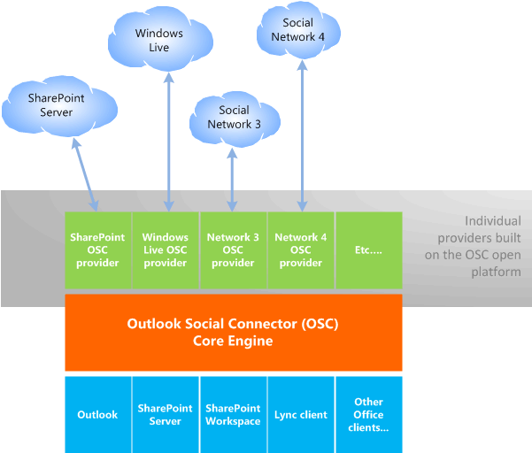

# Erstellen einer Beziehung zwischen dem OSC und Outlook bzw. sozialen Netzwerken

Der Outlook Connector für soziale Netzwerke (OSC) kann in der Office-VisitenKarte und im Outlook-Personen Bereich Aktivitäten, Status oder Foto Updates für einen Kollegen, eine Freundin oder eine beliebige Person, der Sie zugeordnet sind, anzeigen. Standardmäßig zeigt OSC die Outlook-e-Mails, Anlagen und Besprechungsanfragen an, die von einer ausgewählten Person empfangen wurden. Wenn die ausgewählte Person und der Office-Benutzer an einer SharePoint-Website zusammenarbeiten, zeigt der OSC auch Dokumentaktualisierungen und andere Websiteaktivitäten von dieser SharePoint-Website an. Je nach den Kontexten, an denen der Office-Benutzer interessiert ist, kann der Office-Benutzer OSC-Anbieter für Branchenanwendungen, interne Unternehmenswebsites oder eine Vielzahl von Websites mit professionellen und sozialen Netzwerken wie LinkedIn installieren. Facebook und Windows Live.
  
Zur Unterstützung der Freigabe von Funktionen in Office-Clientanwendungen wird das OSC-Kern Modul als Teil einer gemeinsam genutzten Office-Komponente implementiert, und der Personen Bereich wird als Outlook-Add-in implementiert. Um den OSC zu verwenden, muss ein Office-Benutzer Outlook auf diesem Clientcomputer installiert und Outlook mit einem Profil konfiguriert haben, damit OSC Kontakte in einem Kontakteordner zwischenspeichern kann. 
  
Ein OSC-Anbieter ist eine COM-DLL (Component Object Model), die es dem OSC ermöglicht, auf soziale Netzwerkdaten auf eine Art und Weise zuzugreifen, die unabhängig von den APIs der einzelnen sozialen Netzwerke ist. Eine OSC-Anbieter-DLL muss lokal auf einem Clientcomputer installiert werden. OSC-Anbieter eines sozialen Netzwerks verbindet den OSC, der Teil von Outlook ist, mit dem sozialen Netzwerk im Internet.
  
Ein OSC-Anbieter muss eine Reihe von Schnittstellen implementieren, die als Teil der OSC-Anbieter Erweiterbarkeit für die Kommunikation mit dem OSC definiert sind. OSC-Anbieter Erweiterbarkeit ist als offene Plattform verfügbar.
  
Die Anbieter Architektur des OSC ermöglicht es mehreren Anbietern, mit dem OSC-Kern Modul zu arbeiten und soziale Informationen wie Freunde und Aktivitäten zu aggregieren. Abbildung 1 zeigt die OSC-Anbieter Architektur.
  
**Abbildung 1. Architektur des Outlook Social Connector-Anbieters**

  
## Terminologie

In dieser Outlook Social Connector-Anbieter Referenz wird ein soziales Netzwerk verwendet, um auf die folgenden Websitetypen zu verweisen: 
  
- Gemeinsame Websites wie SharePoint.
    
- Websites für soziale Netzwerke wie Facebook und Windows Live.
    
- Professionelle Netzwerk Websites wie LinkedIn.
    
- Andere Branchenanwendungen oder unternehmensinterne Websites, die für Netzwerke verwendet werden.
    
Der Begriff Friend wird im Allgemeinen verwendet, um Freunde, Familie, Kollegen, Verbindungen und alle anderen Personen, denen ein Office-Benutzer in einem kollaborativen Kontext wie SharePoint zugeordnet ist, oder das soziale Netzwerkkonto des Benutzers hinzuzufügen. Nicht-Freunde sind Personen, auf die in den Aktivitäts Updates von Freunden verwiesen wird, aber keine Freunde, die dem sozialen Netzwerkkonto des Office-Benutzers hinzugefügt wurden. Kontakte sind Personen in einem Outlook-Kontaktordner. 
  
## Siehe auch

- [Erste Schritte zum Entwickeln eines Outlook Connector Providers für soziale Netzwerke](getting-started-with-developing-an-outlook-social-connector-provider.md)

