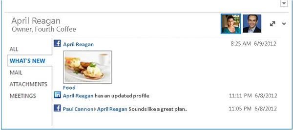

# Gründe für die Entwicklung eines Outlook Social Connector-Anbieters

Ein Outlook Social Connector (OSC)-Anbieter ermöglicht es Office Benutzern, innerhalb einer Office-Clientanwendung eine Aggregation von Updates für soziale Informationen zu sehen, die auf einem professionellen oder sozialen Netzwerkstandort angewendet werden. SharePoint Server, SharePoint Arbeitsbereich, Lync-Client und alle Office Clientanwendungen, die Anwesenheitsinformationen unterstützen, und die Visitenkarte unterstützen das OSC.
  
Mithilfe eines Anbieters für soziale Netzwerke zeigt das OSC zusätzliche Informationen zu einer Person in der Visitenkarte oder im Bereich Outlook Personen an, wie in Abbildung 1 dargestellt. Da das OSC auf einem offenen Anbietermodell aufbaut, können Sie bequem Anbieter für die Zusammenarbeit mit dem OSC erstellen, um Daten des sozialen Netzwerks (z. B. Freunde, Profile, Aktivitäten und Beziehungsinformationen) in Office.
  
Neben öffentlichen Websites für soziale Netzwerke können Sie auch die Erweiterbarkeit des OSC-Anbieters verwenden, um Anbieter für Geschäftsanwendungen oder interne Unternehmenswebsites zu erstellen und ihre Dienste in die Office.
  
**Abbildung 1. Outlook Bereich "Social Connector"**

  
## Siehe auch

- [Schnelle Schritte zum Entwickeln eines Anbieters](quick-steps-for-learning-to-develop-a-provider.md)  
- [Technische Anforderungen](technical-requirements.md)
- [Über den OSC-Beispielvorlagen](osc-sample-templates.md) 
- [Erste Schritte zum Entwickeln eines Outlook Connector Providers für soziale Netzwerke](getting-started-with-developing-an-outlook-social-connector-provider.md)

