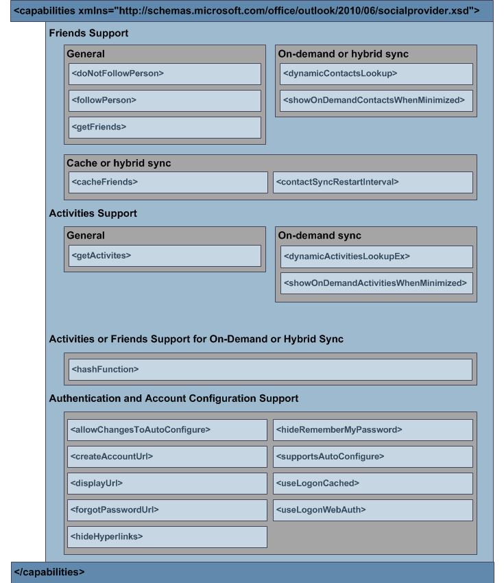

# XML für „capabilities“

Das **Capabilities** -Element im XML-Schema des (OSC)-Anbieters ermöglicht es einem osc-Anbieter, seine Funktionalität anzugeben. Diese Funktionalität umfasst Folgendes: 
  
- Ob der Anbieter das Abrufen, Zwischenspeichern oder dynamische Suchen von Freunden und Aktivitäten aus dem sozialen Netzwerk unterstützt.
    
- Wie der OSC bestimmte Anmeldebenutzer Oberflächen anzeigen soll.
    
- Gibt an, ob OSC die formularbasierte Authentifizierung verwenden oder das soziale Netzwerk automatisch konfigurieren und den Benutzer im sozialen Netzwerk anmelden soll.
    
Das XML-Schema für **Funktionen** ist von entscheidender Bedeutung, da es die vom Anbieter unterstützten Funktionen für osc identifiziert. Ein OSC-Anbieter muss die [ISocialProvider:: getCapabilities](isocialprovider-getcapabilities.md) -Methode implementieren, die eine _Ergebnis_ Zeichenfolge zurückgibt. OSC ruft **ISocialProvider:: getCapabilities** auf, um Informationen zu den Funktionen des osc-Anbieters in der _Ergebnis_ Zeichenfolge abzurufen, die der XML-Schema Definition für das **Capabilities** -Element entspricht. Anhand dieser Informationen können nachfolgende Aufrufe vom OSC an den OSC-Anbieter ordnungsgemäß ausgeführt werden. 
  
Um die Funktionen eines OSC-Anbieters als Ausgabeparameter der **ISocialProvider:: getCapabilities** -Methode anzugeben, müssen Sie dem XML-Schema osc-Anbieter Erweiterbarkeit entsprechen. Die folgende Abbildung zeigt die XML-Struktur der **Funktionen** . 
  
**Abbildung 1. \<XML\> -Struktur der Funktionen**

  
Ausführliche Beschreibungen der untergeordneten Elemente des **Capabilities** -Elements finden Sie unter [Capabilities XML Elements](capabilities-xml-elements.md). Ein Beispiel für XML- **Funktionen** finden Sie unter [Capabilities XML example](capabilities-xml-example.md). Eine vollständige Definition des XML-Schemas des OSC-Anbieters, einschließlich der erforderlichen oder optionalen Elemente, finden Sie unter [Outlook Social Connector Provider XML Schema](outlook-social-connector-provider-xml-schema.md).
  
## Siehe auch

- [XML-Beispiel für Funktionen](capabilities-xml-example.md)  
- [Synchronisieren von Freunden und Aktivitäten](synchronizing-friends-and-activities.md)  
- [XML für Freunde](xml-for-friends.md)  
- [XML für Aktivitäten](xml-for-activities.md)
- [Entwickeln eines Providers mit dem OSC-XML-Schema](developing-a-provider-with-the-osc-xml-schema.md)

