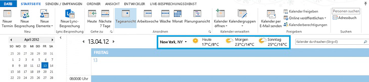
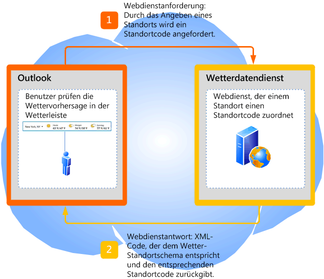
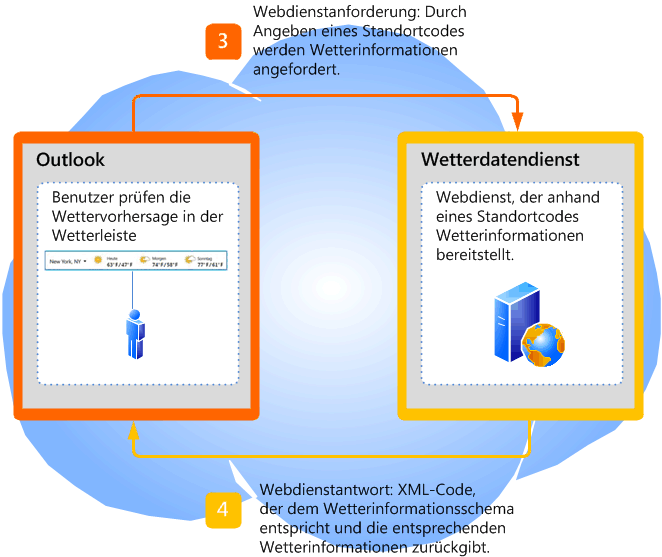

# <a name="extending-the-weather-bar-in-outlook"></a><span data-ttu-id="64b03-103">Erweitern der Wetterleiste in Outlook</span><span class="sxs-lookup"><span data-stu-id="64b03-103">Extending the Weather Bar in Outlook</span></span>

<span data-ttu-id="64b03-104">Hier erhalten Sie Informationen zum Integrieren eines Wetterwebdiensts eines Drittanbieters in die Wetterleiste in Outlook 2013, um Wetterbedingungen für einen vom Benutzer ausgewählten Ort bereitzustellen.</span><span class="sxs-lookup"><span data-stu-id="64b03-104">Learn how to plug in a third-party weather web service for the Weather Bar in Outlook 2013, to provide weather conditions data for a user-chosen location.</span></span>
  
## <a name="weather-bar-overview"></a><span data-ttu-id="64b03-105">Übersicht über die Wetterleiste</span><span class="sxs-lookup"><span data-stu-id="64b03-105">Weather Bar overview</span></span>
<span data-ttu-id="64b03-106"><a name="ol15_weatherbar_overview"> </a></span><span class="sxs-lookup"><span data-stu-id="64b03-106"></span></span>

<span data-ttu-id="64b03-p101">In der Wetterleiste in Outlook werden die Wetterbedingungen und die Wettervorhersage für einen geografischen Standort angezeigt. Ein Benutzer kann einen oder mehrere Orte auswählen und Wetterdaten in der Wetterleiste im Kalendermodul sehen. Abbildung 1 zeigt die Wetterleiste mit einer 3-tägigen Wettervorhersage für New York, NY.</span><span class="sxs-lookup"><span data-stu-id="64b03-p101">The Weather Bar in Outlook displays weather conditions and forecast for a geographic location. A user can choose one or multiple locations, and conveniently see weather data in the Weather Bar in the calendar module. Figure 1 shows the Weather Bar displaying a three-day forecast for New York, NY.</span></span> 
  
<span data-ttu-id="64b03-110">**Abbildung 1. Wetterleiste in Outlook**</span><span class="sxs-lookup"><span data-stu-id="64b03-110">**Figure 1. Weather Bar in Outlook**</span></span>


  
<span data-ttu-id="64b03-p102">Einstellungen für die Wetterleiste werden mit dem Benutzerprofil gespeichert. Je nach Outlook-Kontotyp wechselt die Einstellung, wie im Falle von Exchange-Konten, möglicherweise mit dem Benutzer auf allen Computern, auf denen er sich mit demselben Profil anmeldet. Alternativ kann der Benutzer die Einstellungen, wie im Falle von IMAP-/POP-Konten, auf jedem Computer anpassen.</span><span class="sxs-lookup"><span data-stu-id="64b03-p102">Settings for the Weather Bar are saved with the user's profile. Depending on the type of Outlook account, the settings may roam with the user on all computers that the user logs on to with the same profile, as in the case of Exchange accounts. Alternatively, the user can customize settings on each computer, as in the case of IMAP/POP accounts.</span></span>
  
<span data-ttu-id="64b03-p103">Standardmäßig verwendet Outlook die von MSN Wetter bereitgestellten Wetterdaten. Die Wetterleiste unterstützt Wetterdaten von Drittanbieterwetterdiensten, die über ein definiertes Protokoll mit Outlook kommunizieren. Solange ein Drittanbieterwetterdienst dieses Protokoll unterstützt, können Benutzer die Wetterdaten von diesem Dienst in der Wetterleiste verwenden. In diesem Artikel wird das Protokoll für Drittanbieterwetterdienste für die Integration in die Wetterleiste in Outlook beschrieben.</span><span class="sxs-lookup"><span data-stu-id="64b03-p103">By default, Outlook uses weather data provided by MSN Weather. The Weather Bar supports third-party weather data web services that follow a defined protocol to communicate with Outlook. As long as a third-party weather data service supports this protocol, users can choose that weather data service to provide weather data in the Weather Bar. This article describes the protocol for third-party weather services to integrate with Outlook in the Weather Bar.</span></span>
  
## <a name="weather-bar-protocol"></a><span data-ttu-id="64b03-119">Wetterleistenprotokoll</span><span class="sxs-lookup"><span data-stu-id="64b03-119">Weather Bar protocol</span></span>
<span data-ttu-id="64b03-120"><a name="ol15_weatherbar_theprotocol"> </a></span><span class="sxs-lookup"><span data-stu-id="64b03-120"></span></span>

<span data-ttu-id="64b03-121">Der Benutzer kann einen anderen Wetterdienst für die Wetterleiste angeben. Dieser muss allerdings das folgende Protokoll für die Kommunikation mit Outlook unterstützen.</span><span class="sxs-lookup"><span data-stu-id="64b03-121">A user can specify a different weather data service for the Weather Bar, as long as that weather data service implements a web service that supports the following protocol to communicate with Outlook:</span></span>
  
1. <span data-ttu-id="64b03-p104">Der Wetterdienst unterstützt eine Basis-URL zu einem Webdienst. Ein Contoso-Wetterwebdienst beispielsweise kann die Basis-URL http://service.contoso.com/data.aspx haben.</span><span class="sxs-lookup"><span data-stu-id="64b03-p104">The weather data service supports a base URL to a web service. For example, a Contoso Weather web service can have a base URL of http://service.contoso.com/data.aspx.</span></span>
    
2. <span data-ttu-id="64b03-124">Mit dem Webdienst können die folgenden Parameter in Outlook an die Basis-URL angefügt werden, um einen Ortscode anzufordern:</span><span class="sxs-lookup"><span data-stu-id="64b03-124">The web service allows Outlook to append the following parameters to the base URL, to request a location code:</span></span> 
    
   - <span data-ttu-id="64b03-125">outputview = search: Dieser Parameter gibt an, dass es sich bei der Anforderung um eine Standortsuche handelt.</span><span class="sxs-lookup"><span data-stu-id="64b03-125">This parameter indicates that the request is a location search.</span></span>
    
   - <span data-ttu-id="64b03-126">weasearchstr= _city_: Dieser Parameter gibt den Standort, also die _Stadt_ an, für die der Benutzer eine Wettervorhersage wünscht (z. B. London).</span><span class="sxs-lookup"><span data-stu-id="64b03-126">This parameter indicates the location,  _city_, for which the user wants a weather forecast (for example, London).</span></span>
    
   - <span data-ttu-id="64b03-127">culture= _LCID_: Dieser Parameter gibt die Kultur der für den Benutzer auf diesem Computer installierten Office-Version an.</span><span class="sxs-lookup"><span data-stu-id="64b03-127">This parameter indicates the culture of the version of Office installed for the user on that computer.</span></span> <span data-ttu-id="64b03-128">Der LCID-Wert ist in [[RFC4646]-Tags für die Identifizierung von Sprachen](http://www.ietf.org/rfc/rfc4646.txt) definiert.</span><span class="sxs-lookup"><span data-stu-id="64b03-128">The LCID value is defined in [[RFC4646] Tags for Identifying Languages](http://www.ietf.org/rfc/rfc4646.txt)</span></span>
    
   - <span data-ttu-id="64b03-129">src=outlook: Dieser Parameter gibt an, dass Outlook die Clientanwendung ist, die den Dienst anfordert.</span><span class="sxs-lookup"><span data-stu-id="64b03-129">This parameter indicates that Outlook is the client application requesting the service.</span></span>
    
   <span data-ttu-id="64b03-p106">Mit diesen Parametern kann Outlook den vom Benutzer gewünschten Ort verwenden und, wie vom Wetterdienst unterstützt, nach dem dazugehörigen Ortscode suchen. Der Wetterdienst sendet dann als Antwort an Outlook einen Ortscode im XML-Format, der dem [Outlook Weather Location XML Schema](outlook-weather-location-xml-schema.md) folgt. Abbildung 2 fasst die Webdienstanforderung und den darauf zurückgegebenen Ortscode zusammen.</span><span class="sxs-lookup"><span data-stu-id="64b03-p106">These parameters allow Outlook to take the location that the user is interested in and search for the associated location code as supported by the weather data service. The web service should respond to Outlook with a location code in XML that follows the [Outlook Weather Location XML Schema](outlook-weather-location-xml-schema.md). Figure 2 summarizes the web service request and response for a location code.</span></span>
    
   <span data-ttu-id="64b03-133">**Abbildung 2. Webdienstanforderung und der darauf zurückgegebene Ortscode**</span><span class="sxs-lookup"><span data-stu-id="64b03-133">**Figure 2. Web service request and response for a location code**</span></span>

   
  
3. <span data-ttu-id="64b03-135">Mit dem Webdienst kann Outlook zudem die folgenden Parameter anfügen, um Vorhersageinformationen für einen Ortscode anzufordern:</span><span class="sxs-lookup"><span data-stu-id="64b03-135">The web service also allows Outlook to append the following parameters, to request forecast information for a location code:</span></span>
    
   - <span data-ttu-id="64b03-136">wealocations= _code_: _code_ steht in diesem Parameter für einen Ortscode, den Outlook in Schritt 2 abruft, und der dem vom Benutzer gewünschten Ort zugeordnet wird.</span><span class="sxs-lookup"><span data-stu-id="64b03-136">_code_ in this parameter is a location code that Outlook obtains from Step 2, and that maps to the location that the user is interested in.</span></span> 
    
   - <span data-ttu-id="64b03-137">weadegreetype= _degreetype_: Dieser Parameter gibt an, ob das metrische oder imperiale Maßsystem für Temperatur verwendet wird.</span><span class="sxs-lookup"><span data-stu-id="64b03-137">This parameter specifies whether to use metric or imperial units of measurement for temperature.</span></span> <span data-ttu-id="64b03-138">Geben Sie c für Metrisch oder f für Imperial unter _Degreetype_ ein.</span><span class="sxs-lookup"><span data-stu-id="64b03-138">Specify c for metric, f for imperial for  _degreetype_.</span></span> <span data-ttu-id="64b03-139">Dieser Parameter ist optional und ist nicht immer in der Webserviceanfrage vorhanden.</span><span class="sxs-lookup"><span data-stu-id="64b03-139">This parameter is optional and does not always exist in the web service request.</span></span>
    
   - <span data-ttu-id="64b03-140">culture= _LCID_: Dieser Parameter gibt die Kultur der für den Benutzer auf diesem Computer installierten Office-Version an.</span><span class="sxs-lookup"><span data-stu-id="64b03-140">This parameter indicates the culture of the version of Office installed for the user on that computer.</span></span> <span data-ttu-id="64b03-141">Der LCID-Wert ist in [[RFC4646]-Tags für die Identifizierung von Sprachen](http://www.ietf.org/rfc/rfc4646.txt) definiert.</span><span class="sxs-lookup"><span data-stu-id="64b03-141">The LCID value is defined in [[RFC4646] Tags for Identifying Languages](http://www.ietf.org/rfc/rfc4646.txt)</span></span>
    
   - <span data-ttu-id="64b03-142">src=outlook: Dieser Parameter gibt an, dass Outlook die Clientanwendung ist, die den Dienst anfordert.</span><span class="sxs-lookup"><span data-stu-id="64b03-142">This parameter indicates that Outlook is the client application requesting the service.</span></span>
    
   <span data-ttu-id="64b03-p109">Diese Parameter ermöglichen Outlook die Verwendung des im Schritt 2 zurückgegebenen Ortscodes und fordern Webdienstdaten für die Wettervorhersage an. Der Webdienst sollte eine Antwort an Outlook mit den entsprechenden Wetterdaten in XML senden, die das [Outlook Weather Information XML Schema](outlook-weather-information-xml-schema.md) befolgen. In Abbildung 3 ist die Webdienstanforderung und die Antwort mit Wetterinformationen für einen bestimmten Ortscode dargestellt.</span><span class="sxs-lookup"><span data-stu-id="64b03-p109">These parameters allow Outlook to take the location code returned from Step 2 and request the weather data service for the forecast. The web service should respond to Outlook with the corresponding weather data in XML that follows the [Outlook Weather Information XML Schema](outlook-weather-information-xml-schema.md). Figure 3 summarizes the web service request and response for weather data given a location code.</span></span>
    
   <span data-ttu-id="64b03-146">**Abbildung 3. Webdienstanforderung und Antwort mit Wetterinformationen**</span><span class="sxs-lookup"><span data-stu-id="64b03-146">**Figure 3. Web service request and response for weather information**</span></span>

   
  
## <a name="setting-the-weather-bar-to-use-a-weather-service"></a><span data-ttu-id="64b03-148">Festlegen eines in der Wetterleiste zu verwendenden Wetterdiensts</span><span class="sxs-lookup"><span data-stu-id="64b03-148">Setting the Weather Bar to use a weather service</span></span>
<span data-ttu-id="64b03-149"><a name="ol15_weatherbar_setting"> </a></span><span class="sxs-lookup"><span data-stu-id="64b03-149"></span></span>

<span data-ttu-id="64b03-p110">Der Administrator oder der Hauptbenutzer können mit dem **WeatherServiceUrl**-Registrierungsschlüssel die Verwendung eines bestimmten Wetterdiensts in der Wetterleiste festlegen. Wenn die Basis-URL für einen Contoso-Wetterdienst beispielsweise http://service.contoso.com/data.aspx lautet, können Sie den **WeatherServiceUrl**-Schlüssel auf diese URL festlegen.</span><span class="sxs-lookup"><span data-stu-id="64b03-p110">The administrator or power user can use the **WeatherServiceUrl** registry key to customize the Weather Bar to use a specific weather service. For example, if the base URL for a Contoso weather service is http://service.contoso.com/data.aspx, you can set the **WeatherServiceUrl** key to that URL.</span></span> 
  
<span data-ttu-id="64b03-152">In der folgenden Tabelle wird der **WeatherServiceUrl**-Schlüssel beschrieben.</span><span class="sxs-lookup"><span data-stu-id="64b03-152">The following table describes the **WeatherServiceUrl** key.</span></span> 
  
|||
|:-----|:-----|
|<span data-ttu-id="64b03-153">**Schlüssel**</span><span class="sxs-lookup"><span data-stu-id="64b03-153">**Key**</span></span> <br/> |<span data-ttu-id="64b03-154">HKCU\Software\Microsoft\Office\15.0\Outlook\Options\Calendar</span><span class="sxs-lookup"><span data-stu-id="64b03-154">HKCU\Software\Microsoft\Office\15.0\Outlook\Options\Calendar</span></span>  <br/> |
|<span data-ttu-id="64b03-155">**Wertname**</span><span class="sxs-lookup"><span data-stu-id="64b03-155">**Value name**</span></span> <br/> |<span data-ttu-id="64b03-156">**WeatherServiceUrl**</span><span class="sxs-lookup"><span data-stu-id="64b03-156">**WeatherServiceUrl**</span></span> <br/> |
|<span data-ttu-id="64b03-157">**Werttyp**</span><span class="sxs-lookup"><span data-stu-id="64b03-157">**Value type**</span></span> <br/> |<span data-ttu-id="64b03-158">REG_SZ</span><span class="sxs-lookup"><span data-stu-id="64b03-158">REG_SZ</span></span>  <br/> |
|<span data-ttu-id="64b03-159">**Standardwert**</span><span class="sxs-lookup"><span data-stu-id="64b03-159">**Default value**</span></span> <br/> |<span data-ttu-id="64b03-160">EMPTY_STRING</span><span class="sxs-lookup"><span data-stu-id="64b03-160">EMPTY_STRING</span></span>  <br/> |
|<span data-ttu-id="64b03-161">**Beschreibung**</span><span class="sxs-lookup"><span data-stu-id="64b03-161">**Description**</span></span> <br/> |<span data-ttu-id="64b03-162">URL zu einem Wetterdatendienst</span><span class="sxs-lookup"><span data-stu-id="64b03-162">URL to a weather data service.</span></span>  <br/> |
   
## <a name="dependent-conditions"></a><span data-ttu-id="64b03-163">Abhängige Bedingungen</span><span class="sxs-lookup"><span data-stu-id="64b03-163">Dependent conditions</span></span>
<span data-ttu-id="64b03-164"><a name="ol15_weatherbar_dependentconditions"> </a></span><span class="sxs-lookup"><span data-stu-id="64b03-164"></span></span>

<span data-ttu-id="64b03-p111">Outlook 2013 zeigt standardmäßig die Wetterleiste an. In diesem Abschnitt werden einige Gründe für das Nichtanzeigen der Wetterleiste aufgeführt.</span><span class="sxs-lookup"><span data-stu-id="64b03-p111">Outlook 2013 displays the Weather Bar by default. This section describes a few reasons why the Weather Bar might not be visible.</span></span>
  
### <a name="weather-bar-is-disabled"></a><span data-ttu-id="64b03-167">Wetterleiste ist deaktiviert.</span><span class="sxs-lookup"><span data-stu-id="64b03-167">Weather Bar is disabled</span></span>

<span data-ttu-id="64b03-168">Überprüfen Sie zunächst dass **Wetter im Kalender anzeigen** auf der Registerkarte **Kalender** im Dialogfeld **Outlook-Optionen** ausgewählt ist.</span><span class="sxs-lookup"><span data-stu-id="64b03-168">First, verify that **Show weather on the calendar** is selected in the **Calendar** tab in the **Outlook Options** dialog box.</span></span> 
  
<span data-ttu-id="64b03-169">Beachten Sie, dass ein Administrator mithilfe der Gruppenrichtlinie die Wetterleiste in Outlook 2013 deaktivieren kann.</span><span class="sxs-lookup"><span data-stu-id="64b03-169">Note that an administrator can also use Group Policy to disable the Weather Bar in Outlook 2013 entirely by setting the following key in the Windows registry:</span></span>
  
|||
|:-----|:-----|
|<span data-ttu-id="64b03-170">**Schlüssel**</span><span class="sxs-lookup"><span data-stu-id="64b03-170">**Key**</span></span> <br/> |<span data-ttu-id="64b03-171">HKCU\Software\Microsoft\Office\15.0\Outlook\Options\Calendar</span><span class="sxs-lookup"><span data-stu-id="64b03-171">HKCU\Software\Microsoft\Office\15.0\Outlook\Options\Calendar</span></span>  <br/> |
|<span data-ttu-id="64b03-172">**Wertname**</span><span class="sxs-lookup"><span data-stu-id="64b03-172">**Value name**</span></span> <br/> |<span data-ttu-id="64b03-173">**DisableWeather**</span><span class="sxs-lookup"><span data-stu-id="64b03-173">**DisableWeather**</span></span> <br/> |
|<span data-ttu-id="64b03-174">**Werttyp**</span><span class="sxs-lookup"><span data-stu-id="64b03-174">**Value type**</span></span> <br/> |<span data-ttu-id="64b03-175">REG_DWORD</span><span class="sxs-lookup"><span data-stu-id="64b03-175">REG_DWORD</span></span>  <br/> |
|<span data-ttu-id="64b03-176">**Standardwert**</span><span class="sxs-lookup"><span data-stu-id="64b03-176">**Default value**</span></span> <br/> |<span data-ttu-id="64b03-177">0</span><span class="sxs-lookup"><span data-stu-id="64b03-177">0%</span></span>  <br/> |
|<span data-ttu-id="64b03-178">**Beschreibung**</span><span class="sxs-lookup"><span data-stu-id="64b03-178">**Description**</span></span> <br/> |<span data-ttu-id="64b03-179">Mit dem Wert 0 wird die Wetterleiste aktiviert; mit jedem anderen Wert wird die Wetterleiste deaktiviert.</span><span class="sxs-lookup"><span data-stu-id="64b03-179">A value of 0 enables the Weather Bar; any other value disables the Weather Bar.</span></span>  <br/> |
   
<span data-ttu-id="64b03-p112">Wenn die Wetterleiste mithilfe der Gruppenrichtlinie deaktiviert wurde, wird auf der Registerkarte **Kalender** das Kontrollkästchen **Wetter im Kalender anzeigen** nicht angezeigt. Wenden Sie sich an den Administrator, um die Wetterleiste wieder zu aktivieren.</span><span class="sxs-lookup"><span data-stu-id="64b03-p112">If the Weather Bar feature has been disabled by Group Policy, the **Calendar** tab does not include the **Show weather on the calendar** check box. Consult with the administrator to turn the feature back on.</span></span> 
  
### <a name="office-is-disconnected-from-the-internet"></a><span data-ttu-id="64b03-182">Office ist nicht mit dem Internet verbunden.</span><span class="sxs-lookup"><span data-stu-id="64b03-182">Office is disconnected from the Internet</span></span>

<span data-ttu-id="64b03-183">Stellen Sie sicher, dass Office eine Verbindung mit dem Internet herstellen kann. Wechseln Sie hierzu zur Registerkarte **Datenschutzoptionen** vom **Trust Center** in der Backstage-Ansicht, und vergewissern Sie sich, dass die Option **Internetverbindungen für Office zulassen** ausgewählt ist.</span><span class="sxs-lookup"><span data-stu-id="64b03-183">Verify that Office is enabled to connect to the Internet—go to the **Privacy options** tab of the **Trust Center** in the Backstage view, and ensure that **Allow Office to connect to the Internet** is selected.</span></span> 
  
<span data-ttu-id="64b03-184">Die Wetterleiste ist ebenfalls deaktiviert, wenn der Benutzer keine Updates für Office erhält.</span><span class="sxs-lookup"><span data-stu-id="64b03-184">If the user has chosen to not receive updates for Office, the Weather Bar is also disabled.</span></span>
  
<span data-ttu-id="64b03-185">Ein Administrator kann auch mithilfe der Gruppenrichtlinie den gesamten Onlineinhalt einschließlich Wetterleiste deaktivieren, indem er den folgenden Schlüssel in der Windows-Registrierung festlegt:</span><span class="sxs-lookup"><span data-stu-id="64b03-185">An administrator can also use Group Policy to disable all online content, including the Weather Bar, by setting the following key in the Windows registry:</span></span>
  
|||
|:-----|:-----|
|<span data-ttu-id="64b03-186">**Schlüssel**</span><span class="sxs-lookup"><span data-stu-id="64b03-186">**Key**</span></span> <br/> |<span data-ttu-id="64b03-187">HKCU\Software\Microsoft\Office\15.0\Common\Internet</span><span class="sxs-lookup"><span data-stu-id="64b03-187">HKCU\Software\Microsoft\Office\15.0\Common\Internet</span></span>  <br/> |
|<span data-ttu-id="64b03-188">**Wertname**</span><span class="sxs-lookup"><span data-stu-id="64b03-188">**Value name**</span></span> <br/> |<span data-ttu-id="64b03-189">**UseOnlineContent**</span><span class="sxs-lookup"><span data-stu-id="64b03-189">**UseOnlineContent**</span></span> <br/> |
|<span data-ttu-id="64b03-190">**Werttyp**</span><span class="sxs-lookup"><span data-stu-id="64b03-190">**Value type**</span></span> <br/> |<span data-ttu-id="64b03-191">REG_DWORD</span><span class="sxs-lookup"><span data-stu-id="64b03-191">REG_DWORD</span></span>  <br/> |
|<span data-ttu-id="64b03-192">**Standardwert**</span><span class="sxs-lookup"><span data-stu-id="64b03-192">**Default value**</span></span> <br/> |<span data-ttu-id="64b03-193">2</span><span class="sxs-lookup"><span data-stu-id="64b03-193">-2</span></span>  <br/> |
|<span data-ttu-id="64b03-194">**Beschreibung**</span><span class="sxs-lookup"><span data-stu-id="64b03-194">**Description**</span></span> <br/> |<span data-ttu-id="64b03-195">Mit dem Wert 2 wird die Wetterleiste aktiviert; mit jedem anderen Wert wird die Wetterleiste deaktiviert.</span><span class="sxs-lookup"><span data-stu-id="64b03-195">A value of 2 enables the Weather Bar; any other value disables the Weather Bar.</span></span>  <br/> |
   
<span data-ttu-id="64b03-p113">Wenn die Wetterleiste mithilfe der Gruppenrichtlinie deaktiviert wurde, wird auf der Registerkarte **Kalender** das Kontrollkästchen **Wetter im Kalender anzeigen** nicht angezeigt. Wenden Sie sich an den Administrator, um die Wetterleiste wieder zu aktivieren.</span><span class="sxs-lookup"><span data-stu-id="64b03-p113">If the Weather Bar feature has been disabled by Group Policy, the **Calendar** tab does not include the **Show weather on the calendar** check box. Consult with the administrator to turn the feature back on.</span></span> 
  
## <a name="weather-bar-example"></a><span data-ttu-id="64b03-198">Beispiel einer Wetterleiste</span><span class="sxs-lookup"><span data-stu-id="64b03-198">Weather Bar example</span></span>
<span data-ttu-id="64b03-199"><a name="ol15_weatherbar_example"> </a></span><span class="sxs-lookup"><span data-stu-id="64b03-199"></span></span>

<span data-ttu-id="64b03-p114">In diesem Abschnitt wird ein Beispiel eines Contoso-Wetterdiensts aufgeführt, der das vorherige Protokoll für die Kommunikation mit Outlook verwendet. Outlook ruft für jeden vom Benutzer ausgewählten Ort zunächst einen Ortscode von Contoso Wetter ab, und ruft anschließend unter Verwendung dieses Ortscodes den Contoso-Wetterdienst auf, um die Wetterdaten abzurufen.</span><span class="sxs-lookup"><span data-stu-id="64b03-p114">This section shows an example of a Contoso Weather service that follows the preceding protocol to communicate with Outlook. For any location that the user selects, Outlook first gets a location code for that location from Contoso Weather, then using that location code, calls the Contoso Weather service to get the weather data.</span></span>
  
### <a name="base-url"></a><span data-ttu-id="64b03-202">Basis-URL</span><span class="sxs-lookup"><span data-stu-id="64b03-202">Base URL</span></span>

<span data-ttu-id="64b03-203">Contoso Wetter bietet die folgende Basis-URL für den Wetterdatendienst:</span><span class="sxs-lookup"><span data-stu-id="64b03-203">Contoso Weather provides the following base URL for their weather data service:</span></span>
  
http://service.contoso.com/data.aspx
  
### <a name="getting-a-location-code"></a><span data-ttu-id="64b03-204">Abrufen eines Ortscodes</span><span class="sxs-lookup"><span data-stu-id="64b03-204">Getting a location code</span></span>

<span data-ttu-id="64b03-205">Outlook fügt die oben in Schritt 2 beschriebenen Parameter an die Basis-URL an, um den Ortscode für einen geografischen Standort  _Ort_ abzurufen:</span><span class="sxs-lookup"><span data-stu-id="64b03-205">Outlook appends the parameters described in Step 2 above to the base URL to obtain the location code for a geographic location  _city_:</span></span>
  
<span data-ttu-id="64b03-206">http://service.contoso.com/data.aspx?outputview=search&amp;weasearchstr= _Ort_</span><span class="sxs-lookup"><span data-stu-id="64b03-206">http://service.contoso.com/data.aspx?outputview=search&amp;weasearchstr= _city_</span></span>
  
<span data-ttu-id="64b03-207">Beispiel: Wenn der BenutzerTokio in der Wetterleiste ausgewählt hat, verwendet Outlook die folgende URL zum Abrufen des Ortscodes für Tokio von Contoso Wetter:</span><span class="sxs-lookup"><span data-stu-id="64b03-207">As an example, if the user has selected Tokyo in the Weather Bar, Outlook uses the following URL to obtain the location code for Tokyo from Contoso Weather:</span></span> 
  
<span data-ttu-id="64b03-208">http://weather.service.contoso.com/data.aspx?outputview=search&amp;weasearchstr=tokyo</span><span class="sxs-lookup"><span data-stu-id="64b03-208">http://weather.service.contoso.com/data.aspx?outputview=search&amp;weasearchstr=tokyo</span></span>
  
<span data-ttu-id="64b03-p115">Contoso Wetter sendet die folgenden XML-Daten als Antwort zum Bereitstellen des Ortscodes für Tokio. Die XML-Daten entsprechen dem Outlook Weather Location XML-Schema. Beachten Sie, dass Wetterdienste in der Regel Daten für mehrere Orte zurückgeben (z. B. wenn der ausgewählte Ort eine Metropolregion ist). In diesem Beispiel umfasst die Antwort für Tokio zwei Orte, wobei jeder vom [weather](weather-element-weatherdata-elementoutlook-weather-location-schema.md)-Element eingeschlossen ist. Die entsprechenden Ortscodes lauten wie folgt:</span><span class="sxs-lookup"><span data-stu-id="64b03-p115">Contoso Weather responds with the following XML to provide the location code for Tokyo. The XML conforms to the Outlook Weather Location XML Schema. Note that it is common for weather services to return data for more than one location (for example, if the selected location is a greater metropolitan area). In this example, the response for Tokyo includes two locations, each enclosed in a [weather](weather-element-weatherdata-elementoutlook-weather-location-schema.md) element. The corresponding location codes are as follows:</span></span> 
  
- <span data-ttu-id="64b03-214">wc:JAXX0085 für das **weatherlocationname**-Attribut  `Tokyo, JPN`</span><span class="sxs-lookup"><span data-stu-id="64b03-214">wc:JAXX0085 for the **weatherlocationname** attribute being  `Tokyo, JPN`</span></span>
    
- <span data-ttu-id="64b03-215">wc:10038604 für das **weatherlocationname**-Attribut  `Shinjuku-ku, Tokyo, Japan`</span><span class="sxs-lookup"><span data-stu-id="64b03-215">wc:10038604 for the **weatherlocationname** attribute being  `Shinjuku-ku, Tokyo, Japan`</span></span>
    
```XML
<?xml version="1.0" ?>
<weatherdata>
  <weather weatherlocationcode="wc:JAXX0085" 
    weatherlocationname="Tokyo, JPN">
  </weather>
  <weather weatherlocationcode="wc:10038604" 
    weatherlocationname="Shinjuku-ku, JPN">
  </weather>
</weatherdata>

```

### <a name="getting-weather-information-for-a-location-code"></a><span data-ttu-id="64b03-216">Abrufen von Wetterinformationen für einen Ortscode</span><span class="sxs-lookup"><span data-stu-id="64b03-216">Getting weather information for a location code</span></span>

<span data-ttu-id="64b03-217">Nach Abrufen des Ortscodes für einen Standort fügt Outlook die oben in Schritt 3 beschriebenen Parameter an die Basis-URL an, um die Wetterinformationen für diesen Ortscode abzurufen.</span><span class="sxs-lookup"><span data-stu-id="64b03-217">After obtaining the location code for a location, Outlook appends the parameters described in Step 3 above to the base URL to obtain weather information for that location code.</span></span>
  
<span data-ttu-id="64b03-218">http://service.contoso.com/data.aspx?wealocations= _Code_</span><span class="sxs-lookup"><span data-stu-id="64b03-218">http://service.contoso.com/data.aspx?wealocations= _code_</span></span>
  
<span data-ttu-id="64b03-219">Beispiel: Wenn Outlook den Ortscode wc:JAXX0085 von Contoso Wetter für Tokio abgerufen hat, verwendet Outlook diesen Ortscode in der folgenden URL, um die Wetterinformationen abzurufen.</span><span class="sxs-lookup"><span data-stu-id="64b03-219">As an example, if Outlook has obtained the location code wc:JAXX0085 from Contoso Weather for Tokyo, Outlook uses this location code in the following URL to get the weather information.</span></span>
  
http://service.contoso.com/data.aspx?wealocations=wc:JAXX0085
  
<span data-ttu-id="64b03-p116">Contoso Wetter sendet als Antwort die folgenden XML-Daten, um die Wetterinformationen für den Ortscode für Tokio bereitzustellen. Die XML-Daten folgen dem Outlook Weather Information XML-Schema.</span><span class="sxs-lookup"><span data-stu-id="64b03-p116">Contoso Weather responds with the following XML to provide the weather information for the location code for Tokyo. The XML conforms to the Outlook Weather Information XML Schema.</span></span>
  
```XML
<?xml version="1.0"?>
<weatherdata>
  <weather timezone="9" attribution="Data provided by Trey Research" 
    degreetype="F" imagerelativeurl="http://contoso.com/images/en-us/" 
    url="http://contoso.com/weather.aspx?eid=33568&amp;q=Tokyo-JPN" 
    weatherlocationname="Tokyo, JPN" 
    weatherlocationcode="wc:JAXX0085">
      <current winddisplay="9 mph NNW" windspeed="9" humidity="90" feelslike="44" 
        observationpoint="Tokyo" observationtime="06:00:00" 
        shortday="Sat" day="Saturday" date="2012-04-14" skytext="Rain" skycode="11" 
        temperature="48"/>
      <forecast shortday="Sat" day="Saturday" date="2012-04-14" precip="95" skytextday="Rain"
        skycodeday="11" high="55" low="47"/>
      <forecast shortday="Sun" day="Sunday" date="2012-04-15" precip="5" skytextday="Partly Cloudy" 
        skycodeday="30" high="65" low="43"/>
      <forecast shortday="Mon" day="Monday" date="2012-04-16" precip="5" skytextday="Partly Cloudy" 
        skycodeday="30" high="64" low="52"/>
      <forecast shortday="Tue" day="Tuesday" date="2012-04-17" precip="70" skytextday="Showers / Clear" 
        skycodeday="39" high="66" low="53"/>
      <forecast shortday="Wed" day="Wednesday" date="2012-04-18" precip="55" skytextday="Showers / Clear" 
        skycodeday="39" high="68" low="51"/>
  </weather>
</weatherdata>

```

### <a name="resetting-outlook-to-use-msn-weather"></a><span data-ttu-id="64b03-222">Zurücksetzen von Outlook zum Verwenden von MSN Wetter</span><span class="sxs-lookup"><span data-stu-id="64b03-222">Resetting Outlook to use MSN Weather</span></span>

<span data-ttu-id="64b03-p117">Auch wenn Outlook standardmäßig MSN Wetter verwendet, kann der Benutzer, nachdem er einen anderen Wetterdienst für die Wetterleiste ausgewählt hat, den **WeatherServiceUrl**-Schlüssel in der Windows-Registrierung löschen, um MSN Wetter erneut zu verwenden. Durch Löschen dieses Registrierungsschlüssel wird Outlook zum Verwenden von MSN Wetter zurückgesetzt.</span><span class="sxs-lookup"><span data-stu-id="64b03-p117">Even though Outlook uses MSN Weather by default, if a user has customized the Weather Bar to use a different weather service and subsequently wants to use MSN Weather again, the user can simply delete the **WeatherServiceUrl** key in the Windows Registry. Deleting that registry key resets Outlook to use MSN Weather.</span></span> 
  
## <a name="conclusion"></a><span data-ttu-id="64b03-225">Schlussbemerkung</span><span class="sxs-lookup"><span data-stu-id="64b03-225">Conclusion</span></span>
<span data-ttu-id="64b03-226"><a name="ol15_weatherbar_conclusion"> </a></span><span class="sxs-lookup"><span data-stu-id="64b03-226"></span></span>

<span data-ttu-id="64b03-p118">Die Wetterleiste im Outlook-Kalender verwendet standardmäßig MSN Wetter für die Bereitstellung der Wettervorhersage für einen bestimmten Ort. Benutzer können Wetterinformationen für die gewünschten Orte sehen. Drittanbieter-Wetterdatendienste können auch in die Wetterleiste integriert werden, wenn Sie das Outlook Weather Location XML-Schema und das Outlook Weather Information XML-Schema unterstützen, und einen einfachen Webdienstprotokoll für die Kommunikation mit Outlook befolgen.</span><span class="sxs-lookup"><span data-stu-id="64b03-p118">The Weather Bar in the Outlook calendar uses MSN Weather by default to provide the weather forecast for a specified location. Users can conveniently see weather information for the locations they care about. Third-party weather data services can also integrate with the Weather Bar by supporting the Outlook Weather Location XML Schema and Outlook Weather Information XML Schema and following a simple web service protocol with Outlook.</span></span>
  
## <a name="see-also"></a><span data-ttu-id="64b03-230">Siehe auch</span><span class="sxs-lookup"><span data-stu-id="64b03-230">See also</span></span>

- [<span data-ttu-id="64b03-231">XML-Schema für Wetterstandort in Outlook</span><span class="sxs-lookup"><span data-stu-id="64b03-231">Outlook Weather Location XML Schema</span></span>](outlook-weather-location-xml-schema.md)   
- [<span data-ttu-id="64b03-232">Outlook Weather Information XML Schema</span><span class="sxs-lookup"><span data-stu-id="64b03-232">Outlook Weather Information XML Schema</span></span>](outlook-weather-information-xml-schema.md)
    

