# Massenaktualisierung von benutzerdefinierten Feldern und Erstellen von Projektwebsites aus einem Workflow in Project Online

Um Kunden dabei zu unterstützen, Project Online nutzen und die Erweiterbarkeit und Flexibilität unserer Dienste zu verbessern, haben wir dem clientseitigen Objektmodell, das Sie in Project Online-Apps und Workflows verwenden können, zwei Methoden hinzugefügt.
  
|||
|:-----|:-----|
|**UpdateCustomFields**   |Massenaktualisierungen von benutzerdefinierten Projektfeldern. Nur Project Online. Nur in der REST-API verfügbar.    |
|**CreateProjectSite**   | Erstellt eine Project Website. Nur Project Online. Verfügbar in der REST-API, dem verwalteten Clientobjektmodell und dem JavaScript-Clientobjektmodell.    |
   
Diese Methoden bieten nicht nur mehr Flexibilität, sondern bieten auch erhebliche Leistungsverbesserungen beim Speichern und Veröffentlichen von Projekten in einem Workflow. In diesem Artikel wird die Verwendung der Methoden in der REST-API beschrieben und Anweisungen zum Erstellen eines Workflows zum Massenupdate benutzerdefinierter Felder und eines Workflows zum Erstellen einer Project bereitgestellt.
  
> [!NOTE]
> Weitere Informationen zum Aufrufen von REST-APIs aus SharePoint 2013-Workflows finden Sie unter [Using SharePoint REST services from workflow with POST method](https://mysharepointinsight.blogspot.com/2013/05/using-sharepoint-rest-services-from.mdl) und Calling the SharePoint [2013 Rest API from a SharePoint Designer Workflow](https://sergeluca.wordpress.com/2013/04/09/calling-the-sharepoint-2013-rest-api-from-a-sharepoint-designer-workflow/). 
  
## Massenaktualisierung benutzerdefinierter Projektfelder aus einem Workflow

Zuvor konnten Workflows nur ein benutzerdefiniertes Feld gleichzeitig aktualisieren. Das aktualisieren von benutzerdefinierten Feldern eines Projekts kann zu einer schlechten Endbenutzererfahrung führen, wenn Benutzer zwischen Project Detailseiten umwechseln. Jedes Update erforderte eine separate Serveranforderung mithilfe der Aktion **Set Project Field,** und das Aktualisieren mehrerer benutzerdefinierter Felder in einem Netzwerk mit hoher Latenz und geringer Bandbreite führte zu einem nicht trivialen Aufwand. Um dieses Problem zu beheben, haben wir die **UpdateCustomFields-Methode** zur REST-API hinzugefügt, mit der Sie benutzerdefinierte Felder massenaktualisierungen können. Um **UpdateCustomFields zu** verwenden, übergeben Sie ein Wörterbuch, das die Namen und Werte aller benutzerdefinierten Felder enthält, die Sie aktualisieren möchten.
  
Die REST-Methode befindet sich am folgenden Endpunkt:
  
`https://<site-url>/_api/ProjectServer/Projects('<guid>')/Draft/UpdateCustomFields()`
  
> [!NOTE]
> Ersetzen Sie den Platzhalter in den Beispielen durch die URL Ihrer Project Web App (PWA)-Website und den Platzhalter durch `<site-url>` ihre Projekt-UID. `<guid>` 
  
In diesem Abschnitt wird beschrieben, wie Sie einen Workflow erstellen, der benutzerdefinierte Felder für ein Projekt massenaktualisierungen. Der Workflow folgt den folgenden Schritten auf hoher Ebene:
  
- Warten Sie, bis das Projekt, das Sie aktualisieren möchten, eingecheckt ist
    
- Erstellen eines Datensets, das alle benutzerdefinierten Feldupdates für das Projekt definiert
    
- Sehen Sie sich das Projekt an
    
- Rufen **Sie UpdateCustomFields auf,** um die benutzerdefinierten Feldaktualisierungen auf das Projekt anzuwenden. 
    
- Protokollieren relevanter Informationen in der Workflowverlaufsliste (falls erforderlich)
    
- Veröffentlichen des Projekts
    
- Einchecken des Projekts
    
Der endgültige End-to-End-Workflow sieht wie dies aus:
  
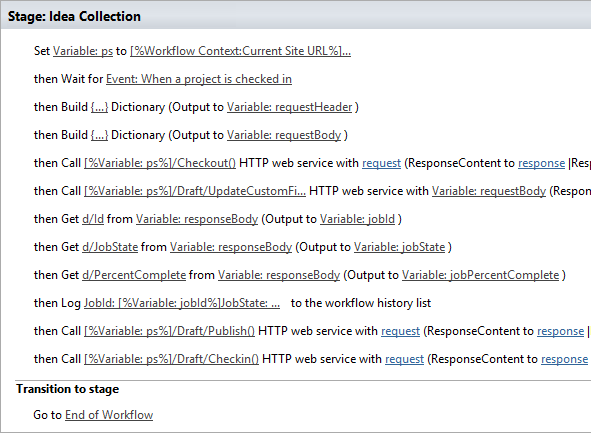
  
### So erstellen Sie einen Workflow, der benutzerdefinierte Felder massenaktualisierungen

1. Optional. Store die vollständige URL Ihres Projekts in einer Variablen, die Sie im gesamten Workflow verwenden können.
    
    ![Store der URL des Projekts in]einer Variablen Store der URL des Projekts in einer(media/a880c5c6-8e7a-44dd-87e9-7e532169d489.png "Variablen")
  
2. Fügen Sie **die Aktion Project Ereignis warten** dem Workflow hinzu, und wählen Sie das Ereignis Wenn ein Projekt **eingecheckt** ist aus. 
    
    
  
3. Erstellen Sie **ein requestHeader-Wörterbuch** mit der **Aktion Wörterbuch erstellen.** Sie verwenden denselben Anforderungsheader für alle Webdienstaufrufe in diesem Workflow. 
    
    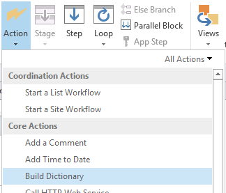
  
4. Fügen Sie dem Wörterbuch die folgenden beiden Elemente hinzu.
    
    |Name|Typ|Wert|
    |:-----|:-----|:-----|
    |Annehmen    |String    |application/json; odata=verbose    |
    |Content-Type    |Zeichenfolge    |application/json; odata=verbose    |
   
    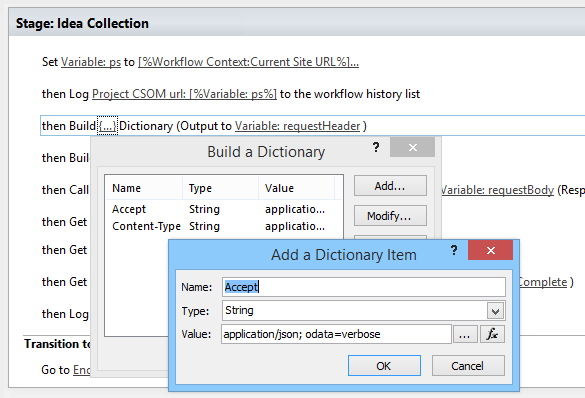
  
5. Erstellen Sie **ein requestBody-Wörterbuch** mit der **Aktion Wörterbuch erstellen.** In diesem Wörterbuch werden alle Feldupdates gespeichert, die Sie anwenden möchten. 
    
    Jede benutzerdefinierte Feldaktualisierung erfordert vier Zeilen: den (1) Metadatentyp des Felds, (2) Schlüssel, (3) Wert und (4) Werttyp.
    
    - **__metadata/Type** Der Metadatentyp des Felds. Dieser Datensatz ist immer identisch und verwendet die folgenden Werte: 
    
       - Name: customFieldDictionary(i)/__metadata/type (wobei **i** der Index jedes benutzerdefinierten Felds im Wörterbuch ist, beginnend mit 0) 
            
       - Typ: Zeichenfolge
            
       - Wert: SP. KeyValue
    
       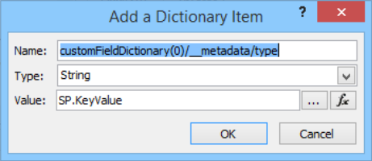
  
    - **Schlüssel** Der interne Name des benutzerdefinierten Felds im Format: *Custom_ce23fbf43fa0e411941000155d3c8201* 
    
       Sie finden den internen Namen eines benutzerdefinierten Felds, indem Sie zum **InternalName-Endpunkt navigieren:**`https://<site-url>/_api/ProjectServer/CustomFields('<guid>')/InternalName`
    
       Wenn Sie Ihre benutzerdefinierten Felder manuell erstellt haben, unterscheiden sich die Werte von Standort zu Standort. Wenn Sie den Workflow auf mehreren Websites wiederverwenden möchten, stellen Sie sicher, dass die benutzerdefinierten Feld-IDs korrekt sind.
    
    - **Wert** Der Wert, der dem benutzerdefinierten Feld zugewiesen werden soll. Für benutzerdefinierte Felder, die mit Nachschlagetabellen verknüpft sind, müssen Sie die internen Namen der Nachschlagetabelleneinträge anstelle der tatsächlichen Nachschlagetabellenwerte verwenden. 
    
       Den internen Namen des Eintrags der Nachschlagetabelle finden Sie am folgenden Endpunkt: `https://<site-url>/_api/ProjectServer/CustomFields('<guid>')/LookupEntries('<guid>')/InternalName`
    
       Wenn Sie ein benutzerdefiniertes Nachschlagetabelle-Feld eingerichtet haben, um mehrere Werte zu akzeptieren, verwenden Sie zum Verkaten von Werten (wie im folgenden  `;#` Beispielwörterbuch dargestellt). 
    
    - **ValueType** Der Typ des benutzerdefinierten Felds, das Sie aktualisieren. 
    
       - Verwenden Sie für Die Felder Text, Duration, Flag und LookupTable Edm.String.
    
       - Verwenden Sie für Zahlenfelder Edm.Int32, Edm.Double oder einen anderen OData-akzeptierten Nummerntyp.
    
       - Verwenden Sie für Datumsfelder Edm.DateTime
    
       Das folgende Beispielwörterbuch definiert Updates für drei benutzerdefinierte Felder. Das erste ist für ein benutzerdefiniertes Feld mit mehreren Wert-Nachschlagetabelle, das zweite für ein Zahlenfeld und das dritte für ein Datumsfeld. Beachten Sie, wie **der customFieldDictionary-Index** erhöht wird. 
    
       > [!NOTE]
       > Diese Werte dienen nur zur Veranschaulichung. Die verwendeten Schlüssel-Wert-Paare hängen von Ihren PWA ab. 
  
       |Name|Typ|Wert|
       |:-----|:-----|:-----|
       |customFieldDictionary(0)/__metadata/type    |String    |SP. KeyValue    |
       |customFieldDictionary(0)/Key    |String    |Benutzerdefinierte \_ ce23fbf43fa0e411941000155d3c8201    |
       |customFieldDictionary(0)/Value    |String    |Eintrag \_ b9a2fd69279de411940f00155d3c8201;#Entry \_ baa2fd69279de411940f00155d3c8201    |
       |customFieldDictionary(0)/ValueType    |String    |Edm.String    |
       |customFieldDictionary(1)/__metadata/type    |String    |SP. KeyValue    |
       |customFieldDictionary(1)/Key    |String    |Custom_c7f114c97098e411940f00155d3c8201    |
       |customFieldDictionary(1)/Value    |String    |90.5    |
       |customFieldDictionary(1)/ValueType    |String    |Edm.Double    |
       |customFieldDictionary(2)/__metadata/type    |String    |SP. KeyValue    |
       |customFieldDictionary(2)/Key    |String    |Custom_c6fb67e0b9a1e411941000155d3c8201    |
       |customFieldDictionary(2)/Value    |String    |2015-04-01T00:00:00.00000000    |
       |customFieldDictionary(2)/ValueType    |String    |Edm.DateTime    |
   
       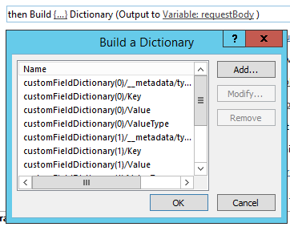
  
6. Fügen Sie eine **Call HTTP Web Service-Aktion** hinzu, um das Projekt auschecken. 
    
    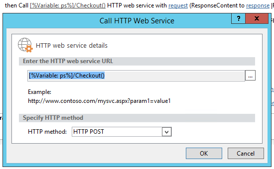
  
7. Bearbeiten Sie die Eigenschaften des Webdienstaufrufs, um den Anforderungsheader anzugeben. Klicken Sie **zum** Öffnen des Dialogfelds Eigenschaften mit der rechten Maustaste auf die Aktion, und wählen Sie **Eigenschaften aus.**
    
    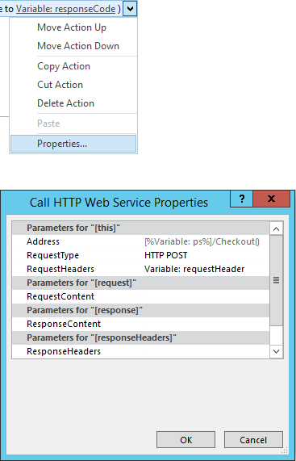
  
8. Fügen Sie eine **Call HTTP Web Service-Aktion** zum Aufrufen der **UpdateCustomFields-Methode** hinzu. 
    
    ![Create a Call HTTP Web Service action]Create a Call HTTP Web Service(media/9a73a201-c035-41b4-8798-506ac48b90f8.png "action")
  
    Notieren Sie  `/Draft/` sich das Segment in der Webdienst-URL. Die vollständige URL sollte wie die folgende aussehen: `https://<site-url>/_api/ProjectServer/Projects('<guid>')/Draft/UpdateCustomFields()`
    
    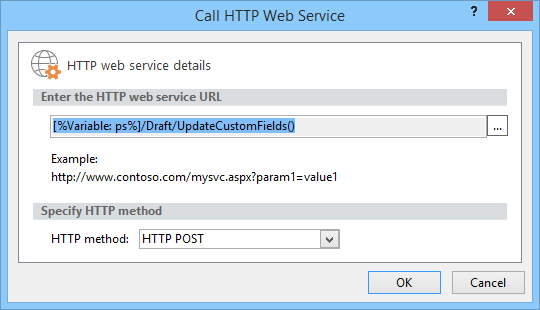
  
9. Bearbeiten Sie die Eigenschaften des Webdienstaufrufs, um die **Parameter RequestHeader** und **RequestContent** an die von Ihnen erstellten Wörterbücher zu binden. Sie können auch eine neue Variable zum Speichern von **ResponseContent erstellen.**
    
    ![Binden der Wörterbücher an den Anforderungsheader]und -inhalt Binden der Wörterbücher an den(media/f96bec92-138e-4eab-b1e7-1ab83d0428a5.png "Anforderungsheader und -inhalt")
  
10. Optional. Lesen Sie aus dem Antwortwörterbuch, um den Status des Warteschlangenauftrags zu überprüfen und die Informationen in der Workflowverlaufsliste zu protokollieren.
    
    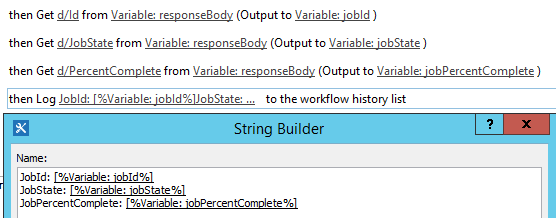
  
11. Fügen Sie einen Webdienstaufruf zum **Publish-Endpunkt** hinzu, um das Projekt zu veröffentlichen. Verwenden Sie immer denselben Anforderungsheader. 
    
    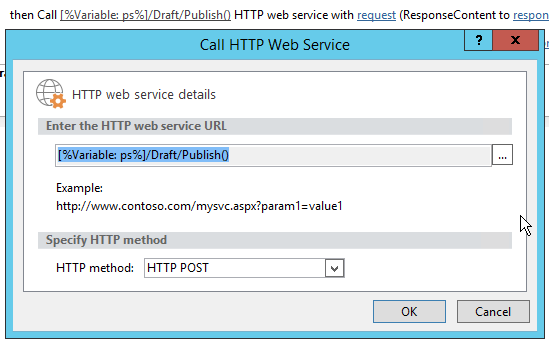
  
    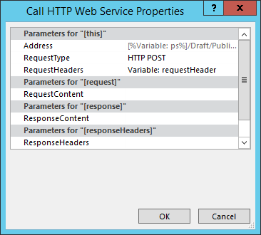
  
12. Fügen Sie dem **Checkin-Endpunkt** einen letzten Webdienstaufruf hinzu, um das Projekt einchecken zu können. 
    
    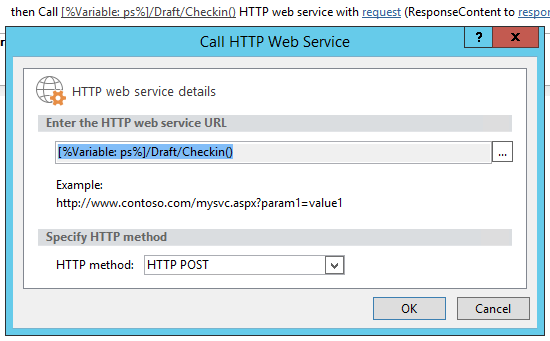
  
    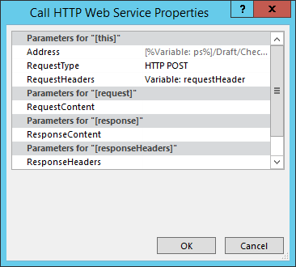

## Erstellen einer Project website aus einem Workflow

Jedes Projekt kann über eigene dedizierte Websites SharePoint, auf denen Teammitglieder zusammenarbeiten, Dokumente freigeben, Probleme lösen können und so weiter. Bisher konnten Websites nur automatisch beim ersten Veröffentlichen oder manuell vom Projektmanager in Project Professional oder vom Administrator in den PWA-Einstellungen erstellt oder deaktiviert werden.
  
Wir haben die **CreateProjectSite-Methode** hinzugefügt, damit Sie auswählen können, wann Projektwebsites erstellt werden sollen. Dies ist besonders nützlich für Organisationen, die ihre Websites automatisch erstellen möchten, wenn ein Projektvorschlag eine bestimmte Phase in einem vordefinierten Workflow erreicht und nicht bei der ersten Veröffentlichung. Das Verschieben der Erstellung von Projektwebsites verbessert die Leistung beim Erstellen eines Projekts erheblich. 
  
**Voraussetzungen:** Bevor Sie **CreateProjectSite** verwenden  können, muss die Einstellung Benutzer auswählen zulassen für die Erstellung von Projektwebsites in **PWA Einstellungen** > ** Connected SharePoint Sites ** > **Einstellungen festgelegt werden.**
  
![Festlegen von "Benutzer auswählen zulassen" in]den PWA Einstellung Zulassen, dass Benutzer(media/6c6c8175-eb10-431d-8056-cea55718fdb4.png "in den Einstellungen PWA können")
  
### So erstellen Sie einen Workflow, der eine Project erstellt

1. Erstellen oder bearbeiten Sie einen vorhandenen Workflow, und wählen Sie den Schritt aus, in dem Sie Ihre Project erstellen möchten.
    
2. Erstellen Sie **ein requestHeader-Wörterbuch** mit der **Aktion Wörterbuch erstellen.** 
    
    
  
3. Fügen Sie dem Wörterbuch die folgenden beiden Elemente hinzu.
    
    |Name|Typ|Wert|
    |:-----|:-----|:-----|
    |Annehmen    |String    |application/json; odata=verbose    |
    |Content-Type    |Zeichenfolge    |application/json; odata=verbose    |
   
    
  
4. Fügen Sie die **Aktion HTTP-Webdienst aufrufen** hinzu. Ändern Sie den Anforderungstyp, um **POST** zu verwenden, und legen Sie die URL im folgenden Format ein:
    
    `https://<site-url>/_api/ProjectServer/Projects('<guid>')/CreateProjectSite('New web name')`
    
    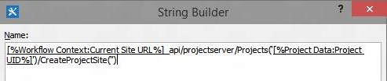
  
    Übergeben Sie den Namen der Project als Zeichenfolge an die **CreateProjectSite-Methode.** Um den Projektnamen als Websitenamen zu verwenden, übergeben Sie eine leere Zeichenfolge. Achten Sie darauf, eindeutige Namen zu verwenden, damit die nächste von Ihnen erstellte Projektwebsite funktioniert. 
    
5. Bearbeiten Sie die Eigenschaften des Webdienstaufrufs, um den **RequestHeader-Parameter** an das erstellte Wörterbuch zu binden. 
    
    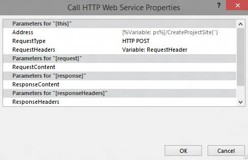
  
## Siehe auch

- [Project-Programmieraufgaben](project-programming-tasks.md)
- [Clientseitiges Objektmodell (CSOM) für Project 2013](client-side-object-model-csom-for-project-2013.md)
- [Workflows in SharePoint 2013](https://msdn.microsoft.com/library/e0602371-ae22-44be-8a7e-9e47e9f046d6%28Office.15%29.aspx)
    

