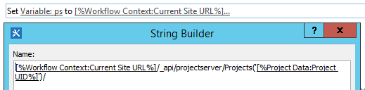
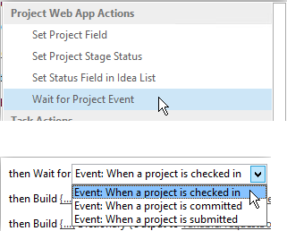
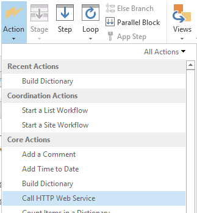
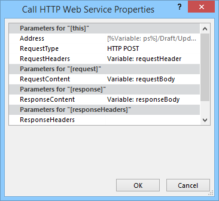
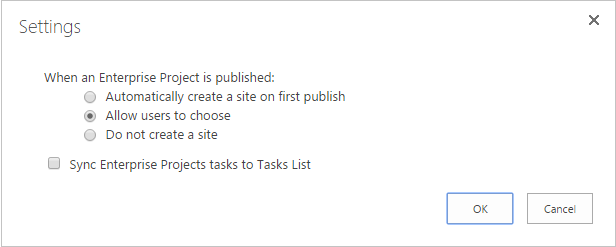

# Massenaktualisierung von benutzerdefinierten Feldern und Erstellen von Projektwebsites aus einem Workflow in Project OnlineBulk update custom fields and create project sites from a workflow in Project Online

Um Kunden bei der optimalen Nutzung von Project online zu helfen und unsere Dienst Erweiterbarkeit und Flexibilität zu verbessern, haben wir zwei Methoden zum clientseitigen Objektmodell hinzugefügt, die Sie in Project Online-apps und-Workflows verwenden können.To help customers get the most out of Project Online and improve our service extensibility and flexibility, we've added two methods to the client-side object model that you can use in Project Online apps and workflows.
  
|||
|:-----|:-----|
|**UpdateCustomFields****UpdateCustomFields**   |Massenaktualisierungen von Projekt benutzerdefinierten Feldern.Bulk updates project custom fields. Nur für Project online.For Project Online only. Nur in der REST-API verfügbar.Available only in the REST API.    |
|**CreateProjectSite****CreateProjectSite**   | Erstellt eine Projektwebsite.Creates a Project site. Nur für Project online.For Project Online only. Verfügbar in der REST-API, dem verwalteten clientobjektmodell und dem JavaScript-clientobjektmodell.Available in the REST API, managed client object model, and JavaScript client object model.    |
   
Diese Methoden bieten nicht nur mehr Flexibilität, sondern auch erhebliche Leistungsverbesserungen beim Speichern und Veröffentlichen von Projekten in einem Workflow.In addition to providing more flexibility, these methods also offer significant performance improvements when saving and publishing projects in a workflow. In diesem Artikel wird beschrieben, wie Sie die Methoden in der REST-API verwenden und Anweisungen zum Erstellen eines Workflows bereitstellen, in dem benutzerdefinierte Felder und ein Workflow, der eine Projektwebsite erstellt, massenweise aktualisiert werden.This article describes how to use the methods in the REST API and provides instructions for creating a workflow that bulk updates custom fields and a workflow that creates a Project site.
  
> [!NOTE]
> Weitere Informationen zum Aufrufen von REST-APIs aus SharePoint 2013-Workflows finden Sie unter [using SharePoint Rest Services from Workflow with Post Method](https://mysharepointinsight.blogspot.com/2013/05/using-sharepoint-rest-services-from.mdl) und [Calling the SharePoint 2013 Rest API from a SharePoint Designer Workflow](https://sergeluca.wordpress.com/2013/04/09/calling-the-sharepoint-2013-rest-api-from-a-sharepoint-designer-workflow/).To learn more about calling REST APIs from SharePoint 2013 workflows, see [Using SharePoint REST services from workflow with POST method](https://mysharepointinsight.blogspot.com/2013/05/using-sharepoint-rest-services-from.mdl) and [Calling the SharePoint 2013 Rest API from a SharePoint Designer Workflow](https://sergeluca.wordpress.com/2013/04/09/calling-the-sharepoint-2013-rest-api-from-a-sharepoint-designer-workflow/). 
  
## Massenaktualisierung von Projekt benutzerdefinierten Feldern aus einem WorkflowBulk update project custom fields from a workflow

Bisher konnten Workflows nur ein benutzerdefiniertes Feld gleichzeitig aktualisieren.Previously, workflows could only update one custom field at a time. Das nacheinander aktualisieren von benutzerdefinierten Feldern kann zu einer schlechten Endbenutzererfahrung führen, wenn Benutzer zwischen Projekt Detail Seiten wechseln.Updating project custom fields one at a time can result in a poor end-user experience when users transition between Project Detail Pages. Jedes Update erforderte eine separate Serveranforderung mithilfe der Aktion **Projektfeld festlegen** , und das Aktualisieren mehrerer benutzerdefinierter Felder in einem Netzwerk mit hoher Latenz und niedriger Bandbreite führte zu einem nicht trivialen Overhead.Each update required a separate server request using the **Set Project Field** action, and updating multiple custom fields on a high-latency, low-bandwidth network resulted in a non-trivial overhead. Um dieses Problem zu beheben, haben wir die **UpdateCustomFields** -Methode zur Rest-API hinzugefügt, mit der Sie benutzerdefinierte Felder Massenaktualisieren können.To resolve this issue, we added the **UpdateCustomFields** method to the REST API that lets you bulk update custom fields. Um **UpdateCustomFields**zu verwenden, führen Sie ein Wörterbuch mit den Namen und Werten aller benutzerdefinierten Felder aus, die Sie aktualisieren möchten.To use **UpdateCustomFields**, you pass in a dictionary that contains the names and values of all the custom fields you want to update.
  
Die REST-Methode finden Sie unter folgendem Endpunkt:The REST method can be found at the following endpoint:
  
`https://<site-url>/_api/ProjectServer/Projects('<guid>')/Draft/UpdateCustomFields()`
  
> [!NOTE]
> Ersetzen Sie `<site-url>` den Platzhalter in den Beispielen durch die URL Ihrer Project Web App (PWA)-Website `<guid>` und den Platzhalter mit ihrer Projekt-UID.Replace the  `<site-url>` placeholder in the examples with the URL of your Project Web App (PWA) site and the  `<guid>` placeholder with your project UID. 
  
In diesem Abschnitt wird beschrieben, wie Sie einen Workflow erstellen, in dem benutzerdefinierte Felder für ein Projekt massenweise aktualisiert werden.This section describes how to create a workflow that bulk updates custom fields for a project. Der Workflow folgt diesen allgemeinen Schritten:The workflow follows these high-level steps:
  
- Warten Sie, bis das Projekt, das Sie aktualisieren möchten, eingecheckt wird.Wait for the project that you want to update to get checked in
    
- Erstellen eines Datasets, das alle benutzerdefinierten Feld Aktualisierungen für das Projekt definiertBuild a data set that defines all your custom field updates for the project
    
- AusChecken des ProjektsCheck out the project
    
- Aufrufen von **UpdateCustomFields** zum Anwenden der Aktualisierungen des benutzerdefinierten Felds auf das ProjektCall **UpdateCustomFields** to apply the custom field updates to the project 
    
- Protokollieren relevanter Informationen in der Workflowverlaufsliste (falls erforderlich)Log relevant information to the workflow history list (if required)
    
- Veröffentlichen des ProjektsPublish the project
    
- EinChecken des ProjektsCheck in the project
    
Der abschließende End-to-End-Workflow sieht wie folgt aus:The final, end-to-end workflow looks like this:
  
![End-to-End-Workflow] (media/8c0741f9-7f76-409d-8c00-e7a8c3ddb89f.png "End-to-End-Workflow")
  
### So erstellen Sie einen Workflow, der Massenaktualisierungen für benutzerdefinierte Felder durchführenTo create a workflow that bulk updates custom fields

1. Optional.Optional. Speichern Sie die vollständige URL des Projekts in einer Variablen, die Sie im gesamten Workflow verwenden können.Store the full URL of your project in a variable that you can use throughout the workflow.
    
    ![Speichern der URL des Projekts in einer Variablen] (media/a880c5c6-8e7a-44dd-87e9-7e532169d489.png "Speichern der URL des Projekts in einer Variablen")
  
2. Fügen Sie die Aktion auf **Projektereignis warten** zum Workflow hinzu, und wählen Sie das Ereignis **beim Einchecken eines Projekts** aus.Add the **Wait for Project Event** action to the workflow and choose the **When a project is checked in** event. 
    
    ![Warten Sie, bis das Projekt eingecheckt wird] . (media/699aa9c7-b3c9-426e-a775-96993a13559c.png "Warten Sie, bis das Projekt eingecheckt wird") .
  
3. Erstellen eines **requestHeader** -Wörterbuchs mit der Aktion **Wörterbuch** erstellen.Create a **requestHeader** dictionary using the **Build dictionary** action. Sie verwenden denselben Anforderungsheader für alle Webdienstaufrufe in diesem Workflow.You'll use the same request header for all the web service calls in this workflow. 
    
    ![Erstellen des requestHeader-Wörterbuchs] (media/83b0aa10-9ab7-43dd-800d-a738bb815876.png "Erstellen des requestHeader-Wörterbuchs")
  
4. Fügen Sie dem Wörterbuch die folgenden beiden Elemente hinzu.Add the following two items to the dictionary.
    
    |NameName|TypType|WertValue|
    |:-----|:-----|:-----|
    |AnnehmenAccept    |ZeichenfolgeString    |Application/JSON; odata = ausführlichapplication/json; odata=verbose    |
    |Content-TypeContent-Type    |ZeichenfolgeString    |Application/JSON; odata = ausführlichapplication/json; odata=verbose    |
   
    ![Hinzufügen eines Accept] -Headers (media/2f2e2016-3c49-4cac-b1e7-f2b8118b840c.png "Hinzufügen eines Accept") -Headers
  
5. Erstellen eines **requestBody** -Wörterbuchs mit der Aktion **Wörterbuch** erstellen.Create a **requestBody** dictionary using the **Build dictionary** action. Dieses Wörterbuch speichert alle Feld Aktualisierungen, die Sie anwenden möchten.This dictionary stores all the field updates that you want to apply. 
    
    Für jedes benutzerdefinierte Feld Update sind vier Zeilen erforderlich: der (1) Metadatentyp, (2) Schlüssel, (3) Wert und (4) Werttyp.Each custom field update requires four rows: the field's (1) metadata type, (2) key, (3) value, and (4) value type.
    
    - **__metadata/Typ** Der Metadatentyp des Felds.**__metadata/type** The field's metadata type. Dieser Datensatz ist immer derselbe und verwendet die folgenden Werte:This record is always the same and uses the following values: 
    
       - Name: customFieldDictionary (i)/__metadata/Type (wobei **i** der Index der einzelnen benutzerdefinierten Felder im Wörterbuch ist, beginnend mit 0)Name: customFieldDictionary(i)/__metadata/type (where **i** is the index of each custom field in the dictionary, starting with 0) 
            
       - Typ: ZeichenfolgeType: String
            
       - Wert: SP. KeyValueValue: SP.KeyValue
    
       ![Definieren einer benutzerdefinierten Feld Aktualisierung] (media/a4423493-6603-42ee-ae50-1ef74c5c59bd.png "Definieren einer benutzerdefinierten Feld Aktualisierung")
  
    - **Schlüssel** Der interne Name des benutzerdefinierten Felds im Format: *Custom_ce23fbf43fa0e411941000155d3c8201***Key** The internal name of the custom field, in the format: *Custom_ce23fbf43fa0e411941000155d3c8201* 
    
       Sie können den internen Namen eines benutzerdefinierten Felds ermitteln, indem Sie zu dem **internen** Name-Endpunkt navigieren:`https://<site-url>/_api/ProjectServer/CustomFields('<guid>')/InternalName`You can find the internal name of a custom field by navigating to it's **InternalName** endpoint: `https://<site-url>/_api/ProjectServer/CustomFields('<guid>')/InternalName`
    
       Wenn Sie Ihre benutzerdefinierten Felder manuell erstellt haben, unterscheiden sich die Werte von Website zu Website.If you created your custom fields manually, the values will differ from site to site. Wenn Sie planen, den Workflow über mehrere Standorte hinweg wiederzuverwenden, stellen Sie sicher, dass die benutzerdefinierten Feld-IDs richtig sind.If you plan to reuse the workflow across multiple sites, make sure the custom field IDs are correct.
    
    - **Wert** Der Wert, der dem benutzerdefinierten Feld zugewiesen werden soll.**Value** The value to assign to the custom field. Bei benutzerdefinierten Feldern, die mit Nachschlagetabellen verknüpft sind, müssen Sie die internen Namen der Nachschlagetabellen Einträge anstelle der tatsächlichen Nachschlagetabellenwerte verwenden.For custom fields that are linked to lookup tables, you need to use the internal names of the lookup table entries instead of the actual lookup table values. 
    
       Den internen Namen des Nachschlagetabellen Eintrags finden Sie unter folgendem Endpunkt:`https://<site-url>/_api/ProjectServer/CustomFields('<guid>')/LookupEntries('<guid>')/InternalName`You can find the internal name of the lookup table entry at the following endpoint: `https://<site-url>/_api/ProjectServer/CustomFields('<guid>')/LookupEntries('<guid>')/InternalName`
    
       Wenn Sie ein benutzerdefiniertes Nachschlagetabellen Feld für die Annahme mehrerer Werte eingerichtet haben `;#` , verwenden Sie zum Verketten von Werten (wie im folgenden Beispielwörterbuch dargestellt).If you have a lookup table custom field set up to accept multiple values, use  `;#` to concatenate values (as shown in the example dictionary below). 
    
    - **ValueType** Der Typ des benutzerdefinierten Felds, das Sie aktualisieren.**ValueType** The type of the custom field you are updating. 
    
       - Verwenden Sie für Text-, Duration-, Flag-und Nachschlagefeld-Felder die Datei EDM. StringFor Text, Duration, Flag, and LookupTable fields, use Edm.String
    
       - Verwenden Sie für Number-Felder EDM. Int32, EDM. Double oder einen anderen vom OData akzeptierten Zahlentyp.For Number fields, use Edm.Int32, Edm.Double, or any other OData-accepted number type
    
       - Verwenden Sie für Datumsfelder EDM. DateTime.For Date fields, use Edm.DateTime
    
       Das folgende Beispielwörterbuch definiert Updates für drei benutzerdefinierte Felder.The example dictionary below defines updates for three custom fields. Die erste ist für ein benutzerdefiniertes Feld mit mehreren Werten Nachschlagetabellen, die zweite für ein number-Feld und die dritte für ein Date-Feld.The first is for a multiple value lookup table custom field, the second is for a number field, and the third is for a date field. Beachten Sie, wie sich der **customFieldDictionary** -Index erhöht.Note how the **customFieldDictionary** index increments. 
    
       > [!NOTE]
       > Diese Werte dienen nur zur Illustration.These values are for illustration purposes only. Die Schlüssel-Wert-Paare, die Sie verwenden, hängen von ihren PWA-Daten ab.The key-value pairs you'll use depend on your PWA data. 
  
       |NameName|TypType|WertValue|
       |:-----|:-----|:-----|
       |customFieldDictionary (0)/__metadata/TypecustomFieldDictionary(0)/__metadata/type    |ZeichenfolgeString    |SP. KeyValueSP.KeyValue    |
       |customFieldDictionary (0)/KeycustomFieldDictionary(0)/Key    |ZeichenfolgeString    |Benutzer\_definierte ce23fbf43fa0e411941000155d3c8201Custom\_ce23fbf43fa0e411941000155d3c8201    |
       |customFieldDictionary (0) UmfangscustomFieldDictionary(0)/Value    |ZeichenfolgeString    |Eintrag\_b9a2fd69279de411940f00155d3c8201; #Entry\_baa2fd69279de411940f00155d3c8201Entry\_b9a2fd69279de411940f00155d3c8201;#Entry\_baa2fd69279de411940f00155d3c8201    |
       |customFieldDictionary (0)/ValueTypecustomFieldDictionary(0)/ValueType    |ZeichenfolgeString    |Edm.StringEdm.String    |
       |customFieldDictionary (1)/__metadata/TypecustomFieldDictionary(1)/__metadata/type    |ZeichenfolgeString    |SP. KeyValueSP.KeyValue    |
       |customFieldDictionary (1)/KeycustomFieldDictionary(1)/Key    |ZeichenfolgeString    |Custom_c7f114c97098e411940f00155d3c8201Custom_c7f114c97098e411940f00155d3c8201    |
       |customFieldDictionary (1) UmfangscustomFieldDictionary(1)/Value    |ZeichenfolgeString    |90,590.5    |
       |customFieldDictionary (1)/ValueTypecustomFieldDictionary(1)/ValueType    |ZeichenfolgeString    |Edm.DoubleEdm.Double    |
       |customFieldDictionary (2)/__metadata/TypecustomFieldDictionary(2)/__metadata/type    |ZeichenfolgeString    |SP. KeyValueSP.KeyValue    |
       |customFieldDictionary (2)/KeycustomFieldDictionary(2)/Key    |ZeichenfolgeString    |Custom_c6fb67e0b9a1e411941000155d3c8201Custom_c6fb67e0b9a1e411941000155d3c8201    |
       |customFieldDictionary (2) UmfangscustomFieldDictionary(2)/Value    |ZeichenfolgeString    |2015-04-01T00:00:00.00000002015-04-01T00:00:00.0000000    |
       |customFieldDictionary (2)/ValueTypecustomFieldDictionary(2)/ValueType    |ZeichenfolgeString    |Edm.DateTimeEdm.DateTime    |
   
       ![Wörterbuch, das benutzerdefinierte Feld Aktualisierungen definiert] (media/41a1f18f-a6b2-40ff-904b-437baf962621.png "Wörterbuch, das benutzerdefinierte Feld Aktualisierungen definiert")
  
6. Fügen Sie eine Aktion zum **Aufrufen des http-** Webdiensts hinzu, um das Projekt zu überprüfen.Add a **Call HTTP Web Service** action to check the project out. 
    
    ![Aufrufen der Checkout-Methode] (media/8ce56014-0317-419b-afa7-229d05c86885.png "Aufrufen der Checkout-Methode")
  
7. Bearbeiten Sie die Eigenschaften des Webdienstaufrufs, um den Anforderungsheader anzugeben.Edit the properties of the web service call to specify the request header. Klicken Sie zum Öffnen des Dialogfelds **Eigenschaften** mit der rechten Maustaste auf die Aktion, und wählen Sie **Eigenschaften**aus.To open the **Properties** dialog box, right-click the action and choose **Properties**.
    
    ![Angeben des Anforderungsheaders in Webdienstaufruf Eigenschaften] (media/d81e92b1-43df-42ad-9cd0-a693f93b164e.png "Angeben des Anforderungsheaders in Webdienstaufruf Eigenschaften")
  
8. Fügen Sie die Aktion **http-Webdienst aufrufen** hinzu, um die **UpdateCustomFields** -Methode aufzurufen.Add a **Call HTTP Web Service** action to call the **UpdateCustomFields** method. 
    
    ![Erstellen einer Aktion zum Aufrufen des http-] Webdiensts (media/9a73a201-c035-41b4-8798-506ac48b90f8.png "Erstellen einer Aktion zum Aufrufen des http-") Webdiensts
  
    NoTieren Sie sich das `/Draft/` Segment in der WEBDIENST-URL.Note the  `/Draft/` segment in the web service URL. Die vollständige URL sollte wie folgt aussehen:`https://<site-url>/_api/ProjectServer/Projects('<guid>')/Draft/UpdateCustomFields()`The full URL should look like this: `https://<site-url>/_api/ProjectServer/Projects('<guid>')/Draft/UpdateCustomFields()`
    
    ![Aufrufen der UpdateCustomFields-Methode] (media/03b323f1-8e99-4b18-be18-be505d7cec7e.png "Aufrufen der UpdateCustomFields-Methode")
  
9. Bearbeiten Sie die Eigenschaften des Webdienstaufrufs, um die Parameter **RequestHeader** und **RequestContent** an die von Ihnen erstellten Wörterbücher zu binden.Edit the properties of the web service call to bind the **RequestHeader** and **RequestContent** parameters to the dictionaries you created. Sie können auch eine neue Variable zum Speichern der **ResponseContent**erstellen.You can also create a new variable to store the **ResponseContent**.
    
    ![Binden der Wörterbücher an den Anforderungsheader und-Inhalt] (media/f96bec92-138e-4eab-b1e7-1ab83d0428a5.png "Binden der Wörterbücher an den Anforderungsheader und-Inhalt")
  
10. Optional.Optional. Lesen Sie im Antwort Wörterbuch, um den Status des Warteschlangenauftrags zu überprüfen und die Informationen in der Workflowverlaufsliste zu protokollieren.Read from the response dictionary to check the state of the queue job and log the information in the workflow history list.
    
    ![Einrichten der Protokollierung] (media/7d2f4936-61d7-4906-83e8-7478a5935af5.png "Einrichten der Protokollierung")
  
11. Fügen Sie dem Veröffentlichungs Endpunkt einen \*\*\*\* Webdienstaufruf hinzu, um das Projekt zu veröffentlichen.Add a web service call to the **Publish** endpoint to publish the project. Verwenden Sie immer den gleichen Anforderungsheader.Always use the same request header. 
    
    ![Aufrufen der Publish-Methode] (media/3b661091-ffae-4d7e-a0bb-5b96a6292731.png "Aufrufen der Publish-Methode")
  
    ![Eigenschaften für den Webdienstaufruf veröffentlichen] (media/6a80a5d3-7e29-4398-993c-f78b3faca8b1.png "Eigenschaften für den Webdienstaufruf veröffentlichen")
  
12. Fügen Sie dem **Eincheck** Endpunkt einen endgültigen Webdienstaufruf hinzu, um das Projekt einzuchecken.Add a final web service call to the **Checkin** endpoint to check the project in. 
    
    ![Aufrufen der Checkin-Methode] (media/430510cb-0774-4911-af7f-b565b83eba0e.png "Aufrufen der Checkin-Methode")
  
    ![Eigenschaften für den Eincheck Aufruf des] Webdiensts (media/485f48d6-bbb8-4568-9dc3-aae3218f6bd1.png "Eigenschaften für den Eincheck Aufruf des") Webdiensts

## Erstellen einer Projektwebsite aus einem WorkflowCreate a Project site from a workflow

Jedes Projekt kann über eigene dedizierte SharePoint-Websites verfügen, in denen Teammitglieder zusammenarbeiten, Dokumente freigeben, Probleme auslösen usw.Every project can have its own dedicated SharePoint sites where team members can collaborate, share documents, raise issues, and so on. Bisher konnten Websites nur beim ersten veröffentlichen oder manuell vom Projektmanager in Project Professional oder vom Administrator in PWA-Einstellungen erstellt oder deaktiviert werden.Previously, sites could only be created automatically on first publish or manually by the project manager in Project Professional or by the administrator in PWA settings, or they could be disabled.
  
Wir haben die **CreateProjectSite** -Methode hinzugefügt, damit Sie auswählen können, wann Projektwebsites erstellt werden.We've added the **CreateProjectSite** method so you can choose when to create project sites. Dies ist besonders nützlich für Organisationen, die ihre Websites automatisch erstellen möchten, wenn ein Projektvorschlag eine bestimmte Stufe in einem vordefinierten Workflow erreicht, statt bei der ersten Veröffentlichung.This is particularly useful for organizations who want to create their sites automatically when a project proposal reaches a specific stage in a pre-defined workflow, rather than on first publish. Durch das Verschieben der Projektwebsite Erstellung wird die Leistung des Erstellens eines Projekts erheblich verbessert.Postponing project site creation significantly improves the performance of creating a project. 
  
**Voraussetzung:** Bevor Sie **CreateProjectSite**verwenden können, muss die Einstellung **Benutzerauswahl zulassen** für die Erstellung von Projektwebsites in **PWA-Einstellungen** > \* \* verbundene SharePoint-Websites \* \* >- **Einstellungen**festgelegt werden.**Prerequisite:** Before you can use **CreateProjectSite**, the **Allow users to choose** setting must be set for project site creation in **PWA Settings** > \*\* Connected SharePoint Sites \*\* > **Settings**.
  
![Einstellung "Benutzer können wählen" in PWA-Einstellungen] (media/6c6c8175-eb10-431d-8056-cea55718fdb4.png "Festlegen, dass Benutzer in PWA-Einstellungen auswählen können")
  
### So erstellen Sie einen Workflow, der eine Projektwebsite erstelltTo create a workflow that creates a Project site

1. Erstellen oder bearbeiten Sie einen vorhandenen Workflow, und wählen Sie den Schritt aus, in dem Sie die Projektwebsites erstellen möchten.Create or edit an existing workflow and select the step where you want to create your Project sites.
    
2. Erstellen eines **requestHeader** -Wörterbuchs mit der Aktion **Wörterbuch** erstellen.Create a **requestHeader** dictionary using the **Build dictionary** action. 
    
    ![Erstellen des requestHeader-Wörterbuchs] (media/83b0aa10-9ab7-43dd-800d-a738bb815876.png "Erstellen des requestHeader-Wörterbuchs")
  
3. Fügen Sie dem Wörterbuch die folgenden beiden Elemente hinzu.Add the following two items to the dictionary.
    
    |NameName|TypType|WertValue|
    |:-----|:-----|:-----|
    |AnnehmenAccept    |ZeichenfolgeString    |Application/JSON; odata = ausführlichapplication/json; odata=verbose    |
    |Content-TypeContent-Type    |ZeichenfolgeString    |Application/JSON; odata = ausführlichapplication/json; odata=verbose    |
   
    ![Hinzufügen eines Accept] -Headers (media/2f2e2016-3c49-4cac-b1e7-f2b8118b840c.png "Hinzufügen eines Accept") -Headers
  
4. Fügen Sie die Aktion **http-Webdienst aufrufen** hinzu.Add the **Call HTTP Web Service** action. Ändern Sie den Anforderungstyp in use **Post**, und legen Sie die URL im folgenden Format fest:Change the request type to use **POST**, and set the URL using the following format:
    
    `https://<site-url>/_api/ProjectServer/Projects('<guid>')/CreateProjectSite('New web name')`
    
    ![Erstellen des CreateProjectSite-Endpunkt-URI] (media/42a90a5e-8d1b-4667-a933-785175212847.png "Erstellen des CreateProjectSite-Endpunkt-URI")
  
    Geben Sie den Namen der Projektwebsite als Zeichenfolge an die **CreateProjectSite** -Methode an.Pass the name of the Project site to the **CreateProjectSite** method as a string. Um den Projektnamen als Websitenamen zu verwenden, geben Sie eine leere Zeichenfolge an.To use the project name as the site name, pass an empty string. Achten Sie darauf, eindeutige Namen zu verwenden, damit die nächste von Ihnen erstellte Projektwebsite funktioniert.Be sure to use unique names so the next project site you create will work. 
    
5. Bearbeiten Sie die Eigenschaften des Webdienstaufrufs, um den Parameter **RequestHeader** an das von Ihnen erstellte Wörterbuch zu binden.Edit the properties of the web service call to bind the **RequestHeader** parameter to the dictionary you created. 
    
    ![Binden des Wörterbuchs an die Anforderung] (media/61a5a0a8-405f-44eb-b5e7-80b11f7caec3.png "Binden des Wörterbuchs an die Anforderung")
  
## Siehe auchSee also

- [Project-ProgrammieraufgabenProject programming tasks](project-programming-tasks.md)
- [Clientseitiges Objektmodell (CSOM) für Project 2013Client-side object model (CSOM) for Project 2013](client-side-object-model-csom-for-project-2013.md)
- [Workflows in SharePoint 2013Workflows in SharePoint 2013](https://msdn.microsoft.com/library/e0602371-ae22-44be-8a7e-9e47e9f046d6%28Office.15%29.aspx)
    

