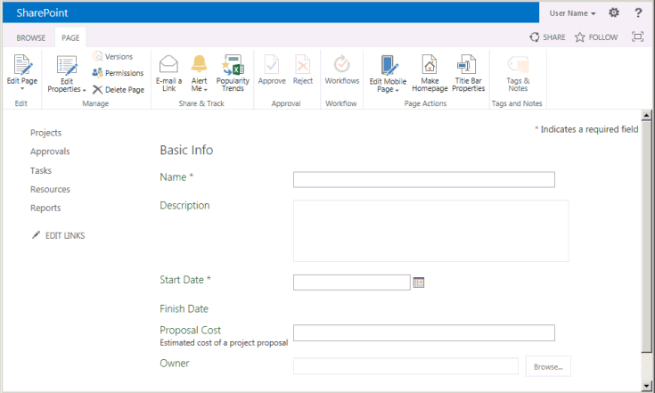
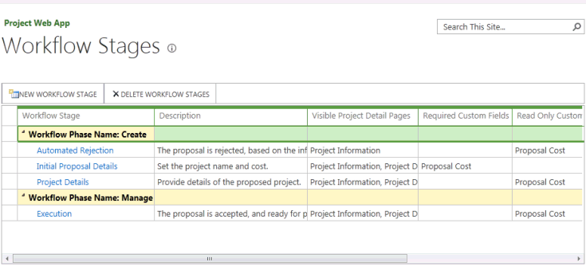
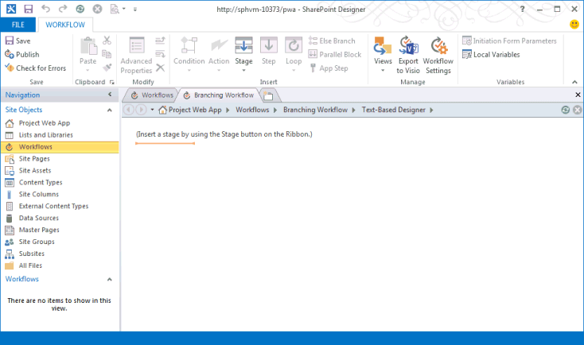
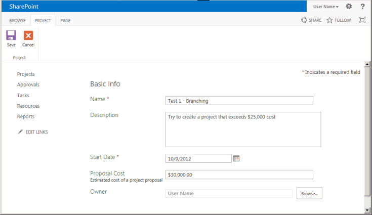

# Erstellen eines Project Server-Workflows für das BedarfsmanagementCreate a Project Server workflow for demand management

In diesem Artikel wird beschrieben, wie Sie einen einfachen Workflow mithilfe von SharePoint Designer 2013 erstellen.This article describes how to create a simple workflow by using SharePoint Designer 2013. Sie können den Workflow zur Visualisierung und Bearbeitung nach Visio 2013 exportieren oder Visio 2013 verwenden, um Project Server 2013-Workflows zu entwerfen und den Entwurf in SharePoint Designer 2013 zur Veröffentlichung in Project Web App zu importieren.You can export the workflow to Visio 2013 for visualization and editing, or use Visio 2013 to design Project Server 2013 workflows and import the design into SharePoint Designer 2013 for publication to Project Web App. Weitere Informationen zur SharePoint-Workflowplattform und zum Erstellen von Workflows mit Visio 2013 und SharePoint Designer 2013 finden Sie in den Artikeln Workflows [in SharePoint 2013](https://msdn.microsoft.com/library/jj163986%28office.15%29.aspx) in der SharePoint 2013-Entwicklerdokumentation.For more information about the SharePoint workflow platform and creating workflows with Visio 2013 and SharePoint Designer 2013, see the [Workflows in SharePoint 2013](https://msdn.microsoft.com/library/jj163986%28office.15%29.aspx) articles in the SharePoint 2013 developer documentation. 
  
Informationen zum Vorbereiten von Project Server für Workflows finden Sie unter [Start: Set up and configure SharePoint 2013 Workflow-Manager](https://msdn.microsoft.com/library/jj163276%28office.15%29.aspx).For information about preparing Project Server for workflows, see [Start: Set up and configure SharePoint 2013 Workflow Manager](https://msdn.microsoft.com/library/jj163276%28office.15%29.aspx).

## Erstellen eines allgemeinen WorkflowsCreating a general workflow

Verwenden Sie die folgenden Schritte, um einen Project Server 2013-Workflow mithilfe von SharePoint Designer 2013 zu erstellen.Use the following steps to create a Project Server 2013 workflow by using SharePoint Designer 2013. Der Workflow ist auf das Bedarfsmanagement von Projektvorschlägen ausgelegt.The workflow is designed for demand management of project proposals.
  
Ausführliche Schritte finden Sie im Abschnitt [Erstellen eines Verzweigungsworkflows.](#pj15_CreateWorkflowSPD_Detailed)For detailed steps, see the [Creating a branching workflow](#pj15_CreateWorkflowSPD_Detailed) section. 
  
### So erstellen Sie einen Project Server-Workflow (allgemeines Verfahren)To create a Project Server workflow (general procedure)

1. Ermitteln Sie die Anforderungen, und entwerfen Sie dann den Workflow. Unterteilen Sie ihn in Phasen und Stufen, und ermitteln Sie die benutzerdefinierten Felder, die vom Workflow verwendet werden.Determine the requirements, and then design the workflow. Organize it into phases and stages, and determine the custom fields that the workflow will use.
    
2. Erstellen Project Web App die Entitäten, die für den Workflow erforderlich sind:In Project Web App, create the entities that the workflow requires:
    
    1. Prüfen Sie die vorhandenen Workflowphasen; erstellen Sie Phasen nach Bedarf.Review the existing workflow phases; create phases as necessary.
        
    2. Erstellen Sie die benutzerdefinierten Enterprise-Felder, die der Workflow verwendet. Damit ein benutzerdefiniertes Feld in einer Workflowphase verfügbar ist, muss es von einem Workflow gesteuert sein.Create the enterprise custom fields that the workflow will use. To be available in a workflow stage, a custom field must be controlled by a workflow.
        
    3. Bearbeiten oder erstellen Sie die Projektdetailseiten (Project Detail Pages, PDPs), die von Ihren Workflowphasen zum Sammeln von Informationen für das Projekt verwendet werden. In diesem Fall werden von den Phasen Standard-Projektdetailseiten verwendet, die so bearbeitet werden, dass sie ein neues benutzerdefiniertes Feld enthalten.Edit or create the project detail pages (PDPs) that your workflow stages will use to collect information for the project. In this example, the stages use default PDPs that are edited to include a new custom field.
        
    4. Erstellen Sie die erforderlichen Workflowphasen, und verknüpfen Sie dann jede Workflowphase mit der korrekten Phase.Create the necessary workflow stages, and then associate each workflow stage with the correct phase.
    
3. In SharePoint Designer 2013 erstellen Sie den Workflow mithilfe deklarativer Anweisungen im **textbasierten Designer**:In SharePoint Designer 2013, construct the workflow by using declarative statements in the **Text-Based Designer**:
    
    > [!NOTE]
    > Sie können auch zu **Visual Designer** in SharePoint Designer 2013 wechseln oder einen vorhandenen Workflow aus Visio 2013 importieren.You can also switch to the **Visual Designer** in SharePoint Designer 2013, or import an existing workflow from Visio 2013. Befolgen Sie diese Schritte, um den **textbasierten Designer** zu verwenden:Follow these steps to use the **Text-Based Designer**: 
    > 
    > 1. Öffnen Sie Project Web App-Website, und erstellen Sie dann einen Websiteworkflow, der die **SharePoint 2013 Workflow - Project** Server-Workflowplattform verwendet.Open the Project Web App site, and then create a site workflow that uses the **SharePoint 2013 Workflow - Project Server** workflow platform. 
    > 2. Fügen Sie die Phasen hinzu, die vom Workflow verwendet werden.Add the stages that the workflow uses.
    > 3. Fügen Sie die Schritte, Bedingungen, Aktionen und Schleifen des Workflows hinzu, die in jeder Phase erforderlich sind.Insert the workflow steps, conditions, actions, and loops that are required in each stage.
    > 4. Prüfen Sie auf Workflowfehler, und beheben Sie diese.Check for any workflow errors and fix any that you find.
    > 5. (Optional) Wechseln Sie in die Ansicht zum **Visual Designer,** oder exportieren Sie den Workflow in Visio 2013-Datei.(Optional) Switch the view to the **Visual Designer**, or export the workflow to a Visio 2013 file. Sie können die Visio-Ansicht ändern und Änderungen im aktuellen Workflow speichern.You can modify the Visio view and save changes to the current workflow. Sie können die Datei Visio bearbeiten und in SharePoint Designer 2013 importieren, um andere Workflows zu erstellen.You can edit the Visio file and import it in SharePoint Designer 2013 to create other workflows.
    > 6. Veröffentlichen Sie den Workflow.Publish the workflow. Nach der Veröffentlichung wird der Workflow in der Liste der Workflows für die Project Web App-Website angezeigt.After it is published, the workflow shows in the list of workflows for the Project Web App site.
    
4. Verwenden Project Web App den Workflow für die Bedarfsverwaltung von Projektvorschlägen:In Project Web App, use the workflow for demand management of project proposals:
    
    1. Erstellen Sie eine Enterprise-Projektvorlage (Enterprise Project Template, EPT), die den Workflow verwendet.Create an enterprise project template (EPT) that uses the workflow.
        
    2. Erstellen Sie auf der Project Center-Seite ein Projekt, das die EPT für den Workflow verwendet, und wechseln Sie dann durch die Workflowphasen.On the Project Center page, create a project that uses the EPT for the workflow, and then follow through the workflow stages.
        
    3. Testen Sie den Workflow sorgfältig.Test the workflow thoroughly.
        
    4. Stellen Sie den Workflow auf einem Produktionsserver bereit.Deploy the workflow to a production server.

## Erstellen eines VerzweigungsworkflowsCreating a branching workflow

Bevor Sie SharePoint Designer 2013 zum Erstellen eines Project Server-Workflows verwenden können, muss der Workflow-Manager Client 1.0-Dienst für die Verwendung der Project Server 2013-Workflowaktivitäten konfiguriert sein.Before you can use SharePoint Designer 2013 to create a Project Server workflow, the Workflow Manager Client 1.0 service must be configured to use the Project Server 2013 workflow activities. Informationen zum Konfigurieren von Workflow-Manager Client 1.0 finden Sie in den Artikeln [Workflows in SharePoint 2013](https://msdn.microsoft.com/library/jj163986%28office.15%29.aspx) in der SharePoint Server 2013-Entwicklerdokumentation.For information about how to configure Workflow Manager Client 1.0, see the [Workflows in SharePoint 2013](https://msdn.microsoft.com/library/jj163986%28office.15%29.aspx) articles in the SharePoint Server 2013 developer documentation. 
  
Das folgende ausführliche Verfahren umfasst die gleichen Schritte wie im [Abschnitt Erstellen eines allgemeinen Workflows.](#pj15_CreateWorkflowSPD_General)The following detailed procedure includes the same steps as in the [Creating a general workflow](#pj15_CreateWorkflowSPD_General) section. 
  
### So erstellen Sie einen Project Server-Verzweigungsworkflow (ausführliches Verfahren)To create a Project Server branching workflow (detailed procedure)

#### 1. Planen und Entwerfen des Workflows.1. Plan and design the workflow.

Ein Project Serverworkflow kann in mehrere Phasen und Phasen eines Bedarfsverwaltungsprozesses integriert werden.A Project Server workflow can integrate with multiple stages and phases in a demand-management process. Da Workflows komplex sein können, müssen Sie die geschäftlichen Anforderungen verstehen und einen Workflow sorgfältig planen.Because workflows can be complex, you must understand the business requirements and plan a workflow carefully. Ein einfaches Beispiel: Entwerfen Sie einen Verzweigungsworkflow, der die geschätzten Kosten eines Projektvorschlags verwendet, um zu bestimmen, ob der Vorschlag angenommen wird.For a simple example, design a branching workflow that uses the estimated cost of a project proposal to determine whether the proposal is accepted. Wenn die geschätzten Kosten größer als 25.000 USD sind, lehnen Sie den Vorschlag ab. Akzeptieren Sie andernfalls den Vorschlag, und erstellen Sie das Projekt.If the estimated cost is greater than $25,000 USD, reject the proposal; otherwise, accept the proposal and create the project.
    
Da Sie Visio 2013 und SharePoint Designer 2013 verwenden können, um Workflows für Project Server 2013 zu entwerfen und zu erstellen, können Sie einfacher mit Workflows experimentieren, als dies mit Project Server 2010 möglich ist.Because you can use Visio 2013 and SharePoint Designer 2013 to help design and create workflows for Project Server 2013, you can more easily experiment with workflows than is possible with Project Server 2010. Das Beispielworkflowdesign in diesem Artikel ist identisch mit dem im Artikel [Erstellen](https://msdn.microsoft.com/library/a02cafdc-d881-4271-b446-d8b2cd456a52%28Office.15%29.aspx) eines Verzweigungsworkflows im Project 2010 SDK.The sample workflow design in this article is the same as in the [Create a branching workflow](https://msdn.microsoft.com/library/a02cafdc-d881-4271-b446-d8b2cd456a52%28Office.15%29.aspx) article in the Project 2010 SDK. Sie können einen Testworkflow auf einem Remotecomputer mithilfe einer Testinstanz von Project Web App entwerfen und erstellen– Sie müssen workflows nicht direkt auf einem Project Server 2013-Computer erstellen.You can design and create a test workflow on a remote computer using a test instance of Project Web App—you do not have to create workflows directly on a Project Server 2013 computer. 
    
#### 2. Erstellen Sie die Entitäten, die Ihr Workflow benötigt.2. Create the entities that your workflow requires.

In Project Web App überprüfen Sie die verfügbaren Workflowphasen und -phasen sowie die benutzerdefinierten Enterprise-Felder, die verfügbar sind.In Project Web App, review the available workflow phases and stages, and the enterprise custom fields that are available. Erstellen Sie bei Bedarf, wie in den folgenden Schritten gezeigt, die Entitäten, die für Ihren Workflow erforderlich sind:If necessary, create the entities that your workflow requires, as in the following steps:
    
1. **Workflowphasen** Die Standardinstallation von Project Web App umfasst die Phasen Create, Select, Plan, Manage und Finished.**Workflow phases** The default installation of Project Web App includes the Create, Select, Plan, Manage, and Finished phases. Für das Beispiel mit dem Verzweigungsworkflow müssen Sie keine anderen Phasen erstellen.For the branching workflow example, you do not have to create other phases. 
        
2. **Enterprise benutzerdefinierte Felder** Der Verzweigungsworkflow erfordert ein benutzerdefiniertes Projektkostenfeld, das workflowgesteuert ist.**Enterprise custom fields** The branching workflow requires a project cost custom field that is workflow-controlled. Der Wert eines workflowgesteuerten benutzerdefinierten Felds wird auf einer Projektdetailseite festgelegt, die der Workflow verwendet.The value of a workflow-controlled custom field is set in a PDP that the workflow uses. Wählen Sie z. **B. das symbol Einstellungen** oben rechts auf einer Project-Web-App-Seite aus, wählen Sie **PWA Einstellungen** aus, und wählen Sie dann Enterprise Benutzerdefinierte Felder und Nachschlagetabellen **aus.**For example, choose the **Settings** icon at the top-right of a Project Web App page, choose **PWA Settings**, and then choose **Enterprise Custom Fields and Lookup Tables**.
        
   Erstellen Sie für die Entität Projekt  ein benutzerdefiniertes Feld mit dem Namen **Vorschlagskosten**, und wählen Sie den Typ **Kosten** aus.Create a custom field named Proposal Cost for the **Project** entity, and select the type **Cost**. Geben Sie als Beschreibung Geschätzte Kosten eines Projektvorschlags ein.For the description, type Estimated cost of a project proposal. Wählen Sie im Abschnitt **Verhalten\*\*\*\*Verhalten vom Workflow gesteuert** aus.In the **Behavior** section, choose **Behavior controlled by workflow**.
        
3. **Project Detailseiten** Bearbeiten oder erstellen Sie die PDPs, die von den Workflowphasen verwendet werden.**Project detail pages** Edit or create the PDPs that the workflow stages will use. Führen Sie beispielsweise die folgenden Schritte aus:For example, do the following steps: 
        
    1. Wählen Sie auf der Seite mit den Servereinstellungen **Projektdetailseiten** und dann die Projektdetailseite **ProjectInformation** aus.Choose **Project Detail Pages** on the Server Settings page, and then choose the **ProjectInformation** PDP. 
            
    2. Wählen Sie im Menüband auf der Registerkarte **SEITE** in der Gruppe **Bearbeiten\*\*\*\*Seite bearbeiten** aus.On the **PAGE** tab of the ribbon, in the **Edit** group, choose **Edit Page**.
            
    3. Wählen Sie den Pfeil nach unten oben rechts im Web part **Basic Info** aus, und wählen Sie dann Web part **bearbeiten aus.**Choose the down arrow at the top-right of the **Basic Info** web part, and then choose **Edit web part**. Oder wählen Sie auf der **Registerkarte WEB PART** des Menübands in der Gruppe **Eigenschaften** web **part Properties** aus, um das Editorteil zu zeigen.Or, on the **WEB PART** tab of the ribbon, in the **Properties** group, choose **web part Properties** to show the editor part. 
            
    4. Wählen Sie im Abschnitt **Angezeigte Projektfelder** des Bearbeitungs-Webparts (siehe Abbildung 1) **Ändern** aus.In the **Displayed Project Fields** section of the editor part (see Figure 1), choose **Modify**.
            
    5. Fügen Sie das **benutzerdefinierte** Feld Vorschlagskosten hinzu, verschieben Sie es über das Feld **Besitzer** in der Liste Ausgewählte **Project** Felder, und wählen Sie dann **OK** aus (siehe Abbildung 1).Add the **Proposal Cost** custom field, move it above the **Owner** field in the **Selected Project Fields** list, and then choose **OK** (see Figure 1).
      
    6. Wählen Sie im Bearbeitungs-Webpart **OK** und dann im Menüband auf der Registerkarte **SEITE** in der Gruppe **Bearbeiten\*\*\*\*Bearbeitung beenden** aus. In Abbildung 2 ist das benutzerdefinierte Feld **Proposal Cost** dargestellt, das der Projektdetailseite "Projektinformationen" hinzugefügt wurde.In the editor part, choose **OK**, and then choose **Stop Editing** in the **Edit** group, on the **PAGE** tab of the ribbon. Figure 2 shows the **Proposal Cost** custom field that is added to the Project Information PDP. 

    **Abbildung 1. Bearbeiten des Project Fields-Webteils in einer PDP****Figure 1. Editing the Project Fields web part in a PDP**

    ![Bearbeiten des Project Fields-Webteils in einem PDP]Bearbeiten des Project(media/pj15_CreateWorkflowSPD_EditPDP.gif "Fields-Webteils in einer PDP")

    **Abbildung 2. Die bearbeitete Projektdetailseite enthält das benutzerdefinierte Feld "Vorschlagskosten"****Figure 2. The edited PDP includes the Proposal Cost custom field**

    ![The edited PDP includes the Proposal Cost field]The edited(media/pj15_CreateWorkflowSPD_EditedPDP.gif "PDP includes the Proposal Cost field")
  
4. **Workflowphasen** Erstellen Sie die Phasen, die für jede Phase des Workflows erforderlich sind.**Workflow stages** Create the stages that are required for each phase of the workflow. Wählen Sie auf der Seite mit den Servereinstellungen **Workflowstufen** und dann **NEUE WORKFLOWSTUFE** aus.On the Server Settings page, choose **Workflow Stages**, and then choose **NEW WORKFLOW STAGE**. In Abbildung 3 ist ein Teil der Seite "Workflowstufe hinzufügen" dargestellt.Figure 3 shows part of the Add Workflow Stage page.
    
    **Abbildung 3. Hinzufügen einer Workflowstufe in Project Web App****Figure 3. Adding a workflow stage in Project Web App**

    ![Hinzufügen einer Workflowphase in Project Web App]Hinzufügen einer(media/pj15_CreateWorkflowSPD_AddWorkflowStage.gif "Workflowphase in Project Web App")
  
    Im Verzweigungsworkflow-Beispiel werden vier Stufen verwendet, die in Tabelle 1 dargestellt sind.The branching workflow example uses the four stages that are shown in Table 1. Auf der Seite "Workflowstufe hinzufügen" im Abschnitt **Weitere Einstellungen für die ''sichtbare Projektdetailseite''** (in Abbildung 3 nicht dargestellt) sind Werte optional; sie bieten auf der Seite "Workflowstatus" mehr Informationen.In the **Additional Settings for the Visible Project Detail Page** section of the Add Workflow Stage page (not shown in Figure 3), values are optional; they provide more information on the Workflow Status page. Da für die PDP für ursprüngliche Vorschlagsdetails beispielsweise Benutzereingaben erforderlich sind, können Sie das Kontrollkästchen Die **Project-Detailseite** erfordert Aufmerksamkeit aktivieren und dann eine bestimmte Beschreibung hinzufügen, z. B. Festlegen des Projektnamens und der Kosten für diese PDP.For example, because the Initial Proposal Details PDP requires user input, you can select the **The Project Detail Page requires attention** check box, and then add a specific description such as Set the project name and cost for this PDP.
    
    In Abbildung 4 sind die vier Stufen abgebildet, die auf der Seite "Workflowstufen" durchlaufen werden.Figure 4 shows the four stages completed on the Workflow Stages page.
    
    **Tabelle 2. Stufen des Verzweigungsworkflows****Table 1. Stages for the branching workflow**

    |NameName|BeschreibungDescription|Beschreibung für EinreichungDescription for Submit|PhasePhase|Sichtbare PDPsVisible PDPs|Benutzerdefinierte FelderCustom Fields|
    |:-----|:-----|:-----|:-----|:-----|:-----|
    |Ursprüngliche VorschlagsdetailsInitial Proposal Details    |Legen Sie den Projektnamen und die Kosten fest.Set the project name and cost.    |Reichen Sie das Projekt als Vorschlag ein.Submit the project as a proposal.    |ErstellenCreate    |ProjektinformationenProject Information    ProjektdetailsProject Details    |Vorschlagskosten (erforderlich)Proposal Cost (required)    |
    |ProjektdetailsProject Details    |Geben Sie nähere Informationen zum vorgeschlagenen Projekt an.Provide details of the proposed project.    |Senden Sie die Details ab, um mit dem Projekt fortzufahren.Submit details to continue with the project.    |ErstellenCreate    |ProjektinformationenProject Information    ProjektdetailsProject Details    |Vorschlagskosten (schreibgeschützt)Proposal Cost (read-only)    |
    |Automatische AblehnungAutomated Rejection    |Der Vorschlag wird auf Grundlage der angegebenen Informationen abgelehnt.The proposal is rejected, based on the information that is provided.    |   |ErstellenCreate    |ProjektinformationenProject Information    |Vorschlagskosten (schreibgeschützt)Proposal Cost (read-only)    |
    |AusführungExecution    |Der Vorschlag wurde angenommen und ist bereit für das Projektmanagement.The proposal is accepted, and ready for project management.    |   |VerwaltenManage    |ProjektinformationenProject Information    ProjektdetailsProject Details    |Vorschlagskosten (schreibgeschützt)Proposal Cost (read-only)    |
   
    **Abbildung 4. Liste der Workflowstufen in Project Web App****Figure 4. List of the workflow stages in Project Web App**

    ![Liste der Workflowphasen in Project Web App]Liste der(media/pj15_CreateWorkflowSPD_WorkflowStages.gif "Workflowphasen in Project Web App")
  
#### 3. Erstellen Sie den Workflow im Text-Based Designer.3. Construct the workflow in the Text-Based Designer.

In SharePoint Designer 2013 erstellen Sie den Workflow mithilfe deklarativer Anweisungen im Text-Based Designer.In SharePoint Designer 2013, construct the workflow by using declarative statements in the Text-Based Designer. Sie können mit der Eingabe an der orangefarbenen Einfügelinie beginnen, um kontextbezogene Anweisungen für die automatische  Vervollständigung für die Workflowlogik und -schritte zu erhalten, oder Sie können die Logik und Schritte mithilfe von Steuerelementen in der Gruppe Einfügen auf der Registerkarte **WORKFLOW** des Menübands einfügen.You can start typing at the orange insertion line to get context-sensitive auto-completion statements for the workflow logic and steps, or you can insert the logic and steps by using controls in the **Insert** group on the **WORKFLOW** tab of the ribbon. 
    
1. Wählen Sie in der Backstageansicht von SharePoint Designer 2013 **Die Option Website öffnen aus.**In the Backstage view of SharePoint Designer 2013, choose **Open Site**. Öffnen Sie beispielsweise  `https://ServerName/pwa` .For example, open  `https://ServerName/pwa`. Wählen Sie im Bereich **Navigation\*\*\*\*Workflows** aus.In the **Navigation** pane, choose **Workflows**. Wählen Sie dann im Menüband auf der Registerkarte **WORKFLOWS** in der Gruppe **Neu\*\*\*\*Websiteworkflow** aus.Then, on the **WORKFLOWS** tab of the ribbon, in the **New** group, choose **Site Workflow**. Benennen Sie den Workflow in diesem Beispiel Verzweigungsworkflow.For this example, name the workflow Branching Workflow. Stellen Sie **sicher, SharePoint 2013 Workflow - Project** Server  in der Dropdownliste Plattformtyp ausgewählt ist (siehe Abbildung 5).Ensure that **SharePoint 2013 Workflow - Project Server** is selected in the **Platform Type** drop-down list (see Figure 5). 
    
    **Abbildung 5. Erstellen eines Project Server-Websiteworkflows****Figure 5. Creating a Project Server site workflow**

    
  
2. Wählen Sie die Registerkarte **Verzweigungsworkflow** aus. Wählen Sie dann im Menüband auf der Registerkarte **WORKFLOW** in der Gruppe **Verwalten** in der Dropdownliste **Ansichten\*\*\*\*Textbasierter Designer** aus. Klicken Sie in die Ansicht, um die Ansicht mit der blinkenden orangefarbenen Einfügelinie anzuzeigen (siehe Abbildung 6).Select the **Branching Workflow** tab. Then, on the **WORKFLOW** tab of the ribbon, in the **Manage** group, in the **Views** drop-down list, choose **Text-Based Designer**. To show the view with the blinking orange insertion line (see Figure 6), click within the view.
    
    **Abbildung 6. Verwenden der Ansicht "Textbasierter Designer" für den Workflow****Figure 6. Using the Text-Based Designer view for the workflow**

    
  
3. Fügen Sie in der Ansicht **Textbasierter Designer** die Stufen hinzu, die im Workflow verwendet werden. Wählen Sie im Menüband auf der Registerkarte **WORKFLOW** in der Gruppe **Einfügen** in der Dropdownliste **Stufe** unter **Erstellen\*\*\*\*Ursprüngliche Vorschlagsdetails** aus.In the **Text-Based Designer** view, add the stages that the workflow uses. On the **WORKFLOW** tab of the ribbon, in the **Insert** group, in the **Stage** drop-down list under **Create**, choose **Initial Proposal Details**.
    
    Platzieren Sie die orangefarbene Einfügelinie entsprechend unterhalb des Felds **Stufe: Ursprüngliche Vorschlagsdetails**, und fügen Sie die anderen Stufen hinzu, die vom Workflow verwendet werden: **Projektdetails**, **Automatische Ablehnung** und **Ausführung** (siehe Abbildung 7).Similarly, place the orange insertion line below the **Stage: Initial Proposal Details** box, and add the other stages that the workflow uses: **Project Details**, **Automated Rejection**, and **Execution** (see Figure 7). 
    
    **Abbildung 7. Hinzufügen einer Stufe zu einem Workflow in SharePoint Designer****Figure 7. Adding a stage to a workflow in SharePoint Designer**

    ![Hinzufügen einer Phase zu einem Workflow in SPD]Hinzufügen einer Phase zu einem Workflow in(media/pj15_CreateWorkflowSPD_AddStageInSPD.gif "SPD")
  
4. Fügen Sie in jeder Phase die Workflowschritte und die Workflowlogik hinzu:Add the workflow steps and logic within each stage: 
    
    1. Platzieren Sie in der Phase **Ursprüngliche Vorschlagsdetails** die orangefarbene Einfügelinie über dem Phasentext. Wählen Sie im Menüband in der Gruppe **Einfügen\*\*\*\*Aktion** aus, blättern Sie nach unten zu **Project Web App-Aktionen**, und wählen Sie dann **Auf Projektereignis warten** aus. Wählen Sie **Dieses Projektereignis** und dann in der Dropdownliste **Ereignis: Wenn ein Projekt eingereicht wird** aus.In the **Initial Proposal Details** stage, place the orange insertion line at the top of the stage body. In the **Insert** group on the ribbon, choose **Action**, scroll down to **Project Web App Actions**, and then choose **Wait for Project Event**. Choose **this project event**, and then select **Event: When a project is submitted** in the drop-down list. 
    
    2. Fügen Sie im Abschnitt **Übergang in Phase** der Phase **Ursprüngliche Vorschlagsdetails\*\*\*\*Wenn ein beliebiger Wert gleich dem Wert ist** ein. Sie können mit der Eingabe der Anweisung beginnen oder auf dem Menüband in der Gruppe **Einfügen** das Steuerelement **Bedingung** verwenden.In the **Transition to stage** section of the **Initial Proposal Details** stage, insert **If any value equals value**. You can start typing the statement or use the **Condition** control in the **Insert** group on the ribbon. 
    
    3. Wählen Sie das erste **value**-Steuerelement und dann **fx** aus, um das Dialogfeld **Workflow-Nachschlagevorgang definieren** anzuzeigen (siehe Abbildung 8). Wählen Sie in der Dropdownliste **Datenquelle\*\*\*\*Projektdaten** aus. Wählen Sie in der Dropdownliste **Quellenfeld\*\*\*\*Vorschlagskosten** aus.Choose the first **value** control, and then choose **fx** to show the **Define Workflow Lookup** dialog box (see Figure 8). In the **Data source** drop-down list, select **Project Data**. In the **Field from source** drop-down list, select **Proposal Cost**.
    
       **Abbildung 8. Definieren eines Nachschlagewerts im Workflow****Figure 8. Defining a lookup value in the workflow**

       
  
    4. Füllen Sie die Anweisung so aus, dass Folgendes gezeigt `If` wird: Project:Vorschlagskosten größer als **25000**Complete the  `If` statement so that it shows the following: **If Project Data:Proposal Cost is greater than 25000**
    
       > [!NOTE]
       > Alternativ könnten Sie eine Workflowvariable erstellen, die Variable auf den benutzerdefinierten Feldwert festlegen und dann die Variable mit einem Wert vergleichen. Erstellen Sie z. B. aus der Dropdownliste **Lokale Variablen** auf dem Menüband eine Variable mit der Bezeichnung **TotalCost** (keine Leerzeichen) des Typs **Number**. Wählen Sie im Dialogfeld **Workflow-Nachschlagevorgang definieren** für die Datenquelle **Workflowvariablen und -parameter** aus, und wählen Sie dann als das Feld **Variable: Gesamtkosten** aus. Die **If**-Anweisung würde dann lauten: **Wenn Variable: Gesamtkosten höher sind als 25000**Alternately, you could create a workflow variable, set the variable to the custom field value, and then compare the variable with a value. For example, from the **Local Variables** drop-down list on the ribbon, create a variable named **TotalCost** (no spaces) of type **Number**. In the **Define Workflow Lookup** dialog box, select **Workflow Variables and Parameters** for the data source, and then select **Variable: TotalCost** as the field. The **If** statement would then be: **If Variable: TotalCost is greater than 25000**
  
    5. Platzieren Sie die orangefarbene Einfügelinie innerhalb der Verzweigung, und fügen Sie dann Go zu einer Stufe mithilfe des Action-Steuerelements in der Gruppe Einfügen `If` auf dem Menüband ein.   Place the orange insertion line within the  `If` branch, and then insert **Go to a stage** by using the **Action** control, in the **Insert** group on the ribbon. Wählen Sie das Dropdownfeld **eine Phase** und dann die Phase **Automatische Ablehnung** aus.Choose the **a stage** drop-down control and select the **Automated Rejection** stage. 
    
       Fügen Sie auf ähnliche Weise in `Else` der Verzweigung die Go to Project **Details-Anweisung** ein.Similarly, in the  `Else` branch, insert the **Go to Project Details** statement. In Abbildung 9 ist die abgeschlossene Phase **Ursprüngliche Vorschlagsdetails** abgebildet.Figure 9 shows the completed **Initial Proposal Details** stage. 
    
       **Abbildung 9. Fertige Logik für Phase "Ursprüngliche Vorschlagsdetails"****Figure 9. Completed logic for the Initial Proposal Details stage**

       
  
    6. Lassen Sie in der Phase **Automatische Ablehnung** den ersten Abschnitt leer, es sei denn, Sie möchten den Workflow anhalten und einige Daten auf einer Projektdetailseite anzeigen. Der Abschnitt **Übergang in Phase** muss einen Übergang enthalten. Da auf eine Ablehnung keine weitere Phase folgt, geben Sie als Anweisung Zum Ende des Workflows wechseln ein.In the **Automated Rejection** stage, unless you want to pause the workflow and show some data in a PDP, leave the first section empty. The **Transition to stage** section must contain a transition; because there is no other stage following a rejection, type Go to End of Workflow for the statement. 
    
    7. Fügen Sie im Abschnitt **Übergang in Phase** in der Phase Projektdetails **Zur Ausführung wechseln** hinzu. Es ist nicht erforderlich zu warten, bis ein Ereignis übermittelt wurde, es sei denn, es müssen zusätzliche Daten hinzugefügt werden, oder Sie möchten den Workflow anhalten.In the **Project Details** stage, add Go to Execution in the **Transition to stage** section. Unless there is additional data to add, or you want to pause the workflow, it is not necessary to wait for a submitted event. 
    
    8. Lassen Sie in der Phase **Ausführung** den Abschnitt mit der Phasenaktion leer, es sei denn, Sie möchten den Workflow anhalten. Fügen Sie im Abschnitt **Übergang in Phase\*\*\*\*Zum Ende des Workflows wechseln** hinzu.In the **Execution** stage, unless you want to pause the workflow, leave the stage action section empty. In the **Transition to stage** section, add **Go to End of Workflow**.
    
5. Wählen Sie auf dem Menüband in der Gruppe **Speichern\*\*\*\*Auf Fehler prüfen** aus, um auf Workflowfehler zu prüfen (siehe Abbildung 10). Beheben Sie alle Fehler, und wählen Sie dann **Speichern** aus.In the **Save** group on the ribbon, choose **Check for Errors** to check for workflow errors (see Figure 10). Fix any errors, and then choose **Save**.
    
    **Abbildung 10. Prüfen des Workflows auf Fehler im SharePoint Designer****Figure 10. Checking the workflow for errors in SharePoint Designer**

    ![Überprüfen auf Fehler im Workflow Überprüfen]auf Fehler im(media/pj15_CreateWorkflowSPD_SPDCheckForErrors.gif "Workflow")
  
6. (Optional) Wählen Sie auf dem Menüband in der Gruppe **Verwalten** im Dropdownmenü **Ansichten\*\*\*\*Visual Designer** aus. In Abbildung 11 ist die Ansicht auf 50 % verkleinert.(Optional) In the **Manage** group on the ribbon, in the **Views** drop-down menu, choose **Visual Designer**. In Figure 11, the view is zoomed out to 50%.
    
    Sie können Elemente im Workflow mit dem Visual Designer bearbeiten. Wählen Sie z. B. die Bedingung **Wenn ein beliebiger Wert gleich dem Wert ist** aus, wählen Sie unten rechts neben der Bedingung das Extras-Symbol aus, und wählen Sie dann **Wert** aus, um die Vergleichsbedingungen im Dialogfeld **Eigenschaften** anzuzeigen.You can edit items in the workflow by using the Visual Designer. For example, select the **If any value equals value** condition, choose the tool icon at the bottom-left of the condition, and then select **Value** to show the comparison conditions in the **Properties** dialog box. 
    
    **Abbildung 11. Verwenden des Visual Designer für einen Workflow****Figure 11. Using the Visual Designer for a workflow**

    
  
    Wenn sich der Workflow in der Visual Designer-Ansicht befindet, können Sie export to Visio 2013 (VSDX)-Datei als Sicherung oder für eine spätere Verwendung auswählen. Wählen Sie **Export to Visio** aus.When the workflow is in the Visual Designer view, to save the workflow in a Visio 2013 (.vsdx) file as a backup or for later use, you can choose **Export to Visio**.
    
7. Veröffentlichen Sie den Workflow.Publish the workflow. Wenn Sie SharePoint Designer 2013 verwenden, um den Workflow auf der aktiven Project-Web-App-Website zu veröffentlichen, wird der Workflow auf der SharePoint-Website oder in Azure registriert und wird in Project Web App für neue EPTs verfügbar.When you use SharePoint Designer 2013 to publish the workflow to the active Project Web App site, the workflow is registered to the SharePoint site or in Azure and becomes available within Project Web App for new EPTs.

#### 4. Erstellen Sie eine EPT für den Workflow, und testen Sie dann den Workflow.4. Create an EPT for the workflow, and then test the workflow.

Erstellen Project Web App eine EPT für den Workflow, und testen Sie dann den Workflow, indem Sie einen Projektvorschlag erstellen:In Project Web App, create an EPT for the workflow, and then test the workflow by creating a project proposal:
    
1. Wählen Sie PWA Einstellungen Seite Typen **Enterprise Project aus,** und erstellen Sie dann eine EPT mit dem Namen Test Branching Workflow.On the PWA Settings page, choose **Enterprise Project Types**, and then create an EPT named Test Branching Workflow. Deaktivieren Sie das Kontrollkästchen **Neue Projekte als SharePoint-Vorgangslistenprojekte erstellen**, sodass Project Server die vollständige Kontrolle über Projekte behält, die von der EPT erstellt werden.Clear the **Create new projects as SharePoint Tasks List Projects** check box so that Project Server will maintain full control of projects that are created by the EPT. Wählen Sie in der Dropdownliste **Website-Workflowzuordnung\*\*\*\*Verzweigungsworkflow** aus, und wählen Sie dann in der Dropdownliste **Neue Projektseite** die Projektdetailseite **Projektinformationen** als die erste Seite aus, die im Workflow angezeigt wird.Select **Branching Workflow** in the **Site Workflow Association** drop-down list, and then select the **Project Information** PDP in the **New Project Page** drop-down list to be the first page that the workflow shows. 
    
    **Abbildung 12. Hinzufügen einer EPT für den Workflow****Figure 12. Adding an EPT for the workflow**

    
  
    > [!NOTE]
    > Ein **Ja**-Wert in der Spalte **SharePoint-Vorgangslistenprojekt** in der Tabelle der Enterprise-Projekttypen bezieht sich auf eine EPT, mit der eine SharePoint-Aufgabenliste erstellt wird, wobei die Aufgabenliste in Project Web App sichtbar ist, SharePoint aber die Kontrolle über das Projekt behält. Weitere Informationen zum Verwalten von Projekten als SharePoint-Aufgabenlisten finden Sie unter [Project Server 2013 architecture](project-server-2013-architecture.md).A **Yes** value in the **SharePoint Tasks List Project** column in the table of enterprise project types refers to an EPT that creates a SharePoint tasks list, where the tasks list is visible in Project Web App but SharePoint maintains control of the project. For more information about managing projects as SharePoint tasks lists, see [Project Server 2013 architecture](project-server-2013-architecture.md). 
  
2. Öffnen Sie die Seite Projekte in Project Web App, und erstellen Sie dann ein Projekt mithilfe der neuen EPT (siehe Abbildung 13).Open the Projects page in Project Web App, and then create a project by using the new EPT (see Figure 13). Da **Verzweigungsworkflow – Test** mit **Verzweigungsworkflow** verknüpft ist, beginnt die Projekterstellung unter der Kontrolle des Workflows.Because **Test Branching Workflow** is associated with **Branching Workflow**, project creation starts under control of the workflow.
    
    **Abbildung 13. Erstellen eines Projekts mit der EPT "Verzweigungsworkflow – Test"****Figure 13. Creating a project with the Test Branching Workflow EPT**

    
  
3. Wenn der Workflow die Projektdetailseite **Projektinformationen** anzeigt, fügen Sie den Projektfeldern Daten hinzu.When the workflow displays the **Project Information** PDP, add data to the project fields. Geben Sie beispielsweise den **Vorschlagskostenwert** 30000 ein.For example, enter a **Proposal Cost** value of 30000. In der Englischversion (USA) von Project Server wird die Eingabe im Feld in "$30,000" geändert (siehe Abbildung 14).The U.S. English version of Project Server changes the field to show $30,000 (see Figure 14).
    
    **Abbildung 14. Verwenden der bearbeiteten Projektdetailseite "Projektinformationen"****Figure 14. Using the edited Project Information PDP**

    ![Verwenden der bearbeiteten Project Information PDP]Mithilfe der(media/pj15_CreateWorkflowSPD_NewProjectStage1.gif "Project Informations-PDP")
  
4. Wählen Sie im Menüband auf der Registerkarte **PROJEKT** in der Gruppe **Projekt\*\*\*\*Speichern** aus. Project Server fügt dem Projekt die Daten auf der Projektdetailseite hinzu und zeigt dann die Seite "Workflowstatus" an (siehe Abbildung 15). Um die vollständige Beschreibung der Phase "Ursprüngliche Vorschlagsdetails" im Workflowstatusdiagramm anzuzeigen, bewegen Sie den Mauszeiger im Workflowvisualisierungsdiagramm über die Phase.On the **PROJECT** tab of the ribbon, in the **Project** group, choose **Save**. Project Server adds the data in the PDP to the project, and then shows the Workflow Status page (see Figure 15). To see the full description of the Initial Proposal Details stage in the workflow status diagram, hover the pointer over the stage in the workflow visualization diagram.
    
    Im Raster **Alle Workflowphasen** wird mithilfe eines grünen Pfeils angegeben, dass für die Phase "Ursprüngliche Vorschlagsdetails" eine Benutzereingabe erwartet wird. Der Grund dafür ist, dass der Workflow in der Phase "Ursprüngliche Vorschlagsdetails" auf ein Einreichereignis wartet. Wenn der Workflow nicht auf ein Einreichereignis warten würde, könnten Sie in der Gruppe **Seite\*\*\*\*Weiter** auswählen, um zur nächsten Projektdetailseite zu wechseln.The **All Workflow Stages** grid uses a green arrow to show that the Initial Proposal Details stage is waiting for input. This is because the workflow waits for a submit event in the Initial Proposal Details stage. If the workflow did not wait for a submit event, you could choose **Next** in the **Page** group to advance to the next PDP. 
    
    **Abbildung 15. Verwenden der Seite "Workflowstatus" in der Phase "Ursprüngliche Vorschlagsdetails"****Figure 15. Using the Workflow Status page in the Initial Proposal Details stage**

    ![Workflowstatusseite nach der ersten Phase]der(media/pj15_CreateWorkflowSPD_NewProjectStage1Status.gif "Workflowstatusseite nach der ersten Phase")
  
    Im Workflowvisualisierungsdiagramm wird die aktuelle Phase in grün angezeigt. In der Phase **Erstellen** stellt die Phase "Ursprüngliche Vorschlagsdetails" die aktuelle Phase dar.The workflow visualization diagram shows the current stage in a green color. In the **Create** phase, the Initial Proposal Details stage is the current stage. 
    
5. Wählen Sie auf dem Menüband in der Gruppe **Workflow\*\*\*\*Einreichen** aus.On the ribbon, in the **Workflow** group, choose **Submit**.
    
    > [!TIP]
    > Aktualisieren Sie die Seite, wenn das Steuerelement **Einreichen** deaktiviert ist.If the **Submit** control is disabled, refresh the page. 
  
    Wenn der Wert **Vorschlagskosten** höher ist als 25.000 USD, wechselt der Workflow zur Phase "Automatische Ablehnung". In Abbildung 16 ist der Status "Automatische Ablehnung" dargestellt, wenn Sie erneut **Einreichen** auswählen. Wenn die **Vorschlagskosten** 25.000 USD oder weniger betragen, wechselt der Workflow zur Phase "Projektdetails" (siehe Abbildung 17).If the **Proposal Cost** value is greater than $25,000 USD, the workflow moves to the Automated Rejection stage. Figure 16 shows the Automated Rejection stage status when you choose **Submit** again. If the **Proposal Cost** is $25,000 USD or less, the workflow moves to the Project Details stage (see Figure 17). 
    
    **Abbildung 16. Der Workflow ist in der Phase "Automatische Ablehnung" abgeschlossen****Figure 16. The workflow is completed in the Automated Rejection stage**

    ![Der Workflow wird in Automatisierte Ablehnung]abgeschlossen Der Workflow wird in Automated Rejection(media/pj15_CreateWorkflowSPD_AutomatedRejectionCompleted.gif "abgeschlossen.")
  
    Abbildung 17 zeigt einen weiteren Test mit einem Projektvorschlag mit dem Namen **Test 2 –** Verzweigung, wobei die Project Detailphase in der Erstellungsphase aktuell ist.Figure 17 shows another test with a project proposal named **Test 2 - Branching**, where the Project Details stage is current in the Create phase. Die Manage-Phase wird in einer hellblauen Farbe angezeigt, die angibt, dass die Phase noch nicht aktiv ist.The Manage phase shows in a light blue color, which indicates that phase is not yet active.
    
    **Abbildung 17. Der Workflow wechselt zur Phase "Projektdetails", wenn die Kosten niedriger als 25.000 USD sind****Figure 17. The workflow continues to the Project Details stage if the cost is less than $25,000**

     der Project Detailstufe
  
6. Wenn Sie mit der Phase "Projektdetails" fortfahren, müssen auf der Standardseite keine zusätzlichen Daten hinzugefügt werden. Wählen Sie erneut **Einreichen** aus, um mit der Ausführungsphase fortzufahren (siehe Abbildung 18).If you advance to the Project Details stage, there is no additional data to add in the default page. Choose **Submit** again to advance to the Execution stage (see Figure 18). 
    
    **Abbildung 18. Der Workflow ist bereit zur Verwaltung in der Ausführungsphase****Figure 18. The workflow is ready to manage in the Execution stage**

    
  
Der Workflow wartet in der Phase "Projektdetails" nicht auf ein Einreichereignis. Wenn die Projektdetailseite "Projektdetails" zusätzliche Pflichtfelder enthält, wartet Project Server, bis Sie den Feldern Daten hinzufügen, bevor zur Ausführungsphase gewechselt wird. Wie im Verzweigungsworkflow definiert, wartet auch die Ausführungsphase nicht auf ein Einreichereignis. Als Projektmanager können Sie das Projekt in der Ausführungsphase bearbeiten oder im Menüband auf der Registerkarte **PROJEKT\*\*\*\*Schließen** auswählen. Wenn Sie **Schließen** auswählen, können Sie das Projekt einchecken und es später bearbeiten oder das Projekt ausgecheckt lassen.In the Project Details stage, the workflow does not wait for a submit event. If the Project Details PDP includes additional required fields, Project Server waits until you add data to the fields before continuing to the Execution stage. As defined in the Branching Workflow, the Execution stage also does not wait for a submit event. In the Execution stage, you can edit the project as a project manager or choose **Close** in the **PROJECT** tab of the ribbon. When you choose **Close**, you can check in the project and edit it later or leave the project checked out.

Das Projekt **Verzweigungsworkflow** ist ein einfaches Beispiel mit nur einem Vergleichstest. Der Workflow umfasst in der Phase "Erstellen" drei Stufen und in der Phase "Verwalten" des Bedarfsmanagements eine Stufe. Um einen Workflow sorgfältig zu testen, sollten Sie alle Verzweigungen des Workflows testen und extreme und typische Werte verwenden, um zu sehen, ob das erwartete Verhalten auftritt.The **Branching Workflow** project is a simple example that has only one comparison test. The workflow involves three stages in the Create phase and one stage in the Manage phase of Demand Management. To thoroughly test a workflow, you should test all branches of the workflow and use extreme and typical values to see whether the behavior is as expected. 

## Importieren eines Workflows aus VisioImporting a workflow from Visio

Um den Workflow zu ändern, können Sie workflowgesteuerte benutzerdefinierte Felder erstellen oder ändern und Workflowphasen und -stufen erstellen oder ändern.To change the workflow, you can create or modify workflow-controlled custom fields and create or modify workflow phases and stages. Sie können SharePoint Designer 2013 verwenden, um Bedingungen, Aktionen, Schleifen und Phasen hinzuzufügen und anschließend den Workflow zu speichern und erneut zu veröffentlichen.You can use SharePoint Designer 2013 to add conditions, actions, loops, and stages, and then save and republish the workflow. Um eine Sicherung eines Workflows wiederzuverwenden oder zu speichern, können Sie sie in eine Visio 2013 exportieren.To reuse or keep a backup of a workflow, you can export it to a Visio 2013 file. 
  
Sie können den Workflow auch in Visio 2013 erstellen oder bearbeiten und die Datei zur Verwendung durch Project Web App in SharePoint Designer 2013 importieren.You can also create or edit the workflow in Visio 2013 and import the file into SharePoint Designer 2013 for use by Project Web App. Um einen unveränderten Workflow verwenden zu können, muss die Project Web App-Instanz Workflowphaseeigenschaften enthalten, die mit denen in der ursprünglichen Web App-Instanz Project identisch sind.To use an unmodified workflow, the Project Web App instance must include workflow stage properties that are the same as those in the original Project Web App instance. Weitere Informationen zur Verwendung von Visio zum Erstellen von Workflows finden Sie unter [Workflow development in SharePoint Designer 2013 and Visio 2013](https://msdn.microsoft.com/library/jj163272%28office.15%29.aspx).For more information about using Visio to help create workflows, see [Workflow development in SharePoint Designer 2013 and Visio 2013](https://msdn.microsoft.com/library/jj163272%28office.15%29.aspx).
  
> [!NOTE]
> Wenn Sie eine Visio 2013-Datei in eine andere Instanz von Project Web App importieren, verfügen die Phasen über unterschiedliche Phasen-GUIDs, auch wenn die Stufennamen identisch sind.When you import a Visio 2013 file to a different instance of Project Web App, the stages have different stage GUIDs, even if the stage names are the same. Nachdem Sie den Workflow importiert haben, müssen Sie die Eigenschaften phase und action so konfigurieren, dass sie Werte verwenden, die für die Project Web App-Instanz spezifisch sind.After you import the workflow, you must configure the stage and action properties to use values that are specific to the Project Web App instance. 
> 
> Wenn Sie einen Workflow in Visio 2013 erstellen, haben die Phasen und Aktionen keine spezifischen Eigenschaften für eine Project Web App-Instanz, da Visio keine Verbindung mit Project Web App herstellen kann.If you create a workflow in Visio 2013, the stages and actions have no properties that are specific for a Project Web App instance because Visio does not connect with Project Web App. Wenn Sie SharePoint Designer 2013 mit Project Web App verbinden, einen Workflow erstellen und dann die VSDX-Datei importieren, überschreiben Sie den aktiven Workflow.When you connect SharePoint Designer 2013 with Project Web App, create a workflow, and then import the VSDX file, you overwrite the active workflow. Anschließend müssen Sie die Eigenschaften phase und action so konfigurieren, dass sie den Werten entsprechen, die SharePoint Designer 2013 von Project Web App erhält.You must then configure the stage and action properties to match the values that SharePoint Designer 2013 gets from Project Web App. 
  
### So importieren Sie einen Workflow aus Visio in SharePoint DesignerTo import a workflow from Visio to SharePoint Designer

1. Erstellen Visio 2013 einen einfachen Workflow.In Visio 2013, create a simple workflow. Führen Sie beispielsweise die folgenden Schritte aus:For example, do the following steps:
    
   1. Öffnen Sie Visio, und erstellen Sie dann einen Workflow. Wählen Sie den Bereich **KATEGORIEN** für einen neuen Workflow aus. Wählen Sie **Flussdiagramm** aus, wählen Sie im Bereich **Neu** die **Microsoft SharePoint 2013-Workflow**-Vorlage aus, und wählen Sie dann **Erstellen** aus. Der Workflow wird mit einem Phasen-Shape mit der Bezeichnung **Phase 1** geöffnet. Der Workflow umfasst eine Startkomponente und als Bestandteil des Phasen-Shapes ein Eingangs-Shape und ein Ausgangs-Shape.Open Visio, and then create a workflow. Choose the **CATEGORIES** pane for a new workflow, choose **Flowchart**, choose the **Microsoft SharePoint 2013 Workflow** template in the **New** pane, and then choose **Create**. The workflow opens with a Stage shape named **Stage 1**. The workflow includes a Start component, and an Enter shape and Exit shape as part of the Stage shape.
    
      Wenn Sie den Mauszeiger über das Phasen-Shape bewegen und das Symbol **Eigenschaften**  auswählen, wird die Auswahl deaktiviert.When you hover over the Stage shape and choose the **Properties** icon, the selection is disabled. Nach dem Importieren des Workflowdiagramms in Designer 2013 können Sie die SharePoint festlegen.You can set the stage and action properties after you import the workflow diagram to SharePoint Designer 2013. 
    
      > [!NOTE]
      >  Sie sollten nur die folgenden Shape-Schablonen in der Liste der Flussdiagramm-Shapes verwenden:The only shape stencils you should use are the following in the list of Flowchart shapes: 
      > - **Aktionen – SharePoint 2013-Workflow****Actions - SharePoint 2013 Workflow**
      > - **Komponenten – SharePoint 2013-Workflow****Components - SharePoint 2013 Workflow**
      > - **Bedingungen – SharePoint 2013-Workflow****Conditions - SharePoint 2013 Workflow**
  
   2. Wählen Sie im Bereich **Shapes\*\*\*\*Quick-Shapes** aus, und ziehen Sie das Bedingungs-Shape mit der Bezeichnung **Wenn ein beliebiger Wert gleich dem Wert ist** dann rechts neben das Phasen-Shape.In the **Shapes** pane, choose **Quick Shapes**, and then drag the Condition shape named **If any value equals value** to the right of the Stage shape. 
    
   3. Wählen Sie auf dem Menüband auf der Registerkarte **HOME** das **Verbinder**-Tool aus, und verbinden Sie dann das Ausgangs-Shape in der Phase mit dem Bedingungs-Shape (siehe Abbildung 19).On the **HOME** tab of the ribbon, choose the **Connector** tool, and then connect the Exit shape on the stage with the Condition shape (see Figure 19). 
    
      **Abbildung 19. Verbinden eines Phasen-Shapes mit einem Bedingungs-Shape in einem Visio-Workflowdiagramm****Figure 19. Connecting a Stage shape with a Condition shape in a Visio workflow diagram**

      
  
   4. Ziehen Sie zwei weitere Phasen-Shapes rechts neben das Bedingungs-Shape. Die Shapes heißen **Phase 2** und **Phase 3**.Drag two more Stage shapes to the right of the condition shape. The shapes are named **Stage 2** and **Stage 3**.
    
   5. Verbinden Sie mithilfe des **Verbinder**-Tools die rechte Seite des Bedingungs-Shapes mit dem Eingangs-Shape von **Phase 2**.Using the **Connector** tool, connect the right side of the Condition shape to the Enter shape of **Stage 2**. Wählen Sie **das Zeigertool** aus, doppelklicken Sie auf die Verbindung, um ein Textfeld für den Namen zu zeigen, und nennen Sie dann die Verbindung Ja.Choose the **Pointer** tool, double-click the connection to show a textbox for the name, and then name the connection Yes.
    
   6. Verbinden Sie die Unterseite des Bedingungs-Shapes mit dem Eingangs-Shape von **Phase 3**. Rechtsklicken Sie mit dem **Zeigertool** auf die Verbindung, und wählen Sie dann **Nein** aus. Beide Methoden können verwendet werden, um die Verbinder mit **Ja** oder **Nein** zu benennen.Connect the bottom of the Condition shape to the Enter shape of **Stage 3**. With the **Pointer** tool, right-click the connection, and then choose **No**. Either method works for naming the connectors **Yes** or **No**.
    
   7. Wählen Sie im Bereich **Shapes** aktionen **- SharePoint 2013 Workflow**  aus, und ziehen Sie dann die Aktion Projekt warten in die Mitte der Form für **Phase 1** (siehe Abbildung 20).In the **Shapes** pane, choose **Actions - SharePoint 2013 Workflow**, and then drag the **Wait for project event** action to the middle of the shape for **Stage 1** (see Figure 20). 
    
      **Abbildung 20. Abschließen des Workflows in Visio****Figure 20. Completing the workflow in Visio**

      ![Abschließen des Workflows in Visio]Abschluss des Workflows in(media/pj15_CreateWorkflowSPD_CompletedVisioWorkflow.gif "Visio")
  
   8. Wählen Sie im Menüband auf der Registerkarte **PROZESS** in der Gruppe **Diagrammüberprüfung\*\*\*\*Diagramm prüfen** aus.On the **PROCESS** tab of the ribbon, in the **Diagram Validation** group, choose **Check Diagram**. Beheben Sie Fehler, und speichern Sie dann die Zeichnung.Fix any errors, and then save the drawing. Nennen Sie die Datei z. B. Testworkflow aus Visio.vsdx.For example, name the file Test workflow from Visio.vsdx.
    
      Informationen zum Beheben von Workflowfehlern finden Sie unter [Troubleshooting SharePoint Server 2013 workflow validation errors in Visio 2013](https://msdn.microsoft.com/library/jj163971%28v=office.15%29.aspx).For information about fixing workflow errors, see [Troubleshooting SharePoint Server 2013 workflow validation errors in Visio 2013](https://msdn.microsoft.com/library/jj163971%28v=office.15%29.aspx).
    
2. Öffnen SharePoint Designer 2013, und öffnen Sie dann dieselbe Project-Web-App-Website, die Sie für das Beispiel Verzweigungsworkflow **verwendet** haben.Open SharePoint Designer 2013, and then open the same Project Web App site that you used for the **Branching Workflow** example. 
    
3. Wählen Sie im Bereich **Navigation\*\*\*\*Workflows** aus, und erstellen Sie dann einen Websiteworkflow (wählen Sie im Menüband auf der Registerkarte **WORKFLOWS\*\*\*\*Websiteworkflow** aus).Choose **Workflows** in the **Navigation** pane, and then create a site workflow (choose **Site Workflow** on the **WORKFLOWS** tab of the ribbon). Nennen Sie den Workflow z. B. Einfacher Workflow aus Visio.For example, name the workflow Simple workflow from Visio.
    
   Stellen Sie im Dialogfeld **Websiteworkflow** erstellen sicher, dass der Plattformtyp SharePoint **2013 Workflow - Project Server ist.**In the **Create Site Workflow** dialog box, ensure that the platform type is **SharePoint 2013 Workflow - Project Server**. Wählen **Sie Erstellen** aus, und SharePoint Designer öffnet den **textbasierten Designerbereich** für den neuen Workflow.Choose **Create**, and SharePoint Designer opens the **Text-Based Designer** pane for the new workflow. 
    
4. Wählen Sie im Menüband auf der Registerkarte **WORKFLOW** in der Gruppe **Verwalten\*\*\*\*Workfloweinstellungen** aus.In the **Manage** group on the **WORKFLOW** tab of the ribbon, choose **Workflow Settings**.
    
5. Wählen Sie **in**  der Gruppe Verwalten auf der Registerkarte WORKFLOWEINSTELLUNGEN des Menübands import **from Visio** aus, und importieren Sie dann den Testworkflow aus der zuvor gespeicherten **Visio.vsdx-Datei.**In the **Manage** group on the **WORKFLOW SETTINGS** tab of the ribbon, choose **Import from Visio**, and then import the **Test workflow from Visio.vsdx** file that you previously saved. Ein **Microsoft SharePoint-Designer** warnt, dass das importierte Diagramm keine Workfloweigenschaften enthält, und fragt, ob der aktuelle Workflow überschrieben werden soll.A **Microsoft SharePoint Designer** dialog box warns that the diagram you are importing contains no workflow properties, and asks whether to overwrite the current workflow. Wählen Sie **Ja** aus; SharePoint Designer importiert das Workflowdiagramm, generiert Schablonen für die Shapes und zeigt den **Visual Designer-Bereich** an, der den importierten Workflow enthält.Choose **Yes**; SharePoint Designer imports the workflow diagram, generates stencils for the shapes, and displays the **Visual Designer** pane that contains the imported workflow. 
    
6. Legen Sie die Eigenschaften jedes Phasen-Shapes im Workflow fest.Set the properties of each stage shape in the workflow. Die Form der ersten Stufe heißt beispielsweise **Stage 1 (Invalid),** da sie keine gültige Phase in der verbundenen Project Web App-Instanz repräsentiert.For example, the first stage shape is named **Stage 1 (Invalid)**, because it does not represent a valid stage in the connected Project Web App instance. Wenn Sie die Phase auswählen oder mit dem Mauszeiger darauf zeigen, können Sie links unten neben dem Phasen-Shape das Symbol **Eigenschaften** auswählen, um das Dialogfeld **Phaseneigenschaften** anzuzeigen (siehe Abbildung 21).When you select or hover over the stage, you can choose the **Properties** icon at the lower left of the stage shape to show the **Stage Properties** dialog box (see Figure 21). Wählen Sie die Phase **Ursprüngliche Vorschlagsdetails** in der Dropdownliste **Projektphase** aus, und wählen Sie dann **OK** aus.Select the **Initial Proposal Details** stage in the **Project Stage** drop-down list, and then choose **OK**. SharePoint Designer benennt die Phase um.SharePoint Designer renames the stage.
    
   **Abbildung 21. Festlegen der Phaseneigenschaft in SharePoint Designer****Figure 21. Setting the stage property in SharePoint Designer**

   
  
   Legen Sie bei der zweiten Phase die Eigenschaft **Projektphase** auf **Automatische Ablehnung** fest. Legen Sie die Eigenschaft **Projektphase** bei der dritten Phase auf **Ausführung** fest.For the second stage, set the **Project Stage** property to **Automated Rejection**. For the third stage, set the **Project Stage** property to **Execution**.
    
7. Legen Sie entsprechend bei der Aktion **Auf Projektereignis warten** die Eigenschaft **Ereignisname** auf **Ereignis: Wenn ein Projekt eingereicht wird** fest.Similarly, for the **Wait for project event** action, set the **Event Name** property to **Event: When a project is submitted**.
    
8. Legen Sie entsprechend die Eigenschaften der Bedingung **Wenn ein beliebiger Wert gleich dem Wert ist** fest.Similarly, set the properties of the **If any value equals value** condition. Legen Sie z. B. die erste **Wert**-Eigenschaft auf **Projektdaten:Vorschlagskosten** fest.For example, set the first **Value** property to **Project Data:Proposal Cost**. Legen Sie die **Operator**-Eigenschaft auf **ist kleiner als** fest.Set the **Operator** property to **is less than**. Legen Sie die zweite **Value-Eigenschaft** auf 5000.Set the second **Value** property to 5000.
    
9. Prüfen Sie den Workflow auf Fehler, und speichern Sie dann den Workflow. Falls Fehler vorhanden sind, können Sie zur Ansicht **Textbasierter Designer** wechseln (siehe Abbildung 22).Check the workflow for errors, and then save the workflow. If there are no errors, you can change the view to the **Text-Based Designer** (see Figure 22). 
    
   **Abbildung 22. Anzeigen des importierten Workflows im textbasierten Designer****Figure 22. Viewing the imported workflow in the Text-Based Designer**

   
  
10. Veröffentlichen Sie den Workflow. Wenn Sie den Workflow speichern, aber nicht veröffentlichen, ist der Workflow nicht verfügbar, wenn Sie einen Enterprise-Projekttyp erstellen.Publish the workflow. If you save the workflow but do not publish it, the workflow will not be available when you create an enterprise project type.
    
11. Um den importierten einfachen Workflow aus **Visio** in Project Web App zu testen, erstellen Sie eine EPT, die den  Workflow verwendet, und erstellen Sie dann Projekte, die das neue EPT wie im Beispiel für den Verzweigungsworkflow verwenden.To test the imported **Simple workflow from Visio** in Project Web App, create an EPT that uses the workflow, and then create projects that use the new EPT as you did for the **Branching Workflow** example. In diesem Fall werden allerdings Projekte, die weniger als 5.000 USD kosten, abgelehnt.In this case, however, projects that are less than $5,000 cost are rejected. 
    
Bei der Arbeit an diesem Artikel haben Sie einen einfachen Verzweigungsworkflow mit SharePoint Designer 2013 erstellt und getestet, um die vom Workflow verwendeten Phasen, Bedingungen und Aktionen direkt zu festlegen.In working through this article, you created and tested a simple branching workflow by using SharePoint Designer 2013 to directly set the stages, conditions, and actions that the workflow uses. Außerdem haben Sie mithilfe von Visio 2013 ein Diagramm für einen noch einfacheren Verzweigungsworkflow erstellt.You also created a diagram for an even simpler branching workflow by using Visio 2013. Sie haben das Visio-Workflowdiagramm in SharePoint Designer 2013 importiert, in dem Sie die Eigenschaften der einzelnen Schritte, Bedingungen und Aktionen aus der Verbindung mit Project Web App festlegen.You imported the Visio workflow diagram into SharePoint Designer 2013, where you set the properties of each stage, condition, and action from the connection with Project Web App.
  
Visio 2013 und SharePoint Designer bieten Designern, Projektmanagern, Workflowentwicklern und Testern bequeme Möglichkeiten zum Erstellen, Freigeben und Anpassen von Workflowdesigns für verschiedene Installationen von Project Server 2013 und Project Online.Visio 2013 and SharePoint Designer together provide convenient ways for designers, project managers, workflow developers, and testers to create, share, and customize workflow designs for different installations of Project Server 2013 and Project Online. Für Workflows, die programmgesteuerten Zugriff auf Project Server erfordern, den SharePoint Designer nicht zur Verfügung stellt, können Sie Visual Studio 2012 mit dem clientseitigen Objektmodell (CSOM) verwenden.For workflows that require programmatic access to Project Server that SharePoint Designer does not provide, you can use Visual Studio 2012 with the client-side object model (CSOM).
  
## Siehe auchSee also

- [Project Server 2013-ArchitekturProject Server 2013 architecture](project-server-2013-architecture.md)
- [Start: Einrichten und Konfigurieren von SharePoint 2013 Workflow-ManagerStart: Set up and configure SharePoint 2013 Workflow Manager](https://msdn.microsoft.com/library/jj163276%28office.15%29.aspx)
- [Grundlegendes zum Packen und Bereitstellen von Workflows in SharePoint 2013Understanding how to package and deploy workflow in SharePoint 2013](https://msdn.microsoft.com/library/jj819316%28office.15%29.aspx)
- [Workflows in SharePoint 2013Workflows in SharePoint 2013](https://msdn.microsoft.com/library/jj163986%28office.15%29.aspx)
- [Entwickeln von Workflows in SharePoint Designer 2013 und Visio 2013Workflow development in SharePoint Designer 2013 and Visio 2013](https://msdn.microsoft.com/library/jj163272%28office.15%29.aspx)
- [Problembehandlung SharePoint Server 2013-Workflowüberprüfungsfehlern in Visio 2013Troubleshooting SharePoint Server 2013 workflow validation errors in Visio 2013](https://msdn.microsoft.com/library/jj163971%28v=office.15%29.aspx)
- [Workflow- und BedarfsverwaltungWorkflow and Demand Management](https://msdn.microsoft.com/library/cf7433a3-a531-4467-ac0c-df0c5d6881ae%28Office.15%29.aspx)

