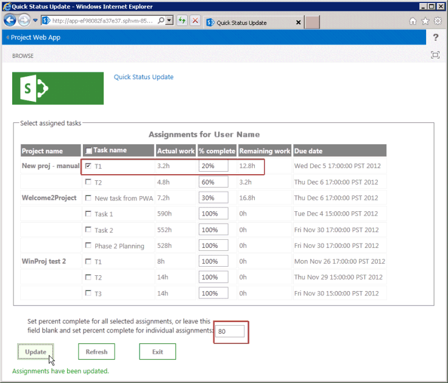
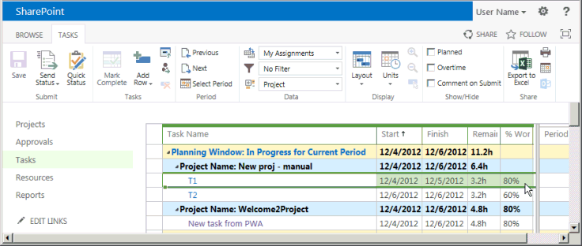

# <a name="create-a-sharepoint-hosted-project-server-add-in"></a><span data-ttu-id="f2c3a-103">Erstellen eines SharePoint gehosteten Project Server-add-Ins</span><span class="sxs-lookup"><span data-stu-id="f2c3a-103">Create a SharePoint-hosted Project Server add-in</span></span>

<span data-ttu-id="f2c3a-104">Die drei Arten von apps, die Sie für Project Online (automatisch gehostet, vom Anbieter gehostet und SharePoint-Hosting) erstellen können, ist die SharePoint-hosted app am einfachsten zu erstellen und bereitstellen.</span><span class="sxs-lookup"><span data-stu-id="f2c3a-104">Of the three types of apps that you can create for Project Online (autohosted, provider-hosted, and SharePoint-hosted), the SharePoint-hosted app is the simplest to create and deploy.</span></span> <span data-ttu-id="f2c3a-105">Nicht der Fall ist einer SharePoint-hosted app OAuth-Authentifizierung erfordern und nicht Azure verwenden oder Wartung einer lokalen Website für die vom Anbieter gehosteten Ressourcen erfordern.</span><span class="sxs-lookup"><span data-stu-id="f2c3a-105">A SharePoint-hosted app does not require OAuth authentication, and does not use Azure or require maintenance of a local site for the provider-hosted resources.</span></span> <span data-ttu-id="f2c3a-106">Die **App für SharePoint 2013** -Vorlage in Visual Studio ist eine bequeme Framework für die Entwicklung von apps, die veröffentlicht und in den Office Store verkauft oder mit einem privaten app-Katalog in SharePoint bereitgestellt werden können.</span><span class="sxs-lookup"><span data-stu-id="f2c3a-106">The **App for SharePoint 2013** template in Visual Studio is a convenient framework for developing apps that can be published and sold in the Office Store or deployed to a private app catalog on SharePoint.</span></span> 
  
<span data-ttu-id="f2c3a-107">In-Projekt ist Zeitberichte der Prozess, in dem ein Teammitglied die Seite Aufgaben in Project Web App verwenden kann, um den Status einer zugewiesenen Aufgabe, wie die Anzahl der täglichen einer Woche arbeiten für den Vorgang aufgewendeten Arbeitsstunden zu übermitteln.</span><span class="sxs-lookup"><span data-stu-id="f2c3a-107">In Project, statusing is a process where a team member can use the Tasks page in Project Web App to submit the status of an assigned task, such as the number of hours worked each day of a week spent working on the task.</span></span> <span data-ttu-id="f2c3a-108">Der Zuordnungsbesitzer (in der Regel der Projektmanager) kann genehmigen oder ablehnen den Status.</span><span class="sxs-lookup"><span data-stu-id="f2c3a-108">The assignment owner (usually the project manager) can approve or reject the status.</span></span> <span data-ttu-id="f2c3a-109">Wenn der Status genehmigt wird, wird den Zeitplan von Project neu berechnet.</span><span class="sxs-lookup"><span data-stu-id="f2c3a-109">When the status is approved, Project recalculates the schedule.</span></span> <span data-ttu-id="f2c3a-110">Die **QuickStatus** -app zeigt zugewiesene Aufgaben, die der Benutzer kann schnell Prozent abgeschlossen aktualisieren und Status der ausgewählten Zuordnungen zur Genehmigung übermitteln.</span><span class="sxs-lookup"><span data-stu-id="f2c3a-110">The **QuickStatus** app displays assigned tasks, where the user can quickly update percent complete and submit status of the selected assignments for approval.</span></span> <span data-ttu-id="f2c3a-111">Obwohl die Seite Aufgaben in Project Web App viel mehr Funktionen verfügt, ist die **QuickStatus** -app ein Beispiel, das eine einfache Benutzeroberfläche bereitstellt.</span><span class="sxs-lookup"><span data-stu-id="f2c3a-111">Although the Tasks page in Project Web App has much more functionality, the **QuickStatus** app is an example that provides a simplified interface.</span></span> 
  
<span data-ttu-id="f2c3a-112">Die **QuickStatus** -app ist ein Beispiel für Entwickler. Es ist nicht für die Verwendung in einer produktionsumgebung vorgesehen.</span><span class="sxs-lookup"><span data-stu-id="f2c3a-112">The **QuickStatus** app is a sample for developers; it is not intended for use in a production environment.</span></span> <span data-ttu-id="f2c3a-113">Der primäre Zweck ist ein Beispiel für app-Entwicklung für Project Online, nicht für eine voll funktionsfähige statuserfassungs-app erstellen angezeigt.</span><span class="sxs-lookup"><span data-stu-id="f2c3a-113">The primary purpose is to show an example of app development for Project Online, not to create a fully functional statusing app.</span></span> <span data-ttu-id="f2c3a-114">Eine bessere Ansatz für Zeitberichte finden Sie unter der Empfehlung in den [nächsten Schritten](#pj15_StatusingApp_NextSteps).</span><span class="sxs-lookup"><span data-stu-id="f2c3a-114">For a better approach to statusing, see the recommendation in [Next steps](#pj15_StatusingApp_NextSteps).</span></span>
  
<span data-ttu-id="f2c3a-115">Allgemeine Informationen zu Zeitberichte finden Sie unter [Vorgang in Arbeit](https://support.office.com/article/Find-information-about-Project-Server-2013-8b08a414-15a7-4076-b2db-c90d0214ea7f?ui=en-US&rs=en-US&ad=US#BKMK_TaskProgress).</span><span class="sxs-lookup"><span data-stu-id="f2c3a-115">For general information about statusing, see [Task progress](https://support.office.com/article/Find-information-about-Project-Server-2013-8b08a414-15a7-4076-b2db-c90d0214ea7f?ui=en-US&rs=en-US&ad=US#BKMK_TaskProgress).</span></span> <span data-ttu-id="f2c3a-116">Weitere Informationen zum Entwickeln von Add-Ins für SharePoint und Project Server finden Sie unter [SharePoint-Add-ins](http://msdn.microsoft.com/en-us/library/jj163230.aspx).</span><span class="sxs-lookup"><span data-stu-id="f2c3a-116">For more information about developing add-ins for SharePoint and Project Server, see [SharePoint Add-ins](http://msdn.microsoft.com/en-us/library/jj163230.aspx).</span></span>

<span data-ttu-id="f2c3a-117"><a name="pj15_StatusingApp_Prerequisites"> </a></span><span class="sxs-lookup"><span data-stu-id="f2c3a-117"></span></span>

## <a name="prerequisites-for-creating-an-app-for-project-server-2013"></a><span data-ttu-id="f2c3a-118">Erforderliche Komponenten für das Erstellen einer app für Project Server 2013</span><span class="sxs-lookup"><span data-stu-id="f2c3a-118">Prerequisites for creating an app for Project Server 2013</span></span>

<span data-ttu-id="f2c3a-119">Informationen zum Entwickeln von apps relativ einfach, die mit Project Online oder einer lokalen Installation von Project Server 2013 bereitgestellt werden können, können Sie die Napa verwenden, die eine online-Entwicklung-Umgebung bereitstellen.</span><span class="sxs-lookup"><span data-stu-id="f2c3a-119">To develop relatively simple apps that can be deployed to Project Online or to an on-premises installation of Project Server 2013, you can use the Napa, which provide an online development environment.</span></span> <span data-ttu-id="f2c3a-120">Für komplexere apps können Project Web App-Multifunktionsleiste und einfacher Debuggen während der Entwicklung, ändern Sie Visual Studio 2012 oder Visual Studio 2013 verwenden.</span><span class="sxs-lookup"><span data-stu-id="f2c3a-120">For more complex apps, modifying the Project Web App ribbon, and easier debugging during development, you can use Visual Studio 2012 or Visual Studio 2013.</span></span> <span data-ttu-id="f2c3a-121">Beispielsweise können Sie mit einer lokalen Installation manuell die Datentabellen Entwürfe, damit die Änderungen in der Project Server-Datenbank überprüfen.</span><span class="sxs-lookup"><span data-stu-id="f2c3a-121">For example, with an on-premises installation, you can manually check the Drafts datatables for changes in the Project Server database.</span></span> <span data-ttu-id="f2c3a-122">In diesem Artikel veranschaulicht, wie app-Entwicklung mit Visual Studio ausführen.</span><span class="sxs-lookup"><span data-stu-id="f2c3a-122">This article shows how to do app development with Visual Studio.</span></span>
  
<span data-ttu-id="f2c3a-123">Entwicklung von apps mit Visual Studio Project Server ist Folgendes erforderlich:</span><span class="sxs-lookup"><span data-stu-id="f2c3a-123">Development of Project Server apps with Visual Studio requires the following:</span></span>
  
- <span data-ttu-id="f2c3a-124">Stellen Sie sicher, dass Sie die neuesten Servicepacks und Windows-Updates auf Ihrem lokalen Entwicklungscomputer installiert haben.</span><span class="sxs-lookup"><span data-stu-id="f2c3a-124">Ensure that you have installed the most recent service packs and Windows updates on your local development computer.</span></span> <span data-ttu-id="f2c3a-125">Das Betriebssystem kann Windows 7, Windows 8, Windows Server 2008 oder Windows Server 2012 sein.</span><span class="sxs-lookup"><span data-stu-id="f2c3a-125">The operating system can be Windows 7, Windows 8, Windows Server 2008, or Windows Server 2012.</span></span>
    
- <span data-ttu-id="f2c3a-126">Sie müssen einen Computer verfügen, auf dem SharePoint Server 2013 und Project Server 2013 installiert, in der Computer für eine app-Isolation und Sideloading Apps konfiguriert ist.</span><span class="sxs-lookup"><span data-stu-id="f2c3a-126">You must have a computer that has SharePoint Server 2013 and Project Server 2013 installed, where the computer is configured for app isolation and sideloading of apps.</span></span> <span data-ttu-id="f2c3a-127">Sideloading kann Visual Studio die app für das debugging vorübergehend zu installieren.</span><span class="sxs-lookup"><span data-stu-id="f2c3a-127">Sideloading enables Visual Studio to temporarily install the app for debugging.</span></span> <span data-ttu-id="f2c3a-128">Sie können eine lokale Installation von SharePoint und Project Server verwenden.</span><span class="sxs-lookup"><span data-stu-id="f2c3a-128">You can use an on-premises installation of SharePoint and Project Server.</span></span> <span data-ttu-id="f2c3a-129">Weitere Informationen finden Sie unter [Einrichten einer lokalen Entwicklungsumgebung für apps für SharePoint](http://msdn.microsoft.com/en-us/library/fp179923%28Office.15%29.aspx).</span><span class="sxs-lookup"><span data-stu-id="f2c3a-129">For more information, see [Set up an on-premises development environment for apps for SharePoint](http://msdn.microsoft.com/en-us/library/fp179923%28Office.15%29.aspx).</span></span>
    
   > [!NOTE]
   > <span data-ttu-id="f2c3a-130">Konfigurieren Sie für eine lokale Installation einer isolierten app Domäne *vor* einen unternehmenseigenen app-Katalog zu erstellen.</span><span class="sxs-lookup"><span data-stu-id="f2c3a-130">For an on-premises installation, configure an isolated app domain  *before*  you create a corporate app catalog.</span></span> 
  
- <span data-ttu-id="f2c3a-131">Dem Entwicklungscomputer kann auf einem Remotecomputer sein, der Office Developer Tools für Visual Studio 2012 installiert hat.</span><span class="sxs-lookup"><span data-stu-id="f2c3a-131">The development computer can be a remote computer that has Office Developer Tools for Visual Studio 2012 installed.</span></span> <span data-ttu-id="f2c3a-132">Stellen Sie sicher, dass Sie die aktuellste Version installiert haben; finden Sie im Abschnitt *Tools* den [Downloads für Apps für Office und SharePoint](http://msdn.microsoft.com/en-us/office/apps/fp123627.aspx).</span><span class="sxs-lookup"><span data-stu-id="f2c3a-132">Ensure that you have installed the most recent version; see the  *Tools*  section of the [Apps for Office and SharePoint downloads](http://msdn.microsoft.com/en-us/office/apps/fp123627.aspx).</span></span>
    
- <span data-ttu-id="f2c3a-133">Stellen Sie sicher, dass die Project Web App-Instanz Sie für die Entwicklung verwenden und Tests in den Browser zugänglich ist.</span><span class="sxs-lookup"><span data-stu-id="f2c3a-133">Verify that the Project Web App instance you will be using for development and testing is accessible in the browser.</span></span>
    
<span data-ttu-id="f2c3a-134">Informationen zur Verwendung der online-Tools finden Sie unter [Einrichten einer Umgebung für die Entwicklung von apps für SharePoint in Office 365](http://msdn.microsoft.com/en-us/library/fp161179.aspx).</span><span class="sxs-lookup"><span data-stu-id="f2c3a-134">For information about using the online tools, see [Set up an environment for developing apps for SharePoint on Office 365](http://msdn.microsoft.com/en-us/library/fp161179.aspx).</span></span> <span data-ttu-id="f2c3a-135">Eine exemplarische Vorgehensweise zur Erstellung einer einfachen app für Project Server, die online-Tools verwendet, werden soll, finden Sie unter EPMSource-Blog-Reihe [Erstellen Ihrer ersten app für Project Server](http://epmsource.com/2012/11/20/building-your-first-project-server-app-part-zerothe-introduction/).</span><span class="sxs-lookup"><span data-stu-id="f2c3a-135">For a walkthrough of building a simple app for Project Server that uses the online tools, see the EPMSource blog series, [Building your first Project Server app](http://epmsource.com/2012/11/20/building-your-first-project-server-app-part-zerothe-introduction/).</span></span>

<span data-ttu-id="f2c3a-136"><a name="pj15_StatusingApp_UsingVisualStudio"> </a></span><span class="sxs-lookup"><span data-stu-id="f2c3a-136"></span></span>

## <a name="using-visual-studio-to-create-a-project-server-app"></a><span data-ttu-id="f2c3a-137">Verwenden von Visual Studio zum Erstellen einer Project Server-app</span><span class="sxs-lookup"><span data-stu-id="f2c3a-137">Using Visual Studio to create a Project Server app</span></span>

<span data-ttu-id="f2c3a-138">Office Developer Tools für Visual Studio 2012 enthält eine Vorlage für SharePoint-apps, die mit Project Server 2013 verwendet werden können.</span><span class="sxs-lookup"><span data-stu-id="f2c3a-138">Office Developer Tools for Visual Studio 2012 includes a template for SharePoint apps that can be used with Project Server 2013.</span></span> <span data-ttu-id="f2c3a-139">Wenn Sie eine app-Lösung erstellen, enthält die Lösung für den benutzerdefinierten Code die folgenden Dateien:</span><span class="sxs-lookup"><span data-stu-id="f2c3a-139">When you create an app solution, the solution includes the following files for your custom code:</span></span>
  
- <span data-ttu-id="f2c3a-140">**AppManifest.xml** umfassen Einstellungen für die app-Titel, berechtigungsanforderungsbereich und andere Eigenschaften.</span><span class="sxs-lookup"><span data-stu-id="f2c3a-140">**AppManifest.xml** includes settings for the app title, permission request scope, and other properties.</span></span> <span data-ttu-id="f2c3a-141">Schritt 1 enthält die Schritte zum Festlegen der Eigenschaften mithilfe des Manifest-Designers.</span><span class="sxs-lookup"><span data-stu-id="f2c3a-141">Procedure 1 includes steps to set the properties by using the Manifest Designer.</span></span> 
    
- <span data-ttu-id="f2c3a-142">**"Default.aspx"** im Ordner Seiten ist die Hauptseite der app.</span><span class="sxs-lookup"><span data-stu-id="f2c3a-142">**Default.aspx** in the Pages folder is the main page of the app.</span></span> <span data-ttu-id="f2c3a-143">Verfahren 2 zeigt, wie HTML5 Inhalte für die **QuickStatus** -app hinzufügen.</span><span class="sxs-lookup"><span data-stu-id="f2c3a-143">Procedure 2 shows how to add HTML5 content for the **QuickStatus** app.</span></span> 
    
- <span data-ttu-id="f2c3a-144">**App.js** in den Ordner Scripts ist die primäre Datei für den benutzerdefinierten JavaScript-Code.</span><span class="sxs-lookup"><span data-stu-id="f2c3a-144">**App.js** in the Scripts folder is the primary file for the custom JavaScript code.</span></span> <span data-ttu-id="f2c3a-145">Schritt 3 wird den JavaScript-Code für die **QuickStatus** -app erläutert.</span><span class="sxs-lookup"><span data-stu-id="f2c3a-145">Procedure 3 explains the JavaScript code for the **QuickStatus** app.</span></span> 
    
   <span data-ttu-id="f2c3a-146">Wenn Sie kommerziellen Steuerelemente wie zum Beispiel ein jQuery-basierte Raster- oder Datumsauswahl hinzufügen, können Sie Verweise auf zusätzliche JavaScript-Dateien in der Datei "default.aspx" hinzufügen.</span><span class="sxs-lookup"><span data-stu-id="f2c3a-146">If you add commercial controls such as a jQuery-based grid or date picker, you can add references to additional JavaScript files in the Default.aspx file.</span></span>
    
- <span data-ttu-id="f2c3a-147">**"App.CSS"** im Ordner "Content" ist die primäre Datei für benutzerdefinierte CSS3 Formatvorlagen.</span><span class="sxs-lookup"><span data-stu-id="f2c3a-147">**App.css** in the Content folder is the primary file for custom CSS3 styles.</span></span> <span data-ttu-id="f2c3a-148">Schritt 2 und 3 Verfahren enthalten Informationen zu cascading Stylesheets (CSS)-Formate für die **QuickStatus** -app.</span><span class="sxs-lookup"><span data-stu-id="f2c3a-148">Procedure 2 and Procedure 3 include information about cascading style sheets (CSS) styles for the **QuickStatus** app.</span></span> <span data-ttu-id="f2c3a-149">Sie können die Verweise auf zusätzliche CSS-Dateien in der Datei "default.aspx" hinzufügen.</span><span class="sxs-lookup"><span data-stu-id="f2c3a-149">You can add references to additional CSS files in the Default.aspx file.</span></span> 
    
- <span data-ttu-id="f2c3a-150">**AppIcon.png** im Ordner Images ist das 96 x 96-Symbol, das die app im Office Store oder den app-Katalog wird angezeigt.</span><span class="sxs-lookup"><span data-stu-id="f2c3a-150">**AppIcon.png** in the Images folder is the 96 x 96 icon that the app displays in the Office Store or the app catalog.</span></span> 
    
<span data-ttu-id="f2c3a-151">Um die Project Web App-Multifunktionsleiste ändern, können Sie eine benutzerdefinierte Aktion hinzufügen.</span><span class="sxs-lookup"><span data-stu-id="f2c3a-151">To modify the Project Web App ribbon, you can add a ribbon custom action.</span></span> <span data-ttu-id="f2c3a-152">Der [Beispielcode für die QuickStatus-app](#pj15_StatusingApp_Example) -Abschnitt enthält den vollständigen Code für die geänderten Dateien Default.aspx, App.js, "App.CSS", "Elements.xml" und "AppManifest.xml".</span><span class="sxs-lookup"><span data-stu-id="f2c3a-152">The [Example code for the QuickStatus app](#pj15_StatusingApp_Example) section includes the complete code for the modified Default.aspx, App.js, App.css, Elements.xml, and AppManifest.xml files.</span></span> 
  
### <a name="procedure-1-to-create-an-app-project-in-visual-studio"></a><span data-ttu-id="f2c3a-153">Schritt 1.</span><span class="sxs-lookup"><span data-stu-id="f2c3a-153">Procedure 1.</span></span> <span data-ttu-id="f2c3a-154">Zum Erstellen eines app-Projekts in Visual Studio</span><span class="sxs-lookup"><span data-stu-id="f2c3a-154">To create an app project in Visual Studio</span></span>

1. <span data-ttu-id="f2c3a-155">Führen Sie Visual Studio 2012 als Administrator, und wählen Sie dann auf der Startseite **Neues Projekt** aus.</span><span class="sxs-lookup"><span data-stu-id="f2c3a-155">Run Visual Studio 2012 as an administrator, and then select **New Project** on the Start page.</span></span> 
    
2. <span data-ttu-id="f2c3a-156">Klicken Sie im Dialogfeld **Neues Projekt** erweitern Sie die **Vorlagen**, **Visual C#-** und **Office/SharePoint** -Knoten zu, und wählen Sie dann **Apps**aus.</span><span class="sxs-lookup"><span data-stu-id="f2c3a-156">In the **New Project** dialog box, expand the **Templates**, **Visual C#**, and **Office/SharePoint** nodes, and then select **Apps**.</span></span> <span data-ttu-id="f2c3a-157">Verwenden Sie die Standardeinstellung **.NET Framework 4.5** in der Ziel-Framework Dropdown-Liste am oberen Rand der mittleren Bereich, und wählen Sie dann **App für SharePoint 2013** (siehe Abbildung 1).</span><span class="sxs-lookup"><span data-stu-id="f2c3a-157">Use the default **.NET Framework 4.5** in the target framework drop-down list at the top of the center pane, and then select **App for SharePoint 2013** (see Figure 1).</span></span> 
    
3. <span data-ttu-id="f2c3a-158">Im Feld **Name** Geben Sie QuickStatus, navigieren Sie zum Speicherort, in dem Sie die app zu speichern, und wählen Sie dann **OK**möchten.</span><span class="sxs-lookup"><span data-stu-id="f2c3a-158">In the **Name** field, type QuickStatus, browse to the location where you want to save the app, and then choose **OK**.</span></span>
    
   <span data-ttu-id="f2c3a-159">**Abbildung 1. Erstellen einer Project Server-app in Visual Studio**</span><span class="sxs-lookup"><span data-stu-id="f2c3a-159">**Figure 1. Creating a Project Server app in Visual Studio**</span></span>

   <span data-ttu-id="f2c3a-160">![Erstellen einer Project Server-app in Visual Studio] (media/pj15_CreateStatusingApp_NewProject.gif "Erstellen einer Project Server-app in Visual Studio")</span><span class="sxs-lookup"><span data-stu-id="f2c3a-160"></span></span>
  
4. <span data-ttu-id="f2c3a-161">Füllen Sie im Dialogfeld **neue app für SharePoint** die nachfolgend beschriebenen drei Felder aus:</span><span class="sxs-lookup"><span data-stu-id="f2c3a-161">In the **New app for SharePoint** dialog box, fill in the following three fields:</span></span> 
    
   - <span data-ttu-id="f2c3a-162">Geben Sie den Namen, den Sie die app in Project Web App anzeigen möchten, klicken Sie im oberen Textfeld.</span><span class="sxs-lookup"><span data-stu-id="f2c3a-162">In the top text box, type the name that you want the app to display in Project Web App.</span></span> <span data-ttu-id="f2c3a-163">Geben Sie zum Beispiel schnell Status aktualisieren.</span><span class="sxs-lookup"><span data-stu-id="f2c3a-163">For example, type Quick Status Update.</span></span>
    
   - <span data-ttu-id="f2c3a-164">Geben Sie für die Website für das debugging verwendet werden soll die URL der Project Web App-Instanz.</span><span class="sxs-lookup"><span data-stu-id="f2c3a-164">For the site to use for debugging, type the URL of the Project Web App instance.</span></span> <span data-ttu-id="f2c3a-165">Geben Sie zum Beispiel `https://ServerName/ProjectServerName` (ersetzen Sie _ServerName_ und _ProjectServerName_ durch eigene Werte), und klicken Sie auf **Überprüfen**.</span><span class="sxs-lookup"><span data-stu-id="f2c3a-165">For example, type  `https://ServerName/ProjectServerName` (replacing  _ServerName_ and  _ProjectServerName_ with your own values), and then choose **Validate**.</span></span> <span data-ttu-id="f2c3a-166">Wenn alles gut geht, zeigt Visual Studio **Verbindung wurde erfolgreich hergestellt**.</span><span class="sxs-lookup"><span data-stu-id="f2c3a-166">If all goes well, Visual Studio shows **Connection successful**.</span></span> <span data-ttu-id="f2c3a-167">Wenn Sie eine Fehlermeldung erhalten, stellen Sie sicher, dass die Project Web App-URL korrekt ist und der Project Server-Computer für app-Isolation und Sideloading von apps konfiguriert ist.</span><span class="sxs-lookup"><span data-stu-id="f2c3a-167">If you get an error message, ensure that the Project Web App URL is correct and that the Project Server computer is configured for app isolation and sideloading of apps.</span></span> <span data-ttu-id="f2c3a-168">Weitere Informationen finden Sie im Abschnitt [Voraussetzungen für das Erstellen einer Apps für Project Server 2013](#pj15_StatusingApp_Prerequisites) .</span><span class="sxs-lookup"><span data-stu-id="f2c3a-168">For more information, see the [Prerequisites for creating an app for Project Server 2013](#pj15_StatusingApp_Prerequisites) section.</span></span> 
    
   - <span data-ttu-id="f2c3a-169">Wählen Sie in der Dropdownliste **Wie soll Ihre app für SharePoint gehostet** **SharePoint gehostet**.</span><span class="sxs-lookup"><span data-stu-id="f2c3a-169">In the **How do you want to host your app for SharePoint** drop-down list, choose **SharePoint-hosted**.</span></span>
    
   > [!CAUTION]
   > <span data-ttu-id="f2c3a-170">Wenn Sie versehentlich von der standardmäßige **vom Anbieter gehosteten** Projekttyp auswählen, erstellt Visual Studio zwei Projekte in der Lösung: ein **QuickStatus** -Projekt und ein **QuickStatusWeb** -Projekt.</span><span class="sxs-lookup"><span data-stu-id="f2c3a-170">If you choose the default **Provider-hosted** project type by mistake, Visual Studio creates two projects in the solution: a **QuickStatus** project and a **QuickStatusWeb** project.</span></span> <span data-ttu-id="f2c3a-171">Wenn Sie zwei Projekte angezeigt wird, dieser Lösung löschen und erneut starten.</span><span class="sxs-lookup"><span data-stu-id="f2c3a-171">If you see two projects, delete that solution and start again.</span></span> 
  
5. <span data-ttu-id="f2c3a-172">Wählen Sie **OK** zum Erstellen der **QuickStatus** -Lösung, die **QuickStatus** -Projekt und die Standard-Dateien.</span><span class="sxs-lookup"><span data-stu-id="f2c3a-172">Choose **OK** to create the **QuickStatus** solution, **QuickStatus** project, and default files.</span></span> 
    
6. <span data-ttu-id="f2c3a-173">Öffnen Sie die Manifest-Designer-Ansicht (beispielsweise Doppelklicken auf die Datei AppManifest.xml-Datei).</span><span class="sxs-lookup"><span data-stu-id="f2c3a-173">Open the Manifest Designer view (for example, double-click the AppManifest.xml file).</span></span> <span data-ttu-id="f2c3a-174">Auf der Registerkarte **Allgemein** sollte das Textfeld **Titel** den Namen der app anzeigen, den Sie in Schritt 4 eingegeben haben.</span><span class="sxs-lookup"><span data-stu-id="f2c3a-174">On the **General** tab, the **Title** text box should show the app name that you typed in step 4.</span></span> <span data-ttu-id="f2c3a-175">Wählen Sie die Registerkarte **Berechtigungen** die folgenden berechtigungsanforderungen für die app hinzufügen (siehe Abbildung 2):</span><span class="sxs-lookup"><span data-stu-id="f2c3a-175">Choose the **Permissions** tab to add the following permission requests for the app (see Figure 2):</span></span> 
    
   - <span data-ttu-id="f2c3a-176">Wählen Sie in der ersten Zeile der **berechtigungsanforderungen** -Liste in der Spalte **Bereich** **Zeitberichte** in der Dropdown-Liste.</span><span class="sxs-lookup"><span data-stu-id="f2c3a-176">In the first row of the **Permission requests** list, in the **Scope** column, choose **Statusing** in the drop-down list.</span></span> <span data-ttu-id="f2c3a-177">Wählen Sie in der Spalte **Berechtigung** **SubmitStatus**.</span><span class="sxs-lookup"><span data-stu-id="f2c3a-177">In the **Permission** column, choose **SubmitStatus**.</span></span>
    
   - <span data-ttu-id="f2c3a-178">Hinzufügen einer Zeile, wobei der **Bereich** umfasst **Mehrere Projekte** und die **Berechtigung** **Lesen**.</span><span class="sxs-lookup"><span data-stu-id="f2c3a-178">Add a row where the **Scope** is **Multiple Projects** and the **Permission** is **Read**.</span></span>
    
   <span data-ttu-id="f2c3a-179">**Abbildung 2. Festlegen des berechtigungsumfangs für eine statuserfassungs-app**</span><span class="sxs-lookup"><span data-stu-id="f2c3a-179">**Figure 2. Setting the permission scope for a statusing app**</span></span>

   <span data-ttu-id="f2c3a-180">![Festlegen des berechtigungsumfangs für eine statuserfassungs-app] (media/pj15_CreateStatusingApp_PermissionScope.gif "Festlegen des berechtigungsumfangs für eine statuserfassungs-app")</span><span class="sxs-lookup"><span data-stu-id="f2c3a-180"></span></span>
  
<span data-ttu-id="f2c3a-181">Die **QuickStatus** -app kann ein Project Web App-Benutzer Zuordnungen für diesen Benutzer aus mehreren Projekten lesen, ändern die Zuordnung prozentual abgeschlossen und die Aktualisierung senden.</span><span class="sxs-lookup"><span data-stu-id="f2c3a-181">The **QuickStatus** app enables a Project Web App user to read assignments for that user from multiple projects, change the assignment percent complete, and submit the update.</span></span> <span data-ttu-id="f2c3a-182">Die anderen berechtigungsanforderungsbereiche in der Dropdown-Liste in Abbildung 2 dargestellt sind nicht erforderlich für diese app.</span><span class="sxs-lookup"><span data-stu-id="f2c3a-182">The other permission request scopes shown in the drop-down list in Figure 2 are not required for this app.</span></span> <span data-ttu-id="f2c3a-183">Die berechtigungsanforderungsbereiche sind die Berechtigungen, die die app im Auftrag des Benutzers anfordert.</span><span class="sxs-lookup"><span data-stu-id="f2c3a-183">The permission request scopes are the permissions that the app requests on behalf of the user.</span></span> <span data-ttu-id="f2c3a-184">Wenn der Benutzer nicht über diese Berechtigungen in Project Web App verfügt, wird die app nicht ausgeführt.</span><span class="sxs-lookup"><span data-stu-id="f2c3a-184">If the user does not have those permissions in Project Web App, the app does not run.</span></span> <span data-ttu-id="f2c3a-185">Eine app kann über mehrere berechtigungsanforderungsbereiche, einschließlich derer, für andere SharePoint-Berechtigungen, jedoch sollte nur das Minimum für die app-Funktionalität.</span><span class="sxs-lookup"><span data-stu-id="f2c3a-185">An app can have multiple permission request scopes, including those for other SharePoint permissions, but should have only the minimum necessary for the app functionality.</span></span> <span data-ttu-id="f2c3a-186">Dies sind die berechtigungsanforderungsbereiche, die im Zusammenhang mit Project Server:</span><span class="sxs-lookup"><span data-stu-id="f2c3a-186">Following are the permission request scopes that are related to Project Server:</span></span> 

- <span data-ttu-id="f2c3a-187">**Enterprise-Ressourcen**: Berechtigungen für Ressourcen-Manager, zum Lesen oder Schreiben von Informationen über andere Project Web App-Benutzer.</span><span class="sxs-lookup"><span data-stu-id="f2c3a-187">**Enterprise Resources**: Resource manager permissions, to read or write information about other Project Web App users.</span></span>
    
- <span data-ttu-id="f2c3a-188">**Mehrere Projekte**: Lese- oder Schreibzugriff mehr als ein Projekt, in dem der Benutzer die angeforderten Berechtigungen verfügt.</span><span class="sxs-lookup"><span data-stu-id="f2c3a-188">**Multiple Projects**: Read or write to more than one project, where the user has the permissions requested.</span></span>
    
- <span data-ttu-id="f2c3a-189">**Project Server**: bewirkt, dass die app-Benutzer benötigen Administratorberechtigungen für Project Web App.</span><span class="sxs-lookup"><span data-stu-id="f2c3a-189">**Project Server**: Requires the app user to have administrator permissions for Project Web App.</span></span>
    
- <span data-ttu-id="f2c3a-190">**Reporting**: Lesen Sie den **ProjectData** OData-Dienst für Project Web App (erfordert nur anmelden Berechtigung für Project Web App).</span><span class="sxs-lookup"><span data-stu-id="f2c3a-190">**Reporting**: Read the **ProjectData** OData service for Project Web App (requires only log on permission for Project Web App).</span></span> 
    
- <span data-ttu-id="f2c3a-191">**Einzelnes Projekt**: Lese- oder Schreibzugriff auf ein Projekt, in dem der Benutzer die angeforderten Berechtigungen verfügt.</span><span class="sxs-lookup"><span data-stu-id="f2c3a-191">**Single Project**: Read or write to a project where the user has the permissions requested.</span></span>
    
- <span data-ttu-id="f2c3a-192">**Statusing**: Updates für den Status der Zuordnungen, wie Zeiten gearbeitet, Prozent abgeschlossen und neue Zuordnungen zu übermitteln.</span><span class="sxs-lookup"><span data-stu-id="f2c3a-192">**Statusing**: Submit updates for status of assignments, such as times worked, percent complete, and new assignments.</span></span>
    
- <span data-ttu-id="f2c3a-193">**Workflow**: Wenn der Benutzer die Berechtigung zum Ausführen von Project Server-Workflows verfügt, klicken Sie dann die app ausgeführt wird, mit erhöhten Berechtigungen für den Workflow.</span><span class="sxs-lookup"><span data-stu-id="f2c3a-193">**Workflow**: If the user has permission to run Project Server workflows, the app then runs with elevated permissions for the workflow.</span></span>
    
<span data-ttu-id="f2c3a-194">Weitere Informationen zu berechtigungsanforderungsbereiche für Project Server 2013 finden Sie im Abschnitt *Project-apps* in [Updates für Entwickler in Project 2013](updates-for-developers-in-project-2013.md) und [App-Berechtigungen in SharePoint 2013](http://msdn.microsoft.com/library/fp142383.aspx).</span><span class="sxs-lookup"><span data-stu-id="f2c3a-194">For more information about permission request scopes for Project Server 2013, see the  *Project apps*  section in [Updates for developers in Project 2013](updates-for-developers-in-project-2013.md) and [App permissions in SharePoint 2013](http://msdn.microsoft.com/library/fp142383.aspx).</span></span>


<span data-ttu-id="f2c3a-195"><a name="pj15_StatusingApp_HTML"> </a></span><span class="sxs-lookup"><span data-stu-id="f2c3a-195"></span></span>

### <a name="creating-the-html-content-for-the-quickstatus-app"></a><span data-ttu-id="f2c3a-196">Erstellen von HTML-Inhalten für die QuickStatus-app</span><span class="sxs-lookup"><span data-stu-id="f2c3a-196">Creating the HTML content for the QuickStatus app</span></span>

<span data-ttu-id="f2c3a-197">Bevor Sie beginnen, Codieren des HTML-Inhalts, Entwerfen der Benutzeroberfläche und die Benutzeroberfläche für die QuickStatus-app (Abbildung 3 zeigt ein Beispiel für die fertige Seite).</span><span class="sxs-lookup"><span data-stu-id="f2c3a-197">Before you start coding the HTML content, design the user interface and user experience for the QuickStatus app (Figure 3 shows an example of the completed page).</span></span> <span data-ttu-id="f2c3a-198">Ein Entwurf kann auch einen Überblick über die JavaScript-Funktionen enthalten, die mit den HTML-Code interagieren.</span><span class="sxs-lookup"><span data-stu-id="f2c3a-198">A design can also include an outline of the JavaScript functions that interact with the HTML code.</span></span> <span data-ttu-id="f2c3a-199">Allgemeine Informationen finden Sie unter [UX-Design für apps in SharePoint 2013](http://msdn.microsoft.com/library/fp179934.aspx).</span><span class="sxs-lookup"><span data-stu-id="f2c3a-199">For general information, see [UX design for apps in SharePoint 2013](http://msdn.microsoft.com/library/fp179934.aspx).</span></span>
  
<span data-ttu-id="f2c3a-200">**Abbildung 3. Design der QuickStatus-app-Seite**</span><span class="sxs-lookup"><span data-stu-id="f2c3a-200">**Figure 3. Design of the QuickStatus app page**</span></span>

<span data-ttu-id="f2c3a-201">![Design der QuickStatus-app-Seite] (media/pj15_CreateStatusingApp_AfterRefresh.gif "Design der QuickStatus-app-Seite")</span><span class="sxs-lookup"><span data-stu-id="f2c3a-201"></span></span>
  
<span data-ttu-id="f2c3a-202">Die app wird der Anzeigename im oberen Bereich, der der Wert des **Title** -Elements in der Datei AppManifest.xml ist.</span><span class="sxs-lookup"><span data-stu-id="f2c3a-202">The app shows the display name at the top, which is the value of the **Title** element in AppManifest.xml.</span></span> 
  
<span data-ttu-id="f2c3a-203">Standardmäßig wird die Seite HTML5 verwendet.</span><span class="sxs-lookup"><span data-stu-id="f2c3a-203">By default, the page uses HTML5.</span></span> <span data-ttu-id="f2c3a-204">Es folgen die standardmäßigen HTML-Elemente für die Benutzeroberfläche Hauptobjekte, die die **QuickStatus** -app im Textkörper der Seite enthält:</span><span class="sxs-lookup"><span data-stu-id="f2c3a-204">Following are the standard HTML elements for the main UI objects that the **QuickStatus** app contains in the body of the page:</span></span> 
  
- <span data-ttu-id="f2c3a-205">Ein **Form** -Element enthält alle anderen Elemente der Benutzeroberfläche.</span><span class="sxs-lookup"><span data-stu-id="f2c3a-205">A **form** element contains all of the other UI elements.</span></span> 
    
- <span data-ttu-id="f2c3a-206">Ein Element **Feldgruppe** erstellt einen Container und einen Rahmen für die Tabelle der Zuordnungen. das untergeordnete **Legend** -Element enthält eine Beschriftung für den Container.</span><span class="sxs-lookup"><span data-stu-id="f2c3a-206">A **fieldset** element creates a container and border for the table of assignments; the child **legend** element provides a label for the container.</span></span> 
    
- <span data-ttu-id="f2c3a-207">Ein **Table** -Element enthält eine Beschriftung und nur eine Kopfzeile.</span><span class="sxs-lookup"><span data-stu-id="f2c3a-207">A **table** element includes a caption and only a table header.</span></span> <span data-ttu-id="f2c3a-208">JavaScript-Funktionen ändern Sie die Tabellenüberschrift und Zeilen für die Zuordnungen hinzufügen.</span><span class="sxs-lookup"><span data-stu-id="f2c3a-208">JavaScript functions change the table caption and add rows for the assignments.</span></span> 
    
   > [!NOTE]
   > <span data-ttu-id="f2c3a-209">Zum paging und Sortierung auf einfache Weise hinzufügen verwenden eine app Produktion ein kommerziellen jQuery-basierten Rastersteuerelements anstelle einer Tabelle wahrscheinlich.</span><span class="sxs-lookup"><span data-stu-id="f2c3a-209">To easily add paging and sorting, a production app would probably use a commercial jQuery-based grid control instead of a table.</span></span> 
  
   <span data-ttu-id="f2c3a-210">Die Tabelle enthält Spalten für den Projektnamen, Vorgangsname mit einem Kontrollkästchen, aktuelle Arbeit, Prozent abgeschlossen, verbleibende Arbeit und den Endtermin für der Zuordnung.</span><span class="sxs-lookup"><span data-stu-id="f2c3a-210">The table includes columns for the project name, task name with a check box, actual work, percent complete, remaining work, and the assignment finish date.</span></span> <span data-ttu-id="f2c3a-211">JavaScript-Funktionen erstellen das Kontrollkästchen und der Texteingabefeld für den Prozentsatz der einzelnen Aufgaben abgeschlossen.</span><span class="sxs-lookup"><span data-stu-id="f2c3a-211">JavaScript functions create the check box and the text input field for the percent complete of each task.</span></span>
    
- <span data-ttu-id="f2c3a-212">Ein **input** -Element für ein Textfeld legt % abgeschlossen für alle ausgewählten Zuordnungen fest.</span><span class="sxs-lookup"><span data-stu-id="f2c3a-212">An **input** element for a text box sets percent complete for all selected assignments.</span></span> 
    
- <span data-ttu-id="f2c3a-213">Ein **Button** -Element sendet der Status geändert wird.</span><span class="sxs-lookup"><span data-stu-id="f2c3a-213">A **button** element submits the status changes.</span></span> 
    
- <span data-ttu-id="f2c3a-214">Ein **Button** -Element wird die Seite aktualisiert.</span><span class="sxs-lookup"><span data-stu-id="f2c3a-214">A **button** element refreshes the page.</span></span> 
    
- <span data-ttu-id="f2c3a-215">Ein **Button** -Element die app beendet und auf der Seite Vorgänge in Project Web App zurückgegeben.</span><span class="sxs-lookup"><span data-stu-id="f2c3a-215">A **button** element exits the app and returns to the Tasks page in Project Web App.</span></span> 
    
<span data-ttu-id="f2c3a-216">Die unteren Text-Feld und die Schaltfläche Elemente sind in **Div** -Elemente, sodass CSS auf einfache Weise die Position und die Darstellung der UI-Objekte verwalten können.</span><span class="sxs-lookup"><span data-stu-id="f2c3a-216">The bottom text box and button elements are within **div** elements, so that CSS can easily manage the position and appearance of the UI objects.</span></span> <span data-ttu-id="f2c3a-217">Eine JavaScript-Funktion hinzugefügt einen Absatz am unteren Rand der Seite, die Ergebnisse für den Erfolg enthält, oder das Fehlschlagen des Updates Status.</span><span class="sxs-lookup"><span data-stu-id="f2c3a-217">A JavaScript function adds a paragraph at the bottom of the page that contains results for success or failure of the status update.</span></span> 
  
### <a name="procedure-2-to-create-the-html-content"></a><span data-ttu-id="f2c3a-218">Schritt 2.</span><span class="sxs-lookup"><span data-stu-id="f2c3a-218">Procedure 2.</span></span> <span data-ttu-id="f2c3a-219">Den HTML-Code Inhalt erstellen</span><span class="sxs-lookup"><span data-stu-id="f2c3a-219">To create the HTML content</span></span>

1. <span data-ttu-id="f2c3a-220">Öffnen Sie in Visual Studio die Datei "default.aspx".</span><span class="sxs-lookup"><span data-stu-id="f2c3a-220">In Visual Studio, open the Default.aspx file.</span></span>
    
   <span data-ttu-id="f2c3a-221">Die Datei enthält zwei **Asp: Content** Elemente: das Element mit der `ContentPlaceHolderID="PlaceHolderAdditionalPageHead"` -Attribut innerhalb der Seitenkopf und dem Element hinzugefügt wird die `ContentPlaceHolderID="PlaceHolderMain"` Attribut wird innerhalb der Seite **Body** -Element eingefügt.</span><span class="sxs-lookup"><span data-stu-id="f2c3a-221">The file includes two **asp:Content** elements: The element with the  `ContentPlaceHolderID="PlaceHolderAdditionalPageHead"` attribute is added within the page header, and the element with the  `ContentPlaceHolderID="PlaceHolderMain"` attribute is placed within the page **body** element.</span></span> 
    
2. <span data-ttu-id="f2c3a-222">In der `<asp:Content ContentPlaceHolderID="PlaceHolderAdditionalPageHead" runat="server">` für die Kopfzeile der Seite steuern, fügen Sie einen Verweis auf die Datei PS.js auf dem Project Server-Computer.</span><span class="sxs-lookup"><span data-stu-id="f2c3a-222">In the  `<asp:Content ContentPlaceHolderID="PlaceHolderAdditionalPageHead" runat="server">` control for the page header, add a reference to the PS.js file on the Project Server computer.</span></span> <span data-ttu-id="f2c3a-223">Zum Testen und Debuggen, können Sie PS.debug.js verwenden.</span><span class="sxs-lookup"><span data-stu-id="f2c3a-223">For testing and debugging, you can use PS.debug.js.</span></span> 
    
   ```HTML
     <script type="text/javascript" src="/_layouts/15/ps.debug.js"></script>
   ```

   <span data-ttu-id="f2c3a-224">Die app-Infrastruktur verwendet die `/_layouts/15/` virtuellen Verzeichnisses für die SharePoint-Website in IIS.</span><span class="sxs-lookup"><span data-stu-id="f2c3a-224">The app infrastructure uses the `/_layouts/15/` virtual directory for the SharePoint site in IIS.</span></span> <span data-ttu-id="f2c3a-225">Ist die physische Datei `%ProgramFiles%\Common Files\Microsoft Shared\Web Server Extensions\15\TEMPLATE\LAYOUTS\PS.debug.js`.</span><span class="sxs-lookup"><span data-stu-id="f2c3a-225">The physical file is  `%ProgramFiles%\Common Files\Microsoft Shared\Web Server Extensions\15\TEMPLATE\LAYOUTS\PS.debug.js`.</span></span>
    
   > [!NOTE]
   > <span data-ttu-id="f2c3a-226">Entfernen Sie vor der Bereitstellung der app für den Produktiveinsatz `.debug` aus der Skriptverweise zum Verbessern der Leistung.</span><span class="sxs-lookup"><span data-stu-id="f2c3a-226">Before you deploy the app for production use, remove  `.debug` from the script references to improve performance.</span></span> 
  
3. <span data-ttu-id="f2c3a-227">In der `<asp:Content ContentPlaceHolderID="PlaceHolderMain" runat="server">` für den Textkörper der Seite steuern, löschen das generierten **Div** -Element, und fügen Sie den HTML-Code für die UI-Objekte.</span><span class="sxs-lookup"><span data-stu-id="f2c3a-227">In the  `<asp:Content ContentPlaceHolderID="PlaceHolderMain" runat="server">` control for the page body, delete the generated **div** element, and then add the HTML code for the UI objects.</span></span> <span data-ttu-id="f2c3a-228">Das **Table** -Element enthält nur eine Kopfzeile.</span><span class="sxs-lookup"><span data-stu-id="f2c3a-228">The **table** element contains only a header row.</span></span> <span data-ttu-id="f2c3a-229">Die **Vorgangsname** Spalte enthält ein Kontrollkästchen Eingabesteuerelement.</span><span class="sxs-lookup"><span data-stu-id="f2c3a-229">The **Task name** column includes a check box input control.</span></span> <span data-ttu-id="f2c3a-230">Text der **Caption** -Elements wird durch den **OnGetUserNameSuccess** Rückruf für die **GetUserInfo** -Funktion in der Datei App.js ersetzt.</span><span class="sxs-lookup"><span data-stu-id="f2c3a-230">Text for the **caption** element is replaced by the **onGetUserNameSuccess** callback for the **getUserInfo** function in the App.js file.</span></span> 
    
    ```HTML
    <form>
        <fieldset>
        <legend>Select assigned tasks</legend>
        <table id="assignmentsTable">
            <caption id="tableCaption">Replace caption</caption>
            <thead>
            <tr id="headerRow">
                <th>Project name</th>
                <th><input type="checkbox" id="headercheckbox" checked="checked" />Task name</th>
                <th>Actual work</th>
                <th>% complete</th>
                <th>Remaining work</th>
                <th>Due date</th>
            </tr>
            </thead>
        </table>
        </fieldset>
        <div id="inputPercentComplete" >
        Set percent complete for all selected assignments, or leave this
        <br /> field blank and set percent complete for individual assignments: 
        <input type="text" name="percentComplete" id="pctComplete" size="4"  maxlength="4" />
        </div>
        <div id="submitResult">
        <p><button id="btnSubmitUpdate" type="button" class="bottomButtons" ></button></p>
        <p id="message"></p>
        </div>
        <div id="refreshPage">
        <p><button id="btnRefresh" type="button" class="bottomButtons" >Refresh</button></p>
        </div>
        <div id="exitPage">
        <p><button id="btnExit" type="button" class="bottomButtons" >Exit</button></p>
        </div>
    </form>
    ```

4. <span data-ttu-id="f2c3a-231">Fügen Sie in der Datei "App.CSS" CSS-Code für die Position und die Darstellung der Benutzeroberflächenelemente.</span><span class="sxs-lookup"><span data-stu-id="f2c3a-231">In the App.css file, add CSS code for the position and appearance of the UI elements.</span></span> <span data-ttu-id="f2c3a-232">Der vollständige CSS-Code der **QuickStatus** -app finden Sie im [Beispielcode für die QuickStatus-app](#pj15_StatusingApp_Example) -Abschnitt.</span><span class="sxs-lookup"><span data-stu-id="f2c3a-232">For the complete CSS code of the **QuickStatus** app, see the [Example code for the QuickStatus app](#pj15_StatusingApp_Example) section.</span></span> 
    
<span data-ttu-id="f2c3a-233">Schritt 3 fügt die JavaScript-Funktionen, um die Zuordnungen lesen und Erstellen von Zeilen der Tabelle und zu ändern und aktualisieren die Zuordnung prozentual abgeschlossen.</span><span class="sxs-lookup"><span data-stu-id="f2c3a-233">Procedure 3 adds the JavaScript functions to read the assignments and create the table rows, and to change and update the assignment percent complete.</span></span> <span data-ttu-id="f2c3a-234">Die tatsächlichen Schritte werden bei der Entwicklung von einer app mehr iterative Alternativ erstellen Sie einige der HTML-Code, hinzufügen und Testen von verwandten Formatvorlagen und JavaScript-Funktionen, ändern oder Hinzufügen weiterer HTML-Code und wiederholen Sie dieses Verfahren.</span><span class="sxs-lookup"><span data-stu-id="f2c3a-234">The actual steps are more iterative in developing an app, where you alternately create some of the HTML code, add and test related styles and JavaScript functions, modify or add more HTML code, and then repeat the process.</span></span>

<span data-ttu-id="f2c3a-235"><a name="pj15_StatusingApp_JavaScript"> </a></span><span class="sxs-lookup"><span data-stu-id="f2c3a-235"></span></span>

### <a name="creating-the-javascript-functions-for-the-quickstatus-app"></a><span data-ttu-id="f2c3a-236">Erstellen die JavaScript-Funktionen für die QuickStatus-app</span><span class="sxs-lookup"><span data-stu-id="f2c3a-236">Creating the JavaScript functions for the QuickStatus app</span></span>

<span data-ttu-id="f2c3a-237">Visual Studio-Vorlage für eine SharePoint-app umfasst die App.js-Datei, die Code für die Initialisierung enthält, die im Kontext der SharePoint-Client ruft und veranschaulicht grundlegende abrufen und Festlegen von Aktionen für die appseite.</span><span class="sxs-lookup"><span data-stu-id="f2c3a-237">The Visual Studio template for a SharePoint app includes the App.js file, which contains default initialization code that gets the SharePoint client context and demonstrates basic get and set actions for the app page.</span></span> <span data-ttu-id="f2c3a-238">Der JavaScript-Namespace für die SharePoint-Client-seitigen SP.js Bibliothek ist **SP**.</span><span class="sxs-lookup"><span data-stu-id="f2c3a-238">The JavaScript namespace for the SharePoint client-side SP.js library is **SP**.</span></span> <span data-ttu-id="f2c3a-239">Da eine Project Server-app die PS.js-Bibliothek verwendet, wird die app **PS** -Namespace für den Clientkontext abzurufen und den Zugriff des JSOM für Project Server.</span><span class="sxs-lookup"><span data-stu-id="f2c3a-239">Because a Project Server app uses the PS.js library, the app uses the **PS** namespace to get the client context and access the JSOM for Project Server.</span></span> 
  
<span data-ttu-id="f2c3a-240">Die folgenden: JavaScript-Funktionen in der **QuickStatus** -app</span><span class="sxs-lookup"><span data-stu-id="f2c3a-240">JavaScript functions in the **QuickStatus** app include the following:</span></span> 
  
- <span data-ttu-id="f2c3a-241">Der Dokument **bereit** -Ereignishandler ausgeführt, wenn das Dokumentobjektmodell (DOM) instanziiert wird.</span><span class="sxs-lookup"><span data-stu-id="f2c3a-241">The document **ready** event handler runs when the document object model (DOM) is instantiated.</span></span> <span data-ttu-id="f2c3a-242">Der **bereit** Ereignishandler führt die folgenden vier Schritte aus:</span><span class="sxs-lookup"><span data-stu-id="f2c3a-242">The **ready** event handler does the following four steps:</span></span> 
    
    1. <span data-ttu-id="f2c3a-243">Initialisiert die **ProjContext** globale Variable mit dem Clientkontext für die Project Server-JSOM und die globale Variable **PwaWeb** .</span><span class="sxs-lookup"><span data-stu-id="f2c3a-243">Initializes the **projContext** global variable with the client context for the Project Server JSOM and the **pwaWeb** global variable.</span></span> 
        
    2. <span data-ttu-id="f2c3a-244">Ruft die **GetUserInfo** -Funktion, um die **ProjUser** globale Variable zu initialisieren.</span><span class="sxs-lookup"><span data-stu-id="f2c3a-244">Calls the **getUserInfo** function to initialize the **projUser** global variable.</span></span> 
        
    3. <span data-ttu-id="f2c3a-245">Ruft die **GetAssignments** -Funktion, welche ruft Zuordnungsdaten für den Benutzer angegeben.</span><span class="sxs-lookup"><span data-stu-id="f2c3a-245">Calls the **getAssignments** function, which gets specified assignment data for the user.</span></span> 
        
    4. <span data-ttu-id="f2c3a-246">Bindet klicken Sie auf Ereignishandler, um das Kontrollkästchen Kopfzeile Tabelle und die Kontrollkästchen in jeder Zeile der Tabelle.</span><span class="sxs-lookup"><span data-stu-id="f2c3a-246">Binds click event handlers to the table header check box, and to the check boxes in each row of the table.</span></span> <span data-ttu-id="f2c3a-247">Die Click-Ereignishandler verwalten das Attribut **checked** Kontrollkästchen, wenn der Benutzer aktiviert oder deaktiviert die Kontrollkästchen in der Tabelle alle.</span><span class="sxs-lookup"><span data-stu-id="f2c3a-247">The click event handlers manage the **checked** attribute of the check boxes when the user selects or clears any check box in the table.</span></span> 
    
- <span data-ttu-id="f2c3a-248">Wenn die Funktion **GetAssignments** erfolgreich ist, ruft es die **OnGetAssignmentsSuccess** -Funktion.</span><span class="sxs-lookup"><span data-stu-id="f2c3a-248">If the **getAssignments** function is successful, it calls the **onGetAssignmentsSuccess** function.</span></span> <span data-ttu-id="f2c3a-249">Dass die Funktion eine Zeile in der Tabelle für jede Zuweisung fügt initialisiert die HTML-Steuerelemente in jeder Zeile, und klicken Sie dann die unteren Schaltflächeneigenschaften.</span><span class="sxs-lookup"><span data-stu-id="f2c3a-249">That function inserts a row in the table for each assignment, initializes the HTML controls in each row, and then initializes the bottom button properties.</span></span> 
    
- <span data-ttu-id="f2c3a-250">Der **OnClick** -Ereignishandler für die Schaltfläche **Aktualisieren** Ruft die **UpdateAssignments** -Funktion.</span><span class="sxs-lookup"><span data-stu-id="f2c3a-250">The **onClick** event handler for the **Update** button calls the **updateAssignments** function.</span></span> <span data-ttu-id="f2c3a-251">Zu jeder ausgewählten Zuordnung ist, dass die Funktion dient zum Abrufen des Prozentwertes angewendet. Wenn das Feld Prozent abgeschlossen leer ist, die Funktion ruft ab oder den Prozentsatz der einzelnen ausgewählten Zuordnung abgeschlossen in der Tabelle.</span><span class="sxs-lookup"><span data-stu-id="f2c3a-251">That function gets the percent complete value that is applied to each selected assignment; or if the percent complete text box is empty, the function gets the percent complete of each selected assignment in the table.</span></span> <span data-ttu-id="f2c3a-252">Die Funktion **UpdateAssignments** klicken Sie dann speichert und sendet die Statusupdates und schreibt eine Nachricht zu den Ergebnissen am unteren Rand der Seite.</span><span class="sxs-lookup"><span data-stu-id="f2c3a-252">The **updateAssignments** function then saves and submits the status updates and writes a message about the results to the bottom of the page.</span></span> 
    
### <a name="procedure-3-to-create-the-javascript-functions"></a><span data-ttu-id="f2c3a-253">Schritt 3.</span><span class="sxs-lookup"><span data-stu-id="f2c3a-253">Procedure 3.</span></span> <span data-ttu-id="f2c3a-254">Erstellen Sie die JavaScript-Funktionen</span><span class="sxs-lookup"><span data-stu-id="f2c3a-254">To create the JavaScript functions</span></span>

1. <span data-ttu-id="f2c3a-255">Klicken Sie in Visual Studio öffnen Sie die Datei App.js, und löschen Sie alle Inhalte in der Datei.</span><span class="sxs-lookup"><span data-stu-id="f2c3a-255">In Visual Studio, open the App.js file, and then delete all the content in the file.</span></span>
    
2. <span data-ttu-id="f2c3a-256">Fügen Sie die globalen Variablen und der Dokument-Ereignishandler **bereit** .</span><span class="sxs-lookup"><span data-stu-id="f2c3a-256">Add the global variables and the document **ready** event handler.</span></span> <span data-ttu-id="f2c3a-257">Das **Document** -Objekt erfolgt über eine jQuery-Funktion.</span><span class="sxs-lookup"><span data-stu-id="f2c3a-257">The **document** object is accessed by using a jQuery function.</span></span> 
    
   <span data-ttu-id="f2c3a-258">Click-Ereignishandler für das Kontrollkästchen Kopfzeile Tabelle wird die Kontrollkästchen Zeile des aktivierten Zustands.</span><span class="sxs-lookup"><span data-stu-id="f2c3a-258">The click event handler for the table header check box sets the checked state of the row check boxes.</span></span> <span data-ttu-id="f2c3a-259">Alle Kontrollkästchen der Zeile ausgewählt sind oder alle deaktiviert sind, wird Click-Ereignishandler für die Kontrollkästchen Zeile des aktivierten Zustands das Kontrollkästchen Kopfzeile.</span><span class="sxs-lookup"><span data-stu-id="f2c3a-259">If all of the row check boxes are selected or all are clear, the click event handler for the row check boxes sets the checked state of the header check box.</span></span> <span data-ttu-id="f2c3a-260">Die Click-Ereignishandler werden auch die Ergebnisse Nachricht am unteren Rand der Seite, um eine leere Zeichenfolge festgelegt.</span><span class="sxs-lookup"><span data-stu-id="f2c3a-260">The click event handlers also set the results message at the bottom of the page to an empty string.</span></span>
    
   ```js
    var projContext;
    var pwaWeb;
    var projUser;
    // This code runs when the DOM is ready and creates a ProjectContext object.
    // The ProjectContext object is required to use the JSOM for Project Server.
    $(document).ready(function () {
        projContext = PS.ProjectContext.get_current();
        pwaWeb = projContext.get_web();
        getUserInfo();
        getAssignments();
        // Bind a click event handler to the table header check box, which sets the row check boxes
        // to the checked state of the header check box, and sets the results message to an empty string.
        $('#headercheckbox').live('click', function (event) {
            $('input:checkbox:not(#headercheckbox)').attr('checked', this.checked);
            $get("message").innerText = "";
        });
        // Bind a click event handler to the row check boxes. If any row check box is cleared, clear
        // the header check box. If all of the row check boxes are selected, select the header check box.
        $('input:checkbox:not(#headercheckbox)').live('click', function (event) {
            var isChecked = true;
            $('input:checkbox:not(#headercheckbox)').each(function () {
                if (this.checked == false) isChecked = false;
                $get("message").innerText = "";
            });
            $("#headercheckbox").attr('checked', isChecked);
        });
    });
   ```

3. <span data-ttu-id="f2c3a-261">Fügen Sie die **GetUserInfo** -Funktion, die **OnGetUserNameSuccess** aufruft, wenn die Abfrage erfolgreich ist.</span><span class="sxs-lookup"><span data-stu-id="f2c3a-261">Add the **getUserInfo** function, which calls **onGetUserNameSuccess** if the query is successful.</span></span> <span data-ttu-id="f2c3a-262">Die Funktion **OnGetUserNameSuccess** ersetzt den Inhalt des Absatzes **Beschriftung** durch eine Tabellenüberschrift, die den Benutzernamen enthält.</span><span class="sxs-lookup"><span data-stu-id="f2c3a-262">The **onGetUserNameSuccess** function replaces the contents of the **caption** paragraph with a table caption that includes the user name.</span></span> 
    
   ```js
        // Get information about the current user.
        function getUserInfo() {
            projUser = pwaWeb.get_currentUser();
            projContext.load(projUser);
            projContext.executeQueryAsync(onGetUserNameSuccess,
                // Anonymous function to execute if getUserInfo fails.
                function (sender, args) {
                    alert('Failed to get user name. Error: ' + args.get_message());
            });
        } 
        // This function is executed if the getUserInfo call is successful.
        function onGetUserNameSuccess() {
            var prefaceInfo = 'Assignments for ' + projUser.get_title();
            $('#tableCaption').text(prefaceInfo);
        }
   ```

4. <span data-ttu-id="f2c3a-263">Fügen Sie die **GetAssignments** -Funktion, die **OnGetAssignmentsSuccess** aufruft (siehe Schritt 5), wenn die Zuordnung Abfrage erfolgreich ist.</span><span class="sxs-lookup"><span data-stu-id="f2c3a-263">Add the **getAssignments** function, which calls **onGetAssignmentsSuccess** (see step 5) if the assignment query is successful.</span></span> <span data-ttu-id="f2c3a-264">Die Option **einbeziehen** beschränkt die Abfrage aus, um nur die angegebenen Felder zurückgeben.</span><span class="sxs-lookup"><span data-stu-id="f2c3a-264">The **Include** option limits the query to return only the fields specified.</span></span> 
    
   ```js
    // Get the collection of assignments for the current user.
    function getAssignments() {
        assignments = PS.EnterpriseResource.getSelf(projContext).get_assignments();
        // Register the request that you want to run on the server. The optional "Include" parameter 
        // requests only the specified properties for each assignment in the collection.
        projContext.load(assignments,
            'Include(Project, Name, ActualWork, ActualWorkMilliseconds, PercentComplete, RemainingWork, Finish, Task)');
        // Run the request on the server.
        projContext.executeQueryAsync(onGetAssignmentsSuccess,
            // Anonymous function to execute if getAssignments fails.
            function (sender, args) {
                alert('Failed to get assignments. Error: ' + args.get_message());
            });
    }
   ```

5. <span data-ttu-id="f2c3a-265">Fügen Sie die **OnGetAssignmentsSuccess** -Funktion, die in der Tabelle eine Zeile für jede Zuweisung hinzufügt.</span><span class="sxs-lookup"><span data-stu-id="f2c3a-265">Add the **onGetAssignmentsSuccess** function, which adds a row for each assignment to the table.</span></span> <span data-ttu-id="f2c3a-266">Die Variable **PrevProjName** wird verwendet, um zu bestimmen, ob eine Zeile für ein anderes Projekt ist.</span><span class="sxs-lookup"><span data-stu-id="f2c3a-266">The **prevProjName** variable is used to determine whether a row is for a different project.</span></span> <span data-ttu-id="f2c3a-267">In diesem Fall wird der Projektnamen fett dargestellt; Wenn dies nicht der Fall ist, wird der Projektname ist eine leere Zeichenfolge festgelegt.</span><span class="sxs-lookup"><span data-stu-id="f2c3a-267">If so, the project name is shown in a bold font; if not, the project name is set to an empty string.</span></span> 
    
   > [!NOTE]
   > <span data-ttu-id="f2c3a-268">Die JSOM enthält keinen **TimeSpan** -Eigenschaften, die das CSOM, wie beispielsweise **ActualWorkTimeSpan enthält**.</span><span class="sxs-lookup"><span data-stu-id="f2c3a-268">The JSOM does not include **TimeSpan** properties that the CSOM includes, such as **ActualWorkTimeSpan**.</span></span> <span data-ttu-id="f2c3a-269">Stattdessen verwendet die JSOM Eigenschaften für die Anzahl der Millisekunden, wie die folgenden [ StatusAssignment.actualWorkMilliseconds](http://msdn.microsoft.com/library/736bce1e-f734-0efe-6c5f-e0e891ab00ef%28Office.15%29.aspx) Eigenschaft.</span><span class="sxs-lookup"><span data-stu-id="f2c3a-269">Instead, the JSOM uses properties for the number of milliseconds, such as the [PS.StatusAssignment.actualWorkMilliseconds](http://msdn.microsoft.com/library/736bce1e-f734-0efe-6c5f-e0e891ab00ef%28Office.15%29.aspx) property.</span></span> <span data-ttu-id="f2c3a-270">Die Methode zum Abrufen dieser Eigenschaft ist **abrufen\_ActualWorkMilliseconds**, die einen ganzzahligen Wert zurückgibt.</span><span class="sxs-lookup"><span data-stu-id="f2c3a-270">The method to get that property is **get\_actualWorkMilliseconds**, which returns an integer value.</span></span> <span data-ttu-id="f2c3a-271">> Die **Get_actualWork** -Methode gibt eine Zeichenfolge wie "3 h" zurück.</span><span class="sxs-lookup"><span data-stu-id="f2c3a-271">> The **get_actualWork** method returns a string such as "3h".</span></span> <span data-ttu-id="f2c3a-272">Sie können einen der Werte in der **QuickStatus** -app verwenden, jedoch anders angezeigt.</span><span class="sxs-lookup"><span data-stu-id="f2c3a-272">You could use either value in the **QuickStatus** app, but display it differently.</span></span> <span data-ttu-id="f2c3a-273">Die Zuordnungen Abfrage enthält beide Eigenschaften, damit Sie den Wert während des Debuggens testen können.</span><span class="sxs-lookup"><span data-stu-id="f2c3a-273">The assignments query includes both properties, so you can test the value during debugging.</span></span> <span data-ttu-id="f2c3a-274">Wenn Sie die Variable **ActualWork** entfernen, können Sie auch die **ActualWork** -Eigenschaft in der Abfrage Zuordnungen entfernen.</span><span class="sxs-lookup"><span data-stu-id="f2c3a-274">If you remove the **actualWork** variable, you can also remove the **ActualWork** property in the assignments query.</span></span> 
  
   <span data-ttu-id="f2c3a-275">Schließlich die Funktion **OnGetAssignmentsSuccess** initialisiert die Schaltfläche **Aktualisieren** , und die Schaltfläche **Aktualisieren** mit click-Ereignishandler.</span><span class="sxs-lookup"><span data-stu-id="f2c3a-275">Finally, the **onGetAssignmentsSuccess** function initializes the **Update** button and the **Refresh** button with click event handlers.</span></span> <span data-ttu-id="f2c3a-276">Der Textwert der Schaltfläche **Aktualisieren** kann auch in der HTML-Code festgelegt werden.</span><span class="sxs-lookup"><span data-stu-id="f2c3a-276">The text value of the **Update** button could also be set in the HTML code.</span></span> 
    
   ```js
        // Get the enumerator, iterate through the assignment collection, 
        // and add each assignment to the table.
        function onGetAssignmentsSuccess(sender, args) {
            if (assignments.get_count() > 0) {
                var assignmentsEnumerator = assignments.getEnumerator();
                var projName = "";
                var prevProjName = "3D2A8045-4920-4B31-B3E7-9D0C5195FC70"; // Any unique name.
                var taskNum = 0;
                var chkTask = "";
                var txtPctComplete = "";
                // Constants for creating input controls in the table.
                var INPUTCHK = '<input type="checkbox" class="chkTask" checked="checked" id="chk';
                var LBLCHK = '<label for="chk';
                var INPUTTXT = '<input type="text" size="4"  maxlength="4" class="txtPctComplete" id="txt';
                while (assignmentsEnumerator.moveNext()) {
                    var statusAssignment = assignmentsEnumerator.get_current();
                    projName = statusAssignment.get_project().get_name();
                    // Get an integer, such as 3600000.
                    var actualWorkMilliseconds = statusAssignment.get_actualWorkMilliseconds(); 
                    // Get a string, such as "1h". Not used here.
                    var actualWork = statusAssignment.get_actualWork();
                    if (projName === prevProjName) {
                        projName = "";
                    }
                    prevProjName = statusAssignment.get_project().get_name();
                    // Create a row for the assignment information.
                    var row = assignmentsTable.insertRow();
                    taskNum++;
                    // Create an HTML string with a check box and task name label, for example:
                    // <input type="checkbox" class="chkTask" checked="checked" id="chk1" /> <label for="chk1">Task 1</label>
                    chkTask = INPUTCHK + taskNum + '" /> ' + LBLCHK + taskNum + '">' 
                        + statusAssignment.get_name() + '</label>';
                    txtPctComplete = INPUTTXT + taskNum + '" />';
                    // Insert cells for the assignment properties.
                    row.insertCell().innerHTML = '<strong>' + projName + '</strong>';
                    row.insertCell().innerHTML = chkTask;
                    row.insertCell().innerText = actualWorkMilliseconds / 3600000 + 'h';
                    row.insertCell().innerHTML = txtPctComplete;
                    row.insertCell().innerText = statusAssignment.get_remainingWork();
                    row.insertCell().innerText = statusAssignment.get_finish();
                    // Initialize the percent complete cell.
                    $get("txt" + taskNum).innerText = statusAssignment.get_percentComplete() + '%'
                }
            }
            else {
                $('p#message').attr('style', 'color: #0f3fdb');     // Blue text.
                $get("message").innerText = projUser.get_title() + ' has no assignments'
            }
            // Initialize the button properties.
            $get("btnSubmitUpdate").onclick = function() { updateAssignments(); };
            $get("btnSubmitUpdate").innerText = 'Update';
            $get('btnRefresh').onclick = function () { window.location.reload(true); };
            $get('btnExit').onclick = function () { exitToPwa(); };
        }
   ```

6. <span data-ttu-id="f2c3a-277">Hinzufügen der **UpdateAssignments** klicken Sie auf Ereignishandler für die Schaltfläche **Aktualisieren** .</span><span class="sxs-lookup"><span data-stu-id="f2c3a-277">Add the **updateAssignments** click event handler for the **Update** button.</span></span> <span data-ttu-id="f2c3a-278">Wenn der Benutzer einen Wert für prozentuale Fertigstellung eines Vorgangs ändert oder einen Wert in das Textfeld **PercentComplete fügt** , kann der Wert in verschiedenen Formaten wie "60", "60 %" oder "60 %" eingegeben werden.</span><span class="sxs-lookup"><span data-stu-id="f2c3a-278">When the user changes a value for percent complete of a task, or adds a value in the **percentComplete** text box, the value could be entered in several formats such as "60", "60%", or "60 %".</span></span> <span data-ttu-id="f2c3a-279">Die **GetNumericValue** -Methode gibt den numerischen Wert des eingegebenen Texts.</span><span class="sxs-lookup"><span data-stu-id="f2c3a-279">The **getNumericValue** method returns the numeric value of the input text.</span></span> 
    
   > [!NOTE]
   > <span data-ttu-id="f2c3a-280">Verwenden Sie eine app, die für die Produktion entwickelt wurde, Eingabewerte für numerische Informationen sollte Feld Validierung und fehlerüberprüfung zusätzliche enthalten.</span><span class="sxs-lookup"><span data-stu-id="f2c3a-280">In an app that is designed for production use, input values for numeric information should include field validation and additional error checking.</span></span> 
  
   <span data-ttu-id="f2c3a-281">Das Beispiel **UpdateAssignments** umfasst einige grundlegende fehlerüberprüfung und zeigt Informationen in der **Nachricht** Absatz am unteren Rand der Seite – Grün, wenn die Update-Abfrage erfolgreich ist und Rot liegt ein Eingabefehler oder die Update-Abfrage ist nicht erfolgreich.</span><span class="sxs-lookup"><span data-stu-id="f2c3a-281">The **updateAssignments** example includes some basic error checking, and displays information in the **message** paragraph at the bottom of the page—green if the update query is successful and red if there is an input error or the update query is unsuccessful.</span></span> 
    
   <span data-ttu-id="f2c3a-282">Bevor Sie die **SubmitAllStatusUpdates** -Methode verwenden, muss die app die Updates auf dem Server Speichern mithilfe der folgenden ** StatusAssignmentCollection.update** Methode.</span><span class="sxs-lookup"><span data-stu-id="f2c3a-282">Before using the **submitAllStatusUpdates** method, the app must save the updates to the server by using the **PS.StatusAssignmentCollection.update** method.</span></span> 
    
   ```js
        // Update all checked assignments. If the bottom percent complete field is blank,
        // use the value in the % complete field of each selected row in the table.
        function updateAssignments() {
            // Get percent complete from the bottom text box.
            var pctCompleteMain = getNumericValue($('#pctComplete').val()).trim();
            var pctComplete = pctCompleteMain;
            var assignmentsEnumerator = assignments.getEnumerator();
            var taskNum = 0;
            var taskRow = "";
            var indexPercent = "";
            var doSubmit = true;
            while (assignmentsEnumerator.moveNext()) {
                var pctCompleteRow = "";
                taskRow = "chk" + ++taskNum;
                if ($get(taskRow).checked) {
                    var statusAssignment = assignmentsEnumerator.get_current();
                    if (pctCompleteMain === "") {
                        // Get percent complete from the text box field in the table row.
                        pctCompleteRow = getNumericValue($('#txt' + taskNum).val());
                        pctComplete = pctCompleteRow;
                    }
                    // If both percent complete fields are empty, show an error.
                    if (pctCompleteMain === "" && pctCompleteRow === "") {
                        $('p#message').attr('style', 'color: #e11500');     // Red text.
                        $get("message").innerHTML =
                            '<b>Error:</b> Both <i>Percent complete</i> fields are empty, in row '
                            + taskNum
                            + ' and in the bottom textbox.<br/>One of those fields must have a valid percent.'
                            + '<p>Please refresh the page and try again.</p>';
                        doSubmit = false;
                        taskNum = 0;
                        break;
                    }
                    if (doSubmit) statusAssignment.set_percentComplete(pctComplete);
                }
            } 
            // Save and submit the assignment updates.
            if (doSubmit) {
                assignments.update();
                assignments.submitAllStatusUpdates();
                projContext.executeQueryAsync(function (source, args) {
                    $('p#message').attr('style', 'color: #0faa0d');     // Green text.
                    $get("message").innerText = 'Assignments have been updated.';
                }, function (source, args) {
                    $('p#message').attr('style', 'color: #e11500');     // Red text.
                    $get("message").innerText = 'Error updating assignments: ' + args.get_message();
                });
            }
        }
        // Get the numeric part for percent complete, from a string. For example, with "20 %", return "20".
        function getNumericValue(pctComplete) {
            pctComplete = pctComplete.trim();
            pctComplete = pctComplete.replace(/ /g, "");    // Remove interior spaces.
            indexPercent = pctComplete.indexOf('%', 0);
            if (indexPercent > -1) pctComplete = pctComplete.substring(0, indexPercent);
            return pctComplete;
        }
   ```

7. <span data-ttu-id="f2c3a-283">Fügen Sie die **ExitToPwa** -Funktion, die dem **SPHostUrl** Abfragezeichenfolgen-Parameter für die URL der Hostwebsite Project Web App verwendet.</span><span class="sxs-lookup"><span data-stu-id="f2c3a-283">Add the **exitToPwa** function, which uses the **SPHostUrl** query string parameter for the URL of the host Project Web App site.</span></span> <span data-ttu-id="f2c3a-284">Um wieder auf der Seite Aufgaben zu navigieren, append `"/Tasks.aspx"` an die URL.</span><span class="sxs-lookup"><span data-stu-id="f2c3a-284">To navigate back to the Tasks page, append  `"/Tasks.aspx"` to the URL.</span></span> <span data-ttu-id="f2c3a-285">Beispielsweise würde die Variable **SpHostUrl** festgelegt werden, auf `https://ServerName/ProjectServerName/Tasks.aspx`.</span><span class="sxs-lookup"><span data-stu-id="f2c3a-285">For example, the **spHostUrl** variable would be set to  `https://ServerName/ProjectServerName/Tasks.aspx`.</span></span>
    
   <span data-ttu-id="f2c3a-286">Die Funktion **GetQueryStringParameter** teilt die URL der **QuickStatus** -Seite, um extrahieren und den angegebenen Parameter in der URL-Optionen zurückgegeben.</span><span class="sxs-lookup"><span data-stu-id="f2c3a-286">The **getQueryStringParameter** function splits the URL of the **QuickStatus** page to extract and return the specified parameter in the URL options.</span></span> <span data-ttu-id="f2c3a-287">Es folgt ein Beispiel für das Dokument **. URL** Wert für die **QuickStatus** -Dokument (alle in einer einzigen Zeile):</span><span class="sxs-lookup"><span data-stu-id="f2c3a-287">Following is an example of the **document.URL** value for the **QuickStatus** document (all on one line):</span></span> 
    
   ```HTML
    https://app-ef98082fa37e3c.servername.officeapps.selfhost.corp.microsoft.com/pwa/
        QuickStatus/Pages/Default.aspx
        ?SPHostUrl=https%3A%2F%2Fsphvm%2D85178%2Fpwa
        &SPLanguage=en%2DUS
        &SPClientTag=1
        &SPProductNumber=15%2E0%2E4420%2E1022
        &SPAppWebUrl=https%3A%2F%2Fapp%2Def98082fa37e3c%2Eservername
            %2Eofficeapps%2Eselfhost%2Ecorp%2Emicrosoft%2Ecom%2Fpwa%2FQuickStatus
   ```

   <span data-ttu-id="f2c3a-288">Für die vorherige URL, die **GetQueryStringParameter** -Funktion gibt den Zeichenfolgenwert **SPHostUrl** Abfrage `https://ServerName/pwa`.</span><span class="sxs-lookup"><span data-stu-id="f2c3a-288">For the previous URL, the **getQueryStringParameter** function returns the **SPHostUrl** query string value,  `https://ServerName/pwa`.</span></span> 
    
   ```js
        // Exit the QuickStatus page and go back to the Tasks page in Project Web App.
        function exitToPwa() {
            // Get the SharePoint host URL, which is the top page of PWA, and add the Tasks page.
            var spHostUrl = decodeURIComponent(getQueryStringParameter('SPHostUrl'))
                            + "/Tasks.aspx";
            // Set the top window for the QuickStatus IFrame to the Tasks page.
            window.top.location.href = spHostUrl;
        }
        // Get a specified query string parameter from the {StandardTokens} URL option string.
        function getQueryStringParameter(urlParameterKey) {
            var docUrl = document.URL;
            var params = docUrl.split('?')[1].split('&');
            for (var i = 0; i < params.length; i++) {
                var theParam = params[i].split('=');
                if (theParam[0] == urlParameterKey)
                    return decodeURIComponent(theParam[1]);
            }
        }
   ```

<span data-ttu-id="f2c3a-289">Wenn Sie die **QuickStatus** -app zu diesem Zeitpunkt veröffentlichen und Hinzufügen der Kontaktobjekte zu Project Web App, die app von der Seite Websiteinhalte ausgeführt werden kann, aber es ist nicht auf einfache Weise für Benutzer verfügbar.</span><span class="sxs-lookup"><span data-stu-id="f2c3a-289">If you publish the **QuickStatus** app at this point and add it to Project Web App, the app can be run from the Site Contents page, but it is not easily available to users.</span></span> <span data-ttu-id="f2c3a-290">Mit denen Benutzer suchen und die app ausführen, können Sie eine Schaltfläche auf dem Menüband auf der Seite Aufgaben dafür hinzufügen.</span><span class="sxs-lookup"><span data-stu-id="f2c3a-290">To help users find and run the app, you can add a button for it to the ribbon on the Tasks page.</span></span> <span data-ttu-id="f2c3a-291">Schritt 4 zeigt, wie eine benutzerdefinierte Aktion hinzufügen.</span><span class="sxs-lookup"><span data-stu-id="f2c3a-291">Procedure 4 shows how to add a ribbon custom action.</span></span> 

<span data-ttu-id="f2c3a-292"><a name="pj15_StatusingApp_ribbon"> </a></span><span class="sxs-lookup"><span data-stu-id="f2c3a-292"></span></span>

### <a name="adding-a-ribbon-custom-action"></a><span data-ttu-id="f2c3a-293">Hinzufügen einer benutzerdefinierten Menübandaktion</span><span class="sxs-lookup"><span data-stu-id="f2c3a-293">Adding a ribbon custom action</span></span>

<span data-ttu-id="f2c3a-294">Menüband-Registerkarten, Gruppen und Steuerelemente für Project Web App werden angegeben, in der Datei pwaribbon.xml, in dem installiert ist die `[Program Files]\Common Files\Microsoft Shared\Web Server Extensions\15\TEMPLATE\FEATURES\PWARibbon\listtemplates` Verzeichnis auf dem Computer mit Project Server.</span><span class="sxs-lookup"><span data-stu-id="f2c3a-294">Ribbon tabs, groups, and controls for Project Web App are specified in the pwaribbon.xml file, which is installed in the  `[Program Files]\Common Files\Microsoft Shared\Web Server Extensions\15\TEMPLATE\FEATURES\PWARibbon\listtemplates` directory on the computer running Project Server.</span></span> <span data-ttu-id="f2c3a-295">Der Project 2013-SDK-Download enthält eine Kopie der pwaribbon.xml Design benutzerdefinierte Aktionen für die Project Web App-Multifunktionsleiste erleichtern.</span><span class="sxs-lookup"><span data-stu-id="f2c3a-295">To help design custom actions for the Project Web App ribbon, the Project 2013 SDK download includes a copy of pwaribbon.xml.</span></span> 
  
<span data-ttu-id="f2c3a-296">Project Web App verwendet andere Multifunktionsleiste Definitionen für die Seite Aufgaben, je nachdem, ob die Project Web App-Instanz einfacher Eingabemodus verwendet, die Benutzer Werte für sowohl die Arbeitszeittabellen und Vorgangsstatus eingeben können.</span><span class="sxs-lookup"><span data-stu-id="f2c3a-296">Project Web App uses different ribbon definitions for the Tasks page, depending on whether the Project Web App instance uses single entry mode that enables users to enter values for both the timesheet and task status.</span></span> <span data-ttu-id="f2c3a-297">Wenn Sie über Administratorberechtigungen für Project Web App verfügen, um den Eintrag Modus ermitteln wählen Sie **PWA-Einstellungen** in einem Dropdown-Einstellungsmenü auf der oberen rechten Ecke der Seite.</span><span class="sxs-lookup"><span data-stu-id="f2c3a-297">If you have administrative permissions for Project Web App, to determine the entry mode, choose **PWA Settings** in the drop-down settings menu at the top-right corner of the page.</span></span> <span data-ttu-id="f2c3a-298">Wählen Sie **Einstellungen und Standardwerte in der**auf der Seite PWA-Einstellungen, und betrachten Sie dann das Kontrollkästchen **Einfacher Eingabemodus** am unteren Rand der Seite.</span><span class="sxs-lookup"><span data-stu-id="f2c3a-298">On the PWA Settings page, choose **Timesheet Settings and Defaults**, and then look at the **Single Entry Mode** check box at the bottom of the page.</span></span> 
  
<span data-ttu-id="f2c3a-299">Wenn einfacher Eingabemodus deaktiviert ist, wird auf das Menüband auf der Seite Aufgaben nach der Region Meine Arbeit in pwaribbon.xml definiert:</span><span class="sxs-lookup"><span data-stu-id="f2c3a-299">When single entry mode is off, the ribbon on the Tasks page is defined by the My Work region in pwaribbon.xml:</span></span> 
  
```XML
   <!-- REGION My Work Ribbon-->
   <CustomAction
      Id="Ribbon.ContextualTabs.MyWork"
      . . .
```

<span data-ttu-id="f2c3a-300">Wenn einfacher Eingabemodus aktiviert ist, wird das Menüband Aufgaben Seite durch die Region gebunden-Modus in pwaribbon.xml definiert:</span><span class="sxs-lookup"><span data-stu-id="f2c3a-300">When single entry mode is on, the Tasks page ribbon is defined by the Tied Mode region in pwaribbon.xml:</span></span> 
  
```XML
   <!-- REGION Tied Mode Ribbon-->
   <CustomAction
      Id="Ribbon.ContextualTabs.TiedMode"
      . . .
```

<span data-ttu-id="f2c3a-301">Obwohl die Gruppen und Steuerelementen in jeder Region ähnlich aussehen, kann ein Steuerelement für die verknüpften Modus eine andere Funktion als selben Steuerelement für den Modus nicht gebunden aufrufen.</span><span class="sxs-lookup"><span data-stu-id="f2c3a-301">Although the groups and controls in each region look similar, a control for the tied mode can call a different function than the same control for the non-tied mode.</span></span> <span data-ttu-id="f2c3a-302">Schritt 4 zeigt, wie ein Button-Steuerelement für die **QuickStatus** -app hinzufügen, wenn einfacher Eingabemodus deaktiviert ist (das Kontrollkästchen **Einfacher Eingabemodus** ist klar).</span><span class="sxs-lookup"><span data-stu-id="f2c3a-302">Procedure 4 shows how to add a button control for the **QuickStatus** app when single entry mode is off (the **Single Entry Mode** check box is clear).</span></span> 
  
> [!NOTE]
> <span data-ttu-id="f2c3a-303">Allgemeine Informationen zum Hinzufügen von benutzerdefinierten Aktionen auf ein Menüband oder ein Menü in einer SharePoint-Anwendung finden Sie unter [Erstellen benutzerdefinierter Aktionen zur Bereitstellung mit apps für SharePoint](http://msdn.microsoft.com/en-us/library/jj163954.aspx).</span><span class="sxs-lookup"><span data-stu-id="f2c3a-303">For general information about adding custom actions to a ribbon or to a menu in a SharePoint application, see [Create custom actions to deploy with apps for SharePoint](http://msdn.microsoft.com/en-us/library/jj163954.aspx).</span></span> 
  
### <a name="procedure-4-to-add-a-ribbon-custom-action-to-the-tasks-page"></a><span data-ttu-id="f2c3a-304">Schritt 4.</span><span class="sxs-lookup"><span data-stu-id="f2c3a-304">Procedure 4.</span></span> <span data-ttu-id="f2c3a-305">So fügen Sie eine benutzerdefinierte Aktion auf der Seite Vorgänge hinzu</span><span class="sxs-lookup"><span data-stu-id="f2c3a-305">To add a ribbon custom action to the Tasks page</span></span>

1. <span data-ttu-id="f2c3a-306">Überprüfen Sie auf das Menüband auf der Seite Aufgaben in Project Web App.</span><span class="sxs-lookup"><span data-stu-id="f2c3a-306">Examine the ribbon on the Tasks page in Project Web App.</span></span> <span data-ttu-id="f2c3a-307">Wählen Sie die Registerkarte **Vorgänge** auf dem Menüband und Planen Sie, wie es zu ändern.</span><span class="sxs-lookup"><span data-stu-id="f2c3a-307">Select the **TASKS** tab on the ribbon and plan how to modify it.</span></span> <span data-ttu-id="f2c3a-308">Es gibt sieben Gruppen, wie **Submit**, **Aufgaben**und **Zeitraum**an.</span><span class="sxs-lookup"><span data-stu-id="f2c3a-308">There are seven groups, such as **Submit**, **Tasks**, and **Period**.</span></span> <span data-ttu-id="f2c3a-309">Die Gruppe **Senden** verfügt über zwei Steuerelemente, die eine Schaltfläche **Speichern** und ein Dropdownmenü **Status senden** .</span><span class="sxs-lookup"><span data-stu-id="f2c3a-309">The **Submit** group has two controls, a **Save** button and a **Send Status** drop-down menu.</span></span> <span data-ttu-id="f2c3a-310">Sie können ein Steuerelement an einer beliebigen Stelle in einer Gruppe hinzufügen, fügen eine Gruppe mit einem neuen Steuerelement an einer beliebigen Position auf der Registerkarte **TASKS** oder Hinzufügen einer anderen Registerkarte für Menüband, die benutzerdefinierte Gruppen und Steuerelemente verfügt.</span><span class="sxs-lookup"><span data-stu-id="f2c3a-310">You can add a control at any location in a group, add a group with a new control at any location in the **TASKS** tab, or add another ribbon tab that has custom groups and controls.</span></span> <span data-ttu-id="f2c3a-311">In diesem Beispiel fügen wir der Gruppe **Senden** , wobei die Schaltfläche für die URL der **QuickStatus** -app Ruft die eine dritte Schaltfläche hinzu.</span><span class="sxs-lookup"><span data-stu-id="f2c3a-311">In this example, we add a third button to the **Submit** group, where the button invokes the URL of the **QuickStatus** app.</span></span> 
    
2. <span data-ttu-id="f2c3a-312">Klicken Sie im **Projektmappen-Explorer** in Visual Studio mit der rechten Maustaste in des **QuickStatus** -Projekts, und klicken Sie dann ein neues Element hinzufügen.</span><span class="sxs-lookup"><span data-stu-id="f2c3a-312">In the **Solution Explorer** pane in Visual Studio, right-click the **QuickStatus** project, and then add a new item.</span></span> <span data-ttu-id="f2c3a-313">Wählen Sie im Dialogfeld **Neues Element hinzufügen** die **Benutzerdefinierte Menübandaktion** (siehe Abbildung 4).</span><span class="sxs-lookup"><span data-stu-id="f2c3a-313">In the **Add New Item** dialog box, choose **Ribbon Custom Action** (see Figure 4).</span></span> <span data-ttu-id="f2c3a-314">Angenommen, nennen Sie die benutzerdefinierte Aktion RibbonQuickStatusAction, und wählen Sie dann **Hinzufügen**.</span><span class="sxs-lookup"><span data-stu-id="f2c3a-314">For example, name the custom action RibbonQuickStatusAction, and then choose **Add**.</span></span>
    
   <span data-ttu-id="f2c3a-315">**Abbildung 4. Hinzufügen einer benutzerdefinierten Menübandaktion**</span><span class="sxs-lookup"><span data-stu-id="f2c3a-315">**Figure 4. Adding a ribbon custom action**</span></span>

   <span data-ttu-id="f2c3a-316">![Hinzufügen einer benutzerdefinierten Menübandaktion] (media/pj15_CreateStatusingApp_AddRibbonCustomAction.gif "Hinzufügen einer benutzerdefinierten Menübandaktion")</span><span class="sxs-lookup"><span data-stu-id="f2c3a-316"></span></span>
  
3. <span data-ttu-id="f2c3a-317">Lassen Sie auf der ersten Seite des Assistenten **Für Menüband benutzerdefinierte Aktion erstellen** , die **Host-Web** -Option ausgewählt, wählen Sie **keine** aus in der Dropdown-Liste für den Bereich der benutzerdefinierten Aktion und wählen Sie dann auf **Weiter** (siehe Abbildung 5).</span><span class="sxs-lookup"><span data-stu-id="f2c3a-317">On the first page of the **Create Custom Action for Ribbon** wizard, leave the **Host Web** option selected, choose **None** in the drop-down list for the custom action scope, and then choose **Next** (see Figure 5).</span></span> <span data-ttu-id="f2c3a-318">Die Elemente in der Dropdown-Listen sind relevant für SharePoint, nicht für Project Server.</span><span class="sxs-lookup"><span data-stu-id="f2c3a-318">The items in the drop-down lists are relevant to SharePoint, not to Project Server.</span></span> <span data-ttu-id="f2c3a-319">Wir ersetzt die meisten der generierten XML-Code für die benutzerdefinierte Aktion, damit sie auf Project Server angewendet wird.</span><span class="sxs-lookup"><span data-stu-id="f2c3a-319">We will replace most of the generated XML for the custom action so that it applies to Project Server.</span></span> 
    
   <span data-ttu-id="f2c3a-320">**Abbildung 5. Angeben von Eigenschaften für die benutzerdefinierte Menübandaktion**</span><span class="sxs-lookup"><span data-stu-id="f2c3a-320">**Figure 5. Specifying properties for the ribbon custom action**</span></span>

   <span data-ttu-id="f2c3a-321">![Angeben von Eigenschaften für die benutzerdefinierte Menübandaktion] (media/pj15_CreateStatusingApp_RibbonCustomAction2.gif "Angeben von Eigenschaften für die benutzerdefinierte Menübandaktion")</span><span class="sxs-lookup"><span data-stu-id="f2c3a-321"></span></span>
  
4. <span data-ttu-id="f2c3a-322">Lassen Sie auf der nächsten Seite des Assistenten für **Benutzerdefinierte Aktion für Menüband erstellen** , die Standardwerte für die Einstellungen, und wählen Sie dann auf **Fertig stellen** (siehe Abbildung 6).</span><span class="sxs-lookup"><span data-stu-id="f2c3a-322">On the next page of the **Create Custom Action for Ribbon** wizard, leave all the default values for the settings, and then choose **Finish** (see Figure 6).</span></span> <span data-ttu-id="f2c3a-323">Visual Studio erstellt den **RibbonQuickStatusAction** -Ordner, der eine Elements.xml-Datei enthält.</span><span class="sxs-lookup"><span data-stu-id="f2c3a-323">Visual Studio creates the **RibbonQuickStatusAction** folder, which contains an Elements.xml file.</span></span> 
    
   <span data-ttu-id="f2c3a-324">**Abbildung 6. Angeben der Einstellungen für ein Button-Steuerelement**</span><span class="sxs-lookup"><span data-stu-id="f2c3a-324">**Figure 6. Specifying the settings for a button control**</span></span>

   <span data-ttu-id="f2c3a-325">![Angeben der Einstellungen für ein Button-Steuerelement] (media/pj15_CreateStatusingApp_RibbonCustomAction3.gif "Angeben der Einstellungen für ein Button-Steuerelement")</span><span class="sxs-lookup"><span data-stu-id="f2c3a-325"></span></span>
  
5. <span data-ttu-id="f2c3a-326">Ändern Sie den generierten Standardcode in der Datei Elements.xml für die benutzerdefinierte Menübandaktion.</span><span class="sxs-lookup"><span data-stu-id="f2c3a-326">Modify the default generated code in the Elements.xml file for the ribbon custom action.</span></span> <span data-ttu-id="f2c3a-327">Es folgt der Standard-XML-Code:</span><span class="sxs-lookup"><span data-stu-id="f2c3a-327">Following is the default XML code:</span></span>
    
   ```XML
    <?xml version="1.0" encoding="utf-8"?>
    <Elements xmlns="http://schemas.microsoft.com/sharepoint/">
        <CustomAction Id="21ea3aaf-79e5-4aac-9479-8eef14b4d9df.RibbonQuickStatusAction"
                    Location="CommandUI.Ribbon"
                    Sequence="10001"
                    Title="Invoke &apos;RibbonQuickStatusAction&apos; action">
        <CommandUIExtension>
            <!-- 
            Update the UI definitions below with the controls and the command actions
            that you want to enable for the custom action.
            -->
            <CommandUIDefinitions>
            <CommandUIDefinition Location="Ribbon.ListItem.Actions.Controls._children">
                <Button Id="Ribbon.ListItem.Actions.RibbonQuickStatusActionButton"
                        Alt="Request RibbonQuickStatusAction"
                        Sequence="100"
                        Command="Invoke_RibbonQuickStatusActionButtonRequest"
                        LabelText="Request RibbonQuickStatusAction"
                        TemplateAlias="o1"
                        Image32by32="_layouts/15/images/placeholder32x32.png"
                        Image16by16="_layouts/15/images/placeholder16x16.png" />
            </CommandUIDefinition>
            </CommandUIDefinitions>
            <CommandUIHandlers>
            <CommandUIHandler Command="Invoke_RibbonQuickStatusActionButtonRequest"
                                CommandAction="~appWebUrl/Pages/Default.aspx"/>
            </CommandUIHandlers>
        </CommandUIExtension >
        </CustomAction>
    </Elements>
   ```

   1. <span data-ttu-id="f2c3a-328">Löschen Sie im **CustomAction** -Elements **Sequence** -Attribut und das **Title** -Attribut.</span><span class="sxs-lookup"><span data-stu-id="f2c3a-328">In the **CustomAction** element, delete the **Sequence** attribute and the **Title** attribute.</span></span> 
    
   2. <span data-ttu-id="f2c3a-329">Um der Gruppe **Senden** ein Steuerelement hinzuzufügen, suchen Sie nach der ersten Gruppe in der `Ribbon.ContextualTabs.MyWork.Home.Groups` Auflistung in der Datei pwaribbon.xml, das das Element, beginnt, `<Group Id="Ribbon.ContextualTabs.MyWork.Home.Page" Command="PageGroup" Sequence="10" Title="$Resources:pwafeatures,PAGE_PDP_CM_SUBMIT"`.</span><span class="sxs-lookup"><span data-stu-id="f2c3a-329">To add a control to the **Submit** group, find the first group in the  `Ribbon.ContextualTabs.MyWork.Home.Groups` collection in the pwaribbon.xml file, which is the element that begins,  `<Group Id="Ribbon.ContextualTabs.MyWork.Home.Page" Command="PageGroup" Sequence="10" Title="$Resources:pwafeatures,PAGE_PDP_CM_SUBMIT"`.</span></span> <span data-ttu-id="f2c3a-330">Der folgende Code zeigt das richtige **Location** -Attribut des **CommandUIDefinition** -Element, um der Gruppe **Senden** ein untergeordnetes Steuerelement hinzugefügt haben, in der Datei "Elements.xml":</span><span class="sxs-lookup"><span data-stu-id="f2c3a-330">To add a child control to the **Submit** group, the following code shows the correct **Location** attribute of the **CommandUIDefinition** element in the Elements.xml file:</span></span> 
    
      ```XML
        <CommandUIDefinitions>
          <CommandUIDefinition Location="Ribbon.ContextualTabs.MyWork.Home.Page.Controls._children">
             . . .
          </CommandUIDefinition>
        </CommandUIDefinitions>
      ```

   3. <span data-ttu-id="f2c3a-331">Ändern Sie die Attributwerte des untergeordneten **Button** -Element wie folgt:</span><span class="sxs-lookup"><span data-stu-id="f2c3a-331">Change the attribute values of the child **Button** element as follows:</span></span> 
    
       ```XML
            <Button Id="Ribbon.ContextualTabs.MyWork.Home.Page.QuickStatus"
                    Alt="Quick Status app"
                    Sequence="30"
                    Command="Invoke_QuickStatus"
                    LabelText="Quick Status"
                    TemplateAlias="o1"
                    Image16by16="_layouts/15/1033/images/ps16x16.png" 
                    Image16by16Left="-80"
                    Image16by16Top="-144"
                    Image32by32="_layouts/15/1033/images/ps32x32.png" 
                    Image32by32Left="-32"
                    Image32by32Top="-288" 
                    ToolTipTitle="QuickStatus"
                    ToolTipDescription="Run the QuickStatus app" />
       ```

       - <span data-ttu-id="f2c3a-332">Damit der Schaltfläche das dritte Steuerelement in der Gruppe, **Sequence** -Attribut kann eine beliebige Anzahl höher ist als entsprechen den `Sequence="20"` Wert des vorhandenen **Status senden** -Steuerelements (bei dem es sich um ein **FlyoutAnchor** -Element in pwaribbon.xml handelt).</span><span class="sxs-lookup"><span data-stu-id="f2c3a-332">To make the button the third control in the group, the **Sequence** attribute can be any number higher than the  `Sequence="20"` value of the existing **Send Status** control (which is a **FlyoutAnchor** element in pwaribbon.xml).</span></span> <span data-ttu-id="f2c3a-333">Standardmäßig werden die Zahlen Sequenz von Gruppen und Steuerelementen `10, 20, 30, …`, wodurch Elemente in intermediate Positionen eingefügt werden soll.</span><span class="sxs-lookup"><span data-stu-id="f2c3a-333">By convention, the sequence numbers of groups and controls are  `10, 20, 30, …`, which enables elements to be inserted in intermediate positions.</span></span>
    
       - <span data-ttu-id="f2c3a-334">Das **Command** -Attribut gibt den Befehl zum Ausführen im **CommandUIHandler** -Element (Siehe den folgenden Schritt 5.d).</span><span class="sxs-lookup"><span data-stu-id="f2c3a-334">The **Command** attribute specifies the command to run in the **CommandUIHandler** element (see the following step 5.d).</span></span> <span data-ttu-id="f2c3a-335">Sie können den Namen des Befehls für den nächsten Entwickler vereinfachen vereinfachen.</span><span class="sxs-lookup"><span data-stu-id="f2c3a-335">You can simplify the command name to make it easier for the next developer.</span></span> <span data-ttu-id="f2c3a-336">Beispielsweise `Command="Invoke_QuickStatus"` ist einfacher zu lesen als `Command="Invoke_RibbonQuickStatusActionButtonRequest"`.</span><span class="sxs-lookup"><span data-stu-id="f2c3a-336">For example  `Command="Invoke_QuickStatus"` is easier to read than  `Command="Invoke_RibbonQuickStatusActionButtonRequest"`.</span></span>
    
       - <span data-ttu-id="f2c3a-337">Die Attribute von Bildern Geben Sie das Symbol 16 x 16 Pixeln und 32 x 32 Pixel Symbol für das Button-Steuerelement.</span><span class="sxs-lookup"><span data-stu-id="f2c3a-337">The image attributes specify the 16 x 16-pixel icon and the 32 x 32-pixel icon for the button control.</span></span> <span data-ttu-id="f2c3a-338">In der Standarddatei "Elements.xml" `Image32by32="_layouts/15/images/placeholder32x32.png"` gibt eine orange Punkt.</span><span class="sxs-lookup"><span data-stu-id="f2c3a-338">In the default Elements.xml file,  `Image32by32="_layouts/15/images/placeholder32x32.png"` specifies an orange dot.</span></span> <span data-ttu-id="f2c3a-339">Extrahieren Sie Symbole aus der Zuordnung Bilddateien (ps16x16.png und ps32x32.png), die in installiert sind die `[Program Files]\Common Files\Microsoft Shared\Web Server Extensions\15\TEMPLATE\LAYOUTS\1033\IMAGES` Verzeichnis auf dem Computer mit Project Server.</span><span class="sxs-lookup"><span data-stu-id="f2c3a-339">You can extract icons from the image map files (ps16x16.png and ps32x32.png) that are installed in the  `[Program Files]\Common Files\Microsoft Shared\Web Server Extensions\15\TEMPLATE\LAYOUTS\1033\IMAGES` directory on the computer running Project Server.</span></span> <span data-ttu-id="f2c3a-340">Das Symbol 32 x 32 Pixel ist beispielsweise in der zweiten Spalte der Symbole von links und die zehnte Zeile nach unten vom oberen Rand der Imagemap ps32x32.png (im oberen Bereich des Symbols wird nach dem Ende der neunte Zeile; 9 Zeilen X 32 Pixel/Zeile = 288 Pixel).</span><span class="sxs-lookup"><span data-stu-id="f2c3a-340">For example, the 32 x 32-pixel icon is in the second column of icons from the left and the tenth row down from the top of the ps32x32.png image map (the top of the icon is after the end of the ninth row; 9 rows x 32 pixels/row = 288 pixels).</span></span> 
    
       - <span data-ttu-id="f2c3a-341">Um für das Button-Steuerelement eine QuickInfo anzuzeigen, fügen Sie das Attribut **ToolTipTitle** und **ToolTipDescription** -Attribut hinzu.</span><span class="sxs-lookup"><span data-stu-id="f2c3a-341">To show a tool tip for the button control, add the **ToolTipTitle** attribute and the **ToolTipDescription** attribute.</span></span> 
    
    4. <span data-ttu-id="f2c3a-342">Ändern Sie die Attribute des **CommandUIHandler** -Elements.</span><span class="sxs-lookup"><span data-stu-id="f2c3a-342">Change the attributes of the **CommandUIHandler** element.</span></span> <span data-ttu-id="f2c3a-343">Angenommen, stellen Sie sicher, dass das **Command** -Attribut den **Befehl** Attributwert für das **Button** -Element übereinstimmt.</span><span class="sxs-lookup"><span data-stu-id="f2c3a-343">For example, ensure that the **Command** attribute matches the **Command** attribute value for the **Button** element.</span></span> <span data-ttu-id="f2c3a-344">Für das Attribut **CommandAction** `~appWebUrl` ist ein Platzhalter für die URL der Webseite **QuickStatus** .</span><span class="sxs-lookup"><span data-stu-id="f2c3a-344">For the **CommandAction** attribute,  `~appWebUrl` is a placeholder for the URL of the **QuickStatus** webpage.</span></span> <span data-ttu-id="f2c3a-345">Wenn die Menübandschaltfläche die **QuickStatus** -app aufruft, von wird das Token **{StandardTokens}** durch URL-Optionen ersetzt, die **SPHostUrl**, **SPLanguage**, **SPClientTag**, **SPProductNumber**und **SPAppWebUrl enthalten **.</span><span class="sxs-lookup"><span data-stu-id="f2c3a-345">When the ribbon button invokes the **QuickStatus** app, the **{StandardTokens}** token is replaced by URL options that include **SPHostUrl**, **SPLanguage**, **SPClientTag**, **SPProductNumber**, and **SPAppWebUrl**.</span></span>
    
        ```XML
            <CommandUIHandlers>
                <CommandUIHandler Command="Invoke_QuickStatus"
                                  CommandAction="~appWebUrl/Pages/Default.aspx?{StandardTokens}"/>
            </CommandUIHandlers>
        ```

6. <span data-ttu-id="f2c3a-346">Klicken Sie im **Projektmappen-Explorer**öffnen Sie den Designer **Feature1.feature** und verschieben Sie **RibbonQuickStatusAction** Element aus dem Bereich der **Elemente in der Lösung** in den Bereich der **Elemente in der Funktion** zu.</span><span class="sxs-lookup"><span data-stu-id="f2c3a-346">In **Solution Explorer**, open the **Feature1.feature** designer, and move the **RibbonQuickStatusAction** item from the **Items in the Solution** pane to the **Items in the Feature** pane.</span></span> <span data-ttu-id="f2c3a-347">Wenn Sie dann den **Package.package** -Designer zu öffnen, wird das **RibbonQuickStatusAction** -Element im Bereich **Elemente im Paket** .</span><span class="sxs-lookup"><span data-stu-id="f2c3a-347">If you then open the **Package.package** designer, the **RibbonQuickStatusAction** item will be in the **Items in the Package** pane.</span></span> 
    
<span data-ttu-id="f2c3a-348">Beim Entwickeln der app und eine Menübandschaltfläche hinzufügen, Testen der app, normalerweise an und legen Sie Haltepunkte in der JavaScript-Code für das debugging.</span><span class="sxs-lookup"><span data-stu-id="f2c3a-348">As you develop the app and add a ribbon button, you normally test the app and set breakpoints in the JavaScript code for debugging.</span></span> <span data-ttu-id="f2c3a-349">Beim Drücken Sie **F5** , um mit dem Debuggen beginnen, Visual Studio kompiliert die app, die Website, die in der **Website-URL** -Eigenschaft des Projekts **QuickStatus** angegeben ist, und zeigt eine Seite mit der Aufforderung, ob Sie die app vertrauen bereitgestellt.</span><span class="sxs-lookup"><span data-stu-id="f2c3a-349">When you press **F5** to start debugging, Visual Studio compiles the app, deploys it to the site that is specified in the **Site URL** property of the **QuickStatus** project, and displays a page that asks whether you trust the app.</span></span> <span data-ttu-id="f2c3a-350">Wenn Sie fortfahren, und Sie dann die **QuickStatus** -app beenden, wird auf der Seite Vorgänge in Project Web App zurückgegeben.</span><span class="sxs-lookup"><span data-stu-id="f2c3a-350">When you proceed and then exit the **QuickStatus** app, it returns to the Tasks page in Project Web App.</span></span> 

> [!NOTE]
> <span data-ttu-id="f2c3a-351">Abbildung 7 zeigt, dass die Schaltfläche **Schnelles Status** auf der Registerkarte **Vorgänge** des Menübands deaktiviert ist.</span><span class="sxs-lookup"><span data-stu-id="f2c3a-351">Figure 7 shows that the **Quick Status** button on the **TASKS** tab of the ribbon is disabled.</span></span> <span data-ttu-id="f2c3a-352">Nach vielen Bereitstellungen mit Visual Studio debuggen, können benutzerdefinierte Menüband-Steuerelementen blockiert werden, wenn Sie weiterhin Debuggen oder die veröffentlichte Anwendung auf dem gleichen Testserver bereitstellen.</span><span class="sxs-lookup"><span data-stu-id="f2c3a-352">After many debug deployments with Visual Studio, custom ribbon controls can be blocked when you continue to debug or deploy the published app on the same test server.</span></span> <span data-ttu-id="f2c3a-353">Zum Aktivieren der Schaltfläche Löschen Sie des Elements **RibbonQuickStatusAction** in Visual Studio, und erstellen Sie eine neue Menübandaktion, die über einen anderen Namen und die ID verfügt.</span><span class="sxs-lookup"><span data-stu-id="f2c3a-353">To enable the button, delete the **RibbonQuickStatusAction** item in Visual Studio, and then create a new ribbon action that has a different name and ID.</span></span> <span data-ttu-id="f2c3a-354">Wenn das Problem nicht, entfernen Sie die app aus der Project Web App-Testinstanz und dann neu erstellen der app mit einer anderen app-ID.</span><span class="sxs-lookup"><span data-stu-id="f2c3a-354">If that doesn't solve the problem, try removing the app from the Project Web App test instance, and then recreate the app with a different app ID.</span></span> 
  
<span data-ttu-id="f2c3a-355">**Abbildung 7. Anzeigen der QuickInfo der deaktivierten Schaltfläche schnell Status**</span><span class="sxs-lookup"><span data-stu-id="f2c3a-355">**Figure 7. Viewing the tooltip of the disabled Quick Status button**</span></span>

<span data-ttu-id="f2c3a-356">![Anzeigen der QuickInfo der deaktivierten Schaltfläche] (media/pj15_CreateStatusingApp_ButtonToolTipDisabled.gif "Anzeigen der QuickInfo der deaktivierten Schaltfläche")</span><span class="sxs-lookup"><span data-stu-id="f2c3a-356"></span></span>
  
<span data-ttu-id="f2c3a-357">Schritt 5 zeigt, wie bereitstellen und Installieren der **QuickStatus** -app.</span><span class="sxs-lookup"><span data-stu-id="f2c3a-357">Procedure 5 shows how to deploy and install the **QuickStatus** app.</span></span> <span data-ttu-id="f2c3a-358">Schritt 6 zeigt einige zusätzliche Schritte in der app testen, nachdem Sie es installiert haben.</span><span class="sxs-lookup"><span data-stu-id="f2c3a-358">Procedure 6 shows some additional steps in testing the app after you have installed it.</span></span> 

<span data-ttu-id="f2c3a-359"><a name="pj15_StatusingApp_Deploying"> </a></span><span class="sxs-lookup"><span data-stu-id="f2c3a-359"></span></span>

## <a name="deploying-the-quickstatus-app"></a><span data-ttu-id="f2c3a-360">Bereitstellen der QuickStatus-app</span><span class="sxs-lookup"><span data-stu-id="f2c3a-360">Deploying the QuickStatus app</span></span>

<span data-ttu-id="f2c3a-361">Sie haben verschiedene Möglichkeiten für die Bereitstellung einer app auf einer SharePoint-Web-Anwendung wie Project Web App.</span><span class="sxs-lookup"><span data-stu-id="f2c3a-361">There are several ways to deploy an app to a SharePoint web application such as Project Web App.</span></span> <span data-ttu-id="f2c3a-362">Die Bereitstellung, die Sie verwenden, hängt davon, ob Sie die app mit einem privaten SharePoint-Katalog oder auf den öffentlichen Office Store veröffentlichen möchten, und gibt an, ob SharePoint installiert ist: lokal oder einer online-Instanz ist.</span><span class="sxs-lookup"><span data-stu-id="f2c3a-362">Which deployment you use will depend on whether you want to publish the app to a private SharePoint catalog or to the public Office Store, and whether SharePoint is installed on-premises or is an online tenancy.</span></span> <span data-ttu-id="f2c3a-363">Schritt 5 veranschaulicht, wie die **QuickStatus** -app für eine lokale Installation in einem privaten app-Katalog bereitzustellen.</span><span class="sxs-lookup"><span data-stu-id="f2c3a-363">Procedure 5 shows how to deploy the **QuickStatus** app to an on-premises installation in a private app catalog.</span></span> <span data-ttu-id="f2c3a-364">Weitere Informationen finden Sie unter [Installieren und Verwalten von apps für SharePoint 2013](http://technet.microsoft.com/library/fp161232.aspx) und [Veröffentlichen von apps für SharePoint](http://msdn.microsoft.com/library/jj164070.aspx)</span><span class="sxs-lookup"><span data-stu-id="f2c3a-364">For more information, see [Install and manage apps for SharePoint 2013](http://technet.microsoft.com/library/fp161232.aspx) and [Publish apps for SharePoint](http://msdn.microsoft.com/library/jj164070.aspx)</span></span>
  
> [!NOTE]
> <span data-ttu-id="f2c3a-365">Hinzufügen einer app zu einer SharePoint-Katalog erfordert Administratorberechtigungen für SharePoint.</span><span class="sxs-lookup"><span data-stu-id="f2c3a-365">Adding an app to a SharePoint catalog requires SharePoint administrator permissions.</span></span> 
  
### <a name="procedure-5-to-deploy-the-quickstatus-app"></a><span data-ttu-id="f2c3a-366">5-Prozedur.</span><span class="sxs-lookup"><span data-stu-id="f2c3a-366">Procedure 5.</span></span> <span data-ttu-id="f2c3a-367">Zum Bereitstellen der QuickStatus-app</span><span class="sxs-lookup"><span data-stu-id="f2c3a-367">To deploy the QuickStatus app</span></span>

1. <span data-ttu-id="f2c3a-368">In Visual Studio speichern Sie alle Dateien, und klicken Sie dann mit der rechten Maustaste im **Projektmappen-Explorer** des Projekts **QuickStatus** und auf **Veröffentlichen**.</span><span class="sxs-lookup"><span data-stu-id="f2c3a-368">In Visual Studio, save all of the files, and then right-click the **QuickStatus** project in the **Solution Explorer** and choose **Publish**.</span></span>
    
2. <span data-ttu-id="f2c3a-369">Da die **QuickStatus** -app in SharePoint gehostet ist, sind sehr wenige Optionen zum Veröffentlichen (siehe Abbildung 8).</span><span class="sxs-lookup"><span data-stu-id="f2c3a-369">Because the **QuickStatus** app is SharePoint-hosted, there are very few options for publishing (see Figure 8).</span></span> <span data-ttu-id="f2c3a-370">Wählen Sie im Dialogfeld **Veröffentlichen von apps für Office und SharePoint** **Fertig stellen**.</span><span class="sxs-lookup"><span data-stu-id="f2c3a-370">In the **Publish apps for Office and SharePoint** dialog box, choose **Finish**.</span></span>
    
   <span data-ttu-id="f2c3a-371">**Abbildung 8. Veröffentlichen der QuickStatus-app**</span><span class="sxs-lookup"><span data-stu-id="f2c3a-371">**Figure 8. Publishing the QuickStatus app**</span></span>

   <span data-ttu-id="f2c3a-372">![Mit dem Assistenten zum Veröffentlichen] (media/pj15_CreateStatusingApp_PublishWizard.gif "Mit dem Assistenten zum Veröffentlichen")</span><span class="sxs-lookup"><span data-stu-id="f2c3a-372"></span></span>
  
3. <span data-ttu-id="f2c3a-373">Kopieren Sie die Datei QuickStatus.app aus der `~\QuickStatus\bin\Debug\app.publish\1.0.0.0` Verzeichnis in einem geeigneten Verzeichnis auf dem lokalen Computer (oder auf dem SharePoint-Computer für eine lokale Installation).</span><span class="sxs-lookup"><span data-stu-id="f2c3a-373">Copy the QuickStatus.app file from the  `~\QuickStatus\bin\Debug\app.publish\1.0.0.0` directory to a convenient directory on the local computer (or to the SharePoint computer for an on-premises installation).</span></span> 
    
4. <span data-ttu-id="f2c3a-374">Wählen Sie in der SharePoint-Zentraladministration **Apps** in der Schnellstartleiste, und wählen Sie dann auf **App-Katalog verwalten**.</span><span class="sxs-lookup"><span data-stu-id="f2c3a-374">In SharePoint Central Administration, choose **Apps** in the Quick Launch, and then choose **Manage App Catalog**.</span></span>
    
5. <span data-ttu-id="f2c3a-375">Wenn ein app-Katalog nicht vorhanden ist, erstellen Sie eine Websitesammlung für die app-Katalog gemäß Abschnitt *Konfigurieren der App-Katalogwebsite für eine Webanwendung* in [der App-Katalog in SharePoint 2013 verwalten](http://technet.microsoft.com/library/fp161234.aspx).</span><span class="sxs-lookup"><span data-stu-id="f2c3a-375">If an app catalog does not exist, create a site collection for the app catalog, by following the  *Configure the App Catalog site for a web application*  section in [Manage the App Catalog in SharePoint 2013](http://technet.microsoft.com/library/fp161234.aspx).</span></span>
    
   <span data-ttu-id="f2c3a-376">Wenn ein app-Katalog vorhanden ist, navigieren Sie zu der Website-URL auf der Seite App-Katalog verwalten.</span><span class="sxs-lookup"><span data-stu-id="f2c3a-376">If an app catalog exists, navigate to the site URL on the Manage App Catalog page.</span></span> <span data-ttu-id="f2c3a-377">In den folgenden Schritten wird das app-Katalogwebsite `http://ServerName/sites/TestApps`.</span><span class="sxs-lookup"><span data-stu-id="f2c3a-377">For example, in the following steps, the app catalog site is  `http://ServerName/sites/TestApps`.</span></span>
    
6. <span data-ttu-id="f2c3a-378">Wählen Sie auf der appseite-Katalog **Apps für SharePoint** in der Schnellstartleiste.</span><span class="sxs-lookup"><span data-stu-id="f2c3a-378">On the app catalog page, choose **Apps for SharePoint** in the Quick Launch.</span></span> <span data-ttu-id="f2c3a-379">Wählen Sie auf der SharePoint-Seite, auf der Registerkarte **Dateien** des Menübands, Apps für **Dokument hochladen**.</span><span class="sxs-lookup"><span data-stu-id="f2c3a-379">On the Apps for SharePoint page, on the **FILES** tab of the ribbon, choose **Upload Document**.</span></span>
    
7. <span data-ttu-id="f2c3a-380">Klicken Sie im Dialogfeld **Hinzufügen eines Dokuments** nach der Datei QuickStatus.app suchen Sie, fügen Sie Kommentare für die Version und wählen Sie dann auf **OK**.</span><span class="sxs-lookup"><span data-stu-id="f2c3a-380">In the **Add a document** dialog box, browse for the QuickStatus.app file, add comments for the version, and then choose **OK**.</span></span>
    
8. <span data-ttu-id="f2c3a-381">Wenn Sie eine app hinzufügen, können Sie auch lokale Informationen für die app-Beschreibung, Symbol und andere Informationen hinzufügen.</span><span class="sxs-lookup"><span data-stu-id="f2c3a-381">When you add an app, you can also add local information for the app description, icon, and other information.</span></span> <span data-ttu-id="f2c3a-382">Fügen Sie die Informationen, die Sie für die app in der SharePoint-Websitesammlung anzeigen möchten, klicken Sie im Dialogfeld **Apps für SharePoint - QuickStatus.app** .</span><span class="sxs-lookup"><span data-stu-id="f2c3a-382">In the **Apps for SharePoint - QuickStatus.app** dialog box, add the information that you want to show for the app in the SharePoint site collection.</span></span> <span data-ttu-id="f2c3a-383">Fügen Sie beispielsweise die folgende Informationen ein:</span><span class="sxs-lookup"><span data-stu-id="f2c3a-383">For example, add the following information:</span></span> 
    
   1. <span data-ttu-id="f2c3a-384">**Kurze Beschreibung** dar: Typ Quick Status Test-app.</span><span class="sxs-lookup"><span data-stu-id="f2c3a-384">**Short Description** field: Type Quick Status test app.</span></span>
    
   2. <span data-ttu-id="f2c3a-385">Feld **Beschreibung** : Geben Sie Test-app abgeschlossenen Prozentsatz für Vorgänge in mehreren Projekten zu aktualisieren.</span><span class="sxs-lookup"><span data-stu-id="f2c3a-385">**Description** field: Type Test app to update percent complete for tasks in multiple projects.</span></span>
    
   3. <span data-ttu-id="f2c3a-386">**Symbol-URL** -Felder: ein Bild 96 x 96 Pixel, für das app-Symbol auf der Website-Objekten für die app-Katalog hinzufügen.</span><span class="sxs-lookup"><span data-stu-id="f2c3a-386">**Icon URL** fields: Add a 96 x 96-pixel image for the app icon to the site assets for the app catalog.</span></span> <span data-ttu-id="f2c3a-387">Navigieren Sie beispielsweise zum `http://ServerName/sites/TestApps`, wählen Sie im Dropdown-Menü **Einstellungen** **auf Websiteinhalte** , wählen Sie **Website-Objekten**, und fügen Sie das Bild quickStatusApp.png.</span><span class="sxs-lookup"><span data-stu-id="f2c3a-387">For example, navigate to  `http://ServerName/sites/TestApps`, choose **Site contents** in the **Settings** drop-down menu, choose **Site Assets**, and then add the quickStatusApp.png image.</span></span> <span data-ttu-id="f2c3a-388">Mit der rechten Maustaste in des **QuickStatusApp** -Elements, wählen Sie **Eigenschaften**, und kopieren Sie im Dialogfeld **Eigenschaften** den Wert des **Felds Webadresse (URL)** .</span><span class="sxs-lookup"><span data-stu-id="f2c3a-388">Right-click the **quickStatusApp** item, choose **Properties**, and then copy the **Address (URL)** value in the **Properties** dialog box.</span></span> <span data-ttu-id="f2c3a-389">Kopieren Sie beispielsweise `http://ServerName/sites/TestApps/SiteAssets/QuickStatusApp.png`, und fügen Sie den Wert im Feld Adresse Web **Symbol-URL** .</span><span class="sxs-lookup"><span data-stu-id="f2c3a-389">For example, copy  `http://ServerName/sites/TestApps/SiteAssets/QuickStatusApp.png`, and then paste the value in the **Icon URL** web address field.</span></span> <span data-ttu-id="f2c3a-390">Geben Sie eine Beschreibung für das Symbol, beispielsweise (wie in Abbildung 9), geben Sie QuickStatus-app-Symbol.</span><span class="sxs-lookup"><span data-stu-id="f2c3a-390">Type a description for the icon, for example (as in Figure 9), type QuickStatus app icon.</span></span> <span data-ttu-id="f2c3a-391">Testen Sie, dass die URL gültig ist.</span><span class="sxs-lookup"><span data-stu-id="f2c3a-391">Test that the URL is valid.</span></span>
    
      <span data-ttu-id="f2c3a-392">**Abbildung 9. Hinzufügen einer Symbol-URL für die QuickStatus-app**</span><span class="sxs-lookup"><span data-stu-id="f2c3a-392">**Figure 9. Adding an icon URL for the QuickStatus app**</span></span>

      <span data-ttu-id="f2c3a-393">![Festlegen von Eigenschaften in SharePoint für die app] (media/pj15_CreateStatusingApp_AddAppToSharePointSettings.gif "Festlegen von Eigenschaften in SharePoint für die app")</span><span class="sxs-lookup"><span data-stu-id="f2c3a-393"></span></span>
  
   4. <span data-ttu-id="f2c3a-394">Feld **Kategorie** : Wählen Sie eine vorhandene Kategorie aus, oder geben Sie Ihren eigenen Wert.</span><span class="sxs-lookup"><span data-stu-id="f2c3a-394">**Category** field: Choose an existing category, or specify your own value.</span></span> <span data-ttu-id="f2c3a-395">Geben Sie zum Beispiel Zeitberichte.</span><span class="sxs-lookup"><span data-stu-id="f2c3a-395">For example, type Statusing.</span></span>
    
      > [!NOTE]
      > <span data-ttu-id="f2c3a-396">Eine Kategorie mit dem Namen **Statusing** ist nur für Testzwecke.</span><span class="sxs-lookup"><span data-stu-id="f2c3a-396">A category named **Statusing** is just for testing purposes.</span></span> <span data-ttu-id="f2c3a-397">Eine typische Kategorie für Project Server-apps ist **Enterprise Project Management**.</span><span class="sxs-lookup"><span data-stu-id="f2c3a-397">A typical category for Project Server apps is **Project Management**.</span></span> 
  
   5. <span data-ttu-id="f2c3a-398">**Den Namen des Herausgebers** dar: Geben Sie den Namen des Herausgebers.</span><span class="sxs-lookup"><span data-stu-id="f2c3a-398">**Publisher name** field: Type the name of the publisher.</span></span> <span data-ttu-id="f2c3a-399">Geben Sie in diesem Beispiel Project-SDK.</span><span class="sxs-lookup"><span data-stu-id="f2c3a-399">In this example, type Project SDK.</span></span>
    
   6. <span data-ttu-id="f2c3a-400">Feld **aktiviert** : Wenn Sie die app für Project Web App-Websiteadministratoren für die Installation sichtbar ist, aktivieren Sie das Kontrollkästchen **aktiviert** .</span><span class="sxs-lookup"><span data-stu-id="f2c3a-400">**Enabled** field: To make the app visible to Project Web App site administrators for installation, select the **Enabled** check box.</span></span> 
    
   7. <span data-ttu-id="f2c3a-401">Zusätzliche Felder sind optional.</span><span class="sxs-lookup"><span data-stu-id="f2c3a-401">Additional fields are optional.</span></span> <span data-ttu-id="f2c3a-402">Beispielsweise können Sie eine Support-URL und mehrere Hilfe Bilder für die app-Detailseite hinzufügen.</span><span class="sxs-lookup"><span data-stu-id="f2c3a-402">For example, you can add a support URL and multiple help images for the app details page.</span></span> <span data-ttu-id="f2c3a-403">In Abbildung 9 umfassen die **Bild-URL-1** -Felder die URL für ein Screenshot der app und eine Beschreibung des Screenshots.</span><span class="sxs-lookup"><span data-stu-id="f2c3a-403">In Figure 9, the **Image URL 1** fields include the URL for a screenshot of the app and a description of the screenshot.</span></span> 
    
   8. <span data-ttu-id="f2c3a-404">Wählen Sie im Dialogfeld **Apps für SharePoint - QuickStatus.app** **Speichern**aus.</span><span class="sxs-lookup"><span data-stu-id="f2c3a-404">In the **Apps for SharePoint - QuickStatus.app** dialog box, choose **Save**.</span></span> <span data-ttu-id="f2c3a-405">In Abbildung 9 das **Schnelle Status Update** -Element in der Apps für SharePoint-Bibliothek zur Bearbeitung, ausgechecktes usw. der Registerkarte **Bearbeiten** im Dialogfeld Feld Menüband, würden Sie **Einchecken** bis zum Abschluss der auswählen (siehe Abbildung 10).</span><span class="sxs-lookup"><span data-stu-id="f2c3a-405">In Figure 9, the **Quick Status Update** item in the Apps for SharePoint library is checked out for editing, so on the **EDIT** tab of the dialog box ribbon, you would choose **Check In** to complete the process (see Figure 10).</span></span> 
    
      <span data-ttu-id="f2c3a-406">**Abbildung 10. Die QuickStatus-app wird die Apps für SharePoint-Bibliothek hinzugefügt.**</span><span class="sxs-lookup"><span data-stu-id="f2c3a-406">**Figure 10. The QuickStatus app is added to the Apps for SharePoint library.**</span></span>

      <span data-ttu-id="f2c3a-407">![Die QuickStatus-app wird SharePoint hinzugefügt] (media/pj15_CreateStatusingApp_AddAppToSharePoint.gif "Die QuickStatus-app wird SharePoint hinzugefügt")</span><span class="sxs-lookup"><span data-stu-id="f2c3a-407"></span></span>
  
9. <span data-ttu-id="f2c3a-408">Wählen Sie in Project Web App im im Dropdown-Menü **Einstellungen** **app hinzufügen**aus.</span><span class="sxs-lookup"><span data-stu-id="f2c3a-408">In Project Web App, in the **Settings** drop-down menu, choose **Add an app**.</span></span> <span data-ttu-id="f2c3a-409">Auf der Seite Ihre Apps in der Schnellstartleiste auswählen **Aus Ihrer Organisation**, und wählen Sie dann **App-Details** für die **Schnelle Statusbericht** app.</span><span class="sxs-lookup"><span data-stu-id="f2c3a-409">On the Your Apps page, in the Quick Launch, choose **From Your Organization**, and then choose **App Details** for the **Quick Status Update** app.</span></span> <span data-ttu-id="f2c3a-410">Abbildung 11 zeigt die Detailseite mit der app-Symbol, Screenshot und andere Informationen, die Sie im vorherigen Schritt hinzugefügt haben.</span><span class="sxs-lookup"><span data-stu-id="f2c3a-410">Figure 11 shows the details page with the app icon, screenshot, and other information that you added in the previous step.</span></span> 
    
   <span data-ttu-id="f2c3a-411">**Abbildung 11. Verwenden der Detailseite für schnelles Status aktualisieren in Project Web App**</span><span class="sxs-lookup"><span data-stu-id="f2c3a-411">**Figure 11. Using the Quick Status Update details page in Project Web App**</span></span>

   <span data-ttu-id="f2c3a-412">![Hinzufügen der QuickStatus-app zu Project Web App] (media/pj15_CreateStatusingApp_AddAppToPWA.gif "Hinzufügen der QuickStatus-app zu Project Web App")</span><span class="sxs-lookup"><span data-stu-id="f2c3a-412"></span></span>
  
10. <span data-ttu-id="f2c3a-413">Wählen Sie auf der Detailseite für schnelles Statusbericht **Hinzufügen**.</span><span class="sxs-lookup"><span data-stu-id="f2c3a-413">On the Quick Status Update details page, choose **ADD IT**.</span></span> <span data-ttu-id="f2c3a-414">Project Web App zeigt ein Dialogfeld, in der die Vorgänge, die die QuickStatus-app ausführen können aufgelistet (siehe Abbildung 12).</span><span class="sxs-lookup"><span data-stu-id="f2c3a-414">Project Web App displays a dialog box that lists the operations that the QuickStatus app can perform (see Figure 12).</span></span> <span data-ttu-id="f2c3a-415">Die Liste der Vorgänge wird von der **AppPermissionRequest** -Elemente in der Datei AppManifest.XML abgeleitet.</span><span class="sxs-lookup"><span data-stu-id="f2c3a-415">The list of operations is derived from the **AppPermissionRequest** elements in the AppManifest.xml file.</span></span> 
    
    <span data-ttu-id="f2c3a-416">**Abbildung 12. Sicherstellen, dass Sie die app schnell Status vertrauen**</span><span class="sxs-lookup"><span data-stu-id="f2c3a-416">**Figure 12. Verifying that you trust the Quick Status app**</span></span>

    <span data-ttu-id="f2c3a-417">![Verifizieren der Vertrauensstellung für die QuickStatus-app] (media/pj15_CreateStatusingApp_AddAppToPWA2Trust.gif "Verifizieren der Vertrauensstellung für die QuickStatus-app")</span><span class="sxs-lookup"><span data-stu-id="f2c3a-417"></span></span>
  
11. <span data-ttu-id="f2c3a-418">Wählen Sie im Dialogfeld **Vertrauen Sie schnell Statusbericht** **Vertrauensstellung ihn**aus.</span><span class="sxs-lookup"><span data-stu-id="f2c3a-418">In the **Do you trust Quick Status Update** dialog box, choose **Trust It**.</span></span> <span data-ttu-id="f2c3a-419">Die app wird auf der Seite Project Web App-Websiteinhalt hinzugefügt (siehe Abbildung 13).</span><span class="sxs-lookup"><span data-stu-id="f2c3a-419">The app is added to the Project Web App Site Contents page (see Figure 13).</span></span>
    
    <span data-ttu-id="f2c3a-420">**Abbildung 13. Anzeigen der app schnell Status auf der Seite Websiteinhalte**</span><span class="sxs-lookup"><span data-stu-id="f2c3a-420">**Figure 13. Viewing the Quick Status app on the Site Contents page**</span></span>

    <span data-ttu-id="f2c3a-421">![Anzeigen der QuickStatus-app in Websiteinhalten] (media/pj15_CreateStatusingApp_AddAppToPWA3.gif "Anzeigen der QuickStatus-app in Websiteinhalten")</span><span class="sxs-lookup"><span data-stu-id="f2c3a-421"></span></span>
  
<span data-ttu-id="f2c3a-422">Wählen Sie auf der Seite Websiteinhalte das Symbol **Quick Status aktualisieren** , um die app auszuführen.</span><span class="sxs-lookup"><span data-stu-id="f2c3a-422">On the Site Contents page, you can select the **Quick Status Update** icon to run the app.</span></span>

> [!NOTE]
> <span data-ttu-id="f2c3a-423">Weitere Befehle, die Informationen über die app auf der Seite Websiteinhalte bereitstellen, wählen Sie die Region, die den Namen des **Quick Status Update** und den drei Punkten (...) enthält. Sie können überprüfen Sie die Seite Info für die app, die App-Details-Seite, die Informationen zu app-Fehler enthält, anzeigen, lesen Sie die Seite der app-Berechtigungen oder entfernen die app aus Project Web App.</span><span class="sxs-lookup"><span data-stu-id="f2c3a-423">For additional commands that provide information about the app, on the Site Contents page, choose the region that contains the **Quick Status Update** name and the ellipsis (...). You can review the About page for the app, view the App Details page that contains information about app errors, review the app permissions page, or remove the app from Project Web App.</span></span> 
  
<span data-ttu-id="f2c3a-424">Auf der Seite Aufgaben in Project Web App (siehe Abbildung 14), auf dem Menüband auf die Schaltfläche **QuickStatus** aktiviert werden soll.</span><span class="sxs-lookup"><span data-stu-id="f2c3a-424">On the Tasks page in Project Web App (see Figure 14), the **QuickStatus** button should be enabled on the ribbon.</span></span> <span data-ttu-id="f2c3a-425">Wenn die Schaltfläche **Schnelles Status** deaktiviert ist, versuchen Sie es in die Notiz für Abbildung 7 beschriebenen Aktionen.</span><span class="sxs-lookup"><span data-stu-id="f2c3a-425">If the **Quick Status** button is disabled, try the actions described in the note for Figure 7.</span></span> 

<span data-ttu-id="f2c3a-426">**Abbildung 14. Starten der QuickStatus-app auf der Registerkarte TASKS**</span><span class="sxs-lookup"><span data-stu-id="f2c3a-426">**Figure 14. Starting the QuickStatus app from the TASKS tab**</span></span>

<span data-ttu-id="f2c3a-427">![Starten der QuickStatus-app auf der Registerkarte TASKS] (media/pj15_CreateStatusingApp_TasksRibbon.gif "Starten der QuickStatus-app auf der Registerkarte TASKS")</span><span class="sxs-lookup"><span data-stu-id="f2c3a-427"></span></span>
  
<span data-ttu-id="f2c3a-428">Schritt 6 zeigt einige Tests, mit der QuickStatus-app herzustellen.</span><span class="sxs-lookup"><span data-stu-id="f2c3a-428">Procedure 6 shows some tests to make with the QuickStatus app.</span></span>

<span data-ttu-id="f2c3a-429"><a name="pj15_StatusingApp_Testing"> </a></span><span class="sxs-lookup"><span data-stu-id="f2c3a-429"></span></span>

## <a name="testing-the-quickstatus-app"></a><span data-ttu-id="f2c3a-430">Testen der QuickStatus-app</span><span class="sxs-lookup"><span data-stu-id="f2c3a-430">Testing the QuickStatus app</span></span>

<span data-ttu-id="f2c3a-431">Jeder Operation, die versuchen, ein Benutzer in der **QuickStatus** -app sollte in einer Testinstallation von Project Server vor der Bereitstellung von der app auf einem Produktionsserver oder auf einen produktionsmandanten von Project Online getestet werden soll.</span><span class="sxs-lookup"><span data-stu-id="f2c3a-431">Every operation that a user might try in the **QuickStatus** app should be tested on a test installation of Project Server before deploying the app to a production server or to a production tenant of Project Online.</span></span> <span data-ttu-id="f2c3a-432">Eine Testinstallation können Sie ändern und Löschen von Zuordnungen für Benutzer ohne tatsächliche Projekte.</span><span class="sxs-lookup"><span data-stu-id="f2c3a-432">A test installation enables you to change and delete assignments for users without affecting actual projects.</span></span> <span data-ttu-id="f2c3a-433">Tests sollten auch mehrere Benutzer umfassen, die über verschiedene Sätze von Berechtigungen, beispielsweise Administrator, Projektmanager und Teammitglied verfügen.</span><span class="sxs-lookup"><span data-stu-id="f2c3a-433">Testing should also involve several users who have different sets of permissions, such as administrator, project manager, and team member.</span></span> <span data-ttu-id="f2c3a-434">Umfassende Tests kann Änderungen, die in der app erfolgen soll aufdecken, die nicht offensichtlich während der Entwicklung des Tests wurden.</span><span class="sxs-lookup"><span data-stu-id="f2c3a-434">Thorough testing can uncover changes that should be made in the app, which were not apparent in testing during development.</span></span> <span data-ttu-id="f2c3a-435">Schritt 6 zeigt mehrere Tests für die **QuickStatus** -app, umfasst aber keine vollständige Reihe von Tests aus.</span><span class="sxs-lookup"><span data-stu-id="f2c3a-435">Procedure 6 lists several tests for the **QuickStatus** app, but does not include an exhaustive series of tests.</span></span> 
  
### <a name="procedure-6-to-test-the-quickstatus-app"></a><span data-ttu-id="f2c3a-436">Schritt 6.</span><span class="sxs-lookup"><span data-stu-id="f2c3a-436">Procedure 6.</span></span> <span data-ttu-id="f2c3a-437">So testen Sie die QuickStatus-app</span><span class="sxs-lookup"><span data-stu-id="f2c3a-437">To test the QuickStatus app</span></span>

1. <span data-ttu-id="f2c3a-438">Führen Sie die **QuickStatus** -app, in dem der Benutzer hat keine Zuordnungen.</span><span class="sxs-lookup"><span data-stu-id="f2c3a-438">Run the **QuickStatus** app where the user has no assignments.</span></span> <span data-ttu-id="f2c3a-439">Die app sollte eine blaue Nachricht am unteren Rand der Seite, beispielsweise **Benutzername hat keine Zuordnungen**angezeigt wird.</span><span class="sxs-lookup"><span data-stu-id="f2c3a-439">The app should show a blue message at the bottom of the page, for example, **User Name has no assignments**.</span></span>
    
   <span data-ttu-id="f2c3a-440">Wählen Sie **Update**, und die Meldung Änderungen an eine grüne **Zuordnungen aktualisiert wurden**.</span><span class="sxs-lookup"><span data-stu-id="f2c3a-440">Choose **Update**, and the message changes to a green **Assignments have been updated**.</span></span>
    
   > [!NOTE]
   > <span data-ttu-id="f2c3a-441">Das Verhalten der app sollte nur geändert werden, damit die Schaltfläche **Aktualisieren** deaktiviert ist, wenn es keine Aufgaben sind.</span><span class="sxs-lookup"><span data-stu-id="f2c3a-441">The app behavior should be changed so that the **Update** button is disabled when there are no assignments.</span></span> 
  
2. <span data-ttu-id="f2c3a-442">Führen Sie die Anwendung, in denen der Benutzer hat mehrere Zuordnungen in mehreren verschiedenen Projekten und einige Aufgaben sind nicht vollständig.</span><span class="sxs-lookup"><span data-stu-id="f2c3a-442">Run the app where the user has multiple assignments in several different projects and some assignments are not complete.</span></span> <span data-ttu-id="f2c3a-443">Beachten Sie die Darstellung der app und Aktionen Sie wie folgt (siehe Abbildung 15):</span><span class="sxs-lookup"><span data-stu-id="f2c3a-443">Notice the appearance of the app and perform actions as follows (see Figure 15):</span></span>
    
   1. <span data-ttu-id="f2c3a-444">Die Funktion **OnGetAssignmentsSuccess** erstellt eine Zeile in der Tabelle für jede Zuordnung für den aktuellen Benutzer.</span><span class="sxs-lookup"><span data-stu-id="f2c3a-444">The **onGetAssignmentsSuccess** function creates a row in the table for each assignment for the current user.</span></span> <span data-ttu-id="f2c3a-445">Der Namen des Projekts zeigt nur einmal fett, für die erste Zuordnung im jeweiligen Projekt.</span><span class="sxs-lookup"><span data-stu-id="f2c3a-445">The project name shows only once, in a bold font, for the first assignment in each project.</span></span> 
    
   2. <span data-ttu-id="f2c3a-446">Deaktivieren Sie das Kontrollkästchen in der Spaltenüberschrift **Vorgangsname** .</span><span class="sxs-lookup"><span data-stu-id="f2c3a-446">Clear the check box in the **Task name** column header.</span></span> <span data-ttu-id="f2c3a-447">Tabelle, klicken Sie auf Ereignis-Handler löscht alle die anderen Kontrollkästchen Felder in den Aufgabenzeilen.</span><span class="sxs-lookup"><span data-stu-id="f2c3a-447">The table header click event handler clears all of the other check boxes in the task rows.</span></span> 
    
   3. <span data-ttu-id="f2c3a-448">Wählen Sie alle Tasks aus.</span><span class="sxs-lookup"><span data-stu-id="f2c3a-448">Select all of the tasks.</span></span> <span data-ttu-id="f2c3a-449">Click-Ereignishandler wählt für jede Zeile bestimmt, ob alle Zeilen ausgewählt sind, und wenn dies der Fall ist, die Spaltenüberschrift **Vorgangsname** .</span><span class="sxs-lookup"><span data-stu-id="f2c3a-449">The click event handler for each row determines whether all rows are selected, and if so, selects the **Task name** column header.</span></span> 
    
   4. <span data-ttu-id="f2c3a-450">Deaktivieren Sie die Kontrollkästchen aller erneut, und wählen Sie dann eine Zuordnung, die verbleibende Arbeit zugewiesen wurde.</span><span class="sxs-lookup"><span data-stu-id="f2c3a-450">Clear all of the check boxes again, and then select one assignment that has some remaining work.</span></span> <span data-ttu-id="f2c3a-451">Abbildung 15 zeigt beispielsweise dem oberen Vorgang T1 20 % verbleibende Arbeit abgeschlossen hat.</span><span class="sxs-lookup"><span data-stu-id="f2c3a-451">For example, Figure 15 shows the top task T1 has 20% remaining work to complete.</span></span>
    
   5. <span data-ttu-id="f2c3a-452">Geben Sie in das Textfeld **Prozent abgeschlossen festlegen** 80 ein, und wählen Sie **Aktualisieren**.</span><span class="sxs-lookup"><span data-stu-id="f2c3a-452">In the **Set percent complete** text box, type 80, and then choose **Update**.</span></span> <span data-ttu-id="f2c3a-453">Eine grüne Nachricht, **Zuordnungen aktualisiert wurden**sollte den unteren Rand der Seite angezeigt werden.</span><span class="sxs-lookup"><span data-stu-id="f2c3a-453">The bottom of the page should show a green message, **Assignments have been updated**.</span></span>
    
      <span data-ttu-id="f2c3a-454">**Abbildung 15. Aktualisieren einer Zuweisung in der QuickStatus-app**</span><span class="sxs-lookup"><span data-stu-id="f2c3a-454">**Figure 15. Updating an assignment in the QuickStatus app**</span></span>

      <span data-ttu-id="f2c3a-455">![Aktualisieren einer Zuweisung in der QuickStatus-app] (media/pj15_CreateStatusingApp_Testing1Update.gif "Aktualisieren einer Zuweisung in der QuickStatus-app")</span><span class="sxs-lookup"><span data-stu-id="f2c3a-455"></span></span>
  
3. <span data-ttu-id="f2c3a-456">Wählen Sie **Aktualisieren** (siehe Abbildung 16).</span><span class="sxs-lookup"><span data-stu-id="f2c3a-456">Choose **Refresh** (see Figure 16).</span></span> <span data-ttu-id="f2c3a-457">Alle Aufgaben erneut aktiviert sind, und die obere Aufgabe veranschaulicht 80 % abgeschlossen.</span><span class="sxs-lookup"><span data-stu-id="f2c3a-457">All of the tasks are selected again, and the top task shows 80% complete.</span></span> 
    
      <span data-ttu-id="f2c3a-458">**Abbildung 16. Aktualisieren Sie die Seite schnell Statusbericht**</span><span class="sxs-lookup"><span data-stu-id="f2c3a-458">**Figure 16. Refreshing the Quick Status Update page**</span></span>

      <span data-ttu-id="f2c3a-459">![Aktualisieren der QuickStatus-Seite] (media/pj15_CreateStatusingApp_Testing2Refresh.gif "Aktualisieren der QuickStatus-Seite")</span><span class="sxs-lookup"><span data-stu-id="f2c3a-459"></span></span>
  
4. <span data-ttu-id="f2c3a-460">Deaktivieren Sie alle Kontrollkästchen, und wählen Sie dann aus einer anderen Aufgabe.</span><span class="sxs-lookup"><span data-stu-id="f2c3a-460">Clear all of the check boxes, and then select another task.</span></span> <span data-ttu-id="f2c3a-461">Wählen Sie zum Beispiel **neue Aufgabe aus Project Web Access**.</span><span class="sxs-lookup"><span data-stu-id="f2c3a-461">For example, select **New task from PWA**.</span></span> <span data-ttu-id="f2c3a-462">Lassen Sie das Feld **% abgeschlossen festgelegt** leer, löschen Sie alle Textabschnitte in der Spalte **% abgeschlossen** für den ausgewählten Vorgang und wählen Sie **Aktualisieren**.</span><span class="sxs-lookup"><span data-stu-id="f2c3a-462">Leave the **Set percent complete** text box empty, delete all text in the **% complete** column for the selected task, and then choose **Update**.</span></span> <span data-ttu-id="f2c3a-463">Da beide Textfelder leer sind, zeigt die app einen roten Fehler angezeigt (siehe Abbildung 17).</span><span class="sxs-lookup"><span data-stu-id="f2c3a-463">Because both text boxes are empty, the app shows a red error message (see Figure 17).</span></span>
    
      <span data-ttu-id="f2c3a-464">**Abbildung 17. Testen der Fehlermeldung**</span><span class="sxs-lookup"><span data-stu-id="f2c3a-464">**Figure 17. Testing the error message**</span></span>

      <span data-ttu-id="f2c3a-465">![Testen der Fehlermeldung] (media/pj15_CreateStatusingApp_Testing3Error.gif "Testen der Fehlermeldung")</span><span class="sxs-lookup"><span data-stu-id="f2c3a-465"></span></span>
  
5. <span data-ttu-id="f2c3a-466">Aktualisieren der vorherigen Aufgabe auf 80 % abgeschlossen, und wählen Sie dann auf **Beenden**.</span><span class="sxs-lookup"><span data-stu-id="f2c3a-466">Update the previous task to 80% complete, and then choose **Exit**.</span></span> <span data-ttu-id="f2c3a-467">Die Funktion **ExitToPwa** ändert die Position des Browser-Fensters auf der Seite Vorgänge in der SharePoint-Host-Anwendung (d. h., ändert sich die URL in https://ServerName/pwa/Tasks.aspx).</span><span class="sxs-lookup"><span data-stu-id="f2c3a-467">The **exitToPwa** function changes the browser window location to the Tasks page in the SharePoint host application (that is, the URL changes to https://ServerName/pwa/Tasks.aspx).</span></span> <span data-ttu-id="f2c3a-468">Abbildung 18 zeigt, dass die Aufgabe **T1** und die **neue Aufgabe aus Project Web Access** -Aufgabe 80 % abgeschlossen angezeigt.</span><span class="sxs-lookup"><span data-stu-id="f2c3a-468">Figure 18 shows that the **T1** task and the **New task from PWA** task each show 80% complete.</span></span> 
    
      <span data-ttu-id="f2c3a-469">**Abbildung 18. Überprüfen der Aufgaben in Project Web App aktualisiert werden**</span><span class="sxs-lookup"><span data-stu-id="f2c3a-469">**Figure 18. Verifying the tasks are updated in Project Web App**</span></span>

      <span data-ttu-id="f2c3a-470">![Überprüfen der aktualisierten Aufgaben in Project Web App] (media/pj15_CreateStatusingApp_TasksUpdatedInPWA.gif "Überprüfen der aktualisierten Aufgaben in Project Web App")</span><span class="sxs-lookup"><span data-stu-id="f2c3a-470"></span></span>
  
6. <span data-ttu-id="f2c3a-471">Bevor der aktualisierte Status in Project Professional 2013 angezeigt wird, müssen die Änderungen zur Genehmigung vorgelegt und von der Projektmanager genehmigt werden.</span><span class="sxs-lookup"><span data-stu-id="f2c3a-471">Before the updated status shows in Project Professional 2013, the changes must be submitted for approval, and then approved by the project manager.</span></span>
    
<span data-ttu-id="f2c3a-472">Testen, werden weitere Änderungen, die in der **QuickStatus** -app für verbesserte Nutzbarkeit hergestellt werden soll.</span><span class="sxs-lookup"><span data-stu-id="f2c3a-472">Testing reveals several other changes that should be made in the **QuickStatus** app for improved usability.</span></span> <span data-ttu-id="f2c3a-473">Beispiel:</span><span class="sxs-lookup"><span data-stu-id="f2c3a-473">For example:</span></span>

- <span data-ttu-id="f2c3a-474">Zusätzliche Fehler überprüft und Validierung von Text im Feld Werte sollte vorhanden sein.</span><span class="sxs-lookup"><span data-stu-id="f2c3a-474">There should be additional error checks and validation of text box values.</span></span> <span data-ttu-id="f2c3a-475">Derzeit kann ein Benutzer eingeben, ein nicht-numerische Wert oder einen negativen Wert für Prozent abgeschlossen ist, führt zu einer Fehlermeldung ungeeignete.</span><span class="sxs-lookup"><span data-stu-id="f2c3a-475">Currently, a user can enter a non-numeric value or a negative value for percent complete, which results in an unfriendly error message.</span></span> <span data-ttu-id="f2c3a-476">Mit einem negativen Wert, wird die Fehlermeldung **Fehler beim Aktualisieren der Zuordnungen: PJClientCallableException: StatusingSetDataValueInvalid**.</span><span class="sxs-lookup"><span data-stu-id="f2c3a-476">For example, with a negative value, the error message is **Error updating assignments: PJClientCallableException: StatusingSetDataValueInvalid**.</span></span>
    
- <span data-ttu-id="f2c3a-477">Die Fehlermeldung für leere Textfelder konnte das Projekt und die Aufgabe neben die Nummer der Tabellenzeile aufgelistet.</span><span class="sxs-lookup"><span data-stu-id="f2c3a-477">The error message for blank text boxes could list the project and task, in addition to the row number.</span></span>
    
- <span data-ttu-id="f2c3a-478">Die Erfolgsmeldung an konnte eine Liste der Aufgaben aktualisiert enthalten. oder wenn die Funktion **UpdateAssignments** erfolgreich ist, konnte eine Seite Automatische Aktualisierung ausführen und aktualisierten Aufgaben oder Prozentsätze in eine andere Farbe und fett anzeigen.</span><span class="sxs-lookup"><span data-stu-id="f2c3a-478">The success message could include a list of the tasks updated; or if the **updateAssignments** function is successful, it could perform an automatic page refresh and show updated tasks or percentages in a different color and bold font.</span></span> 
    
- <span data-ttu-id="f2c3a-479">Um eine sehr umfangreiche Tabelle zu vermeiden, sollten die Tabelle der Zuordnungen auf Aufgaben beschränkt werden, die weniger als 100 % abgeschlossen sind.</span><span class="sxs-lookup"><span data-stu-id="f2c3a-479">To avoid a very large table, the table of assignments should be limited to tasks that are less than 100% complete.</span></span> <span data-ttu-id="f2c3a-480">Auch eine Option, um alle Vorgänge hinzufügen.</span><span class="sxs-lookup"><span data-stu-id="f2c3a-480">Or, add an option to show all tasks.</span></span> <span data-ttu-id="f2c3a-481">Dieses Problem kann auch mithilfe eines Rasters jQuery-basierte anstelle einer Tabelle, wobei können Sie auf einfache Weise filtern und Raster implementieren gelöst werden paging.</span><span class="sxs-lookup"><span data-stu-id="f2c3a-481">This problem could also be solved by using a jQuery-based grid instead of a table, where you can easily implement filtering and grid paging.</span></span>
    
- <span data-ttu-id="f2c3a-482">Da die **QuickStatus** -app nicht Status sendet, wäre das **Schnelle** Statussymbol auf der Registerkarte **Vorgänge** des Menübands mehr logisch nicht das erste Symbol in der Gruppe **Vorgänge** , sondern das letzte Symbol in der Gruppe **Senden** .</span><span class="sxs-lookup"><span data-stu-id="f2c3a-482">Because the **QuickStatus** app does not submit status, the **Quick Status** icon on the **TASKS** tab of the ribbon would more logically be the first icon in the **Tasks** group, rather than the last icon in the **Submit** group.</span></span> 
    
- <span data-ttu-id="f2c3a-483">Da die **OnGetAssignmentsSuccess** -Funktion den Text der Schaltfläche **BtnSubmitUpdate** initialisiert, aber die Schaltfläche Textwerte werden in HTML initialisiert, wird die Seite in einem teilweise initialisierten Zustand während der **GetAssignments** beibehalten. Funktion ausgeführt wird.</span><span class="sxs-lookup"><span data-stu-id="f2c3a-483">Because the **onGetAssignmentsSuccess** function initializes the **btnSubmitUpdate** button text, but the other button text values are initialized in HTML, the page is left in a partially initialized state while the **getAssignments** function runs.</span></span> <span data-ttu-id="f2c3a-484">Schaltflächen auf der Seite scheint konsistenter, wenn die Textwerte in HTML initialisiert wurden.</span><span class="sxs-lookup"><span data-stu-id="f2c3a-484">Buttons on the page would appear more consistent if the text values were all initialized in HTML.</span></span> 
    
<span data-ttu-id="f2c3a-485">Vor allem sollte der Ansatz, den der **QuickStatus** -app verwendet, wobei Prozent geändert für Zuordnungen, abschließen überarbeitet werden in einer app Produktion.</span><span class="sxs-lookup"><span data-stu-id="f2c3a-485">Most importantly, the approach that the **QuickStatus** app uses, where it changes percent complete for assignments, should be revised in a production app.</span></span> <span data-ttu-id="f2c3a-486">Weitere Informationen finden Sie im Abschnitt [Weitere Schritte](#pj15_StatusingApp_NextSteps) .</span><span class="sxs-lookup"><span data-stu-id="f2c3a-486">For more information, see the [Next steps](#pj15_StatusingApp_NextSteps) section.</span></span> 

<span data-ttu-id="f2c3a-487"><a name="pj15_StatusingApp_Example"> </a></span><span class="sxs-lookup"><span data-stu-id="f2c3a-487"></span></span>

## <a name="example-code-for-the-quickstatus-app"></a><span data-ttu-id="f2c3a-488">Beispielcode für die QuickStatus-app</span><span class="sxs-lookup"><span data-stu-id="f2c3a-488">Example code for the QuickStatus app</span></span>

### <a name="defaultaspx-file"></a><span data-ttu-id="f2c3a-489">Datei "default.aspx"</span><span class="sxs-lookup"><span data-stu-id="f2c3a-489">Default.aspx file</span></span>

<span data-ttu-id="f2c3a-490">Der folgende Code ist der `Pages\Default.aspx` Datei des Projekts **QuickStatus** :</span><span class="sxs-lookup"><span data-stu-id="f2c3a-490">The following code is in the  `Pages\Default.aspx` file of the **QuickStatus** project:</span></span> 
  
```HTML
    <%-- The following lines are ASP.NET directives needed when using SharePoint components --%>
    <%@ Page Inherits="Microsoft.SharePoint.WebPartPages.WebPartPage, Microsoft.SharePoint, Version=15.0.0.0, 
    Culture=neutral, PublicKeyToken=71e9bce111e9429c" MasterPageFile="~masterurl/default.master" Language="C#" %>
    <%@ Register TagPrefix="Utilities" Namespace="Microsoft.SharePoint.Utilities" Assembly="Microsoft.SharePoint, Version=15.0.0.0, 
    Culture=neutral, PublicKeyToken=71e9bce111e9429c" %>
    <%@ Register TagPrefix="WebPartPages" Namespace="Microsoft.SharePoint.WebPartPages" Assembly="Microsoft.SharePoint, Version=15.0.0.0, 
    Culture=neutral, PublicKeyToken=71e9bce111e9429c" %>
    <%@ Register TagPrefix="SharePoint" Namespace="Microsoft.SharePoint.WebControls" Assembly="Microsoft.SharePoint, Version=15.0.0.0, 
    Culture=neutral, PublicKeyToken=71e9bce111e9429c" %>
    <%-- The markup and script in the following Content element will be placed in the <head> of the page.
        For production deployment, change the .debug.js JavaScript references to .js. --%>
    <asp:Content ContentPlaceHolderID="PlaceHolderAdditionalPageHead" runat="server">
    <script type="text/javascript" src="../Scripts/jquery-1.7.1.min.js"></script>
    <script type="text/javascript" src="/_layouts/15/sp.runtime.debug.js"></script>
    <script type="text/javascript" src="/_layouts/15/sp.debug.js"></script>
    <script type="text/javascript" src="/_layouts/15/ps.debug.js"></script>
    <!-- CSS styles -->
    <link rel="Stylesheet" type="text/css" href="../Content/App.css" />
    <!-- Add your JavaScript to the following file -->
    <script type="text/javascript" src="../Scripts/App.js"></script>
    </asp:Content>
    <%-- The markup and script in the following Content element will be placed in the <body> of the page --%>
    <asp:Content ContentPlaceHolderID="PlaceHolderMain" runat="server">
    <form>
        <fieldset>
        <legend>Select assigned tasks</legend>
        <table id="assignmentsTable">
            <caption id="tableCaption">Replace caption</caption>
            <thead>
            <tr id="headerRow">
                <th>Project name</th>
                <th><input type="checkbox" id="headercheckbox" checked="checked" />Task name</th>
                <th>Actual work</th>
                <th>% complete</th>
                <th>Remaining work</th>
                <th>Due date</th>
            </tr>
            </thead>
        </table>
        </fieldset>
        <div id="inputPercentComplete" >
        Set percent complete for all selected assignments, or leave this
        <br /> field blank and set percent complete for individual assignments: 
        <input type="text" name="percentComplete" id="pctComplete" size="4"  maxlength="4" />
        </div>
        <div id="submitResult">
        <p><button id="btnSubmitUpdate" type="button" class="bottomButtons" ></button></p>
        <p id="message"></p>
        </div>
        <div id="refreshPage">
        <p><button id="btnRefresh" type="button" class="bottomButtons" >Refresh</button></p>
        </div>
    <div id="exitPage">
        <p><button id="btnExit" type="button" class="bottomButtons" >Exit</button></p>
    </div>
    </form>
    </asp:Content>
```

<br/>

### <a name="appjs-file"></a><span data-ttu-id="f2c3a-491">App.js-Datei</span><span class="sxs-lookup"><span data-stu-id="f2c3a-491">App.js file</span></span>

<span data-ttu-id="f2c3a-492">Der folgende Code ist der `Scripts\App.js` Datei des Projekts **QuickStatus** :</span><span class="sxs-lookup"><span data-stu-id="f2c3a-492">The following code is in the  `Scripts\App.js` file of the **QuickStatus** project:</span></span> 
  
```js
    var projContext;
    var pwaWeb;
    var projUser;
    // This code runs when the DOM is ready and creates a ProjectContext object.
    // The ProjectContext object is required to use the JSOM for Project Server.
    $(document).ready(function () {
        projContext = PS.ProjectContext.get_current();
        pwaWeb = projContext.get_web();
        getUserInfo();
        getAssignments();
        // Bind a click event handler to the table header check box, which sets the row check boxes
        // to the selected state of the header check box, and sets the results message to an empty string.
        $('#headercheckbox').live('click', function (event) {
            $('input:checkbox:not(#headercheckbox)').attr('checked', this.checked);
            $get("message").innerText = "";
        });
        // Bind a click event handler to the row check boxes. If any row check box is cleared, clear
        // the header check box. If all of the row check boxes are selected, select the header check box.
        $('input:checkbox:not(#headercheckbox)').live('click', function (event) {
            var isChecked = true;
            $('input:checkbox:not(#headercheckbox)').each(function () {
                if (this.checked == false) isChecked = false;
                $get("message").innerText = "";
            });
            $("#headercheckbox").attr('checked', isChecked);
        });
    });
    // Get information about the current user.
    function getUserInfo() {
        projUser = pwaWeb.get_currentUser();
        projContext.load(projUser);
        projContext.executeQueryAsync(onGetUserNameSuccess,
            // Anonymous function to execute if getUserInfo fails.
            function (sender, args) {
                alert('Failed to get user name. Error: ' + args.get_message());
        });
    }
    // This function is executed if the getUserInfo call is successful.
    // Replace the contents of the 'caption' paragraph with the project user name.
    function onGetUserNameSuccess() {
        var prefaceInfo = 'Assignments for ' + projUser.get_title();
        $('#tableCaption').text(prefaceInfo);
    }
    // Get the collection of assignments for the current user.
    function getAssignments() {
        assignments = PS.EnterpriseResource.getSelf(projContext).get_assignments();
        // Register the request that you want to run on the server. The optional "Include" parameter 
        // requests only the specified properties for each assignment in the collection.
        projContext.load(assignments,
            'Include(Project, Name, ActualWork, ActualWorkMilliseconds, PercentComplete, RemainingWork, Finish, Task)');
        // Run the request on the server.
        projContext.executeQueryAsync(onGetAssignmentsSuccess,
            // Anonymous function to execute if getAssignments fails.
            function (sender, args) {
                alert('Failed to get assignments. Error: ' + args.get_message());
            });
    }
    // Get the enumerator, iterate through the assignment collection, 
    // and add each assignment to the table.
    function onGetAssignmentsSuccess(sender, args) {
        if (assignments.get_count() > 0) {
            var assignmentsEnumerator = assignments.getEnumerator();
            var projName = "";
            var prevProjName = "3D2A8045-4920-4B31-B3E7-9D0C5195FC70"; // Any unique name.
            var taskNum = 0;
            var chkTask = "";
            var txtPctComplete = "";
            // Constants for creating input controls in the table.
            var INPUTCHK = '<input type="checkbox" class="chkTask" checked="checked" id="chk';
            var LBLCHK = '<label for="chk';
            var INPUTTXT = '<input type="text" size="4"  maxlength="4" class="txtPctComplete" id="txt';
            while (assignmentsEnumerator.moveNext()) {
                var statusAssignment = assignmentsEnumerator.get_current();
                projName = statusAssignment.get_project().get_name();
                // Get an integer value for the number of milliseconds of actual work, such as 3600000.
                var actualWorkMilliseconds = statusAssignment.get_actualWorkMilliseconds();
                // Get a string value for the assignment actual work, such as "1h". Not used here.
                var actualWork = statusAssignment.get_actualWork();                         
                if (projName === prevProjName) {
                    projName = "";
                }
                prevProjName = statusAssignment.get_project().get_name();
                // Create a row for the assignment information.
                var row = assignmentsTable.insertRow();
                taskNum++;
                // Create an HTML string with a check box and task name label, for example:
                //     <input type="checkbox" class="chkTask" checked="checked" id="chk1" /> 
                //     <label for="chk1">Task 1</label>
                chkTask = INPUTCHK + taskNum + '" /> ' + LBLCHK + taskNum + '">'
                    + statusAssignment.get_name() + '</label>';
                txtPctComplete = INPUTTXT + taskNum + '" />';
                // Insert cells for the assignment properties.
                row.insertCell().innerHTML = '<strong>' + projName + '</strong>';
                row.insertCell().innerHTML = chkTask;
                row.insertCell().innerText = actualWorkMilliseconds / 3600000 + 'h';
                row.insertCell().innerHTML = txtPctComplete;
                row.insertCell().innerText = statusAssignment.get_remainingWork();
                row.insertCell().innerText = statusAssignment.get_finish();
                // Initialize the percent complete cell.
                $get("txt" + taskNum).innerText = statusAssignment.get_percentComplete() + '%'
            }
        }
        else {
            $('p#message').attr('style', 'color: #0f3fdb');     // Blue text.
            $get("message").innerText = projUser.get_title() + ' has no assignments'
        }
        // Initialize the button properties.
        $get("btnSubmitUpdate").onclick = function() { updateAssignments(); };
        $get("btnSubmitUpdate").innerText = 'Update';
        $get('btnRefresh').onclick = function () { window.location.reload(true); };
        $get('btnExit').onclick = function () { exitToPwa(); };
    }
    // Update all selected assignments. If the bottom percent complete field is blank,
    // use the value in the % complete field of each selected row in the table.
    function updateAssignments() {
        // Get percent complete from the bottom text box.
        var pctCompleteMain = getNumericValue($('#pctComplete').val()).trim();
        var pctComplete = pctCompleteMain;
        var assignmentsEnumerator = assignments.getEnumerator();
        var taskNum = 0;
        var taskRow = "";
        var indexPercent = "";
        var doSubmit = true;
        while (assignmentsEnumerator.moveNext()) {
            var pctCompleteRow = "";
            taskRow = "chk" + ++taskNum;
            if ($get(taskRow).checked) {
                var statusAssignment = assignmentsEnumerator.get_current();
                if (pctCompleteMain === "") {
                    // Get percent complete from the text box field in the table row.
                    pctCompleteRow = getNumericValue($('#txt' + taskNum).val());
                    pctComplete = pctCompleteRow;
                }
                // If both percent complete fields are empty, show an error.
                if (pctCompleteMain === "" && pctCompleteRow === "") {
                    $('p#message').attr('style', 'color: #e11500');     // Red text.
                    $get("message").innerHTML =
                        '<b>Error:</b> Both <i>Percent complete</i> fields are empty, in row '
                        + taskNum
                        + ' and in the bottom textbox.<br/>One of those fields must have a valid percent.'
                        + '<p>Please refresh the page and try again.</p>';
                    doSubmit = false;
                    taskNum = 0;
                    break;
                }
                if (doSubmit) statusAssignment.set_percentComplete(pctComplete);
            }
        } 
        // Save and submit the assignment updates.
        if (doSubmit) {
            assignments.update();
            assignments.submitAllStatusUpdates();
            projContext.executeQueryAsync(function (source, args) {
                $('p#message').attr('style', 'color: #0faa0d');     // Green text.
                $get("message").innerText = 'Assignments have been updated.';
            }, function (source, args) {
                $('p#message').attr('style', 'color: #e11500');     // Red text.
                $get("message").innerText = 'Error updating assignments: ' + args.get_message();
            });
        }
    }
    // Get the numeric part for percent complete, from a string. 
    // For example, with "20 %", return "20".
    function getNumericValue(pctComplete) {
        pctComplete = pctComplete.trim();
        pctComplete = pctComplete.replace(/ /g, "");    // Remove interior spaces.
        indexPercent = pctComplete.indexOf('%', 0);
        if (indexPercent > -1) pctComplete = pctComplete.substring(0, indexPercent);
        return pctComplete;
    }
    // Exit the QuickStatus page and go back to the Tasks page in Project Web App.
    function exitToPwa() {
        // Get the SharePoint host URL, which is the top page of PWA, and add the Tasks page.
        var spHostUrl = decodeURIComponent(getQueryStringParameter('SPHostUrl'))
                        + "/Tasks.aspx";
        // Set the top window for the QuickStatus IFrame to the Tasks page.
        window.top.location.href = spHostUrl;
    }
    // Get a specified query string parameter from the {StandardTokens} URL option string.
    function getQueryStringParameter(urlParameterKey) {
        var docUrl = document.URL;
        var params = docUrl.split('?')[1].split('&');
        for (var i = 0; i < params.length; i++) {
            var theParam = params[i].split('=');
            if (theParam[0] == urlParameterKey)
                return decodeURIComponent(theParam[1]);
        }
    }
```

<br/>

### <a name="appcss-file"></a><span data-ttu-id="f2c3a-493">Datei "App.CSS"</span><span class="sxs-lookup"><span data-stu-id="f2c3a-493">App.css file</span></span>

<span data-ttu-id="f2c3a-494">Der folgenden CSS-Code befindet sich in der `Content\App.css` Datei des Projekts **QuickStatus** :</span><span class="sxs-lookup"><span data-stu-id="f2c3a-494">The following CSS code is in the  `Content\App.css` file of the **QuickStatus** project:</span></span> 
  
```css
    /* Custom styles for the QuickStatus app. */
    /*============= Table elements ========================================*/
    table {
        width: 90%;
    }
    caption {
        font-size: 16px;
        padding-bottom: 5px;
        font-weight: bold;
        color: gray;
    }
    table th {
        background-color: gray;
        color: white;
    }
    table td, th {
        width: auto;
        text-align: left;
        padding: 2px;
        border: solid 1px whitesmoke;
        color: gray;
    }
    /*=== Class for check boxes added to rows 
    */
    .chkTask {
        width: 12px;
        height: 12px;
        color: gray;
    }
    /*========== DIV id for the Percent Complete text box ================*/
    #inputPercentComplete {
        position: fixed;
        top: auto;
        height: auto;
        padding-top: 20px;
        margin-left: 30px;
    }
    /*========== DIV id for the Submit Result button ====================*/
    #submitResult {
        position: fixed;
        top: auto;
        height: auto;
        padding-top: 60px;
    }
    /*========== DIV id for the Refresh Page button ====================*/
    #refreshPage {
        position: fixed;
        top: auto;
        height: auto;
        padding-top: 60px;
        margin-left: 120px;
    }
    /*========== DIV id for the Exit Page button ====================*/
    #exitPage {
        position: fixed;
        top: auto;
        height: auto;
        padding-top: 60px;
        margin-left: 240px;
    }
    /*========== Class for the buttons at the bottom of the page =======*/
    .bottomButtons {
        color: gray;
        font-weight: bold; 
        font-size: 12px; 
        border-color: darkgreen;
        border-width: thin;
    }
```

<br/>

### <a name="elementsxml-file-for-the-ribbon"></a><span data-ttu-id="f2c3a-495">Datei "Elements.xml" für das Menüband</span><span class="sxs-lookup"><span data-stu-id="f2c3a-495">Elements.xml file for the ribbon</span></span>

<span data-ttu-id="f2c3a-496">Die folgende XML-Definition für die hinzugefügte Schaltfläche auf der Registerkarte **Aufgaben** auf dem Menüband befindet sich in der `RibbonQuickStatusAction\Elements.xml` Datei des Projekts **QuickStatus** :</span><span class="sxs-lookup"><span data-stu-id="f2c3a-496">The following XML definition, for the added button on the **TASKS** tab on the ribbon, is in the  `RibbonQuickStatusAction\Elements.xml` file of the **QuickStatus** project:</span></span> 
  
```XML
    <?xml version="1.0" encoding="utf-8"?>
    <Elements xmlns="http://schemas.microsoft.com/sharepoint/">
    <CustomAction Id="21ea3aaf-79e5-4aac-9479-8eef14b4d9df.RibbonQuickStatusAction"
                    Location="CommandUI.Ribbon">
        <CommandUIExtension>
        <!-- 
        Add a button that invokes the QuickStatus app. The Quick Status button is displayed as  
        the third control in the Page group (the group title is "Submit").
        -->
        <CommandUIDefinitions>
            <CommandUIDefinition Location="Ribbon.ContextualTabs.MyWork.Home.Page.Controls._children">
            <Button Id="Ribbon.ContextualTabs.MyWork.Home.Page.QuickStatus"
                    Alt="Quick Status app"
                    Sequence="30"
                    Command="Invokae_QuickStatus"
                    LabelText="Quick Status"
                    TemplateAlias="o1"
                    Image16by16="_layouts/15/1033/images/ps16x16.png" 
                    Image16by16Left="-80"
                    Image16by16Top="-144"
                    Image32by32="_layouts/15/1033/images/ps32x32.png" 
                    Image32by32Left="-32"
                    Image32by32Top="-288" 
                    ToolTipTitle="Quick Status"
                    ToolTipDescription="Run the QuickStatus app" />
            </CommandUIDefinition>
        </CommandUIDefinitions>
        <CommandUIHandlers>
            <CommandUIHandler Command="Invoke_QuickStatus"
                            CommandAction="~appWebUrl/Pages/Default.aspx?{StandardTokens}"/>
        </CommandUIHandlers>
        </CommandUIExtension >
    </CustomAction>
    </Elements>
```

<br/>

### <a name="appmanifestxml-file"></a><span data-ttu-id="f2c3a-497">Die Datei "AppManifest.xml"</span><span class="sxs-lookup"><span data-stu-id="f2c3a-497">AppManifest.xml file</span></span>

<span data-ttu-id="f2c3a-498">Nachfolgend sehen Sie das XML für das app-Manifest des **QuickStatus** -Projekts, das zwei berechtigungsanforderungsbereiche enthält, die zum Aktualisieren des app-Benutzers Status einer Aufgabe in mehreren Projekten erforderlich sind:</span><span class="sxs-lookup"><span data-stu-id="f2c3a-498">Following is the XML for the app manifest of the **QuickStatus** project, which includes the two permission request scopes that are necessary for updating the app user's assignment status in multiple projects:</span></span> 
  
```XML
    <?xml version="1.0" encoding="utf-8" ?>
    <!--Created:cb85b80c-f585-40ff-8bfc-12ff4d0e34a9-->
    <App xmlns="http://schemas.microsoft.com/sharepoint/2012/app/manifest"
        Name="QuickStatus"
        ProductID="{bbc497e7-1221-4d7b-a0ae-141a99546008}"
        Version="1.0.0.0"
        SharePointMinVersion="15.0.0.0"
    >
    <Properties>
        <Title>Quick Status Update</Title>
        <StartPage>~appWebUrl/Pages/Default.aspx?{StandardTokens}</StartPage>
    </Properties>
    <AppPrincipal>
        <Internal />
    </AppPrincipal>
    <AppPermissionRequests>
        <AppPermissionRequest Scope="http://sharepoint/projectserver/statusing" Right="SubmitStatus" />
        <AppPermissionRequest Scope="http://sharepoint/projectserver/projects" Right="Read" />
    </AppPermissionRequests>
    </App>
```

<br/>

### <a name="appiconpng-file"></a><span data-ttu-id="f2c3a-499">AppIcon.png-Datei</span><span class="sxs-lookup"><span data-stu-id="f2c3a-499">AppIcon.png file</span></span>

<span data-ttu-id="f2c3a-500">Die vollständige Visual Studio-Lösung für die **QuickStatus** -app umfasst eine benutzerdefinierte AppIcon.png-Datei.</span><span class="sxs-lookup"><span data-stu-id="f2c3a-500">The complete Visual Studio solution for the **QuickStatus** app includes a custom AppIcon.png file.</span></span> <span data-ttu-id="f2c3a-501">Die Lösung eingeschlossen werden in den Project 2013-SDK-Download.</span><span class="sxs-lookup"><span data-stu-id="f2c3a-501">The solution will be included in the Project 2013 SDK download.</span></span> 

<span data-ttu-id="f2c3a-502"><a name="pj15_StatusingApp_NextSteps"> </a></span><span class="sxs-lookup"><span data-stu-id="f2c3a-502"></span></span>

## <a name="next-steps"></a><span data-ttu-id="f2c3a-503">Nächste Schritte</span><span class="sxs-lookup"><span data-stu-id="f2c3a-503">Next steps</span></span>

<span data-ttu-id="f2c3a-504">Die **QuickStatus** -app ist ein relativ einfaches Beispiel dafür, wie Sie apps zu schreiben, die auf Project Server 2013 und Project Online installiert werden kann.</span><span class="sxs-lookup"><span data-stu-id="f2c3a-504">The **QuickStatus** app is a relatively simple example of how to write apps that can be installed on Project Server 2013 and Project Online.</span></span> <span data-ttu-id="f2c3a-505">[Testen der QuickStatus-app](#pj15_StatusingApp_Testing) im Abschnitt enthält mehrere Verbesserungen, die für eine bessere Verwendbarkeit hergestellt werden können.</span><span class="sxs-lookup"><span data-stu-id="f2c3a-505">The [Testing the QuickStatus app](#pj15_StatusingApp_Testing) section lists several improvements that can be made for better usability.</span></span> <span data-ttu-id="f2c3a-506">Die **QuickStatus** -app verwendet JavaScript-Funktionen zum Status einer Aufgabe für Project Web App zu aktualisieren.</span><span class="sxs-lookup"><span data-stu-id="f2c3a-506">The **QuickStatus** app uses JavaScript functions to update assignment status for Project Web App.</span></span> <span data-ttu-id="f2c3a-507">Aber ändern die Zuordnung prozentual abgeschlossen ist keine empfohlene Project Management Vorgehensweise.</span><span class="sxs-lookup"><span data-stu-id="f2c3a-507">But, changing the assignment percent complete is not a recommended project management practice.</span></span> <span data-ttu-id="f2c3a-508">Ein weiterer Ansatz wäre das tatsächliche Startdatum und die verbleibende Dauer der zugewiesenen Aufgaben zu aktualisieren.</span><span class="sxs-lookup"><span data-stu-id="f2c3a-508">Another approach would be to update the actual start date and remaining duration of assigned tasks.</span></span> <span data-ttu-id="f2c3a-509">Eine Erläuterung der Probleme finden Sie unter [Update besser](http://www.mpug.com/articles/update-better) in den MPUG Newsletter an.</span><span class="sxs-lookup"><span data-stu-id="f2c3a-509">For a discussion of the issues, see [Update Better](http://www.mpug.com/articles/update-better) in the MPUG newsletter.</span></span> 

<span data-ttu-id="f2c3a-510"><a name="pj15_StatusingApp_AdditionalResources"> </a></span><span class="sxs-lookup"><span data-stu-id="f2c3a-510"></span></span>

## <a name="see-also"></a><span data-ttu-id="f2c3a-511">Siehe auch</span><span class="sxs-lookup"><span data-stu-id="f2c3a-511">See also</span></span>

- [<span data-ttu-id="f2c3a-512">Project Server-Programmieraufgaben</span><span class="sxs-lookup"><span data-stu-id="f2c3a-512">Project Server programming tasks</span></span>](project-programming-tasks.md)
- [<span data-ttu-id="f2c3a-513">SharePoint-Add-Ins</span><span class="sxs-lookup"><span data-stu-id="f2c3a-513">SharePoint Add-ins</span></span>](http://msdn.microsoft.com/library/jj163230.aspx)
- [<span data-ttu-id="f2c3a-514">Verwalten von vorgangsaktualisierungen in Project Web App</span><span class="sxs-lookup"><span data-stu-id="f2c3a-514">Managing task updates in Project Web App</span></span>](https://technet.microsoft.com/en-us/library/hh767481%28v=office.14%29.aspx)
- [<span data-ttu-id="f2c3a-515">Gewusst wie: Erstellen benutzerdefinierter Aktionen zur Bereitstellung mit Add-Ins für SharePoint</span><span class="sxs-lookup"><span data-stu-id="f2c3a-515">Create custom actions to deploy with SharePoint Add-ins</span></span>](http://msdn.microsoft.com/library/jj163954.aspx)
    

